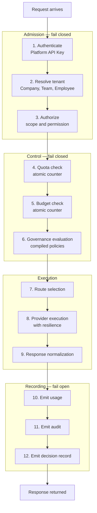
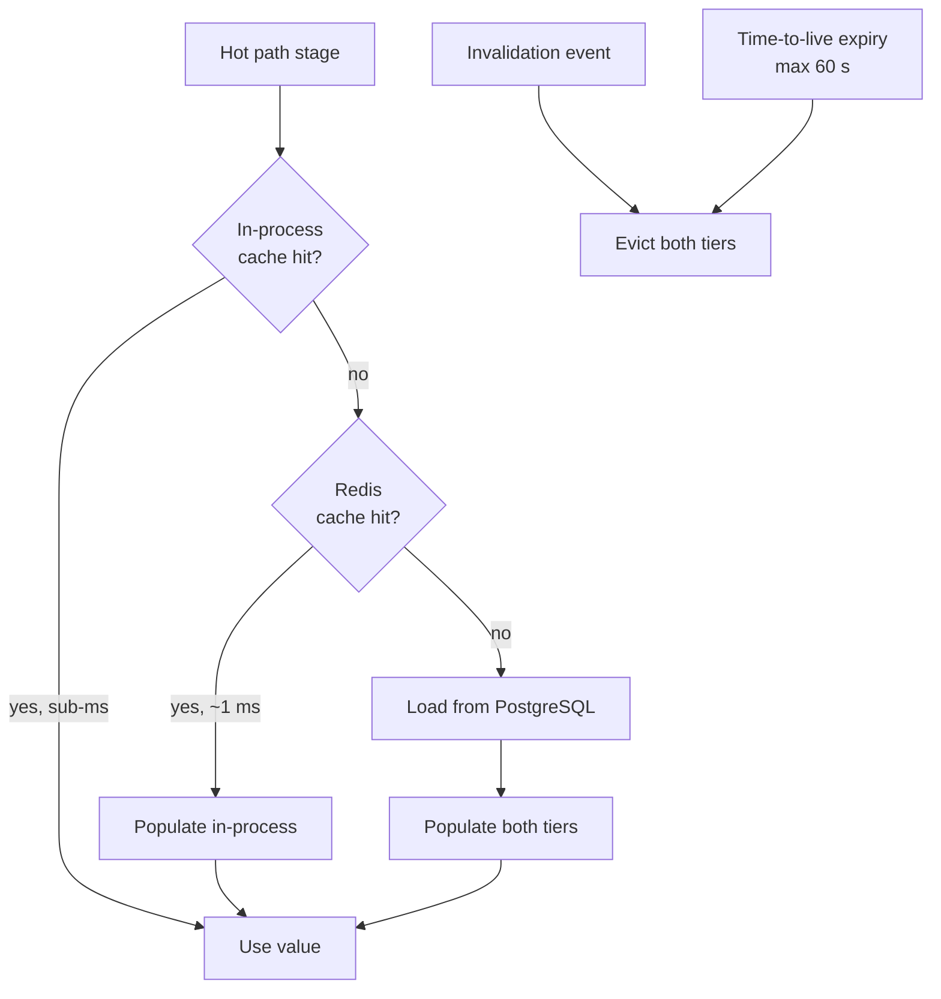
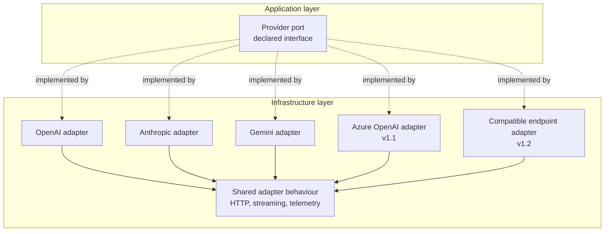
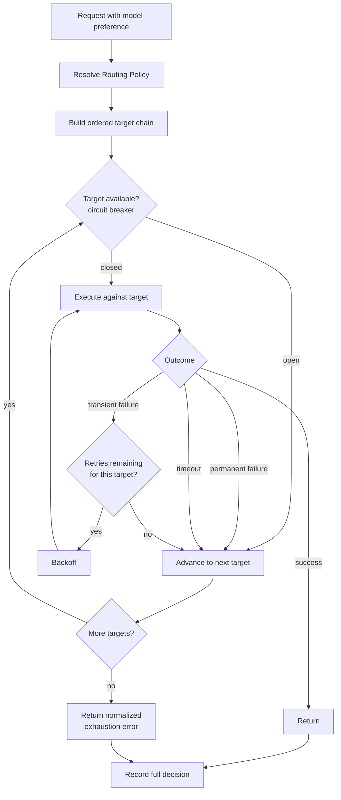
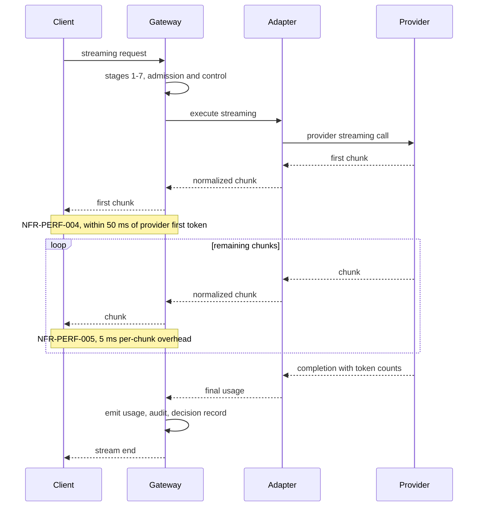
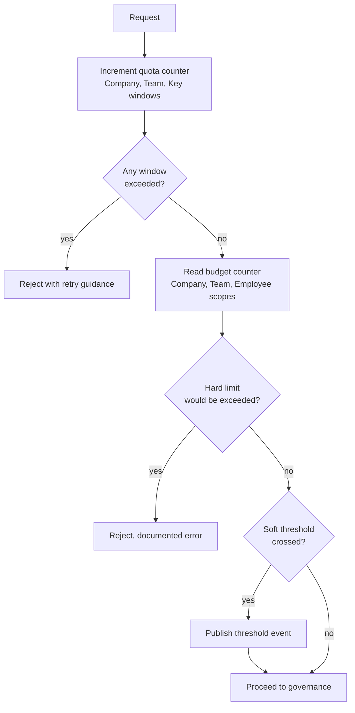
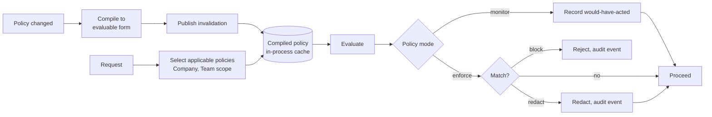
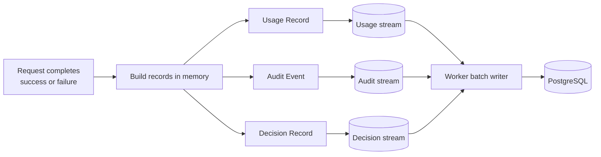

# AI Gateway Architecture

| Field | Value |
| --- | --- |
| Document | AI Gateway Architecture |
| Version | 1.0 |
| Status | Draft — latency budget requires prototype validation |
| Owner | Engineering |
| Last updated | 2026-07-30 |
| Audience | Backend Engineering, Architecture Review, Operations |
| Phase | 2 — System Architecture |

---

## 1. Purpose

The AI Gateway is the component through which all inference traffic passes. It sits in
the customer's production request path, which makes its latency, availability, and
failure behaviour the most consequential engineering constraints in the platform.

This document specifies its internal architecture: the hot path, the provider
abstraction, the resilience model, and how it satisfies a 15 ms median overhead budget
while enforcing authentication, authorization, quota, budget, and governance controls.

---

## 2. Scope

### 2.1 In scope

- Hot-path stage decomposition and the latency budget allocation
- Provider abstraction and adapter design
- Routing, fallback, retry, and circuit breaking
- Streaming architecture
- Quota and budget enforcement
- Governance evaluation placement
- Usage and audit emission
- Error normalization
- Cache design and invalidation
- Failure behaviour classification

### 2.2 Out of scope

| Excluded | Where |
| --- | --- |
| API surface, paths, payload shapes | `docs/04-api/` (Phase 3) |
| Usage and Cost record structure | `docs/03-database/` (Phase 3) |
| Identity mechanics | [`authentication-architecture.md`](authentication-architecture.md) |
| Horizontal scaling mechanics | [`scalability-strategy.md`](scalability-strategy.md) |
| Container topology | [`deployment-architecture.md`](deployment-architecture.md) |

### 2.3 Governing requirements

| Requirement | Constraint |
| --- | --- |
| NFR-PERF-001/002/003 | Overhead p50 ≤ 15 ms, p95 ≤ 50 ms, p99 ≤ 100 ms |
| NFR-PERF-004/005 | ≤ 50 ms to first token; ≤ 5 ms per streamed chunk |
| NFR-PERF-006/007/008 | Policy ≤ 20 ms, auth ≤ 10 ms, budget ≤ 5 ms |
| NFR-AVAIL-001 | ≥ 99.9% monthly |
| NFR-DATA-001/007 | Zero usage loss; never sampled |
| FR-GW-017/018 | Fail-open for metering; fail-closed for security and financial controls |
| FR-GW-011 | Every routing decision recorded and retrievable |
| FR-GW-004 | OpenAI-compatible interface enabling base-URL-only migration |

---

## 3. Architecture

### 3.1 Hot path stages

**Stages 1–6 execute before any provider call.** They constitute the platform's
overhead and must collectively fit within the budget. Stage 8 is provider time and is
excluded from the measurement per the definition in
[`../01-product/non-functional-requirements.md`](../01-product/non-functional-requirements.md)
§3.

**Stages 10–12 do not block the response.** They append to durable streams (AD-006) and
return immediately.

---

### 3.2 Latency budget allocation

The 15 ms p50 budget is allocated per stage. Exceeding an allocation is a defect, not a
tuning opportunity.

| Stage | Allocation p50 | Allocation p95 | Data source | NFR |
| --- | --- | --- | --- | --- |
| 1. Authenticate | 2 ms | 6 ms | In-process cache, Redis fallback | NFR-PERF-007 |
| 2. Resolve tenant | 1 ms | 3 ms | In-process cache | NFR-PERF-007 |
| 3. Authorize | 1 ms | 2 ms | In-process cache | NFR-PERF-007 |
| 4. Quota check | 1 ms | 2 ms | Redis atomic counter | NFR-PERF-008 |
| 5. Budget check | 1 ms | 3 ms | Redis atomic counter | NFR-PERF-008 |
| 6. Governance | 4 ms | 20 ms | Compiled policy, in-process | NFR-PERF-006 |
| 7. Route selection | 1 ms | 3 ms | In-process cache | — |
| 9. Normalization | 2 ms | 6 ms | In-memory | — |
| 10–12. Emission | 2 ms | 5 ms | Redis stream append | — |
| **Total** | **15 ms** | **50 ms** | | NFR-PERF-001/002 |

**There is no slack in this budget.** A single synchronous PostgreSQL query — connection
acquisition plus round-trip plus materialization — would consume most of the p50
allocation on its own. This is the entire justification for AD-005.

**Governance is the largest and riskiest allocation.** At 20 ms p95 it consumes 40% of
the total p95 budget. If policy evaluation cannot be made to fit, FR-GOV-015 forces a
choice between asynchronous evaluation — which weakens enforcement to detection — and a
wider latency budget. See §6, R-3.

---

### 3.3 Cache architecture

| Cached item | Owner module | Invalidated by | Max TTL |
| --- | --- | --- | --- |
| API key hash → key record | Identity | Key revocation, Employee deprovisioning | 60 s |
| Employee → Company, Teams, roles | Identity, Tenancy | Role change, membership change | 60 s |
| Key scopes | Identity | Key modification | 60 s |
| Routing policies | Gateway | Policy change | 60 s |
| Provider Connection metadata | Providers | Connection change, health change | 30 s |
| Model catalog entries | Providers | Catalog refresh | 300 s |
| Compiled governance policies | Governance | Policy change | 60 s |
| Model pricing | Usage | Pricing version change | 300 s |

**The 60-second ceiling is a security requirement, not a performance choice.**
FR-PERM-005 requires role changes to take effect within one minute, and FR-AUTH-010
requires the same of session termination. The time-to-live guarantees the requirement
holds even if the invalidation event is delayed or lost.

#### Revocation tombstones

Time-to-live alone is insufficient for revocation. A revoked key remaining valid for up
to 60 seconds is a real exposure — the P-07 persona's central requirement is that
deprovisioning revokes access *immediately*.

**Design:** revocation writes a tombstone to Redis with a lifetime exceeding the cache
time-to-live. Stage 1 checks the tombstone set on every cache hit. The check is a single
Redis set-membership operation, and the set is small because tombstones expire once the
cached entries they invalidate cannot exist.

**Cost:** one Redis round-trip per request that would otherwise be served entirely from
in-process memory. This is charged to the stage 1 allocation and is the reason it is
2 ms rather than sub-millisecond. It is worth the cost: FR-AUTH-018 is a security
requirement and a stated commitment to the P-07 persona.

---

### 3.4 Provider abstraction

**Port responsibilities** — the narrowest interface satisfying MVP requirements:

| Capability | Requirement | Notes |
| --- | --- | --- |
| Execute a completion | FR-GW-002 | Non-streaming |
| Execute a streaming completion | FR-GW-003 | Chunked |
| Report token usage | FR-GW-016 | Provider-reported where available, flagged when estimated |
| Classify errors | FR-GW-006 | Into the normalized taxonomy |
| Validate credentials | FR-PROV-005 | Used at connection creation |
| Report health | FR-PROV-006 | Used by the prober |
| Pass tool definitions | FR-GW-021 | Native fidelity preserved |

**Opaque parameter pass-through (AD-007).** Provider-specific parameters that the port
does not model are carried through as an opaque bag and applied by the adapter. This is
a deliberate leak in the abstraction: the P-08 persona requires access to
provider-specific behaviour, and a lowest-common-denominator interface would block them
from using the platform at all.

**What the adapter absorbs:** authentication scheme differences, request and response
shape translation, streaming protocol differences, token reporting location, error
classification, and retry-eligibility determination.

**What the adapter must never do:** make routing decisions, enforce policy, record
usage, or reach into another module. Adapters are translation only.

---

### 3.5 Routing and resilience

#### Retry versus fallback — a distinction the glossary makes normative

| | Retry | Fallback |
| --- | --- | --- |
| Target | The **same** provider target | The **next** target in the chain |
| Trigger | Transient failure: throttling, timeout, transient server error | Permanent failure, exhausted retries, or open circuit |
| Bound | Configurable attempt count with backoff | Length of the routing chain |
| Metric | Retry rate | Fallback rate |

Conflating them makes routing behaviour uninterpretable in analytics, which is why
[`../01-product/glossary.md`](../01-product/glossary.md) §4 defines them separately and
FR-ANL-003 reports them as distinct measures.

#### Circuit breaker

State is held per Provider Connection, in Redis so that it is shared across API host
instances — a target failing for one instance is failing for all of them, and each
instance rediscovering that independently multiplies customer-visible failures.

| State | Behaviour | Transition |
| --- | --- | --- |
| **Closed** | Traffic flows; failures counted in a rolling window | To open when the failure threshold is crossed |
| **Open** | Target skipped without attempt | To half-open after a cooldown |
| **Half-open** | A limited number of probe requests permitted | To closed on success; to open on failure |

**Interaction with the request timeout.** FR-GW-015 requires a configurable request
timeout, and FR-GW-011 requires fallback to complete within it. The chain must therefore
be time-budgeted as a whole: each attempt receives the remaining budget, not a fresh
one. A three-target chain each granted the full timeout would produce a request lasting
three times the customer's configured limit.

---

### 3.6 Streaming

**Constraints streaming imposes:**

| Constraint | Consequence |
| --- | --- |
| Per-chunk overhead ≤ 5 ms | No per-chunk allocation of significant size; no per-chunk logging; no per-chunk policy evaluation |
| Token counts arrive at the end | Usage cannot be emitted until the stream completes |
| A client may disconnect mid-stream | Usage must still be recorded for tokens already consumed — the provider will bill for them |
| Fallback is impossible after first byte | Once a chunk is sent, the response is committed to that target |

**The mid-stream disconnect case is a correctness requirement, not an edge case.** If
the platform discards usage when a client disconnects, cost attribution silently
under-reports and NFR-DATA-003's 2% tolerance is breached in a way that is difficult to
diagnose. The stream must be drained or the provider's partial usage captured.

**Fallback is impossible after the first byte.** This is worth stating explicitly
because it limits FR-GW-008: fallback protects against failure to *start* a response,
not failure part-way through. A provider that fails after streaming has begun produces a
truncated response, and the client must handle it. This should be documented in the
customer-facing failure-mode documentation required by NFR-AVAIL-015.

---

### 3.7 Quota and budget enforcement

Both are atomic counter operations in Redis, and both fail closed per AD-012.

**Budget checking has an inherent imprecision** worth stating rather than hiding. Cost
is known only after the response, because token counts are not known in advance. The
pre-request check therefore evaluates *accumulated* spend, not the projected cost of the
request in hand.

**Consequence:** a budget can be overshot by the cost of requests in flight when the
limit is reached. At high concurrency with expensive models this overshoot is not
negligible.

**Mitigations:** the counter is updated on completion, so overshoot is bounded by
in-flight concurrency rather than unbounded; a configurable reservation may be applied
against the maximum possible cost of a request given its token limits. Full elimination
would require pre-reserving worst-case cost per request, which would make budgets appear
exhausted far below their nominal limit.

**This should be disclosed in product documentation.** The P-05 persona treats a hard
limit as a hard limit. The bound must be stated.

---

### 3.8 Governance evaluation

**Policies are compiled on change, not interpreted per request.** Interpreting policy
definitions inside a 20 ms budget at NFR-SCAL-002 throughput is not viable. Compilation
happens on the management path when a policy is saved; the hot path evaluates a
prepared form held in process.

**Monitor mode is the default** per FR-GOV-002, and it costs the same as enforce mode —
the evaluation runs identically, only the action differs. This matters: customers must
be able to leave monitor mode enabled indefinitely without a performance penalty, or
[`../01-product/mission.md`](../01-product/mission.md) §4.3 becomes advice nobody
follows.

---

### 3.9 Error normalization

FR-GW-006 requires a stable taxonomy *while preserving the original*. Both survive to
the caller.

| Normalized category | Retry eligible | Fallback eligible | Typical origin |
| --- | --- | --- | --- |
| Authentication failure | No | No | Invalid Platform API Key |
| Authorization failure | No | No | Insufficient scope or permission |
| Quota exceeded | No — client should back off | No | Platform rate limit |
| Budget exceeded | No | No | Hard limit reached |
| Policy blocked | No | No | Governance enforcement |
| Invalid request | No | No | Malformed or unsupported parameters |
| Model unavailable | No | **Yes** | Deprecated or not permitted |
| Provider throttled | **Yes** | **Yes** | Provider-side rate limit |
| Provider unavailable | **Yes** | **Yes** | Provider outage or transient error |
| Context length exceeded | No | Only to a larger-context target | Input exceeds model limit |
| Content filtered by provider | No | No | Provider-side safety refusal |
| Timeout | **Yes** | **Yes** | Exceeded configured budget |
| Internal error | **Yes** | **Yes** | Platform fault |

**Retry and fallback eligibility is a property of the category, not a per-call
decision.** This keeps resilience behaviour deterministic and inspectable, which is what
the P-02 persona requires.

---

### 3.10 Usage, audit, and decision-record emission

**Every request emits all three, including failures.** A request rejected at stage 1
still produces an audit event; a request rejected at stage 5 still produces a usage
record marked as rejected. Only recording successful requests would make the ledger
useless for exactly the investigations it exists to support.

**Emission is fail-open with alerting** (AD-012). If the stream append fails, the
request still succeeds — a metering fault must never become a customer outage — but the
failure is recorded and alerted per FR-AUD-011 and NFR-DATA-008.

**The decision record** serves NFR-OBS-006 and FR-GW-011: target selected, alternatives
considered, circuit breaker states, retries with their causes, fallbacks with their
causes, and latency at each stage. It is written once and read rarely, which makes it a
good candidate for separate retention and tiering.

---

## 4. Design decisions

| # | Decision | Rationale |
| --- | --- | --- |
| **GD-001** | Hot path bypasses the dispatcher pipeline | The behaviour chain cannot fit a 15 ms budget; equivalent guarantees are implemented directly |
| **GD-002** | No synchronous relational access in the hot path | AD-005; a single query would consume most of the p50 allocation |
| **GD-003** | Revocation tombstones checked on every cache hit | Time-to-live alone leaves a 60 s revocation window, which fails FR-AUTH-018 |
| **GD-004** | Circuit breaker state shared in Redis, not per instance | Per-instance state multiplies customer-visible failures by instance count |
| **GD-005** | The routing chain shares one time budget | Per-attempt budgets would multiply the customer's configured timeout by chain length |
| **GD-006** | Policies compiled on change, evaluated from memory | Interpretation cannot fit the budget at target throughput |
| **GD-007** | Monitor mode costs the same as enforce mode | Otherwise customers disable it, defeating mission §4.3 |
| **GD-008** | Opaque provider parameter pass-through | A uniform abstraction would block the P-08 persona entirely |
| **GD-009** | Retry and fallback eligibility is a property of the error category | Makes resilience deterministic and inspectable for the P-02 persona |
| **GD-010** | All three record types emitted for failed requests too | A ledger that records only successes cannot support incident investigation |
| **GD-011** | Fallback is not attempted after the first byte is sent | Physically impossible to retract; must be documented rather than engineered around |
| **GD-012** | Budget overshoot bounded by in-flight concurrency, not eliminated | Elimination requires worst-case reservation, which would make budgets unusable |

---

## 5. Trade-offs

| # | Gained | Given up |
| --- | --- | --- |
| T-1 | Hot path meets the latency budget | A second code path with its own correctness obligations |
| T-2 | Cache-only reads make PostgreSQL non-blocking for inference | Cache correctness becomes a security property |
| T-3 | Tombstone check gives immediate revocation | One Redis round-trip on every request |
| T-4 | Shared circuit state prevents duplicated discovery | Redis becomes a hard dependency of resilience itself |
| T-5 | Opaque pass-through preserves provider capability | The abstraction is not uniform; some requests are provider-specific |
| T-6 | Compiled policies fit the budget | Policy changes take effect on invalidation, not instantly |
| T-7 | Stream-buffered emission keeps the response fast | A bounded durability window — AD-006 |
| T-8 | Whole-chain time budgeting respects the customer's timeout | Later targets in a chain may receive very little time |
| T-9 | Accumulated-spend budget checking is cheap | Overshoot bounded by concurrency rather than zero |

---

## 6. Risks

| # | Risk | Severity | Likelihood | Mitigation |
| --- | --- | --- | --- | --- |
| **R-1** | The 15 ms p50 budget proves unachievable with all stages enabled | **Critical** | Medium | Prototype the complete hot path before further scope is committed; targets are hypotheses until measured |
| **R-2** | Redis unavailability halts the Gateway through cache and counters simultaneously | **Critical** | Medium | Replication with failover; decision D-3 on degraded budget enforcement |
| **R-3** | Governance evaluation exceeds its 20 ms allocation as policies grow | High | **High** | Compilation; per-policy cost measurement; a policy-count limit per Company may be required |
| **R-4** | A stale cache entry permits a revoked key or role to remain effective | **Critical** | Medium | Tombstones; 60 s ceiling; invalidation event delivery monitored |
| **R-5** | Budget overshoot exceeds customer expectation of a hard limit | Medium | High | Bound documented and disclosed; optional reservation for high-value models |
| **R-6** | Mid-stream client disconnect loses usage, under-reporting cost | High | Medium | Stream drain or partial usage capture; reconciliation detects systematic divergence |
| **R-7** | Provider abstraction leaks as providers diverge, forcing per-provider branches into the router | Medium | High | Divergence absorbed in adapters; the port stays narrow; opaque pass-through carries the rest |
| **R-8** | Circuit breaker thresholds mis-tuned, removing healthy targets or retaining failing ones | Medium | Medium | Configurable per connection; observable state; failure-injection testing |
| **R-9** | Whole-chain time budgeting leaves the final target insufficient time to be useful | Medium | Medium | Minimum viable allocation per attempt; chain skipped rather than attempted with no budget |
| **R-10** | Decision record volume becomes a storage burden at scale | Medium | High | Separate retention; write-once tiering; NFR-SCAL-007 partitioning |

---

## 7. Future considerations

- **The hot path will need a latency regression gate.** NFR-PERF-018 requires
  continuously measured and published overhead. A benchmark that fails the build on
  regression is the only way this survives ongoing change.
- **Response-side governance is not yet designed.** Current evaluation covers egress.
  Evaluating completions under streaming has fundamentally different characteristics —
  content arrives incrementally and cannot be retracted once sent.
- **Embeddings and multimodal will stress the port.** Both arrive in v1.1 and neither
  fits the completion-shaped interface cleanly. The port may need to become a small
  family of capability-specific ports rather than one interface.
- **Caching responses (FR-GW-022) interacts with governance and metering.** A cache hit
  produces no provider cost but must still be metered, audited, and policy-evaluated.
  The semantics need deciding before implementation.
- **Agentic workloads change the timeout model.** A chain of dozens of calls under one
  logical operation cannot use a per-request timeout meaningfully.
- **Gateway extraction requires solving Governance co-location.** Two of its three
  synchronous dependencies sit inside the latency budget; a network hop would consume
  the entire allocation. Co-deployment is the likely answer.
- **Provider-side prompt caching changes cost calculation.** Several providers price
  cached input differently. The token reporting model must accommodate distinct token
  classes rather than a simple input and output pair — this affects Phase 3 schema
  design directly.

---

## 8. Cross references

| Document | Relationship |
| --- | --- |
| [`system-architecture.md`](system-architecture.md) | AD-005, AD-006, AD-007, AD-009, AD-012 |
| [`component-diagram.md`](component-diagram.md) | Gateway components and failure impact |
| [`authentication-architecture.md`](authentication-architecture.md) | Stages 1–3 in detail |
| [`request-flow.md`](request-flow.md) | End-to-end sequences through these stages |
| [`backend-architecture-overview.md`](backend-architecture-overview.md) | Why the hot path is exempt from the dispatcher |
| [`scalability-strategy.md`](scalability-strategy.md) | Throughput and connection scaling |
| [`deployment-architecture.md`](deployment-architecture.md) | Host topology and Redis availability |
| [`../01-product/product-requirements.md`](../01-product/product-requirements.md) | FR-GW-001 … FR-GW-025 |
| [`../01-product/non-functional-requirements.md`](../01-product/non-functional-requirements.md) | NFR-PERF, NFR-AVAIL, NFR-DATA |
| [`../01-product/glossary.md`](../01-product/glossary.md) | Retry, Fallback, Gateway Overhead, Fail Open/Closed |
| `../04-api/` | Phase 3 — the interface this Gateway exposes |
