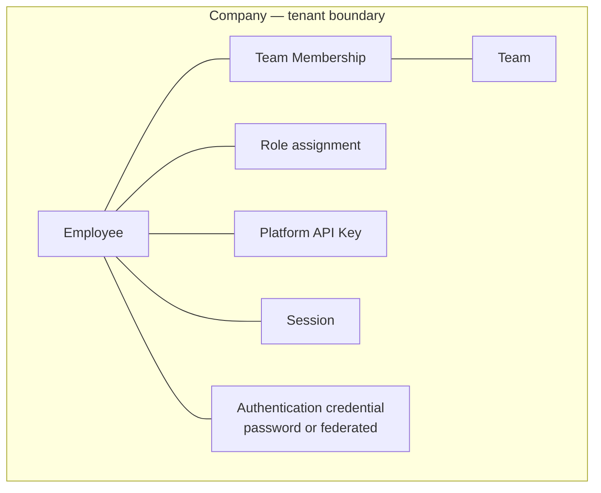
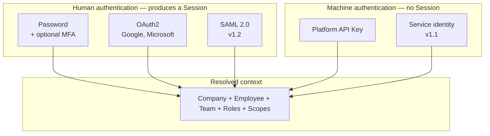
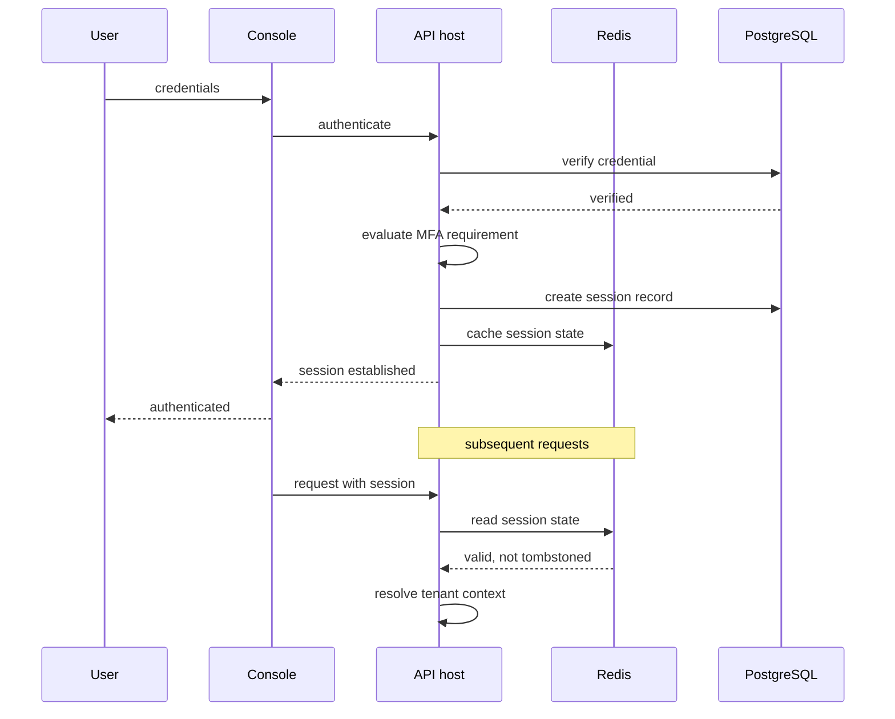
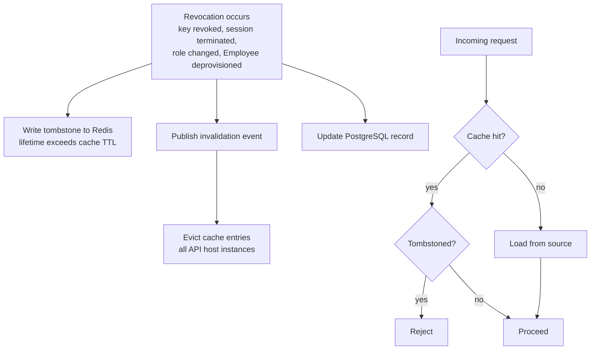
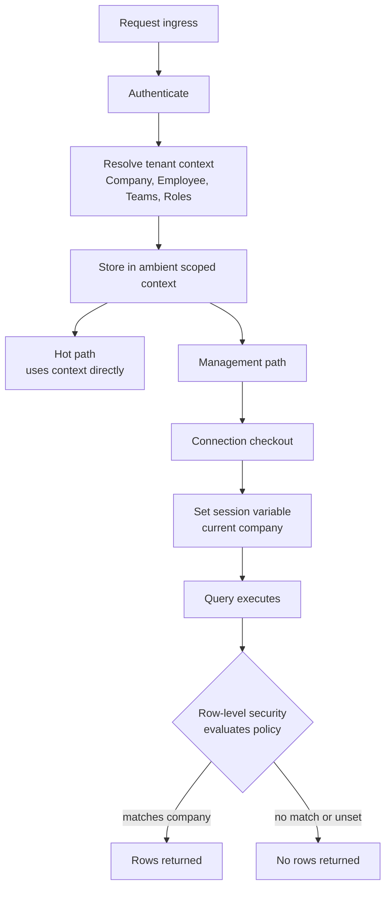
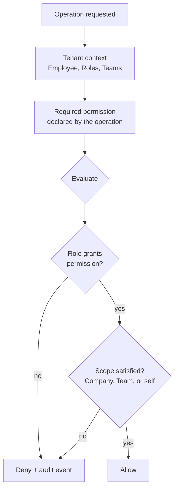
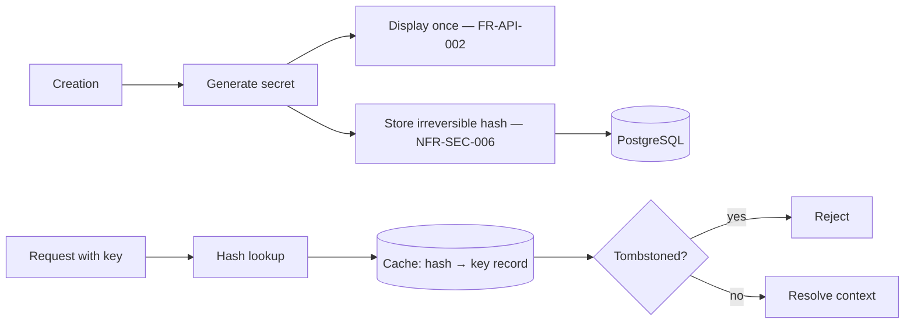
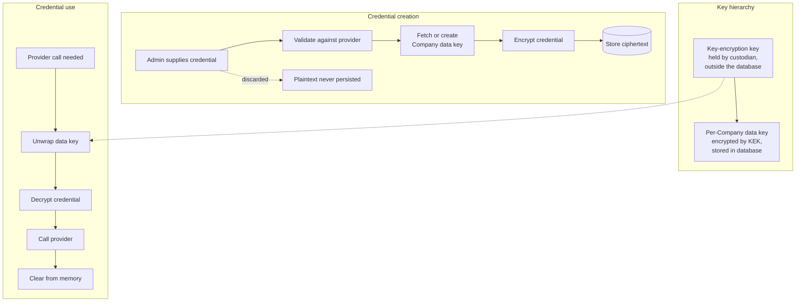
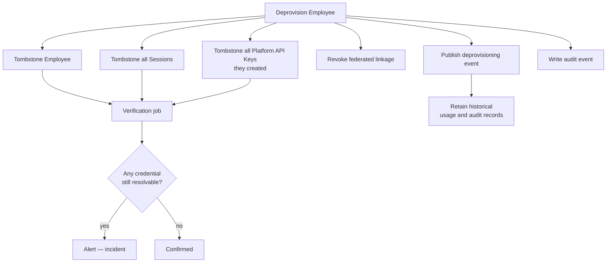

# Authentication and Identity Architecture

| Field | Value |
| --- | --- |
| Document | Authentication and Identity Architecture |
| Version | 1.0 |
| Status | Draft — AD-002 and AD-008 require ADR ratification |
| Owner | Engineering & Security |
| Last updated | 2026-07-30 |
| Audience | Backend Engineering, Security, Architecture Review |
| Phase | 2 — System Architecture |

---

## 1. Purpose

This document specifies how MaintOrbit AI establishes identity, enforces
authorization, isolates tenants, and protects the credentials it holds on customers'
behalf.

It covers the platform's highest-consequence security surface. The platform stores
Provider Credentials — secrets carrying direct spend authority and an unrestricted data
egress channel for every customer. A compromise there is existential rather than
embarrassing, and this document treats it accordingly.

---

## 2. Scope

### 2.1 In scope

- Authentication mechanisms: password, OAuth2, multi-factor, Platform API Keys
- Session lifecycle and revocation propagation
- Tenant context resolution and its enforcement below the application layer
- Authorization model and evaluation placement
- Provider Credential custody and envelope encryption
- Deprovisioning and complete revocation
- The forward path to SAML and SCIM

### 2.2 Out of scope

| Excluded | Where |
| --- | --- |
| Endpoint definitions, token formats on the wire | `docs/04-api/` (Phase 3) |
| Identity table and column design | `docs/03-database/` (Phase 3) |
| Gateway hot-path stage budgets | [`ai-gateway-architecture.md`](ai-gateway-architecture.md) |
| Network security, TLS configuration | [`deployment-architecture.md`](deployment-architecture.md) |

### 2.3 Governing requirements

| Requirement | Constraint |
| --- | --- |
| NFR-SEC-007 | Isolation enforced below the application layer |
| NFR-SEC-003/004/005 | Provider Credentials separately keyed, never retrievable, never logged |
| NFR-SEC-006 | Platform API Key secrets stored only as irreversible hashes |
| FR-AUTH-010 | Session termination propagates across all surfaces within 60 s |
| FR-AUTH-018 | Deprovisioning revokes every credential, including API keys |
| FR-PERM-001/002/007 | Deny-by-default, enforced at execution, evaluable without cross-Company data |
| NFR-PERF-007 | Authentication and authorization ≤ 10 ms p95 |

---

## 3. Architecture

### 3.1 Identity model

**Invariants:**

| # | Invariant | Requirement |
| --- | --- | --- |
| I-1 | An Employee belongs to exactly one Company, permanently | FR-TEN-001 |
| I-2 | There is no cross-Company identity; a person in two Companies has two Employees | Glossary §2 |
| I-3 | A Platform API Key belongs to exactly one Employee and is scoped to one Team | FR-API-001 |
| I-4 | A Session belongs to exactly one Employee | FR-AUTH-007 |
| I-5 | Every Role assignment is Company-scoped | §6.1 of the PRD |
| I-6 | Exactly one Owner exists per Company at all times | FR-TEN-012 |

Invariant I-2 is a simplification with a cost — a consultant working with several
customers maintains several accounts. It is chosen deliberately: cross-tenant identity
is the source of a large share of multi-tenant authorization defects, and the platform's
security posture is worth more than that convenience.

---

### 3.2 Authentication mechanisms

| Mechanism | Surfaces | Produces | Release |
| --- | --- | --- | --- |
| Password with strength and breach checking | Console | Session | MVP |
| OAuth2 authorization code with PKCE | Console, Extension | Session | MVP |
| TOTP multi-factor | Console | Session step-up | MVP |
| Platform API Key | Gateway, Developer API | Request-scoped context | MVP |
| SAML 2.0 | Console | Session | v1.2 |
| SCIM provisioning | Administrative | Employee lifecycle | v1.2 |
| Service identity | Gateway | Request-scoped context | v1.1 |

**A request carries a Session or a Platform API Key, never both.** Accepting either on
the same path invites confused-deputy defects, where a request authorized under one
identity performs work attributed to another. The Gateway accepts keys; the console
accepts sessions; the Extension exchanges an OAuth2 flow for a session-derived
credential rather than asking the developer to paste a key (FR-EXT-001).

---

### 3.3 Session architecture

| Property | Design | Requirement |
| --- | --- | --- |
| Storage | PostgreSQL is the record; Redis is the read path | NFR-PERF-007 |
| Inactivity expiry | Configurable per Company | FR-AUTH-007 |
| Absolute lifetime | Configurable per Company, independent of activity | FR-AUTH-007 |
| Enumeration | An Employee can list and terminate their own sessions | FR-AUTH-008 |
| Administrative termination | A Company Admin can terminate any Employee's sessions | FR-AUTH-009 |
| Propagation | Termination effective across all surfaces within 60 s | FR-AUTH-010 |
| Invalidation triggers | Password change, role change, administrative termination | NFR-SEC-017 |

**Access token lifetime is bounded at 15 minutes**, with refresh against the session
record. This bounds the window in which a stolen token remains useful without forcing
re-authentication every fifteen minutes. Refresh consults the session state, so
termination takes effect at the next refresh at latest.

---

### 3.4 Revocation propagation — the tombstone mechanism

This is the most subtle part of the identity architecture, and the part most likely to
be got wrong.

**The problem.** AD-005 requires the Gateway to serve authentication from cache with no
relational read. A cached key or session record therefore remains usable until its
entry expires. FR-AUTH-010, FR-AUTH-018, and FR-PERM-005 require revocation to be
effective within one minute — and the P-07 persona's stated abandonment trigger is
discovering that a deprovisioned employee's API key still works.

**Three mechanisms, deliberately redundant:**

| Mechanism | Speed | Fails if |
| --- | --- | --- |
| Tombstone check on cache hit | Immediate | Redis unavailable — but then the Gateway is down anyway, so the failure is safe |
| Invalidation event | Sub-second typically | Event delivery delayed or lost |
| Cache time-to-live ceiling of 60 s | ≤ 60 s | Never — it is a hard bound |

The redundancy is intentional. Revocation is a security control where partial failure
is unacceptable, and each mechanism fails in a different way.

**Tombstone lifetime must exceed the maximum cache time-to-live** — otherwise a
tombstone could expire while a stale cache entry survives, reopening the window. It is
set to twice the ceiling.

**Deprovisioning cascade (FR-AUTH-018):** deprovisioning an Employee writes tombstones
for the Employee, every Session they hold, and every Platform API Key they created — not
only the Employee record. A key outliving its creator is precisely the defect the P-07
persona expects to find and is a common gap in comparable platforms.

---

### 3.5 Tenant context resolution and enforcement

**This is the single most important security mechanism in the platform.**

**Two layers of enforcement, per AD-002:**

| Layer | Mechanism | Catches |
| --- | --- | --- |
| Application | Global query filter on tenant-scoped entities | Ordinary queries; provides good error behaviour |
| **Database** | **Row-level security policy on every tenant-scoped relation** | **Everything the application layer misses, including raw SQL and forgotten filters** |

NFR-SEC-007 requires that an application-layer defect cannot cause cross-tenant
exposure. Only the database layer satisfies that literally, which is why AD-002 selects
row-level security despite its cost.

**The failure direction is correct.** If the session variable is not set, policies match
nothing and queries return no rows. A missing tenant context produces an empty result,
never an unfiltered one — the failure is visible and safe rather than silent and
catastrophic.

**Paths requiring particular care:**

| Path | Risk | Handling |
| --- | --- | --- |
| Hangfire jobs | No inbound request to derive context from | Job payload carries the Company; the worker establishes context explicitly before any data access |
| Analytics aggregation | Uses direct SQL, bypassing EF filters | Row-level security still applies; this is precisely why it exists |
| Platform administration | Legitimately spans Companies | Requires an explicitly elevated database role, used only in named audited paths |
| Outbox relay | Processes events across Companies | Runs elevated; each event's handler re-establishes its own Company context |
| SignalR group membership | Client could request another Company's group | Group names derived server-side from resolved context only — never from client input |

**The elevated role is the residual risk.** Any path using it operates without
row-level protection. Its use must be rare, named, reviewed, and audited. An
architecture test asserting which code paths may request elevation is warranted.

---

### 3.6 Authorization model

| Property | Design | Requirement |
| --- | --- | --- |
| Default | Deny — no explicit grant means refusal | FR-PERM-002 |
| Evaluation point | At execution, in the behaviour pipeline; never only at transport | FR-PERM-001 |
| Multiple roles | Union of permissions | FR-PERM-003 |
| Denial | Always produces an audit event | FR-PERM-004 |
| Effective time | Within 60 s without re-authentication | FR-PERM-005 |
| Tenant coupling | Evaluable using only the current Company's data | FR-PERM-007 |

**Roles are presets over permissions, not hard-coded branches.** FR-PERM-006 introduces
custom roles at v2.0. If authorization is implemented as conditionals over a closed role
enumeration, that requirement becomes a rewrite. Implementing roles as named permission
sets from the start makes it a data change.

**Three scope dimensions** must be evaluated together — a Team Lead may modify Budgets,
but only for their own Teams:

| Scope | Meaning |
| --- | --- |
| Company | Applies across the whole Company |
| Team | Applies only to specified Teams |
| Self | Applies only to the acting Employee's own resources |

**Platform API Key scopes are a second, independent gate.** A key held by an Owner
still cannot exceed the scopes it was issued with. Effective permission is the
intersection of the Employee's role permissions and the key's scopes — never the union.

---

### 3.7 Platform API Key architecture

| Property | Design | Requirement |
| --- | --- | --- |
| Secret storage | Irreversible hash only; plaintext never persisted | NFR-SEC-006 |
| Display | Once at creation; unrecoverable thereafter | FR-API-002 |
| Lookup | By hash, cached, tombstone-checked | NFR-PERF-007 |
| Expiry | Optional, with advance notification | FR-API-003 |
| Revocation | Immediate, by creator, Team Lead, or Company Admin | FR-API-004 |
| Scopes | Restrict capabilities independently of role | FR-API-005 |
| Usage tracking | Last-used time and volume recorded | FR-API-006 |
| Cascade revocation | Automatic on creator deprovisioning | FR-API-016 |

**Lookup must be constant-time with respect to the number of keys.** A key is presented
as an opaque secret; the platform must find its record without scanning. This requires
the key to carry a non-secret identifying prefix used for lookup, with the secret
portion verified against the stored hash — a structural property that must be decided
before Phase 3, because it shapes the stored representation.

**Last-used tracking must not become a write per request.** At NFR-SCAL-002 throughput,
updating a timestamp per request would add a database write to the hot path, violating
AD-005. It is derived from usage records or updated at a coarse granularity instead.

---

### 3.8 Provider Credential custody

The platform's highest-value asset. AD-008 governs.

| Property | Design | Requirement |
| --- | --- | --- |
| Encryption | Envelope: per-Company data key, wrapped by a key-encryption key | NFR-SEC-003 |
| Key separation | Distinct from keys protecting general application data | NFR-SEC-003 |
| Retrieval | No code path returns plaintext to any interface, for any Role | NFR-SEC-004, FR-PROV-004 |
| Logging | Excluded from logs, traces, and error output by construction | NFR-SEC-005 |
| Rotation | Per-Company data key rotatable without customer interruption | NFR-SEC-019 |
| Custodian | Pluggable; portable default required | NFR-PORT-002 |

**Blast radius.** Per-Company data keys mean compromise of one data key exposes one
Company's credentials. Compromise of the key-encryption key exposes all of them — which
is why it lives outside the database, in a custodian with its own access controls and
audit trail.

**The custodian must be pluggable, and the portable implementation must be the
default in development and CI.** NFR-PORT-002 forbids a runtime dependency that cannot
run in a customer environment. If the cloud-backed custodian is the only one ever
exercised, the portable path will be broken when v2.1 self-hosted deployment needs it —
and that will be discovered at the worst possible time. Running the portable custodian
by default is the only reliable guard.

**No retrieval path exists in code.** FR-PROV-004 is satisfied structurally rather than
by permission: the decryption function is reachable only from the provider execution
path and returns a handle used for a call, not a value returned to a caller. There is no
"reveal credential" operation to accidentally expose.

---

### 3.9 Deprovisioning

FR-AUTH-018 and the P-07 persona require that deprovisioning revokes everything,
verifiably.

**Records are retained, access is revoked.** FR-TEN-008 requires historical usage and
audit records to survive removal, attributed to the removed identity. Deletion of an
Employee never deletes their ledger history — that would corrupt cost attribution and
break the audit trail.

**The verification job is not optional.** A deprovisioning that silently fails to
revoke one credential is exactly the failure the P-07 persona treats as disqualifying.
Verification turns an assumption into a check.

---

### 3.10 Forward path to SAML and SCIM

Both arrive in v1.2. The architecture must not preclude them.

| Requirement | Design implication now |
| --- | --- |
| FR-AUTH-015 — SAML SSO | Authentication mechanism must be pluggable per Company, not global |
| FR-AUTH-016 — SCIM provisioning | Employee lifecycle must be driveable by an external system, so all lifecycle transitions must exist as first-class operations rather than console-only flows |
| FR-AUTH-017 — group mapping | Role and Team assignment must be expressible as data derived from an external group, not only as manual assignment |
| FR-AUTH-004 — restrict methods | Company-level authentication policy must exist at MVP even though only some methods do |

**The costly mistake would be treating console-driven Employee management as the only
path.** If invitation, role assignment, and deprovisioning exist only as console flows
rather than as operations, SCIM becomes a rewrite of the identity module. Building them
as operations from the start makes SCIM an adapter.

---

## 4. Design decisions

| # | Decision | Rationale |
| --- | --- | --- |
| **AU-001** | No cross-Company identity | Eliminates a large class of multi-tenant authorization defects; the cost is duplicate accounts for consultants |
| **AU-002** | A request carries a Session or a Platform API Key, never both | Prevents confused-deputy defects |
| **AU-003** | Revocation uses tombstones, events, and a TTL ceiling together | Revocation is a control where partial failure is unacceptable; each mechanism fails differently |
| **AU-004** | Tombstone lifetime is twice the cache TTL ceiling | Prevents a tombstone expiring while a stale entry survives |
| **AU-005** | Tenant isolation enforced at the database, not only the application | NFR-SEC-007 requires resilience to application defects |
| **AU-006** | Missing tenant context yields no rows, never unfiltered rows | The failure direction must be safe |
| **AU-007** | Roles are presets over permissions | FR-PERM-006 becomes a data change rather than a rewrite |
| **AU-008** | Effective permission is the intersection of role and key scope | A powerful Employee must not silently confer power on a narrow key |
| **AU-009** | No code path returns Provider Credential plaintext | Satisfies FR-PROV-004 structurally rather than by permission |
| **AU-010** | Portable key custodian is the default in development and CI | The only reliable guard for NFR-PORT-002 |
| **AU-011** | Deprovisioning is verified by a job, not assumed | Turns the P-07 persona's stated requirement into a check |
| **AU-012** | Employee lifecycle transitions are operations, not console flows | Makes SCIM an adapter rather than a rewrite |
| **AU-013** | Key last-used tracking is derived or coarse, never a per-request write | A per-request write would violate AD-005 |

---

## 5. Trade-offs

| # | Gained | Given up |
| --- | --- | --- |
| T-1 | No cross-Company identity removes a defect class | Multi-Company users maintain multiple accounts |
| T-2 | Row-level security survives application defects | Query-planning cost; connection-pooling complexity; an elevated role that bypasses it |
| T-3 | Tombstones give near-immediate revocation | A Redis round-trip on every otherwise in-process cache hit |
| T-4 | Redundant revocation mechanisms | Three things to maintain and test rather than one |
| T-5 | Envelope encryption bounds blast radius per Company | Key management complexity; a custodian dependency |
| T-6 | Permission presets accommodate custom roles later | More indirection than role conditionals today |
| T-7 | Short access token lifetime bounds theft value | More refresh traffic |
| T-8 | Lifecycle-as-operations enables SCIM cheaply | More surface than console flows alone would need |

---

## 6. Risks

| # | Risk | Severity | Likelihood | Mitigation |
| --- | --- | --- | --- | --- |
| **R-1** | Key-encryption key compromise exposes every Company's Provider Credentials | **Critical** | Low | Custodian outside the database with independent access control and audit; rotation capability; dedicated threat model |
| **R-2** | A code path using the elevated database role leaks cross-tenant data | **Critical** | Medium | Elevation restricted to named paths; architecture test enumerating them; every use audited |
| **R-3** | Cache invalidation defect leaves a revoked credential effective | **Critical** | Medium | Three redundant mechanisms; verification job; tombstone lifetime exceeds TTL |
| **R-4** | Row-level security interacts badly with connection pooling, leaking context between requests | **Critical** | Medium | Session variable set at checkout and cleared at return; prototype before Phase 3 — decision D-1 |
| **R-5** | Deprovisioning misses a credential type added later | High | Medium | Verification job enumerates credential types generically rather than by list |
| **R-6** | SignalR group membership derived from client input allows cross-tenant subscription | High | Low | Server-side derivation only; architecture test |
| **R-7** | Portable key custodian is never exercised and is broken when v2.1 needs it | Medium | **High** | Portable custodian is the default in development and CI, not an alternative |
| **R-8** | Authorization implemented as role conditionals, making custom roles a rewrite | Medium | Medium | Permission presets from the start; review gate on new authorization code |
| **R-9** | Key lookup requires a scan as key volume grows | Medium | Medium | Non-secret identifying prefix; structural decision required before Phase 3 |

---

## 7. Future considerations

- **SAML and SCIM will test AU-012.** Whether Employee lifecycle was built as
  operations or as console flows determines whether v1.2 is an adapter or a rewrite.
  This is decided now, by how MVP is built, not later.
- **Customer-managed encryption keys (NFR-SEC-020) extend the custodian abstraction.**
  If the custodian is genuinely pluggable, this is a new implementation; if the
  cloud-backed path has been assumed anywhere, it is a redesign.
- **Self-hosted deployment changes the trust boundary.** The customer holds the
  key-encryption key, which improves their posture and removes our ability to assist in
  recovery. The operational consequences need documenting before v2.1.
- **Hardware security keys (FR-AUTH-020) require a distinct credential model.**
  Origin-bound credentials do not fit the shared-secret shape of TOTP.
- **Service identities (FR-AUTH-019) need an ownership model.** A credential with no
  human owner has no deprovisioning trigger — the mechanism that makes FR-AUTH-018 work.
  An expiry and attestation model is required instead.
- **Row-level security may need reconsideration for analytics.** If risk R-4 in
  [`system-architecture.md`](system-architecture.md) materializes, the answer is
  pre-aggregated projections rather than abandoning database-enforced isolation.
- **Cross-Company identity may become unavoidable.** If a parent-organization construct
  arrives (FR-TEN-016), AU-001 requires revisiting — and that would be a significant
  security-model change, not an incremental feature.

---

## 8. Cross references

| Document | Relationship |
| --- | --- |
| [`system-architecture.md`](system-architecture.md) | AD-002 tenancy, AD-005 caching, AD-008 credential encryption |
| [`ai-gateway-architecture.md`](ai-gateway-architecture.md) | Hot-path stages 1–3 and the tombstone check |
| [`component-diagram.md`](component-diagram.md) | Identity and access components |
| [`request-flow.md`](request-flow.md) | Authentication and authorization in sequence |
| [`backend-architecture-overview.md`](backend-architecture-overview.md) | Tenant interceptor and authorization behaviour |
| [`deployment-architecture.md`](deployment-architecture.md) | Network security and TLS |
| [`../01-product/product-requirements.md`](../01-product/product-requirements.md) | FR-AUTH, FR-PERM, FR-API, FR-PROV |
| [`../01-product/non-functional-requirements.md`](../01-product/non-functional-requirements.md) | NFR-SEC, NFR-PRIV |
| [`../01-product/user-personas.md`](../01-product/user-personas.md) | P-06 and P-07 requirements driving this design |
| `../07-adr/` | Ratification of AD-002 and AD-008 |
