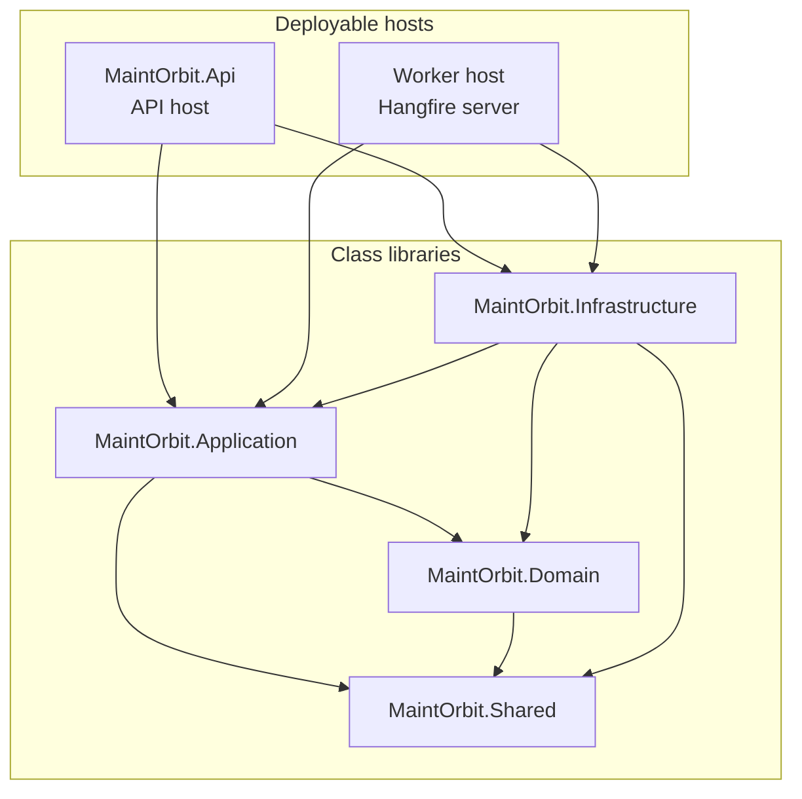
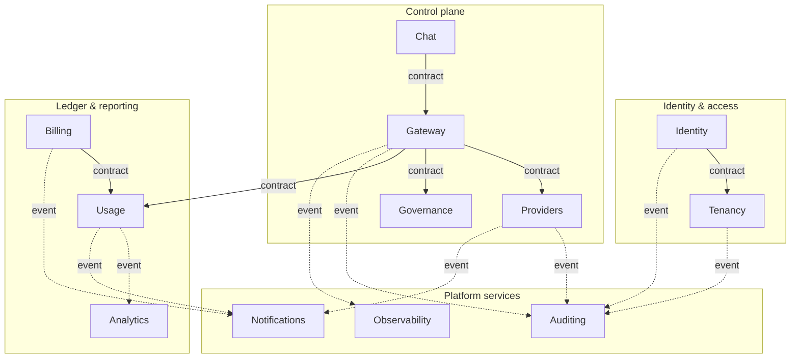
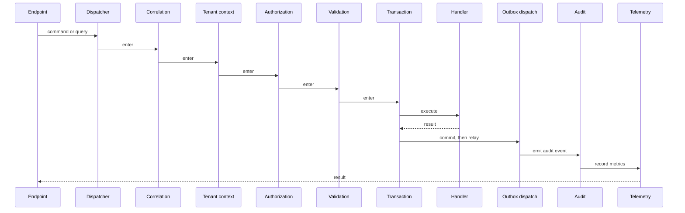
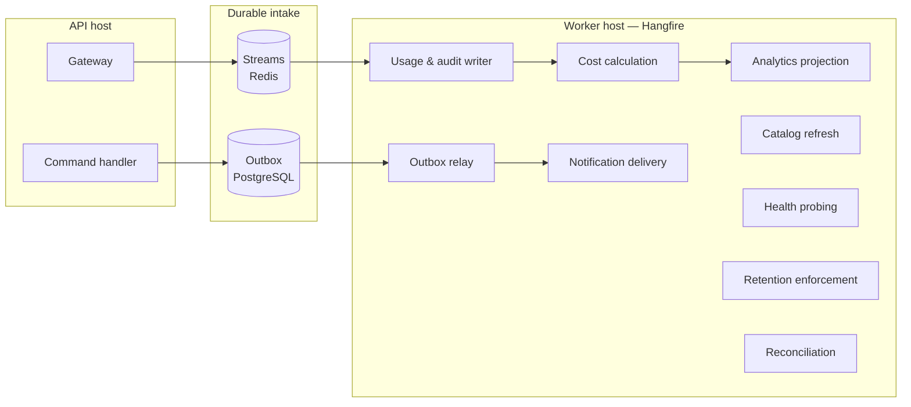
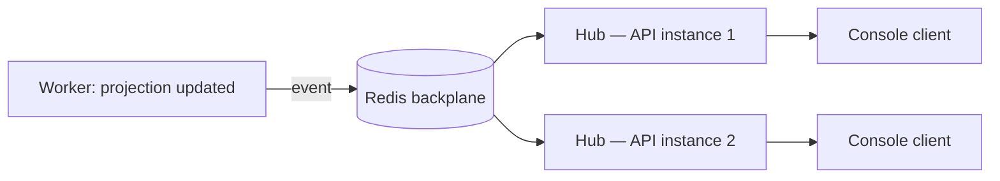
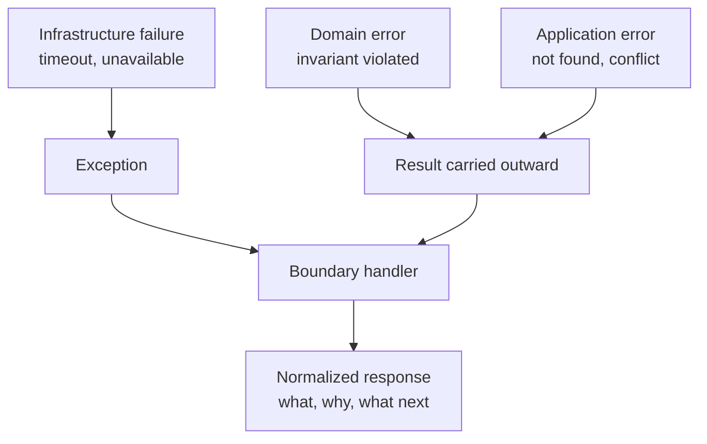

# Backend Architecture Overview

| Field | Value |
| --- | --- |
| Document | Backend Architecture Overview |
| Version | 1.0 |
| Status | Draft — pending engineering review |
| Owner | Engineering |
| Last updated | 2026-07-30 |
| Audience | Backend Engineering, Architecture Review |
| Phase | 2 — System Architecture |

---

## 1. Purpose

This document describes how the ASP.NET Core 9 backend is organized: the five
projects, the twelve modules within them, the request pipeline, the persistence
approach, and the rules that keep modules independently extractable.

It elaborates §3.3 and §3.4 of
[`system-architecture.md`](system-architecture.md) and is bound by every decision
recorded there.

**No implementation code, API definitions, or database schema appear here.**

---

## 2. Scope

### 2.1 In scope

- Project structure and the dependency rule
- Module anatomy and interaction patterns
- CQRS dispatch and the behaviour pipeline
- Persistence approach and the unit-of-work boundary
- Domain modelling conventions
- Background processing structure
- Real-time delivery structure
- Error handling and result propagation
- Testing structure

### 2.2 Out of scope

| Excluded | Where |
| --- | --- |
| Table, column, and index design | `docs/03-database/` |
| Endpoint definitions and payloads | `docs/04-api/` |
| Gateway hot-path internals | [`ai-gateway-architecture.md`](ai-gateway-architecture.md) |
| Identity mechanics | [`authentication-architecture.md`](authentication-architecture.md) |
| Container and host topology | [`deployment-architecture.md`](deployment-architecture.md) |

---

## 3. Architecture

### 3.1 Project structure and the dependency rule



> **Note on hosts.** Both the API host and the Worker host are composition roots over
> the same libraries. The Worker is not a separate project in the Phase 0 structure; it
> is a distinct entry point and container built from the same solution. This keeps
> handler logic shared and prevents divergence between foreground and background paths.

| Project | Contains | May reference | Must never contain |
| --- | --- | --- | --- |
| **Domain** | Entities, value objects, aggregates, domain events, invariants, repository interfaces, domain services, specifications | `Shared` only | EF Core types, HTTP types, provider SDKs, `IServiceProvider` |
| **Application** | Commands, queries, handlers, validators, port interfaces, pipeline behaviours, mapping configuration | `Domain`, `Shared` | Concrete persistence, concrete provider clients, transport concerns |
| **Infrastructure** | EF Core contexts and configurations, repository implementations, provider adapters, cache, messaging, external clients | `Application`, `Domain`, `Shared` | Business rules, invariant enforcement |
| **Api** | Composition root, endpoints, hubs, middleware, filters, health checks | `Application`, `Infrastructure`, `Shared` | Business logic of any kind |
| **Shared** | Result types, primitives, tenancy context abstraction, published contracts, time abstraction | Nothing | Module-specific types |

**Why Infrastructure depends on Application.** Ports are declared in `Application` and
implemented in `Infrastructure`. This inversion is what keeps `Domain` and
`Application` free of persistence concerns and is the property that makes the domain
testable without a database.

Verified by architecture tests per AD-013 — see §8.

---

### 3.2 Module anatomy

Every module has the same shape in every layer. Uniformity is deliberate: a developer
who has worked in one module can navigate any other.

```
Domain/Modules/<Module>/
    Entities/          aggregate roots and entities
    ValueObjects/      immutable domain values
    Enums/
    Events/            domain events, raised within the aggregate
    Errors/            typed domain errors
    Repositories/      interfaces only
    Services/          domain services where logic spans aggregates
    Specifications/    reusable query predicates

Application/Modules/<Module>/
    Commands/          state-changing use cases
    Queries/           read use cases
    Contracts/         DTOs and published cross-module contracts
    Validators/        FluentValidation rules
    Mappings/          Mapster configuration
    EventHandlers/     domain and integration event handlers
    Interfaces/        ports this module requires
    Jobs/              background job definitions

Infrastructure/Modules/<Module>/
    Persistence/Configurations/    EF Core entity configuration
    Persistence/Repositories/      repository implementations
    Services/                      port implementations

Api/Endpoints/<Module>/            transport surface
```

#### Public surface versus internals

| Element | Visibility | Rule |
| --- | --- | --- |
| `Contracts/` | **Public across modules** | The only types another module may reference |
| Integration events | **Public across modules** | Versioned; carry identifiers and primitives only |
| Entities, value objects | **Module-internal** | Never cross a module boundary |
| Repositories | **Module-internal** | Never resolved outside the owning module |
| Commands and queries | **Module-internal** | Another module calls a contract, not a handler |

---

### 3.3 Module map and interaction



Solid arrows are synchronous contract calls. Dashed arrows are integration events.

**Observations that constrain design:**

- **Gateway is the busiest caller.** It synchronously depends on Providers, Governance,
  and Usage. All three must be satisfiable from cache — see AD-005.
- **Auditing has no outbound dependencies.** It only consumes. This makes it the
  easiest module to extract and the safest to make asynchronous.
- **Analytics only consumes events.** It holds no authoritative state; its store is a
  projection that can be rebuilt from Usage. This is what permits it to use a different
  storage technology later without a migration.
- **Chat depends on Gateway, not on Providers.** Chat never talks to a provider
  directly, which is what makes FR-CHAT-007 — chat traffic governed identically to API
  traffic — structural rather than a matter of discipline.

---

### 3.4 CQRS and the behaviour pipeline

Per AD-004, dispatch uses an in-house abstraction. Every request passes through an
ordered behaviour chain before reaching its handler.



**Ordering is a correctness property, not a preference:**

| Position | Behaviour | Why here |
| --- | --- | --- |
| 1 | Correlation | Everything downstream must be able to log with the identifier |
| 2 | Tenant context | Authorization and data access both depend on it |
| 3 | Authorization | Must precede validation so an unauthorized caller learns nothing about the shape of valid input |
| 4 | Validation | Must precede the transaction so invalid input never opens one |
| 5 | Transaction | Commands only; queries never open a write transaction |
| 6 | Handler | — |
| 7 | Outbox relay | Must follow commit so events are never published for rolled-back work |
| 8 | Audit | Records the outcome, including failure, so it must observe the handler's result |
| 9 | Telemetry | Outermost measurable boundary |

**Commands and queries differ.** Commands open a transaction and may raise domain
events. Queries do not open a write transaction, do not participate in the outbox, and
may bypass the domain entirely to read a projection directly — the latter matters for
Analytics, where reconstructing aggregates to produce a chart is waste.

---

### 3.5 Domain modelling conventions

| Convention | Statement | Rationale |
| --- | --- | --- |
| Aggregate roots enforce invariants | State changes go through the root, never through a child entity | Prevents inconsistent partial updates |
| Entities are never constructed invalid | Creation is via a factory method returning a result, not a public constructor | An invalid entity should be unrepresentable |
| Value objects for meaningful values | Money, token counts, identifiers, email addresses | Prevents primitive-obsession defects such as confusing input and output token counts |
| Domain events raised inside the aggregate | Dispatched after commit, never during | An event for an uncommitted change is a lie |
| Errors are returned, not thrown | Result types for expected failure; exceptions for the genuinely exceptional | Expected failures are control flow and should be visible in signatures |
| No lazy loading | All loading is explicit | Prevents surprise queries in a latency-budgeted path |

**Money is the sharpest case.** Cost calculations must satisfy NFR-DATA-003 at ≤2%
variance. Floating-point representation for currency is a defect waiting for a
month-end reconciliation to expose it, so monetary values are a value object over a
decimal representation, with the currency carried alongside.

---

### 3.6 Persistence approach

**Entity Framework Core** is the primary data access technology, with a deliberate
exception.

| Path | Technology | Rationale |
| --- | --- | --- |
| Command-side writes | EF Core with change tracking | Aggregate integrity, unit of work, interceptors |
| Management-side reads | EF Core, no tracking, projected | Simplicity; volumes are modest |
| Analytics aggregation | Direct SQL over projections | Aggregations over hundreds of millions of rows are not an ORM's strength |
| Usage and audit ingestion | Batched insert from the Worker | AD-006; row-by-row insertion cannot meet the throughput |
| Gateway hot path | **No relational access** | AD-005 |

#### Unit of work and transaction boundary

The transaction boundary is the command. One command, one transaction, one commit. A
handler that needs to span modules does not open a distributed transaction — it commits
its own work and publishes an integration event, and the consuming module reconciles.

**This is eventual consistency between modules, by design.** It is the price of
AD-014's extraction path, and it must be visible in the product: for example, a Budget
threshold crossing may be detected shortly after the request that crossed it rather
than during it. FR-COST-008's alert-only default and the freshness disclosure of
FR-ANL-008 exist partly because of this.

#### Interceptors

Cross-cutting persistence concerns are handled by EF Core interceptors rather than by
handler code:

| Interceptor | Responsibility | Requirement |
| --- | --- | --- |
| Tenant context | Sets the session variable used by row-level security at connection checkout | NFR-SEC-007, AD-002 |
| Auditing metadata | Stamps creation and modification metadata | FR-AUD-002 |
| Domain event collection | Gathers events raised during the unit of work for post-commit dispatch | AD-003 |
| Outbox write | Persists integration events in the same transaction as the state change | AD-003 |
| Soft-delete filtering | Applies where the retention model requires reversible deletion | FR-TEN-013 |

**The tenant interceptor is a security control, not a convenience.** Its failure mode
must be to set no tenant — which under row-level security returns no rows — rather than
to omit the constraint.

---

### 3.7 Background processing



| Job | Trigger | Idempotency requirement |
| --- | --- | --- |
| Outbox relay | Continuous | Consumer must tolerate redelivery |
| Usage and audit writer | Continuous, consumer group | Deduplicated by stream entry identifier |
| Cost calculation | Follows persistence | Recalculation must be deterministic per NFR-DATA-009 |
| Analytics projection | Follows cost | Rebuildable from source |
| Model catalog refresh | Scheduled | Naturally idempotent |
| Provider health probing | Scheduled, frequent | Stateless |
| Notification delivery | Event-driven | Deduplicated per FR-NOT-009 |
| Retention enforcement | Scheduled, daily | Naturally idempotent |
| Reconciliation | Scheduled | Read-only; alerts only |

**Every job must be idempotent.** Hangfire retries, and a job that is not safe to
re-run will corrupt the ledger — which is precisely the data NFR-DATA-009 requires to
be reproducible.

**Worker partitioning.** Jobs are assigned to named queues so that a backlog of
analytics projection cannot delay usage persistence. The ingestion queue has its own
worker allocation, protected from every other job class.

---

### 3.8 Real-time delivery

Per AD-011, SignalR hubs are hosted in the API host with a Redis backplane.



| Rule | Statement |
| --- | --- |
| Hubs carry no business logic | They are transport; they dispatch to the same handlers as any other entry point |
| Every hub method is authorized | Hub connections carry the same identity and permission evaluation as REST |
| Group membership is tenant-scoped | A connection may only join groups within its own Company |
| Clients tolerate reconnection | Rolling deployment breaks connections; the console must recover without user-visible disruption |

**Group naming is a security boundary.** A defect that allows a client to join another
Company's group is a cross-tenant exposure. Group membership derives from the resolved
tenant context, never from a client-supplied value.

---

### 3.9 Error handling and result propagation



| Category | Representation | Example |
| --- | --- | --- |
| Domain error | Typed error in a result | Budget exceeded; invalid state transition |
| Application error | Typed error in a result | Entity not found; concurrency conflict |
| Validation failure | Structured field errors | Missing required value |
| Authorization failure | Typed error; also an audit event | Permission denied — FR-PERM-004 |
| Infrastructure failure | Exception, caught at the boundary | Database unavailable; provider timeout |
| Provider error | Normalized taxonomy, original preserved | Rate limited; context length exceeded |

FR-X-001 requires that every user-facing error states what happened, why, and what to
do next. This is only achievable if errors carry structured meaning from their origin —
a string message thrown from deep in the stack cannot be translated at the boundary
into actionable guidance. Hence typed errors throughout.

**Provider errors are the hardest case.** FR-GW-006 requires normalization into a
stable taxonomy *while preserving the original*. Both must survive to the caller: the
normalized form so client code can branch on it reliably across providers, the original
so a developer can diagnose what actually happened.

---

## 4. Design decisions

| # | Decision | Rationale |
| --- | --- | --- |
| **BD-001** | Worker is a separate host over shared libraries, not a separate solution | Prevents divergence between foreground and background handler logic while protecting the latency budget |
| **BD-002** | Queries may bypass the domain and read projections directly | Reconstructing aggregates to render a chart is waste; projections are the correct read model |
| **BD-003** | Expected failures are results; unexpected failures are exceptions | Makes failure modes visible in signatures and prevents exception-driven control flow |
| **BD-004** | Cross-module consistency is eventual, never distributed-transactional | Required by AD-014; the alternative forecloses extraction permanently |
| **BD-005** | Cross-cutting persistence concerns live in interceptors | Coverage becomes structural rather than dependent on developer discipline |
| **BD-006** | Every background job must be idempotent | Hangfire retries; the ledger must survive redelivery |
| **BD-007** | Analytics holds only projections, never authoritative state | Permits a different store later without migrating a source of truth |
| **BD-008** | Money is a value object over decimal, never a floating-point primitive | NFR-DATA-003 tolerance cannot survive representation error |
| **BD-009** | Direct SQL is permitted for analytics aggregation only | An ORM is the wrong tool at NFR-SCAL-007 volume; permitting it everywhere would erode the model |
| **BD-010** | Hub group membership derives from server-side tenant context only | Client-supplied group names are a cross-tenant exposure vector |

---

## 5. Trade-offs

| # | Gained | Given up |
| --- | --- | --- |
| T-1 | Layer-major structure keeps builds fast and references simple | Module isolation rests on tests rather than the compiler |
| T-2 | Result types make failure explicit | More verbose signatures; discipline required to avoid ignoring results |
| T-3 | Eventual cross-module consistency enables extraction | Product must expose freshness rather than pretend to immediacy |
| T-4 | EF Core gives productivity and safety on the command side | An escape hatch to raw SQL is needed for analytics, creating two idioms |
| T-5 | Interceptors guarantee cross-cutting coverage | Behaviour becomes non-local and harder to discover when debugging |
| T-6 | Shared libraries between API and Worker prevent divergence | Worker deployment carries code it does not use |
| T-7 | In-house dispatcher removes licensing exposure | Ecosystem tooling and familiarity are lost |
| T-8 | Uniform module anatomy aids navigation | Some modules carry empty folders where a concept does not apply |

---

## 6. Risks

| # | Risk | Severity | Mitigation |
| --- | --- | --- | --- |
| **R-1** | Module boundaries erode under delivery pressure, foreclosing extraction | High | Architecture tests are build-gating; violations fail the build rather than warn |
| **R-2** | A developer bypasses the tenant interceptor with raw SQL, defeating isolation | **Critical** | Row-level security still applies at the database; direct SQL restricted to Analytics projections and reviewed |
| **R-3** | Eventual consistency surfaces as user-visible inconsistency and is perceived as a defect | Medium | Freshness disclosure per FR-ANL-008 is a product requirement precisely because of this |
| **R-4** | A non-idempotent job corrupts the ledger on retry | High | Idempotency is a review gate for every job; reconciliation job detects divergence |
| **R-5** | The in-house dispatcher accumulates features and becomes a framework | Medium | Its surface is fixed at dispatch plus ordered behaviours; extension requires review |
| **R-6** | Analytics raw SQL diverges from the domain's understanding of the data | Medium | Projections are built by the Usage module and consumed read-only by Analytics |
| **R-7** | SignalR connection volume constrains API host density | Medium | Connection budgeting in [`scalability-strategy.md`](scalability-strategy.md) |
| **R-8** | Interceptor-based auditing misses operations that bypass the dispatcher | High | Architecture test asserting no repository is invoked outside a handler |

---

## 7. Future considerations

- **Gateway will likely leave first.** Its dependency set — Providers, Governance,
  Usage — is already contract-only, and BD-004 means nothing else shares a transaction
  with it. Extraction is a transport change.
- **Analytics will outgrow PostgreSQL.** BD-007 exists so that this is a projection
  rebuild rather than a data migration.
- **The outbox will need partitioning.** At NFR-SCAL-002 throughput the outbox table
  becomes a hot spot. Partitioning by module and time is the expected answer.
- **Query handlers may need their own read contexts.** As projections diverge from the
  write model, a separate read context per module becomes cleaner than sharing one.
- **Agentic workloads change the aggregate boundary.** A trace spanning many requests
  is an aggregate the current model does not have. §8 D-8 of
  [`system-architecture.md`](system-architecture.md) applies.
- **Custom roles will restructure authorization.** FR-PERM-006 converts the fixed role
  set into composed permissions; the authorization behaviour should not assume roles are
  a closed enumeration.

---

## 8. Architecture tests — the enforced rule set

Per AD-013, these are executable and build-gating.

| Rule | Assertion |
| --- | --- |
| AT-1 | `Domain` references no project except `Shared` |
| AT-2 | `Application` holds no reference to `Infrastructure` |
| AT-3 | No module namespace references another module's non-`Contracts` namespace |
| AT-4 | Every tenant-scoped entity carries the tenant discriminator |
| AT-5 | No repository interface is resolved outside its owning module |
| AT-6 | Every command handler is covered by a validator |
| AT-7 | Every integration event is serializable and free of domain type references |
| AT-8 | No entity exposes a public constructor bypassing its factory |
| AT-9 | No `DateTime.Now` or `DateTime.UtcNow` usage outside the time abstraction |
| AT-10 | No repository is invoked outside a dispatcher-mediated handler |
| AT-11 | Hub methods carry an authorization requirement |
| AT-12 | No project references a package excluded by NFR-PORT-002 |

---

## 9. Cross references

| Document | Relationship |
| --- | --- |
| [`system-architecture.md`](system-architecture.md) | Governing decisions AD-001 … AD-014 |
| [`component-diagram.md`](component-diagram.md) | Component-level dependency detail |
| [`ai-gateway-architecture.md`](ai-gateway-architecture.md) | Why the Gateway bypasses this pipeline |
| [`authentication-architecture.md`](authentication-architecture.md) | Tenant context and authorization behaviour |
| [`request-flow.md`](request-flow.md) | The pipeline in end-to-end sequence |
| [`scalability-strategy.md`](scalability-strategy.md) | Worker partitioning and connection budgeting |
| [`../01-product/product-requirements.md`](../01-product/product-requirements.md) | Functional requirements realized here |
| [`../01-product/non-functional-requirements.md`](../01-product/non-functional-requirements.md) | NFR-MAINT-001 … 012 |
| `../03-database/` | Phase 3 — schema realizing this persistence approach |
| `../05-development/coding-standards/` | Conventions derived from §3.5 |
