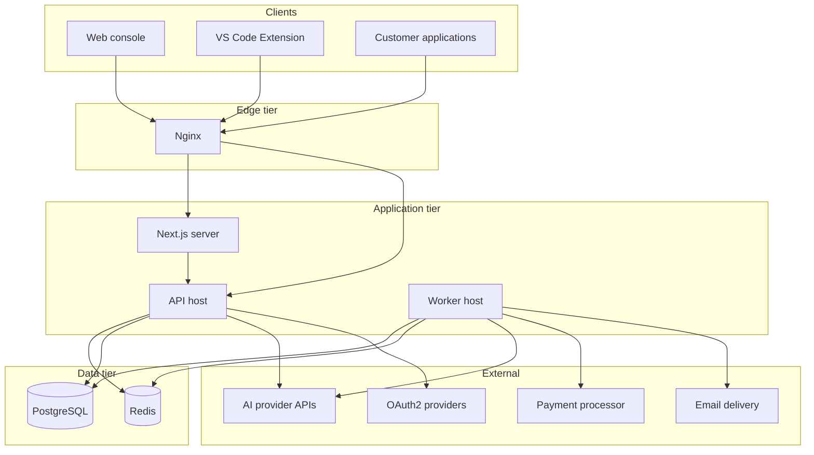
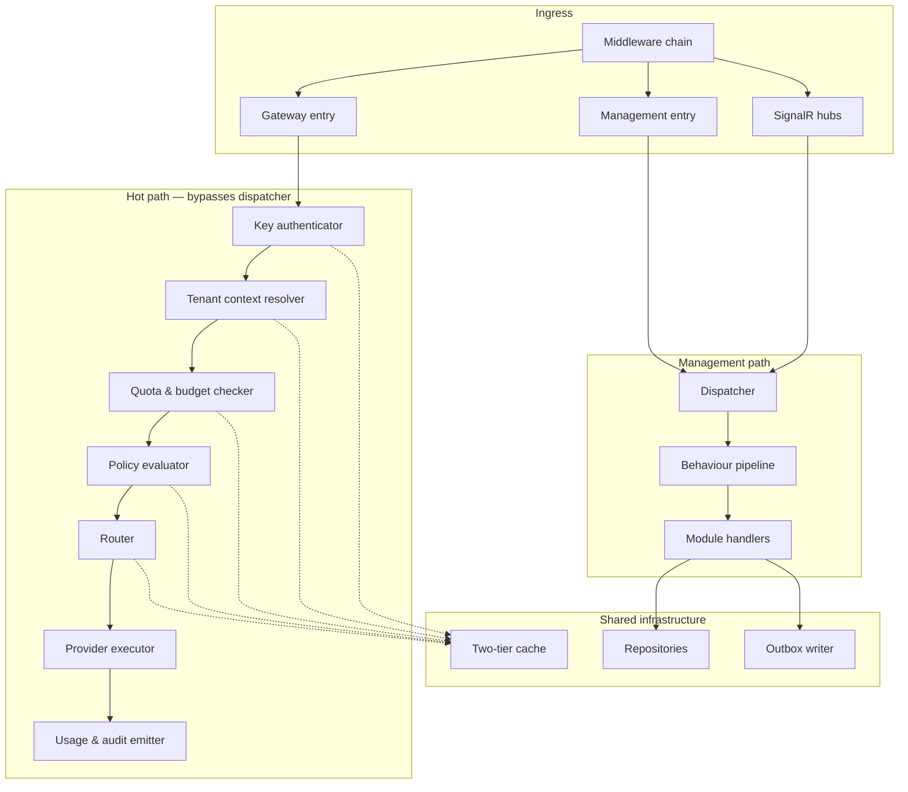
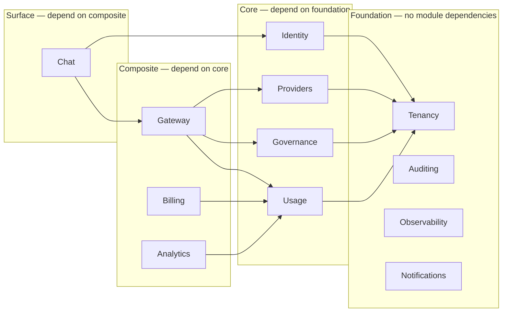
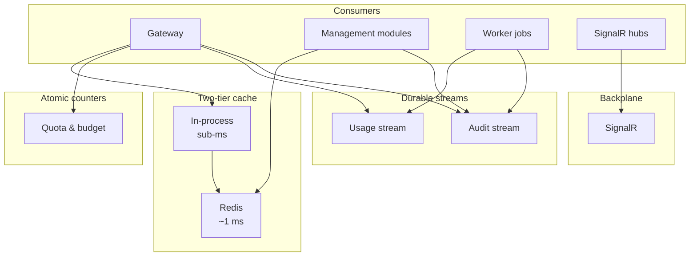

# Component Diagram

| Field | Value |
| --- | --- |
| Document | Component Diagram |
| Version | 1.0 |
| Status | Draft — pending engineering review |
| Owner | Engineering |
| Last updated | 2026-07-30 |
| Audience | Engineering, Architecture Review |
| Phase | 2 — System Architecture |

---

## 1. Purpose

This document decomposes MaintOrbit AI into components and maps the dependencies
between them. It is the reference for answering two questions precisely: *what talks to
what*, and *what breaks if this fails*.

It is the visual companion to
[`system-architecture.md`](system-architecture.md) §3.4 and
[`backend-architecture-overview.md`](backend-architecture-overview.md) §3.3.

---

## 2. Scope

### 2.1 In scope

- Container and component decomposition
- Module dependency map, distinguishing synchronous from asynchronous coupling
- Component responsibilities and ownership
- Shared infrastructure components and their consumers
- Failure impact analysis per component
- Extraction readiness assessment per module

### 2.2 Out of scope

Class-level design, API definitions, database schema, and the internal design of the
Gateway and identity subsystems, which have their own documents.

---

## 3. Architecture

### 3.1 Container decomposition

**Note on outbound calls.** The API host calls providers and identity providers because
both are in a user-facing critical path. Payment and email are called only from the
Worker, because neither is latency-critical and both benefit from retry semantics that
would be inappropriate in a request path.

---

### 3.2 API host components

> **The two paths are architecturally distinct.** The management path runs the full
> dispatcher and behaviour pipeline described in
> [`backend-architecture-overview.md`](backend-architecture-overview.md) §3.4. The
> Gateway hot path does not, because the pipeline's transaction, validation, and audit
> behaviours would each cost a portion of a 15 ms budget. The hot path implements the
> equivalent guarantees through purpose-built components, and it is the only permitted
> exception to the dispatcher rule.

---

### 3.3 Module dependency map

**The dependency graph is acyclic.** This is a hard invariant, verified by architecture
test AT-3. A cycle between modules would make extraction impossible and is treated as a
build failure, not a design smell.

#### Synchronous contract dependencies

| Consumer | Provider | Contract purpose | Hot path |
| --- | --- | --- | --- |
| Gateway | Providers | Resolve connection, model, credential handle | **Yes** — cached |
| Gateway | Governance | Evaluate applicable policies | **Yes** — cached |
| Gateway | Usage | Check quota and budget state | **Yes** — Redis counters |
| Chat | Gateway | Execute inference | Yes |
| Chat | Identity | Resolve permitted models for the Employee | Yes — cached |
| Identity | Tenancy | Resolve Company and Team membership | Yes — cached |
| Billing | Usage | Read metered consumption for the period | No |
| Analytics | Usage | Read projections | No |

#### Asynchronous event dependencies

| Publisher | Event class | Consumers |
| --- | --- | --- |
| Gateway | Request completed | Usage, Observability, Auditing |
| Identity | Authentication, role change, key lifecycle | Auditing, Notifications |
| Tenancy | Company, Team, Employee lifecycle | Auditing, Identity, Billing |
| Providers | Connection lifecycle, health change, model deprecation | Auditing, Notifications, Gateway *(cache invalidation)* |
| Governance | Policy change, policy action taken | Auditing, Gateway *(cache invalidation)* |
| Usage | Record persisted, budget threshold crossed | Analytics, Notifications, Billing |
| Billing | Plan change, payment outcome | Auditing, Notifications |

**Cache invalidation is an event consumer, not a separate mechanism.** When Providers
or Governance publishes a change, the Gateway's cache invalidation handler consumes it.
This is why AD-005's 60-second time-to-live matters: it bounds exposure when an
invalidation event is delayed or lost.

---

### 3.4 Component responsibilities

#### Identity and access

| Component | Owns | Notable constraint |
| --- | --- | --- |
| Credential authenticator | Password and OAuth2 verification | Rate-limited per NFR-SEC-016 |
| Session manager | Session issuance, expiry, termination | Termination must propagate within 60 s — FR-AUTH-010 |
| API key manager | Platform API Key lifecycle | Secret stored only as an irreversible hash — NFR-SEC-006 |
| Permission evaluator | Deny-by-default authorization | Evaluable without cross-Company data — FR-PERM-007 |
| Tenant resolver | Establishes ambient Company context | Failure yields no tenant, not an unfiltered one |

#### Control plane

| Component | Owns | Notable constraint |
| --- | --- | --- |
| Connection registry | Provider Connections and their state | Credentials never readable after creation — FR-PROV-004 |
| Credential custodian | Envelope encryption and decryption | Plaintext transient in memory only — AD-008 |
| Catalog synchronizer | Model catalog and deprecation detection | Scheduled; must not block the hot path |
| Health prober | Connection availability, latency, error rate | Feeds circuit breaker state |
| Router | Route selection and fallback ordering | Deterministic and fully recorded — FR-GW-011 |
| Provider executor | Adapter invocation, streaming, normalization | One adapter per provider — AD-007 |
| Resilience controller | Retry, circuit breaking, timeout | Retry and fallback counted separately |
| Policy compiler | Converts stored policies into an evaluable form | Compiled on change, cached — NFR-PERF-006 |
| Policy evaluator | Applies compiled policies to a request | ≤20 ms p95 within the overall budget |

#### Ledger

| Component | Owns | Notable constraint |
| --- | --- | --- |
| Usage emitter | Appends to the durable stream | Sub-millisecond; never blocks the response |
| Usage writer | Batches stream entries into storage | Idempotent by stream entry identifier |
| Cost calculator | Applies effective-dated pricing | Deterministic and reproducible — NFR-DATA-009 |
| Budget enforcer | Atomic counter evaluation | Fail-closed — AD-012 |
| Quota enforcer | Rate limiting at Company, Team, Key scope | Fail-closed |
| Projection builder | Analytics read models | Rebuildable from Usage |
| Reconciler | Compares stream offsets to persisted counts | Alert-only; detects NFR-DATA-008 violations |

#### Platform services

| Component | Owns | Notable constraint |
| --- | --- | --- |
| Audit emitter | Append-only event capture | Never sampled — NFR-DATA-007 |
| Audit store | Immutable retention | No modification path exists in code — FR-AUD-003 |
| Notification dispatcher | Channel delivery and preferences | Rate-limited — FR-NOT-009 |
| Request inspector | Routing decision retrieval by correlation identifier | Serves NFR-OBS-006 |
| Telemetry collector | Traces, metrics, structured logs | Never contains content or credentials — NFR-OBS-009 |

---

### 3.5 Shared infrastructure components

**All four live in Redis (AD-009).** They are drawn separately because they have
different failure consequences and will eventually be separated into distinct instances
— see [`scalability-strategy.md`](scalability-strategy.md).

---

### 3.6 Failure impact analysis

The practical value of this document: what stops working when a component fails.

| Component fails | Gateway | Chat | Console | Ingestion | Analytics | Notifications |
| --- | --- | --- | --- | --- | --- | --- |
| **Redis — cache** | ⛔ Halts | ⛔ Halts | ⚠ Degraded | ✅ | ✅ | ✅ |
| **Redis — counters** | ⛔ Halts *(fail-closed)* | ⛔ Halts | ✅ | ✅ | ✅ | ✅ |
| **Redis — streams** | ⚠ Degraded *(fail-open, alerts)* | ⚠ Degraded | ✅ | ⛔ Halts | ⚠ Stale | ✅ |
| **Redis — backplane** | ✅ | ✅ | ⚠ No real-time | ✅ | ✅ | ⚠ In-app only |
| **PostgreSQL** | ✅ *(runs from cache)* | ⚠ No history | ⛔ Halts | ⛔ Halts | ⛔ Halts | ⛔ Halts |
| **Worker host** | ✅ | ✅ | ⚠ Stale data | ⚠ Buffers | ⚠ Stale | ⛔ Halts |
| **One provider** | ⚠ Fails over | ⚠ Fails over | ✅ | ✅ | ✅ | ✅ |
| **All providers** | ⛔ Halts | ⛔ Halts | ✅ | ✅ | ✅ | ✅ |
| **API host instance** | ✅ *(other instances)* | ✅ | ✅ | ✅ | ✅ | ✅ |
| **Nginx** | ⛔ Halts | ⛔ Halts | ⛔ Halts | ⚠ Buffers | ✅ | ✅ |

⛔ unavailable · ⚠ degraded · ✅ unaffected

**Three findings deserve attention:**

1. **Redis is the most consequential single failure.** Cache and counter loss both halt
   the Gateway. This is risk R-2 in [`system-architecture.md`](system-architecture.md)
   §6 and remains the architecture's principal availability exposure. Decision D-3 —
   whether budget enforcement may fail open during a Redis outage — determines whether
   this stays critical or becomes merely serious.

2. **PostgreSQL loss does not immediately stop the Gateway.** Because the hot path runs
   entirely from cache (AD-005), inference continues while the database is unavailable,
   with usage buffering in the stream. This is a genuine and somewhat surprising
   resilience property, and it is worth preserving deliberately rather than discovering
   it has been lost.

3. **Nginx is a single point of failure for all customer traffic.** Addressed in
   [`deployment-architecture.md`](deployment-architecture.md).

---

### 3.7 Extraction readiness

Per AD-014, each module is assessed on how ready it is to become a separate service.

| Module | Inbound sync deps | Outbound sync deps | Owns state | Readiness | Notes |
| --- | --- | --- | --- | --- | --- |
| **Auditing** | None | None | Yes | ★★★ | Consumes events only; the cleanest candidate |
| **Analytics** | None | Usage *(read)* | Projections only | ★★★ | Rebuildable state; no source of truth |
| **Notifications** | None | None | Preferences | ★★★ | Event-driven throughout |
| **Observability** | None | None | Decision records | ★★★ | Write-once, read-rare |
| **Gateway** | Chat | Providers, Governance, Usage | Routing policies | ★★☆ | Highest value to extract; three sync dependencies to make remote |
| **Usage** | Gateway, Billing, Analytics | None | Ledger | ★★☆ | Extraction means moving the ledger — high value, high care |
| **Billing** | None | Usage | Subscriptions | ★★☆ | Straightforward but low benefit |
| **Providers** | Gateway | Tenancy | Connections, credentials | ★☆☆ | Credential custody crossing a network boundary needs its own design |
| **Governance** | Gateway | Tenancy | Policies | ★☆☆ | Hot-path latency budget makes a remote call difficult |
| **Chat** | None | Gateway, Identity | Conversations | ★☆☆ | Chatty with Gateway |
| **Identity** | All | Tenancy | Employees, credentials | ☆☆☆ | Everything depends on it; extract last, if ever |
| **Tenancy** | Most | None | Companies, Teams | ☆☆☆ | Foundational; extraction would require caching everywhere |

★★★ ready · ★★☆ feasible with design work · ★☆☆ difficult · ☆☆☆ not advisable

**Interpretation.** The modules easiest to extract are the ones with least reason to be
— Auditing and Notifications are not scaling bottlenecks. The module most worth
extracting, Gateway, requires converting three synchronous dependencies into remote
calls, two of which sit inside a 15 ms budget. That is the real cost of extraction, and
it should be understood before it is attempted.

---

## 4. Design decisions

| # | Decision | Rationale |
| --- | --- | --- |
| **CD-001** | The Gateway hot path is the only permitted exception to the dispatcher rule | The behaviour pipeline cannot fit the latency budget; the exception is bounded and explicit |
| **CD-002** | The module dependency graph must remain acyclic | A cycle forecloses extraction permanently; enforced by AT-3 |
| **CD-003** | Cache invalidation is implemented as an event consumer | Reuses the existing event path rather than adding a second propagation mechanism |
| **CD-004** | Payment and email are called only from the Worker | Neither is latency-critical; both need retry semantics inappropriate to a request path |
| **CD-005** | Analytics holds no authoritative state | Permits independent extraction and storage substitution |
| **CD-006** | Failure impact is documented per component, not per service | NFR-AVAIL-015 requires documented failure modes; this table is the artifact |
| **CD-007** | Credential custody stays co-located with the Gateway until proven otherwise | Moving decryption across a network boundary in the hot path is both a latency and a security question |

---

## 5. Trade-offs

| # | Gained | Given up |
| --- | --- | --- |
| T-1 | Two distinct request paths let each meet its own budget | Two idioms to learn; the hot path must re-implement pipeline guarantees |
| T-2 | Event-based cache invalidation reuses existing machinery | Invalidation inherits event delivery latency; time-to-live must bound it |
| T-3 | Redis serving four roles keeps operational surface small | Concentrated failure domain — see §3.6 |
| T-4 | Acyclic module graph preserves extraction | Some natural bidirectional relationships must be expressed as events |
| T-5 | Hot path independence from PostgreSQL yields surprising resilience | Cache correctness becomes a security property, not just a performance one |
| T-6 | Worker-only external integrations simplify request-path reasoning | Payment and email outcomes are asynchronous and need their own status surfacing |

---

## 6. Risks

| # | Risk | Severity | Mitigation |
| --- | --- | --- | --- |
| **R-1** | Redis failure halts the Gateway through two independent paths | **Critical** | Replication with failover; decision D-3 on degraded budget enforcement |
| **R-2** | A lost invalidation event leaves stale authorization or routing state cached | **Critical** | 60 s maximum time-to-live; revocation tombstones checked on cache hit |
| **R-3** | Hot-path components drift from pipeline equivalents, losing a guarantee | High | Shared test suite asserting both paths enforce the same authorization and audit outcomes |
| **R-4** | A module dependency cycle is introduced and disabled rather than fixed | High | AT-3 is build-gating; suppression requires architecture review |
| **R-5** | Gateway extraction proves infeasible because Governance cannot be called remotely inside the budget | Medium | Policy evaluation is already cache-resident and could be co-deployed as a sidecar |
| **R-6** | Nginx single point of failure | High | [`deployment-architecture.md`](deployment-architecture.md) |
| **R-7** | Credential custodian becomes a bottleneck as connection count grows | Medium | Decrypted material cached per connection with a short lifetime, never persisted |

---

## 7. Future considerations

- **Redis will separate into distinct instances.** Cache, counters, streams, and
  backplane have different durability and availability profiles. Splitting them is the
  first scaling action and reduces the blast radius in §3.6.
- **Gateway extraction requires solving Governance co-location.** The likely answer is
  deploying policy evaluation alongside the Gateway rather than behind a network call.
- **A read-model store will appear.** Analytics holds no authoritative state precisely
  so this substitution is a projection rebuild.
- **Chat may merge into Gateway or diverge sharply.** If Chat remains thin, its
  separation is overhead; if it acquires knowledge grounding at v2.0, it becomes
  substantial and clearly warrants its own module.
- **Provider credential custody will need reconsideration for self-hosted deployment.**
  A customer-controlled key custodian changes the component's trust boundary.
- **The failure impact table must be verified, not asserted.** Every ⛔ and ⚠ in §3.6 is
  a hypothesis until failure-injection testing confirms it — required by NFR-AVAIL-015.

---

## 8. Cross references

| Document | Relationship |
| --- | --- |
| [`system-architecture.md`](system-architecture.md) | Governing decisions and module decomposition |
| [`backend-architecture-overview.md`](backend-architecture-overview.md) | Layer structure and the dispatcher pipeline |
| [`ai-gateway-architecture.md`](ai-gateway-architecture.md) | Hot-path component internals |
| [`authentication-architecture.md`](authentication-architecture.md) | Identity and tenancy components |
| [`request-flow.md`](request-flow.md) | These components in sequence |
| [`deployment-architecture.md`](deployment-architecture.md) | How components map to containers and hosts |
| [`scalability-strategy.md`](scalability-strategy.md) | Redis separation and component scaling |
| [`../01-product/non-functional-requirements.md`](../01-product/non-functional-requirements.md) | NFR-AVAIL-015 documented failure modes |
| [`../01-product/glossary.md`](../01-product/glossary.md) | Component naming vocabulary |
