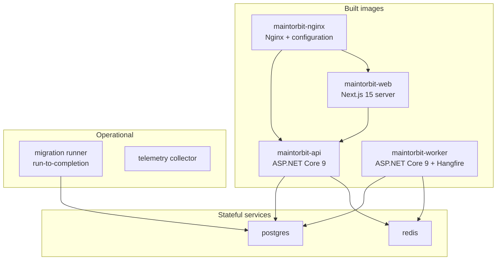
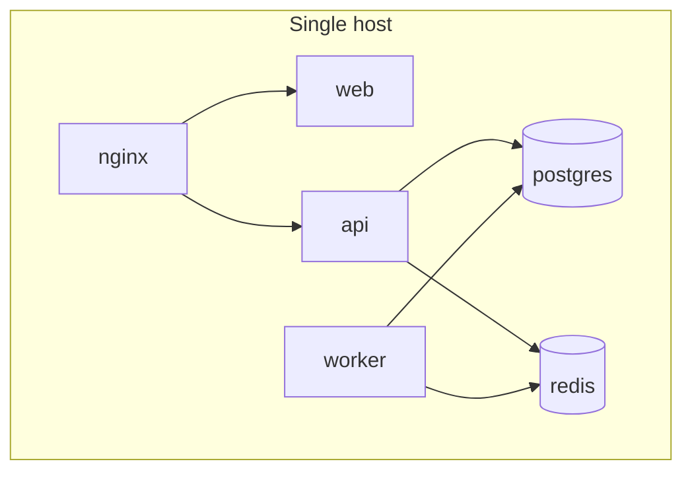
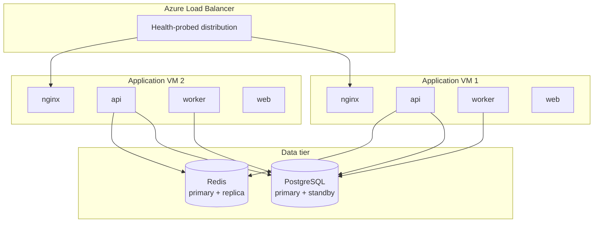
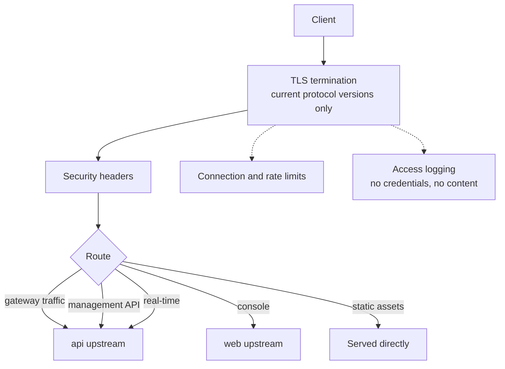
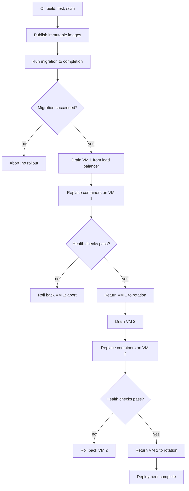

# Deployment Architecture

| Field | Value |
| --- | --- |
| Document | Deployment Architecture |
| Version | 1.0 |
| Status | Draft — **contains an unresolved conflict between the stated infrastructure and NFR-AVAIL-001** |
| Owner | Engineering & Operations |
| Last updated | 2026-07-30 |
| Audience | Engineering, Operations, Security, Leadership |
| Phase | 2 — System Architecture |

---

## 1. Purpose

This document describes how MaintOrbit AI is packaged, deployed, and operated: the
container topology, the Azure VM hosting model, Nginx configuration responsibilities,
the data tier, and the deployment process.

It also confronts a conflict that must be resolved before general availability. The
target infrastructure — Azure VM with Docker Compose — cannot deliver the 99.9% Gateway
availability required by NFR-AVAIL-001 in a single-instance configuration. §3.3 sets out
the arithmetic and the options.

---

## 2. Scope

### 2.1 In scope

- Container decomposition and image strategy
- Staged deployment topologies from evaluation to production
- Azure VM hosting, sizing, and availability characteristics
- Nginx responsibilities
- Data tier: PostgreSQL and Redis placement and durability
- Deployment process, rollout, and rollback
- Configuration and secret delivery
- Backup and recovery mechanics
- Self-hosted deployment path

### 2.2 Out of scope

| Excluded | Where |
| --- | --- |
| Scaling mechanics and capacity modelling | [`scalability-strategy.md`](scalability-strategy.md) |
| Application internals | [`backend-architecture-overview.md`](backend-architecture-overview.md) |
| CI/CD pipeline definitions | `docs/06-deployment/ci-cd/` (Phase 3) |
| Runbooks and incident procedures | `docs/06-deployment/runbooks/` (Phase 3) |

### 2.3 Governing requirements

| Requirement | Constraint |
| --- | --- |
| NFR-AVAIL-001 | Gateway ≥ 99.9% monthly |
| NFR-AVAIL-006 | Planned maintenance requires no Gateway downtime |
| NFR-AVAIL-013 | Survive loss of any single node without data loss |
| NFR-AVAIL-014 | Deployment without request loss |
| NFR-PORT-001/002/003/004 | Containerized; no non-portable dependency; environment configuration; single-host operation |
| NFR-DR-001/002/004 | RPO ≤ 5 min; Gateway RTO ≤ 1 h; zero loss for usage and audit |
| NFR-SEC-001 | Current transport security; obsolete versions disabled |

---

## 3. Architecture

### 3.1 Container decomposition

| Image | Base | Responsibility |
| --- | --- | --- |
| `maintorbit-api` | .NET 9 runtime, non-root | Gateway hot path, management surface, SignalR hubs |
| `maintorbit-worker` | .NET 10 runtime, non-root | Scheduled jobs. **As of Milestone 12.3 it runs one**: audit partition maintenance, on a timer rather than Hangfire (ADR-0014 §8.1). Batch persistence and projections arrive with the modules that need them |

> **The Worker's database role needs ownership of `auditing.audit_events`.** Partition maintenance
> is DDL — `CREATE TABLE ... PARTITION OF`, and `DROP TABLE` where retention is enabled — which
> PostgreSQL permits only to the table's owner. In the current shape the migration role and the
> application role are the same, so this already holds.
>
> **A deployment that separates them must provision it explicitly**: grant the Worker's role
> ownership of the parent table, or run maintenance as the migration role. It must **not** be
> solved by giving the application role DDL rights — that role is deliberately constrained, and
> `REVOKE UPDATE, DELETE` on the audit store is part of what makes the append-only guarantee real.
>
> The Worker also reads its **own** `Persistence:ConnectionString`. Sharing the API's would put
> batch work in the pool NFR-PERF-001 protects for the latency budget.
| `maintorbit-web` | Node runtime, non-root | Next.js server |
| `maintorbit-nginx` | Nginx, non-root | TLS termination, routing, static assets, connection limits |
| `migration-runner` | .NET 9 SDK-trimmed | Schema migration; runs to completion before rollout |

**API and Worker are separate images from the same solution**, per AD-010. They share
libraries but never share a process — the Gateway's latency budget cannot tolerate
competing with batch work for CPU or connection-pool capacity.

**Migrations run as a separate step, not at application startup.** Startup migration in
a multi-instance deployment means several instances racing to migrate the same database.
The migration runner executes once, to completion, before new application containers
start.

**All containers run as non-root** with read-only root filesystems where practical, and
declare explicit health checks distinguishing liveness from readiness per NFR-OBS-005.

---

### 3.2 Staged deployment topologies

Four topologies, each appropriate to a stage. The staging is deliberate: T1 is the
minimum viable production configuration, and T0 must not be mistaken for it.

#### T0 — Single host (development and evaluation only)

Satisfies NFR-PORT-004 — the whole platform runs on one host with one command. This is
the developer and evaluation configuration and **must not be used for production
traffic**: every component is a single point of failure and deployment requires
downtime.

#### T1 — Minimum production

Two application VMs in an availability set behind a load balancer, with a replicated
data tier. **This is the minimum configuration that can satisfy NFR-AVAIL-001,
NFR-AVAIL-006, and NFR-AVAIL-014** — see §3.3.

#### T2 — Separated tiers

Application VMs scale horizontally; data tier moves to dedicated hosts or managed
services; Redis roles begin to separate per
[`scalability-strategy.md`](scalability-strategy.md).

#### T3 — Multi-region

Required for NFR-PRIV-013 data residency and NFR-DR-009 cross-region recovery. Arrives
with v2.1.

---

### 3.3 The availability conflict

**This section documents a genuine conflict between the stated infrastructure and a
stated requirement. It requires a decision, not an engineering workaround.**

NFR-AVAIL-001 requires ≥ 99.9% monthly Gateway availability. That is a budget of
**43 minutes 12 seconds of unavailability per month**, covering everything: infrastructure
failure, deployment, patching, dependency failure, and incident recovery.

| Consumer of the budget | Single VM (T0) | Two VMs (T1) |
| --- | --- | --- |
| Azure single-instance VM SLA | Consumes essentially the entire budget on its own | Not applicable — availability set has a higher SLA |
| Host OS patching, monthly reboot | 5–15 min | 0 — drained sequentially |
| Application deployment, weekly | 4 × 2–5 min = 8–20 min | 0 — rolling |
| Container restart on failure | 1–3 min per event | 0 — other instance serves |
| PostgreSQL maintenance | 5–10 min | 0 — standby promotion |
| Redis restart | 1–2 min, **Gateway halts** | 0 — replica promotion |
| **Total before any incident** | **Exceeds the budget** | **Within budget** |

**The finding is unambiguous: a single VM cannot meet 99.9%.** Planned maintenance
alone consumes the entire monthly allowance before a single unplanned event occurs. This
is arithmetic, not pessimism.

**Compounding factor.** Per
[`component-diagram.md`](component-diagram.md) §3.6, a Redis restart halts the Gateway
entirely, because quota and budget checks fail closed. On a single host, routine Redis
maintenance is a full Gateway outage.

#### The options

| Option | Availability achievable | Cost | Assessment |
| --- | --- | --- | --- |
| **A — Two VMs in an availability set (T1)** | 99.9% achievable | ~2× compute, plus load balancer | **Recommended.** The minimum honest configuration for the stated target |
| **B — Single VM, amend the target to 99.5%** | 99.5% — 3.6 h/month | Lowest | Defensible for early beta; must be published, and it weakens the P-02 persona's evaluation |
| **C — Single VM, claim 99.9%** | Not achievable | Lowest | **Unacceptable.** Overstating availability in a governance product is precisely what [`../01-product/mission.md`](../01-product/mission.md) §6 forbids |
| **D — Managed platform services** | 99.95%+ | Higher; changes the operating model | Conflicts with the stated Azure VM approach; revisit at T2 |

**Recommendation: Option A for general availability, Option B for private beta with the
lower target published.** Whichever is chosen, the published figure must match the
achievable figure. Option C is not an option.

> **Decision required — see §8, DD-1.** This blocks the availability commitment in
> customer-facing material and should be resolved before beta, not before GA.

---

### 3.4 Azure VM hosting

| Aspect | Approach | Rationale |
| --- | --- | --- |
| VM series | General-purpose, compute-optimized for API hosts | The Gateway is CPU-sensitive; latency budget depends on it |
| Placement | Availability set or availability zones across VMs | Required for T1's availability characteristics |
| Disks | Premium SSD; separate data disk for stateful services | Durability and predictable input/output performance |
| Networking | Private virtual network; only the load balancer publicly addressable | Application VMs are not directly reachable |
| Access | No public SSH; bastion or just-in-time access, MFA required, audited | NFR-SEC-013 |
| Updates | Automated OS patching with maintenance windows and sequential draining | NFR-AVAIL-006 |
| Monitoring | Host metrics exported to the same telemetry pipeline as application metrics | NFR-OBS-003 |

**Sizing is a Phase 3 deliverable**, dependent on the prototype measurements required by
risk R-6 in [`system-architecture.md`](system-architecture.md). Publishing sizing
guidance before the hot path has been measured would be a guess presented as guidance.

---

### 3.5 Nginx responsibilities

| Responsibility | Configuration concern |
| --- | --- |
| TLS termination | Current protocol versions only; obsolete versions disabled — NFR-SEC-001 |
| Security headers | Applied uniformly, including content security policy — NFR-SEC-018 |
| Routing | Gateway, management, real-time, and console to correct upstreams |
| Streaming | Response buffering **disabled** for Gateway and Chat paths |
| WebSocket upgrade | Required for SignalR |
| Connection limits | Coarse protection; fine-grained quota enforcement is the application's job |
| Timeouts | Must exceed the application's own timeouts so the application controls failure |
| Static assets | Served directly, bypassing the Next.js server |
| Access logging | Never contains credentials or content — NFR-OBS-009 |

**Two configuration details are load-bearing and easily missed:**

**Response buffering must be disabled on streaming paths.** Nginx buffers responses by
default. On a streaming inference path this holds chunks until a buffer fills,
destroying NFR-PERF-004 and NFR-PERF-005 and making streaming appear not to work at all.

**Nginx timeouts must exceed application timeouts.** If Nginx times out first, the
client receives a gateway error instead of the application's normalized, actionable
error — defeating FR-GW-006 and FR-X-001 at the last hop.

---

### 3.6 Data tier

#### PostgreSQL

| Aspect | Approach | Requirement |
| --- | --- | --- |
| Topology | Primary with streaming standby from T1 | NFR-AVAIL-013 |
| Failover | Automatic promotion with application reconnection | NFR-DR-002 |
| Backups | Continuous archiving plus periodic base backups | NFR-DR-001 |
| Point-in-time recovery | Supported to within the RPO | NFR-DR-001 — RPO ≤ 5 min |
| Encryption | At rest via disk encryption; in transit enforced | NFR-SEC-001/002 |
| Connection pooling | Pooler between application and database | Connection count control |
| Row-level security | Session variable set at checkout; **must be cleared on return** | AD-002 |

> **Connection pooling and row-level security interact dangerously.** The tenant session
> variable must be set at connection checkout and cleared at return. A pooled connection
> returned with a tenant variable still set, then handed to a request for a different
> Company, is a cross-tenant data exposure. Pooling mode selection is therefore a
> **security decision**, not a performance one — transaction-level pooling and
> session-level state are not compatible without care. This is risk R-4 in
> [`authentication-architecture.md`](authentication-architecture.md) §6 and must be
> prototyped before Phase 3.

#### Redis

| Aspect | Approach | Requirement |
| --- | --- | --- |
| Topology | Primary with replica, automatic failover, from T1 | AD-009 |
| Persistence | Append-only file with per-second sync | AD-006 durability |
| Memory policy | **No eviction on the streams instance**; eviction permitted on cache | Evicting an unconsumed usage record loses ledger data |
| Failover | Automatic promotion; clients reconnect | Gateway depends on Redis |
| Encryption | In transit enforced; at rest via disk encryption | NFR-SEC-001/002 |

**The eviction policy distinction is critical and easy to get wrong.** Redis is used for
four purposes (AD-009). Cache entries may be evicted under memory pressure —
they are reconstructible. Stream entries must never be evicted, because an evicted entry
is a permanently lost Usage Record or Audit Event, breaching NFR-DATA-001 and -002. If
these share one instance with one eviction policy, memory pressure silently destroys
ledger data.

**This argues for separating streams onto their own Redis instance earlier than pure
scaling would require** — see [`scalability-strategy.md`](scalability-strategy.md).

---

### 3.7 Deployment process

| Property | Approach | Requirement |
| --- | --- | --- |
| Image immutability | Images are built once and promoted; never rebuilt per environment | NFR-PORT-003 |
| Migration ordering | Schema migration completes before any new container starts | NFR-MAINT-007 |
| Backward compatibility | Migrations must be compatible with the previous application version | Enables rolling deployment and rollback |
| Rolling replacement | One VM at a time, drained first | NFR-AVAIL-014 |
| Connection draining | In-flight requests complete before container stop | NFR-AVAIL-014 |
| Health gating | Readiness must pass before returning to rotation | NFR-OBS-005 |
| Rollback | Previous image redeployed; schema remains compatible | NFR-PORT-006 |

**Migrations must be backward-compatible with the running version.** During a rolling
deployment both versions run simultaneously against the same schema. A migration that
drops or renames a column the previous version uses will break live traffic. The
expand-and-contract pattern — add, deploy, migrate data, deploy, remove in a later
release — is mandatory, not advisory.

**SignalR connections break on container replacement.** The console must reconnect
transparently per FD-012 in
[`frontend-architecture-overview.md`](frontend-architecture-overview.md). This is an
operational reality of rolling deployment and is why the console degrades to polling
rather than treating the connection as required.

---

### 3.8 Configuration and secrets

| Item | Delivery | Never |
| --- | --- | --- |
| Non-secret configuration | Environment variables per NFR-PORT-003 | Baked into images |
| Connection strings | Environment, injected at container start | In source control |
| Key-encryption key | Custodian per AD-008; portable default | In environment variables in production |
| TLS certificates | Mounted; automated renewal | In images |
| Provider credentials | **Never in configuration** — customer-supplied, encrypted in the database | Anywhere in platform configuration |

**Provider Credentials are never platform configuration.** They belong to customers and
live encrypted in the database per AD-008. The only provider credentials that may appear
in configuration are the platform's own optional fallback credentials, which are
distinct and clearly marked as such in `.env.example`.

**Secret scanning is build-gating** per NFR-SEC-012. Given what this platform stores, a
committed secret is an incident rather than an inconvenience.

---

### 3.9 Self-hosted deployment path

NFR-PORT-007 requires deployment in a customer environment without product modification,
arriving at v2.1.

| Requirement | Consequence for the base architecture |
| --- | --- |
| No non-portable dependency | NFR-PORT-002 — every runtime dependency must be self-hostable |
| Single-host operation | T0 topology is the self-hosted evaluation configuration |
| Environment configuration only | NFR-PORT-003 — no environment-specific builds |
| Portable key custodian | AD-008 — must be the development and CI default |
| Offline model catalog | Catalog refresh must degrade gracefully without external access |
| Private extension distribution | Some customers restrict marketplace access |

**The T0 topology is not merely a development convenience — it is the self-hosted
evaluation product.** Keeping it working continuously is what makes v2.1 a packaging
exercise rather than a re-architecture. If T0 is allowed to rot because everyone develops
against a shared environment, NFR-PORT-007 will be discovered to be unachievable at the
worst possible moment.

**PostgreSQL and Redis remain self-hostable regardless of what we use.** Using managed
Azure equivalents for our own hosted deployment does not violate NFR-PORT-002, because
the *product* depends on PostgreSQL and Redis, not on a specific vendor's managed
offering. The constraint is on the product's dependencies, not on our operational
choices — a distinction worth stating explicitly, because conflating the two would rule
out reasonable operational decisions for no benefit.

---

## 4. Design decisions

| # | Decision | Rationale |
| --- | --- | --- |
| **DP-001** | API and Worker are separate containers | AD-010; batch work must not compete with the latency budget |
| **DP-002** | Migrations run as a separate step, not at application startup | Multiple instances would race |
| **DP-003** | Migrations must be backward-compatible with the previous version | Rolling deployment runs both versions concurrently |
| **DP-004** | T1 two-VM topology is the minimum production configuration | §3.3 arithmetic; single VM cannot meet NFR-AVAIL-001 |
| **DP-005** | Nginx response buffering disabled on streaming paths | Buffering destroys NFR-PERF-004/005 |
| **DP-006** | Nginx timeouts exceed application timeouts | The application must own its failure semantics |
| **DP-007** | Redis streams instance has no eviction policy | An evicted stream entry is permanently lost ledger data |
| **DP-008** | Tenant session variable cleared on connection return | A pooled connection carrying a stale tenant is a cross-tenant exposure |
| **DP-009** | Images are immutable and promoted, never rebuilt per environment | NFR-PORT-003; the tested artifact is the deployed artifact |
| **DP-010** | T0 single-host topology is maintained continuously | It is the self-hosted evaluation product, not just a convenience |
| **DP-011** | Provider Credentials never appear in platform configuration | They are customer property, encrypted in the database |
| **DP-012** | All containers run non-root with explicit health checks | Baseline hardening; NFR-OBS-005 |

---

## 5. Trade-offs

| # | Gained | Given up |
| --- | --- | --- |
| T-1 | Two-VM topology meets the availability target | Roughly double the compute cost and a load balancer |
| T-2 | Docker Compose on VMs is simple to operate and reason about | Manual scaling; no automatic rescheduling on host failure |
| T-3 | Separate API and Worker containers protect latency | More containers to deploy and monitor |
| T-4 | Separate migration step avoids races | An extra pipeline stage and a failure mode to handle |
| T-5 | Backward-compatible migrations enable zero-downtime rollout | Multi-release schema changes; more discipline |
| T-6 | Maintaining T0 keeps the self-hosted path viable | Continuous effort to keep single-host operation working |
| T-7 | Self-hosted PostgreSQL and Redis maximize portability | More operational burden than managed equivalents |
| T-8 | Nginx as the sole edge keeps the stack simple | It becomes a single point of failure per host |

---

## 6. Risks

| # | Risk | Severity | Likelihood | Mitigation |
| --- | --- | --- | --- | --- |
| **R-1** | Single-VM deployment ships and NFR-AVAIL-001 is missed while being claimed | **Critical** | **High** | §3.3 decision DD-1 before beta; published availability must match achievable availability |
| **R-2** | Connection pooling leaks tenant context between requests | **Critical** | Medium | Session variable cleared on return; pooling mode is a security decision; prototype before Phase 3 |
| **R-3** | Redis memory pressure evicts stream entries, losing ledger data | **Critical** | Medium | No eviction on the streams instance; separate instance; memory alerting |
| **R-4** | A non-backward-compatible migration breaks live traffic during rollout | High | Medium | Expand-and-contract mandatory; migration review gate; tested against the previous version in CI |
| **R-5** | Nginx buffering silently breaks streaming | High | Medium | Explicit configuration; integration test asserting chunk timing |
| **R-6** | Redis failover exceeds the Gateway's tolerance, causing a visible outage | High | Medium | Automatic failover; client reconnection with retry; decision D-3 on degraded operation |
| **R-7** | T0 topology rots, making v2.1 self-hosted a re-architecture | Medium | **High** | T0 is the local development configuration and is exercised in CI |
| **R-8** | Compose on VMs becomes operationally limiting as instance count grows | Medium | Medium | T2 topology; orchestration reconsidered if instance count exceeds manual management |
| **R-9** | Host patching windows accumulate into availability budget breaches | Medium | Medium | Sequential draining in T1; patching is a zero-downtime operation |
| **R-10** | Backup restoration is never tested and fails when needed | High | Medium | NFR-DR-006 quarterly restoration exercise with recorded results |

---

## 7. Future considerations

- **Container orchestration will eventually be warranted.** Compose on VMs is
  appropriate up to a handful of instances. Beyond that, manual placement and rolling
  updates become error-prone. The migration should be driven by operational pain, not by
  fashion — and NFR-PORT-002 means whatever is chosen must remain self-hostable.
- **Multi-region (T3) is required for v2.1.** Data residency (NFR-PRIV-013) and
  cross-region recovery (NFR-DR-009) both need it, and it changes the data tier
  fundamentally — replication topology, write routing, and consistency all become
  regional concerns.
- **Redis separation will happen before pure scaling requires it.** The eviction policy
  conflict in §3.6 is a correctness issue, not a capacity one.
- **Managed data services deserve reconsideration at T2.** They would improve
  availability and reduce operational burden without violating NFR-PORT-002, because the
  product depends on PostgreSQL and Redis rather than on a vendor's managed offering.
- **Self-hosted deployment changes the support model entirely.** Version skew,
  customer-controlled upgrade timing, and remote diagnosis without access to the
  environment are all new problems. This is an operational programme, not a packaging
  task, and should be planned as one.
- **Infrastructure definition should be code from the start.** Manually configured VMs
  cannot be reproduced reliably, which undermines both disaster recovery and the
  self-hosted path.

---

## 8. Decisions required

| # | Decision | Blocks | Owner | Deadline |
| --- | --- | --- | --- | --- |
| **DD-1** | Resolve §3.3: two-VM topology, or amend NFR-AVAIL-001 to a figure a single VM can achieve | Availability commitments in customer material; infrastructure budget | Leadership & Engineering | Before beta |
| **DD-2** | Select the PostgreSQL connection pooling mode compatible with row-level security | Phase 3 schema and connection design | Engineering | Before Phase 3 |
| **DD-3** | Confirm whether streams share a Redis instance with cache at T1 | Deployment topology and memory sizing | Engineering | Before Phase 3 |
| **DD-4** | Confirm the key custodian's production implementation and its portable default | Secret delivery design | Engineering & Security | Before Phase 3 |
| **DD-5** | Decide whether infrastructure is defined as code from the first deployment | Operational tooling investment | Engineering | Before beta |

---

## 9. Cross references

| Document | Relationship |
| --- | --- |
| [`system-architecture.md`](system-architecture.md) | AD-009, AD-010; container view |
| [`scalability-strategy.md`](scalability-strategy.md) | Scaling from T1 onward; Redis separation |
| [`component-diagram.md`](component-diagram.md) | Failure impact analysis informing §3.3 |
| [`ai-gateway-architecture.md`](ai-gateway-architecture.md) | Latency budget affected by Nginx configuration |
| [`authentication-architecture.md`](authentication-architecture.md) | Row-level security and pooling interaction |
| [`backend-architecture-overview.md`](backend-architecture-overview.md) | API and Worker host separation |
| [`../01-product/non-functional-requirements.md`](../01-product/non-functional-requirements.md) | NFR-AVAIL, NFR-DR, NFR-PORT, NFR-SEC |
| `../06-deployment/` | Phase 3 — runbooks, CI/CD, environment definitions |
| `../../docker/` | Compose files and Dockerfiles |
