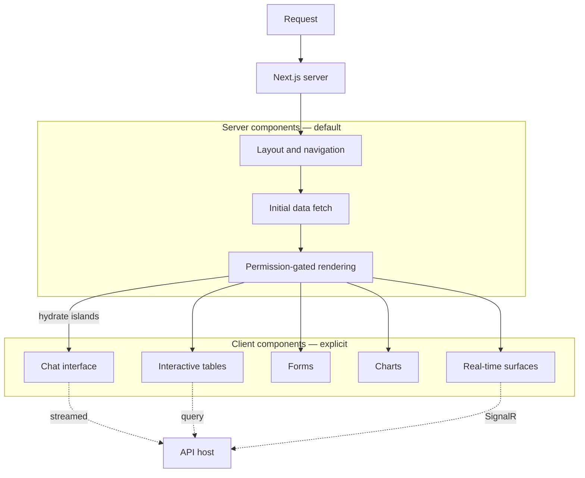
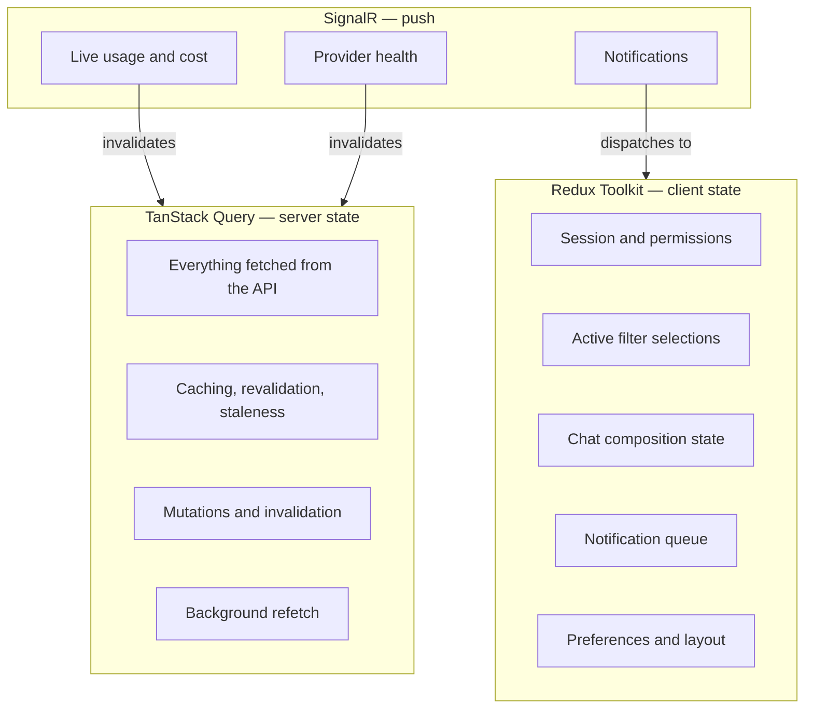
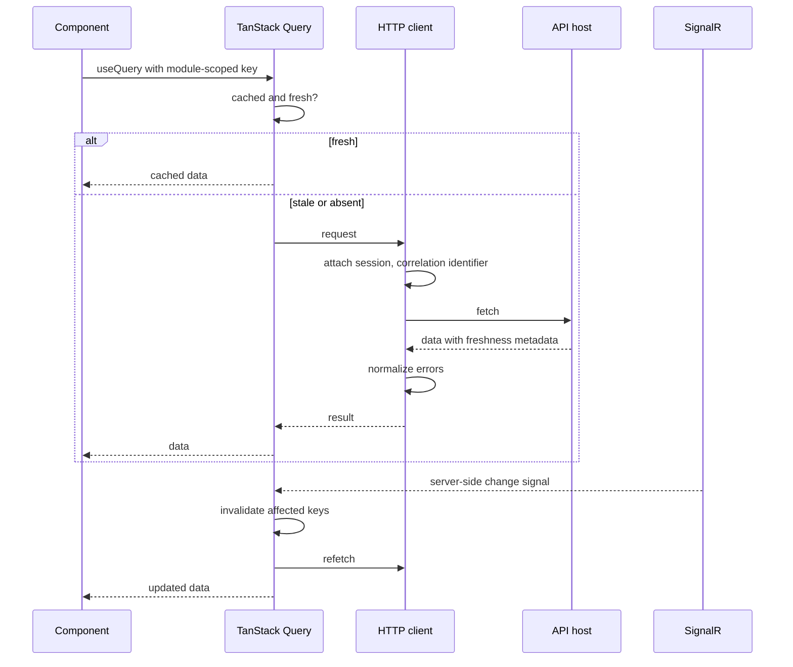
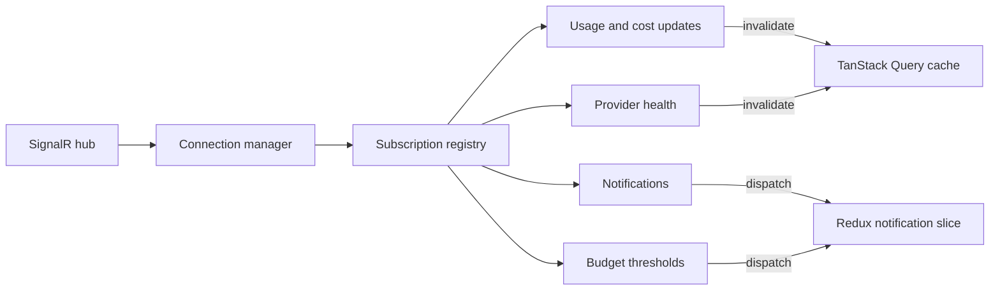
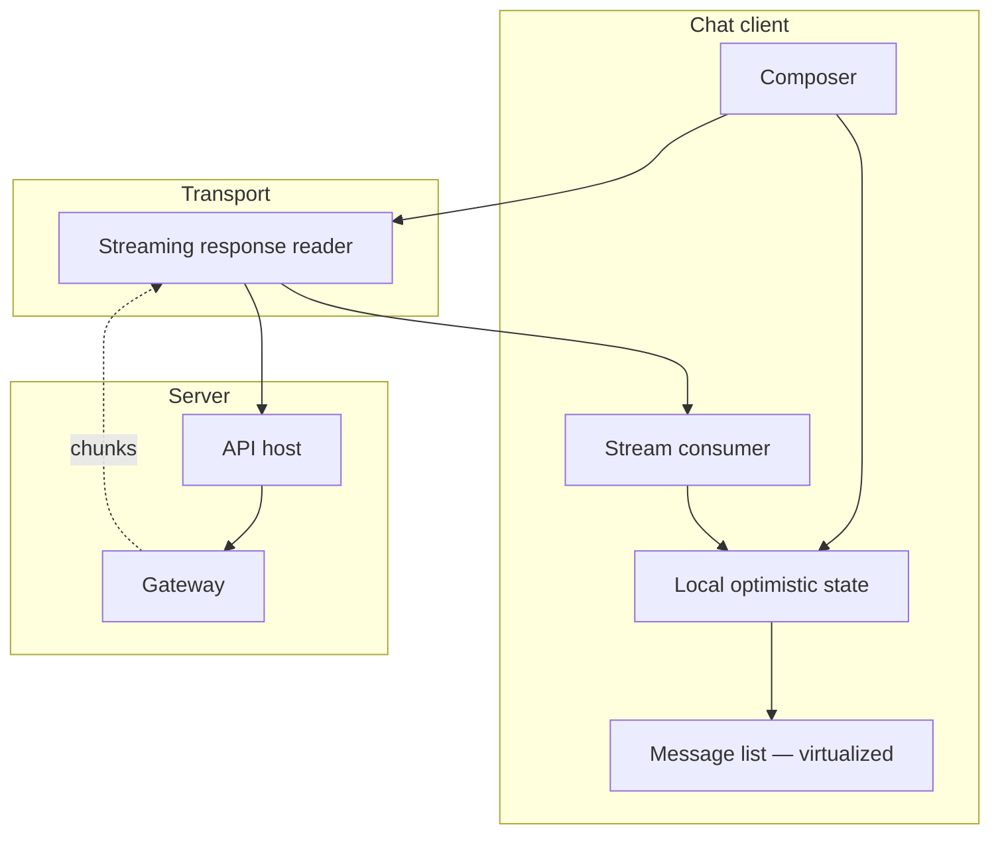
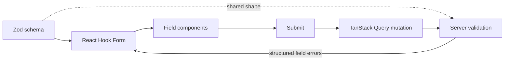
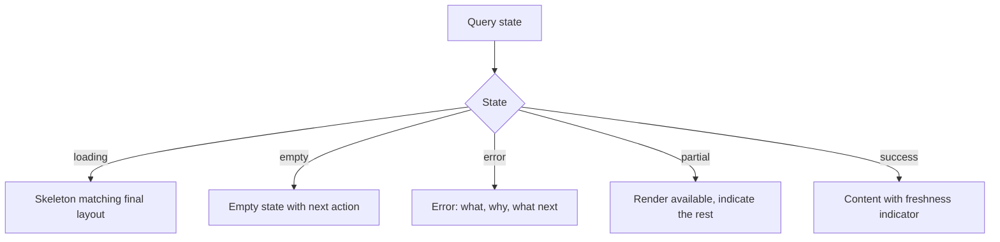

# Frontend Architecture Overview

| Field | Value |
| --- | --- |
| Document | Frontend Architecture Overview |
| Version | 1.0 |
| Status | Draft — pending engineering review |
| Owner | Engineering |
| Last updated | 2026-07-30 |
| Audience | Frontend Engineering, Design, Architecture Review |
| Phase | 2 — System Architecture |

---

## 1. Purpose

This document describes the architecture of the MaintOrbit AI web console: how Next.js
15 is used, how server and client responsibilities divide, how state is managed across
two libraries with overlapping capability, and how the console meets its accessibility
and performance obligations.

The console serves two populations with different needs — administrators, finance, and
compliance staff doing management work, and every Employee using AI Chat. Those are
almost different applications sharing an identity and a shell, and the architecture
acknowledges that rather than pretending otherwise.

---

## 2. Scope

### 2.1 In scope

- Next.js 15 App Router structure and rendering strategy
- Server and client component boundaries
- State management: the division between Redux Toolkit and TanStack Query
- Data access, streaming, and real-time updates
- Form handling and validation
- Component system and design tokens
- Accessibility and performance approach
- Error handling and loading states

### 2.2 Out of scope

| Excluded | Where |
| --- | --- |
| Visual design, layouts, component appearance | Design deliverable |
| API paths and payload shapes | `docs/04-api/` (Phase 3) |
| Backend behaviour | [`backend-architecture-overview.md`](backend-architecture-overview.md) |
| Extension client | [`vscode-extension-architecture.md`](vscode-extension-architecture.md) |
| Hosting and deployment | [`deployment-architecture.md`](deployment-architecture.md) |

### 2.3 Governing requirements

| Requirement | Constraint |
| --- | --- |
| NFR-USE-001/002 | WCAG 2.1 Level AA; full keyboard operability |
| NFR-USE-003 | Usable from 360 px viewport width |
| NFR-PERF-009 | Interactive page load ≤ 2.0 s p95 |
| NFR-PERF-012 | Chat time to first token ≤ 200 ms excluding provider time |
| NFR-PERF-010 | Analytics query rendering ≤ 3.0 s p95 |
| FR-ANL-008 | Data freshness always displayed |
| FR-CHAT-008 | Explicit disclosure of what the Company can observe |
| NFR-USE-008 | Terminology matches the glossary exactly |

---

## 3. Architecture

### 3.1 Rendering strategy



**Server components are the default; client components are a deliberate exception.**
The rule is that a component becomes a client component only when it needs
interactivity, browser APIs, or subscription state. This keeps the JavaScript payload
proportional to actual interactivity, which is what makes NFR-PERF-009 achievable on a
data-dense console.

| Surface | Rendering | Rationale |
| --- | --- | --- |
| Authentication | Server, minimal client | Small payload, fast first paint |
| Navigation and shell | Server | Static per role |
| Overview dashboard | Server shell, client charts | Initial data server-fetched; interactivity hydrated |
| Analytics | Server shell, client tables and charts | Filtering and sorting are inherently interactive |
| AI Chat | Client | Streaming, local state, high interactivity |
| Configuration forms | Server shell, client forms | Validation and submission are interactive |
| Audit log | Server shell, client table | Search and pagination are interactive |

**Permission-gated rendering happens on the server.** A surface an Employee may not
access is never sent to the browser. This is a defence-in-depth measure, not the
enforcement point — FR-PERM-001 requires enforcement at execution in the backend, and
the console must never be the only gate.

---

### 3.2 Application structure

```
src/
  app/                          route definitions and layouts
    (auth)/                     unauthenticated surfaces
    (dashboard)/                authenticated surfaces
  components/
    ui/                         shadcn/ui primitives — unmodified
    layout/                     shell, navigation, page frames
    forms/                      form primitives bound to validation
    data-table/                 TanStack Table wrappers
    charts/                     Recharts wrappers
    feedback/                   loading, empty, error states
    shared/                     cross-module composites
  modules/                      feature modules mirroring backend modules
    <module>/
      components/               module-specific UI
      hooks/                    module-specific behaviour
      services/                 data access for this module
      store/                    client state slices, where needed
      schemas/                  Zod schemas
      types/                    module types
  services/
    http/                       transport, interceptors, error normalization
    queries/                    TanStack Query definitions
    mutations/                  TanStack Query mutations
    realtime/                   SignalR client and subscription management
  store/                        Redux store composition
  lib/                          utilities, validation helpers, constants
  config/                       environment and feature configuration
```

**Frontend modules mirror backend modules deliberately.** A developer working on
Governance touches `modules/governance` on both sides. The alternative — organizing the
frontend by page — produces a structure that diverges from the domain and makes
cross-cutting change harder to locate.

---

### 3.3 State management — the division of responsibility

Redux Toolkit and TanStack Query overlap in capability, and a project using both without
a clear rule ends up with server data in Redux, cache invalidation implemented by hand,
and two sources of truth. The rule below is binding.



| State | Owner | Rule |
| --- | --- | --- |
| Data from the API | **TanStack Query** | Never copied into Redux |
| Server mutations | **TanStack Query** | Invalidation defined with the mutation |
| Session identity and permissions | **Redux** | Read synchronously by many components |
| Filter and time-range selections | **Redux** | Shared across sibling components; drives query keys |
| Chat composition and streaming buffer | **Redux** | Ephemeral, high-frequency, local |
| Notification queue | **Redux** | Push-driven, not fetched |
| User preferences | **Redux**, persisted | Client-owned |

**The single most important rule: server data is never duplicated into Redux.** Doing so
creates two sources of truth that drift, and reproduces cache invalidation by hand — the
problem TanStack Query exists to solve.

**Query keys are module-scoped and tenant-scoped.** A key includes the Company
identifier so that a session change cannot serve another Company's cached data from the
browser. This is a client-side hygiene measure; the backend remains the enforcement
point.

---

### 3.4 Data access and freshness



**Freshness metadata is part of the payload, not inferred.** FR-ANL-008 requires every
analytics view to state its freshness, and NFR-PERF-013/014 set targets of 60 seconds
for usage and 5 minutes for cost. The client cannot compute this — the backend's
projection lag is not visible from the browser — so the API returns it and the UI
displays it.

**This is a product requirement expressed in the architecture.** Eventual consistency
between modules (BD-004) means the console genuinely shows slightly stale data. Hiding
that would make users distrust the numbers when they notice; displaying it makes the
system honest and, in a finance context, credible.

---

### 3.5 Real-time updates



| Rule | Statement |
| --- | --- |
| Real-time is an invalidation signal, not a data channel | Push messages tell the client *what changed*; the client refetches. Prevents divergence between pushed and fetched representations. |
| The console must function without SignalR | Connection loss degrades to polling and a visible indicator, never to a broken page. |
| Reconnection is automatic and non-disruptive | Rolling deployment breaks connections; users must not notice. |
| Subscriptions are scoped to the current view | A user on the billing page does not receive gateway health traffic. |

**Treating push as invalidation rather than as data** is the decision that keeps this
simple. If pushed payloads carried data directly, the client would hold two
representations of the same entity — one from fetch, one from push — and they would
eventually disagree.

---

### 3.6 AI Chat architecture

Chat is the most interactive surface and the one competing directly against consumer AI
products. Per
[`../01-product/mvp-features.md`](../01-product/mvp-features.md) §4.4, "adequate" fails
here.



| Concern | Approach | Requirement |
| --- | --- | --- |
| Time to first token | Optimistic local echo; stream consumed incrementally | NFR-PERF-012 |
| Long conversations | Virtualized message list | Rendering cost independent of history length |
| Markdown and code | Incremental parsing tolerant of partial input | FR-CHAT-012 |
| Cancellation | Abort propagated to the server | FR-CHAT-013 |
| History | Server-persisted, paginated, searchable | FR-CHAT-003/004 |
| Retention disclosure | Persistent, non-dismissible indicator of what the Company can see | FR-CHAT-008 |

**Rendering partial markdown is harder than it appears.** Streamed content arrives
mid-token — an unterminated code fence, a half-written table. A parser that fails on
incomplete input produces visible flicker on every chunk, which reads as low quality and
directly undermines the surface's competitive position. The parser must tolerate
incomplete input as a normal condition.

**The retention disclosure is a product commitment, not a notice.**
[`../01-product/mission.md`](../01-product/mission.md) §5 commits to employees knowing
what their organization can see. It is persistent and states the current Team's actual
retention setting, not a generic policy statement.

---

### 3.7 Forms and validation



| Rule | Statement |
| --- | --- |
| Zod is the single client-side schema source | Types are derived from schemas, never declared separately |
| Client validation is a convenience, never the enforcement point | FR-X-001; the server always revalidates |
| Server field errors map back to form fields | An error attached to the wrong field is worse than a generic message |
| Destructive actions state precisely what will be lost | FR-X-004, NFR-USE-007 |

**Client and server validation will drift.** They are written in different languages
against different schemas, and no amount of discipline fully prevents divergence.
Accepting this, the design requires the server to be authoritative and its field errors
to be structured well enough to attach to the correct input.

---

### 3.8 Component system

| Layer | Contents | Rule |
| --- | --- | --- |
| **Primitives** | shadcn/ui components | Used as-is; customization through tokens, not by editing |
| **Patterns** | Data table, chart, form field, empty state, error state | Built once over primitives; used everywhere |
| **Module components** | Feature-specific composites | Never re-implement a pattern |

**Charts and tables are the highest-leverage patterns.** Analytics, usage, cost, and
audit surfaces all render tabular and time-series data. A single well-built table
wrapper over TanStack Table and a single chart wrapper over Recharts — both handling
loading, empty, error, and freshness states consistently — remove the largest source of
inconsistency in a data-dense console.

**Accessibility lives in the patterns.** NFR-USE-001 requires WCAG 2.1 AA across every
surface. Achieving it per-component is unachievable; achieving it in a small set of
patterns that every surface uses is achievable and durable.

---

### 3.9 Loading, empty, and error states



| State | Requirement | Approach |
| --- | --- | --- |
| Loading | NFR-USE-010 | Skeletons matching final layout; the page never blocks entirely |
| Empty | FR-X-001 | Distinguishes "no data yet" from "no results for this filter", each with its own action |
| Error | FR-X-001 | What happened, why, what to do — never a bare status code |
| Partial | NFR-USE-010 | A failed chart does not blank the dashboard |
| Success | FR-ANL-008 | Freshness always shown |

**Distinguishing "no data yet" from "no matching results" matters more than it seems.**
A new Company sees empty analytics and needs onboarding guidance. An existing Company
with a restrictive filter needs to know to widen it. The same blank panel for both is a
common and frustrating failure.

---

## 4. Design decisions

| # | Decision | Rationale |
| --- | --- | --- |
| **FD-001** | Server components by default; client components by exception | Keeps the payload proportional to interactivity, which is what makes NFR-PERF-009 achievable |
| **FD-002** | TanStack Query owns all server state; Redux owns only client state | Prevents two sources of truth and hand-rolled cache invalidation |
| **FD-003** | Server data is never copied into Redux | The corollary of FD-002, stated separately because it is the rule most likely to be broken |
| **FD-004** | Real-time push is an invalidation signal, not a data channel | Prevents divergence between pushed and fetched representations |
| **FD-005** | Query keys include the Company identifier | Prevents cross-Company cache reuse in the browser after a session change |
| **FD-006** | Frontend modules mirror backend modules | Keeps the domain vocabulary aligned across the stack |
| **FD-007** | Freshness metadata comes from the API and is always displayed | The client cannot compute projection lag; FR-ANL-008 requires it shown |
| **FD-008** | shadcn/ui primitives are not edited; customization is via tokens | Keeps upstream updates viable |
| **FD-009** | Accessibility is implemented in shared patterns, not per component | The only durable route to WCAG 2.1 AA across a large surface |
| **FD-010** | Permission-gated rendering on the server is defence in depth only | FR-PERM-001 requires backend enforcement; the console must never be the only gate |
| **FD-011** | Markdown parsing tolerates incomplete input as a normal condition | Streaming delivers mid-token content; a strict parser produces visible flicker |
| **FD-012** | The console degrades to polling without SignalR | Real-time is an enhancement, never a dependency |

---

## 5. Trade-offs

| # | Gained | Given up |
| --- | --- | --- |
| T-1 | Server-first rendering reduces payload and improves first paint | A boundary developers must reason about constantly |
| T-2 | Two state libraries, each used for its strength | A rule that must be enforced in review; the wrong choice is easy |
| T-3 | Push-as-invalidation keeps one representation | An extra round trip after each change signal |
| T-4 | Module mirroring aids navigation | Some frontend modules are thin relative to their backend counterparts |
| T-5 | Shared patterns give consistency and accessibility | Less flexibility for a surface with genuinely unusual needs |
| T-6 | Explicit freshness builds trust | Exposes eventual consistency users might not otherwise notice |
| T-7 | Unmodified primitives keep upgrades viable | Occasional friction when a design need does not fit a primitive |
| T-8 | Client validation improves responsiveness | Duplicated rules that will drift from the server |

---

## 6. Risks

| # | Risk | Severity | Likelihood | Mitigation |
| --- | --- | --- | --- | --- |
| **R-1** | Server data leaks into Redux, creating two sources of truth | High | **High** | Explicit rule FD-003; review gate; lint rule if a mechanical check is feasible |
| **R-2** | AI Chat quality falls short of consumer products, failing MVP hypothesis 2 | **Critical** | Medium | Chat treated as a distinct engineering effort, not a page; streaming and rendering quality measured explicitly |
| **R-3** | Analytics rendering exceeds NFR-PERF-010 as data volume grows | High | Medium | Server-side aggregation; pagination; virtualization; never fetch raw rows for a chart |
| **R-4** | WCAG 2.1 AA not achieved because accessibility was per-component | High | Medium | FD-009; automated audit in CI; manual audit before release |
| **R-5** | Client and server validation drift, producing accept-then-reject | Medium | **High** | Server authoritative; structured field errors mapped back to inputs |
| **R-6** | SignalR connection churn during deployment produces visible disruption | Medium | High | Automatic reconnection; polling fallback; connection state never blocks rendering |
| **R-7** | Server and client component boundary misused, sending large payloads | Medium | High | Bundle size budget enforced in CI |
| **R-8** | Cached data served across a session change | High | Low | Company-scoped query keys; cache cleared on session change |
| **R-9** | Retention disclosure treated as a dismissible notice | Medium | Medium | FR-CHAT-008 is a product commitment; persistent by design and covered by test |

---

## 7. Future considerations

- **Localization (FR-X-008, v2.0) affects structure now.** Retrofitting extraction of
  user-facing strings across a large console is expensive. Even without translations,
  keeping strings out of component bodies is cheap insurance.
- **Mobile-optimized Chat (FR-CHAT-016) arrives in v1.1.** NFR-USE-003 requires
  usability at 360 px from MVP, so the layout must not assume a wide viewport even
  before the dedicated effort.
- **Attachments (FR-CHAT-009) change the composer substantially.** Upload, progress,
  preview, and type restrictions are a larger addition than they appear.
- **Custom roles (FR-PERM-006) affect permission-gated rendering.** If the console
  branches on a closed role enumeration, custom roles become a rewrite. Gating should be
  on permissions from the start.
- **Analytics may outgrow client-side rendering.** At NFR-SCAL-007 volume, server-rendered
  or pre-aggregated visualizations become necessary. Chart wrappers should not assume raw
  data arrives in the browser.
- **Knowledge grounding in Chat (v2.0) introduces a citation surface.** Displaying
  sources, confidence, and provenance is a significant addition to the message renderer.

---

## 8. Cross references

| Document | Relationship |
| --- | --- |
| [`backend-architecture-overview.md`](backend-architecture-overview.md) | Backend the console consumes |
| [`request-flow.md`](request-flow.md) | F-4, F-6, F-7, F-8 console-side flows |
| [`authentication-architecture.md`](authentication-architecture.md) | Session handling and permission model |
| [`system-architecture.md`](system-architecture.md) | AD-011 SignalR backplane |
| [`component-diagram.md`](component-diagram.md) | Console position in the container view |
| [`deployment-architecture.md`](deployment-architecture.md) | Next.js server hosting |
| [`../01-product/product-requirements.md`](../01-product/product-requirements.md) | FR-CHAT, FR-ANL, FR-X |
| [`../01-product/non-functional-requirements.md`](../01-product/non-functional-requirements.md) | NFR-USE, NFR-PERF |
| [`../01-product/user-personas.md`](../01-product/user-personas.md) | P-04 driving the Chat quality bar |
| [`../01-product/glossary.md`](../01-product/glossary.md) | Terminology binding on all UI labels |
