# Request Flow

| Field | Value |
| --- | --- |
| Document | Request Flow |
| Version | 1.0 |
| Status | Draft — pending engineering review |
| Owner | Engineering |
| Last updated | 2026-07-30 |
| Audience | Engineering, QA, Operations, Architecture Review |
| Phase | 2 — System Architecture |

---

## 1. Purpose

This document traces requests end to end through MaintOrbit AI. Where the other
architecture documents describe structure, this one describes behaviour over time: what
happens, in what order, with what failure branches.

Its practical uses are three. It is the reference for engineers implementing a path, the
basis for QA's integration and failure-injection test design, and the artifact
operations consults when reconstructing an incident.

---

## 2. Scope

### 2.1 In scope

- Inference flows: Gateway, Chat, Extension, including streaming
- Authentication and session establishment flows
- Management operations through the dispatcher pipeline
- Asynchronous flows: usage persistence, cost calculation, projection, notification
- Cache invalidation and revocation propagation
- Failure branches for each flow

### 2.2 Out of scope

API paths and payloads (`docs/04-api/`), table structures (`docs/03-database/`),
component internals (see the documents referenced in §8).

### 2.3 Notation

Diagrams show logical participants, not necessarily separate processes. `Gateway`,
`Dispatcher`, and `Hub` all live in the API host. Timing annotations reference the
budget allocation in
[`ai-gateway-architecture.md`](ai-gateway-architecture.md) §3.2.

---

## 3. Architecture

### 3.1 Flow inventory

| # | Flow | Path | Latency class |
| --- | --- | --- | --- |
| F-1 | Gateway inference, non-streaming | Hot | 15 ms overhead |
| F-2 | Gateway inference, streaming | Hot | 50 ms to first token |
| F-3 | Gateway inference with fallback | Hot | Within request timeout |
| F-4 | AI Chat message | Hot + management | 200 ms to first token |
| F-5 | Extension command | Hot | As F-1 or F-2 |
| F-6 | Console authentication | Management | 2 s page load |
| F-7 | Management operation | Management | 300 ms |
| F-8 | Analytics query | Management | 3 s |
| F-9 | Usage persistence | Asynchronous | 60 s freshness |
| F-10 | Cost calculation | Asynchronous | 5 min freshness |
| F-11 | Budget threshold notification | Asynchronous | Best effort |
| F-12 | Cache invalidation | Asynchronous | Sub-second, 60 s bound |
| F-13 | Revocation propagation | Mixed | Immediate via tombstone |
| F-14 | Provider health change | Asynchronous | 30 s |

---

### 3.2 F-1 — Gateway inference, non-streaming

The canonical hot path.

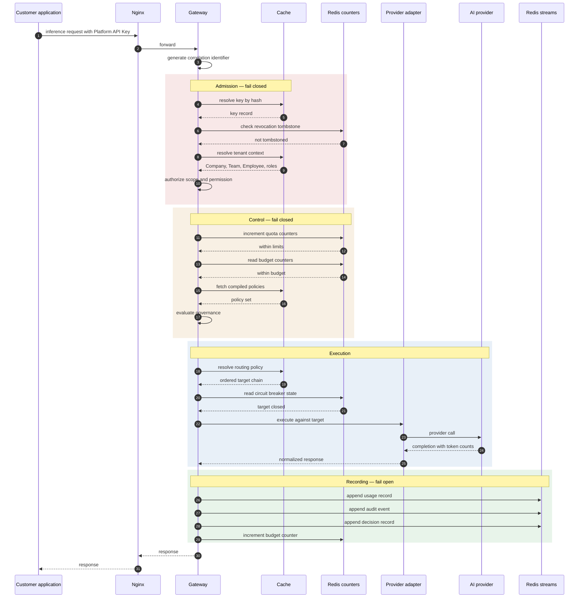

**Failure branches:**

| Step fails | Behaviour | Requirement |
| --- | --- | --- |
| Key not found or tombstoned | Reject, authentication error, audit event | FR-AUTH-014 |
| Authorization denied | Reject, audit event | FR-PERM-004 |
| Quota exceeded | Reject with retry guidance | FR-GW-012 |
| Budget hard limit reached | Reject, documented error | FR-COST-007 |
| Policy blocks in enforce mode | Reject, audit event with policy and reason | FR-GOV-008 |
| All targets exhausted | Reject, normalized exhaustion error, full decision record | FR-GW-008 |
| Stream append fails | **Request still succeeds**; failure alerted | FR-GW-017, FR-AUD-011 |
| Redis unavailable | **Request rejected** — quota and budget fail closed | AD-012, open decision D-3 |

---

### 3.3 F-2 — Gateway inference, streaming

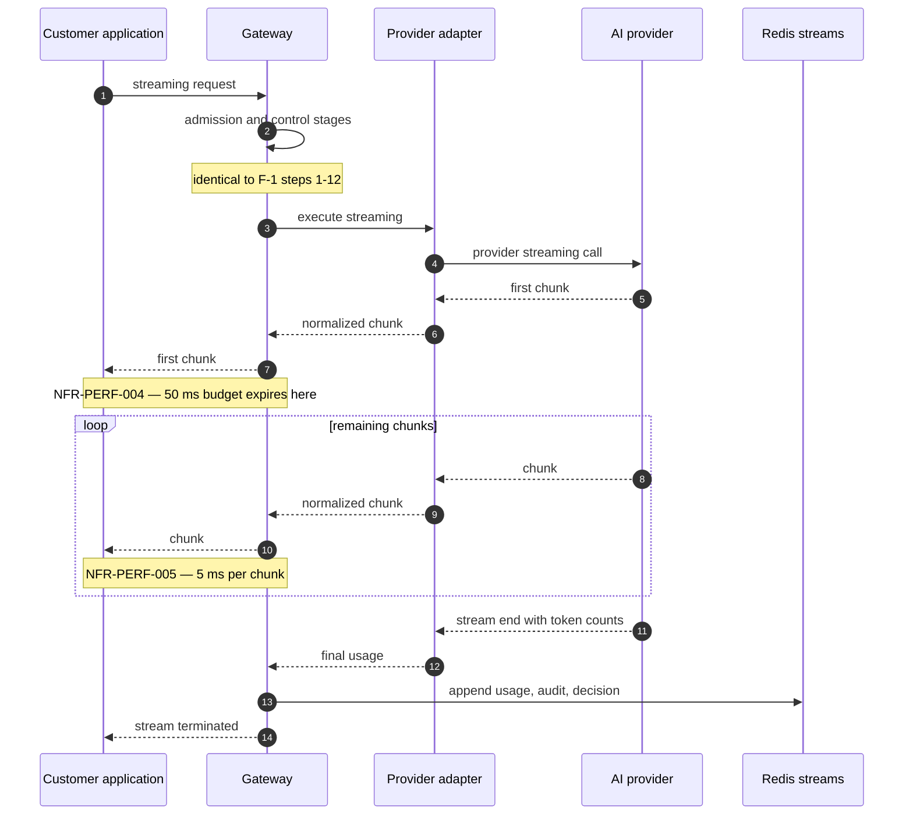

**Two branches that must not be treated as edge cases:**

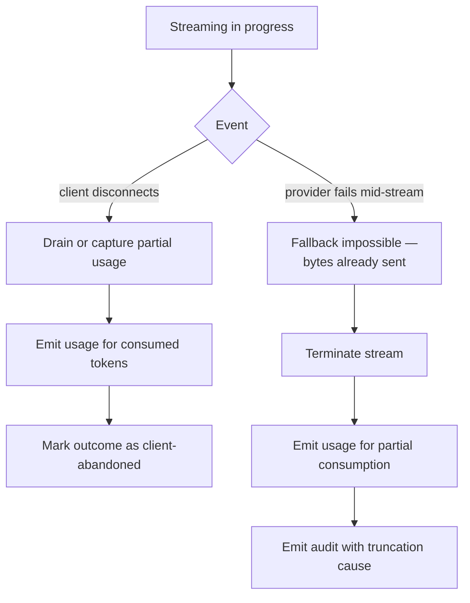

**Client disconnect must still record usage.** The provider bills for tokens already
generated. Discarding that usage under-reports cost silently and breaches NFR-DATA-003
in a way that is very hard to diagnose later.

**Mid-stream provider failure cannot fall back.** Once a byte has been sent the response
is committed to that target. This limits FR-GW-008 — fallback protects against failure
to *start*, not failure part-way through — and must appear in the customer-facing
failure-mode documentation required by NFR-AVAIL-015.

---

### 3.4 F-3 — Fallback and retry

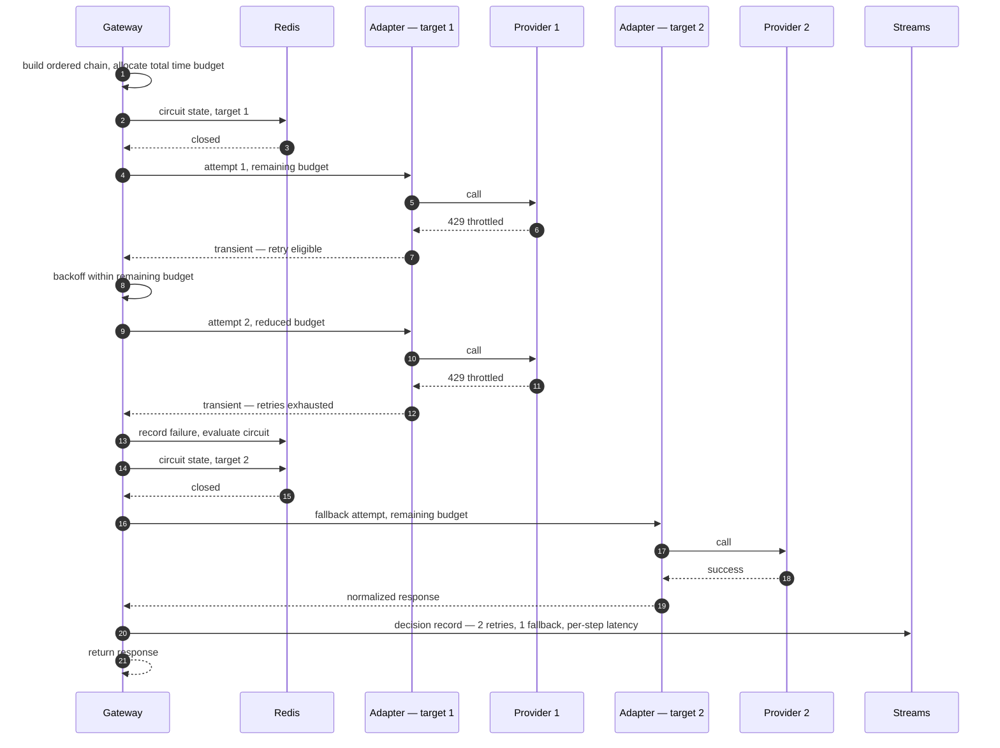

**The time budget is shared across the whole chain**, not renewed per attempt (GD-005).
A three-target chain each granted the full timeout would produce a request lasting three
times the customer's configured limit. Each attempt receives what remains; a target with
insufficient remaining budget is skipped rather than attempted futilely.

**Retry and fallback are counted separately** throughout, per the glossary and
FR-ANL-003. Conflating them makes routing behaviour uninterpretable in analytics.

---

### 3.5 F-4 — AI Chat message

Chat is the clearest demonstration that FR-CHAT-007 — chat traffic governed identically
to API traffic — is structural rather than a matter of discipline.

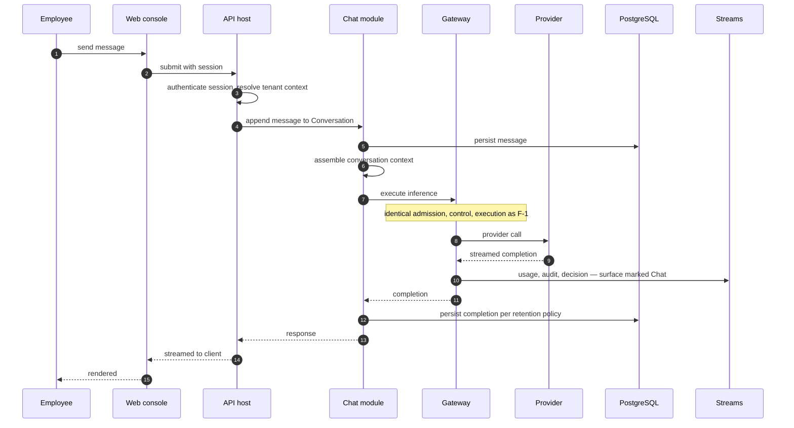

**Chat never calls a provider directly.** It calls the Gateway, which is why chat
traffic carries identical metering, governance, and audit. Had Chat been permitted its
own provider path, FR-CHAT-007 would depend on two implementations staying aligned
indefinitely.

**Persistence respects Content Retention.** Per FR-GOV-009 and NFR-PRIV-001, message
content is stored only where the Company has enabled retention for that Team. Where it
has not, the Conversation retains structure and metadata but not content — the
conversation remains listable and the usage remains attributable, while the content does
not persist.

---

### 3.6 F-5 — Extension command

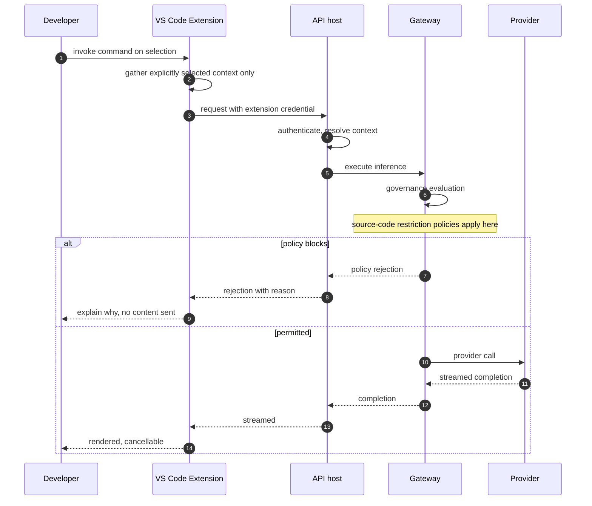

**The extension transmits only what the developer explicitly selected** (FR-EXT-014).
Context gathering is a client-side boundary, and it is a privacy control — an extension
that silently uploads workspace content would be a serious violation regardless of
downstream governance.

**Source-code governance is evaluated server-side.** A client-side check could be
bypassed by a modified client. The extension surfaces the reason clearly, but the
enforcement happens in the Gateway.

---

### 3.7 F-6 — Console authentication

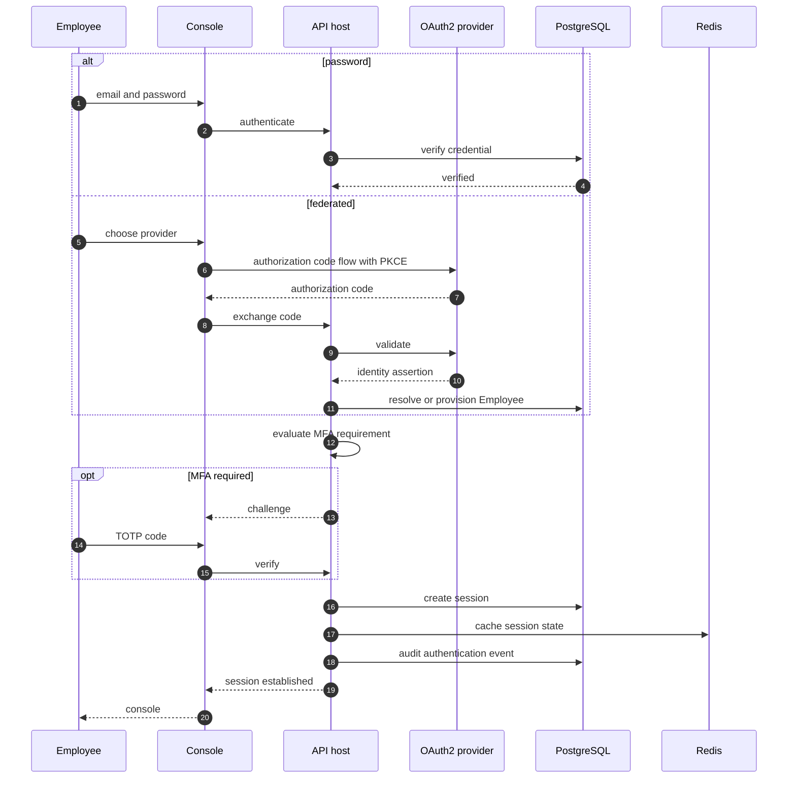

**Failure branches:**

| Condition | Behaviour | Requirement |
| --- | --- | --- |
| Invalid credential | Reject; increment failure counter; audit | FR-AUTH-014 |
| Threshold exceeded | Lock account; notify holder; audit | FR-AUTH-011 |
| Unverified email | Reject with verification path | FR-AUTH-013 |
| Method disabled by Company policy | Reject, explaining the permitted method | FR-AUTH-004 |
| MFA required, not enrolled | Force enrolment before access | FR-AUTH-006 |

---

### 3.8 F-7 — Management operation

The dispatcher pipeline in sequence.

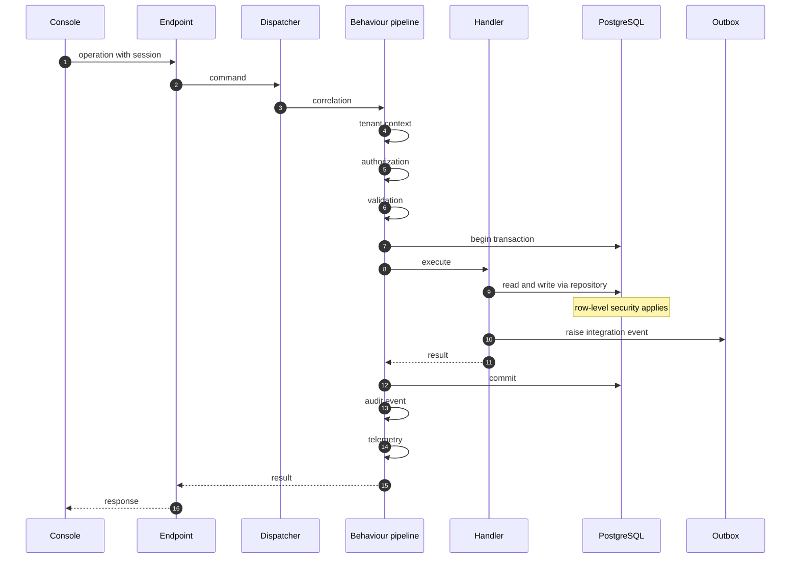

**Ordering is a correctness property.** Authorization precedes validation so an
unauthorized caller learns nothing about the shape of valid input. Validation precedes
the transaction so invalid input never opens one. The outbox write is inside the
transaction so an event is never published for rolled-back work. Audit follows the
handler so it observes the actual outcome, including failure.

---

### 3.9 F-9 and F-10 — Usage persistence and cost calculation

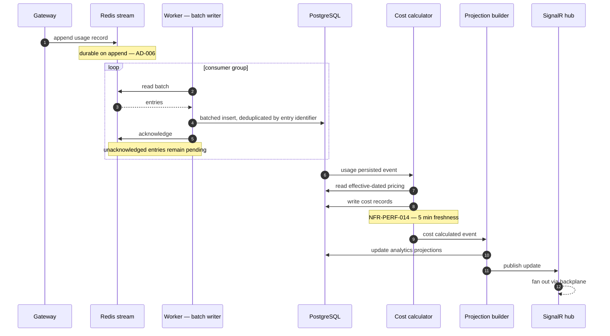

**Idempotency is mandatory.** The consumer group redelivers unacknowledged entries after
a consumer crash, so insertion must deduplicate by stream entry identifier. Without it,
a crash produces duplicate usage records — corrupting exactly the data NFR-DATA-009
requires to be reproducible.

**The reconciliation job** compares stream offsets against persisted counts on a
schedule and alerts on divergence, satisfying NFR-DATA-008. This is what turns the
zero-loss claim from an assumption into a monitored property.

---

### 3.10 F-12 and F-13 — Cache invalidation and revocation

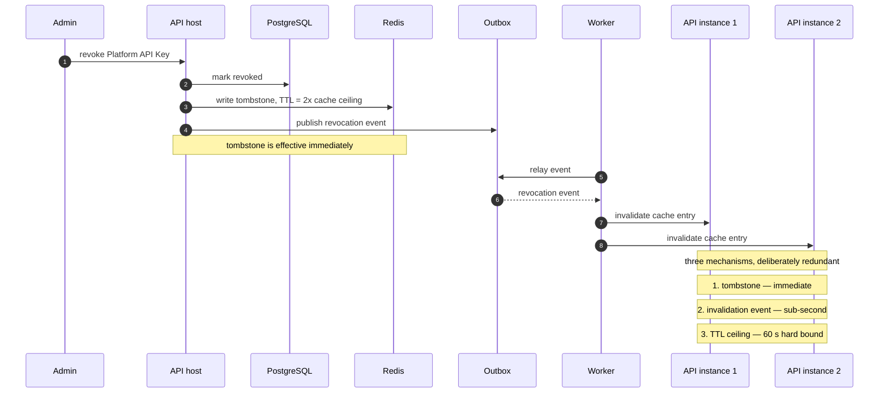

**Why three mechanisms.** Revocation is a security control where partial failure is
unacceptable, and each mechanism has a different failure mode. The tombstone fails only
if Redis is unavailable — in which case the Gateway is already down and rejecting
everything, so the failure is safe. The event fails if delivery is delayed. The
time-to-live ceiling cannot fail; it is a hard bound that guarantees FR-PERM-005 and
FR-AUTH-010 regardless of the other two.

---

### 3.11 Correlation across flows

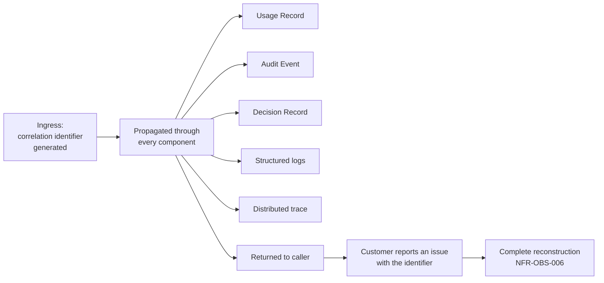

**This is what makes NFR-OBS-006 achievable**, and it is a genuine differentiator for
the P-02 persona: given one identifier, the platform can reconstruct exactly what
happened — which target was selected, which alternatives were considered, what the
circuit breaker states were, which retries occurred and why, and the latency of each
stage.

---

## 4. Design decisions

| # | Decision | Rationale |
| --- | --- | --- |
| **RF-001** | Chat calls the Gateway, never a provider directly | Makes FR-CHAT-007 structural rather than dependent on two implementations staying aligned |
| **RF-002** | Client disconnect during streaming still records usage | The provider bills for generated tokens; discarding silently breaches NFR-DATA-003 |
| **RF-003** | No fallback after the first byte is sent | Physically impossible; documented rather than engineered around |
| **RF-004** | Chain time budget is shared, not per attempt | Prevents a request lasting a multiple of the customer's timeout |
| **RF-005** | Extension gathers only explicitly selected context | A privacy control at the client boundary, independent of server governance |
| **RF-006** | Source-code governance enforced server-side | A client-side check is bypassable by a modified client |
| **RF-007** | Batch writer deduplicates by stream entry identifier | Consumer redelivery would otherwise duplicate ledger records |
| **RF-008** | Correlation identifier returned to the caller | Without it, NFR-OBS-006 is unusable in a support conversation |
| **RF-009** | Failed requests emit all three record types | A ledger of successes only cannot support incident investigation |
| **RF-010** | Reconciliation runs on a schedule, alert-only | Turns zero-loss from an assumption into a monitored property |

---

## 5. Trade-offs

| # | Gained | Given up |
| --- | --- | --- |
| T-1 | Chat through the Gateway guarantees uniform governance | An extra internal hop on every chat message |
| T-2 | Asynchronous persistence protects the latency budget | Freshness lag that must be disclosed per FR-ANL-008 |
| T-3 | Shared chain budget respects the customer's timeout | Later targets may receive too little time to be useful |
| T-4 | Triple-redundant revocation | Three mechanisms to maintain and test |
| T-5 | Correlation everywhere enables complete reconstruction | Propagation discipline required at every boundary |
| T-6 | Recording failed requests makes the ledger complete | Higher record volume, much of it for rejected traffic |
| T-7 | Client-side context boundary in the extension | Less capable than automatic context gathering would be |

---

## 6. Risks

| # | Risk | Severity | Mitigation |
| --- | --- | --- | --- |
| **R-1** | Correlation identifier dropped at a boundary, breaking reconstruction | High | Propagation asserted by integration test at every boundary |
| **R-2** | Mid-stream disconnect handling missed, under-reporting cost | High | Explicit test case; reconciliation detects systematic divergence |
| **R-3** | Batch writer deduplication defect produces duplicate ledger records | **Critical** | Deduplication by entry identifier; reconciliation compares counts |
| **R-4** | Chain budget exhausted before any target is attempted meaningfully | Medium | Minimum viable allocation; skip rather than attempt futilely |
| **R-5** | Chat retention branch leaks content where retention is disabled | **Critical** | Retention evaluated once at persistence; test asserts no content path when disabled |
| **R-6** | Invalidation event storm during bulk role change overwhelms the relay | Medium | Batched invalidation; TTL ceiling bounds the consequence of delay |
| **R-7** | Extension context gathering expands silently over time | Medium | Explicit selection is a reviewed boundary; changes require security review |
| **R-8** | Failed-request records dominate storage during an incident | Medium | Separate retention for decision records; rate-limited recording of repeated identical rejections |

---

## 7. Future considerations

- **Agentic workloads collapse these flows into one another.** A single logical operation
  will produce many F-1 executions under one parent. Correlation must extend to a trace
  identifier spanning them, which affects the Usage Record structure directly — see
  decision D-8 in [`system-architecture.md`](system-architecture.md) §8.
- **Response-side governance adds a stage to F-2 that cannot behave like the others.**
  Content arrives incrementally and cannot be retracted once sent.
- **Cached responses (FR-GW-022) create a fourth inference flow.** A cache hit produces
  no provider cost but must still be metered, audited, and policy-evaluated. The
  semantics need deciding before implementation.
- **Multi-region deployment adds a routing decision before F-1 begins.** Region selection
  based on data residency becomes a stage ahead of admission.
- **Batch inference would not fit these flows.** Provider batch interfaces are
  asynchronous with deferred completion, which the synchronous request model does not
  accommodate.
- **Every failure branch here is a hypothesis.** NFR-AVAIL-015 requires documented
  failure modes with *observed* behaviour. Failure-injection testing must confirm each
  branch before the documentation can be published.

---

## 8. Cross references

| Document | Relationship |
| --- | --- |
| [`ai-gateway-architecture.md`](ai-gateway-architecture.md) | Stage internals and budget allocation for F-1 to F-3 |
| [`authentication-architecture.md`](authentication-architecture.md) | Admission stages and revocation for F-6, F-13 |
| [`backend-architecture-overview.md`](backend-architecture-overview.md) | Pipeline detail for F-7 |
| [`component-diagram.md`](component-diagram.md) | Participants and failure impact |
| [`system-architecture.md`](system-architecture.md) | AD-005, AD-006, AD-012 governing these flows |
| [`frontend-architecture-overview.md`](frontend-architecture-overview.md) | Console side of F-4, F-6, F-8 |
| [`vscode-extension-architecture.md`](vscode-extension-architecture.md) | Client side of F-5 |
| [`../01-product/product-requirements.md`](../01-product/product-requirements.md) | Requirements referenced throughout |
| [`../01-product/non-functional-requirements.md`](../01-product/non-functional-requirements.md) | NFR-PERF, NFR-DATA, NFR-OBS targets |
| `../06-deployment/runbooks/` | Phase 3 — incident procedures using these flows |
