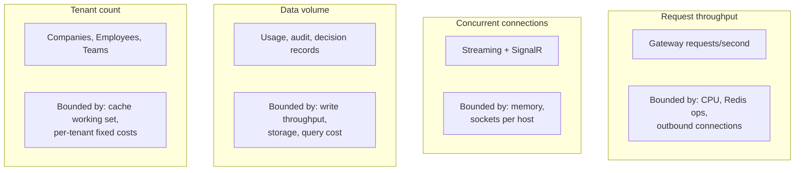
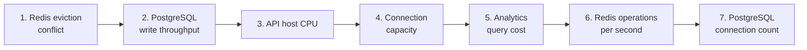
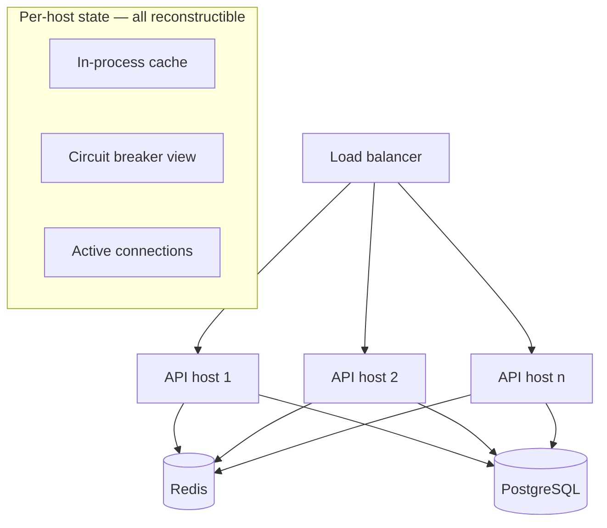
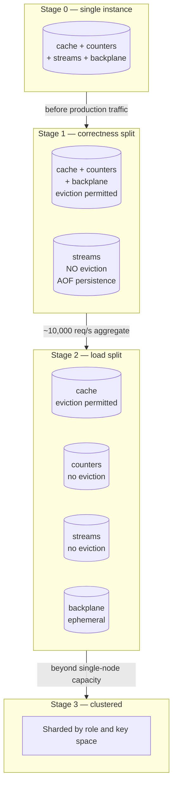
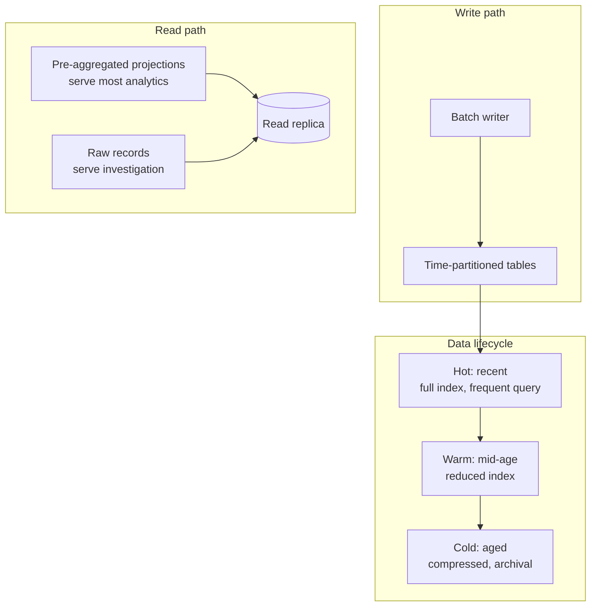
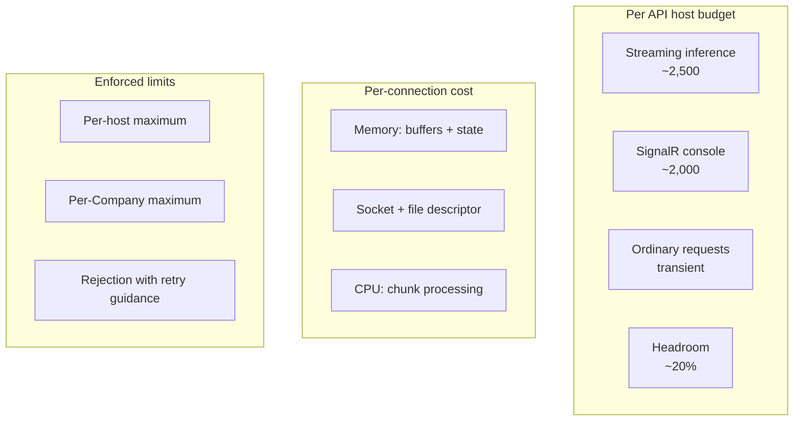
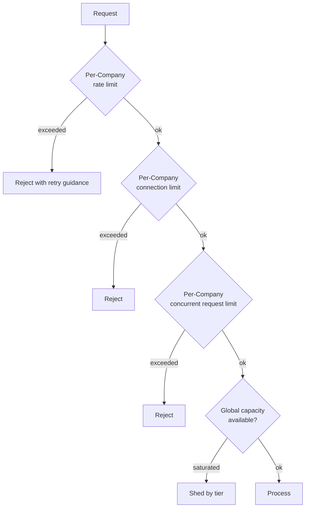
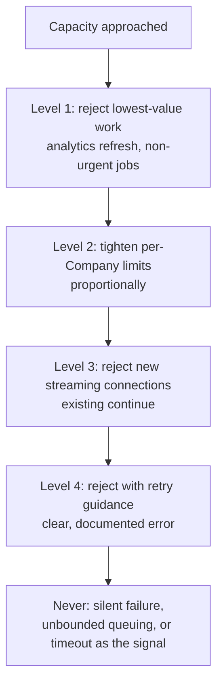

# Scalability Strategy

| Field | Value |
| --- | --- |
| Document | Scalability Strategy |
| Version | 1.0 |
| Status | Draft — capacity figures require load-test validation |
| Owner | Engineering |
| Last updated | 2026-07-30 |
| Audience | Engineering, Operations, Architecture Review |
| Phase | 2 — System Architecture |

---

## 1. Purpose

This document describes how MaintOrbit AI reaches the scale targets in
[`../01-product/non-functional-requirements.md`](../01-product/non-functional-requirements.md)
§4, which components constrain throughput, and in what order they are addressed.

Its aim is to make scaling a planned sequence rather than a series of emergencies. Each
bottleneck below is identified with the signal that indicates it is approaching and the
action that resolves it.

**All capacity figures are engineering estimates pending load testing.** They are stated
so they can be falsified, not because they are known.

---

## 2. Scope

### 2.1 In scope

- Scale targets and the dimensions that matter
- Component-by-component bottleneck analysis and scaling approach
- Redis separation sequence
- PostgreSQL growth strategy: partitioning, replication, retention
- Connection budgeting for SignalR and the database
- Multi-tenancy fairness and noisy-neighbour control
- Load shedding and backpressure
- Scaling triggers and their signals

### 2.2 Out of scope

| Excluded | Where |
| --- | --- |
| Deployment topologies and hosting | [`deployment-architecture.md`](deployment-architecture.md) |
| Component internals | [`ai-gateway-architecture.md`](ai-gateway-architecture.md), [`backend-architecture-overview.md`](backend-architecture-overview.md) |
| Index and partition definitions | `docs/03-database/` (Phase 3) |

### 2.3 Scale targets

| Requirement | Target |
| --- | --- |
| NFR-SCAL-001 | ≥ 500 concurrent Companies per deployment |
| NFR-SCAL-002 | ≥ 500 requests/second sustained Gateway throughput |
| NFR-SCAL-003 | ≥ 2,000 requests/second peak for ≥ 5 minutes |
| NFR-SCAL-004 | ≥ 10,000 concurrent streaming connections |
| NFR-SCAL-005 | ≥ 10,000 Employees per Company |
| NFR-SCAL-007 | ≥ 500 million Usage Records per Company, queryable |
| NFR-SCAL-010 | One Company's load must not degrade service for others |
| NFR-SCAL-012 | Backpressure rather than unpredictable failure at capacity |
| NFR-SCAL-013 | Capacity added without service interruption |

---

## 3. Architecture

### 3.1 Scaling dimensions

The system scales along four largely independent dimensions. Conflating them produces
the wrong response to a capacity signal.

| Dimension | Grows with | Primary constraint | Scaling response |
| --- | --- | --- | --- |
| Request throughput | Customer traffic | CPU on API hosts; Redis operations per second | Horizontal API hosts |
| Concurrent connections | Streaming and console usage | Memory and sockets per host | Horizontal API hosts; connection budgeting |
| Data volume | Cumulative, never decreases | PostgreSQL write and query cost | Partitioning, retention, read replicas |
| Tenant count | Customer acquisition | Cache working set; per-tenant fixed cost | Cache sizing; Redis capacity |

**Data volume is the only dimension that grows monotonically.** Traffic fluctuates;
records accumulate. NFR-SCAL-007 — 500 million Usage Records per Company — is therefore
the target that arrives whether or not traffic grows, and it is the one most likely to be
under-planned.

---

### 3.2 Bottleneck sequence

Bottlenecks in the order they are expected to appear.

| # | Bottleneck | Appears at | Signal | Action |
| --- | --- | --- | --- | --- |
| 1 | Redis eviction conflict | **Immediately** — a correctness issue, not capacity | Memory pressure on a shared instance | Separate streams onto a dedicated instance |
| 2 | PostgreSQL write throughput | ~200–400 req/s sustained | Batch writer lag; usage freshness exceeding 60 s | Larger batches; partitioning; write tuning |
| 3 | API host CPU | ~300–500 req/s per host | CPU saturation; latency budget breach | Add API hosts |
| 4 | Connection capacity | ~5,000 connections per host | Memory growth; socket exhaustion | Add hosts; connection budgeting |
| 5 | Analytics query cost | ~50–100 M records per Company | Query time exceeding NFR-PERF-010 | Pre-aggregation; partition pruning; read replica |
| 6 | Redis operations per second | ~10,000 req/s aggregate | Redis CPU saturation | Separate by role; then cluster |
| 7 | PostgreSQL connection count | Many API hosts | Pool exhaustion | Pooler tuning; read/write splitting |

**Bottleneck 1 is not a capacity problem and must not wait for capacity pressure.** Per
[`deployment-architecture.md`](deployment-architecture.md) §3.6, cache entries may be
evicted under memory pressure but stream entries must not — an evicted stream entry is a
permanently lost Usage Record, breaching NFR-DATA-001. Sharing one instance with one
eviction policy makes ledger loss a function of memory pressure.

---

### 3.3 API host scaling

**API hosts are stateless** per NFR-SCAL-009. Everything a host holds is either
reconstructible from Redis or bound to a specific connection.

| Per-host state | Shared? | Consequence of host loss |
| --- | --- | --- |
| In-process cache | No — a local view of Redis | Repopulated on demand |
| Circuit breaker state | **Yes — in Redis** | No relearning; other hosts already know |
| Streaming connections | No | Those requests fail; clients retry |
| SignalR connections | No — but backplane is shared | Clients reconnect |

**Circuit breaker state is shared deliberately** (GD-004). If each host learned target
failure independently, a failing provider would produce one wave of customer-visible
failures per host. Shared state means the first host to detect a failure protects all of
them.

**Scaling is horizontal and requires no interruption** per NFR-SCAL-013: a new host
starts with a cold cache, warms on demand, and joins the load balancer once readiness
passes.

---

### 3.4 Redis separation sequence

Redis serves four roles (AD-009) with genuinely different requirements. Separation is
staged, and the first step is driven by correctness rather than capacity.

| Role | Durability | Eviction | Failure consequence |
| --- | --- | --- | --- |
| **Cache** | None needed | **Permitted** | Latency spike, then recovery |
| **Counters** | Short-term | **Forbidden** | Quota and budget enforcement fails closed — Gateway halts |
| **Streams** | **Required** | **Forbidden** | **Permanent ledger loss** |
| **Backplane** | None needed | Permitted | Real-time updates degrade |

**Stage 1 must be reached before production traffic**, not when memory pressure appears.
The distinction between "may be evicted" and "must never be evicted" cannot be expressed
within a single instance's eviction policy.

---

### 3.5 PostgreSQL growth strategy

NFR-SCAL-007 requires 500 million Usage Records per Company to remain queryable. This is
the largest data challenge in the system.

| Technique | Purpose | Requirement |
| --- | --- | --- |
| Time-based partitioning | Bounds index size; makes retention a partition drop rather than a mass delete | NFR-SCAL-008 |
| Batched writes | Amortizes write cost; row-by-row cannot meet throughput | AD-006 |
| Pre-aggregated projections | Most analytics never touch raw records | NFR-PERF-010 |
| Read replicas | Analytics load isolated from the write path | NFR-PERF-010 |
| Tiered retention | Aged data compressed, retained without full index cost | NFR-DATA-007 — completeness preserved |
| Partition-aligned retention | Deletion by partition drop | NFR-PRIV-006 |

**Retention is enforced by dropping partitions, never by mass deletion.** Deleting
hundreds of millions of rows produces sustained write load, bloat, and a vacuum burden.
Dropping a partition is close to instantaneous.

**Tiering is how completeness survives scale.** The efficiency goal G4.5 in
[`../01-product/business-goals.md`](../01-product/business-goals.md) targets a 60%
reduction in storage cost per audit record, while
[`../01-product/mission.md`](../01-product/mission.md) §4.5 forbids sampling. Tiered
storage resolves this: older records move to compressed, less-indexed storage and remain
complete and queryable, at higher latency. Sampling would resolve it too, and is
excluded — this is the conflict flagged in
[`../01-product/non-functional-requirements.md`](../01-product/non-functional-requirements.md)
§17, and this is its architectural answer.

**Row-level security interacts with partitioning and must be measured.** Policies apply
per partition, and the query planner's ability to prune partitions under those policies
determines whether NFR-PERF-010 holds at NFR-SCAL-007 volume. This is risk R-1 in
[`system-architecture.md`](system-architecture.md) §6 and must be prototyped before
Phase 3.

---

### 3.6 Connection budgeting

NFR-SCAL-004 requires 10,000 concurrent streaming connections, and SignalR adds more.

| Connection type | Duration | Cost driver | Limit |
| --- | --- | --- | --- |
| Streaming inference | Seconds to minutes | Buffers plus per-chunk CPU | Per host and per Company |
| SignalR console | Hours | Persistent state | Per host and per Company |
| Ordinary request | Milliseconds | Negligible | Rate limited |
| Outbound to providers | Per request | Pooled and reused | Pool size per provider |

**Per-Company connection limits are required by NFR-SCAL-010.** Without them, one
Company opening thousands of streaming connections consumes capacity that other
Companies need — the noisy-neighbour problem in its most direct form.

**Outbound connection pooling to providers is easily overlooked and is a genuine
constraint.** Each provider call requires an outbound connection, and connection
establishment cost — including TLS negotiation — would be significant on every request if
pools were not reused. Pools must be sized per provider and monitored; exhaustion appears
as latency, not as an error, which makes it hard to diagnose.

---

### 3.7 Multi-tenancy fairness

| Control | Prevents |
| --- | --- |
| Per-Company rate limit | Request-volume monopolization |
| Per-Company connection limit | Connection-capacity monopolization |
| Per-Company concurrency limit | Long-running request monopolization |
| Worker queue partitioning | Batch work starving ingestion |
| Analytics query limits | One expensive query saturating a replica |

**Worker queue partitioning matters more than it appears.** If one Company's analytics
projection rebuild shares a queue with usage persistence, a large rebuild delays
ingestion for every Company — and usage freshness (NFR-PERF-013) degrades platform-wide.
Ingestion has a dedicated queue and dedicated worker allocation, protected from all other
job classes.

---

### 3.8 Load shedding and backpressure

NFR-SCAL-012 requires backpressure rather than unpredictable failure at capacity.

| Principle | Statement |
| --- | --- |
| Shed early and explicitly | A clear rejection with retry guidance is more useful than a timeout |
| Shed lowest-value first | Background refresh before customer-facing inference |
| Never shed audit or usage | NFR-DATA-007 forbids sampling under any load condition |
| Bound every queue | An unbounded queue converts a capacity problem into a memory exhaustion failure |
| Make shedding observable | Shed requests are recorded and alerted; silent shedding is indistinguishable from a defect |

**"Never shed audit or usage" is the constraint that shapes everything else.** Under
load, the tempting optimization is to sample telemetry — and NFR-DATA-007 forbids it
precisely because that temptation is predictable. If ingestion cannot keep up, the
correct response is to shed inference requests, not to stop recording the ones that
succeed.

---

### 3.9 Scaling triggers

Each signal has a threshold and a defined action, so scaling is planned rather than
reactive.

| Signal | Threshold | Action |
| --- | --- | --- |
| Gateway overhead p95 | > 40 ms *(80% of NFR-PERF-002)* | Add API hosts |
| API host CPU | > 65% sustained | Add API hosts |
| Redis operations per second | > 70% of measured capacity | Advance the separation stage |
| Redis memory | > 75% on any instance | Increase memory; verify eviction policy |
| Batch writer lag | Usage freshness > 45 s *(75% of NFR-PERF-013)* | Increase batch size or writer allocation |
| Stream depth | Growing over 15 minutes | Investigate writer; add capacity |
| PostgreSQL connection pool | > 75% utilization | Tune pooler; consider read/write split |
| Analytics query p95 | > 2.2 s *(75% of NFR-PERF-010)* | Add pre-aggregation; add read replica |
| Connections per host | > 4,000 | Add API hosts |
| Records per Company | > 100 M | Verify partition pruning; plan tiering |

**Thresholds are set at 65–80% of the requirement**, not at the requirement. Scaling
takes time; a trigger that fires when the requirement is already breached is a
post-mortem, not a trigger.

---

## 4. Design decisions

| # | Decision | Rationale |
| --- | --- | --- |
| **SD-001** | Redis stream separation happens before production traffic | A correctness requirement, not a capacity one — evicted stream entries are lost ledger data |
| **SD-002** | Circuit breaker state is shared, not per host | Per-host learning multiplies customer-visible failures by host count |
| **SD-003** | Retention enforced by partition drop, never mass deletion | Mass deletion produces bloat and sustained write load |
| **SD-004** | Tiered storage preserves completeness; sampling is never the answer | Resolves the G4.5 versus mission §4.5 conflict architecturally |
| **SD-005** | Most analytics served from pre-aggregated projections | Raw records cannot serve NFR-PERF-010 at NFR-SCAL-007 volume |
| **SD-006** | Per-Company limits on requests, connections, and concurrency | NFR-SCAL-010 requires isolation from noisy neighbours |
| **SD-007** | Ingestion has a dedicated worker queue and allocation | Batch work must never delay ledger persistence |
| **SD-008** | Every queue is bounded | An unbounded queue turns capacity exhaustion into memory exhaustion |
| **SD-009** | Usage and audit recording is never shed | NFR-DATA-007 under all load conditions; shed inference instead |
| **SD-010** | Scaling triggers fire at 65–80% of requirement thresholds | Scaling takes time; firing at the limit is too late |
| **SD-011** | Provider connection pools sized and monitored per provider | Pool exhaustion presents as latency, not error — hard to diagnose without monitoring |

---

## 5. Trade-offs

| # | Gained | Given up |
| --- | --- | --- |
| T-1 | Stateless API hosts scale horizontally without coordination | Cold cache on each new host; brief warm-up latency |
| T-2 | Shared circuit state prevents duplicated failure discovery | Redis becomes a dependency of resilience itself |
| T-3 | Redis separation gives per-role correctness and capacity | More instances to operate and monitor |
| T-4 | Partitioning bounds index size and makes retention cheap | Query planning complexity; partition management overhead |
| T-5 | Pre-aggregation makes analytics fast | Projections must be maintained and rebuildable; aggregate shapes constrain query flexibility |
| T-6 | Tiered storage preserves completeness affordably | Aged queries are slower; a two-tier query path to implement |
| T-7 | Per-Company limits guarantee fairness | Legitimate bursts are constrained; limits need per-plan tuning |
| T-8 | Explicit shedding is predictable | Rejections are visible to customers rather than absorbed |

---

## 6. Risks

| # | Risk | Severity | Likelihood | Mitigation |
| --- | --- | --- | --- | --- |
| **R-1** | Shared Redis evicts stream entries, silently losing ledger data | **Critical** | Medium | SD-001 before production; eviction policy verified in deployment tests; memory alerting |
| **R-2** | Row-level security prevents partition pruning, making NFR-PERF-010 unreachable at volume | High | Medium | Prototype before Phase 3; pre-aggregation reduces reliance on raw queries |
| **R-3** | Batch writer cannot keep pace, growing the stream unboundedly | High | Medium | Stream depth alerting; writer allocation is scalable; shed inference before dropping records |
| **R-4** | Provider connection pool exhaustion presents as unexplained latency | Medium | **High** | Per-provider pool sizing and monitoring; saturation is an alerting condition |
| **R-5** | Per-Company limits are set too low and constrain legitimate customers | Medium | High | Per-plan configuration; monitoring of rejection rates by Company |
| **R-6** | Analytics projections diverge from source records | High | Low | Projections are rebuildable; reconciliation compares aggregates against source |
| **R-7** | Cache working set grows with tenant count beyond Redis memory | Medium | Medium | Cache is evictable by design; monitor hit ratio, not just memory |
| **R-8** | Load shedding is implemented but never exercised, failing when needed | Medium | **High** | Shedding paths exercised in load testing, not only in production incidents |
| **R-9** | Capacity estimates in §3.2 prove materially wrong | High | **High** | They are estimates; load testing before GA is required, not optional |

---

## 7. Future considerations

- **Gateway extraction is the natural response to bottleneck 3.** Its scaling profile —
  high request volume, low data volume, strict latency — differs from every other module.
  Extracting it allows independent scaling without over-provisioning management surfaces.
  See AD-014.
- **Analytics will need a different store.** At NFR-SCAL-007 volume, a columnar or
  time-series store is materially better suited than PostgreSQL. BD-007 — Analytics holds
  no authoritative state — exists so this is a projection rebuild rather than a data
  migration. Whatever is chosen must remain self-hostable per NFR-PORT-002.
- **Multi-region changes every assumption here.** Cross-region replication, write
  routing, and regional cache coherence are all new problems arriving with v2.1.
- **Agentic workloads change the throughput model fundamentally.** One user action
  producing dozens of chained calls means request volume decouples from user activity,
  and per-request limits stop being a meaningful fairness control.
- **Provider rate limits become the binding constraint before our own capacity does.**
  A customer's provider account has its own limits, and at high volume those are hit
  before platform capacity is. Multi-connection routing (FR-PROV-012) partially addresses
  this, and it may deserve a first-class capability.
- **Cost per request must be tracked as a scaling metric.** Goal G4.2 targets a 45%
  reduction in infrastructure cost per million requests. That requires per-request cost
  attribution against our own infrastructure — a measurement that does not exist yet and
  should be designed alongside capacity monitoring.

---

## 8. Cross references

| Document | Relationship |
| --- | --- |
| [`system-architecture.md`](system-architecture.md) | AD-005, AD-006, AD-009, AD-014 |
| [`deployment-architecture.md`](deployment-architecture.md) | Topologies these strategies scale within |
| [`ai-gateway-architecture.md`](ai-gateway-architecture.md) | Hot-path costs driving throughput limits |
| [`component-diagram.md`](component-diagram.md) | Failure impact under saturation |
| [`backend-architecture-overview.md`](backend-architecture-overview.md) | Worker partitioning; projection design |
| [`../01-product/non-functional-requirements.md`](../01-product/non-functional-requirements.md) | NFR-SCAL, NFR-PERF, NFR-DATA targets |
| [`../01-product/business-goals.md`](../01-product/business-goals.md) | G4.2 and G4.5 efficiency goals |
| [`../01-product/mission.md`](../01-product/mission.md) | §4.5 — the no-sampling constraint |
| `../03-database/` | Phase 3 — partitioning and index design |
| `../06-deployment/monitoring/` | Phase 3 — trigger instrumentation |
