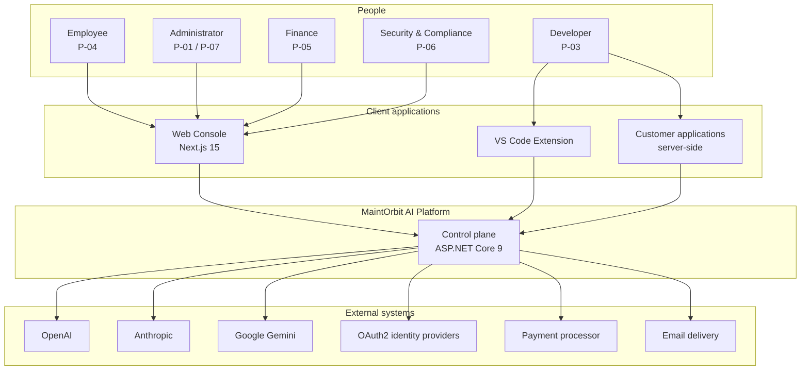
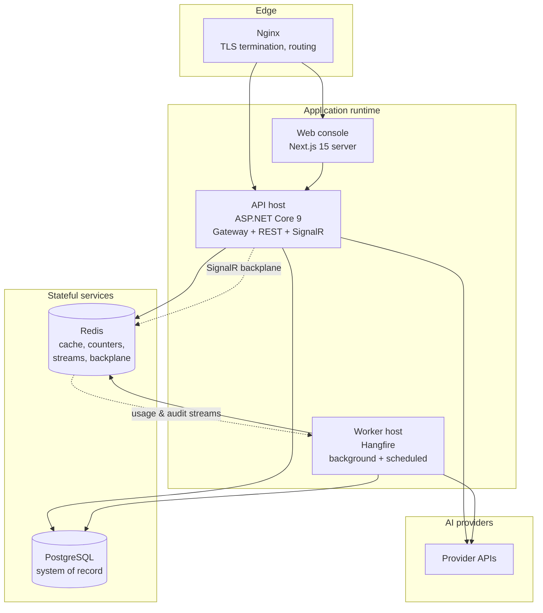
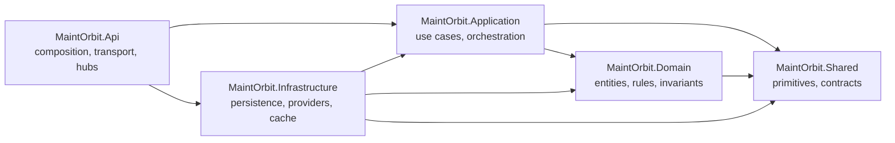
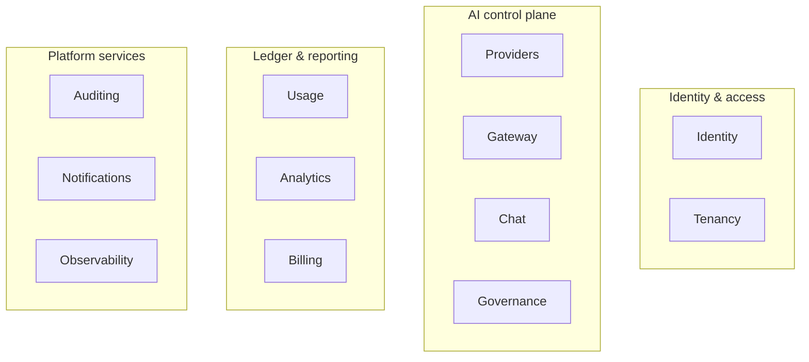
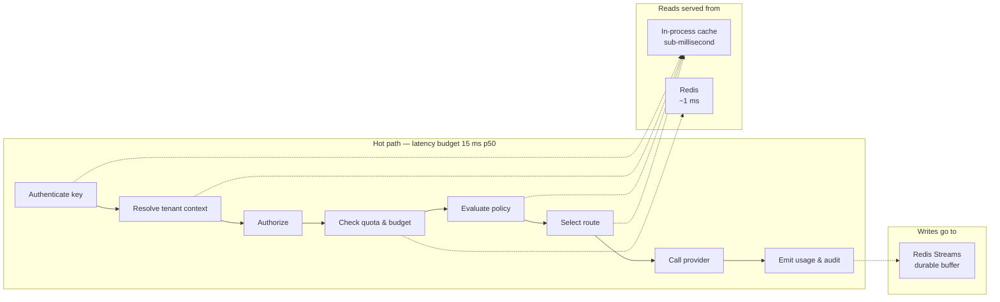
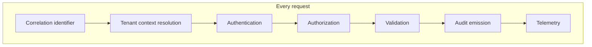
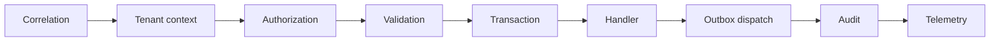
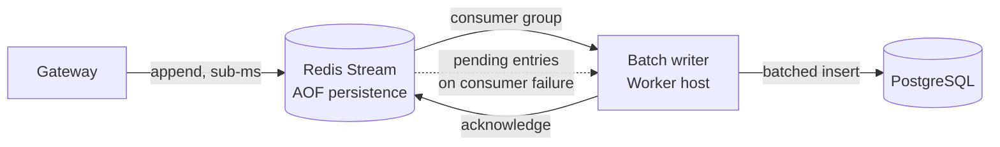
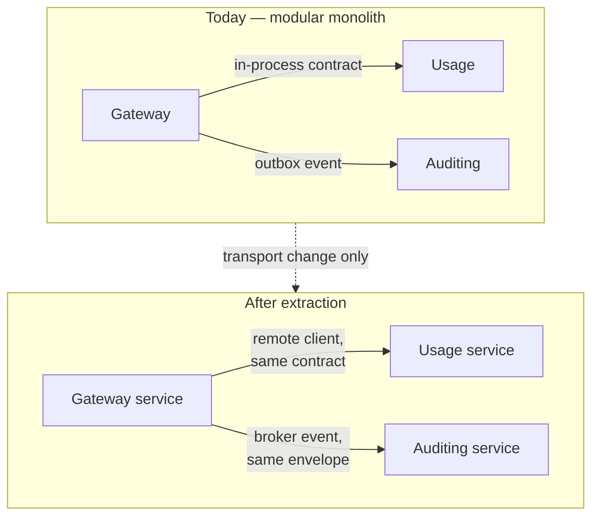

# System Architecture

| Field | Value |
| --- | --- |
| Document | System Architecture (master) |
| Version | 1.0 |
| Status | Draft — pending engineering review and ADR ratification |
| Owner | Engineering |
| Last updated | 2026-07-30 |
| Audience | Engineering, Architecture Review, Security, Operations |
| Phase | 2 — System Architecture |

---

## 1. Purpose

This is the master architecture document for MaintOrbit AI. It establishes the
system's structure, the numbered architecture decisions that bind every other design
document, and the reasoning behind them.

Its function is to make the expensive decisions once, explicitly, and in a place every
subsequent design references. Where a later document appears to contradict this one,
this one governs until amended.

**This document contains no implementation code, no API definitions, and no database
schema.** Those are Phase 3 deliverables in `docs/03-database/` and `docs/04-api/`.

---

## 2. Scope

### 2.1 In scope

- System context, containers, and the boundary of the platform
- The layering and module decomposition of the backend
- Numbered architecture decisions (`AD-001` … `AD-014`) binding all Phase 2 and 3 work
- Cross-cutting concerns: tenancy, security, eventing, caching, background work
- Technology selection and its justification against the requirements
- The path from modular monolith to extracted services

### 2.2 Out of scope

| Excluded | Where it belongs |
| --- | --- |
| Database schema, tables, columns, indexes | `docs/03-database/` (Phase 3) |
| API paths, verbs, payloads, error bodies | `docs/04-api/` (Phase 3) |
| Application code and configuration | Phase 4 |
| Detailed Gateway internals | [`ai-gateway-architecture.md`](ai-gateway-architecture.md) |
| Detailed identity internals | [`authentication-architecture.md`](authentication-architecture.md) |
| Deployment topology and infrastructure | [`deployment-architecture.md`](deployment-architecture.md) |
| Scaling mechanics | [`scalability-strategy.md`](scalability-strategy.md) |

### 2.3 Requirements this architecture must satisfy

The binding inputs are 230 functional requirements in
[`../01-product/product-requirements.md`](../01-product/product-requirements.md) and
155 non-functional requirements in
[`../01-product/non-functional-requirements.md`](../01-product/non-functional-requirements.md).

Five of them dominate every structural decision:

| Requirement | Constraint imposed |
| --- | --- |
| **NFR-PERF-001/002** — Gateway overhead p50 ≤ 15 ms, p95 ≤ 50 ms | No synchronous relational read is permissible in the Gateway hot path |
| **NFR-DATA-001/002/007** — zero usage or audit loss, never sampled | Ingestion must be durable before it is acknowledged, and asynchronous |
| **NFR-SEC-007** — isolation enforced below the application layer | Tenancy cannot rely on developers remembering a filter |
| **NFR-PORT-002** — no dependency that cannot run in a customer environment | Excludes all managed cloud services from the runtime path |
| **NFR-MAINT-003** — any module extractable without changing others | Modules communicate only through contracts and events |

---

## 3. Architecture

### 3.1 System context

**Boundary statement.** The platform governs traffic that passes through it. Traffic a
customer sends directly to a provider is invisible to it and ungoverned. This is
stated in [`../01-product/problem-statement.md`](../01-product/problem-statement.md)
§9 and is an architectural fact, not a limitation to be engineered around.

---

### 3.2 Container view

| Container | Responsibility | Scaling characteristic |
| --- | --- | --- |
| **Nginx** | TLS termination, request routing, static asset serving, connection limits | Vertical; stateless |
| **API host** | Gateway hot path, management REST surface, SignalR hubs | Horizontal, stateless |
| **Worker host** | Usage and audit persistence, cost calculation, catalog refresh, notifications, scheduled reporting | Horizontal, partitioned by job type |
| **Web console** | Server-rendered console; no business logic | Horizontal, stateless |
| **PostgreSQL** | System of record for all durable state, including Hangfire storage | Vertical, then read replicas |
| **Redis** | Hot-path cache, budget and rate counters, durable ingestion streams, SignalR backplane | Vertical, then cluster |

**Separation of API and Worker hosts is deliberate.** The Gateway's latency budget
cannot tolerate competing with batch work for CPU or connection-pool capacity in the
same process. This separation is required from day one, not deferred.

---

### 3.3 Layering — Clean Architecture

| Layer | Contains | Depends on | Never contains |
| --- | --- | --- | --- |
| **Domain** | Entities, value objects, domain events, invariants, repository *interfaces* | Shared only | Persistence, HTTP, provider SDKs, framework types |
| **Application** | Commands, queries, handlers, validators, orchestration, port interfaces | Domain, Shared | Concrete infrastructure, transport concerns |
| **Infrastructure** | Persistence, provider adapters, cache, messaging, external integrations | Application, Domain, Shared | Business rules |
| **Api** | Composition root, transport, hubs, middleware, filters | Application, Infrastructure, Shared | Business logic of any kind |
| **Shared** | Primitives, result types, tenancy context, contracts | Nothing | Anything module-specific |

**Dependency rule.** Dependencies point inward. `Domain` references nothing but
`Shared`. `Infrastructure` depends on `Application` because it implements ports
declared there — the dependency inversion that keeps the domain free of persistence
concerns.

This is verified mechanically, not by review — see AD-013.

---

### 3.4 Module decomposition — Modular Monolith

Twelve modules, each a vertical slice cutting through the Domain, Application,
Infrastructure, and Api layers.

| Module | Owns | Capability areas from Phase 1 |
| --- | --- | --- |
| **Identity** | Employees, credentials, sessions, roles, permissions, Platform API Keys | `FR-AUTH`, `FR-PERM`, `FR-API` (key lifecycle) |
| **Tenancy** | Companies, Teams, memberships, invitations, organizational settings | `FR-TEN` |
| **Providers** | Provider Connections, credential custody, model catalog, health | `FR-PROV` |
| **Gateway** | Routing policies, inference execution, resilience, normalization | `FR-GW` |
| **Chat** | Conversations, messages, chat-specific presentation state | `FR-CHAT` |
| **Governance** | Policies, evaluation, content retention configuration | `FR-GOV` |
| **Usage** | Usage Records, Cost Records, pricing versions, Budgets, Quotas | `FR-USG`, `FR-COST` |
| **Analytics** | Read models, aggregations, reporting projections | `FR-ANL` |
| **Billing** | Plans, subscriptions, invoices, payment lifecycle | `FR-BILL` |
| **Auditing** | Audit Events, retention, export | `FR-AUD` |
| **Notifications** | Delivery, preferences, rate limiting | `FR-NOT` |
| **Observability** | Request inspection, routing decision records, platform telemetry | `NFR-OBS` |

> **Delta from Phase 0.** The Phase 0 repository structure defined eleven modules and
> did not include **Chat**. Conversations and Messages are a distinct aggregate with
> their own lifecycle, retention rules, and access constraints, and folding them into
> Gateway would couple an inference concern to a presentation concern. A `Chat` module
> is therefore required in `backend/src/*/Modules/`. This is recorded as an action in
> §8, not created here.

#### Module interaction rules

| Rule | Statement |
| --- | --- |
| **R-1** | A module may reference another module's **published contracts** only — never its entities, repositories, or internal services. |
| **R-2** | A module may not query another module's data store, including by join. |
| **R-3** | Cross-module communication is by direct call to a published contract (synchronous) or by integration event (asynchronous). |
| **R-4** | Integration events are versioned, serializable, and carry no domain object references. |
| **R-5** | Shared reference data is duplicated by projection, not joined. |
| **R-6** | A module owns its schema; no other module holds a foreign key into it. |

These rules exist for one purpose: **NFR-MAINT-003**, extraction without rewrite.
They are enforced by architecture tests (AD-013).

---

### 3.5 The hot path versus the management path

The single most important structural distinction in the system.

| | Hot path | Management path |
| --- | --- | --- |
| **Traffic** | Gateway, Chat, Extension inference | Console, REST management, analytics |
| **Latency budget** | 15 ms p50 platform overhead | 300 ms p95 (NFR-PERF-016) |
| **Relational reads** | **None permitted** | Normal |
| **Relational writes** | **None synchronous** | Normal, transactional |
| **Cache posture** | Read-through, mandatory | Optional |
| **Failure posture** | Classified fail-open or fail-closed | Fail with error |

**Consequence.** Every piece of state the hot path needs — API key hashes, tenant
context, role grants, routing policies, compiled governance policies, model catalog,
budget state — must be resident in Redis or in-process memory, and must have a defined
invalidation path when its source of truth changes. This drives AD-005 and AD-006 and
is detailed in [`ai-gateway-architecture.md`](ai-gateway-architecture.md).

---

### 3.6 Cross-cutting concerns

| Concern | Mechanism | Requirement |
| --- | --- | --- |
| Correlation | Identifier generated at ingress, propagated through every call, returned to caller | NFR-OBS-002 |
| Tenant context | Resolved once at ingress into an ambient scoped context; drives the database session variable | NFR-SEC-007 |
| Authentication | Session token or Platform API Key; never both | FR-AUTH-\* |
| Authorization | Deny-by-default permission evaluation at execution, not at transport | FR-PERM-001/002 |
| Validation | FluentValidation in the pipeline before any handler executes | FR-X-001 |
| Audit | Emitted by the pipeline for qualifying operations, not by handlers individually | FR-AUD-001 |
| Telemetry | OpenTelemetry traces, metrics, structured logs | NFR-OBS-001/003/004 |
| Mapping | Mapster, compile-time generated | — |

**Audit emission is a pipeline concern, not a handler concern.** If each handler is
responsible for its own audit event, coverage becomes a function of developer
discipline and FR-AUD-001 will not hold. The pipeline emits; handlers enrich.

---

## 4. Design decisions

Each decision is binding on all subsequent Phase 2 and Phase 3 work. Decisions marked
**ADR required** must be formally ratified before Phase 3 begins.

---

### AD-001 — Modular monolith with layer-major, module-minor organization

**Decision.** Five deployable projects (`Api`, `Application`, `Domain`,
`Infrastructure`, `Shared`) with modules as folders inside each, rather than a project
per module.

**Rationale.** Phase 0 fixed the five-project structure. Layer-major organization keeps
the dependency rule enforceable with a single set of project references, keeps build
times low, and avoids 60 projects for 12 modules. Module boundaries are enforced by
namespace rules in architecture tests rather than by assembly boundaries.

**Consequence.** Module isolation depends entirely on AD-013. Without executing
architecture tests, the boundaries are advisory and will erode.

---

### AD-002 — Tenant isolation by shared database, module schemas, and row-level security

**ADR required — this is the highest-impact unresolved decision from Phase 1 (Q-2).**

**Decision.** A single PostgreSQL database. One schema per module. Every tenant-scoped
relation carries a `company_id`. Isolation is enforced by **PostgreSQL row-level
security**, with the current Company set as a session variable at connection checkout
from the ambient tenant context.

**Options considered:**

| Option | Isolation strength | Operational cost | Verdict |
| --- | --- | --- | --- |
| Discriminator column, application-enforced | Weak — one missing filter leaks data | Lowest | **Rejected** — violates NFR-SEC-007 explicitly |
| Discriminator column + row-level security | Strong — enforced by the database | Low | **Selected** |
| Schema per Company | Very strong | High — thousands of schemas, migration fan-out | Rejected at target scale |
| Database per Company | Strongest | Very high — connection and migration burden | Reserved for self-hosted single-tenant |

**Rationale.** NFR-SEC-007 requires that an application-layer defect cannot cause
cross-tenant exposure. Only database-enforced isolation satisfies that literally. Row-
level security places the check below every query the application can construct,
including a query that forgets its filter.

**Consequences.**
- The tenant session variable must be set on every connection checkout, including for
  Hangfire workers and analytics queries. A missed assignment fails closed — returning
  no rows — which is the correct failure direction.
- Platform-administrative operations require an explicitly elevated role, used only in
  well-defined and audited paths.
- Row-level security has a query-planning cost that must be measured against
  NFR-PERF-010 before ratification.

**Open risk.** Row-level security interacts poorly with some connection-pooling
patterns. This must be prototyped in Phase 3 before schema work begins.

---

### AD-003 — In-process event bus with transactional outbox

**Decision.** Cross-module asynchronous communication uses integration events
dispatched in-process, written to a transactional outbox in the publishing module's
schema, and relayed by a background dispatcher.

**Rationale.** The outbox makes event publication atomic with the state change that
caused it. Without it, a crash between commit and publish silently loses the event —
unacceptable for usage, cost, and audit correctness. Publishing through an outbox now
means the transport can be replaced with a message broker at extraction time by
changing the relay only.

**Trade-off.** Adds write amplification and delivery latency measured in seconds. For
cross-module notification this is acceptable; for the hot path it is not, which is why
usage ingestion uses AD-006 instead.

---

### AD-004 — In-house CQRS dispatcher

**ADR required.**

**Decision.** Command and query dispatch uses a small in-house abstraction with a
pipeline behaviour chain, rather than MediatR.

**Rationale.** MediatR's licensing terms changed, and the abstraction appears in every
handler signature in the system — the most expensive place to be exposed to a
dependency's commercial terms. The required surface is small: a dispatcher, a handler
interface, and an ordered behaviour pipeline.

**Trade-off.** We own and test code that is otherwise free, and lose ecosystem
familiarity. The surface is small enough that this is the cheaper risk.

**Pipeline order** — fixed, because ordering is a correctness property:

---

### AD-005 — Hot path reads served exclusively from cache

**Decision.** The Gateway performs no synchronous relational read. All state required
to authenticate, authorize, route, and meter a request is served from a two-tier cache:
in-process memory backed by Redis.

**Rationale.** NFR-PERF-001 allows 15 ms p50 for the entire platform overhead. A
single relational round-trip plus connection acquisition consumes a substantial
fraction of that, and the hot path needs six or more distinct pieces of state.

**Consequences.**
- Every cached item requires a defined invalidation path, triggered by the integration
  event that changes its source of truth.
- FR-PERM-005 and FR-AUTH-010 require role and session changes to take effect within
  one minute. Cache time-to-live is therefore bounded at 60 seconds even when
  invalidation is expected to be immediate, so that a missed invalidation self-corrects
  inside the requirement.
- Redis becomes a hard dependency of the Gateway. See §6, R-2.

---

### AD-006 — Usage and audit ingestion via durable stream, persisted by batch

**Decision.** The Gateway writes Usage Records and Audit Events to Redis Streams,
acknowledged before the response returns. A Worker consumer batches them into
PostgreSQL.

**Rationale.** NFR-DATA-001 and -002 require zero loss and NFR-DATA-007 forbids
sampling, while NFR-PERF-001 forbids a synchronous write. A durable append-only buffer
reconciles them: the record is durable before acknowledgement, and persistence is
amortized across a batch.

**Trade-off — stated honestly.** This does not achieve literal zero loss. Redis
append-only persistence with per-second fsync has a bounded loss window if the Redis
node fails uncleanly. The residual exposure is approximately one second of ingestion.

**Mitigations:** append-only file enabled with per-second sync; a replica with
automatic failover; consumer-group pending-entry tracking so a consumer crash cannot
lose acknowledged-but-unwritten records; a reconciliation job comparing stream offsets
to persisted counts, alerting on divergence per NFR-DATA-008.

**This gap must be disclosed rather than concealed.** NFR-DATA-001 states zero loss;
this design achieves zero loss under all failure modes except uncontrolled loss of the
Redis primary. Either the requirement is amended to state that bound, or a
higher-durability intake is funded. **This is an open decision — see §8.**

---

### AD-007 — Provider integration by adapter behind a stable port

**Decision.** Each AI Provider is integrated through an adapter implementing a single
port defined in the Application layer. Provider SDKs, where used, are confined to their
adapter and never referenced elsewhere.

**Rationale.** FR-PROV-002 requires three providers at MVP and NFR-MAINT-006 requires
that adding a provider touches nothing outside the abstraction. The port is the
narrowest interface that supports chat completion, streaming, tool calling, token
reporting, and error classification.

**Trade-off.** The abstraction is lossy at the edges — provider-specific parameters
must either be passed through opaquely or dropped. Passing through opaquely is chosen,
because the P-08 persona requires access to provider-specific behaviour and a
lowest-common-denominator abstraction would block them.

---

### AD-008 — Envelope encryption for provider credentials

**ADR required.**

**Decision.** Provider Credentials are protected by envelope encryption: a per-Company
data encryption key, itself encrypted by a key-encryption key held outside the database.
Ciphertext is stored; plaintext exists only transiently in memory during a provider
call.

**Rationale.** NFR-SEC-003 requires keys distinct from those protecting general data,
and NFR-SEC-004 forbids retrieval by any role. Per-Company data keys bound the blast
radius of a single key compromise and make per-Company key rotation possible
(NFR-SEC-019).

**Constraint from NFR-PORT-002.** The key-encryption key cannot live in a managed
cloud service in the base architecture, because a customer-hosted deployment must
function without one. The design must therefore support a pluggable key custodian, with
a file- or environment-supplied key as the portable default and a cloud key vault as an
optional provider.

---

### AD-009 — Redis serves four distinct roles

**Decision.** Redis is used as hot-path cache, atomic counter store for quotas and
budgets, durable ingestion buffer, and SignalR backplane.

| Role | Why Redis | Failure impact |
| --- | --- | --- |
| Hot-path cache | Sub-millisecond reads (AD-005) | Gateway latency breach, then failure |
| Quota and budget counters | Atomic increment without a database round-trip | Budget enforcement fails closed |
| Usage and audit intake | Durable append with consumer groups (AD-006) | Ingestion halts |
| SignalR backplane | Required for multi-instance real-time delivery | Real-time updates degrade |

**Trade-off.** Consolidating four roles in one technology reduces operational surface
but concentrates risk — Redis becomes a single point of failure for the Gateway. This
is the most significant availability risk in the architecture and is treated as such in
§6, R-2.

---

### AD-010 — Hangfire on PostgreSQL, in a separate host

**Decision.** Background and scheduled work runs in a dedicated Worker host using
Hangfire with PostgreSQL storage.

**Rationale.** PostgreSQL storage avoids introducing a further infrastructure
dependency, satisfying NFR-PORT-002. A separate host prevents batch work from
competing with the Gateway for CPU and connections, protecting NFR-PERF-001.

**Trade-off.** Hangfire on PostgreSQL polls, which produces steady background query
load and is less efficient than a broker-backed queue. At the throughput of
NFR-SCAL-002 this is acceptable; at ten times that volume it should be re-evaluated.

**Job classes:** usage and audit batch persistence, cost calculation, analytics
projection, model catalog refresh, provider health probing, notification delivery,
retention enforcement, outbox relay, reconciliation.

---

### AD-011 — SignalR with Redis backplane for real-time console updates

**Decision.** FR-API-014 and FR-NOT-008 are satisfied by SignalR hubs hosted in the API
host, scaled out through a Redis backplane.

**Trade-off.** Long-lived connections consume host resources and complicate rolling
deployment. Connection budgeting is addressed in
[`scalability-strategy.md`](scalability-strategy.md); the console must tolerate
reconnection without user-visible disruption.

---

### AD-012 — Fail-open and fail-closed classification is a compile-time concern

**Decision.** Every subsystem the hot path touches is classified as fail-open or
fail-closed, and the classification is expressed in the type system rather than in
per-call error handling.

| Fail **open** — request proceeds | Fail **closed** — request rejected |
| --- | --- |
| Usage metering | Authentication |
| Audit emission *(alerts as incident)* | Authorization |
| Analytics projection | Budget enforcement |
| Notification | Governance policy evaluation |
| Telemetry | Tenant context resolution |

**Rationale.** FR-GW-017 and FR-GW-018 require this split, and NFR-AVAIL-007/008 make
it testable. Expressing it in code structure rather than in scattered `try`/`catch`
blocks means the default for a new dependency is a deliberate choice.

**Note on audit.** Audit is classified fail-open so a platform fault never becomes a
customer outage, but FR-AUD-011 requires that a failure to record is an incident. Open
does not mean unnoticed.

---

### AD-013 — Architecture rules enforced by executable tests

**Decision.** Layer dependencies (§3.3), module interaction rules (§3.4), and tenancy
enforcement are verified by tests in `backend/tests/MaintOrbit.ArchitectureTests`,
executed on every build.

**Rationale.** AD-001 makes module boundaries a naming convention. A convention that is
not tested is not a boundary, and the modular monolith's entire extraction premise
(NFR-MAINT-003) rests on it holding for years under schedule pressure.

**Minimum rule set:** Domain references only Shared; Application does not reference
Infrastructure; no module references another module's internal namespaces; every
tenant-scoped entity carries the tenant discriminator; no repository is constructed
outside its owning module.

---

### AD-014 — Extraction path defined now, executed later

**Decision.** The system ships as a single deployable unit. Extraction of a module into
a separate service is possible without changing other modules, by three steps only:
replace the in-process event relay with a broker transport, replace a direct contract
call with a remote client of the same shape, and move the module's schema to its own
database.

**Extraction candidates in likely order:** Gateway (different scaling profile),
Analytics (read-heavy, isolatable), Usage (write-heavy ingestion).

**Anti-goal.** Extraction is not a milestone. It is performed when a module's scaling
or availability profile demands it, and not before —
[`../01-product/mission.md`](../01-product/mission.md) §4.6 applies.

---

## 5. Trade-offs

| # | Decision | Gained | Given up |
| --- | --- | --- | --- |
| T-1 | Modular monolith over microservices | Single deployment, transactional consistency, no distributed debugging, fast iteration | Independent scaling and independent failure domains per module |
| T-2 | Layer-major over project-per-module (AD-001) | Simple references, fast builds, enforceable dependency rule | Boundaries depend entirely on tests, not the compiler |
| T-3 | Row-level security (AD-002) | Isolation that survives application defects | Query-planning cost; connection-pooling complexity |
| T-4 | Hot path from cache only (AD-005) | The 15 ms budget becomes achievable | Cache invalidation correctness becomes a security concern, not a performance one |
| T-5 | Stream-buffered ingestion (AD-006) | Latency budget and no sampling, simultaneously | A bounded, disclosed durability window |
| T-6 | Redis in four roles (AD-009) | One technology, one operational surface | Concentrated failure domain for the Gateway |
| T-7 | In-house dispatcher (AD-004) | No licensing exposure in every handler signature | Code we own and must test |
| T-8 | Hangfire on PostgreSQL (AD-010) | No additional infrastructure dependency | Polling overhead; lower ceiling than a broker |
| T-9 | Opaque provider parameter pass-through (AD-007) | P-08 retains provider-specific capability | The abstraction is not fully uniform |
| T-10 | Separate API and Worker hosts | Latency protection for the Gateway | More containers to operate and deploy |

---

## 6. Risks

| # | Risk | Severity | Likelihood | Mitigation |
| --- | --- | --- | --- | --- |
| **R-1** | Row-level security degrades analytics query performance beyond NFR-PERF-010 | High | Medium | Prototype before Phase 3; fall back to materialized projections in Analytics; measure before ratifying AD-002 |
| **R-2** | Redis outage halts the Gateway entirely — budget and quota checks fail closed | **Critical** | Medium | Replication with automatic failover; documented degraded mode; explicit decision required on whether budget checks may fail open during a Redis outage — see §8, D-3 |
| **R-3** | Redis stream loss window breaches NFR-DATA-001's literal zero-loss requirement | High | Low | AD-006 mitigations; requirement amendment or higher-durability intake — see §8, D-2 |
| **R-4** | Module boundaries erode because architecture tests are weakened under delivery pressure | High | **High** | Architecture tests are release-gating; boundary violations are build failures, not warnings |
| **R-5** | Cache invalidation defect causes a revoked credential or role to remain effective | **Critical** | Medium | 60-second maximum time-to-live bounds exposure inside FR-PERM-005; revocation writes a tombstone checked on cache hit |
| **R-6** | Gateway latency budget unachievable in practice | High | Medium | Prototype the full hot path before committing to remaining scope; NFR-PERF targets are hypotheses until measured |
| **R-7** | Single-VM deployment cannot satisfy NFR-AVAIL-001 at 99.9% | High | **High** | Addressed in [`deployment-architecture.md`](deployment-architecture.md); requires either multi-instance topology or an amended availability target |
| **R-8** | PostgreSQL becomes the throughput ceiling for usage ingestion | Medium | Medium | Batch writes, partitioning by time and Company, read replicas for Analytics |
| **R-9** | Provider abstraction leaks as providers diverge | Medium | High | Opaque pass-through; port kept narrow; adapters absorb divergence |
| **R-10** | Key custodian abstraction is not exercised, so customer-hosted deployment breaks at v2.1 | Medium | Medium | Run the portable key provider in development and CI from day one, not only the cloud one |

---

## 7. Future considerations

- **Extraction will come first for the Gateway.** Its scaling profile — high request
  volume, low data volume, strict latency — differs from every other module. The
  architecture should stay ready for that without pre-emptively paying its cost.
- **Agentic workloads will break the request-as-unit assumption.** A parent trace
  identifier must be present on Usage Records from the first schema, or every
  historical record will lack it. This is a Phase 3 requirement, not a Horizon 3 one.
- **Row-level security may not survive scale.** If R-1 materializes, the likely answer
  is denormalized read models in Analytics rather than abandoning database-enforced
  isolation.
- **Redis consolidation will eventually need splitting.** Cache, counters, streams, and
  backplane have different durability and availability requirements. Separating them
  into distinct instances is the natural first scaling step.
- **The self-hosted constraint must be exercised continuously.** NFR-PORT-002 is
  cheap to honour and expensive to retrofit; a periodic clean-environment deployment
  test is the only reliable proof it still holds.
- **Read models will need their own store.** PostgreSQL will serve Analytics
  adequately at MVP volume. At NFR-SCAL-007 volume, a columnar or time-series store
  becomes attractive — but must remain self-hostable.

---

## 8. Decisions required before Phase 3 (database design)

| # | Decision | Blocks | Owner |
| --- | --- | --- | --- |
| **D-1** | Ratify AD-002 — row-level security tenancy — after prototyping its query cost | All schema design | Engineering |
| **D-2** | Resolve the AD-006 durability gap: amend NFR-DATA-001 to a stated bound, or fund higher-durability intake | Usage and audit storage design | Engineering & Product |
| **D-3** | Define Gateway behaviour during a Redis outage — does budget enforcement fail open or does the Gateway stop? | Gateway design, availability target | Product & Engineering |
| **D-4** | Confirm the billable unit (Phase 1 Q-1/D-1, still open) | Usage and Billing data model | Leadership |
| **D-5** | Fix retention periods for Usage Records, Audit Events, and Conversations | Partitioning and archival strategy | Product & Legal |
| **D-6** | Select the key custodian abstraction and its portable default (AD-008) | Credential storage design | Engineering & Security |
| **D-7** | Confirm the Chat module addition and update the Phase 0 repository structure | Module schema allocation | Engineering |
| **D-8** | Decide whether Usage Records carry a parent trace identifier at v1.0 | Usage schema — irreversible if omitted | Product & Engineering |

---

## 9. Cross references

| Document | Relationship |
| --- | --- |
| [`backend-architecture-overview.md`](backend-architecture-overview.md) | Layer and module implementation of §3.3 and §3.4 |
| [`component-diagram.md`](component-diagram.md) | Component decomposition and dependency map |
| [`ai-gateway-architecture.md`](ai-gateway-architecture.md) | Hot path detail for §3.5, AD-005, AD-007 |
| [`authentication-architecture.md`](authentication-architecture.md) | Identity, tenancy context, AD-002, AD-008 |
| [`request-flow.md`](request-flow.md) | End-to-end sequences across all components |
| [`frontend-architecture-overview.md`](frontend-architecture-overview.md) | Web console architecture |
| [`vscode-extension-architecture.md`](vscode-extension-architecture.md) | Extension client architecture |
| [`deployment-architecture.md`](deployment-architecture.md) | Container topology, Azure VM, Nginx |
| [`scalability-strategy.md`](scalability-strategy.md) | Scaling to NFR-SCAL targets |
| [`../01-product/product-requirements.md`](../01-product/product-requirements.md) | Functional requirements satisfied |
| [`../01-product/non-functional-requirements.md`](../01-product/non-functional-requirements.md) | Quality attributes constraining every decision |
| [`../01-product/glossary.md`](../01-product/glossary.md) | Normative vocabulary used throughout |
| `../07-adr/` | Ratification of AD-002, AD-004, AD-008 |
