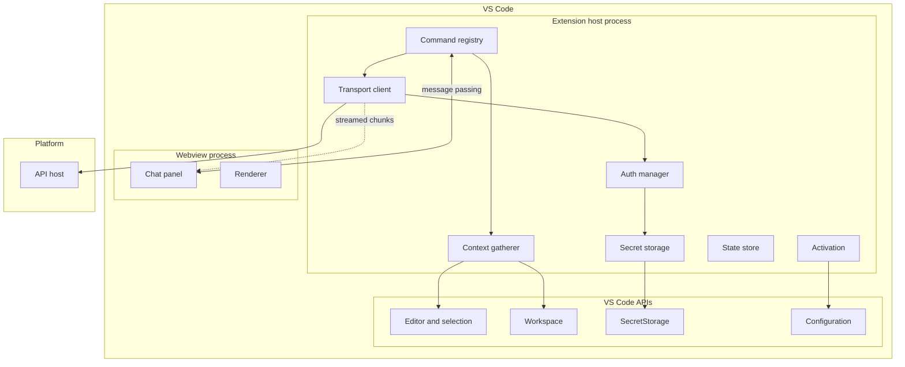
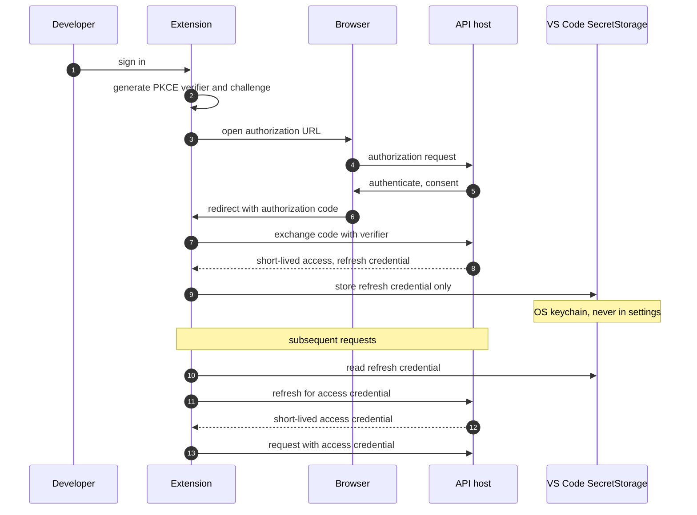
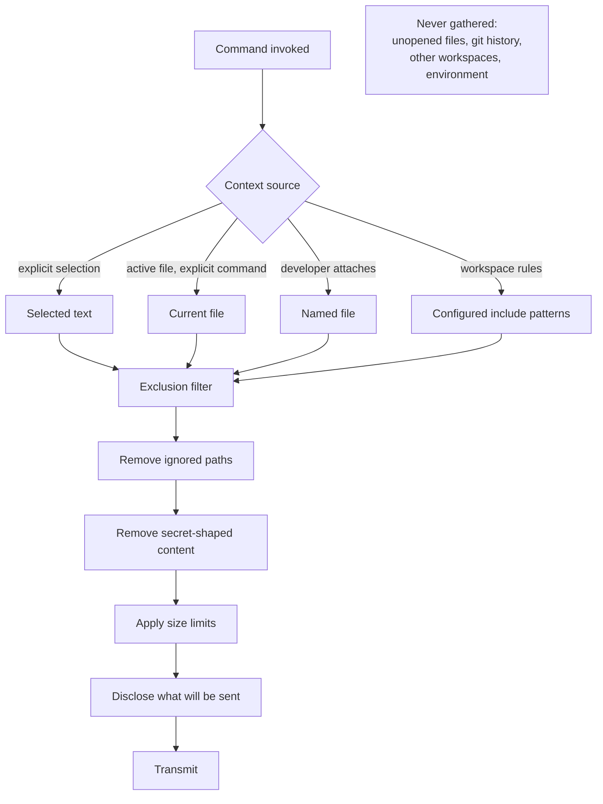
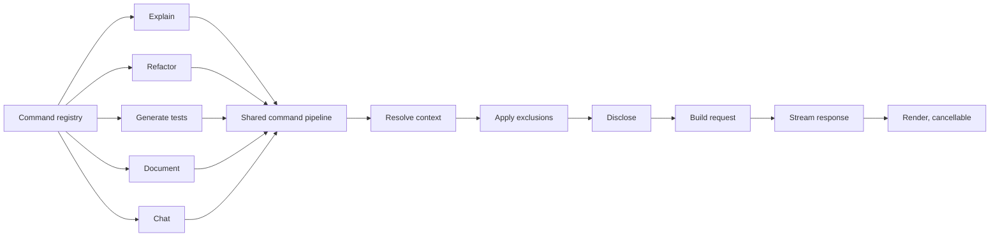
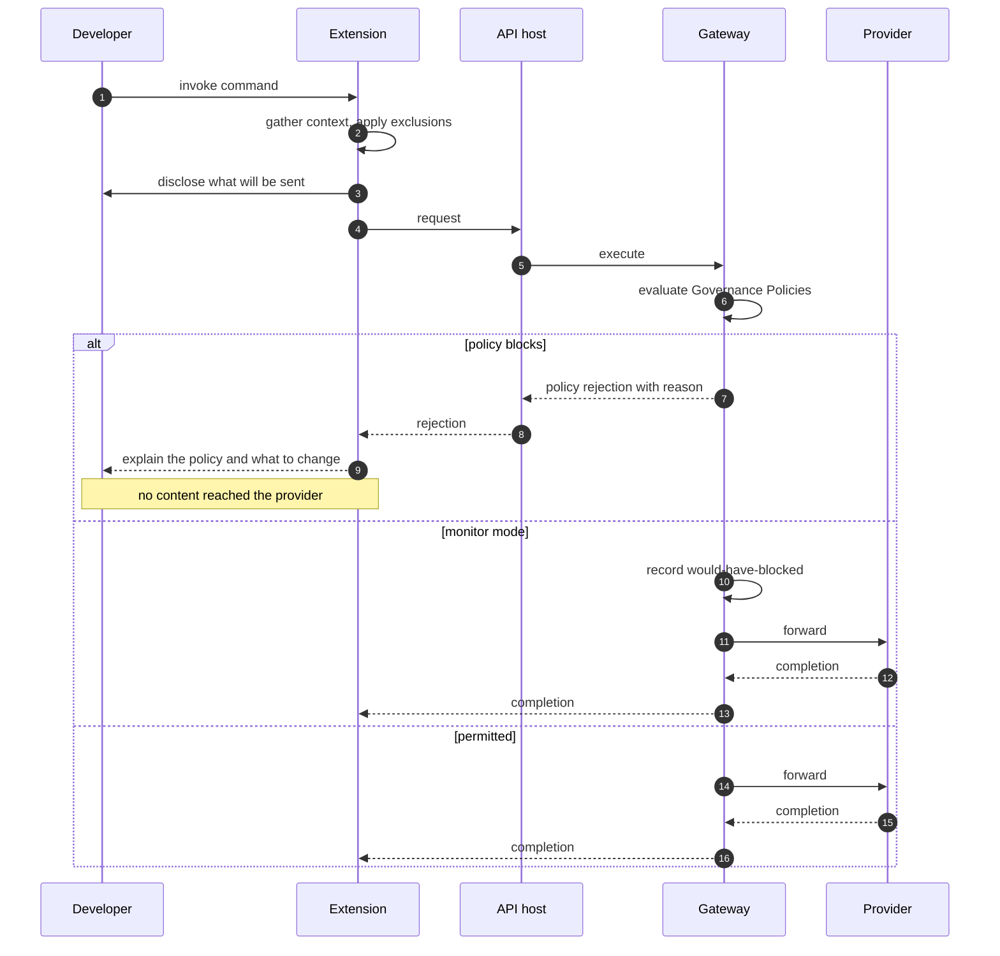
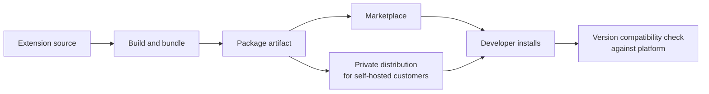

# VS Code Extension Architecture

| Field | Value |
| --- | --- |
| Document | VS Code Extension Architecture |
| Version | 1.0 |
| Status | Draft — pending engineering review |
| Owner | Engineering |
| Last updated | 2026-07-30 |
| Audience | Engineering, Security, Architecture Review |
| Phase | 2 — System Architecture |

---

## 1. Purpose

This document describes the architecture of the MaintOrbit AI extension for Visual
Studio Code: how it authenticates without asking developers to handle long-lived
credentials, how it decides what source code may leave the machine, and how it remains
a thin governed client rather than an independent AI tool.

The extension carries disproportionate strategic weight. It is where the P-03 persona
forms their opinion of the platform, and it is the clearest expression of
[`../01-product/mission.md`](../01-product/mission.md) §4.1 — governed AI that is more
convenient than the ungoverned alternative, at the moment of use.

---

## 2. Scope

### 2.1 In scope

- Extension process model and component structure
- Authentication without manual credential handling
- Context gathering and its privacy boundary
- Command architecture and streaming
- Governance interaction, including source-code restrictions
- Offline and failure behaviour
- Configuration and secret storage
- Packaging and update path

### 2.2 Out of scope

| Excluded | Where |
| --- | --- |
| API definitions | `docs/04-api/` (Phase 3) |
| Gateway internals | [`ai-gateway-architecture.md`](ai-gateway-architecture.md) |
| Identity mechanics | [`authentication-architecture.md`](authentication-architecture.md) |
| JetBrains extension | v2.0, out of current scope |

### 2.3 Governing requirements

| Requirement | Constraint |
| --- | --- |
| FR-EXT-001 | Authentication without manually handling a long-lived credential |
| FR-EXT-008 | Respects Governance Policies, including source-code restrictions |
| FR-EXT-014 | Never transmits file content not explicitly included by the developer or by configured context rules |
| FR-EXT-007 | Usage attributed to Employee and Team, distinguishable by Surface |
| FR-EXT-009 | Streams responses; allows cancellation |
| FR-EXT-010 | Fails gracefully and informatively when the platform is unreachable |

---

## 3. Architecture

### 3.1 Process model

**The webview holds no credentials and makes no network calls.** All transport happens
in the extension host; the webview communicates only through VS Code's message-passing
channel. A webview is a browser context loading rendered content — treating it as
untrusted for credential purposes is the correct default, and it costs almost nothing to
maintain.

**The extension activates lazily.** Activation on command invocation or on opening the
chat panel, never on VS Code startup. An extension that slows editor startup is
uninstalled regardless of its value.

---

### 3.2 Authentication

FR-EXT-001 requires authentication without the developer manually handling a
long-lived credential. Asking a developer to generate a Platform API Key and paste it
into settings is the pattern this requirement exists to avoid: it puts a durable secret
into a configuration file that may be committed, synchronized, or shared.

| Property | Design | Rationale |
| --- | --- | --- |
| Flow | OAuth2 authorization code with PKCE | No client secret can be embedded in a distributed extension |
| Storage | VS Code SecretStorage — OS keychain | Never in settings files; never synchronized to another machine |
| Access credential lifetime | Short, held in memory only | Bounds exposure if the process is inspected |
| Refresh | Against the session record | Revocation takes effect at next refresh at the latest |
| Sign-out | Clears secret storage; revokes server-side | FR-AUTH-018 propagation applies |

**The extension credential derives from a Session, not from a Platform API Key.** This
means every revocation path in
[`authentication-architecture.md`](authentication-architecture.md) §3.4 applies
unchanged — administrative session termination and deprovisioning both cut off the
extension without a separate mechanism.

---

### 3.3 Context gathering — the privacy boundary

**This is the most security-sensitive design in the extension.** FR-EXT-014 forbids
transmitting file content that the developer has not explicitly included or that
configured context rules do not cover.

| Rule | Statement |
| --- | --- |
| **CTX-1** | Nothing is transmitted that the developer has not selected, opened and explicitly acted on, attached, or covered by a workspace rule they configured |
| **CTX-2** | The extension never walks the workspace opportunistically to build context |
| **CTX-3** | Exclusion patterns are applied after gathering and before transmission, and honour the workspace's ignore configuration |
| **CTX-4** | Content matching common secret shapes is removed before transmission and the removal is disclosed |
| **CTX-5** | What will be sent is visible to the developer before it is sent |
| **CTX-6** | Size limits are enforced client-side, with truncation disclosed rather than silent |

**CTX-4 deserves emphasis.** Developers will select a configuration block containing a
credential without thinking. The extension is the last point at which that can be caught
before it leaves the machine and reaches a third-party provider. Client-side secret
detection is imperfect and must not be presented as a guarantee — but omitting it
entirely would be a poor decision for a product whose purpose is preventing exactly this
class of leak.

**CTX-5 is what makes the boundary trustworthy.** A developer who can see what will be
sent can correct a mistake. A developer who cannot must trust an invisible rule, and
will eventually be surprised.

---

### 3.4 Command architecture

**All commands share one pipeline.** Per-command context handling would mean the privacy
boundary is implemented several times, and the weakest implementation would define the
platform's actual behaviour. One pipeline means CTX-1 through CTX-6 are enforced once.

| Command | Context | Output |
| --- | --- | --- |
| Explain | Selection | Chat panel |
| Refactor | Selection | Chat panel; diff application in v1.1 |
| Generate tests | Selection plus file signature | Chat panel |
| Document | Selection | Chat panel |
| Chat | Developer-chosen | Chat panel |

**The extension never edits files at MVP.** Output goes to the panel. Direct application
with a reviewable diff arrives in v1.1 (FR-EXT-012). This ordering is deliberate: an
assistant that modifies code before developers trust its output is uninstalled quickly.

---

### 3.5 Governance interaction

**Enforcement is server-side.** The extension is a distributable artifact a developer can
modify; a client-side policy check is advisory at best. The extension surfaces the reason
clearly, because a block with no explanation is indistinguishable from a bug and will be
reported as one.

**Client-side exclusion and server-side governance are different mechanisms.**
Client-side exclusion (§3.3) is privacy hygiene under the developer's control.
Server-side governance is organizational policy the developer cannot bypass. Both exist;
neither substitutes for the other.

---

### 3.6 Failure behaviour

FR-EXT-010 requires graceful, informative failure. In an editor, a hung request is worse
than an error — it blocks the developer with no indication of what to do.

| Condition | Behaviour |
| --- | --- |
| Platform unreachable | Clear message distinguishing network from platform failure; command remains re-invocable |
| Not authenticated | Prompt to sign in; command re-runs after success |
| Session revoked | Clear message; sign-in prompt; local state cleared |
| Rate limited | Show retry guidance from the platform, not a generic error |
| Budget exceeded | Explain the budget and who to contact — an organizational limit, not a fault |
| Policy blocked | Explain the policy and what to change |
| Provider unavailable | Report that the platform is failing over; no developer action needed |
| Request timeout | Cancel cleanly; release resources; offer retry |
| Extension update available | Non-blocking notice |

**Error messages must distinguish the developer's problem from the organization's
problem.** A budget rejection is not something the developer can fix by changing their
prompt, and presenting it as a generic failure wastes their time and generates support
load. This is FR-X-001 applied to the surface where it matters most.

---

### 3.7 Configuration and state

| Item | Storage | Rationale |
| --- | --- | --- |
| Refresh credential | VS Code SecretStorage | OS keychain; never in settings; never synchronized |
| Access credential | Process memory only | Short-lived; never persisted |
| Platform endpoint | User or workspace settings | Required for self-hosted deployments |
| Preferred model | User settings, validated against permitted set | FR-EXT-005 |
| Context inclusion rules | Workspace settings, committable | FR-EXT-013, v1.1 |
| Conversation history | Server-side | Consistent with the console; survives reinstall |
| Usage and budget display | Fetched, cached briefly | FR-EXT-006 |

**Workspace-level context rules are committable and therefore reviewable.** A team can
agree on what may be sent from a repository and enforce it through code review — a
lightweight governance mechanism that complements the server-side policy engine. It also
means a rule change is visible in a diff rather than hidden in someone's local settings.

**Conversation history lives server-side**, so a developer's extension conversations
appear in the console and are subject to the same retention policy. A local history would
create a second store with different retention behaviour — an inconsistency the P-06
persona would identify immediately.

---

### 3.8 Packaging and updates

**Version compatibility must be explicit.** The extension and platform version
independently, and a self-hosted customer may run a platform version older than the
current extension. The extension checks compatibility on activation and reports a clear
message rather than failing with confusing errors — a scenario that becomes routine once
v2.1 self-hosted deployment ships.

**Private distribution is required for self-hosted customers**, some of whom restrict
marketplace access entirely. This is a packaging requirement to establish now, not a
surprise at v2.1.

---

## 4. Design decisions

| # | Decision | Rationale |
| --- | --- | --- |
| **XD-001** | OAuth2 with PKCE, never a pasted API key | FR-EXT-001; a pasted key becomes a durable secret in a file that may be committed or synchronized |
| **XD-002** | Refresh credential in SecretStorage; access credential in memory only | OS keychain protection; bounded exposure |
| **XD-003** | Extension credential derives from a Session, not a Platform API Key | Every existing revocation path applies without a new mechanism |
| **XD-004** | The webview holds no credentials and makes no network calls | A browser context is untrusted for credential purposes |
| **XD-005** | One shared command pipeline enforcing the context boundary | Per-command handling would mean the weakest implementation defines actual behaviour |
| **XD-006** | The extension never walks the workspace opportunistically | CTX-2; FR-EXT-014 stated positively |
| **XD-007** | Context is disclosed before transmission | A boundary the developer cannot see is one they cannot correct |
| **XD-008** | Client-side secret detection, presented as best-effort | The last point to catch a pasted credential; must not be presented as a guarantee |
| **XD-009** | Governance enforced server-side only | The extension is modifiable; client checks are advisory |
| **XD-010** | No file modification at MVP | An assistant that edits before it is trusted gets uninstalled |
| **XD-011** | Conversation history server-side | A local store would have different retention behaviour |
| **XD-012** | Lazy activation | An extension that slows startup is removed regardless of value |
| **XD-013** | Explicit version compatibility checking | Self-hosted customers will routinely run older platform versions |

---

## 5. Trade-offs

| # | Gained | Given up |
| --- | --- | --- |
| T-1 | OAuth2 avoids durable secrets on disk | A browser round trip at first sign-in; more complex than a pasted key |
| T-2 | Session-derived credentials reuse revocation | Extension access is tied to session lifetime and expiry behaviour |
| T-3 | Conservative context gathering protects privacy | Less capable than tools that index the whole workspace |
| T-4 | Context disclosure builds trust | An extra step before each request |
| T-5 | Server-side governance cannot be bypassed | A round trip before a block is known; no instant local feedback |
| T-6 | Server-side history is consistent and durable | The extension requires connectivity to show past conversations |
| T-7 | No file modification at MVP | A capability competitors offer |
| T-8 | Credential-free webview | Message passing rather than direct calls |

---

## 6. Risks

| # | Risk | Severity | Likelihood | Mitigation |
| --- | --- | --- | --- | --- |
| **R-1** | Context gathering expands over time until it violates FR-EXT-014 | **Critical** | Medium | One pipeline; CTX rules are a reviewed boundary; changes require security review |
| **R-2** | A developer transmits a credential in a selection | High | **High** | Client-side detection; disclosure before send; server-side governance as backstop |
| **R-3** | Conservative context makes the extension less useful than competitors | High | **High** | Workspace inclusion rules give teams explicit, reviewable control |
| **R-4** | Refresh credential extracted from the keychain by local malware | High | Low | Short access lifetimes; server-side revocation; outside the platform's threat boundary |
| **R-5** | Version incompatibility with self-hosted platforms produces confusing failures | Medium | High | Explicit compatibility check with a clear message |
| **R-6** | Latency makes in-editor assistance feel sluggish | High | Medium | Streaming; time to first token is the metric that matters, not total duration |
| **R-7** | Marketplace review or policy changes delay releases | Low | Medium | Private distribution path already required for self-hosted customers |
| **R-8** | The webview is granted network access during development and it persists | High | Low | Content security policy in the webview; architecture review |
| **R-9** | Developers abandon the extension for a more capable competitor, losing the coverage it provides | High | Medium | The extension's value is governed access, not superior generation; positioning must be honest |

---

## 7. Future considerations

- **Diff application (FR-EXT-012, v1.1) changes the trust model.** Writing to files
  requires a different level of confidence and a reviewable preview. It should not be
  rushed.
- **Workspace context rules (FR-EXT-013, v1.1) are a governance surface.** Committable
  rules reviewed in pull requests are a genuinely useful mechanism and worth designing
  properly rather than treating as configuration.
- **The JetBrains extension (v2.0) should share nothing but contracts.** Attempting to
  share implementation across editor platforms is a well-known trap; the API is the
  correct shared surface.
- **Admin disablement (FR-EXT-011, v1.1) needs a graceful path.** A developer whose
  organization disables the extension mid-session should see a clear explanation, not a
  failure.
- **Agentic workflows would change the extension fundamentally.** Multi-step operations
  touching many files require a different interaction model, a different context
  boundary, and a different approval model. Not in scope, and worth stating.
- **Local model support would violate the platform's premise.** A developer routing to a
  local model bypasses governance entirely. If demand appears, it must be resolved at the
  product level, not accommodated quietly in the extension.

---

## 8. Cross references

| Document | Relationship |
| --- | --- |
| [`authentication-architecture.md`](authentication-architecture.md) | Session model the extension credential derives from |
| [`ai-gateway-architecture.md`](ai-gateway-architecture.md) | Gateway the extension consumes |
| [`request-flow.md`](request-flow.md) | F-5 extension command flow |
| [`system-architecture.md`](system-architecture.md) | System context and boundaries |
| [`frontend-architecture-overview.md`](frontend-architecture-overview.md) | Console counterpart; shared streaming and rendering concerns |
| [`../01-product/product-requirements.md`](../01-product/product-requirements.md) | FR-EXT-001 … FR-EXT-015 |
| [`../01-product/user-personas.md`](../01-product/user-personas.md) | P-03 adoption and abandonment criteria |
| [`../01-product/mission.md`](../01-product/mission.md) | §4.1 — the governed path must be the convenient one |
| [`../01-product/glossary.md`](../01-product/glossary.md) | Surface, Platform API Key, Session definitions |
