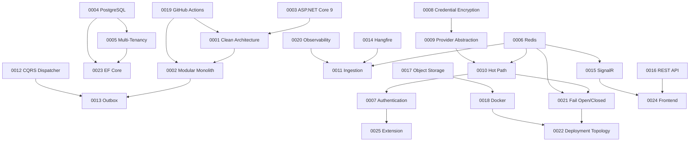

# Architecture Decision Records

| Field | Value |
| --- | --- |
| Document | ADR Index |
| Version | 1.0 |
| Status | Current |
| Owner | Engineering |
| Last updated | 2026-07-30 |
| Phase | 3 — Architecture Decision Records |

---

## Purpose

This directory records the architectural decisions behind MaintOrbit AI: what was
decided, what was rejected, and why. Each ADR is a permanent record. Superseded
decisions are marked superseded, never deleted and never renumbered.

Use [`_template.md`](_template.md) for new records.

---

## Index

### Foundation — structure and platform

| ADR | Title | Status | Implements |
| --- | --- | --- | --- |
| [0001](ADR-0001-clean-architecture.md) | Adopt Clean Architecture layering | ✅ Accepted | AD-001 |
| [0002](ADR-0002-modular-monolith.md) | Build a modular monolith, not microservices | ✅ Accepted | AD-001, AD-014 |
| [0003](ADR-0003-aspnet-core-9.md) | Use ASP.NET Core 9 and C# 13 | ✅ Accepted | Phase 0 |
| [0004](ADR-0004-postgresql.md) | PostgreSQL as the single system of record | ✅ Accepted | AD-002, AD-010 |
| [0005](ADR-0005-multi-tenant-strategy.md) | Tenant isolation by row-level security | ⚠️ **Proposed** | AD-002 |

### Core platform — the control plane

| ADR | Title | Status | Implements |
| --- | --- | --- | --- |
| [0006](ADR-0006-redis.md) | Redis for cache, counters, streams, backplane | ✅ Accepted | AD-009 |
| [0007](ADR-0007-authentication-strategy.md) | Sessions, keys, triple-redundant revocation | ✅ Accepted | AU-001 … 013 |
| [0008](ADR-0008-credential-encryption.md) | Envelope encryption for Provider Credentials | ⚠️ **Proposed** | AD-008 |
| [0009](ADR-0009-ai-provider-abstraction.md) | Narrow provider port with opaque pass-through | ✅ Accepted | AD-007 |
| [0010](ADR-0010-gateway-hot-path.md) | Hot path bypasses dispatcher; cache-only reads | ✅ Accepted | AD-005 |
| [0011](ADR-0011-usage-audit-ingestion.md) | Durable stream ingestion, batch persistence | ⚠️ **Proposed** | AD-006 |

### Services — application infrastructure

| ADR | Title | Status | Implements |
| --- | --- | --- | --- |
| [0012](ADR-0012-cqrs-dispatcher.md) | In-house CQRS dispatcher | ✅ Accepted | AD-004 |
| [0013](ADR-0013-outbox-eventing.md) | In-process event bus with transactional outbox | ✅ Accepted | AD-003, AD-014 |
| [0014](ADR-0014-hangfire.md) | Hangfire on PostgreSQL in a dedicated Worker | ✅ Accepted | AD-010 |
| [0015](ADR-0015-signalr.md) | SignalR with a Redis backplane | ✅ Accepted | AD-011 |
| [0016](ADR-0016-rest-api.md) | REST management API; OpenAI-compatible Gateway | ✅ Accepted | FR-GW-004/005 |
| [0017](ADR-0017-object-storage.md) | S3-compatible abstraction; Azure Blob hosted | ✅ Accepted | — |

### Infrastructure and delivery

| ADR | Title | Status | Implements |
| --- | --- | --- | --- |
| [0018](ADR-0018-docker.md) | Immutable containers, Docker Compose | ✅ Accepted | DP-001 … 012 |
| [0019](ADR-0019-github-actions.md) | GitHub Actions with build-gating checks | ✅ Accepted | AT-1 … 12 |
| [0020](ADR-0020-observability.md) | Structured logs, OpenTelemetry, correlation | ✅ Accepted | NFR-OBS |
| [0021](ADR-0021-fail-open-fail-closed.md) | Fail-open / fail-closed classification | ⚠️ Accepted, **one open** | AD-012 |
| [0022](ADR-0022-deployment-topology.md) | Azure VMs; two hosts minimum for production | ⚠️ **Proposed** | DP-004 |

### Clients and access

| ADR | Title | Status | Implements |
| --- | --- | --- | --- |
| [0023](ADR-0023-persistence-ef-core.md) | EF Core with interceptors; SQL for analytics | ✅ Accepted | BD-002/005/008/009 |
| [0024](ADR-0024-frontend-stack.md) | Next.js 15; server state vs client state split | ✅ Accepted | FD-001 … 012 |
| [0025](ADR-0025-extension-auth.md) | Extension OAuth2/PKCE; explicit context boundary | ✅ Accepted | XD-001 … 013, CTX-1 … 6 |

---

## Status summary

| Status | Count | ADRs |
| --- | --- | --- |
| ✅ Accepted | 21 | All except those below |
| ⚠️ Proposed | 4 | 0005, 0008, 0011, 0022 |
| Superseded | 0 | — |
| Rejected | 0 | — |

**The four Proposed ADRs are blockers for Phase 4 database design.** Each states its
ratification criteria explicitly.

---

## Decision dependency map

---

## Reading order

**New engineers** — read in this order for the shortest path to understanding the system:

1. [0002](ADR-0002-modular-monolith.md) — the shape of the system
2. [0001](ADR-0001-clean-architecture.md) — how code is organized inside it
3. [0005](ADR-0005-multi-tenant-strategy.md) — the security model everything rests on
4. [0010](ADR-0010-gateway-hot-path.md) — why the Gateway is different from everything else
5. [0021](ADR-0021-fail-open-fail-closed.md) — how the system behaves when things break

**Reviewing a design** — check it against [0001](ADR-0001-clean-architecture.md),
[0002](ADR-0002-modular-monolith.md), [0005](ADR-0005-multi-tenant-strategy.md), and
[0021](ADR-0021-fail-open-fail-closed.md).

---

## Conventions

- **Identifiers are permanent.** A superseded ADR keeps its number and is marked
  superseded.
- **Status changes are edits** to the ADR, dated — not new documents.
- **One decision per ADR.** If the title needs "and", it is two decisions.
- **Write before implementing.** An ADR written to justify existing code is documentation,
  not a decision record.
- **Every ADR must list rejected alternatives.** One alternative means it is a
  justification, not a decision.

---

## Related documentation

| Location | Contents |
| --- | --- |
| [`../01-product/`](../01-product/) | Product requirements these decisions satisfy |
| [`../02-architecture/`](../02-architecture/) | Architecture documents these decisions implement |
| `../03-database/` | Phase 4 — schema design, blocked on ADRs 0005 and 0011 |
| `../04-api/` | Phase 4 — API design, governed by ADR-0016 |

> **Note on location.** The Phase 0 repository structure created `docs/07-adr/` for this
> purpose, and two Phase 2 documents reference `../07-adr/`. These records live in
> `docs/03-adr/` as directed in Phase 3. The duplicate empty directory and the stale
> references should be reconciled — see the Phase 3 handover notes.
