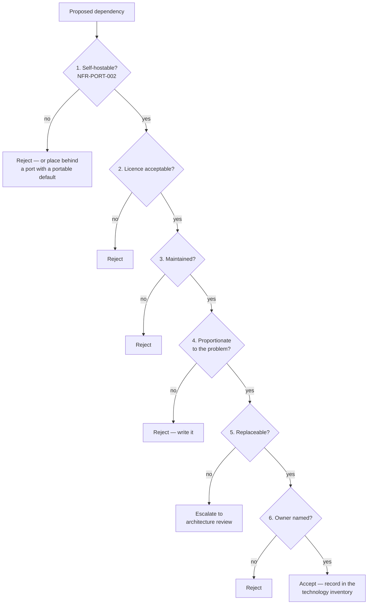

# Dependency Policy

| Field | Value |
| --- | --- |
| Document | Dependency Policy |
| Version | 1.0 |
| Status | Draft — pending engineering review |
| Owner | Engineering |
| Last updated | 2026-07-30 |
| Audience | Engineering, Security, Legal |
| Phase | 4 — Technology Standards |

---

## 1. Purpose

This document defines how dependencies enter, remain in, and leave MaintOrbit AI.

Its premise is that a dependency is a **decision with a permanent maintenance
obligation**, not a convenience. Phase 4 already surfaced three cases where that
obligation was not examined at selection time — an out-of-support runtime, a relicensed
data store, and a test library that moved to a commercial model. All three were cheap to
catch here and expensive to catch later.

---

## 2. Scope

**In scope:** NuGet packages, npm packages, container base images, infrastructure
components, and third-party GitHub Actions.

**Out of scope:** which specific dependencies are used
([`backend-technologies.md`](backend-technologies.md),
[`frontend-technologies.md`](frontend-technologies.md),
[`infrastructure-technologies.md`](infrastructure-technologies.md)); version management
mechanics ([`package-policy.md`](package-policy.md)); external SaaS
([`third-party-services.md`](third-party-services.md)).

---

## 3. The admission test

**Every new direct dependency must pass all six gates.** Failing any one is a rejection,
not a discussion.

### Gate 1 — Self-hostable

**NFR-PORT-002**, enforced by architecture test AT-12. A dependency that cannot run in a
customer-controlled environment is rejected outright, **unless** it sits behind a port
with a portable implementation that is the default in development and CI.

That exception has been used exactly twice — Azure Key Vault
([ADR-0008](../03-adr/ADR-0008-credential-encryption.md)) and Azure Blob Storage
([ADR-0017](../03-adr/ADR-0017-object-storage.md)) — and in both cases the portable path
being the CI default is what keeps the exception honest. **Additional uses require an
ADR.**

### Gate 2 — Licence

| Class | Examples | Verdict |
| --- | --- | --- |
| **Permissive** | MIT, Apache 2.0, BSD, ISC, PostgreSQL | ✅ Accept |
| **Weak copyleft** | LGPL, MPL | ⚠️ **Legal review required** before v2.1 redistribution |
| **Strong copyleft** | GPL, AGPL | ❌ Reject for shipped code |
| **Source-available** | SSPL, BUSL, RSAL | ❌ Reject for shipped code |
| **Commercial** | Paid licences | ⚠️ Leadership approval; recorded as a cost |
| **Unlicensed / unclear** | — | ❌ Reject |

**Copyleft and source-available licences are rejected for shipped code specifically
because of v2.1.** MaintOrbit AI ships to customers to run in their own environments
(NFR-PORT-007). A purely hosted service would face a different, lighter analysis — which
is precisely why this gate must be applied now, before v2.1 is close enough to be
inconvenient.

Development-only dependencies — test frameworks, linters, build tooling — face a lighter
bar because they are not redistributed. They still require licence recording.

**Two existing dependencies sit in the ⚠️ band and need resolution:** Hangfire (LGPL v3,
TD-3) and Redis (source-available or AGPL, TD-2).

### Gate 3 — Maintenance health

Assessed, not assumed:

| Signal | Concern threshold |
| --- | --- |
| Last release | No release in 12 months on an actively-used library |
| Open critical issues | Unaddressed security issues |
| Contributor concentration | A single maintainer with no succession |
| Downstream usage | Very low adoption relative to our reliance |
| Responsiveness | Security reports unanswered |

**A small package is not disqualified by being small.** The question is whether our
reliance on it exceeds its capacity. `NetArchTest` is small and carries the entire module
boundary enforcement — that is a recorded risk with a mitigation, not a rejection.

### Gate 4 — Proportionality

**Would writing this ourselves cost less than owning the dependency forever?**

Reject a dependency when the problem is small and well understood. A package that
formats a date, pads a string, or checks whether an object is empty is a transitive
supply-chain surface bought for a few lines of code.

This gate cuts both ways and has been applied in both directions:

- **Rejected in favour of writing:** the CQRS dispatcher
  ([ADR-0012](../03-adr/ADR-0012-cqrs-dispatcher.md)) and direct HTTP integration with AI
  providers rather than four vendor SDKs.
- **Accepted rather than writing:** EF Core, because interceptors are the mechanism that
  makes tenant isolation structural rather than discretionary.

### Gate 5 — Replaceability

**What replaces this if it is abandoned, relicensed, or compromised?** A dependency with
no answer is a decision that has already been made for us.

The answer goes in the technology inventory as the replacement strategy. Where a
dependency is genuinely hard to replace — the runtime, PostgreSQL, React — that is
acceptable, but it must be **stated and escalated to architecture review** rather than
discovered later.

### Gate 6 — Named owner

Every direct dependency has an owner responsible for watching its releases, security
advisories, and licence. **An unowned dependency is an unmonitored one.**

---

## 4. Review cadence

| Cadence | Activity | Owner |
| --- | --- | --- |
| **Every build** | Vulnerability scan; build **fails on unresolved critical findings** (NFR-SEC-011). Licence scan. AT-12 portability check | Automated |
| Weekly | Security patches applied — **not batched** | Engineering |
| Monthly | Patch and minor upgrades batched and applied | Engineering |
| **Each release** | **Necessity review** — is every direct dependency still needed? (NFR-MAINT-011) | Engineering |
| Quarterly | Maintenance health review for §6 watch-list items | Named owners |
| **Semi-annual** | **Licence re-verification for all shipped dependencies** | Engineering & Legal |
| Semi-annual | Support lifecycle review against [`support-lifecycle.md`](support-lifecycle.md) | Engineering |

**The per-release necessity review is the one most likely to be skipped and the one that
prevents accumulation.** Dependencies are added under delivery pressure and removed only
deliberately; without a scheduled prompt, they are never removed at all.

**Semi-annual licence re-verification exists because licences change.** MediatR and Redis
both changed terms after adoption. Checking once at selection is insufficient.

---

## 5. Removal

A dependency is removed when it fails any admission gate on re-review, when its
functionality is no longer used, or when it is superseded.

| Step | Action |
| --- | --- |
| 1 | Confirm no remaining usage, including transitively through our own abstractions |
| 2 | Remove from the manifest and central version management |
| 3 | Remove from the technology inventory in this document set |
| 4 | Record the removal reason in the pull request |

**Removing an unused dependency does not require architecture review.** Adding one does.
The asymmetry is intentional.

---

## 6. Watch list

Dependencies where reliance exceeds apparent capacity, or where licence or supply risk is
material. Consolidated from
[`backend-technologies.md`](backend-technologies.md) §12 and
[`frontend-technologies.md`](frontend-technologies.md) §11.

| Item | Concern | Owner | Review |
| --- | --- | --- | --- |
| `NetArchTest` / `ArchUnitNET` | Small project enforcing ADR-0001 and ADR-0002 boundaries | Engineering | Quarterly |
| `Hangfire.PostgreSql` | Community-maintained storage for the entire background tier | Engineering | Quarterly |
| Hangfire (LGPL v3) | Copyleft in a redistributed product | Legal | TD-3 |
| Redis licence | Source-available or AGPL | Legal | TD-2 |
| `Otp.NET` | Small library on the authentication path | Engineering | Quarterly |
| `FluentAssertions` | v8+ commercial licence | Engineering | Decide before tests are written |
| Vendored shadcn/ui | **Invisible to every scanner** | Frontend | Quarterly |
| `class-variance-authority` | Pre-1.0, widely depended on by the component layer | Frontend | Quarterly |
| `recharts` | Charting libraries are frequently abandoned | Frontend | Semi-annual |
| Markdown and sanitization chain | Renders untrusted model output into the DOM | Frontend & Security | Quarterly |
| Azure SDK packages | Portability risk if they escape their adapters | Engineering | Each release |

**Vendored shadcn/ui deserves emphasis.** It appears in no dependency scan, no
vulnerability report, and no upgrade notification. Every other item on this list will
prompt someone eventually; this one will not.

---

## 7. Transitive dependencies

Direct dependencies are chosen; transitive ones are inherited. They are the larger
surface and the smaller lever.

| Rule | Statement |
| --- | --- |
| Lockfiles are committed | The resolved tree is reproducible and reviewable |
| Scanning covers the full tree | Not only direct dependencies |
| Critical vulnerabilities fail the build | NFR-SEC-011 |
| A large transitive tree is a reason to prefer a smaller alternative | Gate 4 |
| Third-party GitHub Actions are pinned by **commit SHA**, never by tag | A mutable tag is a supply-chain vector |

**The frontend's transitive tree is the dominant supply-chain surface in the product** —
several hundred packages, none individually critical, collectively substantial. The only
real control is keeping the direct list deliberate.

---

## 8. Risks

| # | Risk | Severity | Likelihood | Mitigation |
| --- | --- | --- | --- | --- |
| R-1 | A dependency is added under delivery pressure without passing the gates | Medium | **High** | Gates are a pull-request checklist; new manifest entries are a review trigger |
| R-2 | A licence changes after adoption | Medium | **High** | Semi-annual re-verification; ADR-0012 precedent for in-house replacement |
| R-3 | The necessity review is skipped, and dependencies accumulate | Medium | High | Scheduled per release with a named owner |
| R-4 | A watch-list item is abandoned with no replacement prepared | Medium | Medium | Replacement strategy recorded for each; quarterly review |
| R-5 | Vendored components are never updated | Medium | **High** | Explicit quarterly review; named owner |
| R-6 | A managed-only dependency is introduced, breaking NFR-PORT-002 | High | Medium | AT-12 build gate |
| R-7 | Transitive compromise via a package nobody chose | Medium | Medium | Lockfiles; full-tree scanning; SHA-pinned actions |
| R-8 | Gate 2 applied loosely because v2.1 feels distant | High | Medium | The gate exists **because** v2.1 is distant — that is when it is cheap to apply |

---

## 9. Future considerations

- **Software bill of materials generation** will likely become a customer requirement.
  Regulated enterprises increasingly ask for one, and it is far easier to produce from a
  disciplined dependency set than to retrofit.
- **Supply-chain attestation** may be required for SOC 2 (NFR-COMP-001) — signed builds
  and provenance metadata.
- **Self-hosted customers inherit our dependency choices**, including their licences and
  vulnerabilities. From v2.1 the dependency set becomes part of the product's security
  posture in their environment, not only ours.
- **The watch list should shrink, not grow.** An item that stays on it for two years
  without resolution is an unmade decision.
- **Automating gate 2** — a licence check in CI that fails on a disallowed class — would
  convert a review-dependent gate into a mechanical one.

---

## 10. Cross references

| Document | Relationship |
| --- | --- |
| [`technology-stack.md`](technology-stack.md) | Selection principles P-1 … P-6 |
| [`backend-technologies.md`](backend-technologies.md) | NuGet inventory and §12 watch items |
| [`frontend-technologies.md`](frontend-technologies.md) | npm inventory and §11 watch items |
| [`infrastructure-technologies.md`](infrastructure-technologies.md) | Infrastructure dependencies; the Redis licence finding |
| [`package-policy.md`](package-policy.md) | Version management mechanics |
| [`versioning-policy.md`](versioning-policy.md) | Upgrade classification |
| [`support-lifecycle.md`](support-lifecycle.md) | End-of-support calendar |
| [`../03-adr/ADR-0012-cqrs-dispatcher.md`](../03-adr/ADR-0012-cqrs-dispatcher.md) | Gate 4 applied — build rather than adopt |
| [`../01-product/non-functional-requirements.md`](../01-product/non-functional-requirements.md) | NFR-PORT-002, NFR-SEC-011/012, NFR-MAINT-011 |
