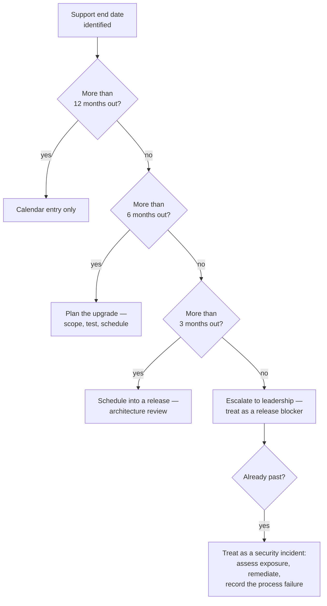

# Support Lifecycle

| Field | Value |
| --- | --- |
| Document | Support Lifecycle |
| Version | 1.0 |
| Status | Draft — **all dates require verification** |
| Owner | Engineering |
| Last updated | 2026-07-30 |
| Audience | Engineering, Operations, Security, Leadership |
| Phase | 4 — Technology Standards |
| Review cadence | **Semi-annual, minimum** |

---

> ## ⚠ Every date in this document must be verified
>
> Dates are recorded here **so they can be checked**, not because they are known to be
> current. Vendors change schedules; a lifecycle document that is confidently wrong is
> more dangerous than one that admits uncertainty.
>
> **Verify against the vendor's published lifecycle page before acting on any row.**

---

## 1. Purpose

This document tracks when every technology in MaintOrbit AI stops receiving security
patches, and what must happen before that date.

It exists because Phase 4 discovered that the specified runtime was **already past its
support end date** at the moment implementation was due to begin. That is precisely the
failure this document is meant to prevent, and it is worth stating plainly: the check
takes minutes and was not done.

---

## 2. Scope

**In scope:** support windows for runtimes, frameworks, data stores, infrastructure, and
significant libraries; the review process; the escalation path when a date approaches.

**Out of scope:** which technologies are used (see the inventories); how upgrades are
classified ([`versioning-policy.md`](versioning-policy.md)); our own product's support
commitments to customers — a product decision that does not yet exist.

---

## 3. The governing rules

| # | Rule | Rationale |
| --- | --- | --- |
| **L-1** | **A technology must never run in production past its support end date** | No security patches. An automatic finding on any security review, and a direct obstacle to SOC 2 (NFR-COMP-001) |
| **L-2** | **Support end dates are entered in the engineering calendar with six months' notice** | Six months is enough to plan, test, and deploy a runtime upgrade without disrupting a release cycle |
| **L-3** | **Prefer LTS over current** for runtimes and frameworks | Selection principle P-2. A shorter support window is a recurring cost, not a one-time one |
| **L-4** | **The lifecycle review is semi-annual and has a named owner** | An unowned review does not happen |
| **L-5** | **Adopting a technology requires recording its support window** | Admission gate; this is the check that was missed |

---

## 4. Lifecycle status — current

Status assessed against **2026-07-30**.

### 4.1 🔴 Action required

| Technology | Specified | Support ended | Finding | Action |
| --- | --- | --- | --- | --- |
| **.NET runtime** | 9 (STS) | **~May 2026** | **TR-1** — past end of support | **Move to .NET 10 LTS** (TD-1) |
| **Node.js** | 20 (LTS) | **~April 2026** | **TR-2** — past end of life | **Move to Node.js 24 LTS** (TD-1) |

**Both are near-zero cost to fix now** — no application code exists. Both become
materially expensive once a codebase implementing 230 requirements sits on top of them.

### 4.2 🟢 Supported

| Technology | Target version | Support until | Runway | Notes |
| --- | --- | --- | --- | --- |
| .NET runtime | **10 LTS** | ~Nov 2028 | ~2 yr | Recommended target |
| Node.js | **24 LTS** | ~2028 | ~2 yr | Recommended target |
| PostgreSQL | 17.x | ~Nov 2029 | ~3 yr | 5-year policy per major |
| PostgreSQL | 18.x | ~2030 | ~4 yr | Decision TD-5 |
| Nginx | 1.28 stable | ~1 yr per branch | ~1 yr | Security patches backported |
| Docker Engine | 27.x+ | Rolling | — | No LTS branches |
| Valkey / Redis | 8.x | Rolling | — | No fixed dates |
| TypeScript | 5.x | Rolling | — | ~Quarterly minors |
| React | 19.x | Long | — | Slow major cadence |

### 4.3 🟡 Monitor

| Technology | Concern | Review |
| --- | --- | --- |
| **Next.js** | Roughly annual breaking majors; **limited support for older majors** — the frontend's main lifecycle risk | Each major release |
| Tailwind CSS | Annual majors; v4 changed configuration substantially | Each major |
| EF Core / Npgsql | Tied to the runtime major; move as one coordinated train | With runtime |
| Hangfire | Rolling, but **LGPL v3** raises a separate legal question (TD-3) | Quarterly |
| Azure VM series | Periodic retirement with migration notice | Semi-annual |
| GitHub Actions runner images | Deprecated with notice | Semi-annual |
| Container base images | **Accumulate OS vulnerabilities between rebuilds** | Monthly rebuild |

---

## 5. Lifecycle calendar

Twelve-month view. **Every date requires verification.**

| Window | Event | Action | Owner |
| --- | --- | --- | --- |
| **Now — overdue** | .NET 9 out of support | **TD-1: adopt .NET 10 LTS** | Engineering |
| **Now — overdue** | Node.js 20 end of life | **TD-1: adopt Node.js 24 LTS** | Engineering |
| Now | Redis licence question | **TD-2: standardize on Valkey** | Engineering & Legal |
| Ongoing, monthly | Base image rebuilds | Rebuild independent of code changes | Operations |
| Quarterly | Watch-list maintenance review | Assess health of small critical dependencies | Named owners |
| **Semi-annual** | **Lifecycle review — this document** | Verify every date; update status | Engineering |
| Semi-annual | Licence re-verification | All shipped dependencies | Engineering & Legal |
| Annual | Nginx stable branch | Plan upgrade in a maintenance window | Operations |
| ~Annual | Next.js major | Assess and plan; stay within one major of current | Frontend |
| ~Nov 2028 | .NET 10 support ends | **Plan by ~May 2028** (L-2) | Engineering |
| ~Nov 2029 | PostgreSQL 17 support ends | **Plan by ~May 2029** (L-2) | Engineering |

---

## 6. Escalation path

**Being past a support date is a security incident, not a backlog item.** It means running
software that will not receive a patch for a vulnerability disclosed tomorrow. TR-1 and
TR-2 should be handled with that framing rather than as routine upgrades — including
recording why the check was not performed at selection.

---

## 7. Support windows by class

| Class | Typical window | Planning lead time | Notes |
| --- | --- | --- | --- |
| **.NET LTS** | 36 months from GA | **6 months** | Even-numbered releases |
| .NET STS | 18 months from GA | 6 months | Odd-numbered. **Avoid** — L-3 |
| **Node.js LTS** | ~30 months | 6 months | Even-numbered releases |
| **PostgreSQL major** | 5 years | 6 months | One major per year |
| Nginx stable | ~1 year per branch | 3 months | Patches backported |
| Docker Engine | Rolling | — | Stay reasonably current |
| Valkey / Redis | Rolling | — | No fixed dates |
| **Next.js** | ~1 major/year, limited back-support | 3 months | Highest-churn dependency |
| React | Long | 12 months | Slow, well-signalled |
| TypeScript | Rolling | 1 month | Frequent minors |
| Container base images | Follows the OS distribution | Monthly rebuild | Rebuild on a schedule, not on code change |

**The .NET STS row is the one that caused TR-1.** Odd-numbered .NET releases carry half
the support window of even-numbered ones, and selecting one without noticing costs 18
months of runway. Rule L-3 exists specifically to prevent a repeat.

---

## 8. Risks

| # | Risk | Severity | Likelihood | Mitigation |
| --- | --- | --- | --- | --- |
| R-1 | **Running .NET 9 and Node.js 20 in production, out of support** | **Critical** | Certain if unaddressed | TD-1 before implementation |
| R-2 | The semi-annual review is skipped and a date passes unnoticed | High | **High** | Named owner (L-4); calendar entries with six months' notice (L-2) |
| R-3 | An STS release is selected again without noticing the shorter window | High | Medium | L-3 and L-5 — support window recorded at adoption |
| R-4 | Next.js falls two or more majors behind, making upgrades compounding | Medium | High | Stay within one major of current |
| R-5 | Base images accumulate vulnerabilities between rebuilds | Medium | High | Monthly rebuild independent of code changes |
| R-6 | A PostgreSQL major upgrade is deferred until forced | Medium | Medium | Six-month notice; rehearsed procedure; standby promotion |
| R-7 | Self-hosted customers run unsupported platform versions | Medium | **High** (from v2.1) | Requires a published product support policy — see §9 |
| R-8 | An unsupported runtime is discovered during a security review or audit | High | Medium | L-1; this document is the evidence that it is tracked |

---

## 9. Future considerations

- **MaintOrbit AI needs its own published support policy.** Once v2.1 self-hosted
  deployment ships, customers upgrade on their own schedule and will run older versions
  indefinitely unless told otherwise. **How many versions we support, and for how long, is
  an unmade product decision** — and it is a commitment, not a technical detail.
- **Self-hosted customers inherit our dependency lifecycles.** A customer running a
  platform version pinned to an out-of-support runtime is running unsupported software,
  whether or not they know it. This should be surfaced explicitly rather than left implicit.
- **SOC 2 (NFR-COMP-001) will formalize this.** Auditors ask how software currency is
  managed. This document plus evidence of the semi-annual review is the answer.
- **Automated lifecycle checking** — a CI job comparing declared versions against published
  end-of-life data — would convert L-1 from a review-dependent rule into a mechanical one.
  Given that the failure this document exists to prevent has already occurred once, that is
  worth building rather than relying on the discipline that already failed.
- **The date-verification caveat should shrink over time.** As the review cadence
  establishes itself and dates are confirmed, this document becomes more authoritative.
  It is currently a checklist, not a reference.

---

## 10. Cross references

| Document | Relationship |
| --- | --- |
| [`technology-stack.md`](technology-stack.md) | §3 the runtime finding; TD-1 |
| [`versioning-policy.md`](versioning-policy.md) | §9 upgrade classification |
| [`dependency-policy.md`](dependency-policy.md) | Admission gates; L-5 |
| [`backend-technologies.md`](backend-technologies.md) | Backend support windows |
| [`frontend-technologies.md`](frontend-technologies.md) | Frontend support windows |
| [`infrastructure-technologies.md`](infrastructure-technologies.md) | Infrastructure support windows |
| [`third-party-services.md`](third-party-services.md) | External service lifecycles |
| [`../01-product/non-functional-requirements.md`](../01-product/non-functional-requirements.md) | NFR-COMP-001, NFR-SEC-011 |
