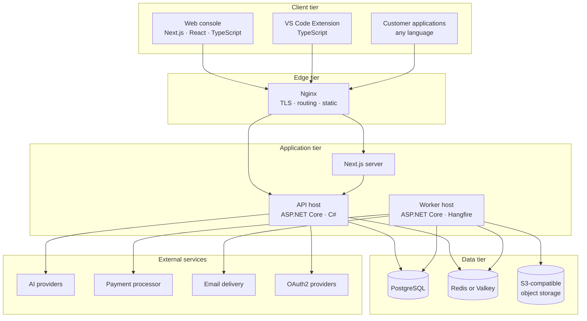

# Technology Stack

| Field | Value |
| --- | --- |
| Document | Technology Stack (master) |
| Version | 1.0 |
| Status | Draft — **contains a blocking finding on runtime support lifecycle** |
| Owner | Engineering |
| Last updated | 2026-07-30 |
| Audience | Engineering, Architecture Review, Security, Leadership |
| Phase | 4 — Technology Standards |

---

> ## ⚠ Version verification requirement
>
> **Every version number, release date, and end-of-support date in this document set
> must be verified against the vendor's published lifecycle page before it is acted
> upon.** Release schedules change, and a lifecycle document that is confidently wrong is
> more dangerous than one that admits uncertainty.
>
> Where a date is stated, it is stated so it can be checked — not because it is known to
> be current. The **finding in §3 in particular must be verified first**, because it
> changes a Phase 0 selection.

---

## 1. Purpose

This document is the authoritative inventory of every technology in MaintOrbit AI: what
is used, why, at what version, for how long it is supported, and what replaces it.

It exists to prevent three specific failures: adopting a technology whose support ends
inside the product's planning horizon; accumulating dependencies nobody chose
deliberately; and discovering a licence incompatibility after a customer contract depends
on it.

---

## 2. Scope

### 2.1 In scope

- The complete technology inventory across backend, frontend, extension, and infrastructure
- Runtime and framework support lifecycles
- The technology matrix and risk matrix
- Selection rationale traced to ADRs
- Licence posture for every dependency class

### 2.2 Out of scope

| Excluded | Where |
| --- | --- |
| Individual NuGet packages | [`backend-technologies.md`](backend-technologies.md) |
| Individual npm packages | [`frontend-technologies.md`](frontend-technologies.md) |
| Infrastructure component detail | [`infrastructure-technologies.md`](infrastructure-technologies.md) |
| Language and style rules | [`coding-standards.md`](coding-standards.md) |
| How dependencies are added or removed | [`dependency-policy.md`](dependency-policy.md) |
| External SaaS and provider APIs | [`third-party-services.md`](third-party-services.md) |
| Why an architectural choice was made | [`../03-adr/`](../03-adr/) |

### 2.3 The constraint that governs every selection

**NFR-PORT-002** — no dependency may be introduced that cannot run in a
customer-controlled environment. This is enforced by architecture test AT-12 and it
eliminates entire categories of otherwise attractive technology. It applies to the
**product's** dependencies, not to our operational choices: using a managed PostgreSQL
service for our own hosting is acceptable because the product depends on PostgreSQL, not
on a vendor's managed offering. That distinction is load-bearing and is applied
consistently throughout this document set.

---

## 3. Blocking finding — the specified runtime is outside its support window

**Phase 0 and every subsequent phase specify ASP.NET Core 9 on .NET 9. Under Microsoft's
published .NET support policy, .NET 9 is a Standard Term Support release.**

| Fact | Value | Verify at |
| --- | --- | --- |
| .NET support policy | Even-numbered releases are LTS (36 months); odd-numbered are STS (18 months) | Microsoft .NET support policy page |
| .NET 9 general availability | November 2024 | Same |
| .NET 9 end of support | **approximately May 2026** | Same |
| Today | 2026-07-30 | — |
| .NET 10 | LTS, GA November 2025, supported to approximately November 2028 | Same |

**If the above is correct, the project is starting implementation on a runtime that left
support roughly two months ago.** The consequences are not theoretical: no security
patches, no bug fixes, and a finding on the first security review — which matters
directly, because NFR-COMP-001 targets SOC 2 and the P-06 persona treats an unsupported
runtime as a straightforward audit failure.

### 3.1 Recommendation

**Move to .NET 10 LTS before implementation begins.**

| Consideration | Assessment |
| --- | --- |
| **Cost now** | Near zero. No application code exists. This is a change to `global.json`, target framework properties, and container base images |
| **Cost later** | A migration across a codebase implementing 230 functional requirements, under delivery pressure |
| **Architectural impact** | None. Every decision in [`../03-adr/`](../03-adr/) holds. ADR-0003's reasoning is about the platform, not the version |
| **Support runway** | To approximately November 2028 — beyond the Horizon 2 planning window in [`../01-product/vision.md`](../01-product/vision.md) |
| **Alternative** | .NET 8 LTS is supported to approximately November 2026 — a shorter runway than .NET 10 and no reason to prefer it |

**This is the single most valuable finding of Phase 4.** It is exactly what a technology
standards phase exists to catch, and catching it now costs an afternoon.

### 3.2 What this document set assumes

This document set is written against **.NET 10 LTS** as the recommended target, with .NET
9 shown where the distinction matters. **The recommendation requires your decision** —
see decision TD-1 in §9. Every other technology selection is unaffected either way.

### 3.3 The same check applied to Node.js

| Fact | Value |
| --- | --- |
| Node.js policy | Even-numbered releases become LTS; roughly 30 months of support |
| Node.js 20 LTS | End of life approximately April 2026 — **also past** |
| Node.js 22 LTS | In maintenance; supported to approximately April 2027 |
| Node.js 24 LTS | Active LTS; the correct target |

**Recommendation: Node.js 24 LTS.** Same reasoning, same near-zero cost now.

---

## 4. Architecture

### 4.1 The stack in layers

### 4.2 Selection principles

Applied to every technology in this document set, in order:

| # | Principle | Consequence |
| --- | --- | --- |
| **P-1** | **Self-hostable** | NFR-PORT-002. Eliminates managed-only services from the product's dependency set |
| **P-2** | **Supported through the planning horizon** | Prefer LTS. §3 exists because this was not applied at Phase 0 |
| **P-3** | **Permissively licensed** | Copyleft and source-available licences are reviewed case by case; a commercial closed-source product that customers self-host has real constraints |
| **P-4** | **Boring in the data path** | [`../01-product/mission.md`](../01-product/mission.md) §4.6. Novelty is spent on product surfaces, never on the Gateway |
| **P-5** | **Minimal surface** | Every dependency is reviewed for necessity each release (NFR-MAINT-011) |
| **P-6** | **Replaceable** | Every technology has a named replacement strategy. A dependency with no exit is a decision that has already been made for us |

---

## 5. Technology inventory

Full treatment — purpose, alternatives, lifecycle, risks, upgrade and replacement
strategy, security and performance considerations — is given for each **technology** in
its respective document. Individual **packages** are inventoried in complete tables with
the fields that vary per package; applying eleven prose sections to each of roughly 120
packages would produce a document nobody reads.

### 5.1 Backend

| Technology | Version target | Role | ADR |
| --- | --- | --- | --- |
| .NET runtime | **10 LTS** *(specified: 9 — see §3)* | Application runtime | [0003](../03-adr/ADR-0003-aspnet-core-9.md) |
| ASP.NET Core | Matching runtime | Web framework, hosting, SignalR | [0003](../03-adr/ADR-0003-aspnet-core-9.md) |
| C# | 13 *(14 with .NET 10)* | Language | [0003](../03-adr/ADR-0003-aspnet-core-9.md) |
| Entity Framework Core | Matching runtime major | ORM, migrations, interceptors | [0023](../03-adr/ADR-0023-persistence-ef-core.md) |
| Npgsql | Matching EF Core major | PostgreSQL provider | [0004](../03-adr/ADR-0004-postgresql.md) |
| StackExchange.Redis | 2.x | Redis client | [0006](../03-adr/ADR-0006-redis.md) |
| Hangfire | 1.8.x | Background jobs | [0014](../03-adr/ADR-0014-hangfire.md) |
| FluentValidation | 11.x / 12.x | Validation | [0012](../03-adr/ADR-0012-cqrs-dispatcher.md) |
| Mapster | 7.x | Object mapping | Phase 0 |
| OpenTelemetry .NET | 1.x | Traces, metrics, logs | [0020](../03-adr/ADR-0020-observability.md) |
| Polly | 8.x | Resilience primitives | [0009](../03-adr/ADR-0009-ai-provider-abstraction.md) |

Detail: [`backend-technologies.md`](backend-technologies.md)

### 5.2 Frontend

| Technology | Version target | Role | ADR |
| --- | --- | --- | --- |
| Node.js | **24 LTS** *(specified: 20 — see §3.3)* | Build and server runtime | [0024](../03-adr/ADR-0024-frontend-stack.md) |
| Next.js | 15.x | React framework, App Router | [0024](../03-adr/ADR-0024-frontend-stack.md) |
| React | 19.x | UI library | [0024](../03-adr/ADR-0024-frontend-stack.md) |
| TypeScript | 5.x | Language | [0024](../03-adr/ADR-0024-frontend-stack.md) |
| Tailwind CSS | 4.x | Styling | Phase 0 |
| shadcn/ui | Vendored, not versioned | Component primitives | [0024](../03-adr/ADR-0024-frontend-stack.md) |
| Redux Toolkit | 2.x | Client state | [0024](../03-adr/ADR-0024-frontend-stack.md) |
| TanStack Query | 5.x | Server state | [0024](../03-adr/ADR-0024-frontend-stack.md) |
| TanStack Table | 8.x | Data tables | Phase 0 |
| React Hook Form | 7.x | Forms | Phase 0 |
| Zod | 3.x / 4.x | Schema validation | Phase 0 |
| Recharts | 2.x / 3.x | Charts | Phase 0 |

Detail: [`frontend-technologies.md`](frontend-technologies.md)

### 5.3 Infrastructure

| Technology | Version target | Role | ADR |
| --- | --- | --- | --- |
| PostgreSQL | 17.x or 18.x | System of record | [0004](../03-adr/ADR-0004-postgresql.md) |
| **Valkey** *(or Redis — see below)* | 8.x | Cache, counters, streams, backplane | [0006](../03-adr/ADR-0006-redis.md) |
| Nginx | 1.28.x stable | Edge, TLS, routing | [0022](../03-adr/ADR-0022-deployment-topology.md) |
| Docker Engine | 27.x+ | Container runtime | [0018](../03-adr/ADR-0018-docker.md) |
| Docker Compose | v2 | Orchestration | [0018](../03-adr/ADR-0018-docker.md) |
| Azure Virtual Machines | — | Hosting | [0022](../03-adr/ADR-0022-deployment-topology.md) |
| GitHub Actions | — | CI/CD | [0019](../03-adr/ADR-0019-github-actions.md) |
| S3-compatible object storage | — | Exports, invoices, archives | [0017](../03-adr/ADR-0017-object-storage.md) |

Detail: [`infrastructure-technologies.md`](infrastructure-technologies.md)

> **Second finding — the Redis licence.** Redis changed licence in 2024 to a
> source-available model, and later added AGPLv3 as an option. Neither is a permissive
> OSI licence. **For a commercial product that customers self-host, this is a genuine
> constraint**, and it is exactly the kind of thing P-3 exists to catch.
>
> **Valkey** — a BSD-3-licensed fork under the Linux Foundation, protocol-compatible with
> Redis — carries materially lower licence risk for a redistributable product. ADR-0006's
> reasoning is entirely about capability, and every capability it relies on is present in
> both. **Recommendation: standardize on Valkey.** See decision TD-2 in §9 and
> [`infrastructure-technologies.md`](infrastructure-technologies.md) §4.

---

## 6. Technology matrix

The consolidated view. **Criticality** is how much of the product stops working without
it; **replaceability** is how hard it would be to change.

| Technology | Layer | Criticality | Replaceability | Licence class | Support runway | Risk |
| --- | --- | --- | --- | --- | --- | --- |
| .NET runtime | Backend | **Critical** | Very hard | MIT | **See §3** | 🔴 |
| ASP.NET Core | Backend | **Critical** | Very hard | MIT | With runtime | 🔴 |
| PostgreSQL | Data | **Critical** | Very hard | PostgreSQL (permissive) | ~5 yr/major | 🟢 |
| Redis / Valkey | Data | **Critical** | Moderate | **See §5.3** | Rolling | 🟡 |
| EF Core | Backend | High | Hard | MIT | With runtime | 🟢 |
| Next.js | Frontend | High | Hard | MIT | ~1 major/yr | 🟡 |
| React | Frontend | High | Very hard | MIT | Long | 🟢 |
| TypeScript | Frontend | High | Very hard | Apache 2.0 | Rolling | 🟢 |
| Node.js | Frontend | High | Very hard | MIT | **See §3.3** | 🟡 |
| Hangfire | Backend | Moderate | Moderate | **LGPL v3** | Rolling | 🟡 |
| SignalR | Backend | Moderate | Moderate | MIT | With runtime | 🟢 |
| StackExchange.Redis | Backend | High | Easy | MIT | Rolling | 🟢 |
| Npgsql | Backend | High | Hard | PostgreSQL | With EF major | 🟢 |
| OpenTelemetry | Cross | Moderate | Easy | Apache 2.0 | Rolling | 🟢 |
| Tailwind CSS | Frontend | Moderate | Hard | MIT | ~1 major/yr | 🟢 |
| Redux Toolkit | Frontend | Moderate | Moderate | MIT | Rolling | 🟢 |
| TanStack Query | Frontend | Moderate | Moderate | MIT | Rolling | 🟢 |
| Zod | Frontend | Moderate | Moderate | MIT | Rolling | 🟢 |
| Nginx | Infra | High | Easy | BSD-2 | ~1 yr/stable | 🟢 |
| Docker | Infra | High | Moderate | Apache 2.0 | Rolling | 🟢 |
| GitHub Actions | CI | Moderate | Moderate | Proprietary | Rolling | 🟡 |
| Azure VMs | Infra | High | Moderate | Proprietary | Rolling | 🟡 |

🔴 action required · 🟡 monitor · 🟢 stable

---

## 7. Risk matrix

| # | Risk | Severity | Likelihood | Owner | Mitigation |
| --- | --- | --- | --- | --- | --- |
| **TR-1** | **.NET 9 is outside its support window; no security patches** | **Critical** | **Certain if unaddressed** | Engineering | Decision TD-1 — move to .NET 10 LTS before implementation |
| **TR-2** | **Node.js 20 is past end of life** | High | Certain if unaddressed | Engineering | Decision TD-1 — Node.js 24 LTS |
| **TR-3** | **Redis licence constrains redistribution for self-hosted customers** | High | Medium | Engineering & Legal | Decision TD-2 — standardize on Valkey |
| **TR-4** | Hangfire is LGPL v3; obligations in a redistributed product need legal review | Medium | Medium | Legal | Dynamic linking is the normal pattern; confirm before v2.1 self-hosted ships |
| **TR-5** | A dependency changes licence mid-project, as MediatR did | Medium | **High** | Engineering | Minimal surface (P-5); ADR-0012 precedent; licence re-checked each release |
| **TR-6** | Next.js major upgrades carry breaking changes on an annual cadence | Medium | High | Engineering | One major behind current is acceptable; upgrade planned, not forced |
| **TR-7** | Transitive dependency vulnerability in a large npm tree | Medium | **High** | Engineering | Build-gating scan (NFR-SEC-011); lockfiles committed |
| **TR-8** | GitHub Actions vendor coupling; workflows are not portable | Low | Medium | Engineering | Accepted; build logic kept in scripts where practical |
| **TR-9** | A managed-only dependency is introduced, breaking NFR-PORT-002 | High | Medium | Engineering | AT-12 build gate; portable implementations are the CI default |
| **TR-10** | Version drift between the specified stack and what is actually built | Medium | High | Engineering | Central version management (`Directory.Packages.props`); lockfiles; this document is the reference |
| **TR-11** | FluentAssertions v8+ requires a commercial licence | Low | Medium | Engineering | Pin to v7 (Apache 2.0) or use an alternative — see [`backend-technologies.md`](backend-technologies.md) |
| **TR-12** | PostgreSQL major upgrade requires a maintenance window | Medium | Certain (every ~5 yr) | Operations | Planned; standby promotion limits downtime |

---

## 8. Upgrade policy

Stated here in summary; full policy in [`versioning-policy.md`](versioning-policy.md) and
[`support-lifecycle.md`](support-lifecycle.md).

| Change class | Cadence | Approval | Gate |
| --- | --- | --- | --- |
| **Security patch** | **Immediately** — out of band if critical | None required | Full CI |
| Patch (bug fix) | Weekly batch | Reviewer | Full CI |
| Minor (additive) | Monthly batch | Reviewer | Full CI |
| **Major (breaking)** | Planned, one per release cycle at most | **Architecture review** | Full CI + manual verification |
| **Runtime major** | Planned; **must not lapse out of support** | **Architecture review** | Full CI + load test + failure injection |
| **New dependency** | On demand | **Architecture review** — see [`dependency-policy.md`](dependency-policy.md) | Licence, size, maintenance, portability checks |

**Three standing rules:**

1. **Never run a runtime past its support end date.** TR-1 exists because this was not
   checked at Phase 0. Support end dates go in the engineering calendar with **six months'**
   notice.
2. **One major upgrade at a time.** Upgrading the runtime and the ORM together makes
   failure attribution impossible.
3. **Security patches are not batched.** Everything else is.

---

## 9. Decisions required

| # | Decision | Blocks | Owner | Deadline |
| --- | --- | --- | --- | --- |
| **TD-1** | **Adopt .NET 10 LTS and Node.js 24 LTS** in place of the Phase 0 selections | All implementation; SOC 2 posture | Engineering & Leadership | **Before implementation begins** |
| **TD-2** | **Standardize on Valkey** in place of Redis | v2.1 self-hosted redistribution; licence posture | Engineering & Legal | Before Phase 5 |
| TD-3 | Confirm Hangfire LGPL v3 obligations are acceptable for a redistributed product | v2.1 self-hosted | Legal | Before v2.1 |
| TD-4 | Confirm the payment processor and email provider selections | [`third-party-services.md`](third-party-services.md) | Leadership | Before billing implementation |
| TD-5 | Confirm PostgreSQL major version target — 17 or 18 | Phase 5 schema work | Engineering | Before Phase 5 |

---

## 10. Cross references

| Document | Relationship |
| --- | --- |
| [`backend-technologies.md`](backend-technologies.md) | Complete NuGet inventory |
| [`frontend-technologies.md`](frontend-technologies.md) | Complete npm inventory |
| [`infrastructure-technologies.md`](infrastructure-technologies.md) | Infrastructure detail; the Valkey analysis |
| [`coding-standards.md`](coding-standards.md) | Language and style rules |
| [`dependency-policy.md`](dependency-policy.md) | How dependencies are added and removed |
| [`package-policy.md`](package-policy.md) | Version management and lockfiles |
| [`versioning-policy.md`](versioning-policy.md) | Semantic versioning and release versioning |
| [`support-lifecycle.md`](support-lifecycle.md) | End-of-support calendar |
| [`third-party-services.md`](third-party-services.md) | External SaaS dependencies |
| [`../03-adr/`](../03-adr/) | Why each architectural choice was made |
| [`../01-product/non-functional-requirements.md`](../01-product/non-functional-requirements.md) | NFR-PORT-002, NFR-SEC-011, NFR-MAINT-011 |

> **Note on location.** This directory sits alongside the existing `docs/04-api/` from
> Phase 0, and `docs/03-adr/` sits alongside `docs/03-database/`. The numbering scheme now
> has two collisions. Worth reconciling before the documentation set grows further.
