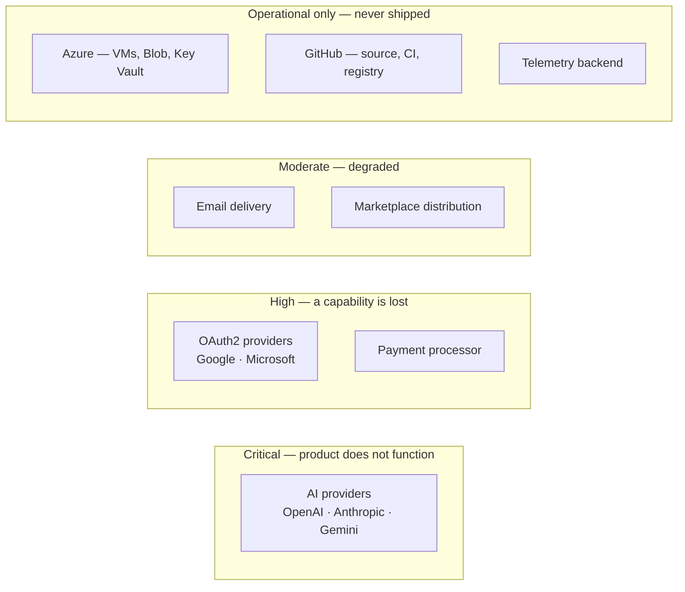

# Third-Party Services

| Field | Value |
| --- | --- |
| Document | Third-Party Services |
| Version | 1.0 |
| Status | Draft — several selections outstanding (TD-4) |
| Owner | Engineering, Security, Legal |
| Last updated | 2026-07-30 |
| Audience | Engineering, Security, Legal, Product |
| Phase | 4 — Technology Standards |

---

## 1. Purpose

This document inventories every external service MaintOrbit AI depends on at runtime:
AI providers, identity providers, payment processing, email delivery, and distribution
channels.

These differ from packages and infrastructure in a way that matters. **A package is code
we control the version of; a third-party service is a running system someone else changes
without asking.** Each is also a potential subprocessor — NFR-COMP-005 requires them
documented and customers notified in advance of changes, so this list is a
customer-facing artifact in waiting, not only an internal one.

---

## 2. Scope

**In scope:** external services called at runtime or required for distribution; their
criticality, failure behaviour, and data exposure.

**Out of scope:** self-hosted infrastructure
([`infrastructure-technologies.md`](infrastructure-technologies.md)); packages (the
technology inventories); our own hosting, which is infrastructure rather than a third-party
service.

---

## 3. Service inventory

| Service | Class | In the request path? | Data exposure | Substitutable |
| --- | --- | --- | --- | --- |
| **AI providers** | **Critical** | **Yes** | **Prompt content** | Between providers, yes |
| OAuth2 providers | High | Login only | Identity assertions | Password auth remains |
| Payment processor | High | No | Billing data; **no card data stored by us** | Yes, with migration |
| Email delivery | Moderate | No | Addresses, notification content | Yes — SMTP is standard |
| VS Code Marketplace | Moderate | No | None | Private distribution exists |
| Azure services | Operational | Partly | Encrypted objects; key material | Behind ports |
| GitHub | Operational | No | Source code | Yes, with effort |

---

## 4. AI providers

**The product's reason for existing, and its most significant external dependency.**

| Field | Value |
| --- | --- |
| **Purpose** | Model inference. The platform brokers access; it does not perform inference |
| **Why chosen** | FR-PROV-002 requires OpenAI, Anthropic, and Google Gemini at MVP; Azure OpenAI at v1.1; customer-hosted OpenAI-compatible endpoints at v1.2. Three providers is the minimum that makes the neutrality claim real — two would look like a hedge |
| **Alternatives considered** | Not applicable in the usual sense. **The relationship is inverted**: providers are the thing customers already use, and the platform's value is governing access to them. Provider *selection* is the customer's decision, not ours |
| **Version** | Provider API versions, pinned per adapter. Model versions change independently and are tracked by the catalog |
| **Support lifecycle** | **No published lifecycle commitments.** Models are deprecated on timelines shorter than enterprise release cycles — this is one of the problems the platform exists to manage (FR-PROV-010) |
| **Risks** | **Breaking API changes with short notice; model deprecation; outages; pricing changes; rate limits on the customer's account, not ours; terms-of-service changes affecting data retention** |
| **Upgrade strategy** | Adapters absorb change ([ADR-0009](../03-adr/ADR-0009-ai-provider-abstraction.md)). API version pinned per adapter; adopting a newer shape is a deliberate, versioned decision |
| **Replacement strategy** | **Routing policies with ordered fallback** — this is the product feature, not merely a mitigation. A provider outage triggers automatic fallback (FR-GW-008) |
| **Security considerations** | **Every request is a data egress event to a third party.** Provider Credentials belong to customers and are encrypted at rest ([ADR-0008](../03-adr/ADR-0008-credential-encryption.md)). Provider retention terms differ per vendor and per plan and must be documented (NFR-PRIV-012) |
| **Performance considerations** | Provider latency dominates end-to-end duration and is excluded from the platform's overhead budget. Outbound connection pools sized per provider; **exhaustion presents as latency, not error** |
| **Cross references** | [ADR-0009](../03-adr/ADR-0009-ai-provider-abstraction.md), [ADR-0016](../03-adr/ADR-0016-rest-api.md) |

### 4.1 Two properties that make these unusual

**Customers hold the commercial relationship, not us.** Rate limits, quotas, and pricing
attach to the customer's provider account. At high volume, **a customer's provider rate
limit becomes the binding constraint before our capacity does** — which is partly why
FR-PROV-012 permits multiple connections to the same provider.

**We deliberately use no vendor SDKs.** [`backend-technologies.md`](backend-technologies.md)
§10 records this: direct HTTP against documented APIs, rather than four independently
versioned dependencies with divergent release cadences in the most critical path in the
system. More implementation work, fewer moving parts where it matters most.

---

## 5. OAuth2 identity providers

| Field | Value |
| --- | --- |
| **Purpose** | Federated authentication for Google and Microsoft accounts (FR-AUTH-003) |
| **Why chosen** | The two identity providers most common in the target segment; both support standard authorization code flow with PKCE |
| **Alternatives considered** | An identity platform such as Auth0 or Okta handling all identity — **rejected on NFR-PORT-002**, since a customer-hosted deployment cannot depend on a vendor identity service, and it would cede control over the revocation semantics [ADR-0007](../03-adr/ADR-0007-authentication-strategy.md) depends on |
| **Version** | OAuth2 / OIDC standards |
| **Support lifecycle** | Rolling; endpoint changes are announced |
| **Risks** | Provider outage blocks login for affected Companies; consent or app-verification policy changes; tenant restrictions on the customer side |
| **Upgrade strategy** | Standards-based; endpoint metadata discovered rather than hard-coded |
| **Replacement strategy** | **Password authentication remains available**, so an OAuth2 outage degrades rather than blocks — unless a Company has disabled password auth under FR-AUTH-004, which is a customer configuration choice with a stated consequence |
| **Security considerations** | Authorization code with PKCE; no client secret in the distributed extension. Identity assertions are validated, never trusted on presentation |
| **Performance considerations** | Login path only; outside every latency budget |
| **Cross references** | [ADR-0007](../03-adr/ADR-0007-authentication-strategy.md), [ADR-0025](../03-adr/ADR-0025-extension-auth.md) |

**SAML (FR-AUTH-015, v1.2) inverts this relationship.** The customer's identity provider
becomes the authority, and we integrate with whatever they run rather than with a service
we chose.

---

## 6. Payment processing

| Field | Value |
| --- | --- |
| **Purpose** | Card payment, subscription billing, invoicing (FR-BILL-006/007) |
| **Why chosen** | **Pending decision TD-4.** Requirements: full PCI scope offloading, subscription and metered billing, invoice generation, tax handling (FR-BILL-012), and a webhook model compatible with Worker-only integration |
| **Alternatives considered** | Building payment handling in-house — **rejected outright**; NFR-COMP-007 requires that card data never transits or is stored by the platform, and the compliance burden is disproportionate |
| **Version** | Provider API version, pinned |
| **Support lifecycle** | Rolling; API versions typically supported for years with deprecation notice |
| **Risks** | Vendor lock-in through stored payment instruments — **migrating processors means customers re-entering card details**, which is the highest switching cost of any service here; pricing changes; regional availability limits |
| **Upgrade strategy** | API version pinned; upgrades deliberate |
| **Replacement strategy** | Possible but genuinely costly. Payment integration is confined to the Billing module behind a port, which limits code impact — but the stored-instrument problem is commercial, not technical |
| **Security considerations** | **Card data never transits or is stored by the platform** (NFR-COMP-007). Webhooks must be signature-verified; an unverified billing webhook is a direct financial manipulation vector |
| **Performance considerations** | **Worker-only, never in the request path** (CD-004). Availability affects signup and renewal, not inference |
| **Cross references** | [`../03-adr/ADR-0016-rest-api.md`](../03-adr/ADR-0016-rest-api.md); FR-BILL-001 … 014 |

> **Blocked on the commercial model.** FR-BILL-005 cannot be implemented until decision
> D-1 defines the billable unit — the same decision that has blocked billing since Phase 1.
> Processor selection should follow that decision, since metered-billing capability is a
> selection criterion.

---

## 7. Email delivery

| Field | Value |
| --- | --- |
| **Purpose** | Email verification, password reset, invitations, budget alerts, provider health, security notifications (FR-NOT-006) |
| **Why chosen** | **Pending TD-4.** Requirement: standard SMTP, so the platform is not coupled to a specific vendor |
| **Alternatives considered** | Self-hosted mail — deliverability is a specialist operational discipline and poor deliverability breaks onboarding, since email verification gates account activation (FR-AUTH-013) |
| **Version** | SMTP; provider APIs avoided in favour of the standard |
| **Support lifecycle** | Rolling |
| **Risks** | **Deliverability failures break onboarding silently** — a verification email in a spam folder is indistinguishable from a broken product; reputation damage from bounce handling |
| **Upgrade strategy** | SMTP is stable; provider changes are configuration |
| **Replacement strategy** | **Straightforward** — SMTP is a standard, and `MailKit` is provider-neutral. This is the most easily substituted service in this document |
| **Security considerations** | Credentials from configuration; TLS enforced. **Notification content must not contain secrets** — password reset uses single-use, time-limited tokens (FR-AUTH-012) |
| **Performance considerations** | Worker-only; rate-limited to prevent alert flooding (FR-NOT-009) |
| **Cross references** | FR-NOT-001 … 009, FR-AUTH-012/013 |

**Deliverability deserves more attention than its criticality rating suggests.** It is
rated Moderate because the product keeps working — but a Company whose invitation emails
do not arrive cannot onboard, and the failure produces no error anywhere in our system.

---

## 8. Distribution and operational services

### 8.1 VS Code Marketplace

| Field | Value |
| --- | --- |
| **Purpose** | Extension distribution |
| **Risks** | Review delays; policy changes; **some enterprise customers restrict marketplace access entirely** |
| **Replacement strategy** | **Private distribution is already required** for self-hosted customers ([ADR-0025](../03-adr/ADR-0025-extension-auth.md)), so the alternative path exists by necessity rather than as a contingency |
| **Security considerations** | Publisher account is a supply-chain surface — MFA required, access limited |

### 8.2 Azure — operational and port-mediated

| Service | Role | Shipped to customers? |
| --- | --- | --- |
| Virtual Machines, Load Balancer | Hosting | ❌ Operational only |
| Blob Storage | Object storage | ⚠️ **Behind the ADR-0017 port**; portable default in CI |
| Key Vault | Key custodian | ⚠️ **Behind the ADR-0008 port**; portable default in CI |

**The two ⚠️ rows are the ones that require discipline.** They are shipped-code
dependencies reachable only through their adapters, with AT-12 enforcing that no direct
reference escapes. If that enforcement lapses, v2.1 self-hosted deployment becomes a
re-architecture rather than a packaging exercise — and the lapse would be invisible until
then.

### 8.3 GitHub

| Field | Value |
| --- | --- |
| **Purpose** | Source hosting, CI/CD, container registry |
| **Risks** | Outage blocks deployment but not production; workflows are not portable |
| **Replacement strategy** | Source is portable by nature. Build logic kept in scripts rather than workflow YAML where practical, so migration is tractable |
| **Security considerations** | **Third-party actions pinned by commit SHA, never by tag.** Deployment credentials least-privilege and rotated. GitHub's secret store is part of the deployment trust boundary — **but never holds Provider Credentials**, which exist only encrypted in the database |

---

## 9. Subprocessor obligations

**NFR-COMP-005 requires subprocessors to be documented and customers notified in advance
of changes.** This is a contractual obligation to customers, not an internal note.

| Service | Processes customer data? | Subprocessor? |
| --- | --- | --- |
| AI providers | **Yes — prompt content** | **Yes** — though the customer's own provider relationship complicates the analysis |
| Payment processor | Yes — billing data | **Yes** |
| Email delivery | Yes — addresses, notification content | **Yes** |
| Azure hosting | Yes — all data at rest | **Yes** |
| OAuth2 providers | Identity assertions only | Likely yes |
| GitHub | No customer data | No |
| Telemetry backend | Metadata only; **never content or credentials** | Depends on the backend |

**The AI provider row needs legal input.** The customer supplies their own provider
credentials and holds the provider relationship, but the platform transmits their data to
that provider on their behalf. Whether that makes us a subprocessor, a conduit, or
something else is a legal question with contractual consequences — and it will be asked in
the first enterprise security review.

**A published subprocessor list will be required** before segment 3.2 sales. It should be
prepared before it is requested.

---

## 10. Failure behaviour

| Service unavailable | Gateway | Chat | Console | Signup | Billing |
| --- | --- | --- | --- | --- | --- |
| One AI provider | ⚠️ Fails over | ⚠️ Fails over | ✅ | ✅ | ✅ |
| **All AI providers** | ⛔ Halts | ⛔ Halts | ✅ | ✅ | ✅ |
| OAuth2 provider | ✅ | ✅ | ⚠️ Password auth only | ⚠️ Degraded | ✅ |
| Payment processor | ✅ | ✅ | ✅ | ⚠️ No paid signup | ⛔ Halts |
| Email delivery | ✅ | ✅ | ✅ | ⛔ **Verification blocked** | ⚠️ No notices |
| Marketplace | ✅ | ✅ | ✅ | ✅ | ✅ |
| GitHub | ✅ | ✅ | ✅ | ✅ | ✅ |

⛔ unavailable · ⚠️ degraded · ✅ unaffected

**Two rows worth noting.** Email delivery failure blocks signup entirely, because
verification gates account activation — a higher impact than its Moderate rating suggests.
And GitHub being unaffected across the board is worth confirming: production must not
depend on the CI platform at runtime.

---

## 11. Risks

| # | Risk | Severity | Likelihood | Mitigation |
| --- | --- | --- | --- | --- |
| R-1 | AI provider breaking API change with short notice | High | **High** | Adapters absorb change; API version pinned per adapter |
| R-2 | Model deprecation breaks a customer's production workload | High | **High** | FR-PROV-010 deprecation notification; routing policies allow redirection without customer code change |
| R-3 | Provider terms change regarding data retention | Medium | Medium | Terms documented per provider (NFR-PRIV-012); customers notified |
| R-4 | Payment processor migration requires customers to re-enter card details | High | Low | Selection is effectively long-term; TD-4 deserves proportionate diligence |
| R-5 | Email deliverability degrades, silently blocking onboarding | Medium | Medium | Deliverability monitored as a product metric, not an infrastructure one |
| R-6 | Azure SDK usage escapes its adapter, breaking NFR-PORT-002 | High | Medium | AT-12; portable implementations are the CI default |
| R-7 | Unverified billing webhook enables financial manipulation | High | Low | Signature verification mandatory |
| R-8 | Subprocessor status for AI providers is unresolved at the first enterprise security review | Medium | **High** | Legal input now, not when asked |
| R-9 | Customer's provider rate limit becomes the binding constraint | Medium | High | Multiple connections per provider (FR-PROV-012); clear error attribution so the limit is identifiable as theirs |
| R-10 | Marketplace policy blocks or delays extension releases | Low | Medium | Private distribution path already exists |

---

## 12. Future considerations

- **A published subprocessor list is required before segment 3.2 sales.** It should exist
  before the first enterprise security questionnaire asks for it.
- **The AI provider subprocessor question needs a legal answer**, not an engineering one.
- **Self-hosted deployment (v2.1) changes this document substantially.** Customers supply
  their own email, their own identity providers, and often their own object storage. Our
  third-party service list becomes theirs, and the subprocessor analysis shifts.
- **Provider-side prompt caching changes cost calculation.** Several providers price cached
  input differently, which affects the token model in Phase 5 schema design.
- **Customer-hosted inference endpoints (FR-PROV-015, v1.2)** blur the boundary between
  third-party service and customer infrastructure — a "provider" that is neither external
  nor commercial.
- **Regional provider endpoints** will be needed for data residency (NFR-PRIV-013, v2.1),
  adding per-region provider configuration.

---

## 13. Cross references

| Document | Relationship |
| --- | --- |
| [`technology-stack.md`](technology-stack.md) | Master inventory |
| [`infrastructure-technologies.md`](infrastructure-technologies.md) | Self-hosted components, distinct from these |
| [`backend-technologies.md`](backend-technologies.md) | §10 — why no provider SDKs |
| [`dependency-policy.md`](dependency-policy.md) | Admission criteria |
| [`support-lifecycle.md`](support-lifecycle.md) | Lifecycle tracking |
| [`../03-adr/ADR-0009-ai-provider-abstraction.md`](../03-adr/ADR-0009-ai-provider-abstraction.md) | Provider integration |
| [`../03-adr/ADR-0008-credential-encryption.md`](../03-adr/ADR-0008-credential-encryption.md) | Provider Credential custody |
| [`../03-adr/ADR-0017-object-storage.md`](../03-adr/ADR-0017-object-storage.md) | Object storage port |
| [`../01-product/non-functional-requirements.md`](../01-product/non-functional-requirements.md) | NFR-COMP-005/007, NFR-PRIV-012 |
| [`../02-architecture/component-diagram.md`](../02-architecture/component-diagram.md) | §3.6 failure impact |
