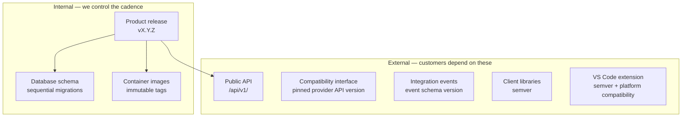

# Versioning Policy

| Field | Value |
| --- | --- |
| Document | Versioning Policy |
| Version | 1.0 |
| Status | Draft — pending engineering review |
| Owner | Engineering |
| Last updated | 2026-07-30 |
| Audience | Engineering, Product, Support |
| Phase | 4 — Technology Standards |

---

## 1. Purpose

This document defines every version number MaintOrbit AI produces or consumes: the
product release, the public API, the database schema, integration events, client
libraries, the VS Code extension, and container images.

Five of these are **external commitments** — once published, customers depend on them and
we cannot change them unilaterally. Getting the policy right before the first release is
considerably cheaper than correcting it afterwards.

---

## 2. Scope

**In scope:** product releases, public API versions, database migrations, integration
event contracts, client libraries, the extension, container images, and dependency
upgrade classification.

**Out of scope:** which dependencies exist ([`dependency-policy.md`](dependency-policy.md)),
how versions are declared ([`package-policy.md`](package-policy.md)), support windows
([`support-lifecycle.md`](support-lifecycle.md)).

---

## 3. What carries a version

| Artifact | Scheme | Breaking change cost |
| --- | --- | --- |
| Product release | Semantic `vX.Y.Z` | Internal coordination |
| Public API | URL segment `/api/v1/` | **High** — customer integrations break |
| Compatibility interface | Pinned to a stated provider API version | **High** — migrated traffic breaks |
| Database schema | Sequential, forward-only migrations | **Very high** — rolling deployment breaks |
| Integration events | Schema version per event type | Moderate now; **high after extraction** |
| Client libraries | Semantic | High |
| VS Code extension | Semantic + compatibility range | Moderate |
| Container images | Immutable tag per build | None — never mutated |

---

## 4. Product release versioning

**Semantic versioning: `MAJOR.MINOR.PATCH`.**

| Component | Increment when | Example |
| --- | --- | --- |
| **MAJOR** | A breaking change to any external commitment | New API version; removal of a deprecated capability |
| **MINOR** | Backward-compatible capability | New provider adapter; new analytics view |
| **PATCH** | Backward-compatible fix | Defect fix; performance improvement |

| Rule | Statement |
| --- | --- |
| V-1 | Every production deployment is tagged `vX.Y.Z` |
| V-2 | Conventional Commits determine the increment |
| V-3 | Roadmap names (v1.0, v1.1, v1.2, v2.0) map to `MAJOR.MINOR` |
| V-4 | **A version is never reused or re-tagged** |
| V-5 | Pre-release builds use `-beta.N` / `-rc.N` |

**Roadmap and release versions are the same numbers.** [`../01-product/future-roadmap.md`](../01-product/future-roadmap.md)
refers to v1.1 and v1.2 as release contents; those are the same `MINOR` increments here.
Keeping one numbering scheme avoids the common confusion of a "v1.2 release" shipping as
`1.4.0`.

---

## 5. Public API versioning

**URL segment versioning: `/api/v1/`.** Decided in
[ADR-0016](../03-adr/ADR-0016-rest-api.md).

| Rule | Statement | Requirement |
| --- | --- | --- |
| V-6 | The version is a URL segment, not a header | Visible in every log line and support request |
| V-7 | **Within a version, changes must be backward-compatible** | NFR-MAINT-008 |
| V-8 | Breaking changes require a new version | FR-API-010 |
| V-9 | A deprecated version is supported for a **minimum of 12 months** after its successor ships | FR-API-010 |
| V-10 | Deprecation is announced in advance, in the specification and in-product | FR-API-010 |
| V-11 | At most two versions are supported concurrently | Operational limit |

### 5.1 What is backward-compatible within a version

| Compatible | Breaking |
| --- | --- |
| Adding an optional request field | Adding a required request field |
| Adding a response field | Removing or renaming a response field |
| Adding an endpoint | Removing an endpoint |
| Adding an enum value **where clients are documented to tolerate unknown values** | Adding an enum value where they are not |
| Relaxing a validation rule | Tightening a validation rule |
| Adding an optional query parameter | Changing a default |
| Adding a new error code | Changing an existing error code's meaning |

**The enum row is the subtle one.** Adding a value is only safe if clients were told to
tolerate unknown values — and that instruction must be in the specification from v1, not
added when the first new value is needed.

### 5.2 The compatibility interface

The Gateway's OpenAI-compatible interface (FR-GW-004) is versioned **separately** from the
management API, because it tracks an external specification we do not control.

| Rule | Statement |
| --- | --- |
| V-12 | Compatibility is **pinned to a stated provider API version**, published in documentation |
| V-13 | **Divergences are documented explicitly** — governance rejections, budget rejections, and platform errors have no provider equivalent |
| V-14 | Provider API changes do not automatically propagate; adopting a newer shape is a deliberate, versioned decision |

**V-14 is a deliberate constraint.** Tracking the emulated API automatically would mean
an upstream change could break customer integrations we migrated onto our platform — the
opposite of the stability the migration promised.

---

## 6. Database schema versioning

**Sequential, forward-only migrations.** The schema has no version number of its own; the
migration history is the version.

| Rule | Statement | Rationale |
| --- | --- | --- |
| V-15 | Migrations are sequential and forward-only | NFR-MAINT-007 |
| V-16 | **Every migration must be backward-compatible with the previous application version** | Rolling deployment runs both concurrently ([ADR-0018](../03-adr/ADR-0018-docker.md)) |
| V-17 | **Expand-and-contract is mandatory** for any removal or rename | See below |
| V-18 | Migrations run to completion **before** any new container starts | Multiple instances would race |
| V-19 | A failed migration aborts the rollout | Deployment gate |
| V-20 | Every tenant-scoped table gets a row-level security policy in the same migration that creates it | [ADR-0005](../03-adr/ADR-0005-multi-tenant-strategy.md); a table without one is a leak |

### 6.1 Expand and contract

Removing or renaming a column takes **three releases**, not one:

| Release | Action | Both versions work because |
| --- | --- | --- |
| **N — expand** | Add the new column; write to both | Old version reads the old column |
| **N+1 — migrate** | Backfill; read from the new column | Both columns are populated |
| **N+2 — contract** | Remove the old column | No running version reads it |

**This is slower than it looks necessary, and it is not optional.** A migration that drops
a column the previous application version still reads will break live traffic during a
rolling deployment — an outage caused by a schema change that passed every test, because
tests run against one version at a time.

---

## 7. Integration event versioning

| Rule | Statement |
| --- | --- |
| V-21 | Every integration event carries a schema version |
| V-22 | Consumers tolerate unknown fields |
| V-23 | Adding a field is compatible; removing or changing a field's meaning is not |
| V-24 | A breaking event change requires publishing both versions during a transition |

**Currently low cost, later high cost.** In the modular monolith
([ADR-0013](../03-adr/ADR-0013-outbox-eventing.md)) publisher and consumer deploy together,
so a breaking change is a coordinated edit. **After module extraction** they deploy
independently and version skew becomes normal — at which point V-21 through V-24 stop
being paperwork and start being the thing that prevents an outage.

Versioning events from the start costs almost nothing. Retrofitting it into a running
event stream costs a great deal.

---

## 8. Client library and extension versioning

### 8.1 Client libraries (FR-API-015, v1.1)

| Rule | Statement |
| --- | --- |
| V-25 | Semantic versioning, published to public registries |
| V-26 | The library `MAJOR` tracks the API version it targets |
| V-27 | Generated from the API specification where practical |
| V-28 | Support and deprecation policy published alongside |

**These are the first artifacts we publish to consumers we do not control.** Once
published, a version cannot be withdrawn cleanly, and a breaking change affects customer
build pipelines.

### 8.2 VS Code extension

| Rule | Statement |
| --- | --- |
| V-29 | Semantic versioning, independent of the platform release |
| V-30 | **Declares a compatible platform version range** |
| V-31 | Checks compatibility on activation and reports clearly on mismatch |
| V-32 | Published to the marketplace and via private distribution ([ADR-0025](../03-adr/ADR-0025-extension-auth.md)) |

**V-30 and V-31 become routine at v2.1.** Self-hosted customers upgrade on their own
schedule, so an extension newer than the platform it connects to is normal rather than
exceptional. Without an explicit check, the failure is a confusing error rather than a
clear message.

---

## 9. Dependency upgrade classification

| Class | Cadence | Approval | Gate |
| --- | --- | --- | --- |
| **Security patch** | **Immediately** — out of band if critical | None | Full CI |
| Patch | Weekly batch | Reviewer | Full CI |
| Minor | Monthly batch | Reviewer | Full CI |
| **Major** | Planned; at most one per release cycle | **Architecture review** | Full CI + manual verification |
| **Runtime major** | Planned; **must not lapse out of support** | **Architecture review** | Full CI + load test + failure injection |

**Three standing rules:**

1. **Never run a runtime past its support end date.** Finding TR-1 in
   [`technology-stack.md`](technology-stack.md) §3 exists because this was not checked at
   Phase 0. Support end dates go in the engineering calendar with **six months'** notice.
2. **One major upgrade at a time.** Upgrading the runtime and the ORM together makes
   failure attribution impossible. The exception is a coordinated release train — .NET, EF
   Core, and Npgsql move as one.
3. **Security patches are never batched.** Everything else is.

---

## 10. Risks

| # | Risk | Severity | Likelihood | Mitigation |
| --- | --- | --- | --- | --- |
| R-1 | A non-backward-compatible migration breaks live traffic during rollout | High | Medium | V-16, V-17; migration tested against the previous version in CI |
| R-2 | A breaking API change ships within a version | High | Medium | Contract tests; §5.1 checklist in review |
| R-3 | The emulated provider API changes, breaking migrated integrations | High | **High** | V-12 pinning; documented divergence; the native interface is the long-term path |
| R-4 | Event versioning is skipped because it costs nothing today | Medium | **High** | V-21 from the first event; the cost arrives at extraction |
| R-5 | Two API versions become three because deprecation slips | Medium | Medium | V-11 hard limit; deprecation dates tracked |
| R-6 | Extension and platform version skew produces confusing failures | Medium | High | V-30, V-31 |
| R-7 | Runtime support lapses again | **Critical** | Medium | §9 rule 1; six-month calendar notice |
| R-8 | Roadmap and release numbering diverge | Low | Medium | V-3 — one scheme |

---

## 11. Future considerations

- **Client libraries change the commitment profile.** Publishing to registries introduces
  release signing, deprecation obligations, and a support relationship with consumers we
  do not control.
- **Module extraction makes event versioning load-bearing.** Independent deployment makes
  version skew normal.
- **Self-hosted deployment (v2.1) introduces customer-controlled upgrade timing.** We will
  support multiple platform versions simultaneously in the field — a substantial change to
  the support model, not just to versioning.
- **API version 2 will eventually be needed.** The transition should be planned before it
  is forced, and V-9's 12-month support window means starting a year ahead.
- **A published deprecation calendar** would help customers plan and would make V-9 and
  V-10 visible commitments rather than internal policy.

---

## 12. Cross references

| Document | Relationship |
| --- | --- |
| [`support-lifecycle.md`](support-lifecycle.md) | When upgrades become mandatory |
| [`dependency-policy.md`](dependency-policy.md) | Which dependencies are permitted |
| [`package-policy.md`](package-policy.md) | How versions are declared |
| [`technology-stack.md`](technology-stack.md) | §3 the runtime lifecycle finding |
| [`../03-adr/ADR-0016-rest-api.md`](../03-adr/ADR-0016-rest-api.md) | API versioning decision |
| [`../03-adr/ADR-0013-outbox-eventing.md`](../03-adr/ADR-0013-outbox-eventing.md) | Event contracts |
| [`../03-adr/ADR-0018-docker.md`](../03-adr/ADR-0018-docker.md) | Migration ordering and image promotion |
| [`../01-product/future-roadmap.md`](../01-product/future-roadmap.md) | Roadmap version names |
| `README.md` | Git branching and Conventional Commits |
