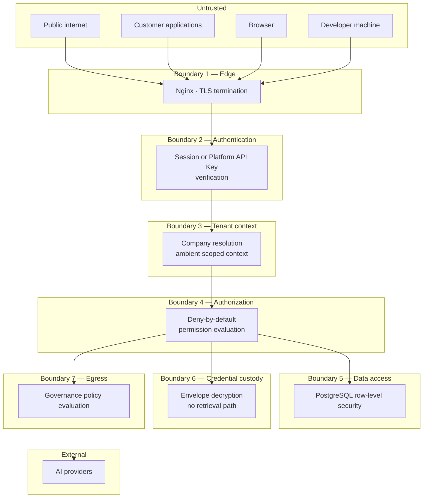
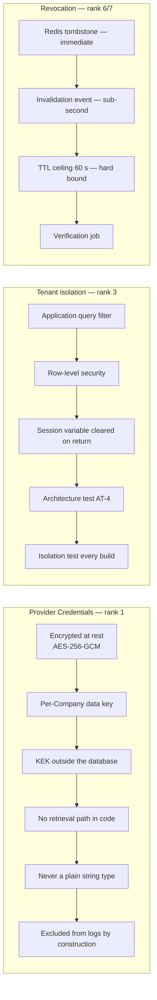

# Security Overview

| Field | Value |
| --- | --- |
| Document | Security Overview (master) |
| Version | 1.0 |
| Status | Draft — pending security review |
| Owner | Engineering & Security |
| Last updated | 2026-07-30 |
| Audience | Engineering, Security, Compliance, Architecture Review, Leadership |
| Phase | 5 — Security Architecture |

---

## 1. Purpose

This is the master security document for MaintOrbit AI. It establishes the threat
context, the trust boundaries, the security principles, and the numbered security
decisions (`SD-001` … `SD-018`) that bind every other document in this phase.

**Why this platform's security posture is unusual.** MaintOrbit AI stores its customers'
AI provider credentials — secrets carrying direct spend authority and an unrestricted
data egress channel. It also sits in the request path of customers' production systems
and holds a complete record of what their employees asked AI models. A compromise here is
not an embarrassment; it is simultaneously a financial incident, a data breach, and a
breach of every customer at once.

The product exists to solve credential sprawl
([`../01-product/problem-statement.md`](../01-product/problem-statement.md) §3.1).
Reproducing that problem in our own system would be the defining failure.

---

## 2. Scope

### 2.1 In scope

Security architecture for every component: authentication, authorization, multi-tenant
isolation, provider credential custody, the AI Gateway, REST API, VS Code Extension, web
frontend, SignalR, Hangfire, PostgreSQL, Redis, object storage, Docker, and CI/CD.

### 2.2 Out of scope

| Excluded | Reason |
| --- | --- |
| Traffic that bypasses the platform | The platform governs what passes through it. Stated in [`../01-product/problem-statement.md`](../01-product/problem-statement.md) §9 |
| Endpoint and network security in customer environments | Not our boundary |
| AI provider internal security | Assessed as a subprocessor; not controlled |
| Physical security of cloud infrastructure | Inherited from the hosting provider |
| Customer-side misuse by authorized employees | Detected and audited, not prevented |
| Implementation code | This phase is documentation only |

### 2.3 Requirements traced

44 requirements govern this phase: **NFR-SEC-001 … 020**, **NFR-PRIV-001 … 014**,
**NFR-COMP-001 … 010**, plus FR-AUTH, FR-PERM, FR-PROV-004/016, FR-GOV, and FR-AUD.

---

## 3. Architecture

### 3.1 Assets, ranked by consequence of compromise

Security investment follows this ranking. It is deliberately explicit, because a security
programme that treats all assets equally under-protects the ones that matter.

| Rank | Asset | Consequence of compromise | Primary control |
| --- | --- | --- | --- |
| **1** | **Provider Credentials** | **Existential** — spend authority plus data egress, across every customer simultaneously | Envelope encryption, no retrieval path ([05](05-provider-credential-security.md)) |
| **2** | **Key-encryption key** | Unlocks rank 1 for all tenants | Custodian outside the database ([10](10-key-management.md)) |
| **3** | **Tenant isolation boundary** | Cross-customer data exposure; contract and regulatory breach | Database-enforced row-level security ([04](04-tenant-security.md)) |
| **4** | **Prompt and completion content** | Customer confidential data, where retention is enabled | Off by default; opt-in per Team ([08](08-data-protection.md)) |
| **5** | **Audit trail integrity** | Compliance failure; incident response becomes impossible | Append-only, never sampled ([12](12-audit-and-compliance.md)) |
| **6** | **Platform API Keys** | Impersonation within one Company | Hashed storage, tombstoned revocation ([02](02-authentication-architecture.md)) |
| **7** | **Session credentials** | Account takeover | Short lifetime, rotation, revocation ([11](11-session-management.md)) |
| **8** | **Usage and cost ledger** | Financial misreporting; loss of customer trust | Immutability, reconciliation ([12](12-audit-and-compliance.md)) |
| **9** | **Organizational metadata** | Reconnaissance value | Tenant isolation |

### 3.2 Trust boundaries

**Seven boundaries, each independently enforced.** The design assumption is that any
single boundary may fail; no boundary is the sole protection for a rank 1–3 asset.

| Boundary | Enforcement | Fails to |
| --- | --- | --- |
| 1 — Edge | TLS, security headers, coarse rate limits | Reject |
| 2 — Authentication | Session or key verification, tombstone check | Reject |
| 3 — Tenant context | Ambient scoped resolution | **No tenant → no rows** |
| 4 — Authorization | Deny-by-default at execution | Reject |
| 5 — Data access | Row-level security below every query | Return zero rows |
| 6 — Credential custody | Decryption reachable only from provider execution | No plaintext exists to return |
| 7 — Egress | Governance policy evaluation | Reject in enforce mode |

**Boundary 3's failure direction is the design's most important property.** A missing
tenant context produces an *empty result*, never an unfiltered one — visible and safe
rather than silent and catastrophic.

### 3.3 Defence in depth for the top three assets

---

## 4. Design decisions

Numbered `SD-xxx` and binding on every document in this phase. Decisions marked **new**
add detail beyond Phases 1–4 and require ratification.

### 4.1 Foundational

| # | Decision | Source |
| --- | --- | --- |
| **SD-001** | **Deny by default.** Every operation without an explicit grant is refused | FR-PERM-002 |
| **SD-002** | **Tenant isolation is enforced below the application layer.** An application defect must not cause cross-tenant exposure | NFR-SEC-007, [ADR-0005](../03-adr/ADR-0005-multi-tenant-strategy.md) |
| **SD-003** | **No code path returns a Provider Credential in plaintext**, to any Role, including Owner. Satisfied structurally — there is no "reveal" operation to misconfigure | FR-PROV-004, NFR-SEC-004 |
| **SD-004** | **Security and financial controls fail closed; availability and bookkeeping concerns fail open.** Every dependency is classified | [ADR-0021](../03-adr/ADR-0021-fail-open-fail-closed.md) |
| **SD-005** | **Audit and usage records are never sampled**, under any load condition | NFR-DATA-007, [`../01-product/mission.md`](../01-product/mission.md) §4.5 |
| **SD-006** | **Content retention is opt-in per Team and off by default**; enabling it is itself audited | NFR-PRIV-001/002, FR-GOV-009/010 |
| **SD-007** | **Revocation uses three redundant mechanisms** — tombstone, invalidation event, TTL ceiling — because partial failure is unacceptable | [ADR-0007](../03-adr/ADR-0007-authentication-strategy.md) |
| **SD-008** | **Deprovisioning revokes every credential**, including Platform API Keys the Employee created, and is **verified by a job** rather than assumed | FR-AUTH-018 |

### 4.2 Cryptographic — **new in this phase**

| # | Decision | Rationale |
| --- | --- | --- |
| **SD-009** 🆕 | **AES-256-GCM** for all application-layer encryption of stored secrets and content | Authenticated encryption; tampering is detectable rather than silently decrypting to garbage. Refines [ADR-0008](../03-adr/ADR-0008-credential-encryption.md), which did not name an algorithm |
| **SD-010** 🆕 | **Argon2id** for password hashing, with parameters recorded and reviewed annually | Memory-hard; resistant to GPU and ASIC acceleration. Phase 4 required "a memory-hard algorithm" without naming one |
| **SD-011** 🆕 | **Platform API Key secrets are hashed with SHA-256**, not a password hash, and carry a **non-secret identifying prefix** for lookup | High-entropy random secrets do not need a slow hash; a slow hash on every Gateway request would breach NFR-PERF-007. The prefix makes lookup constant-time without a scan — a structural requirement flagged in [ADR-0007](../03-adr/ADR-0007-authentication-strategy.md) R-3 |
| **SD-012** 🆕 | **Key hierarchy is two-tier and versioned**: KEK → per-Company DEK → ciphertext, with every ciphertext recording the DEK version that produced it | Enables rotation without re-encrypting history |

### 4.3 API and session — **new in this phase**

| # | Decision | Rationale |
| --- | --- | --- |
| **SD-013** 🆕 | **Access tokens are JWTs with a 15-minute lifetime; refresh consults the server-side session record** | ADR-0007 set the lifetime; this fixes the format and confirms refresh is stateful, so revocation takes effect at the next refresh at latest |
| **SD-014** 🆕 | **Refresh tokens rotate on every use, with reuse detection.** A reused refresh token revokes the entire session family | Detects token theft, which a non-rotating refresh token cannot |
| **SD-015** 🆕 | **Mutating API operations accept an idempotency key**; replays return the original outcome | Not previously specified. Prevents duplicate spend from client retries — material given that Gateway requests cost money |
| **SD-016** 🆕 | **Sessions are device-scoped**, enumerable and individually revocable by the Employee | FR-AUTH-008 requires enumeration and termination; this fixes the unit as a device session |

### 4.4 Data

| # | Decision | Rationale |
| --- | --- | --- |
| **SD-017** 🆕 | **A four-level data classification scheme** governs handling, retention, and logging | No classification scheme existed; without one, "sensitive data" is undefined and controls cannot be assigned |
| **SD-018** | **Erasure pseudonymizes audit records rather than deleting them.** The tension with audit immutability is resolved in favour of retaining the record with the identity removed | NFR-PRIV-009 vs NFR-DATA-006. **Adequacy is jurisdiction-dependent and requires legal confirmation** |

---

## 5. Security principles

| # | Principle | Practical consequence |
| --- | --- | --- |
| P-1 | **Assume any single control fails** | No rank 1–3 asset is protected by one mechanism |
| P-2 | **Fail safe, and make failure visible** | Missing tenant context returns nothing, loudly |
| P-3 | **Structure over discipline** | Where a control can be enforced by types or tests, it is. A control requiring developers to remember is not a control |
| P-4 | **Least privilege, including our own** | The elevated database role is restricted to named, audited paths |
| P-5 | **Honest about limitations** | Stated tolerances and known gaps, not marketing claims. [`../01-product/mission.md`](../01-product/mission.md) §6 |
| P-6 | **Security is a design input, not a release gate** | Threat modelling during design, not before launch |
| P-7 | **The monitored are told what is monitored** | Employees see what their Company can observe (FR-CHAT-008) |

**P-5 is not decoration.** The P-06 persona — the security lead who can block a purchase —
detects overstatement reliably and treats it as disqualifying. Every stated limitation in
this phase, including the ingestion durability gap and the erasure tension, is recorded
because concealing it would be both wrong and commercially self-defeating.

---

## 6. Trade-offs

| # | Decision | Gained | Given up |
| --- | --- | --- | --- |
| T-1 | Row-level security (SD-002) | Isolation surviving application defects | Query-planning cost; pooling complexity; an elevated role that bypasses it |
| T-2 | No credential retrieval path (SD-003) | FR-PROV-004 cannot be misconfigured | No credential export; a customer losing their own key must re-enter it |
| T-3 | Triple-redundant revocation (SD-007) | Near-immediate revocation | A Redis round trip on every request; three mechanisms to maintain |
| T-4 | Content off by default (SD-006) | Minimal breach exposure | Weaker product analytics; quality features need opt-in |
| T-5 | Never sampling audit (SD-005) | Complete, defensible trail | Storage cost that grows monotonically |
| T-6 | Fail-closed security controls (SD-004) | Controls cannot be degraded under load | Redis unavailability halts the Gateway |
| T-7 | Argon2id (SD-010) | Strong offline-cracking resistance | CPU and memory cost per authentication |
| T-8 | Refresh rotation with reuse detection (SD-014) | Token theft becomes detectable | Legitimate races can revoke a session; needs a tolerance window |
| T-9 | Pseudonymized erasure (SD-018) | Audit integrity preserved | Not deletion; adequacy is jurisdiction-dependent |

---

## 7. Security considerations

### 7.1 The three highest-consequence failure modes

| Failure | Why it is worst | Where addressed |
| --- | --- | --- |
| **KEK compromise** | Unlocks every customer's Provider Credentials simultaneously | [10](10-key-management.md) |
| **Cross-tenant data exposure** | Contract breach, regulatory exposure, and unrecoverable trust loss in a governance product | [04](04-tenant-security.md) |
| **Stale cache leaves a revoked credential effective** | Directly contradicts the platform's core promise to the P-07 persona | [02](02-authentication-architecture.md), [11](11-session-management.md) |

### 7.2 Residual risks accepted with mitigation

| Risk | Why it cannot be eliminated | Mitigation |
| --- | --- | --- |
| The elevated database role bypasses row-level security | Platform administration and the outbox relay legitimately span Companies | Named paths only; enumerated by architecture test; every use audited |
| Ingestion durability window (~1 s) | Latency budget forbids synchronous durable writes | Disclosed, not concealed; reconciliation alerts on divergence. **Decision D-2** |
| Client-side secret detection in the Extension is imperfect | Heuristic by nature | Presented as best-effort, never as a guarantee; server-side governance is the backstop |
| An authorized employee misusing their access | Authorization cannot distinguish intent | Complete audit trail; anomaly detection ([14](14-security-monitoring.md)) |
| Provider-side handling of transmitted content | Outside our boundary | Documented per provider (NFR-PRIV-012); governance limits what leaves |

---

## 8. Future improvements

- **Customer-managed encryption keys** (NFR-SEC-020, v2.0) — the pluggable custodian makes
  this a new implementation rather than a redesign.
- **Hardware security keys** (FR-AUTH-020, v2.0) — origin-bound credentials do not fit the
  shared-secret shape of TOTP and need a distinct credential model.
- **Tamper-evident audit** (NFR-COMP-003, v1.1) — hash chaining so modification is
  detectable.
- **SAML and SCIM** (v1.2) — the identity boundary moves to the customer's provider.
- **Automated lifecycle checking** — Phase 4 found an out-of-support runtime; a mechanical
  check would prevent a repeat.
- **A published subprocessor list and security posture statement** — required before
  segment 3.2 sales, and better prepared than improvised.
- **Response-side governance** — current egress controls evaluate prompts; completions
  under streaming have different characteristics.

---

## 9. Open security decisions

| # | Decision | Blocks | Owner |
| --- | --- | --- | --- |
| **D-1** | Ratify row-level security tenancy after prototype | **All schema design** | Engineering |
| **DD-2** | **Connection pooling mode compatible with row-level security** | Phase 6 schema | Engineering & Security |
| **D-6 / TD-2** | Key custodian selection, portable default, **and a tested key backup procedure** | Credential storage | Engineering & Security |
| **D-3** | Gateway behaviour during Redis outage — does budget enforcement fail open? | Availability target | Product & Engineering |
| **D-2** | Ingestion durability gap — amend the requirement or fund higher durability | Ledger design | Engineering & Product |
| **SD-018** | Legal confirmation that pseudonymized erasure satisfies applicable law | Erasure implementation | Legal |
| **FR-GOV-011** | Legal-hold authorization process for retained content | Content retention usability | Legal & Product |
| **SD-009…016** | Ratify the eight new decisions introduced in this phase | Implementation | Security & Engineering |

---

## 10. Cross references

| Document | Covers |
| --- | --- |
| [02 — Authentication](02-authentication-architecture.md) | JWT, OAuth2, PKCE, MFA, SSO |
| [03 — Authorization](03-authorization-architecture.md) | RBAC, policies, resource authorization |
| [04 — Tenant Security](04-tenant-security.md) | Isolation, RLS, cross-tenant protection |
| [05 — Provider Credentials](05-provider-credential-security.md) | Envelope encryption, lifecycle |
| [06 — Secret Management](06-secret-management.md) | Key Vault, environments, rotation |
| [07 — API Security](07-api-security.md) | TLS, rate limiting, CORS, CSRF, idempotency |
| [08 — Data Protection](08-data-protection.md) | Classification, retention, erasure |
| [09 — Encryption Strategy](09-encryption-strategy.md) | At rest, in transit, hashing |
| [10 — Key Management](10-key-management.md) | Hierarchy, rotation, recovery |
| [11 — Session Management](11-session-management.md) | Lifecycle, devices, revocation |
| [12 — Audit & Compliance](12-audit-and-compliance.md) | Audit trail, SOC 2, ISO 27001, GDPR |
| [13 — Threat Model](13-threat-model.md) | STRIDE analysis and mitigations |
| [14 — Security Monitoring](14-security-monitoring.md) | Telemetry, alerting, incident response |
| [15 — Security Checklist](15-security-checklist.md) | Implementation checklist |
| [`../02-architecture/authentication-architecture.md`](../02-architecture/authentication-architecture.md) | Architectural identity design |
| [`../03-adr/`](../03-adr/) | Ratified decisions |
| [`../01-product/non-functional-requirements.md`](../01-product/non-functional-requirements.md) | NFR-SEC, NFR-PRIV, NFR-COMP |

> **Note on location.** `docs/05-security/` sits alongside the existing
> `docs/05-development/` from Phase 0 — the third numbering collision, after `03-adr` /
> `03-database` and `04-technology` / `04-api`. Worth reconciling.
