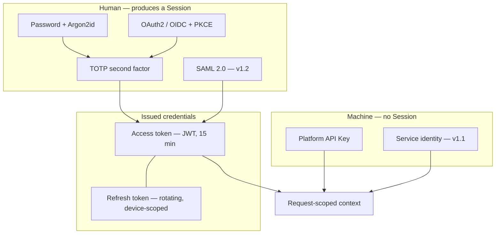

# Authentication Architecture

| Field | Value |
| --- | --- |
| Document | Authentication Architecture (security) |
| Version | 1.0 |
| Status | Draft — SD-013 … SD-016 require ratification |
| Owner | Engineering & Security |
| Last updated | 2026-07-30 |
| Audience | Engineering, Security, Compliance |
| Phase | 5 — Security Architecture |

---

## 1. Purpose

This document specifies the security properties of authentication: token formats and
lifetimes, federation, multi-factor, rotation, revocation, and device sessions.

It **extends rather than restates**
[`../02-architecture/authentication-architecture.md`](../02-architecture/authentication-architecture.md),
which establishes the identity model and revocation architecture. Where that document
answers *what the design is*, this one answers *why it resists attack*.

---

## 2. Scope

**In scope:** JWT access tokens, refresh tokens and rotation, OAuth2 with PKCE, Google and
Microsoft federation, Azure AD and OIDC, the path to enterprise SSO, MFA, session
lifecycle, token revocation, device sessions.

**Out of scope:** authorization ([03](03-authorization-architecture.md)), session storage
and expiry mechanics ([11](11-session-management.md)), Provider Credentials —
a completely separate concern ([05](05-provider-credential-security.md)).

---

## 3. Architecture

### 3.1 Credential types

**A request carries a Session or a Platform API Key, never both.** Accepting either on the
same path invites confused-deputy defects, where a request authorized under one identity
performs work attributed to another.



| Credential | Surfaces | Lifetime | Revocable |
| --- | --- | --- | --- |
| Access token (JWT) | Console, Extension | **15 minutes** | Via refresh denial; ≤ 15 min residual |
| Refresh token | Console, Extension | Session absolute lifetime | **Immediately** — tombstone |
| Platform API Key | Gateway, Developer API | Optional expiry | **Immediately** — tombstone |
| Service identity (v1.1) | Gateway | Expiry required | Immediately |

### 3.2 Access tokens — SD-013

| Property | Decision | Rationale |
| --- | --- | --- |
| Format | JWT, asymmetrically signed | Signature verifiable without a shared secret; supports future key distribution |
| Lifetime | **15 minutes** | Bounds the value of a stolen token without forcing constant re-authentication |
| Claims | Employee, Company, session, issued-at, expiry, token type | **Minimal** — see below |
| Validation | Signature, expiry, issuer, audience, token type | Every field validated; none assumed |
| Storage — console | In memory; **never `localStorage`** | Reduces XSS exfiltration surface |
| Storage — extension | Process memory only | XD-002 |

**Claims are deliberately minimal.** Roles and permissions are **not** embedded in the
token. Two reasons: FR-PERM-005 requires role changes to take effect within 60 seconds,
which a self-contained 15-minute token cannot honour; and a token carrying permissions is
a stale authorization decision travelling around the network.

Permissions are resolved server-side per request from cache, with the tombstone check
([04](04-tenant-security.md) and §3.6 below) making revocation immediate.

**Token type is a validated claim, not a convention.** A refresh token presented as an
access token must be rejected — this is a real and commonly-missed confusion attack.

### 3.3 Refresh tokens and rotation — SD-014

```mermaid
sequenceDiagram
    autonumber
    participant C as Client
    participant A as API host
    participant S as Session store

    C->>A: refresh with RT-1
    A->>S: look up RT-1
    S-->>A: valid, family F, not used
    A->>S: mark RT-1 used; issue RT-2 in family F
    A-->>C: new access token + RT-2

    Note over C,A: later — RT-1 is replayed
    C->>A: refresh with RT-1
    A->>S: look up RT-1
    S-->>A: valid but ALREADY USED
    A->>S: revoke entire family F
    A->>A: raise security event
    A-->>C: rejected — re-authentication required
```

| Property | Decision | Rationale |
| --- | --- | --- |
| Rotation | **Every use** issues a new refresh token | A stolen token is single-use |
| **Reuse detection** | Reuse revokes the **entire session family** | The only reliable signal that a refresh token was copied |
| Storage | Hashed server-side; **never recoverable** | Database compromise does not yield usable tokens |
| Binding | Bound to a device session (SD-016) | Enables per-device revocation |
| Transport — console | `HttpOnly`, `Secure`, `SameSite` cookie | Not reachable from JavaScript |
| Transport — extension | OS keychain via `SecretStorage` | Never in settings files, never synchronized |

**Reuse detection is what makes rotation worth its complexity.** Without it, rotation only
shortens a stolen token's life. With it, theft becomes *detectable* — the legitimate client
and the attacker inevitably both present the same token, and whichever arrives second
triggers family revocation and a security event.

**Trade-off:** a legitimate race — two tabs refreshing simultaneously, or a retry after a
dropped response — can trigger a false revocation. A short grace window in which the
immediately-previous token is accepted without penalty mitigates this; the window's length
is a tuning decision that must be measured rather than guessed.

### 3.4 OAuth2 and PKCE

| Property | Decision | Rationale |
| --- | --- | --- |
| Flow | **Authorization code with PKCE**, always | No client secret can be embedded in a distributed extension; PKCE also protects the console against code interception |
| Code challenge | SHA-256 | The plain method is not used |
| State parameter | Cryptographically random, single-use, bound to the session | CSRF protection on the callback |
| Nonce | Present and validated for OIDC | Replay protection on the ID token |
| Redirect URIs | **Exact-match allowlist** | Wildcard or prefix matching is an open-redirect vector |
| ID token validation | Signature, issuer, audience, nonce, expiry | Discovered via provider metadata, never hard-coded |
| Implicit flow | **Not supported** | Deprecated; exposes tokens in URLs |

**Federated identity is never trusted on presentation.** An assertion is validated against
the provider's published keys, and an email address in an assertion does not by itself
grant access to a Company — Employee provisioning is governed by FR-TEN-005/006, not by
whoever can prove control of an address.

### 3.5 Federation providers and the SSO path

| Provider | Protocol | Release | Notes |
| --- | --- | --- | --- |
| **Google** | OAuth2 / OIDC | MVP | Consumer and Workspace accounts |
| **Microsoft** | OAuth2 / OIDC | MVP | Personal, work, and school accounts |
| **Azure AD / Entra ID** | OIDC | MVP via Microsoft | Tenant-restricted sign-in supported through the same integration |
| **SAML 2.0** | SAML | v1.2 | Customer-managed identity providers |
| **SCIM 2.0** | SCIM | v1.2 | Automated provisioning and deprovisioning |

**A Company Admin can restrict authentication methods** (FR-AUTH-004), including disabling
password authentication entirely — the configuration most enterprises want once SSO exists.

**The architectural preparation that matters now.** FR-AUTH-016 requires SCIM at v1.2, and
whether that is an adapter or a rewrite is determined by decisions made today: **Employee
lifecycle transitions must exist as first-class operations, not console-only flows** (AU-012).
If invitation, role assignment, and deprovisioning are only reachable through the console,
SCIM becomes a rewrite of the identity module.

**SAML introduces distinct security concerns** that do not apply to OIDC and must be
addressed at v1.2: XML signature wrapping, assertion replay, unsigned-assertion
acceptance, and metadata trust. SAML is not "OIDC with different formatting."

### 3.6 Multi-factor authentication

**MFA is an MVP capability, not merely "MFA-ready."** FR-AUTH-005 requires TOTP and
FR-AUTH-006 requires that a Company Admin can mandate it for all Employees or for
specified roles.

| Property | Decision |
| --- | --- |
| Method | TOTP, standards-based |
| Secret storage | Encrypted at rest under the same envelope scheme as other sensitive material |
| Enrolment | Recovery codes issued once, hashed at rest, single-use |
| Enforcement | Per Company, optionally per role (FR-AUTH-006) |
| Step-up | Required for high-consequence operations — see below |
| Replay | A used TOTP code is rejected within its window |
| Brute force | Rate-limited per account (NFR-SEC-016) |

**Step-up authentication is recommended for a defined set of operations**, even for an
already-authenticated session: creating or rotating a Provider Connection, changing
Company authentication policy, transferring ownership, and enabling Content Retention.
These are the operations where a hijacked session does the most damage, and re-proving
possession of the second factor is cheap relative to the consequence.

**Future:** hardware security keys (FR-AUTH-020, v2.0). Origin-bound credentials resist
phishing in a way TOTP does not, but they do not fit the shared-secret model and require a
distinct credential type.

### 3.7 Revocation — the mechanism that makes cached authentication safe

The Gateway serves authentication from cache ([ADR-0010](../03-adr/ADR-0010-gateway-hot-path.md)),
so a cached credential remains usable until its entry expires. FR-AUTH-010, FR-AUTH-018,
and FR-PERM-005 require revocation within 60 seconds — and the P-07 persona's stated
abandonment trigger is discovering that a deprovisioned employee's key still works.

| Mechanism | Latency | Fails when | Consequence of failure |
| --- | --- | --- | --- |
| **Tombstone in Redis**, checked on every cache hit | Immediate | Redis unavailable | Gateway is already rejecting everything — safe |
| **Invalidation event** | Sub-second typically | Delivery delayed or lost | Falls through to TTL |
| **Cache TTL ceiling — 60 s** | ≤ 60 s | **Never** — a hard bound | — |

**Tombstone lifetime is twice the TTL ceiling**, so a tombstone can never expire while a
stale cache entry survives.

**Deprovisioning cascade (SD-008):** tombstones are written for the Employee, every
Session, and **every Platform API Key they created** — then a verification job confirms
that no credential belonging to them remains resolvable. Enumeration is **generic by
credential type**, not a hard-coded list, so a credential type added later is not silently
missed.

### 3.8 Device sessions — SD-016

| Property | Decision | Requirement |
| --- | --- | --- |
| Unit | A session is scoped to a **device**, not merely to an Employee | FR-AUTH-008 |
| Recorded | First seen, last active, client type, coarse location, address | Enables recognition |
| Enumeration | An Employee sees their own active sessions | FR-AUTH-008 |
| Revocation | Individually, or all-except-current | FR-AUTH-008 |
| Administrative | A Company Admin can terminate any Employee's sessions | FR-AUTH-009 |
| Concurrency | Multiple concurrent sessions permitted; a Company may cap them | See [11](11-session-management.md) |
| New device | Notification to the Employee | Detection of unauthorized access |

**Recorded metadata is a privacy consideration, not only a security feature.** Location and
address data about employees is personal data subject to the classification in
[08](08-data-protection.md). It is retained for a bounded period and is visible to the
Employee themselves — consistent with principle P-7, that the monitored are told what is
monitored.

---

## 4. Design decisions

| # | Decision | Rationale |
| --- | --- | --- |
| SD-013 🆕 | JWT access tokens, 15-minute lifetime, **stateful refresh** | Bounds theft value; server-side session consultation preserves revocation |
| SD-014 🆕 | **Refresh rotation with reuse detection**; reuse revokes the family | Makes token theft detectable rather than merely time-limited |
| SD-016 🆕 | Sessions are device-scoped | Enables per-device visibility and revocation |
| SD-010 🆕 | **Argon2id** password hashing, parameters recorded and reviewed annually | Memory-hard; resists GPU and ASIC acceleration |
| SD-011 🆕 | Platform API Key secrets hashed with **SHA-256** plus a non-secret lookup prefix | High-entropy secrets need no slow hash; a slow hash per Gateway request would breach NFR-PERF-007 |
| AD-a | **Permissions are not embedded in tokens** | FR-PERM-005's 60-second requirement is incompatible with a self-contained token |
| AD-b | **Token type is a validated claim** | Prevents refresh-as-access confusion |
| AD-c | Authorization code with PKCE only; **implicit flow unsupported** | Deprecated and exposes tokens in URLs |
| AD-d | Exact-match redirect URI allowlist | Prefix matching is an open-redirect vector |
| AD-e | **Step-up authentication for high-consequence operations** | Bounds the damage of a hijacked session |
| AD-f | Access token in memory; refresh token in `HttpOnly` cookie or OS keychain | Separates XSS exposure from session persistence |

---

## 5. Trade-offs

| # | Gained | Given up |
| --- | --- | --- |
| T-1 | Short access token lifetime bounds theft value | More refresh traffic |
| T-2 | Stateful refresh preserves revocation | A session lookup per refresh; not fully stateless |
| T-3 | Permissions resolved per request | A cache read per request rather than a token claim |
| T-4 | Refresh rotation with reuse detection | Legitimate races can revoke a session; needs a grace window |
| T-5 | Argon2id | CPU and memory cost per authentication; a denial-of-service consideration |
| T-6 | Device sessions | Storing device metadata — itself personal data |
| T-7 | Step-up authentication | Friction on exactly the operations administrators perform most |
| T-8 | Triple-redundant revocation | A Redis round trip per request; three mechanisms to test |

---

## 6. Security considerations

| Threat | Mitigation |
| --- | --- |
| **Credential stuffing** | Breach-corpus checking (FR-AUTH-002); rate limiting (NFR-SEC-016); lockout with notification (FR-AUTH-011) |
| **Token theft via XSS** | Access token in memory only; refresh token `HttpOnly`; strict CSP ([07](07-api-security.md)) |
| **Refresh token replay** | Rotation with reuse detection; family revocation |
| **Authorization code interception** | PKCE with SHA-256 |
| **CSRF on the OAuth callback** | Single-use state bound to the session |
| **Open redirect** | Exact-match redirect URI allowlist |
| **Token confusion** | Token type validated as a claim |
| **Session fixation** | A new session identifier is issued on authentication and on privilege change |
| **Phishing** | TOTP helps; **hardware keys are the real answer** (v2.0) |
| **Stale cached credential after revocation** | Tombstone, event, TTL ceiling, verification job |
| **Orphaned key after deprovisioning** | Generic cascade enumeration plus a verification job |
| **Brute force against TOTP** | Rate limiting; used codes rejected within their window |

**Every authentication event produces an audit event** (FR-AUTH-014): success, failure,
lockout, MFA challenge, password change, token family revocation.

---

## 7. Future improvements

- **Hardware security keys** (FR-AUTH-020, v2.0) — the only credible answer to phishing.
- **SAML and SCIM** (v1.2) — with the SAML-specific threats in §3.5 addressed explicitly,
  not assumed to be covered by OIDC hardening.
- **Service identities** (FR-AUTH-019, v1.1) — a credential with **no human owner has no
  deprovisioning trigger**, which is the mechanism SD-008 depends on. An expiry and
  attestation model is required instead; this is an unsolved design problem, not an
  increment.
- **Continuous session evaluation** — re-evaluating risk mid-session on a change of
  address or device signal.
- **Passkeys** — as adoption matures, potentially replacing passwords rather than
  supplementing them.
- **Asymmetric key distribution** — publishing signing keys so that an extracted Gateway
  service can verify tokens without a shared secret.

---

## 8. Cross references

| Document | Relationship |
| --- | --- |
| [01 — Security Overview](01-security-overview.md) | SD-007 … SD-016 |
| [03 — Authorization](03-authorization-architecture.md) | What an authenticated identity may do |
| [04 — Tenant Security](04-tenant-security.md) | Tenant context derived from authentication |
| [11 — Session Management](11-session-management.md) | Session lifecycle mechanics |
| [12 — Audit & Compliance](12-audit-and-compliance.md) | Authentication event logging |
| [13 — Threat Model](13-threat-model.md) | Spoofing and elevation analysis |
| [`../02-architecture/authentication-architecture.md`](../02-architecture/authentication-architecture.md) | Architectural identity design |
| [`../03-adr/ADR-0007-authentication-strategy.md`](../03-adr/ADR-0007-authentication-strategy.md) | Ratified strategy |
| [`../03-adr/ADR-0025-extension-auth.md`](../03-adr/ADR-0025-extension-auth.md) | Extension OAuth2/PKCE |
| [`../01-product/product-requirements.md`](../01-product/product-requirements.md) | FR-AUTH-001 … 020 |
