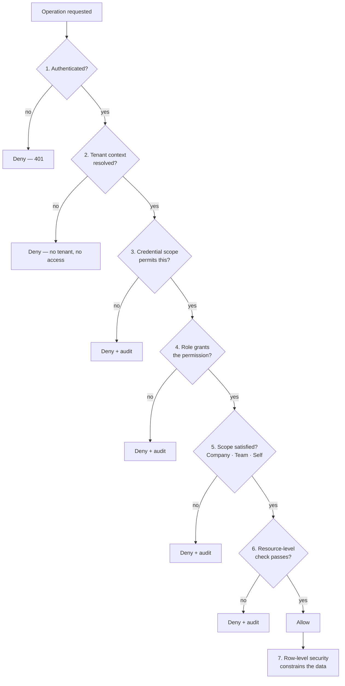
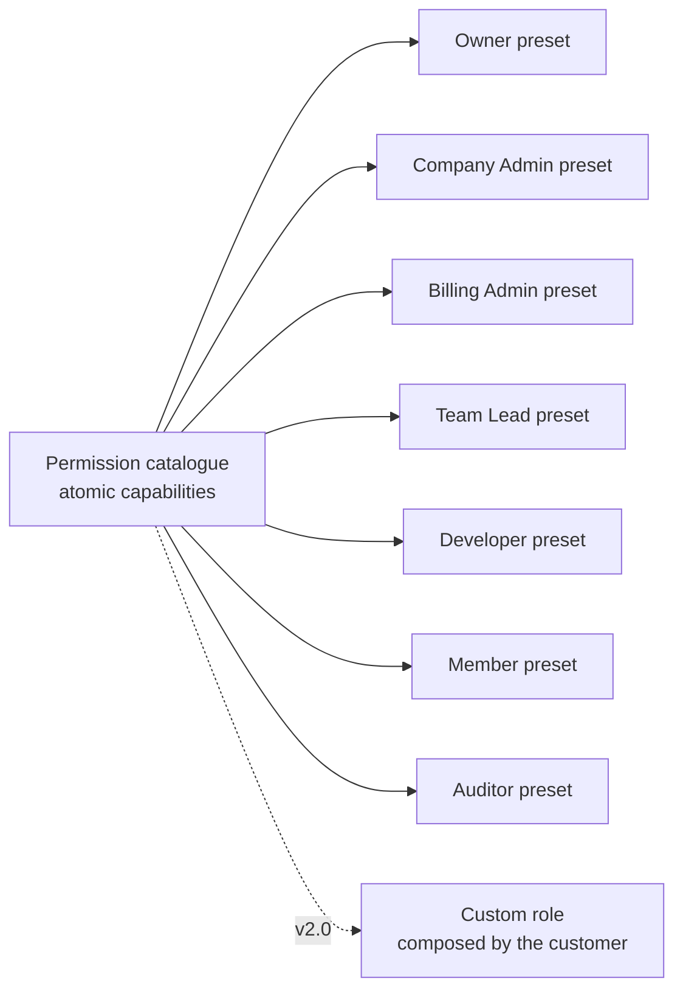
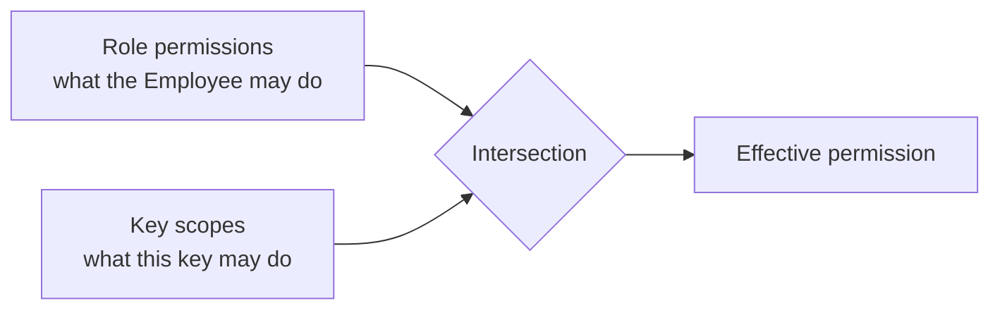

# Authorization Architecture

| Field | Value |
| --- | --- |
| Document | Authorization Architecture |
| Version | 1.0 |
| Status | Draft — pending security review |
| Owner | Engineering & Security |
| Last updated | 2026-07-30 |
| Audience | Engineering, Security, Compliance |
| Phase | 5 — Security Architecture |

---

## 1. Purpose

Authentication establishes *who* an actor is. Authorization determines *what they may do*.
This document specifies the model: roles, permissions, claims, policy-based and
resource-based evaluation, and how least privilege is applied — including to ourselves.

---

## 2. Scope

**In scope:** RBAC, the permission model, role hierarchy, claims, policy-based and
resource-based authorization, API authorization, tenant authorization, least privilege.

**Out of scope:** identity establishment ([02](02-authentication-architecture.md)), tenant
isolation at the data layer ([04](04-tenant-security.md)), governance policies over request
*content* — a different mechanism entirely ([07](07-api-security.md) and FR-GOV).

---

## 3. Architecture

### 3.1 The evaluation chain

**Every gate must pass. Any failure denies and audits.**

Gate 7 is not authorization — it is the independent data-layer boundary
([04](04-tenant-security.md)). It is shown because authorization and isolation are
frequently confused, and they are not the same control. **Authorization decides whether an
operation is permitted; row-level security decides which rows exist for it.**

### 3.2 Roles

Seven fixed roles, all **Company-scoped**. An Employee holds one or more; multiple roles
yield the **union** of their permissions (FR-PERM-003).

| Role | Authority | Cardinality |
| --- | --- | --- |
| **Owner** | Subscription, ownership transfer, Company deletion | Exactly one |
| **Company Admin** | Full administration except the above | Unbounded |
| **Billing Admin** | Plans, payment, invoices, budgets. **No provider or policy access** | Unbounded |
| **Team Lead** | Administration scoped to assigned Teams | Unbounded |
| **Developer** | Own API keys; Gateway, Chat, Extension | Unbounded |
| **Member** | Chat; own usage | Unbounded |
| **Auditor** | **Read-only** audit, usage, analytics. No configuration, **no content** | Unbounded |

### 3.3 Role hierarchy — deliberately absent

**There is no inheritance hierarchy.** Owner does not "inherit" Company Admin; each role is
an explicit permission set.

| Consequence | Assessment |
| --- | --- |
| More verbose definition | Accepted |
| **No accidental privilege through inheritance** | The reason for the choice |
| Billing Admin genuinely cannot see Provider Connections | Would be impossible under a linear hierarchy |
| Auditor is read-only and **not** a subset of any administrative role | Same |

Roles are not linearly ordered. Billing Admin and Developer are **incomparable** — each can
do things the other cannot. A hierarchy would force a false ordering and, in practice,
grant Billing Admin access to provider configuration it has no business seeing.

### 3.4 Permissions — roles are presets

**Roles are named sets of permissions, not hard-coded branches.** This is the decision that
determines whether custom roles (FR-PERM-006, v2.0) are a data change or a rewrite.

Permissions are `<resource>.<action>` — for example `provider-connection.create`,
`budget.manage`, `audit.read`. Each is atomic; a role is a set.

**Authorization code must never branch on a role name.** It evaluates whether the resolved
permission set contains the required permission. An architecture-review gate applies to any
new authorization code that tests a role directly.

### 3.5 Scope — three dimensions evaluated together

A permission alone is insufficient. **A Team Lead may manage Budgets, but only for their
own Teams.**

| Scope | Meaning | Example |
| --- | --- | --- |
| **Company** | Across the whole Company | Company Admin managing Provider Connections |
| **Team** | Only specified Teams | Team Lead managing Team budgets |
| **Self** | Only the acting Employee's own resources | Developer managing their own API keys |

**Scope is evaluated using only the current Company's data** (FR-PERM-007). This is not
merely efficient — it means an authorization bug cannot become a cross-tenant exposure,
because the evaluation has no access to another Company's data to leak.

### 3.6 Credential scope — an independent second gate

**Effective permission is the intersection of role permissions and Platform API Key scopes
— never the union.**

A key issued by an Owner with a narrow scope remains narrow. This is what makes it safe for
a Developer to issue a key for a specific automation without conferring their full
authority on whatever holds it.

### 3.7 Policy-based and resource-based authorization

**Policy-based** — the operation declares the permission and scope it requires; the
pipeline evaluates it. Declarative, uniform, and testable.

**Resource-based** — some decisions depend on the specific resource, not only its type:

| Case | Resource-level rule |
| --- | --- |
| Platform API Key revocation | Creator, a Team Lead of its scope, or a Company Admin (FR-API-004) |
| Conversation access | **Owner only.** No role reads another Employee's conversations |
| Team budget management | Only Teams the Team Lead is assigned to |
| Ownership transfer | Only the current Owner |
| Employee suspension | Cannot suspend the Owner |

**The conversation rule is the sharpest constraint in the model.** No role — not Owner, not
Company Admin, not Auditor — can read another Employee's conversation content through the
standard interface. Access requires the separately-authorized legal-hold process
(FR-GOV-011, v1.1), which is itself audited and notifies designated parties.

This is a deliberate limit on administrative power, arising from
[`../01-product/mission.md`](../01-product/mission.md) §5. It will be questioned by
customers who expect administrative omniscience; the answer is that a governance platform
which lets any administrator read employees' conversations undermines the employee trust
that makes sanctioned AI adoption work.

### 3.8 Enforcement placement

| Where | Role | Sufficient alone? |
| --- | --- | --- |
| **Behaviour pipeline, at execution** | **The enforcement point** | **Yes** — FR-PERM-001 |
| Endpoint attributes | Fast rejection | No |
| SignalR hub methods | Same evaluation as REST | Required (AT-11) |
| Background jobs | Explicit context; no inbound request | Required |
| Server-rendered UI | **Defence in depth only** | **No** |
| Client-side UI | **Presentation only** | **Never** |

**Authorization at transport is not authorization.** Evaluating only in an endpoint
attribute means background jobs, hub methods, and internal invocations bypass it entirely.
The pipeline is the single evaluation point, and AT-10 asserts that no repository is
reached outside a dispatcher-mediated handler.

### 3.9 Least privilege — applied to ourselves

| Actor | Constraint |
| --- | --- |
| Employees | Deny by default; no permission without an explicit grant |
| Platform API Keys | Scoped at creation; intersection with role permissions |
| **Application database role** | **Cannot bypass row-level security** |
| **Elevated database role** | **Named paths only**, enumerated by architecture test, every use audited |
| Hangfire workers | Explicit tenant context per job |
| Deployment credentials | Least-privilege, rotated |
| Operators | No standing production access; just-in-time, MFA, audited (NFR-SEC-013) |

**The elevated database role is the largest residual authorization risk in the system.**
Platform administration and the outbox relay legitimately span Companies, so the role must
exist. Every path using it operates without the row-level security boundary, and an
architecture test enumerating those paths is warranted — an unreviewed elevation is
indistinguishable from a privilege escalation.

---

## 4. Design decisions

| # | Decision | Rationale |
| --- | --- | --- |
| SD-001 | **Deny by default** | FR-PERM-002; absence of a grant is refusal |
| AZ-a | **No role inheritance hierarchy** | Prevents accidental privilege; roles are genuinely incomparable |
| AZ-b | **Roles are permission presets, never code branches** | FR-PERM-006 becomes a data change rather than a rewrite |
| AZ-c | **Effective permission is role ∩ key scope** | A powerful Employee must not silently confer power on a narrow key |
| AZ-d | **Enforcement at execution in the pipeline**, not at transport | Otherwise jobs and hub methods bypass it |
| AZ-e | **Scope evaluated using only the current Company's data** | An authorization bug cannot become cross-tenant exposure |
| AZ-f | **No role reads another Employee's conversation content** | Mission §5; legal hold is the only path |
| AZ-g | **Every denial produces an audit event** | FR-PERM-004; denials are the signal in privilege-escalation attempts |
| AZ-h | **Elevated database role restricted to enumerated paths** | Least privilege applied to the platform itself |
| AZ-i | **Client-side gating is presentation only** | Never a security control |

---

## 5. Trade-offs

| # | Gained | Given up |
| --- | --- | --- |
| T-1 | No hierarchy — no accidental privilege | More verbose role definitions |
| T-2 | Permission presets — cheap custom roles later | More indirection than role conditionals today |
| T-3 | Role ∩ key scope | Two models to reason about when debugging a denial |
| T-4 | Enforcement at execution | Slightly later rejection than a transport check |
| T-5 | No administrative access to conversations | Customers expecting administrative omniscience must be told no |
| T-6 | Per-request permission resolution | A cache read per request rather than a token claim |
| T-7 | Elevated role exists | A documented hole in the isolation guarantee |

---

## 6. Security considerations

| Threat | Mitigation |
| --- | --- |
| **Horizontal privilege escalation** — another Employee's resources | Scope evaluation; resource-based checks; row-level security |
| **Vertical privilege escalation** — a higher role | No inheritance; explicit grants; role change audited and effective within 60 s |
| **Cross-tenant escalation** | Scope uses only current-Company data (AZ-e); row-level security independently |
| **Confused deputy** | Session and key never coexist; effective permission is an intersection |
| **Key scope escalation** | Intersection, never union |
| **Authorization bypass via a background job** | Jobs establish explicit context; AT-10 |
| **Bypass via SignalR** | AT-11 — every hub method carries an authorization requirement |
| **Bypass via direct SQL** | Restricted to Analytics; row-level security still applies |
| **Stale permissions after a role change** | 60-second TTL ceiling plus invalidation |
| **Elevated-role misuse** | Enumerated paths; audited; architecture test |

**Denials are a primary detection signal.** A burst of authorization failures from one
identity is a privilege-escalation attempt in progress, which is why FR-PERM-004 requires
every denial to be audited and [14](14-security-monitoring.md) alerts on the pattern.

---

## 7. Future improvements

- **Custom roles** (FR-PERM-006, v2.0) — feasible only if AZ-b held. Introduces new
  concerns: preventing a customer from composing a role that escalates privilege, and
  ensuring a custom role cannot grant what its creator lacks.
- **Attribute-based conditions** — time windows, network origin (FR-GOV-012, v1.2) sit
  between authorization and governance and need a clear conceptual home.
- **Approval workflows** (FR-GOV-013, v2.0) — authorization becoming asynchronous.
- **Delegated administration** (v2.2) — large organizations cannot centralize all
  administration; scoped administrative delegation is a distinct model.
- **Just-in-time elevation** for the platform's own elevated role, with time-boxed grants
  rather than a standing capability.
- **Permission usage analytics** — identifying granted-but-never-exercised permissions
  would let role presets be tightened on evidence.

---

## 8. Cross references

| Document | Relationship |
| --- | --- |
| [01 — Security Overview](01-security-overview.md) | SD-001 and the boundary model |
| [02 — Authentication](02-authentication-architecture.md) | Identity this operates on |
| [04 — Tenant Security](04-tenant-security.md) | The independent data-layer boundary |
| [07 — API Security](07-api-security.md) | API-layer authorization |
| [12 — Audit & Compliance](12-audit-and-compliance.md) | Authorization event logging |
| [13 — Threat Model](13-threat-model.md) | Elevation of privilege analysis |
| [`../01-product/product-requirements.md`](../01-product/product-requirements.md) | §6 permission matrix; FR-PERM-001 … 007 |
| [`../02-architecture/authentication-architecture.md`](../02-architecture/authentication-architecture.md) | §3.6 authorization model |
| [`../03-adr/ADR-0007-authentication-strategy.md`](../03-adr/ADR-0007-authentication-strategy.md) | AU-007, AU-008 |
