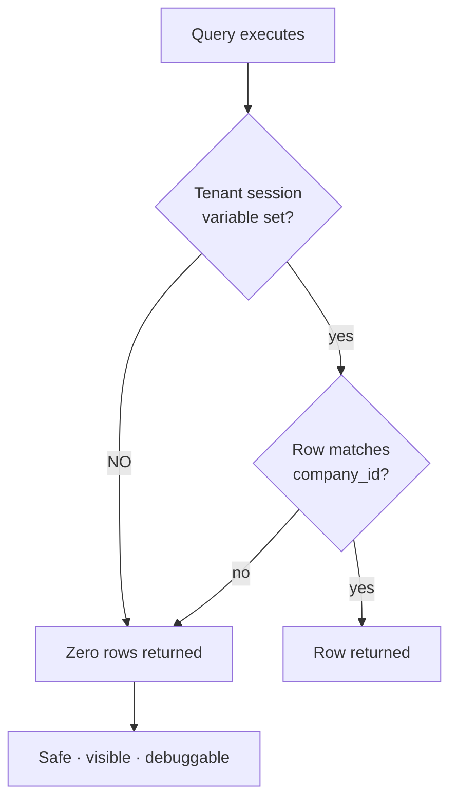
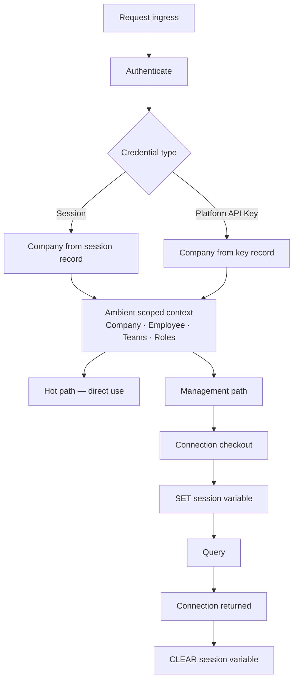

# Tenant Security

| Field | Value |
| --- | --- |
| Document | Tenant Security |
| Version | 1.1 — cross-Company path 13 added (Milestone 12.1) |
| Status | Draft — **depends on unratified ADR-0005 (decision D-1)** |
| Owner | Engineering & Security |
| Last updated | 2026-08-08 |
| Audience | Engineering, Security, Compliance |
| Phase | 5 — Security Architecture |

---

## 1. Purpose

Tenant isolation is the boundary whose failure is least recoverable. A cross-tenant
exposure in a platform holding customers' AI credentials and conversation history is a
breach of every affected customer simultaneously, in a product whose entire premise is
governance.

This document specifies how isolation is enforced, how the tenant context is resolved and
validated, and — most usefully — **every path where the boundary could fail**.

---

## 2. Scope

**In scope:** the isolation model, row-level security, tenant context resolution and
validation, cross-tenant protection across every component, and tenant audit.

**Out of scope:** authorization within a tenant ([03](03-authorization-architecture.md)),
credential encryption ([05](05-provider-credential-security.md)), schema design (Phase 6).

---

## 3. Architecture

### 3.1 The isolation model

**Single database. One schema per module. Every tenant-scoped relation carries a
`company_id`. Isolation is enforced by PostgreSQL row-level security**, with the current
Company set as a session variable at connection checkout.

Two layers, deliberately redundant:

| Layer | Mechanism | Catches |
| --- | --- | --- |
| Application | Global query filter on tenant-scoped entities | Ordinary queries; provides clear intent and good errors |
| **Database** | **Row-level security policy on every tenant-scoped relation** | **Everything the application misses** — raw SQL, forgotten filters, defects |

NFR-SEC-007 requires that an application-layer defect **cannot** cause cross-tenant
exposure. Only database enforcement satisfies that literally, which is why
[ADR-0005](../03-adr/ADR-0005-multi-tenant-strategy.md) accepts its cost.

### 3.2 The failure direction

**A missing tenant context returns nothing, never everything.** This single property is
what makes the design defensible: the failure mode is an empty result that someone notices,
not an unfiltered result that nobody does.

### 3.3 Tenant context resolution

| Rule | Statement |
| --- | --- |
| TC-1 | The Company is **derived server-side from the credential**, never from a request parameter, header, or body |
| TC-2 | Resolution happens **once**, at ingress, into an ambient scoped context |
| TC-3 | Resolution failure **rejects the request**; it never proceeds untenanted |
| TC-4 | The session variable is **set at connection checkout and cleared at connection return** |
| TC-5 | Background jobs establish context **explicitly from the job payload** before any data access |
| TC-6 | The elevated role is used only in named, enumerated, audited paths |

**TC-1 is the rule most likely to be violated by a well-meaning convenience feature.** A
"switch company" parameter, an admin impersonation header, or a tenant identifier in a
request body all reintroduce client-controlled tenancy. If cross-Company access is ever
needed, it must be a distinct, separately-authorized, audited operation — not a parameter
on an ordinary one.

### 3.4 Every path where the boundary could fail

This table is the operative content of this document.

| # | Path | Risk | Control |
| --- | --- | --- | --- |
| **1** | **Connection pooling** | A pooled connection returned with a stale tenant variable, reused by another Company's request | **TC-4 clear-on-return. Pooling mode is a security decision — DD-2.** Transaction-level pooling and session-level state are not compatible without care |
| **2** | **Hangfire jobs** | No inbound request to derive context from | TC-5 explicit establishment; missing context yields zero rows |
| **3** | **Analytics direct SQL** | Bypasses application query filters | Row-level security still applies — **this is precisely why it exists**. Direct SQL restricted to Analytics and reviewed |
| **4** | **The outbox relay** | Processes events across Companies; runs elevated | Each handler re-establishes its own Company context |
| **5** | **Platform administration** | Legitimately spans Companies | Elevated role, enumerated paths, every use audited |
| **6** | **SignalR group membership** | A client could request another Company's group | **Group names derived server-side only**, never from client input |
| **7** | **Redis cache and counter keys** | A key collision or unscoped key exposes another tenant's state | **Every key is Company-scoped by construction** |
| **8** | **Object storage keys** | Object path used as authorization | Company-scoped keys with unguessable components; **the application authorizes before issuing a signed URL** |
| **9** | **Frontend query cache** | Cached data served after a session change | Query keys include the Company identifier; cache cleared on session change |
| **10** | **Error messages and telemetry** | Another tenant's identifiers leaked in a message | Errors carry no cross-tenant identifiers; per-Company metrics do not expose others (NFR-OBS-010) |
| **11** | **Gateway hot-path cache** | A cached entry served to the wrong tenant | Cache keys include the Company; entries resolved from the credential, not from request input |
| **12** | **Data exports** | An export containing another Company's rows | Generated through the same tenant-scoped path; row-level security applies to the generating query |
| **13** | **Authentication itself** | The Company is not yet known — it is the *result* of the lookup, not an input to it | **The one unavoidable elevated read.** Confined to `ICredentialDirectory`, whose four lookups (email, refresh token, password-reset token, email-verification token) are the complete enumeration. Each returns the Company alongside the identity, and every path downstream is tenant-scoped from that point |

**Path 13 was missing from this table until Milestone 12.1**, and its absence is worth recording
rather than quietly fixing. Authentication is a cross-Company read by necessity: an Employee
presents an email address, and the tenant cannot be derived from the credential until the
credential has been found. TC-1 forbids taking the Company from request input, so the alternative —
a Company selector on the sign-in form — is the thing TC-1 exists to prevent.

This is the concrete instance of the "elevated role, enumerated paths" control (path 5, AZ-h). The
enumeration is not aspirational: it is one interface with four methods, and widening it is a change
a reviewer can see. **A fifth lookup added here is a security review, not a refactor.**

**Path 1 is the most dangerous and the least obvious.** It is not an application defect —
it is an interaction between a correct application and a correctly-configured pooler. It
must be prototyped and load-tested before schema design (DD-2), not assumed.

### 3.5 Component-by-component posture

| Component | Isolation mechanism |
| --- | --- |
| **PostgreSQL** | Row-level security + `company_id` on every tenant-scoped relation |
| **Redis** | Company-scoped keys for cache, counters, and streams |
| **AI Gateway** | Tenant from the Platform API Key; cache keys Company-scoped |
| **REST API** | Tenant from the credential; row-level security constrains results |
| **SignalR** | Groups derived from server-side context |
| **Hangfire** | Explicit context per job |
| **Object storage** | Company-scoped keys; application-authorized signed URLs |
| **Web frontend** | Company-scoped query keys; cache cleared on session change |
| **VS Code Extension** | Session-derived credential; no client-supplied tenancy |

### 3.6 Validation and testing

| Test | Assertion | Cadence |
| --- | --- | --- |
| **AT-4** | Every tenant-scoped entity carries the discriminator | Every build |
| **Policy coverage** | Every tenant-scoped table has a row-level security policy | Every build |
| **Isolation test** | Cross-tenant access attempts return zero rows, per relation | Every build (NFR-SEC-008) |
| **Unset-context test** | With no session variable, every tenant-scoped relation returns zero rows | Every build |
| **Pooling test** | Under concurrent multi-tenant load, no request observes another Company's context across ≥ 10⁶ checkouts | Before ratification, then per release |
| **Elevated-path enumeration** | Only enumerated paths request elevation | Every build |
| **Key-scoping test** | Redis and object storage keys are Company-scoped | Every build |

**The unset-context test is the one that verifies the failure direction.** It should be
written per relation, not sampled — a single unprotected table is a leak, and there is no
partial credit.

### 3.7 Tenant audit

| Event | Recorded | Requirement |
| --- | --- | --- |
| Company creation, settings change | Actor, change, outcome | FR-AUD-001 |
| Employee invitation, suspension, removal | Actor, target, outcome | FR-TEN-005/007/008 |
| Role assignment or change | Actor, target, before and after | FR-PERM-004 |
| Team creation, membership change | Actor, target | FR-TEN-009/011 |
| Ownership transfer | Both parties notified; audited | FR-TEN-012 |
| Data export | Actor, scope, destination | FR-AUD-001 |
| **Elevated-role use** | Path, actor, justification | AZ-h |
| **Any cross-tenant access attempt** | Full detail; **treated as a security event** | §3.6 |

**A cross-tenant access attempt is never routine.** Under correct operation it cannot
happen, so an occurrence is either an attack or a defect. Both warrant an alert, not a log
line.

---

## 4. Design decisions

| # | Decision | Rationale |
| --- | --- | --- |
| SD-002 | **Isolation enforced below the application layer** | NFR-SEC-007 literally |
| TS-a | **Failure direction is zero rows, never unfiltered** | The property that makes the design defensible |
| TS-b | **Tenant derived from the credential, never from request input** | Client-controlled tenancy is the classic multi-tenant failure |
| TS-c | **Session variable cleared on connection return** | Pooling is the highest-risk path |
| TS-d | **Every Redis and object storage key is Company-scoped** | Isolation is not only a database concern |
| TS-e | **SignalR groups derived server-side only** | A client naming its own group could subscribe cross-tenant |
| TS-f | **Elevated role restricted to enumerated, audited paths** | The documented hole must stay small and visible |
| TS-g | **Isolation verified by test on every build** | NFR-SEC-008; a boundary not tested is not a boundary |
| TS-h | **Cross-tenant access attempts alert as security events** | Under correct operation they cannot occur |

---

## 5. Trade-offs

| # | Gained | Given up |
| --- | --- | --- |
| T-1 | Isolation survives application defects | Query-planning cost; possible partition-pruning interaction (ADR-0005 R-2) |
| T-2 | One database to operate and self-host | Logical rather than physical isolation; noisy-neighbour effects remain |
| T-3 | Safe failure direction | An empty result may be correct, a missing context, or genuinely no data — harder to debug |
| T-4 | Elevated role enables platform administration | A documented bypass of the primary control |
| T-5 | Shared-database model scales to 500 Companies | Restoring one Company from backup is materially harder than database-per-tenant |
| T-6 | Company-scoped cache keys | Lower cache efficiency than a shared key space |

---

## 6. Security considerations

| Threat | Mitigation |
| --- | --- |
| **Forgotten `WHERE` clause** | Row-level security below every query |
| **Client-supplied tenant identifier** | TC-1 — derived server-side only |
| **Pooled connection carrying stale context** | Clear-on-return; pooling mode as a security decision; load-tested |
| **Elevated-role misuse** | Enumerated paths; audited; architecture test |
| **Cache key collision across tenants** | Company-scoped keys by construction |
| **Cross-tenant SignalR subscription** | Server-side group derivation |
| **Signed URL guessed or shared** | Unguessable keys; short lifetime; application authorization before issuance |
| **Browser cache served after session change** | Company-scoped query keys; cache cleared |
| **Tenant identifier enumeration** | Non-sequential identifiers; enumeration attempts rate-limited and alerted |
| **Backup or export containing multiple tenants** | Exports generated through tenant-scoped queries; backups encrypted and access-controlled |

---

## 7. Future improvements

- **Database-per-tenant for regulated customers.** Segment 3.2 may require physical
  isolation contractually. This is already the natural model for self-hosted single-tenant
  deployment and does not invalidate the shared model for multi-tenant hosting.
- **Per-Company encryption of data at rest** — extending the envelope scheme beyond
  credentials would mean a database compromise yields ciphertext per tenant rather than
  readable rows. Significant cost; worth evaluating for the highest-sensitivity fields.
- **Automated policy-coverage assertion at migration time**, so a new table cannot be
  created without a policy rather than being caught afterwards by a test.
- **Tenant-aware rate limiting on enumeration patterns** — repeated failed cross-tenant
  references are a reconnaissance signal.
- **A parent-organization construct** (FR-TEN-016) would change what "the tenant" means and
  requires this document to be revisited, not merely extended.
- **Any future analytical store must provide equivalent isolation.** This is a hard
  evaluation criterion: a store without enforceable isolation cannot hold tenant data
  regardless of its other merits.

---

## 8. Cross references

| Document | Relationship |
| --- | --- |
| [01 — Security Overview](01-security-overview.md) | SD-002; boundary 3 and 5 |
| [03 — Authorization](03-authorization-architecture.md) | Authorization within a tenant |
| [05 — Provider Credentials](05-provider-credential-security.md) | Per-Company key scoping |
| [12 — Audit & Compliance](12-audit-and-compliance.md) | Tenant audit events |
| [13 — Threat Model](13-threat-model.md) | Information disclosure and elevation |
| [15 — Security Checklist](15-security-checklist.md) | Database and backend items |
| [`../03-adr/ADR-0005-multi-tenant-strategy.md`](../03-adr/ADR-0005-multi-tenant-strategy.md) | **Unratified — decision D-1** |
| [`../02-architecture/authentication-architecture.md`](../02-architecture/authentication-architecture.md) | §3.5 context resolution |
| [`../02-architecture/deployment-architecture.md`](../02-architecture/deployment-architecture.md) | §3.6 pooling interaction — DD-2 |
| [`../01-product/non-functional-requirements.md`](../01-product/non-functional-requirements.md) | NFR-SEC-007/008 |
