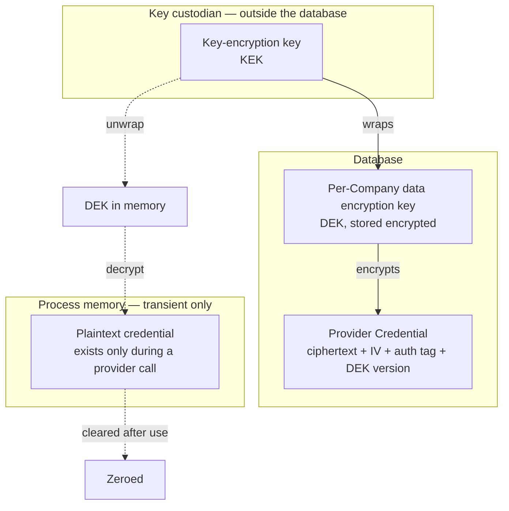
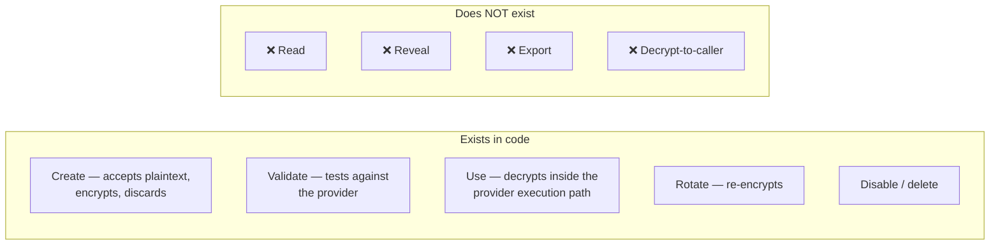
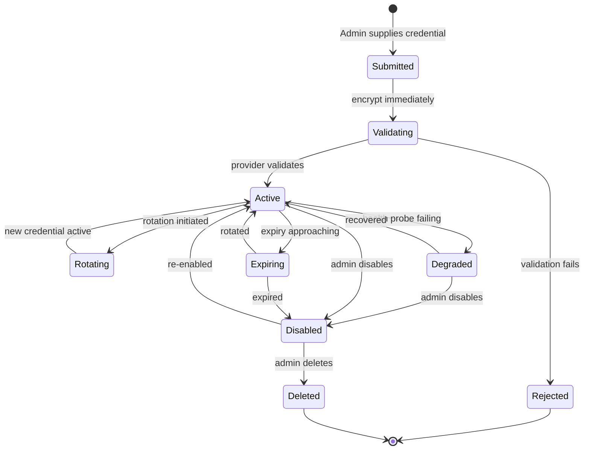
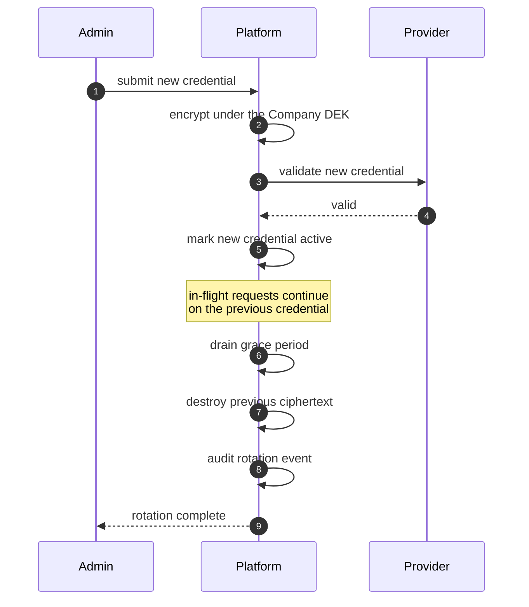

# Provider Credential Security

| Field | Value |
| --- | --- |
| Document | Provider Credential Security |
| Version | 1.0 |
| Status | Draft — **depends on unratified ADR-0008 (decision D-6)** |
| Owner | Engineering & Security |
| Last updated | 2026-07-30 |
| Audience | Engineering, Security, Compliance, Leadership |
| Phase | 5 — Security Architecture |

---

## 1. Purpose

**Provider Credentials are the platform's rank-1 asset.** Each one carries direct spend
authority on a customer's provider account and an unrestricted data egress channel. The
platform holds them for every customer simultaneously.

There is an additional weight here that no other asset carries: **the product exists to
solve credential sprawl**
([`../01-product/problem-statement.md`](../01-product/problem-statement.md) §3.1).
Reproducing that problem in our own system would not merely be a breach — it would
invalidate the product's premise.

**Provider Credentials are never stored in plaintext.**

---

## 2. Scope

**In scope:** envelope encryption, AES-256-GCM, data and key encryption keys, credential
lifecycle, rotation, expiry, validation, and access control.

**Out of scope:** platform credentials — a distinct concern
([02](02-authentication-architecture.md)); key custodian operations
([10](10-key-management.md)); general encryption ([09](09-encryption-strategy.md)).

**A distinction that must never blur:** a **Platform API Key** authenticates *to*
MaintOrbit AI. A **Provider Credential** authenticates *from* MaintOrbit AI to an AI
provider. Confusing them in design or documentation produces security defects, which is
why [`../01-product/glossary.md`](../01-product/glossary.md) §8 makes the distinction
normative.

---

## 3. Architecture

### 3.1 Envelope encryption

| Layer | Storage | Scope | Rotation |
| --- | --- | --- | --- |
| **KEK** | Custodian, **never in the database** | Platform-wide | Annual or on suspicion |
| **DEK** | Database, encrypted by the KEK | **Per Company** | Per Company, independently |
| **Ciphertext** | Database | Per credential | Re-encrypted on DEK rotation |

**Per-Company data keys bound the blast radius.** Compromise of one DEK exposes one
customer. Compromise of the KEK exposes all of them — which is why it lives outside the
database, behind independent access control and its own audit trail.

### 3.2 AES-256-GCM — SD-009

| Property | Decision | Rationale |
| --- | --- | --- |
| Algorithm | **AES-256-GCM** | Authenticated encryption — tampering is *detected* rather than decrypting to plausible garbage |
| Key length | 256-bit | |
| **IV / nonce** | **Unique per encryption operation**, never reused with the same key | **GCM nonce reuse is catastrophic** — it leaks the authentication key, not just one plaintext |
| Authentication tag | Full length, verified on every decryption | A failed verification is a **security event**, not a decode error |
| Additional authenticated data | Company identifier and DEK version bound into the AAD | Binds ciphertext to its tenant — a ciphertext moved between tenants fails to authenticate |
| Ciphertext envelope | IV, tag, DEK version stored alongside | Enables rotation without re-encrypting history |

**Two of these deserve emphasis because they are the ways GCM is most often got wrong.**

**Nonce uniqueness is not a best practice — it is the security property.** Reusing an IV
with the same key under GCM allows an attacker to recover the authentication subkey and
forge ciphertexts. Nonce generation must be provably unique per key, and this belongs in
the design review, not in implementation.

**Binding the Company identifier into the AAD is a second tenant boundary.** Even if an
attacker with database write access moved a ciphertext row from one Company to another,
decryption would fail — the ciphertext is cryptographically bound to its tenant.

### 3.3 No retrieval path — SD-003

**FR-PROV-004 is satisfied structurally, not by permission.**

There is no operation that returns a Provider Credential in plaintext to a caller — for any
Role, including Owner, and including platform operators. The decryption function is
reachable **only** from the provider execution path and yields a handle used for a call,
not a value returned outward.

**This is the difference between a permission that can be misconfigured and a capability
that does not exist.** A permission model can be changed by a mistake in a role definition.
An absent code path cannot.

### 3.4 Credential lifecycle

| Stage | Security property | Requirement |
| --- | --- | --- |
| **Submission** | Encrypted **before** any persistence; plaintext never written to disk, log, or trace | NFR-SEC-005 |
| **Validation** | Tested against the provider; a clear, actionable failure | FR-PROV-005 |
| **Active** | Health-monitored; observed availability and error rate recorded | FR-PROV-006/014 |
| **Rotation** | **No interruption to in-flight or subsequent requests** | FR-PROV-007 |
| **Expiry** | Optional; notification in advance | FR-API-003 pattern |
| **Disablement** | **Immediate** — all traffic halts | FR-PROV-008 |
| **Deletion** | Ciphertext destroyed; audit record retained | FR-PROV-016 |

**Every stage transition produces an audit event** (FR-PROV-016) recording actor, action,
target connection, and outcome — never the credential itself.

### 3.5 Rotation without interruption

FR-PROV-007 requires rotation with no interruption to in-flight or subsequent requests.

**Both credentials are briefly valid.** The old one is destroyed only after in-flight
requests using it have drained. Destroying it immediately would fail requests mid-flight —
turning a routine security operation into a customer-visible incident, which is exactly how
rotation ends up avoided.

**Rotation must be routine, not exceptional.** Organizations avoid rotation when it is
risky, and unrotated credentials are one of the problems this product exists to solve.

### 3.6 Decrypted material in memory

| Rule | Statement | Rationale |
| --- | --- | --- |
| CR-1 | Plaintext exists **only** during a provider call | Minimizes the exposure window |
| CR-2 | **Never persisted** — not to disk, not to a cache, not to a temp file | |
| CR-3 | **Never a plain `string` type** | A string can be interpolated into a log message; a purpose-built type cannot |
| CR-4 | Cleared after use where the runtime permits | Reduces memory-dump exposure |
| CR-5 | The **DEK** may be cached briefly per Company | Unwrapping per request would add custodian latency to the hot path |
| CR-6 | The DEK cache is a **security boundary** — bounded lifetime, never persisted | |

**CR-3 is the control that actually prevents NFR-SEC-005 violations.** Log scrubbing is a
second layer, applied after the fact and inevitably incomplete. A type that cannot be
formatted into a log message prevents the mistake at compile time.

**CR-5 is a deliberate trade-off.** Caching the unwrapped DEK avoids a custodian round trip
per request but keeps key material resident in memory for longer. The cache lifetime is a
security parameter requiring a recorded decision, not a performance default.

### 3.7 Access control

| Actor | Create | Rotate | Disable | Delete | **Read plaintext** |
| --- | --- | --- | --- | --- | --- |
| Owner | ✅ | ✅ | ✅ | ✅ | ❌ |
| Company Admin | ✅ | ✅ | ✅ | ✅ | ❌ |
| Billing Admin | ❌ | ❌ | ❌ | ❌ | ❌ |
| Team Lead | ❌ | ❌ | ❌ | ❌ | ❌ |
| Developer | ❌ | ❌ | ❌ | ❌ | ❌ |
| Member | ❌ | ❌ | ❌ | ❌ | ❌ |
| Auditor | ❌ | ❌ | ❌ | ❌ | ❌ |
| **Platform operator** | ❌ | ❌ | ❌ | ❌ | **❌** |

**The final column is uniformly ❌ and that is the point.** No role and no operator can
read a Provider Credential, because no code path produces one.

**Step-up authentication is recommended** for creation and rotation
([02](02-authentication-architecture.md) §3.6) — these are the operations where a hijacked
administrative session does the most damage.

---

## 4. Design decisions

| # | Decision | Rationale |
| --- | --- | --- |
| SD-003 | **No plaintext retrieval path exists in code** | A capability that does not exist cannot be misconfigured |
| SD-009 🆕 | **AES-256-GCM** with unique nonces and full tag verification | Authenticated encryption; tampering detected |
| SD-012 🆕 | **Two-tier versioned key hierarchy** | Rotation without re-encrypting history |
| PC-a 🆕 | **Company identifier and DEK version bound into the AAD** | Cryptographic tenant binding — a second isolation boundary |
| PC-b | **Per-Company DEK** | Bounds blast radius to one customer |
| PC-c | **KEK never in the database** | A database dump alone is insufficient |
| PC-d | **Credential material is never a plain string** | Prevents log leakage at compile time |
| PC-e | **Rotation drains before destroying the old credential** | Rotation must be routine, not risky |
| PC-f | **A failed authentication tag is a security event** | Indicates tampering or corruption, not a decode error |
| PC-g | **Every lifecycle transition is audited** | FR-PROV-016 |
| PC-h | **The portable key custodian is the CI default** | The only reliable guard for NFR-PORT-002 |

---

## 5. Trade-offs

| # | Gained | Given up |
| --- | --- | --- |
| T-1 | No retrieval path | **No credential export.** A customer who loses their own key must obtain a new one from the provider |
| T-2 | Per-Company DEKs | More keys to manage; rotation is per-Company work |
| T-3 | KEK outside the database | **Key loss means credential loss for every customer** — backup is existential |
| T-4 | AAD tenant binding | Ciphertext cannot be migrated between Companies even legitimately |
| T-5 | DEK cached briefly | Key material resident in memory longer |
| T-6 | Drain-then-destroy rotation | Both credentials valid during a short window |
| T-7 | Custodian abstraction | An extra indirection; two implementations to test |

**T-1 will be questioned by customers.** "Why can't I see the key I gave you?" The answer is
that the platform cannot show it to anyone — including an attacker who compromises an
administrator account. That is the feature.

---

## 6. Security considerations

| Threat | Mitigation |
| --- | --- |
| **KEK compromise** | Custodian outside the database with independent access control and audit; rotation capability; **dedicated threat model warranted** |
| **KEK loss** | Documented, **tested** backup and recovery. Untested backup is the single most dangerous gap in this design |
| **Database compromise** | Yields ciphertext only; the KEK is elsewhere |
| **DEK compromise** | Bounded to one Company; per-Company rotation |
| **Ciphertext tampering** | GCM authentication tag; failure raises a security event |
| **Ciphertext moved between tenants** | AAD binding causes authentication failure |
| **Nonce reuse** | Provably unique generation per key — a design-review item |
| **Credential in logs or traces** | Never a plain string (PC-d); scrubbing as a second layer; secret scanning in CI |
| **Memory disclosure** | Transient plaintext, cleared after use; bounded DEK cache lifetime |
| **Malicious administrator** | Cannot read credentials; all actions audited; step-up authentication |
| **Compromised administrator session** | Step-up authentication on create and rotate |
| **Supply-chain compromise of the crypto path** | Framework primitives only; no bespoke cryptography |

**Two gaps are explicitly not fully mitigated and must be recorded as such:**

1. **KEK compromise** exposes every customer. Reduced, not eliminated, by custody controls
   and rotation.
2. **KEK loss without recovery** renders every stored credential permanently undecryptable.
   **This is mitigated only by a tested backup procedure — and that procedure does not yet
   exist.** It is decision D-6 and is the highest-priority gap in this document.

---

## 7. Future improvements

- **Customer-managed encryption keys** (NFR-SEC-020, v2.0) — the customer holds the KEK.
  Strongest posture; removes our ability to assist in recovery, which must be documented
  before it is offered.
- **Hardware security module custody** — likely driven by a regulated-enterprise contract
  rather than our own assessment.
- **Automatic rotation reminders** — surfacing credential age would make rotation a routine
  hygiene prompt rather than an event.
- **Provider workload identity federation** — if providers move to short-lived tokens or
  federated identity, much of this design becomes unnecessary for those providers, and the
  abstraction should accommodate both models rather than assuming long-lived secrets.
- **Per-Company encryption extended beyond credentials** — applying the envelope scheme to
  other high-sensitivity fields would mean a database compromise yields per-tenant
  ciphertext rather than readable rows.
- **Anomaly detection on credential use** — a credential suddenly used from an unusual
  pattern is a compromise signal the platform is uniquely positioned to see.

---

## 8. Cross references

| Document | Relationship |
| --- | --- |
| [01 — Security Overview](01-security-overview.md) | Rank-1 asset; SD-003, SD-009, SD-012 |
| [09 — Encryption Strategy](09-encryption-strategy.md) | Algorithm selection across the platform |
| [10 — Key Management](10-key-management.md) | KEK custody, rotation, recovery |
| [06 — Secret Management](06-secret-management.md) | Custodian implementations |
| [04 — Tenant Security](04-tenant-security.md) | Per-Company scoping; AAD binding |
| [12 — Audit & Compliance](12-audit-and-compliance.md) | Credential access audit |
| [13 — Threat Model](13-threat-model.md) | Information disclosure analysis |
| [`../03-adr/ADR-0008-credential-encryption.md`](../03-adr/ADR-0008-credential-encryption.md) | **Unratified — decision D-6** |
| [`../03-adr/ADR-0009-ai-provider-abstraction.md`](../03-adr/ADR-0009-ai-provider-abstraction.md) | Where credentials are used |
| [`../01-product/problem-statement.md`](../01-product/problem-statement.md) | §3.1 — the problem this must not reproduce |
| [`../01-product/product-requirements.md`](../01-product/product-requirements.md) | FR-PROV-004/005/007/008/016 |
