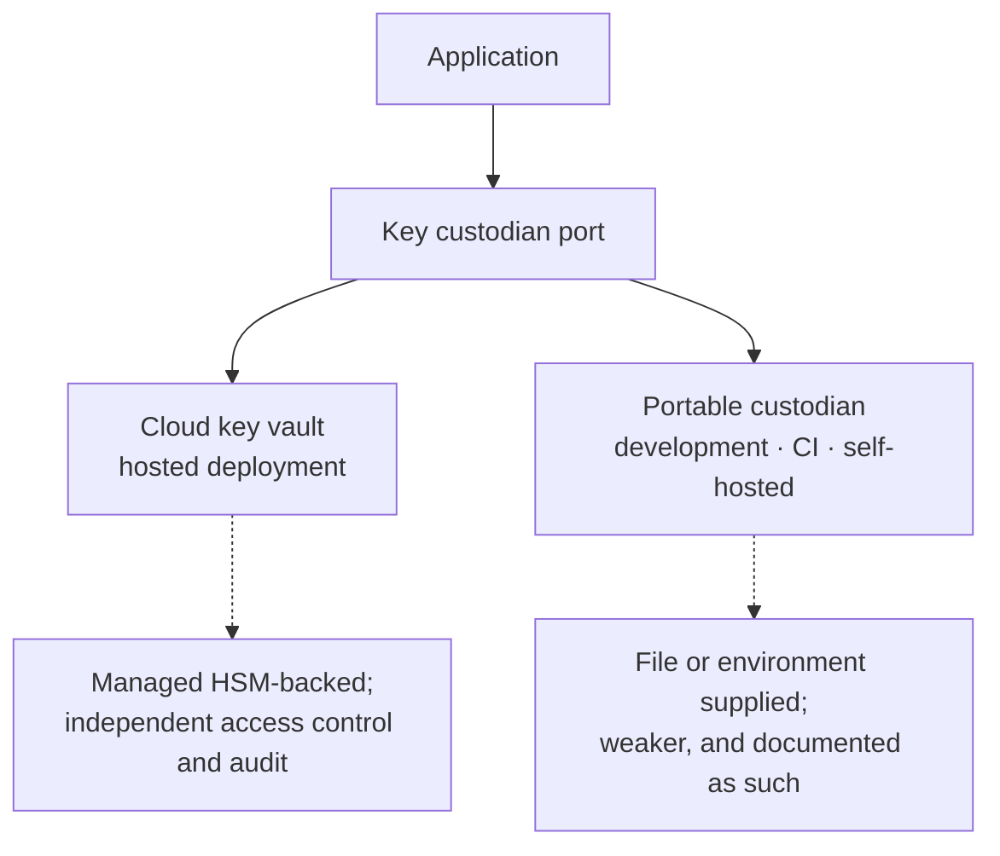
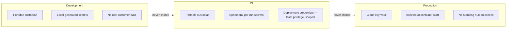

# Secret Management

| Field | Value |
| --- | --- |
| Document | Secret Management |
| Version | 1.0 |
| Status | Draft — custodian selection outstanding (D-6 / TD-2) |
| Owner | Engineering, Security & Operations |
| Last updated | 2026-07-30 |
| Audience | Engineering, Security, Operations |
| Phase | 5 — Security Architecture |

---

## 1. Purpose

This document specifies how the platform's **own** secrets are stored, delivered,
rotated, backed up, and recovered — across development, CI, and production, and in
customer-hosted deployments.

**A distinction that governs everything here.** Provider Credentials belong to customers,
live encrypted in the database, and are covered by
[05](05-provider-credential-security.md). This document concerns the secrets the platform
needs to operate: the key-encryption key, database and cache credentials, signing keys,
and integration credentials. **Provider Credentials never appear in platform
configuration.**

---

## 2. Scope

**In scope:** the key custodian, secret classes, environment separation, delivery
mechanisms, rotation, backup, and disaster recovery for platform secrets.

**Out of scope:** Provider Credentials ([05](05-provider-credential-security.md)); key
hierarchy mechanics ([10](10-key-management.md)); algorithm selection
([09](09-encryption-strategy.md)).

---

## 3. Architecture

### 3.1 Secret classes

| Class | Examples | Consequence of compromise | Rotation |
| --- | --- | --- | --- |
| **Critical — key material** | Key-encryption key | **Every customer's Provider Credentials** | Annual or on suspicion |
| **Critical — signing** | JWT signing key | Token forgery; full impersonation | Quarterly |
| **High — data tier** | Database, Redis credentials | Full data access, subject to encryption at rest | Semi-annual |
| **High — integration** | Payment processor, email, OAuth2 client secrets | Financial or communication abuse | Semi-annual |
| **Moderate — operational** | Deployment credentials, registry access | Supply-chain compromise | Quarterly |
| **Low — development** | Local fixtures, seed data | None — must contain no real data | On change |

**JWT signing keys deserve more attention than they usually receive.** A compromised
signing key allows an attacker to mint valid access tokens for any Employee in any
Company — a complete authentication bypass that the tombstone mechanism does not catch,
because a forged token was never issued and therefore never revoked. Signing key rotation
should be quarterly and supported by key identifiers so that rotation does not invalidate
every live token at once.

### 3.2 The key custodian — pluggable by requirement

**NFR-PORT-002 forbids a runtime dependency that cannot run in a customer environment.**
A cloud key service cannot. The resolution is the same pattern used for object storage: a
port with two implementations.

| Implementation | Used in | Posture |
| --- | --- | --- |
| Cloud key vault | Hosted production | Strong — HSM-backed, independent audit, access policies |
| **Portable custodian** | **Development, CI, self-hosted** | Weaker; must be documented honestly, not presented as equivalent |

**The portable implementation is the default in development and CI** (PC-h). This is not a
preference. If only the cloud path is ever exercised, the portable path will be broken when
v2.1 self-hosted deployment needs it — discovered at the worst possible moment, with a
customer waiting.

**The two implementations have genuinely different security postures**, and self-hosted
customers must be told which they are getting. Claiming parity would be the kind of
overstatement that [`../01-product/mission.md`](../01-product/mission.md) §6 forbids.

### 3.3 Environment separation

| Rule | Statement |
| --- | --- |
| SM-1 | **No secret is ever shared across environments.** A development secret is never valid in production |
| SM-2 | **Development secrets are generated locally**, never distributed |
| SM-3 | **Production secrets are never accessible from a developer machine** |
| SM-4 | **CI secrets are scoped to what CI does** — build and deploy, nothing more |
| SM-5 | **No real customer data in non-production environments** |

**SM-5 is a data protection rule as much as a secret management one.** Copying a production
database into a development environment moves customer conversation content, encrypted
credentials, and audit history into a weaker security context — and it is the single most
common way well-secured systems leak.

### 3.4 Delivery

| Secret | Delivery | Never |
| --- | --- | --- |
| Key-encryption key | **Custodian only** | **Never an environment variable in production** |
| JWT signing key | Custodian | In source, in images |
| Database and Redis credentials | Environment, injected at container start | In source, in images |
| Integration credentials | Environment, injected at container start | In source, in images |
| TLS certificates | Mounted; automated renewal | In images |
| **Provider Credentials** | **Never platform configuration** | Anywhere in configuration |

**The KEK is deliberately excluded from environment-variable delivery.** Environment
variables are visible in process listings, leak into crash dumps and diagnostic output, and
are frequently captured by observability agents. For the one secret that unlocks every
customer's credentials, that exposure surface is not acceptable.

**`.env.example` documents structure, never values.** It is committed; `.env` is not.
Secret scanning is build-gating (NFR-SEC-012) — for a platform holding this class of data,
a committed secret is an incident rather than an inconvenience.

### 3.5 Rotation

| Secret | Cadence | Interruption | Mechanism |
| --- | --- | --- | --- |
| Key-encryption key | Annual, or on suspicion | **None** | Re-wrap DEKs; ciphertext untouched |
| Per-Company DEK | On demand, per Company | **None** | Re-encrypt that Company's credentials |
| JWT signing key | Quarterly | **None** | Overlapping validity via key identifiers |
| Database credentials | Semi-annual | Brief, planned | Dual credentials during transition |
| Integration credentials | Semi-annual | Provider-dependent | Overlap where supported |
| Deployment credentials | Quarterly | None | |
| TLS certificates | Automated before expiry | None | |

**Rotation must be routine and boring.** A rotation procedure that risks an outage is a
procedure that gets deferred, and deferred rotation is how a compromised credential stays
valid for a year. NFR-SEC-019 requires KEK rotation without customer-visible interruption
for exactly this reason.

**Overlapping validity is what makes zero-interruption rotation possible.** For signing
keys this means tokens issued under the previous key remain valid until natural expiry,
with the key identifier selecting the verification key — so rotation does not log everyone
out.

### 3.6 Backup and recovery

**This is the least developed area of the security architecture and the most consequential
if wrong.**

| Secret | Backup | Recovery objective | Status |
| --- | --- | --- | --- |
| **Key-encryption key** | **Required — existential** | Must be recoverable | ⚠️ **Procedure does not yet exist** |
| Per-Company DEKs | With the database backup | With the database | Covered |
| JWT signing key | Backed up; loss is recoverable by re-issue | Sessions invalidated; users re-authenticate | Acceptable |
| Database credentials | Recreatable | Immediate | Acceptable |
| Integration credentials | Recreatable from the provider | Hours | Acceptable |
| TLS certificates | Reissuable | Hours | Acceptable |

**The KEK is the only secret whose loss is unrecoverable.** If it is lost and not restorable,
**every stored Provider Credential becomes permanently undecryptable**, and every customer
must obtain and re-enter new credentials from every provider. That is not a degraded
service — it is a platform-wide reset of the product's core function.

| Requirement | Statement |
| --- | --- |
| KB-1 | The KEK is backed up to a location **independent of the custodian and the database** |
| KB-2 | The backup is **encrypted** and access-controlled separately |
| KB-3 | **The restore procedure is documented and tested** — untested backup is not backup |
| KB-4 | Restoration testing is part of the **NFR-DR-006 quarterly exercise** |
| KB-5 | **Key escrow** — recovery must not depend on a single individual |
| KB-6 | Every access to the backup is audited |

**KB-3 and KB-5 are the two most likely to be skipped.** An untested backup is an
assumption, and a recovery procedure that only one person can execute is a single point of
failure in the most consequential process the platform has.

**Key escrow requires an organizational decision, not only a technical one:** who can
authorize recovery, how many people must participate, and how that is verified. Split
custody — where no single individual can recover the key alone — is the appropriate model
for an asset of this rank, and it is a leadership decision.

---

## 4. Design decisions

| # | Decision | Rationale |
| --- | --- | --- |
| SM-a | **Key custodian is a port with two implementations** | NFR-PORT-002; the pattern that makes v2.1 packaging rather than re-architecture |
| SM-b | **The portable custodian is the CI and development default** | The only reliable guard against the portable path rotting |
| SM-c | **The KEK is never an environment variable in production** | Environment variables leak into dumps, listings, and agents |
| SM-d | **No secret crosses an environment boundary** | Development compromise must not reach production |
| SM-e | **No real customer data in non-production environments** | Moves protected data into a weaker context |
| SM-f | **Rotation is zero-interruption by design** | Risky rotation is deferred rotation |
| SM-g | **Overlapping validity for signing keys** | Rotation must not invalidate every live session |
| SM-h 🆕 | **Key escrow with split custody** | Recovery must not depend on one individual |
| SM-i | **Secret scanning is build-gating** | NFR-SEC-012 |
| SM-j | **The two custodian implementations have different postures, stated honestly** | Mission §6 |

---

## 5. Trade-offs

| # | Gained | Given up |
| --- | --- | --- |
| T-1 | Pluggable custodian preserves portability | Two implementations to test; lowest-common-denominator feature set |
| T-2 | Portable custodian as default keeps v2.1 viable | Development runs a weaker implementation than production |
| T-3 | KEK excluded from environment delivery | More complex bootstrap; the custodian must be reachable at startup |
| T-4 | Strict environment separation | More secrets to manage; no convenient shared test credentials |
| T-5 | Overlapping-validity rotation | Two keys valid simultaneously during transition |
| T-6 | Split-custody escrow | Recovery requires coordinating several people — slower under pressure |
| T-7 | No production data in development | Realistic testing requires synthetic data generation |

---

## 6. Security considerations

| Threat | Mitigation |
| --- | --- |
| **KEK compromise** | Custodian with independent access control and audit; rotation; dedicated threat model |
| **KEK loss** | KB-1 … KB-6. **Currently the largest unmitigated gap** |
| **JWT signing key compromise** | Quarterly rotation; key identifiers; **note that forged tokens bypass tombstone revocation** |
| Secret committed to source | Build-gating scanning; `.env` ignored; `.env.example` values-free |
| Secret in an image | Injected at container start, never baked |
| Secret in logs or diagnostics | Never a plain string type; scrubbing as a second layer |
| Development secret valid in production | SM-1 environment separation |
| Production data in a development environment | SM-5; enforced by process and reviewed |
| CI credential compromise | Least privilege; scoped; rotated; SHA-pinned third-party actions |
| Custodian unavailable at startup | Fail closed — the platform does not start rather than starting without key access |
| Insider access to the KEK backup | Split custody; audited access |

---

## 7. Future improvements

- **Automated rotation** for all classes, so cadence does not depend on a calendar reminder.
- **Secret usage telemetry** — a secret that has not been used in months is either
  unnecessary or its use is unmonitored; both are worth knowing.
- **Hardware security module custody** for the KEK, likely driven by a regulated-enterprise
  requirement.
- **Customer-managed keys** (NFR-SEC-020, v2.0) — the customer holds the KEK and the escrow
  problem becomes theirs, which must be documented before it is offered.
- **Short-lived database credentials** issued dynamically rather than long-lived static
  ones.
- **Self-hosted secret management guidance** — v2.1 customers must run the portable
  custodian correctly, and that requires documentation we have not written.

---

## 8. Cross references

| Document | Relationship |
| --- | --- |
| [01 — Security Overview](01-security-overview.md) | Asset ranking; rank 2 is the KEK |
| [05 — Provider Credentials](05-provider-credential-security.md) | What the KEK ultimately protects |
| [09 — Encryption Strategy](09-encryption-strategy.md) | Algorithms |
| [10 — Key Management](10-key-management.md) | Hierarchy, versioning, rotation mechanics |
| [12 — Audit & Compliance](12-audit-and-compliance.md) | Secret access audit |
| [13 — Threat Model](13-threat-model.md) | Information disclosure |
| [15 — Security Checklist](15-security-checklist.md) | Infrastructure and operations items |
| [`../03-adr/ADR-0008-credential-encryption.md`](../03-adr/ADR-0008-credential-encryption.md) | Custodian decision — D-6 |
| [`../04-technology/infrastructure-technologies.md`](../04-technology/infrastructure-technologies.md) | Custodian implementations |
| [`../01-product/non-functional-requirements.md`](../01-product/non-functional-requirements.md) | NFR-SEC-003/012/019, NFR-DR-005/006 |
| `../../.env.example` | Structure documentation, values-free |
