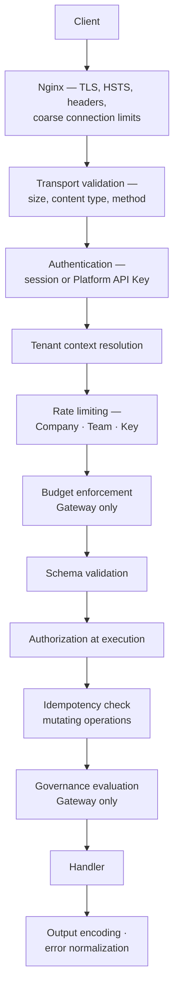
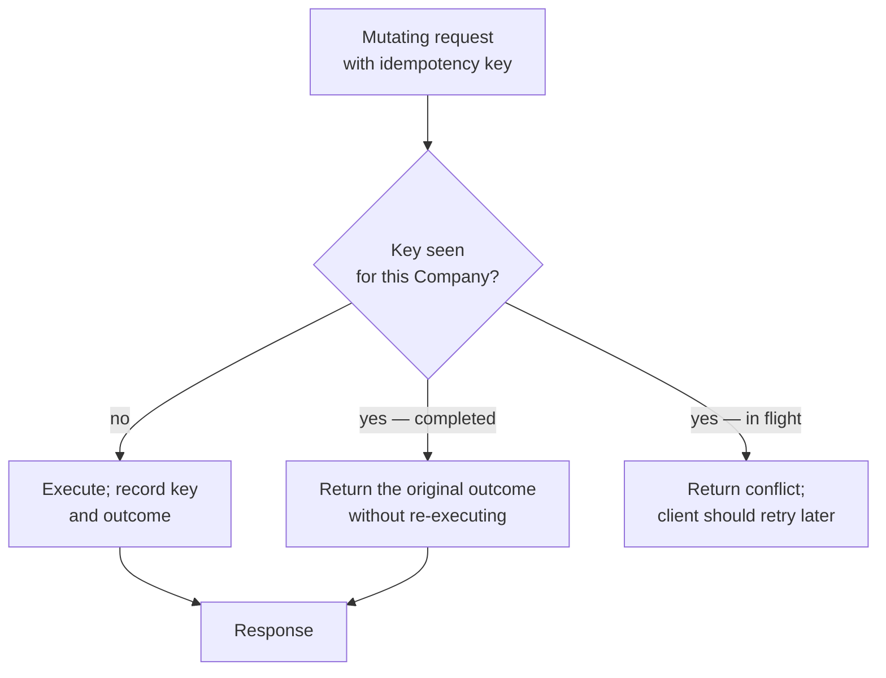

# API Security

| Field | Value |
| --- | --- |
| Document | API Security |
| Version | 1.0 |
| Status | Draft — SD-015 (idempotency) requires ratification |
| Owner | Engineering & Security |
| Last updated | 2026-07-30 |
| Audience | Engineering, Security |
| Phase | 5 — Security Architecture |

---

## 1. Purpose

This document specifies the security controls applied at the API surface: transport,
headers, rate limiting, input handling, output encoding, replay protection, idempotency,
CORS, CSRF, file upload, and specification security.

The platform exposes three externally-consumed surfaces with different threat profiles:
the **Gateway** (inference traffic, machine-authenticated, in customers' production paths),
the **management API** (session or key authenticated), and **SignalR** (long-lived,
session-authenticated).

---

## 2. Scope

**In scope:** the controls above, applied across Gateway, management API, SignalR, web
frontend, and Extension traffic.

**Out of scope:** authentication ([02](02-authentication-architecture.md)), authorization
([03](03-authorization-architecture.md)), tenant isolation
([04](04-tenant-security.md)), API design (Phase 6 `docs/04-api/`).

---

## 3. Architecture

### 3.1 Control layers

**Layers 5, 6, 8, and 10 fail closed** (SD-004). A rate limiter, budget check,
authorization gate, or policy evaluator that cannot reach its dependency **rejects** the
request. Layers concerned with metering and telemetry fail open.

### 3.2 Transport

| Control | Decision | Requirement |
| --- | --- | --- |
| **TLS** | Current protocol versions only; obsolete versions disabled | NFR-SEC-001 |
| Cipher suites | Forward-secret suites only; weak suites disabled | NFR-SEC-001 |
| **HSTS** | Enabled with a long max-age, `includeSubDomains`; preload once stable | |
| Redirect | HTTP redirects to HTTPS; no functional endpoint served over HTTP | |
| Certificates | Automated renewal well before expiry; expiry alerting | |
| Internal traffic | TLS between application and data tiers | NFR-SEC-001 |

**HSTS preload is deliberately staged.** Preload is difficult to reverse, so it is enabled
only once the domain strategy is stable — committing early to a domain that later needs to
serve something over HTTP is an avoidable trap.

### 3.3 Security headers

| Header | Setting | Prevents |
| --- | --- | --- |
| `Strict-Transport-Security` | Long max-age, subdomains | Downgrade |
| **`Content-Security-Policy`** | **Strict; no `unsafe-inline`, no `unsafe-eval`** | XSS — the primary control |
| `X-Content-Type-Options` | `nosniff` | MIME confusion |
| `X-Frame-Options` / CSP `frame-ancestors` | Deny | Clickjacking |
| `Referrer-Policy` | Strict origin when cross-origin | Referrer leakage |
| `Permissions-Policy` | Deny unused features | Capability abuse |
| `Cache-Control` | `no-store` on authenticated responses | Cached sensitive data |

**CSP is the highest-value header here and the hardest to apply.** AI Chat renders model
completions — untrusted content — into the DOM. Without a strict policy, a prompt-injected
completion containing markup is an XSS vector. A nonce-based policy with no inline
execution is the target, and it must be built in rather than retrofitted, because
retrofitting CSP onto a finished application is notoriously painful.

### 3.4 Rate limiting

Three independent scopes, all enforced in Redis with atomic counters:

| Scope | Purpose | Requirement |
| --- | --- | --- |
| **Per Company** | Fairness; prevents one tenant consuming shared capacity | NFR-SCAL-010 |
| **Per Team** | Internal fairness | FR-GW-012 |
| **Per Platform API Key** | Bounds a single compromised key | FR-GW-012 |
| Per identity on authentication endpoints | Credential stuffing and brute force | NFR-SEC-016 |
| Coarse per connection at Nginx | Volumetric protection | |

**Rejection carries retry guidance** (FR-GW-012) rather than a bare status. A rate limit
that does not tell a client when to retry produces tight retry loops that make the
condition worse.

**Authentication endpoints are limited more aggressively than functional ones**, and
account lockout with notification (FR-AUTH-011) applies on top. The trade-off — lockout is
itself a denial-of-service vector against a known account — is mitigated by notifying the
account holder and by limiting per source as well as per account.

### 3.5 Input validation and sanitization

| Rule | Statement |
| --- | --- |
| IN-1 | **All input crossing a trust boundary is validated against an explicit schema** (NFR-SEC-009) |
| IN-2 | Validation is **allowlist**, never denylist |
| IN-3 | Validation runs **before** the transaction opens (pipeline position 4) |
| IN-4 | Request size limits enforced at the edge and in the application |
| IN-5 | Content type validated, not inferred |
| IN-6 | **Client-side validation is never the enforcement point** — the server always revalidates |
| IN-7 | Parameterized queries only; **no string-concatenated SQL, including in Analytics** |
| IN-8 | Deserialization is type-constrained; no polymorphic deserialization of untrusted input |

**IN-7 has a specific relevance here.** Analytics uses direct SQL
([ADR-0023](../03-adr/ADR-0023-persistence-ef-core.md) BD-009), which is the one place in
the codebase where injection is structurally possible. Parameterization there is not a
convention — it is the control, and it is a review gate.

**Prompt content is a special case.** It is arbitrary text by definition and cannot be
validated for "correctness." It is length-limited, evaluated by governance policies
(FR-GOV-005), and — critically — **never interpolated into a query, a command, or a log
message**. It is data in transit to a provider, not input to our systems.

### 3.6 Output encoding

| Context | Control |
| --- | --- |
| HTML rendering | Framework contextual escaping |
| **Model completions** | **Sanitized before rendering** — the primary XSS vector |
| JSON responses | Structured serialization; no string concatenation |
| Error messages | **No credentials, no content, no cross-tenant identifiers** |
| Logs | Structured; never credentials, tokens, or prompt content (NFR-OBS-009) |
| Exported files | Content-type set correctly; formula-injection neutralized in tabular exports |

**Formula injection in CSV exports is worth explicit mention.** Usage and cost exports
(FR-USG-008) contain customer-supplied values such as Team names and attribution tags. A
value beginning with an equals sign becomes a live formula when opened in a spreadsheet —
an injection that reaches the recipient's machine, not ours.

### 3.7 Replay protection and idempotency — SD-015

**Not previously specified, and material here because Gateway requests cost money.**

| Rule | Statement |
| --- | --- |
| ID-1 | Mutating operations **accept** an idempotency key; it is required where duplication has financial or security consequence |
| ID-2 | Keys are **scoped to the Company** — never global |
| ID-3 | The recorded outcome is returned on replay, without re-execution |
| ID-4 | Keys expire after a bounded retention window |
| ID-5 | A concurrent in-flight request with the same key returns a conflict rather than executing twice |

**Why this matters more here than in a typical API.** A client retrying a Gateway request
after a timeout may have received the response — and every duplicate is real provider spend
charged to the customer. Without idempotency, a client-side retry storm during a network
incident produces a bill the customer did not authorize, which directly undermines the cost
control the platform exists to provide.

**Replay protection more broadly:** OAuth2 state and nonce are single-use;
TOTP codes are rejected once used within their window; webhook signatures include a
timestamp and are rejected outside a tolerance window.

### 3.8 CORS and CSRF

| Control | Decision |
| --- | --- |
| **CORS — management API** | Explicit origin allowlist; **never a wildcard with credentials** |
| **CORS — Gateway** | Server-to-server; **browser origins are not expected**. Permissive CORS here would encourage a dangerous pattern |
| Preflight | Correctly handled; allowed methods and headers explicit |
| **CSRF** | Cookie-carried session credentials require anti-CSRF protection; `SameSite` as defence in depth, not the sole control |
| Bearer-token requests | Not CSRF-susceptible; a token is not sent automatically |

**A specific warning about Gateway CORS.** Permitting browser origins on the Gateway would
invite customers to call it directly from client-side JavaScript — which means embedding a
Platform API Key in a browser, where it is readable by anyone. The Gateway is
server-to-server by design, and the CORS policy should reinforce that rather than quietly
permit the unsafe pattern.

### 3.9 File upload security

Applies to chat attachments (FR-CHAT-009, v1.1).

| Control | Decision |
| --- | --- |
| Type restriction | Allowlist by **verified content**, not by extension or declared type |
| Size limits | Enforced at the edge and in the application |
| Storage | Object storage, **never the application filesystem** |
| Naming | Server-generated; the client-supplied name is metadata only |
| Serving | Signed URLs with short lifetime; **application authorizes before issuing** |
| Content disposition | Attachment, never inline, for untrusted types |
| Scanning | Malware scanning before the file is made available |
| Tenant scoping | Company-scoped keys; path is never the authorization |

**Attachments are customer content subject to Content Retention policy** (NFR-PRIV-001),
and the retention and deletion semantics for them are **not yet designed**
([ADR-0017](../03-adr/ADR-0017-object-storage.md) §9). That gap should be closed before
v1.1, not during it.

### 3.10 Surface-specific posture

| Surface | Authentication | Distinct concerns |
| --- | --- | --- |
| **Gateway** | Platform API Key | Idempotency; budget fail-closed; no browser CORS; retry-guidance on limits |
| **Management API** | Session or key | CSRF where cookie-borne; strict CORS allowlist |
| **SignalR** | Session | **Group names derived server-side only**; every hub method authorized (AT-11); connection limits per Company |
| **Web frontend** | Session | Strict CSP; access token in memory; refresh token `HttpOnly` |
| **Extension** | Session-derived | Context boundary is client-side privacy hygiene; **governance is enforced server-side** |

### 3.11 Specification security

| Rule | Statement |
| --- | --- |
| SP-1 | The specification is kept **in sync with the implementation** (FR-API-012) — a stale specification misleads integrators about security behaviour |
| SP-2 | Authentication and scope requirements are documented per operation |
| SP-3 | The specification **exposes no internal detail** — no internal hostnames, error internals, or undocumented endpoints |
| SP-4 | Interactive documentation tooling in production is authenticated or disabled |
| SP-5 | Error responses are documented so integrators handle them rather than retrying blindly |

---

## 4. Design decisions

| # | Decision | Rationale |
| --- | --- | --- |
| SD-015 🆕 | **Idempotency keys on mutating operations** | Duplicate Gateway requests are real, unauthorized customer spend |
| API-a | **Strict CSP with no inline execution** | Model completions are untrusted content rendered into the DOM |
| API-b | **No browser CORS on the Gateway** | Would invite API keys in client-side code |
| API-c | **Rate limits carry retry guidance** | Bare rejections produce tight retry loops |
| API-d | **Allowlist validation, before the transaction** | Invalid input never opens a transaction |
| API-e | **Parameterized queries including in Analytics** | The one place injection is structurally possible |
| API-f | **Prompt content is never interpolated anywhere** | It is data in transit, not input to our systems |
| API-g | **Formula injection neutralized in tabular exports** | The injection reaches the recipient's machine |
| API-h | **Signed URLs are authorized before issuance; path is never authorization** | Object stores have no knowledge of row-level security |
| API-i | **HSTS preload staged until the domain strategy is stable** | Difficult to reverse |
| API-j | **Client-side validation is never the enforcement point** | Server always revalidates |

---

## 5. Trade-offs

| # | Gained | Given up |
| --- | --- | --- |
| T-1 | Strict CSP | Constrains frontend patterns; must be designed in, not retrofitted |
| T-2 | Idempotency | Storage and lookup per mutating request; a client contract to document |
| T-3 | Aggressive authentication rate limiting | Lockout is itself a denial-of-service vector against a known account |
| T-4 | Fail-closed rate and budget limits | Redis unavailability rejects requests |
| T-5 | No browser CORS on the Gateway | Customers wanting browser-side calls must proxy — correct, but requires explanation |
| T-6 | Sanitizing model output | Some legitimate formatting may be stripped |
| T-7 | Signed URLs with short lifetime | Clients must handle expiry and re-request |

---

## 6. Security considerations

| Threat | Mitigation |
| --- | --- |
| **XSS via model completion** | Sanitization plus strict CSP — **the most direct injection risk in the product** |
| SQL injection | Parameterized queries; Analytics review gate |
| Prompt injection reaching our systems | Prompt content never interpolated into queries, commands, or logs |
| CSRF | Anti-CSRF tokens; `SameSite` as defence in depth |
| Clickjacking | Frame denial |
| **Replay causing duplicate spend** | Idempotency keys |
| Credential stuffing | Breach-corpus checking; rate limiting; lockout with notification |
| Volumetric denial of service | Edge connection limits; per-Company limits; explicit shedding |
| **API key in client-side code** | Gateway CORS policy discourages it; documentation states it plainly |
| Signed URL leakage | Short lifetime; single-object scope; unguessable keys |
| Malicious upload | Content-verified allowlist; scanning; attachment disposition; object storage isolation |
| Formula injection in exports | Neutralized on export |
| Specification disclosure | No internal detail; production tooling authenticated or disabled |

---

## 7. Future improvements

- **Response-side governance** — current evaluation covers egress. Evaluating completions
  under streaming is genuinely different: content arrives incrementally and cannot be
  retracted once sent.
- **Mutual TLS for high-assurance customers**, as a stronger alternative to bearer keys.
- **Request signing** for the Gateway, binding a request to a key without transmitting it.
- **Attachment retention and deletion semantics** (v1.1) — currently undesigned.
- **Anomaly-based rate limiting** — adapting to observed patterns rather than fixed
  thresholds.
- **CSP reporting** before enforcement, to find violations without breaking the console.
- **Documented and tested denial-of-service response**, since load shedding exists but is
  rarely exercised until it is needed.

---

## 8. Cross references

| Document | Relationship |
| --- | --- |
| [01 — Security Overview](01-security-overview.md) | SD-004, SD-015 |
| [02 — Authentication](02-authentication-architecture.md) | Credential handling at the API |
| [03 — Authorization](03-authorization-architecture.md) | Layer 8 enforcement |
| [04 — Tenant Security](04-tenant-security.md) | SignalR groups; signed URLs |
| [08 — Data Protection](08-data-protection.md) | Export handling |
| [13 — Threat Model](13-threat-model.md) | Tampering and denial of service |
| [15 — Security Checklist](15-security-checklist.md) | Backend, frontend, gateway items |
| [`../03-adr/ADR-0016-rest-api.md`](../03-adr/ADR-0016-rest-api.md) | API design decisions |
| [`../03-adr/ADR-0021-fail-open-fail-closed.md`](../03-adr/ADR-0021-fail-open-fail-closed.md) | Layer failure classification |
| [`../01-product/non-functional-requirements.md`](../01-product/non-functional-requirements.md) | NFR-SEC-001/009/010/016/018 |
