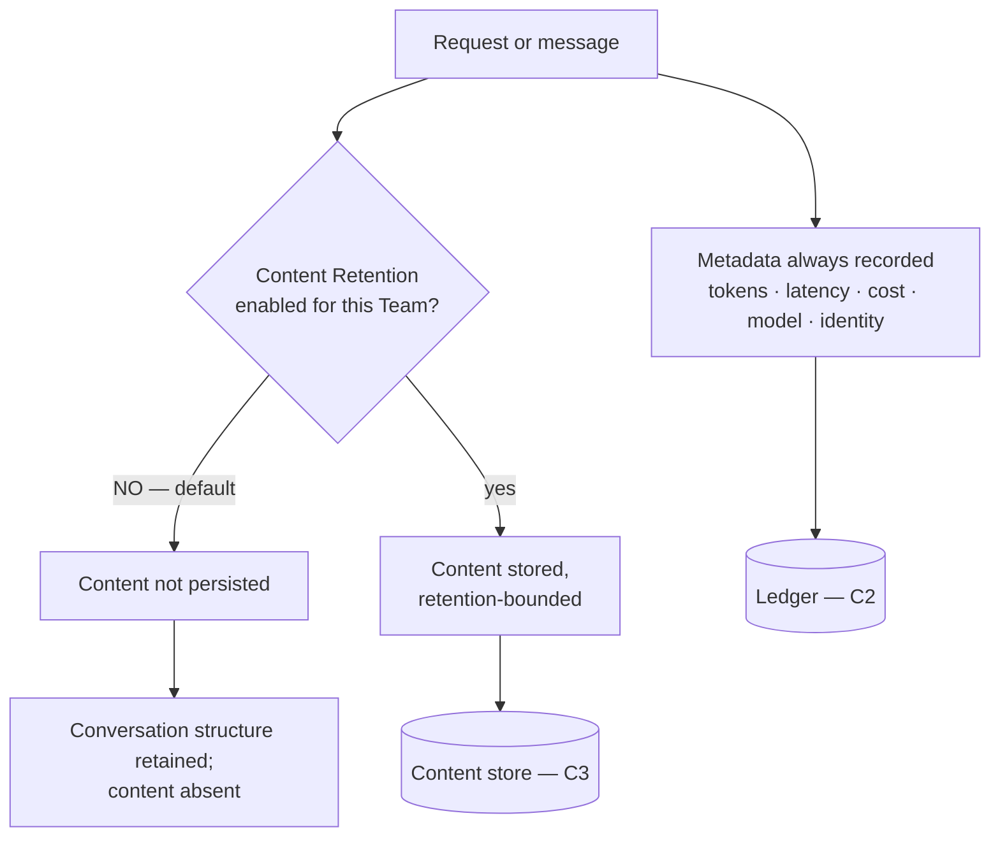
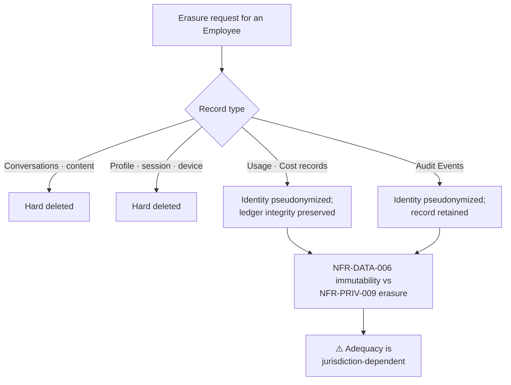

# Data Protection

| Field | Value |
| --- | --- |
| Document | Data Protection |
| Version | 1.0 |
| Status | Draft — **SD-018 requires legal confirmation** |
| Owner | Engineering, Security & Legal |
| Last updated | 2026-07-30 |
| Audience | Engineering, Security, Legal, Compliance, Product |
| Phase | 5 — Security Architecture |

---

## 1. Purpose

This document classifies the data MaintOrbit AI holds and specifies how each class is
handled: masking, retention, deletion, erasure, legal hold, and backup protection.

**The platform's data profile is unusual in one respect.** Its most sensitive customer
data — prompt and completion content — is **off by default**
(NFR-PRIV-001/002). That is a deliberate posture: the platform delivers most of its value
from metadata, so content retention is opt-in per Team rather than an operating assumption.

---

## 2. Scope

**In scope:** data classification, PII identification, masking, retention, deletion, soft
delete, right to erasure, legal hold, backup encryption.

**Out of scope:** encryption mechanics ([09](09-encryption-strategy.md)), tenant isolation
([04](04-tenant-security.md)), audit record handling
([12](12-audit-and-compliance.md)), Provider Credentials
([05](05-provider-credential-security.md)).

---

## 3. Architecture

### 3.1 Data classification — SD-017

**No classification scheme previously existed.** Without one, "sensitive data" is undefined
and controls cannot be assigned. Four levels:

| Level | Definition | Examples | Controls |
| --- | --- | --- | --- |
| **C4 — Critical** | Compromise is existential or breaches every customer | Provider Credentials, KEK, signing keys | Envelope encryption; no retrieval path; never logged; dedicated threat model |
| **C3 — Confidential** | Customer confidential; compromise is a reportable breach | Prompt and completion content, attachments, conversation titles | **Off by default**; opt-in per Team; encrypted at rest; never logged; retention-bounded |
| **C2 — Internal** | Business-sensitive; compromise is damaging but bounded | Usage and cost records, audit events, org structure, employee metadata, session and device data | Tenant-isolated; encrypted at rest; access-controlled; retention-bounded |
| **C1 — Public** | No confidentiality requirement | Model catalogue, published pricing, documentation | Integrity only |

**Handling rules by class:**

| Rule | C4 | C3 | C2 | C1 |
| --- | --- | --- | --- | --- |
| Encrypted at rest | ✅ application-layer | ✅ | ✅ storage-layer | — |
| May appear in logs | **Never** | **Never** | Identifiers only | ✅ |
| May appear in telemetry | **Never** | **Never** | Identifiers only | ✅ |
| May appear in errors | **Never** | **Never** | Own-tenant only | ✅ |
| May leave production | **Never** | **Never** | Exports only | ✅ |
| Retention | Until deleted | Company-configured, default off | Company-configured | Indefinite |

### 3.2 Personal data

| Category | Class | Notes |
| --- | --- | --- |
| Employee identity — name, email | C2 | Necessary for the service |
| Authentication credentials | C4 | Hashed; never recoverable |
| **Session and device metadata** — address, coarse location, client | C2 | **Personal data**; bounded retention; **visible to the Employee** |
| **Conversation content** | **C3** | May contain arbitrary personal data by nature |
| Usage attribution — who used which model when | C2 | Personal data in employment contexts |
| Billing contact details | C2 | |
| Audit actor records | C2 | **Pseudonymized on erasure, not deleted** — SD-018 |

**Conversation content is the hardest category.** It may contain any personal data an
employee chooses to type, about themselves or third parties, and the platform cannot
inspect it to find out. The response is architectural rather than analytical: **do not
retain it by default**. Where a Company opts in, retention is bounded, deletion is
available to the Employee at any time, and access requires legal hold.

**Session and device metadata is personal data about employees**, and it is retained for a
security purpose. Consistent with principle P-7 — the monitored are told what is monitored
— it is visible to the Employee in their own session list.

### 3.3 Content retention — off by default

| Rule | Statement | Requirement |
| --- | --- | --- |
| CR-1 | Content retention is **disabled on every new Company and every new Team** | NFR-PRIV-002 |
| CR-2 | Enabling it requires **explicit confirmation and is itself audited** | FR-GOV-010 |
| CR-3 | Content **never appears in logs, traces, or error output** | NFR-PRIV-004 |
| CR-4 | **Audit records reference content without containing it** | NFR-PRIV-005 |
| CR-5 | Content is **never used to train any model** — ours or anyone's | NFR-PRIV-003 |
| CR-6 | Retention periods are configurable and enforced by **automated deletion** | NFR-PRIV-006 |
| CR-7 | An Employee may delete their own conversations at any time | NFR-PRIV-007 |
| CR-8 | Where retention is disabled, conversation **structure** persists; content does not | FR-CHAT-014 |

**CR-8 is a design subtlety worth stating.** With retention off, a Conversation still
exists — it is listable, its usage is attributable, its cost is recorded — but the messages
carry no stored content. The product remains coherent; only the content is absent.

### 3.4 Masking

| Context | Treatment |
| --- | --- |
| Logs and telemetry | C3 and C4 **absent by construction**, not masked after the fact |
| Support views | Identifiers only; no content, no credentials |
| Error messages | No content; no cross-tenant identifiers |
| Analytics and exports | Aggregates by default; content only where retention is enabled and access authorized |
| Non-production environments | **No production data at all** (SM-5) — masking is not the control; absence is |
| Provider Credentials | A non-secret identifying prefix may be displayed; the secret never |

**Masking is a weak control and is treated as such.** For C3 and C4, the design goal is
that the data is never present in the context rather than present-and-obscured. Masking
applied after the fact is inevitably incomplete — it depends on someone having anticipated
every path.

### 3.5 Retention and deletion

| Data | Default | Configurable | Enforcement |
| --- | --- | --- | --- |
| Prompt and completion content | **Not retained** | Per Team | Automated deletion |
| Conversation structure | Company-configured | ✅ | Automated |
| Usage and Cost Records | Company-configured; documented default | ✅ (FR-USG-009) | **Partition drop** |
| Audit Events | **≥ 12 months** default | ✅ (FR-AUD-007) | Partition drop |
| Decision Records | Shorter than audit — high volume, low access | ✅ | Partition drop |
| Session and device metadata | Bounded | — | Automated |
| Deleted Company | Grace period, then destruction | — | FR-TEN-013 |

**Retention changes are themselves audited** (FR-USG-009, FR-AUD-007). Shortening a
retention period is a compliance-relevant act — potentially an attempt to destroy evidence
— and must be attributable.

**Deletion is by partition drop, never mass deletion.** Deleting hundreds of millions of
rows produces bloat, sustained write load, and a vacuum burden; dropping a partition is
near-instantaneous.

**Decision Records warrant shorter retention than audit events.** They are the
highest-volume, lowest-access record type, and conflating their retention with audit
retention would be an expensive default.

### 3.6 Soft delete versus hard delete

| Entity | Model | Rationale |
| --- | --- | --- |
| Employee | **Soft** — suspended, then removed with records retained | FR-TEN-007/008; ledger attribution must survive |
| Company | **Soft with grace period**, then destruction | FR-TEN-013; accidental deletion is recoverable |
| Team | Soft — archived | Historical attribution must survive (FR-TEN-015) |
| Conversation | **Hard**, on Employee request | NFR-PRIV-007 — deletion must be real |
| Content | **Hard**, on retention expiry | NFR-PRIV-006 |
| Provider Connection | Soft, then ciphertext destroyed | Audit trail retained |
| **Usage, Cost, Audit records** | **Never deleted individually** | Immutable; retention by partition only |

**Soft delete carries a real risk.** Data marked deleted but present is data that can be
exposed by a query that forgets the filter — which is why row-level security applies
regardless, and why a soft-delete filter is an interceptor concern rather than a per-query
one.

### 3.7 Right to erasure — SD-018

**This is the sharpest unresolved tension in the security architecture.**

| Requirement | Statement |
| --- | --- |
| NFR-PRIV-008 | Export of all data held about an identified Employee |
| NFR-PRIV-009 | Deletion of all data relating to an identified Employee, **excluding records required for audit integrity, which are pseudonymized instead** |
| NFR-DATA-006 | Usage and audit records are **immutable once written** |

**The conflict is genuine and cannot be engineered away.** Complete deletion would destroy
audit integrity, which is a core product promise and a compliance obligation. Retaining
identified records conflicts with an erasure right.

**The chosen resolution — pseudonymize rather than delete audit and ledger records —
is defensible but its adequacy is jurisdiction-dependent and has not been legally
confirmed.** This is recorded as an open decision rather than presented as settled, because
presenting it as settled would be exactly the overstatement that
[`../01-product/mission.md`](../01-product/mission.md) §6 forbids.

**What is required:** legal confirmation that pseudonymization satisfies applicable
obligations, and — if it does not in some jurisdiction — a documented alternative for
customers there.

### 3.8 Legal hold

Access to retained content requires a **separately authorized, separately audited** process
(FR-GOV-011, v1.1). No role grants content access through the standard interface.

| Property | Requirement |
| --- | --- |
| Authorization | Explicit and separate from ordinary roles |
| Audit | The hold, and every access under it, is audited |
| Notification | Designated parties are notified |
| Scope | Bounded — specified Employees, specified period |
| Retention override | A hold suspends automated deletion for its scope |
| Termination | Explicit; retention resumes |

**Legal hold must be designed before content retention is usable at scale.** A Company that
enables retention and then receives a legal request has no compliant way to respond without
it — which is why the capability is scheduled for v1.1 rather than left open-ended.

**Who may authorize a hold is a legal and product decision, not an engineering one.** It is
open (FR-GOV-011).

### 3.9 Backup protection

| Control | Requirement |
| --- | --- |
| Encryption at rest | Required (NFR-DR-005) |
| Storage | **Separate from primary storage** (NFR-DR-005) |
| Access | Least privilege; every access audited |
| Retention | Bounded and documented |
| **Restoration testing** | **Quarterly, with recorded results** (NFR-DR-006) |
| Tenant scope | Backups span tenants — restoring a single Company is materially harder than under database-per-tenant |

**Backups are a data protection concern, not only an availability one.** A backup contains
every classification level including C3 and C4, and its access controls are frequently
weaker than the primary system's. It is a common and under-examined exfiltration path.

**Erasure interacts awkwardly with backups.** An erasure request cannot practically rewrite
historical backups. The standard resolution — erasure applies to live systems, and backups
age out under their retention schedule — should be documented and legally confirmed
alongside SD-018 rather than assumed.

---

## 4. Design decisions

| # | Decision | Rationale |
| --- | --- | --- |
| SD-017 🆕 | **Four-level classification** | Without one, controls cannot be assigned |
| SD-006 | **Content retention off by default, opt-in per Team** | Minimizes the highest-sensitivity data held |
| SD-018 | **Erasure pseudonymizes audit and ledger records** | Preserves integrity; **adequacy is jurisdiction-dependent** |
| DP-a | **C3 and C4 absent from logs by construction, not masked** | Masking after the fact is inevitably incomplete |
| DP-b | **Conversation structure survives with content absent** | Product remains coherent without retention |
| DP-c | **Retention changes are audited** | Shortening retention is a compliance-relevant act |
| DP-d | **Deletion by partition drop** | Mass deletion is operationally destructive |
| DP-e | **Decision Records retained more briefly than audit events** | Highest volume, lowest access |
| DP-f | **Conversations and content are hard-deleted** | Deletion must be real (NFR-PRIV-007) |
| DP-g | **Backups are treated as a C3/C4 store** | They contain everything and are often less protected |

---

## 5. Trade-offs

| # | Gained | Given up |
| --- | --- | --- |
| T-1 | Content off by default | Weaker product analytics; quality features need opt-in |
| T-2 | Absence rather than masking | No content available for debugging a customer issue |
| T-3 | Pseudonymized erasure | Not deletion; requires legal confirmation |
| T-4 | Soft delete for organizational entities | Data marked deleted is still present |
| T-5 | Long audit retention | Storage cost grows monotonically |
| T-6 | No production data in development | Realistic testing requires synthetic data generation |
| T-7 | Legal hold suspends deletion | A hold left open indefinitely defeats retention policy |

---

## 6. Security considerations

| Threat | Mitigation |
| --- | --- |
| Content exposure via logs | Absent by construction; never a plain string; scrubbing as a second layer |
| Content exposure via support access | No role reads another Employee's content; legal hold only |
| Backup exfiltration | Encrypted; separate storage; least privilege; access audited |
| Production data in a weaker environment | SM-5; process control; reviewed |
| Retention policy silently weakened | Retention changes audited |
| Soft-deleted data exposed by a query | Row-level security applies regardless; interceptor-applied filter |
| **Formula injection in exports** | Neutralized on export ([07](07-api-security.md)) |
| Erasure incompleteness | Documented scope; backup ageing documented and legally confirmed |
| Legal hold abused for surveillance | Separate authorization; audited; designated parties notified |

---

## 7. Future improvements

- **PII detection** (FR-GOV-006, v1.1) — held from MVP until its accuracy characteristics
  can be published (FR-GOV-007). Shipping weak detection under a governance label would be
  a liability, not a feature.
- **Data residency** (NFR-PRIV-013, v2.1) — regional storage and processing.
- **Per-Company encryption of C3 content**, so a database compromise yields per-tenant
  ciphertext rather than readable rows.
- **Customer-configurable classification** — some customers will treat metadata as more
  sensitive than our default assumes.
- **Automated data-flow reporting** (FR-AUD-012, v1.1) — which Teams sent data to which
  providers, generated rather than hand-maintained.
- **Attachment retention semantics** (v1.1) — currently undesigned.
- **A published data handling statement** — customers will ask before segment 3.2 sales.

---

## 8. Cross references

| Document | Relationship |
| --- | --- |
| [01 — Security Overview](01-security-overview.md) | SD-006, SD-017, SD-018 |
| [04 — Tenant Security](04-tenant-security.md) | Isolation of all classes |
| [09 — Encryption Strategy](09-encryption-strategy.md) | Encryption per class |
| [12 — Audit & Compliance](12-audit-and-compliance.md) | Audit immutability and the erasure tension |
| [07 — API Security](07-api-security.md) | Export handling |
| [13 — Threat Model](13-threat-model.md) | Information disclosure |
| [`../01-product/non-functional-requirements.md`](../01-product/non-functional-requirements.md) | NFR-PRIV-001 … 014, NFR-DR-005/006 |
| [`../01-product/product-requirements.md`](../01-product/product-requirements.md) | FR-GOV-009/010/011, FR-CHAT-014 |
| [`../01-product/mission.md`](../01-product/mission.md) | §4.7 data minimization; §5 employee commitment |
