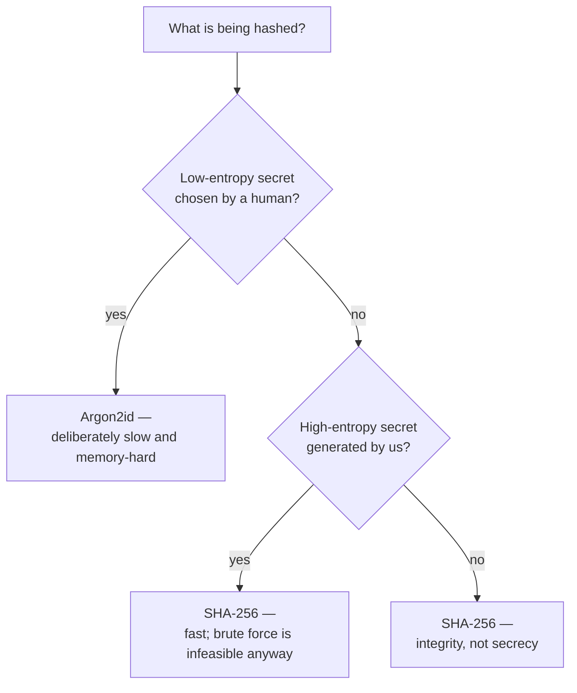
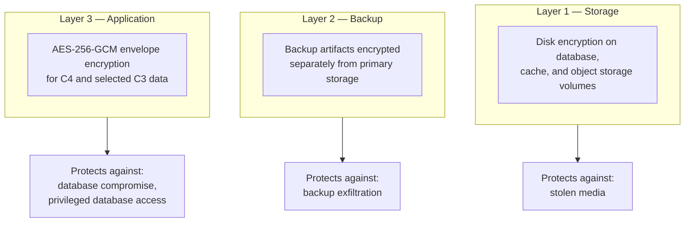

# Encryption Strategy

| Field | Value |
| --- | --- |
| Document | Encryption Strategy |
| Version | 1.0 |
| Status | Draft — SD-009 … SD-011 require ratification |
| Owner | Engineering & Security |
| Last updated | 2026-07-30 |
| Audience | Engineering, Security |
| Phase | 5 — Security Architecture |

---

## 1. Purpose

This document specifies every cryptographic choice in MaintOrbit AI: algorithms, where
each applies, and why. It exists so that cryptographic decisions are made once,
deliberately, and are not re-litigated per component or improvised at implementation time.

**One rule governs all of it: no bespoke cryptography.** Every operation uses vetted
framework primitives. The platform's cryptographic risk should be in *how* primitives are
composed, never in the primitives themselves.

---

## 2. Scope

**In scope:** encryption at rest and in transit, application-layer and column encryption,
credential encryption, key rotation as it affects ciphertext, certificate management,
hashing, and password hashing.

**Out of scope:** key custody and lifecycle ([10](10-key-management.md)), Provider
Credential lifecycle ([05](05-provider-credential-security.md)), transport configuration
([07](07-api-security.md)).

---

## 3. Architecture

### 3.1 Algorithm selections

| Purpose | Algorithm | Decision | Rationale |
| --- | --- | --- | --- |
| **Application-layer encryption** | **AES-256-GCM** | SD-009 🆕 | Authenticated — tampering detected, not silently decrypted |
| **Password hashing** | **Argon2id** | SD-010 🆕 | Memory-hard; resists GPU and ASIC acceleration |
| **API key hashing** | **SHA-256** | SD-011 🆕 | High-entropy secrets need no slow hash; a slow hash per request would breach NFR-PERF-007 |
| Token signing | Asymmetric signature | SD-013 | Verifiable without a shared secret |
| Transport | TLS, current versions | NFR-SEC-001 | Forward-secret suites only |
| Integrity and fingerprinting | SHA-256 | — | Non-secret integrity |
| Random generation | Cryptographically secure RNG | — | **Never a general-purpose RNG** for security values |

**Deprecated and forbidden:** MD5 and SHA-1 for any security purpose; ECB mode; unauthenticated
CBC; DES and 3DES; obsolete TLS versions; a general-purpose random number generator for
tokens, nonces, or identifiers.

### 3.2 Why three different hash choices

This is the selection most likely to be questioned, so the reasoning is stated explicitly.

| Secret | Entropy | Attack | Choice |
| --- | --- | --- | --- |
| **Password** | Low — human-chosen, often reused | Offline dictionary attack against a stolen hash | **Argon2id** — makes each guess expensive |
| **Platform API Key** | High — cryptographically random | Brute force is computationally infeasible regardless | **SHA-256** — a slow hash adds cost per Gateway request without adding security |
| File or record integrity | N/A | Collision | SHA-256 |

**Applying Argon2id to Platform API Keys would be a mistake, not extra caution.** It would
add tens of milliseconds to every Gateway request — breaching NFR-PERF-007's 10 ms
authentication budget — while defending against an attack that is already infeasible
against a high-entropy random secret.

**Argon2id parameters must be recorded and reviewed annually.** Memory, iteration count,
and parallelism are the security property, and hardware improvement erodes them over time.
They also create a denial-of-service consideration: an expensive hash on an unauthenticated
endpoint is a resource-consumption vector, which is why authentication endpoints are
rate-limited (NFR-SEC-016).

### 3.3 Encryption at rest — three layers

**Layer 3 is the one that matters most, and the one commonly omitted.** Disk encryption
protects against physical theft — a threat that barely applies to cloud infrastructure.
It does **not** protect against a compromised application, a leaked database credential, or
a privileged operator. Only application-layer encryption does, because the ciphertext is
meaningless without a key held elsewhere.

| Data | Class | Layer 1 | Layer 3 |
| --- | --- | --- | --- |
| **Provider Credentials** | C4 | ✅ | ✅ **Envelope, per-Company DEK** |
| Data encryption keys | C4 | ✅ | ✅ Wrapped by the KEK |
| MFA secrets | C4 | ✅ | ✅ Envelope |
| Password hashes | C4 | ✅ | Hash, not encryption |
| API key hashes | C4 | ✅ | Hash, not encryption |
| Prompt and completion content | C3 | ✅ | **Candidate — see §7** |
| Usage, cost, audit records | C2 | ✅ | — |
| Organizational data | C2 | ✅ | — |

### 3.4 Column-level encryption

Applied selectively, not universally.

| Consideration | Assessment |
| --- | --- |
| **Benefit** | A database compromise yields ciphertext for the encrypted columns |
| **Cost — querying** | An encrypted column cannot be indexed, filtered, sorted, or joined meaningfully |
| **Cost — operations** | Key rotation requires re-encrypting every affected row |
| **Where applied** | C4 only, plus C3 content as a future candidate |
| **Where not applied** | C2 — usage, cost, audit — because these exist to be queried and aggregated |

**Encrypting the ledger would defeat its purpose.** Usage and cost records exist to be
filtered, grouped, and aggregated across hundreds of millions of rows (NFR-SCAL-007).
Column encryption would make NFR-PERF-010's analytics targets unreachable. The isolation
control for C2 data is row-level security, not encryption — a deliberate division of
responsibility between the two mechanisms.

### 3.5 Encryption in transit

| Path | Protection |
| --- | --- |
| Client → Nginx | TLS, current versions, forward-secret suites |
| Nginx → application | TLS |
| Application → PostgreSQL | TLS enforced |
| Application → Redis | TLS enforced |
| Application → object storage | TLS |
| **Application → AI providers** | TLS; **certificate validation never disabled** |
| Application → custodian | TLS |
| Backup transfer | TLS |

**Certificate validation must never be disabled, including in development.** Disabling it
"temporarily" to work around a local certificate issue is how it reaches production, and
on the provider path it would expose every customer's credentials and prompt content to a
machine-in-the-middle.

### 3.6 Key rotation as it affects ciphertext

| Rotation | Ciphertext impact | Interruption |
| --- | --- | --- |
| **KEK** | **None** — only DEKs are re-wrapped | None |
| **DEK** | That Company's credentials re-encrypted | None |
| Signing key | None — overlapping validity via key identifiers | None |
| TLS certificate | None | None |

**Every ciphertext records the DEK version that produced it** (SD-012). This is what makes
rotation incremental: old ciphertext remains decryptable under its recorded version while
new writes use the current one, so rotation never requires a synchronized rewrite of
everything.

### 3.7 Certificate management

| Control | Requirement |
| --- | --- |
| Issuance | Automated |
| Renewal | Automated, well before expiry |
| **Expiry alerting** | **Independent of the renewal mechanism** |
| Private keys | Never in source, never in images; mounted at runtime |
| Internal certificates | Managed with the same discipline as public ones |
| Revocation | Documented procedure |

**Alerting must be independent of renewal.** If the alert depends on the same mechanism
that performs renewal, a failure of that mechanism silently disables both — and certificate
expiry is a full outage that is entirely avoidable.

### 3.8 Randomness

| Value | Requirement |
| --- | --- |
| GCM nonces | **Provably unique per key** — reuse is catastrophic |
| Session and token identifiers | Cryptographically secure RNG |
| Platform API Key secrets | Cryptographically secure RNG, high entropy |
| OAuth2 state and nonce | Cryptographically secure RNG, single-use |
| Password reset tokens | Cryptographically secure RNG, single-use, time-limited |
| Object storage key components | Cryptographically secure RNG — unguessable |
| Recovery codes | Cryptographically secure RNG, hashed at rest |

**GCM nonce uniqueness is the single most important implementation detail in this
document.** Reusing a nonce with the same key allows recovery of the authentication subkey
and forgery of arbitrary ciphertexts. Nonce generation belongs in design review, not in
implementation.

---

## 4. Design decisions

| # | Decision | Rationale |
| --- | --- | --- |
| SD-009 🆕 | **AES-256-GCM** for application-layer encryption | Authenticated encryption |
| SD-010 🆕 | **Argon2id** for passwords, parameters recorded and reviewed annually | Memory-hard |
| SD-011 🆕 | **SHA-256** for API key hashing, with a non-secret lookup prefix | High-entropy secrets; latency budget |
| SD-012 🆕 | **Every ciphertext records its DEK version** | Incremental rotation |
| EN-a | **No bespoke cryptography** | Risk belongs in composition, never in primitives |
| EN-b | **Application-layer encryption for C4; storage-layer for C2** | Disk encryption does not defend against the likely threats |
| EN-c | **Ledger data is not column-encrypted** | It exists to be aggregated; row-level security is its control |
| EN-d | **Certificate validation is never disabled, including in development** | The provider path carries credentials and content |
| EN-e | **Certificate expiry alerting is independent of renewal** | A shared failure disables both |
| EN-f | **Cryptographically secure RNG for every security value** | |
| EN-g | **Argon2id parameters reviewed annually** | Hardware improvement erodes them |

---

## 5. Trade-offs

| # | Gained | Given up |
| --- | --- | --- |
| T-1 | AES-256-GCM authentication | Nonce management becomes a correctness-critical concern |
| T-2 | Argon2id | CPU and memory per authentication; a DoS consideration |
| T-3 | SHA-256 for API keys | Weaker against a low-entropy key — mitigated by generating them ourselves |
| T-4 | Application-layer encryption for C4 | Encrypted columns cannot be queried |
| T-5 | Not encrypting the ledger | A database compromise exposes usage and cost data in readable form |
| T-6 | Per-Company DEKs | More keys; rotation is per-Company work |
| T-7 | Versioned ciphertext | Every ciphertext carries version metadata |

**T-5 is a conscious acceptance.** Usage and cost records reveal which teams use which
models and at what volume — commercially sensitive, but not catastrophic, and the
alternative is an unusable analytics product. Tenant isolation and access control are the
controls for that data.

---

## 6. Security considerations

| Threat | Mitigation |
| --- | --- |
| **GCM nonce reuse** | Provably unique generation; a design-review gate |
| Ciphertext tampering | GCM authentication tag; failure raises a security event |
| Ciphertext moved between tenants | Company identifier bound into the AAD |
| Offline password cracking | Argon2id with reviewed parameters |
| Argon2id as a DoS vector | Rate limiting on authentication endpoints |
| Database compromise | C4 is ciphertext; the KEK is elsewhere |
| Backup exfiltration | Backups encrypted separately; access audited |
| Machine-in-the-middle on the provider path | TLS with validation never disabled |
| Certificate expiry | Automated renewal plus independent alerting |
| Weak randomness | Cryptographically secure RNG throughout |
| Algorithm obsolescence | Annual review; algorithm identifiers recorded with ciphertext |

**Recording the algorithm identifier alongside ciphertext**, not only the key version,
makes future algorithm migration possible without a flag day — a small cost now that avoids
a large one later.

---

## 7. Future improvements

- **Encrypting C3 content at the application layer** — currently protected by not being
  retained by default. If retention becomes common, application-layer encryption of content
  becomes the appropriate next control.
- **Customer-managed keys** (NFR-SEC-020, v2.0) — the pluggable custodian makes this an
  implementation rather than a redesign.
- **Hardware security module custody** for the KEK.
- **Searchable encryption** for C3 content — would allow search over encrypted
  conversations, though the available schemes carry meaningful trade-offs and should be
  evaluated sceptically.
- **Post-quantum readiness** — recording algorithm identifiers with ciphertext is the cheap
  preparation; migration planning is not yet warranted but the option should not be
  foreclosed.
- **Automated Argon2id parameter calibration** against current hardware, rather than a
  manual annual review.

---

## 8. Cross references

| Document | Relationship |
| --- | --- |
| [01 — Security Overview](01-security-overview.md) | SD-009 … SD-012 |
| [05 — Provider Credentials](05-provider-credential-security.md) | Primary application of envelope encryption |
| [10 — Key Management](10-key-management.md) | Key hierarchy and lifecycle |
| [06 — Secret Management](06-secret-management.md) | Custodian and delivery |
| [08 — Data Protection](08-data-protection.md) | Classification driving what is encrypted |
| [02 — Authentication](02-authentication-architecture.md) | Password and API key hashing |
| [07 — API Security](07-api-security.md) | TLS configuration |
| [`../03-adr/ADR-0008-credential-encryption.md`](../03-adr/ADR-0008-credential-encryption.md) | Envelope decision |
| [`../01-product/non-functional-requirements.md`](../01-product/non-functional-requirements.md) | NFR-SEC-001/002/003/006/019 |
