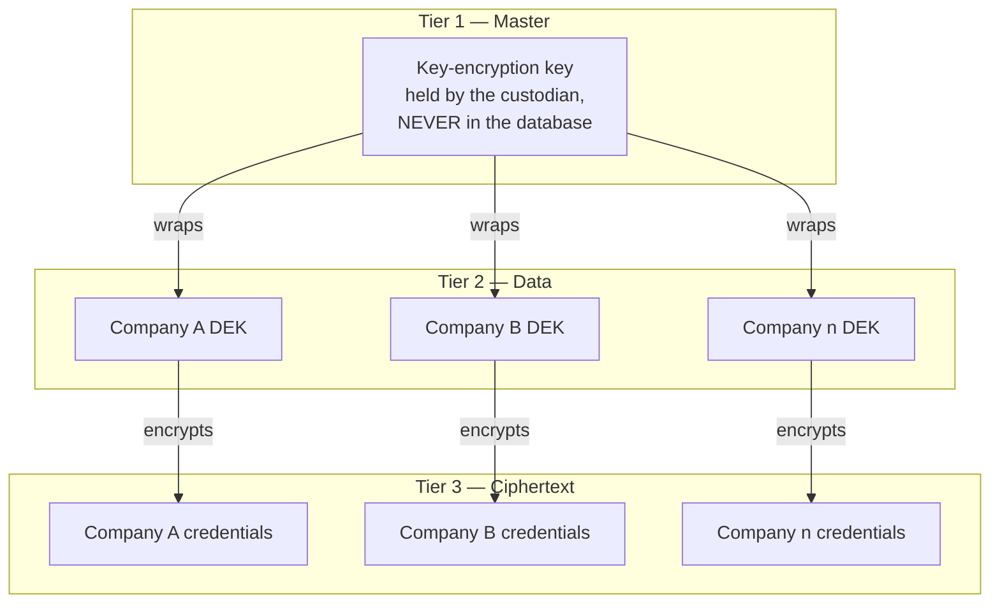
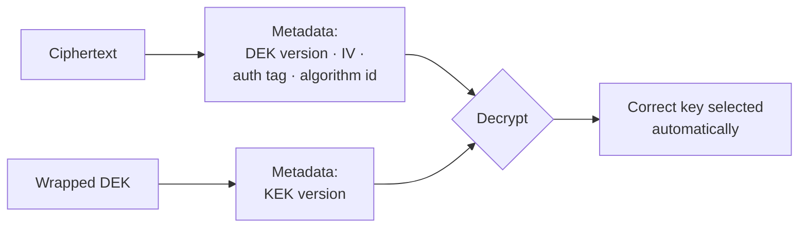
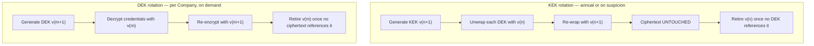

# Key Management

| Field | Value |
| --- | --- |
| Document | Key Management |
| Version | 1.0 |
| Status | Draft — **key recovery procedure does not yet exist (D-6)** |
| Owner | Engineering, Security & Leadership |
| Last updated | 2026-07-30 |
| Audience | Engineering, Security, Operations, Leadership |
| Phase | 5 — Security Architecture |

---

## 1. Purpose

This document specifies the key hierarchy, versioning, rotation, backup, escrow, and
recovery for MaintOrbit AI.

**Key management is where this platform's security either holds or fails completely.**
The key-encryption key protects every customer's Provider Credentials. Its compromise is
the worst outcome in the threat model; its **loss** is arguably worse, because it is
irreversible and affects every customer at once with no attacker involved.

---

## 2. Scope

**In scope:** master and data keys, versioning, rotation, backup, escrow, recovery, and
the operational governance around them.

**Out of scope:** algorithms ([09](09-encryption-strategy.md)), custodian implementations
([06](06-secret-management.md)), credential lifecycle
([05](05-provider-credential-security.md)).

---

## 3. Architecture

### 3.1 The hierarchy

| Tier | Key | Storage | Scope | Rotation | Loss impact |
| --- | --- | --- | --- | --- | --- |
| **1** | **KEK** | **Custodian, outside the database** | Platform-wide | Annual or on suspicion | **Catastrophic — all customers** |
| **2** | **DEK** | Database, wrapped by the KEK | **One per Company** | Per Company | One customer |
| **3** | — | Database | Per credential | On DEK rotation | Individual credential |

**The asymmetry between tiers is the design.** Tier 2 keys are numerous, individually
low-consequence, and rotate independently. Tier 1 is singular, catastrophic, and therefore
receives a wholly different level of protection and process.

**Separate key material exists for other purposes** — token signing, and any future
per-purpose keys — and must **not** be derived from or shared with the credential
hierarchy. A key that protects two unrelated things doubles the consequence of its
compromise.

### 3.2 Key versioning — SD-012

**Every ciphertext records the version of the DEK that produced it, and every wrapped DEK
records the version of the KEK that wrapped it.**

| Property | Consequence |
| --- | --- |
| Ciphertext carries its DEK version | Rotation is **incremental**, never a flag day |
| Wrapped DEK carries its KEK version | KEK rotation re-wraps DEKs without touching ciphertext |
| **Algorithm identifier recorded** | Future algorithm migration is possible without a synchronized rewrite |
| Old versions retained until no ciphertext references them | Decryption never fails because a key was retired early |

**Recording the algorithm identifier as well as the key version is cheap insurance.**
Without it, migrating away from AES-256-GCM at any point in the future would require
knowing which records used which algorithm — information that would not exist.

### 3.3 Rotation

| Rotation | Trigger | Ciphertext touched | Interruption | Requirement |
| --- | --- | --- | --- | --- |
| **KEK** | Annual; **immediately on suspicion** | **None** | **None** | NFR-SEC-019 |
| **DEK** | Annual per Company; on suspicion; on customer request | That Company's only | **None** | NFR-SEC-019 |
| Signing key | Quarterly | N/A | None | |

**KEK rotation touching no ciphertext is the reason the hierarchy exists.** Rotating a
single key that directly encrypted every credential would require decrypting and
re-encrypting every record under a new key — an operation so expensive and risky that it
would never be performed, which means the key would never rotate.

**Rotation must be exercised before it is needed.** A rotation procedure first executed
during an incident is a procedure being debugged under pressure with a compromised key
still live. It belongs in the quarterly exercise alongside restoration testing.

### 3.4 Backup — the existential requirement

**This is the least developed and most consequential area of the security architecture.**

| Requirement | Statement | Status |
| --- | --- | --- |
| KB-1 | KEK backed up to a location **independent of the custodian and the database** | ⚠️ Not implemented |
| KB-2 | The backup is **encrypted** and separately access-controlled | ⚠️ Not implemented |
| KB-3 | **The restore procedure is documented and tested** | ⚠️ **Not implemented — the critical gap** |
| KB-4 | Restoration testing is part of the **NFR-DR-006 quarterly exercise** | ⚠️ Not implemented |
| KB-5 | **Escrow** — recovery must not depend on a single individual | ⚠️ **Requires a leadership decision** |
| KB-6 | Every access to the backup is audited | ⚠️ Not implemented |
| KB-7 | DEKs are backed up with the database | ✅ Inherited from database backup |

**What KEK loss actually means.** Every stored Provider Credential becomes permanently
undecryptable. Every customer must obtain new credentials from every provider and re-enter
them. There is no recovery path, no partial restoration, and no vendor who can help. The
platform's core function stops for every customer simultaneously.

**KB-3 is the single highest-priority gap in this entire phase.** An untested backup is an
assumption dressed as a control, and this is the one asset where the assumption cannot be
allowed to be wrong.

### 3.5 Escrow and recovery — an organizational decision

**Recovery must not depend on one person.** Split custody, where no single individual can
recover the KEK alone, is the appropriate model for an asset of this rank.

| Question | Requires a decision from |
| --- | --- |
| Who may authorize recovery? | Leadership |
| **How many custodians must participate?** | Leadership & Security |
| How is each custodian's identity verified during recovery? | Security |
| Where are the custody shares held — and are they geographically separated? | Operations |
| What is the succession plan when a custodian leaves? | Leadership |
| How is a recovery drill conducted without exposing the key? | Security |

**This is deliberately listed as questions rather than answers**, because they are not
engineering decisions. The technical mechanism for splitting custody is well understood;
the governance around who holds what and who may invoke it is a leadership matter and has
not been decided.

**The succession question is the one most often overlooked.** A custodian who leaves the
organization without their share being reassigned silently degrades the recovery threshold
— and nobody discovers this until recovery is attempted.

### 3.6 Access control and audit

| Actor | KEK | DEK | Ciphertext |
| --- | --- | --- | --- |
| Application at runtime | Unwrap only, via the custodian | Unwrap and use | Read and write |
| Platform operator | **No direct access** | No direct access | No plaintext |
| Custodians, jointly | Recovery only, audited | — | — |
| Any customer role | **None** | None | None (no retrieval path) |

| Audited event | Detail |
| --- | --- |
| KEK access by the application | Frequency and pattern — **an anomaly is a serious signal** |
| KEK rotation | Actor, version, outcome |
| **Backup access** | Actor, justification, outcome |
| **Recovery invocation** | Full detail; **participants recorded; alerted immediately** |
| DEK creation, rotation, retirement | Company, version, actor |
| Authentication tag verification failure | **Security event** — indicates tampering |

**Recovery invocation must alert immediately and unconditionally.** A legitimate recovery
is rare and expected; an unexpected one is either an attack or a serious incident. There is
no scenario where a recovery should proceed unnoticed.

### 3.7 Self-hosted deployment — the trust boundary moves

At v2.1 the customer holds the KEK.

| Consequence | Detail |
| --- | --- |
| Customer's posture improves | We cannot access their credentials at all |
| **Our ability to assist ends** | If they lose their key, we cannot help — and this must be stated before they deploy |
| Their key management becomes their obligation | Backup, escrow, rotation, and recovery are theirs |
| **Documentation becomes a deliverable** | Guidance for running the portable custodian correctly does not yet exist |
| The portable custodian's weaker posture must be disclosed | Claiming parity with the hosted implementation would be an overstatement |

**Customers will lose keys.** Some proportion of self-hosted customers will not implement
backup properly, will lose the key, and will contact support expecting recovery. The answer
— that no recovery is possible and every credential must be re-entered — needs to be
documented, communicated at deployment time, and ideally acknowledged in writing before it
becomes a support conversation.

---

## 4. Design decisions

| # | Decision | Rationale |
| --- | --- | --- |
| SD-012 🆕 | **Two-tier versioned hierarchy** | Rotation without re-encrypting history |
| KM-a | **KEK never in the database** | A database dump alone is insufficient |
| KM-b | **DEK scoped per Company** | Bounds blast radius to one customer |
| KM-c | **Algorithm identifier recorded with ciphertext** | Future algorithm migration without a flag day |
| KM-d | **Old key versions retained until no ciphertext references them** | Decryption never fails on a prematurely retired key |
| KM-e | **KEK rotation touches no ciphertext** | Rotation that is expensive is rotation that never happens |
| KM-f 🆕 | **Split-custody escrow; recovery requires multiple participants** | The most consequential process must not have a single point of failure |
| KM-g | **Recovery invocation alerts immediately and unconditionally** | A legitimate recovery is rare; an unexpected one is an incident |
| KM-h | **Rotation is exercised quarterly, not only when needed** | A procedure first run during an incident is being debugged under pressure |
| KM-i | **Key material is never shared across purposes** | Shared keys multiply compromise consequences |

---

## 5. Trade-offs

| # | Gained | Given up |
| --- | --- | --- |
| T-1 | Two-tier hierarchy — cheap KEK rotation | More moving parts than a single key |
| T-2 | Per-Company DEKs | More keys to track; rotation is per-Company work |
| T-3 | KEK outside the database | **Loss is unrecoverable** without disciplined backup |
| T-4 | Versioned ciphertext | Metadata overhead per record |
| T-5 | Split custody | Recovery requires coordination — slower under pressure |
| T-6 | Customer-held keys when self-hosted | We cannot assist in recovery |
| T-7 | Old versions retained | Key material accumulates until retirement conditions are met |

---

## 6. Security considerations

| Threat | Mitigation | Residual |
| --- | --- | --- |
| **KEK compromise** | Custodian with independent access control and audit; rotation; access-pattern anomaly detection | **Exposes all customers.** Reduced, not eliminated |
| **KEK loss** | KB-1 … KB-6 | **Currently unmitigated — the procedure does not exist** |
| DEK compromise | Per-Company scope; independent rotation | One customer |
| Insider access to the backup | Split custody; audited access; recovery alerting | Multiple insiders colluding |
| Custodian unavailable at startup | Fail closed — the platform does not start without key access | Availability dependency on the custodian |
| Premature key retirement | Retention until no ciphertext references a version | |
| Ciphertext tampering | GCM authentication; failure raises a security event | |
| **Custodian succession failure** | Documented succession; periodic verification of custody shares | **Currently unaddressed** |

**Two residual risks are explicitly not fully mitigated**, and both trace to the same
missing work: the key recovery procedure. Until KB-3 and KB-5 exist, the platform is one
custodian failure away from an unrecoverable, customer-wide incident.

---

## 7. Future improvements

- **Hardware security module custody** for the KEK — likely driven by a regulated-enterprise
  contract rather than internal assessment.
- **Customer-managed keys** (NFR-SEC-020, v2.0) — the escrow problem becomes the customer's,
  which must be documented before the capability is offered.
- **Automated rotation** on a schedule rather than a calendar reminder.
- **Key access anomaly detection** — unusual KEK access frequency or pattern is one of the
  earliest signals of compromise available.
- **Per-purpose key separation** as new encryption needs arise, so no key protects two
  unrelated things.
- **Recovery drills with published outcomes**, so the procedure is known to work rather than
  believed to.
- **Self-hosted key management guidance** — a v2.1 deliverable that does not yet exist.

---

## 8. Cross references

| Document | Relationship |
| --- | --- |
| [01 — Security Overview](01-security-overview.md) | Rank 2 asset — the KEK |
| [05 — Provider Credentials](05-provider-credential-security.md) | What these keys protect |
| [06 — Secret Management](06-secret-management.md) | Custodian implementations; backup requirements |
| [09 — Encryption Strategy](09-encryption-strategy.md) | Algorithms and versioning |
| [12 — Audit & Compliance](12-audit-and-compliance.md) | Key access audit |
| [13 — Threat Model](13-threat-model.md) | Information disclosure |
| [14 — Security Monitoring](14-security-monitoring.md) | Key access anomaly detection |
| [`../03-adr/ADR-0008-credential-encryption.md`](../03-adr/ADR-0008-credential-encryption.md) | **Unratified — D-6, including the untested backup gap** |
| [`../01-product/non-functional-requirements.md`](../01-product/non-functional-requirements.md) | NFR-SEC-003/019/020, NFR-DR-006 |
