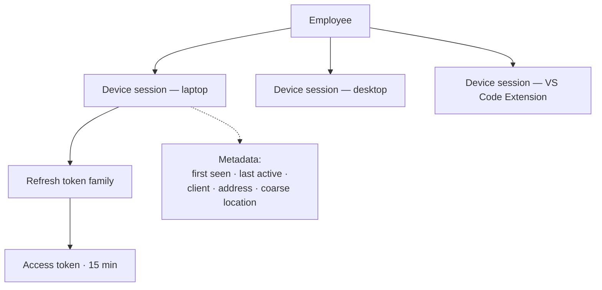
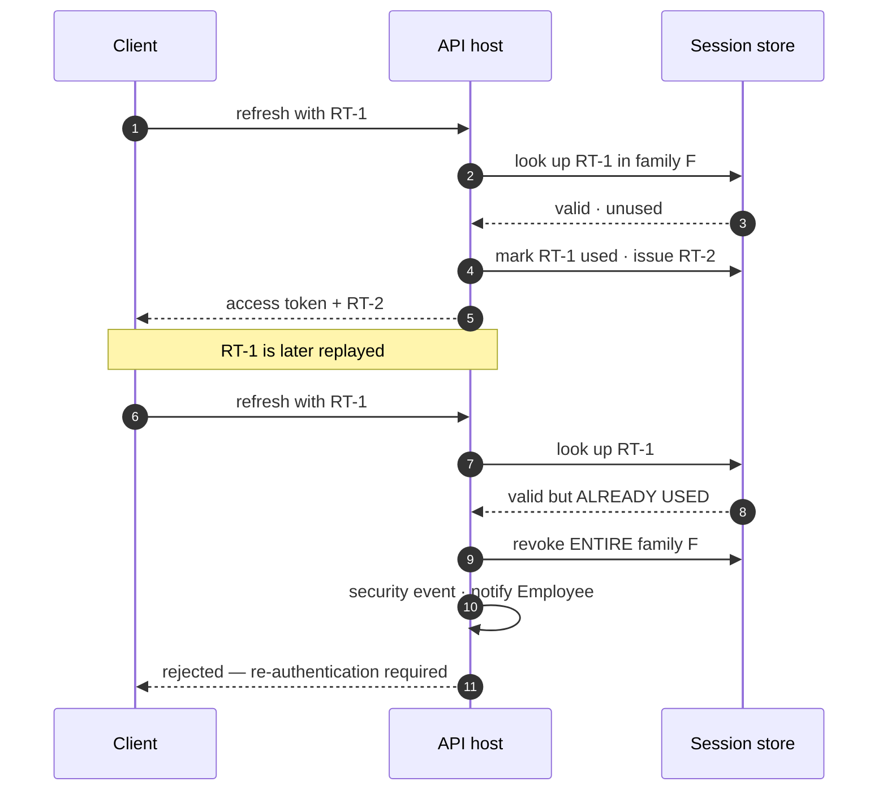
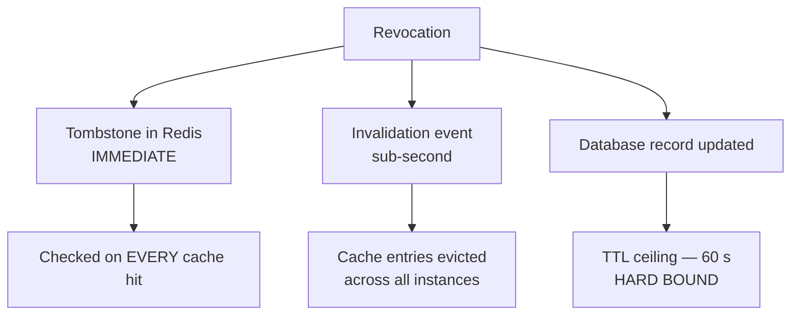
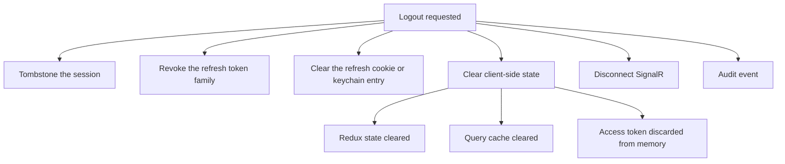

# Session Management

| Field | Value |
| --- | --- |
| Document | Session Management |
| Version | 1.0 |
| Status | Draft — SD-014, SD-016 require ratification |
| Owner | Engineering & Security |
| Last updated | 2026-07-30 |
| Audience | Engineering, Security |
| Phase | 5 — Security Architecture |

---

## 1. Purpose

This document specifies session lifecycle: expiry, refresh rotation, concurrency, device
management, revocation, logout, and idle timeout.

**Session management carries a specific weight in this platform.** The Gateway serves
authentication from cache to meet its latency budget, which means a session's validity is
a *cached* fact. Everything here exists to ensure that cached fact cannot outlive the truth
by more than 60 seconds — and, via tombstones, is usually corrected immediately.

---

## 2. Scope

**In scope:** session lifecycle, expiry policies, refresh rotation and reuse detection,
concurrent sessions, device management, revocation, logout, idle timeout.

**Out of scope:** authentication mechanisms
([02](02-authentication-architecture.md)), authorization
([03](03-authorization-architecture.md)), Platform API Keys — which are **not** sessions.

---

## 3. Architecture

### 3.1 Session model

| Property | Decision | Requirement |
| --- | --- | --- |
| Unit | **A device session**, not merely an Employee session | SD-016 |
| Record of truth | PostgreSQL | |
| Read path | Redis cache | NFR-PERF-007 |
| Access token | JWT, 15 minutes, in memory | SD-013 |
| Refresh token | Rotating, hashed at rest, bound to the device session | SD-014 |
| Extension | Same model — a session, **not** a Platform API Key | XD-003 |

**The Extension deriving from a Session rather than a key is what makes revocation free.**
Every mechanism below applies to it without a separate implementation — and, importantly,
without a separate implementation that could be forgotten.

### 3.2 Expiry policies

Three independent timers. **Whichever expires first ends the session.**

| Timer | Default | Configurable | Purpose |
| --- | --- | --- | --- |
| **Access token** | 15 minutes | No | Bounds the value of a stolen token |
| **Idle timeout** | Company-configured | ✅ (FR-AUTH-007) | Ends abandoned sessions |
| **Absolute lifetime** | Company-configured | ✅ (FR-AUTH-007) | Forces periodic re-authentication regardless of activity |

**Absolute lifetime is the one that cannot be defeated by activity.** An attacker with a
live session can keep it alive indefinitely by generating traffic; only an
activity-independent ceiling stops that. A session that has been continuously active for
weeks is not evidence of legitimacy.

**Idle timeout resets on genuine user activity, not on background polling.** A console tab
left open refreshing analytics should not keep a session alive at an unattended desk —
which means the activity signal must come from interaction, not from the SignalR connection
or automatic refetches.

### 3.3 Refresh rotation and reuse detection — SD-014

| Rule | Statement |
| --- | --- |
| RT-1 | Every use issues a new refresh token |
| RT-2 | **Reuse of a consumed token revokes the entire family** |
| RT-3 | Family revocation raises a **security event** and notifies the Employee |
| RT-4 | Tokens are hashed at rest and never recoverable |
| RT-5 | A **short grace window** accepts the immediately-previous token without penalty |

**RT-5 exists because RT-2 produces false positives.** Two console tabs refreshing
simultaneously, or a client retrying after a dropped response, legitimately present the
same token twice. Without a grace window, ordinary use logs people out — and a security
control that fires on normal behaviour gets disabled.

**The grace window's length is a security parameter, not a convenience default.** Too short
and legitimate races trigger revocation; too long and a stolen token has a usable window.
It must be measured against real client behaviour rather than guessed.

### 3.4 Concurrent sessions and device management

| Property | Decision | Requirement |
| --- | --- | --- |
| Concurrency | **Permitted by default** — people use several devices | |
| Company limit | A Company **may** cap concurrent sessions | Enterprise policy |
| Enumeration | An Employee sees their own sessions | FR-AUTH-008 |
| Individual revocation | An Employee may terminate any of their sessions | FR-AUTH-008 |
| Terminate all others | Single action, keeping the current session | Useful after a suspected compromise |
| Administrative | A Company Admin may terminate any Employee's sessions | FR-AUTH-009 |
| **New-device notification** | The Employee is notified | Detection of unauthorized access |

**Session metadata is personal data about employees** — address, coarse location, client
type — classified C2 and retained for a bounded period. It is **visible to the Employee
themselves**, consistent with principle P-7: the monitored are told what is monitored.

**New-device notification is one of the highest-value low-cost security controls available.**
It puts detection in the hands of the person best placed to recognize that a sign-in was not
theirs.

### 3.5 Revocation

The mechanism that makes cached authentication safe.

| Trigger | Scope | Requirement |
| --- | --- | --- |
| Employee logs out | That device session | |
| Employee terminates a session | That session | FR-AUTH-008 |
| Employee terminates all others | All except current | |
| Admin terminates sessions | All for that Employee | FR-AUTH-009 |
| **Password change** | **All sessions** | NFR-SEC-017 |
| **Role change** | Sessions re-evaluated; permissions refresh within 60 s | NFR-SEC-017, FR-PERM-005 |
| **Refresh token reuse** | **Entire family** | SD-014 |
| **Deprovisioning** | **All sessions and all Platform API Keys created** | FR-AUTH-018 |
| Account lockout | All sessions | FR-AUTH-011 |

**Three mechanisms, deliberately redundant**, because revocation is a control where partial
failure is unacceptable and each fails differently:

| Mechanism | Fails when | Consequence |
| --- | --- | --- |
| Tombstone | Redis unavailable | The Gateway is already rejecting everything — safe |
| Invalidation event | Delivery delayed or lost | Falls through to the TTL ceiling |
| **TTL ceiling** | **Never — a hard bound** | Guarantees FR-AUTH-010 and FR-PERM-005 |

**Tombstone lifetime is twice the TTL ceiling**, so a tombstone can never expire while a
stale cache entry survives.

**Password change revoking all sessions is not optional** (NFR-SEC-017). A user changing
their password after suspecting compromise expects it to end the attacker's access; a
session that survives makes the action worthless.

### 3.6 Logout

**Client-side clearing matters as much as server-side revocation.** A logout that revokes
the session but leaves cached analytics data in the browser leaves the previous user's data
visible on a shared machine — and if the next user signs into a different Company, the query
cache must not serve the previous one's data. This is why query keys include the Company
identifier and the cache is cleared on session change (FD-005).

**Logout is idempotent and always succeeds from the user's perspective.** If server-side
revocation fails, the client still clears local state and the user still sees themselves
logged out — while the failure is recorded and alerted. A logout that visibly fails leaves
the user unsure whether they are protected.

### 3.7 Step-up authentication

Certain operations warrant re-proving the second factor even within a valid session
([02](02-authentication-architecture.md) §3.6):

| Operation | Rationale |
| --- | --- |
| Create or rotate a Provider Connection | Rank-1 asset |
| Change Company authentication policy | Could disable MFA for everyone |
| Transfer ownership | Irreversible authority change |
| Enable Content Retention | Changes the platform's data profile |
| Terminate another Employee's sessions | Administrative action against a person |

**Step-up bounds the damage of a hijacked session.** An attacker with a stolen session
token can read and do a great deal; requiring the second factor for the highest-consequence
operations means the most damaging actions need something the attacker probably lacks.

---

## 4. Design decisions

| # | Decision | Rationale |
| --- | --- | --- |
| SD-013 | JWT access tokens, 15 min, **stateful refresh** | Bounds theft value; preserves revocation |
| SD-014 🆕 | **Rotation with reuse detection; family revocation** | Makes theft detectable, not merely time-limited |
| SD-016 🆕 | **Device-scoped sessions** | Per-device visibility and revocation |
| SM-a | **Three independent expiry timers** | Absolute lifetime cannot be defeated by activity |
| SM-b | **Idle timeout resets on interaction, not background traffic** | Otherwise an open tab keeps a session alive indefinitely |
| SM-c | **Grace window on refresh rotation** | Prevents legitimate races from revoking sessions |
| SM-d | **Password change revokes all sessions** | NFR-SEC-017; otherwise the action is worthless |
| SM-e | **New-device notification** | Highest-value low-cost detection control |
| SM-f | **Logout clears client state including the query cache** | Shared-machine and Company-switch exposure |
| SM-g | **Logout is idempotent and always succeeds visibly** | A visibly failed logout leaves the user unprotected and unsure |
| SM-h | **Concurrent sessions permitted; Companies may cap** | People use multiple devices; enterprises may disagree |
| SM-i | **Step-up for high-consequence operations** | Bounds the damage of a hijacked session |

---

## 5. Trade-offs

| # | Gained | Given up |
| --- | --- | --- |
| T-1 | Short access token lifetime | More refresh traffic |
| T-2 | Stateful refresh | A session lookup per refresh; not stateless |
| T-3 | Reuse detection | False positives on legitimate races; requires a grace window |
| T-4 | Device sessions | Storing device metadata — itself personal data |
| T-5 | Triple-redundant revocation | A Redis round trip per request; three mechanisms to test |
| T-6 | Concurrent sessions permitted | More live credentials per Employee |
| T-7 | Step-up authentication | Friction on exactly the operations administrators perform most |
| T-8 | Absolute lifetime | Periodic re-authentication even for active users |

---

## 6. Security considerations

| Threat | Mitigation |
| --- | --- |
| **Session hijacking** | Short access token; `HttpOnly` refresh cookie; strict CSP; step-up on sensitive operations |
| **Refresh token theft** | Rotation with reuse detection; family revocation; Employee notified |
| **Session fixation** | New session identifier on authentication and on privilege change |
| Session riding — CSRF | Anti-CSRF tokens; `SameSite` as defence in depth |
| Abandoned session on a shared machine | Idle timeout; logout clears client state |
| **Indefinitely extended session** | Absolute lifetime, activity-independent |
| Stale permissions after a role change | 60 s TTL ceiling plus invalidation |
| **Orphaned session after deprovisioning** | Cascade revocation plus a verification job |
| Concurrent session abuse | Enumeration; optional Company cap; new-device notification |
| Token replay after logout | Tombstone checked on every cache hit |
| Cross-Company cache reuse | Company-scoped query keys; cache cleared on session change |

**Every session event is audited** (FR-AUTH-014): creation, refresh, rotation, family
revocation, termination, and administrative termination.

---

## 7. Future improvements

- **Continuous session evaluation** — re-assessing risk mid-session on a change of address,
  device signal, or behaviour, rather than trusting a session until expiry.
- **Session binding to a device fingerprint** — makes a stolen token useless elsewhere, at
  the cost of breaking legitimate network changes. A genuine trade-off requiring
  measurement.
- **Hardware key step-up** (FR-AUTH-020, v2.0) — phishing-resistant step-up rather than
  TOTP.
- **Session risk scoring** — impossible travel, unusual client, unusual timing.
- **Per-Company session policy templates**, so enterprises can apply a standard posture
  without configuring each setting.
- **Service identity lifecycle** (FR-AUTH-019, v1.1) — a credential with **no human owner
  has no deprovisioning trigger**, which is the mechanism the whole revocation model rests
  on. This is an unsolved design problem, not an increment.

---

## 8. Cross references

| Document | Relationship |
| --- | --- |
| [01 — Security Overview](01-security-overview.md) | SD-007, SD-013, SD-014, SD-016 |
| [02 — Authentication](02-authentication-architecture.md) | Token formats and federation |
| [03 — Authorization](03-authorization-architecture.md) | Permission refresh on role change |
| [07 — API Security](07-api-security.md) | Cookie handling, CSRF |
| [12 — Audit & Compliance](12-audit-and-compliance.md) | Session event logging |
| [13 — Threat Model](13-threat-model.md) | Spoofing analysis |
| [`../02-architecture/authentication-architecture.md`](../02-architecture/authentication-architecture.md) | §3.3 session architecture; §3.4 revocation |
| [`../03-adr/ADR-0007-authentication-strategy.md`](../03-adr/ADR-0007-authentication-strategy.md) | Ratified strategy |
| [`../01-product/product-requirements.md`](../01-product/product-requirements.md) | FR-AUTH-007 … 011, 018 |
