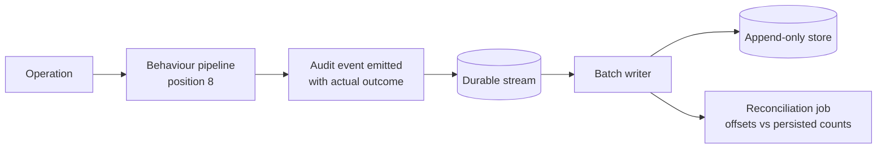
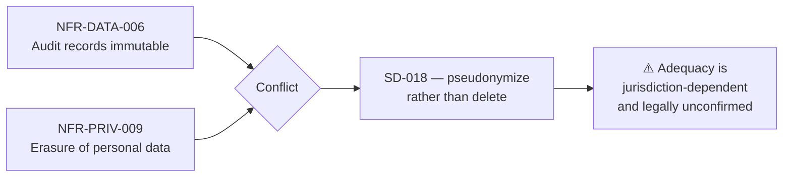

# Audit and Compliance

| Field | Value |
| --- | --- |
| Document | Audit and Compliance |
| Version | 1.2 — audit store built; action vocabulary ratified (Milestone 12.2) |
| Status | Draft — SD-018 requires legal confirmation |
| Owner | Security, Compliance & Engineering |
| Last updated | 2026-08-09 |
| Audience | Security, Compliance, Legal, Engineering, Leadership |
| Phase | 5 — Security Architecture |

---

## 1. Purpose

This document specifies the audit trail — what is recorded, with what guarantees, for how
long — and how it supports the platform's compliance targets.

**The audit trail is a product feature, not only an internal control.** The P-06 persona
buys the platform partly to obtain an AI audit trail their organization does not otherwise
have, and their stated abandonment trigger is *"discovering audit records are sampled or
incomplete."* An audit trail with gaps is worse than none, because it creates false
confidence.

---

## 2. Scope

**In scope:** audit event model and guarantees, security events, authentication and
authorization logging, credential access, configuration changes, data access, retention,
export, and the SOC 2 / ISO 27001 / GDPR posture.

**Out of scope:** operational telemetry ([14](14-security-monitoring.md)), data
classification ([08](08-data-protection.md)), key access mechanics
([10](10-key-management.md)).

---

## 3. Architecture

### 3.1 Three record types — never conflated

This is the most common structural mistake in systems of this kind, and it is worth being
explicit about.

| Type | Purpose | Guarantees | Retention | Consumer |
| --- | --- | --- | --- | --- |
| **Audit Event** | Compliance record | **Immutable · never sampled** | ≥ 12 months default | Customer, auditors |
| **Usage Record** | Metering and cost | **Immutable · never sampled** | Company-configured | Customer, finance |
| **Decision Record** | Request reconstruction | Complete per request | **Shorter** — high volume | Customer, support |
| *Application log* | *Diagnosis* | *Best-effort, may be sampled* | *Short* | *Operations* |

**Audit events implemented as log entries inherit log sampling and log retention** — and
thereby silently fail NFR-DATA-007 and FR-AUD-004. They are a separate store with separate
guarantees and a separate code path, and this separation is a review gate rather than a
convention.

### 3.2 Audit event guarantees

| # | Guarantee | Requirement |
| --- | --- | --- |
| AU-1 | **Append-only.** No modification or deletion path exists **in code**, for any role | FR-AUD-003 |
| AU-2 | **Never sampled**, under any load condition | FR-AUD-004, NFR-DATA-007 |
| AU-3 | Records actor, action, target, outcome, timestamp, originating context | FR-AUD-002 |
| AU-4 | **Never contains prompt or completion content** — references it only | FR-AUD-010, NFR-PRIV-005 |
| AU-5 | Searchable by actor, action, target, outcome, time range | FR-AUD-005 |
| AU-6 | Exportable in a documented machine-readable format | FR-AUD-006 |
| AU-7 | Retention configurable; **retention changes are themselves audited** | FR-AUD-007 |
| AU-8 | **A failure to write is an incident** — recorded, alerted, reconciled | FR-AUD-011 |
| AU-9 | Available for search within 30 seconds of the action | NFR-PERF-015 |
| AU-10 | Tamper-evident (v1.1) | NFR-COMP-003 |

**AU-1 is satisfied structurally.** There is no update or delete operation on audit records
in the codebase — not gated by permission, but absent. A permission can be misconfigured;
an absent code path cannot.

**AU-8 is unusual and deliberate.** Audit emission is classified fail-open (SD-004) so a
platform fault never becomes a customer outage — but *open does not mean unnoticed*. A
failure to record is treated as an incident, alerted, and reconciled against stream offsets.

### 3.3 Emission is a pipeline concern

**Handlers do not decide whether an audit event is emitted; the pipeline emits and handlers
enrich.**

If each handler were responsible for its own audit event, coverage would be a function of
developer discipline and FR-AUD-001 would not hold. Audit sits at pipeline position 8 —
**after** the handler, so it observes the actual outcome including failure.

**The Gateway hot path bypasses the pipeline** ([ADR-0010](../03-adr/ADR-0010-gateway-hot-path.md))
and therefore implements audit emission directly. A shared test suite must assert that both
paths produce equivalent audit outcomes, or they will drift (ADR-0010 R-3).

> ### Implementation status as of Milestone 12.2 — this section describes the target, not the build
>
> The design above is unchanged and remains the frozen decision. What exists today is less than it,
> and the gap is recorded here so nobody reads this section as a description of the running system.
>
> | Element | Status |
> | --- | --- |
> | The ADR-0012 pipeline, and audit at **position 8** | **Not built.** No dispatcher exists; handlers are invoked directly from endpoints |
> | Durable stream → batch writer | **Not built.** Emission writes straight through to the store, synchronously, in its own transaction after the audited operation commits |
> | **Append-only store** | **Built (12.2).** `auditing.audit_events` — partitioned monthly, tenant-scoped by row-level security, `REVOKE UPDATE, DELETE` |
> | Reconciliation job | **Not built.** It reconciles stream offsets against persisted counts, and there is no stream |
> | Emission itself | **Built.** `identity` emits sign-in, sign-out, lockout, MFA enrolment and challenge, role assignment, session revocation, and every authorization denial |
>
> **Because the pipeline does not exist, `identity` emits directly — the same shape this section
> already sanctions for the Gateway hot path.** That inherits the warning two paragraphs up:
> coverage becomes a function of developer discipline. `AuditEmissionTests` is the deliberate
> substitute, asserting through real HTTP that each documented event is emitted; `AuditPersistenceTests`
> then asserts the same events reach the table. It is the coverage guarantee until position 8 exists.
>
> **Where §3.2's guarantees now stand.** AU-1 is enforced rather than vacuous: no update or delete
> path exists in code, and the grant is revoked at the database. AU-2, AU-3, AU-4 and AU-8 are met
> by the emission side. **AU-5, AU-6 and AU-9 remain unmet** — the rows exist and are indexed for
> those queries, but no search or export surface is built. AU-10 (tamper-evidence) is v1.1.
>
> **AU-7 as of Milestone 12.3.** Retention is configurable, with a documented floor of twelve
> months enforced at startup — a shorter setting stops the Worker rather than silently reducing a
> compliance commitment. Retention is evaluated on every maintenance cycle and eligible partitions
> are reported. **Dropping them is disabled by default and blocked on legal holds**: a partition
> may hold events under a hold, `legal_holds` is specified and unimplemented, and destroying
> evidence a hold exists to preserve is the one failure this control must not have. Enabling the
> drop is a deliberate operator action taken after confirming no hold applies. The second half of
> AU-7 — "retention changes are themselves audited" — is not implemented, because retention is
> deployment configuration rather than an audited operation; that becomes an audit event when
> retention becomes a per-Company setting.
>
> **Partition creation is built.** `MaintOrbit.Worker` (DP-001, its own container) runs a daily
> cycle that creates every missing month to a configurable horizon, serialised across replicas by
> a PostgreSQL advisory lock. T-5's "a missing partition is an outage of the ingestion path" is
> therefore bounded rather than open-ended — and because emission is fail-open, that outage would
> present as AU-8 incidents and lost events rather than a failed request, which is why the Worker
> reports a failed cycle as its readiness signal.

### 3.4 What is audited

| Category | Events | Requirement |
| --- | --- | --- |
| **Authentication** | Success, failure, lockout, MFA challenge, password change, token family revocation | FR-AUTH-014 |
| **Authorization** | **Every denial**, with actor, permission, target | FR-PERM-004 |
| **Session** | Creation, refresh, rotation, termination, administrative termination | FR-AUTH-014 |
| **Provider Credentials** | Creation, validation, rotation, disablement, deletion. **Never the credential itself** | FR-PROV-016 |
| **Key management** | KEK access pattern, rotation, **backup access, recovery invocation** | [10](10-key-management.md) |
| **Configuration** | Company settings, policies, budgets, routing, retention changes | FR-AUD-001 |
| **Organizational** | Employee lifecycle, role changes, team membership, ownership transfer | FR-TEN-\* |
| **Data access** | Exports, report generation, **legal hold and every access under it** | FR-AUD-001 |
| **Governance** | Every block or redaction, with policy, action, reason | FR-GOV-008 |
| **Billing** | Plan change, payment, failure, refund | FR-BILL-014 |
| **Security events** | Cross-tenant attempt, elevated-role use, authentication-tag failure, refresh reuse | §3.5 |

**Authorization denials are a primary detection signal.** A burst from one identity is a
privilege-escalation attempt in progress — which is why every denial is recorded rather
than only successes.

#### The action and target vocabulary

§3.4 above says *what categories* are audited. It did not, until Milestone 12.2, say what an
individual event is *called* — so Phase 11 invented names and centralised them pending this
section. These are those names, ratified.

**Form: `category.verb`, lower case, hyphenated.** Stored as text rather than an enumeration
because the trail is exported to customers (AU-6) and read by auditors (AU-5); a column of integers
would make the export depend on a lookup table nobody ships with it.

| Action | Emitted when | Outcomes |
| --- | --- | --- |
| `authentication.sign-in` | A sign-in is attempted | Success · Failure |
| `authentication.sign-out` | A session is ended by its holder | Success |
| `authentication.sign-out-all` | Every session for an Employee is ended | Success |
| `authentication.lockout` | Failed attempts reach the Company's threshold | Success |
| `authentication.mfa.enrol` | Second-factor enrolment begins | Success |
| `authentication.mfa.confirm` | Enrolment is proved and activated | Success · Failure |
| `authentication.mfa.challenge` | A second factor is presented | Success · Failure |
| `authentication.mfa.disable` | The second factor is turned off | Success · Failure |
| `session.revoke` | One session is terminated | Success |
| `session.revoke-others` | Every session except the caller's is terminated | Success |
| `employee.role.assign` | A role is granted | Success |
| `employee.role.remove` | A role is withdrawn | Success |
| `authorization.denied` | A permission check refuses a request (FR-PERM-004) | Denied |

**Targets**: `employee`, `session`, `mfa-enrollment`, `role-assignment`, `endpoint`.

**Outcomes**: `Success`, `Failure`, `Denied` — closed by a check constraint, as are actor types
(`Anonymous`, `Employee`, `System`).

The constants live in `MaintOrbit.Shared.Auditing`, not in the `auditing` module, and that is a
boundary decision rather than a convenience: `identity` emits against this vocabulary and must not
reference another module's internals (ADR-0002 R-5). A published contract in Shared is the only
place both sides can see.

**`context` carries no credential material.** The audit store is the one relation with no delete
path, so a value written into it cannot be removed by any code the system has. Keys naming
credentials — password, token, secret, hash, key, cookie, signature, and the rest — are redacted
before the row is constructed, and values are capped so a request body or completion cannot become
a payload (AU-4). The guard is in the aggregate's factory, not at each emission point, because a
convention applied at thirteen call sites holds until somebody adds the fourteenth.

### 3.5 Security events — a distinguished subset

Events that, under correct operation, should not occur at all. Each **alerts**, not merely
logs.

| Event | Why it cannot be routine |
| --- | --- |
| **Cross-tenant access attempt** | Isolation makes it impossible; occurrence means attack or defect |
| **Elevated database role use outside an enumerated path** | Only named paths may elevate |
| **GCM authentication tag failure** | Indicates tampering or corruption, never normal decryption |
| **Refresh token reuse** | Indicates token theft |
| **Key recovery invocation** | Rare and expected, or an incident — never unnoticed |
| **Audit write failure** | AU-8 |
| **Usage write failure** | NFR-DATA-008 |
| Authorization denial burst | Privilege-escalation attempt |
| Authentication failure burst | Credential stuffing |
| Deprovisioning verification failure | A credential survived revocation |

### 3.6 Retention and export

| Record | Default | Configurable | Mechanism |
| --- | --- | --- | --- |
| Audit Events | **≥ 12 months** | ✅ FR-AUD-007 | Partition drop |
| Usage and Cost | Company-configured | ✅ FR-USG-009 | Partition drop |
| Decision Records | Shorter | ✅ | Partition drop |
| Application logs | Short | ✅ | Standard rotation |

**Tiered storage preserves completeness affordably.** Aged partitions move to compressed,
less-indexed storage and remain **complete and queryable** at higher latency. This is the
architectural answer to the conflict between efficiency goal G4.5 and the no-sampling
constraint — sampling would resolve it too, and is excluded.

**Export** (FR-AUD-006) is documented, machine-readable, and suitable for ingestion by
customer security tooling. **Continuous streaming to a customer destination** arrives at
v1.1 (FR-AUD-009), as does an **audit export API** (FR-API-009).

**Export is itself an audited event**, including actor, scope, and destination.

### 3.7 Compliance posture

| Framework | Target | Status |
| --- | --- | --- |
| **SOC 2 Type II** | Control documentation sufficient for examination | v1.1 (NFR-COMP-001) |
| **ISO 27001** | Certification requirements supported | v2.0 (NFR-COMP-009) |
| **GDPR** | Readiness — not certification | Ongoing |
| **PCI DSS** | **Out of scope by design** — card data never transits or is stored | NFR-COMP-007 |

#### SOC 2 — what the architecture already provides

| Criterion | Evidence |
| --- | --- |
| Logical access | RBAC, deny-by-default, MFA, audited denials |
| Change management | ADRs, build gates, migration review |
| Monitoring | [14](14-security-monitoring.md), alerting with runbooks |
| Risk management | Threat model, risk registers throughout |
| Vendor management | Subprocessor inventory ([`../04-technology/third-party-services.md`](../04-technology/third-party-services.md)) |
| **Availability** | ⚠️ **Blocked** — a single-VM deployment cannot meet the stated target (DD-1) |
| **Software currency** | ⚠️ **Blocked** — an out-of-support runtime is an automatic finding (TD-1) |

**Two known blockers exist and both are already flagged.** An unsupported runtime and an
unachievable availability commitment are exactly what a SOC 2 examination surfaces, and
both are cheap to fix now.

#### GDPR readiness

| Obligation | Position |
| --- | --- |
| Lawful basis | Customer's responsibility as controller; platform is processor |
| **Subprocessors** | Documented; advance notice of change (NFR-COMP-005). **The AI provider relationship needs legal characterization** |
| Data minimization | **Content off by default** (SD-006) — a strong position |
| Purpose limitation | Content never used to train models (NFR-PRIV-003) |
| Access (Art. 15) | Export of all data about an identified Employee (NFR-PRIV-008) |
| **Erasure (Art. 17)** | ⚠️ **Pseudonymization of audit records — adequacy unconfirmed** (SD-018) |
| Records of processing | Data-flow reporting (FR-AUD-012, v1.1) |
| Breach notification | Incident response ([14](14-security-monitoring.md)) |
| Transfers | Data residency at v2.1 (NFR-PRIV-013) |

**Content off by default is the strongest GDPR position the platform has**, and it was an
architectural choice rather than a compliance one. Most of the platform's value comes from
metadata, so the highest-sensitivity data is simply not held unless a customer opts in.

### 3.8 The erasure tension — stated, not resolved

Complete deletion destroys audit integrity — a core product promise and a compliance
obligation. Retaining identified records conflicts with an erasure right.

**Pseudonymization is defensible and is not confirmed.** It is recorded as an open decision
rather than presented as settled, because presenting it as settled would be precisely the
overstatement that [`../01-product/mission.md`](../01-product/mission.md) §6 forbids — and
the persona who detects such overstatement is the one who signs off on the purchase.

**Backups compound it.** An erasure request cannot practically rewrite historical backups.
The standard position — erasure applies to live systems while backups age out under their
retention schedule — should be documented and legally confirmed alongside SD-018.

---

## 4. Design decisions

| # | Decision | Rationale |
| --- | --- | --- |
| SD-005 | **Audit and usage never sampled** | An incomplete trail creates false confidence |
| AC-a | **Three record types with distinct guarantees, never conflated** | Audit-as-logs inherits sampling and silently fails |
| AC-b | **No modification or deletion path exists in code** | Structural, not permission-based |
| AC-c | **Emission is a pipeline concern, not a handler concern** | Coverage must not depend on developer discipline |
| AC-d | **Audit is fail-open but a write failure is an incident** | A platform fault must not cause an outage; it must also not pass unnoticed |
| AC-e | **Audit references content, never contains it** | NFR-PRIV-005 |
| AC-f | **Every authorization denial is audited** | Denials are the escalation-attempt signal |
| AC-g | **Retention changes are audited** | Shortening retention is compliance-relevant |
| AC-h | **Tiered storage, never sampling** | Resolves cost against completeness |
| AC-i | **Export is itself audited** | Bulk data leaving is a security-relevant act |
| AC-j | **Security events alert rather than log** | Under correct operation they cannot occur |
| SD-018 | **Erasure pseudonymizes audit records** | ⚠️ Legally unconfirmed |

---

## 5. Trade-offs

| # | Gained | Given up |
| --- | --- | --- |
| T-1 | Complete, unsampled audit | Storage cost growing monotonically |
| T-2 | No deletion path in code | Erroneous audit records cannot be corrected — only compensated |
| T-3 | Pipeline emission | Non-local behaviour; harder to trace when debugging |
| T-4 | Audit fail-open | A window where an operation succeeded but was not recorded |
| T-5 | Tiered storage | Aged queries are slower; a two-tier query path to build |
| T-6 | Pseudonymized erasure | Not deletion; jurisdiction-dependent |
| T-7 | Long default retention | Larger exposure if the audit store is compromised |

**T-2 is worth noting.** An audit record written in error stays. The compensating-record
model — recording a correction rather than editing — is the only option, and it makes
immutability real rather than nominal.

---

## 6. Security considerations

| Threat | Mitigation |
| --- | --- |
| **Audit tampering to hide an attack** | Append-only in code; tamper-evidence at v1.1; export to customer tooling |
| **Audit deletion by an insider** | No deletion path exists; retention changes audited |
| Audit gap under load | Never sampled; write failure is an incident; reconciliation |
| **Content leaking into audit records** | AU-4; never a plain string type; scrubbing as a second layer |
| Audit store compromise | Tenant-isolated; encrypted at rest; access-controlled and audited |
| Retention silently shortened | Retention changes audited |
| Export used for exfiltration | Export audited with actor, scope, destination |
| Log injection via crafted input | Structured logging; no string concatenation |
| Legal hold abused for surveillance | Separate authorization; audited; designated parties notified |

---

## 7. Future improvements

- **Tamper-evidence** (NFR-COMP-003, v1.1) — hash chaining so modification is detectable.
  Note the deliberate distinction: **tamper-evident, not tamper-proof**. Only the weaker
  claim is made.
- **Continuous audit streaming** (FR-AUD-009, v1.1) — export to customer security tooling
  in real time.
- **Data-flow reporting** (FR-AUD-012, v1.1) — which Teams sent data to which providers,
  generated rather than hand-maintained. This directly answers the security questionnaire
  that blocks enterprise deals.
- **Compliance evidence generation** — if regulators come to accept machine-readable
  evidence, the audit trail becomes a compliance artifact in its own right.
- **Legal hold implementation** (FR-GOV-011, v1.1) — required before content retention is
  usable at scale.
- **ISO 27001** (v2.0) — a management-system commitment, not only a control set.
- **Customer-facing audit search** with saved queries, so compliance staff self-serve rather
  than raising support requests.

---

## 8. Cross references

| Document | Relationship |
| --- | --- |
| [01 — Security Overview](01-security-overview.md) | SD-005, SD-018 |
| [03 — Authorization](03-authorization-architecture.md) | Denial auditing |
| [04 — Tenant Security](04-tenant-security.md) | Tenant audit events |
| [05 — Provider Credentials](05-provider-credential-security.md) | Credential lifecycle audit |
| [08 — Data Protection](08-data-protection.md) | Classification, retention, erasure |
| [10 — Key Management](10-key-management.md) | Key access and recovery audit |
| [14 — Security Monitoring](14-security-monitoring.md) | Alerting on security events |
| [`../03-adr/ADR-0011-usage-audit-ingestion.md`](../03-adr/ADR-0011-usage-audit-ingestion.md) | Ingestion and its durability gap |
| [`../03-adr/ADR-0020-observability.md`](../03-adr/ADR-0020-observability.md) | Why audit is a distinct store |
| [`../01-product/non-functional-requirements.md`](../01-product/non-functional-requirements.md) | NFR-COMP-001 … 010, NFR-DATA-002/007 |
| [`../01-product/user-personas.md`](../01-product/user-personas.md) | P-06 — sampling is disqualifying |
