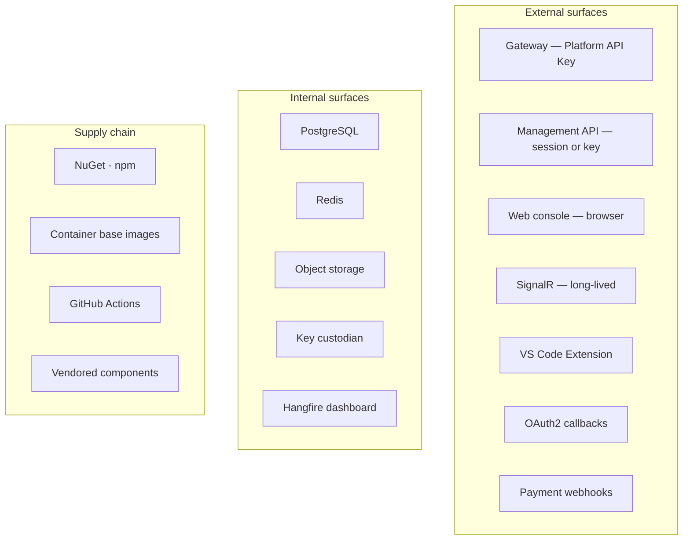

# Threat Model — STRIDE

| Field | Value |
| --- | --- |
| Document | Threat Model (STRIDE) |
| Version | 1.0 |
| Status | Draft — pending security review workshop |
| Owner | Security & Engineering |
| Last updated | 2026-07-30 |
| Audience | Security, Engineering, Architecture Review, Leadership |
| Phase | 5 — Security Architecture |
| Review cadence | **Per major release, and on any architectural change** |

---

## 1. Purpose

This document models threats against MaintOrbit AI using STRIDE, records mitigations, and
— most usefully — identifies which threats are **not** adequately mitigated today.

**A threat model whose every row says "mitigated" is a marketing document.** The value here
is in the rows that do not, and in stating residual risk plainly enough that leadership can
decide whether to accept it.

---

## 2. Scope

**In scope:** threats against the platform's assets, trust boundaries, and data flows,
across all components and all three client surfaces.

**Out of scope:** threats to customer environments; AI provider internal security;
physical infrastructure; misuse by authorized employees acting within their permissions
(detected and audited, not prevented); model output quality and hallucination — a product
concern, not a security one.

---

## 3. Architecture

### 3.1 Threat actors

| Actor | Capability | Motivation | Primary targets |
| --- | --- | --- | --- |
| **External unauthenticated** | Network access; public surfaces | Opportunistic; credential harvesting | Authentication, API surface |
| **External authenticated — legitimate customer** | Valid credentials in one Company | Curiosity; competitive intelligence | **Tenant boundary** |
| **Compromised customer account** | Full authority of the victim's role | Data theft; spend abuse | Credentials, content, ledger |
| **Malicious insider — customer side** | Legitimate role in their Company | Data exfiltration before departure | Content, exports, credentials |
| **Malicious insider — platform side** | Infrastructure or database access | Data theft; sabotage | **KEK, all tenants** |
| **Supply-chain attacker** | Compromised dependency or CI | Persistent, broad access | Everything |
| **Compromised AI provider** | Sees prompt content routed to them | Data theft | Content in transit |
| **Automated / opportunistic** | Scanning, credential stuffing | Volume | Authentication, exposed surfaces |

**The two actors that most shape the design** are the *legitimate customer probing the
tenant boundary* — because they are authenticated, patient, and hard to distinguish from
normal use — and the *platform-side insider*, because they are the one actor with plausible
access to the rank-1 and rank-2 assets.

### 3.2 Attack surface

---

## 4. STRIDE analysis

Severity assumes the mitigation is **absent**. Residual risk assumes it is present.

### 4.1 Spoofing — impersonating an identity

| # | Threat | Severity | Mitigation | Residual |
| --- | --- | --- | --- | --- |
| S-1 | Credential stuffing against employee accounts | High | Breach-corpus checking (FR-AUTH-002); rate limiting (NFR-SEC-016); lockout with notification | **Low** |
| S-2 | **Stolen Platform API Key used to impersonate a workload** | **High** | Hashed storage; immediate tombstone revocation; scoped permissions; last-used tracking | **Medium** — a key valid until noticed |
| S-3 | Session token theft via XSS | High | Access token in memory; refresh `HttpOnly`; strict CSP; sanitized model output | Low |
| S-4 | Refresh token theft and replay | High | Rotation with reuse detection; family revocation; Employee notified | **Low** — theft becomes detectable |
| S-5 | **JWT forgery via a compromised signing key** | **Critical** | Quarterly rotation; custodian storage; key identifiers | **Medium** — **forged tokens bypass tombstone revocation entirely** |
| S-6 | OAuth2 authorization code interception | Medium | PKCE with SHA-256; exact-match redirect allowlist | Low |
| S-7 | Phishing employee credentials | High | TOTP MFA; new-device notification | **Medium** — **TOTP is phishable; hardware keys (v2.0) are the real answer** |
| S-8 | Extension impersonation on a developer machine | Medium | OS keychain storage; short-lived access credentials | Medium — local malware is outside our boundary |
| S-9 | Unsigned payment webhook forgery | High | Signature verification with timestamp tolerance | Low |
| S-10 | Provider endpoint spoofing | High | TLS with **validation never disabled** | Low |

**S-5 is the most under-appreciated threat in this model.** A forged token was never
issued, so it appears in no session record and no tombstone. The triple-redundant
revocation architecture — which handles every other credential compromise — does not apply.
Detection depends on anomaly analysis rather than revocation, which is why signing-key
rotation is quarterly and key access is monitored.

### 4.2 Tampering — unauthorized modification

| # | Threat | Severity | Mitigation | Residual |
| --- | --- | --- | --- | --- |
| T-1 | SQL injection | **Critical** | Parameterized queries; **Analytics direct SQL is a review gate** | Low |
| T-2 | **Ciphertext tampering in the database** | High | AES-256-GCM authentication tag; failure raises a security event | **Low** |
| T-3 | **Ciphertext moved between tenants** | High | Company identifier bound into the AAD — decryption fails | **Low** |
| T-4 | **Audit record modification to hide activity** | **Critical** | No modification path in code; tamper-evidence at v1.1 | **Medium until v1.1** |
| T-5 | Usage or cost record manipulation | High | Immutable; compensating records only; reconciliation | Low |
| T-6 | Governance policy tampering to permit exfiltration | High | Change auditing; authorization; step-up recommended | Low |
| T-7 | **Supply-chain compromise of a dependency** | **Critical** | Lockfiles; build-gating scan; SHA-pinned actions; source mapping | **Medium** — a determined attack is hard to detect |
| T-8 | Container image tampering | High | Immutable promotion; image scanning; registry access control | Low |
| T-9 | **Vendored component compromise** | Medium | Quarterly review | **Medium — invisible to every scanner** |
| T-10 | Request replay causing duplicate spend | Medium | Idempotency keys (SD-015) | Low |
| T-11 | Prompt injection manipulating model behaviour | Medium | **Out of scope as a platform threat** — the platform governs egress, not model behaviour | **Accepted** |

**T-9 deserves emphasis.** Vendored shadcn/ui components appear in no dependency scan, no
vulnerability report, and no upgrade notification. Every other supply-chain item prompts
someone eventually; this one relies entirely on a scheduled review being performed.

**T-11 is explicitly out of scope and worth being clear about.** Prompt injection
manipulates the *model's* behaviour, not the platform's. The platform's obligations are
that injected content cannot reach our systems as executable input (API-f), and that XSS
via a manipulated completion is prevented by sanitization. Customers should not be told the
platform prevents prompt injection.

### 4.3 Repudiation — denying an action

| # | Threat | Severity | Mitigation | Residual |
| --- | --- | --- | --- | --- |
| R-1 | An Employee denies making an AI request | Medium | Complete, unsampled attribution chain per request | Low |
| R-2 | An admin denies a configuration change | Medium | Configuration change auditing with actor | Low |
| R-3 | Denying provider credential access | High | Full lifecycle auditing | Low |
| R-4 | **Audit gap creating deniability** | High | Never sampled; write failure is an incident; reconciliation | **Medium** — the ~1 s ingestion window (D-2) |
| R-5 | Denying a data export | Medium | Export audited with actor, scope, destination | Low |
| R-6 | Shared credential defeating attribution | Medium | Per-Employee keys; last-used tracking; **cannot fully prevent sharing** | **Medium** |

**R-4 traces directly to the unresolved ingestion durability gap.** A bounded loss window
means a small set of actions could be genuinely unrecorded. This is why decision D-2
matters beyond data integrity — it affects non-repudiation, which is a compliance property.

### 4.4 Information disclosure — the highest-consequence category

| # | Threat | Severity | Mitigation | Residual |
| --- | --- | --- | --- | --- |
| **I-1** | **KEK compromise exposes every customer's Provider Credentials** | **Critical** | Custodian outside the database; independent access control and audit; rotation; access anomaly detection | **Medium — the highest residual in this model** |
| **I-2** | **Cross-tenant data exposure** | **Critical** | Row-level security below every query; safe failure direction; tested every build | **Low, conditional on D-1 ratification** |
| **I-3** | **Pooled connection carrying stale tenant context** | **Critical** | Clear-on-return; pooling mode as a security decision | ⚠️ **Unresolved — DD-2** |
| I-4 | Database compromise reading credentials | High | Envelope encryption; KEK elsewhere | Low |
| I-5 | Backup exfiltration | High | Encrypted; separate storage; audited access | Medium |
| I-6 | Credential or content in logs | High | Never a plain string type; absent by construction; secret scanning | Low |
| I-7 | Content exposure through support access | High | **No role reads another Employee's content**; legal hold only | Low |
| I-8 | **Elevated database role misuse** | **Critical** | Enumerated paths; architecture test; every use audited | **Medium — a documented bypass** |
| I-9 | Signed URL leaked or guessed | Medium | Unguessable keys; short lifetime; authorization before issuance | Low |
| I-10 | Browser cache serving another Company's data | Medium | Company-scoped query keys; cache cleared on session change | Low |
| I-11 | Error messages leaking cross-tenant identifiers | Medium | No cross-tenant identifiers in errors | Low |
| I-12 | **Prompt content disclosed to the AI provider** | Medium | **Inherent to the product**; governance limits egress; provider terms documented | **Accepted and disclosed** |
| I-13 | Timing side channel revealing tenant existence | Low | Uniform responses for not-found and not-authorized | Low |
| I-14 | Platform-side insider reading customer data | High | No credential retrieval path; content access requires legal hold; audited | Medium |
| I-15 | Telemetry exposing cross-tenant data | Medium | Per-Company metrics scoped (NFR-OBS-010) | Low |

**I-3 is the only ⚠️ in this model, and it is unresolved.** It is not an application defect
— it is an interaction between a correct application and a correctly-configured connection
pooler. It must be prototyped and load-tested before schema design.

**I-12 is inherent and must be stated honestly.** Every AI request is a data egress event
to a third party. That is the product. The platform's value is *governing* that egress, not
eliminating it, and customers must not be told otherwise.

### 4.5 Denial of service

| # | Threat | Severity | Mitigation | Residual |
| --- | --- | --- | --- | --- |
| **D-1** | **Redis unavailability halts the Gateway** | **Critical** | Replication with automatic failover | ⚠️ **Unresolved — D-3.** Fail-closed budget checks make this a full outage |
| D-2 | Volumetric attack on public endpoints | High | Edge connection limits; per-Company limits; explicit shedding | Medium |
| D-3 | Noisy neighbour consuming shared capacity | High | Per-Company rate, connection, and concurrency limits | Low |
| D-4 | **Argon2id as a resource-exhaustion vector** | Medium | Rate limiting on authentication endpoints | Low |
| D-5 | Account lockout weaponized against a known user | Medium | Notification; per-source as well as per-account limiting | **Medium — inherent to lockout** |
| D-6 | Ingestion backlog exhausting Redis memory | High | Stream depth alerting; **shed inference before dropping records** | Medium |
| D-7 | Expensive analytics query saturating a replica | Medium | Query limits; read replica isolation | Low |
| D-8 | Provider rate limit exhaustion | Medium | Per-Company limits; multiple connections (FR-PROV-012); **the customer's limit, not ours** | Low |
| D-9 | Certificate expiry causing an outage | Medium | Automated renewal; **independent expiry alerting** | Low |
| D-10 | Single-VM deployment failing availability | High | ⚠️ **Unresolved — DD-1** | ⚠️ |

**D-1 and D-10 are the two availability threats with unresolved decisions**, and they
compound: on a single VM, a routine Redis restart is a full Gateway outage.

### 4.6 Elevation of privilege

| # | Threat | Severity | Mitigation | Residual |
| --- | --- | --- | --- | --- |
| E-1 | Horizontal — another Employee's resources | High | Scope evaluation; resource-based checks; row-level security | Low |
| E-2 | Vertical — a higher role | High | **No inheritance hierarchy**; explicit grants; audited changes | Low |
| E-3 | **Cross-tenant escalation** | **Critical** | Scope uses only current-Company data (AZ-e); row-level security independently | Low |
| E-4 | Key scope escalation | Medium | Effective permission is role **∩** key scope, never union | Low |
| E-5 | Bypass via a background job | High | Explicit tenant context; AT-10 | Low |
| E-6 | Bypass via SignalR | High | AT-11; server-side group derivation | Low |
| E-7 | Bypass via Analytics direct SQL | High | Row-level security still applies; restricted and reviewed | Low |
| E-8 | **Elevated database role abuse** | **Critical** | Enumerated paths; architecture test; audited | **Medium** |
| E-9 | Stale permissions after a role change | Medium | 60 s TTL ceiling plus invalidation | Low |
| E-10 | **Custom roles composing an escalation** (v2.0) | Medium | **Not yet designed** — a creator must not grant what they lack | ⚠️ **Future** |
| E-11 | Hangfire dashboard exposure | High | Authenticated, authorized, audited, not publicly routed | Low |
| E-12 | Container escape | High | Non-root; read-only root filesystem where practical; image scanning | Medium |

---

## 5. Residual risk summary

| Threat | Residual | Status |
| --- | --- | --- |
| **I-1 — KEK compromise** | **Medium** | **Accepted with mitigation.** Highest residual in the model. Reduced, not eliminated |
| **I-3 — Pooling tenant leak** | ⚠️ **Unquantified** | **Must be resolved before Phase 6** — DD-2 |
| **D-1 — Redis halts the Gateway** | ⚠️ **Unquantified** | Requires decision D-3 |
| **D-10 — Single-VM availability** | ⚠️ **Unquantified** | Requires decision DD-1 |
| **S-5 — Signing key forgery** | Medium | Bypasses revocation; detection is anomaly-based |
| **I-8 / E-8 — Elevated role** | Medium | Documented bypass; kept small and audited |
| **T-4 — Audit tampering** | Medium | Until tamper-evidence at v1.1 |
| **T-7 / T-9 — Supply chain** | Medium | Vendored components are the weakest link |
| **S-7 — Phishing** | Medium | Until hardware keys at v2.0 |
| **R-4 — Audit gap** | Medium | Tied to the D-2 durability gap |
| **I-12 — Content to providers** | **Accepted** | Inherent to the product; disclosed |
| **T-11 — Prompt injection** | **Out of scope** | Model behaviour, not platform behaviour |
| **E-10 — Custom role escalation** | ⚠️ **Future** | Must be designed before v2.0 |

**The pattern worth noticing:** the highest residual risks are not sophisticated attacks.
They are an unresolved configuration question (I-3), an undecided availability trade-off
(D-1), a key whose recovery procedure does not exist (I-1), and a class of dependency no
tool watches (T-9).

---

## 6. Design decisions

| # | Decision | Rationale |
| --- | --- | --- |
| TM-a | **Severity assumes the mitigation is absent; residual assumes it is present** | Makes the value of each control visible |
| TM-b | **Prompt injection is out of scope as a platform threat** | It manipulates model behaviour, not ours; claiming otherwise would mislead customers |
| TM-c | **Content disclosure to providers is accepted and disclosed** | Inherent to the product |
| TM-d | **Unresolved threats are marked ⚠️, not assigned an optimistic residual** | An unquantified risk must not look mitigated |
| TM-e | **The model is reviewed per major release and on architectural change** | A stale threat model is believed and wrong |
| TM-f | **The KEK warrants a dedicated threat model** | The rank-1 dependency deserves analysis beyond one row here |

---

## 7. Trade-offs

| # | Gained | Given up |
| --- | --- | --- |
| T-1 | Honest residual ratings | The document does not read as reassuring |
| T-2 | Prompt injection out of scope | Customers may expect it in scope; requires explanation |
| T-3 | Fail-closed security controls | Availability threats (D-1) become more severe |
| T-4 | Elevated role exists | A permanent documented bypass |
| T-5 | TOTP rather than hardware keys at MVP | Phishing residual remains until v2.0 |
| T-6 | Content off by default | Reduces I-7 and I-14 substantially; limits product analytics |

---

## 8. Security considerations

**Threats a security review will raise that this model deliberately does not claim to
solve:**

- **Prompt injection** — out of scope, stated in TM-b.
- **Model output correctness** — a product concern.
- **Customer-side misuse by authorized employees** — detected and audited, not prevented.
- **AI provider internal security** — assessed as a subprocessor; not controlled.
- **Local malware on a developer machine** — outside the boundary; short credential
  lifetimes limit the window.

**Being explicit about these is a commercial asset, not a weakness.** The P-06 persona
distrusts a threat model with no gaps far more than one with stated ones.

---

## 9. Future improvements

- **A dedicated KEK threat model** (TM-f) — the rank-1 dependency warrants analysis beyond
  a single row.
- **Threat modelling per module** as the system grows, rather than one platform-wide model.
- **Attack-tree analysis for the two critical paths** — cross-tenant access and credential
  extraction.
- **Red-team exercise** focused on tenant isolation, which is both the highest-consequence
  boundary and the hardest to test synthetically.
- **Custom-role escalation analysis** (E-10) before v2.0.
- **Agentic workload threats** — autonomous multi-step operations change the abuse surface
  substantially and are not modelled here.
- **Self-hosted deployment threats** (v2.1) — a different trust model in which the customer
  holds the keys and controls the infrastructure.

---

## 10. Cross references

| Document | Relationship |
| --- | --- |
| [01 — Security Overview](01-security-overview.md) | Assets, boundaries, principles |
| [02 — Authentication](02-authentication-architecture.md) | Spoofing mitigations |
| [03 — Authorization](03-authorization-architecture.md) | Elevation mitigations |
| [04 — Tenant Security](04-tenant-security.md) | I-2, I-3, E-3 |
| [05 — Provider Credentials](05-provider-credential-security.md) | I-1, I-4 |
| [10 — Key Management](10-key-management.md) | I-1 residual |
| [12 — Audit & Compliance](12-audit-and-compliance.md) | Repudiation mitigations |
| [14 — Security Monitoring](14-security-monitoring.md) | Detection for residual risks |
| [15 — Security Checklist](15-security-checklist.md) | Implementation verification |
| [`../02-architecture/component-diagram.md`](../02-architecture/component-diagram.md) | §3.6 failure impact |
| [`../03-adr/ADR-0021-fail-open-fail-closed.md`](../03-adr/ADR-0021-fail-open-fail-closed.md) | D-3 |
