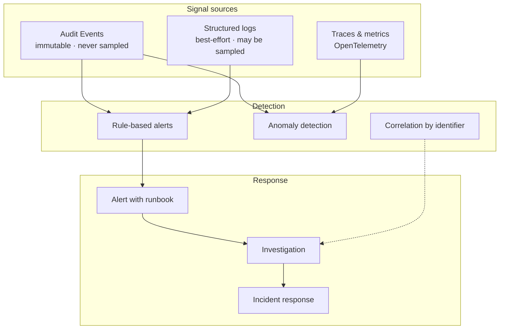
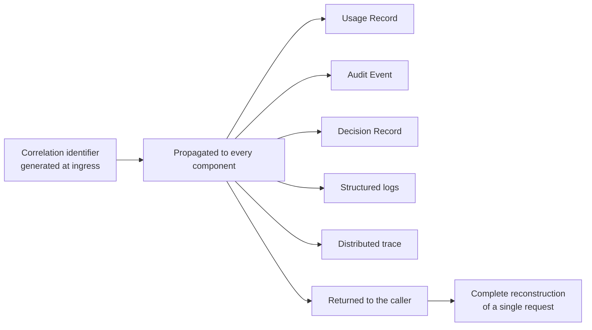
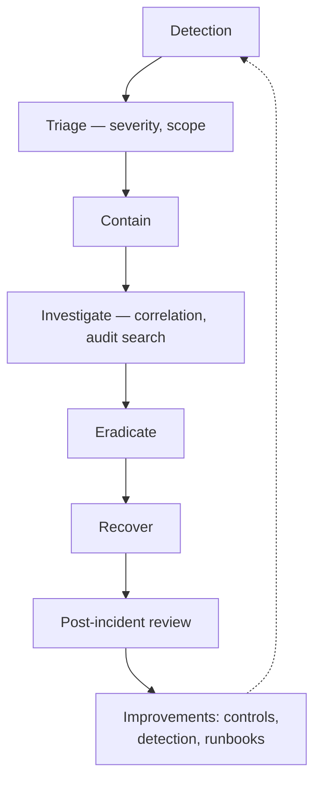

# Security Monitoring

| Field | Value |
| --- | --- |
| Document | Security Monitoring |
| Version | 1.0 |
| Status | Draft — pending security review |
| Owner | Security, Engineering & Operations |
| Last updated | 2026-07-30 |
| Audience | Security, Engineering, Operations |
| Phase | 5 — Security Architecture |

---

## 1. Purpose

Prevention fails. This document specifies how failure is **detected**, investigated, and
responded to: telemetry, security alerting, anomaly detection, correlation, and incident
response.

Its priority is set by the threat model. The residual risks in
[13](13-threat-model.md) §5 — KEK compromise, tenant boundary failure, signing key forgery,
supply-chain compromise — share a property: **prevention is imperfect, so detection is the
control that actually matters.**

---

## 2. Scope

**In scope:** telemetry architecture, security event alerting, anomaly detection,
correlation, incident response, and the detection strategy for each residual risk.

**Out of scope:** what is audited ([12](12-audit-and-compliance.md)), operational
performance monitoring ([`../02-architecture/scalability-strategy.md`](../02-architecture/scalability-strategy.md)),
compliance reporting ([12](12-audit-and-compliance.md)).

---

## 3. Architecture

### 3.1 Signal sources — three, never conflated

| Source | Guarantee | Security use |
| --- | --- | --- |
| **Audit Events** | **Immutable, never sampled** | **The authoritative security signal** |
| Structured logs | Best-effort, may be sampled | Diagnostic context |
| Traces and metrics | Sampled on the hot path | Behavioural baselines, volumetric detection |

**Security detection must derive primarily from audit events, not logs.** Logs may be
sampled and have short retention; an attack detected only in a sampled log is an attack
that may not be detected at all. This is why [12](12-audit-and-compliance.md) §3.1 keeps
the three types structurally separate.

### 3.2 Correlation

**Correlation is what makes investigation tractable.** Given one identifier, the platform
reconstructs exactly what happened — which target was selected, which policies evaluated,
what the outcome was, and how long each stage took (NFR-OBS-006).

**Investigation needs a second axis that a single request identifier does not provide:**
actor over time, tenant over time, credential over time. Audit search by actor, action,
target, and time range (FR-AUD-005) supplies it. Both are needed — one reconstructs an
event, the other reconstructs a campaign.

**A dropped correlation identifier breaks reconstruction silently.** Every boundary asserts
propagation by integration test, because the break is invisible until someone needs it.

### 3.3 Security alerts — conditions that alert, not log

From [12](12-audit-and-compliance.md) §3.5. Each **alerts**, because under correct
operation none of these can occur.

| Alert | Signal | Priority | First response |
| --- | --- | --- | --- |
| **Cross-tenant access attempt** | Audit | **P1** | Treat as breach until disproven; identify actor and scope |
| **Elevated database role used outside an enumerated path** | Audit | **P1** | Identify the path; assess data touched |
| **Key recovery invoked** | Audit | **P1** | Verify authorization; alert all custodians |
| **GCM authentication tag failure** | Audit | **P1** | Indicates tampering; isolate the record; assess database integrity |
| **Deprovisioning verification failure** | Audit | **P1** | A credential survived revocation — revoke manually, find the cause |
| **Audit write failure** | Audit / metric | **P1** | AU-8; assess the recording gap |
| **Refresh token reuse** | Audit | **P2** | Family already revoked; notify Employee; assess for wider theft |
| **Unusual KEK access pattern** | Metric | **P2** | Earliest available signal of credential-store compromise |
| Authorization denial burst | Audit | **P2** | Privilege-escalation attempt in progress |
| Authentication failure burst | Audit | **P2** | Credential stuffing; verify rate limiting holds |
| Usage write failure | Metric | **P2** | NFR-DATA-008; ledger gap |
| Provider credential validation failures | Audit | **P3** | Possible credential compromise on the customer side |
| Governance block rate anomaly | Audit | **P3** | Exfiltration attempt, or a misconfigured policy |
| Export volume anomaly | Audit | **P3** | Possible bulk exfiltration |
| New-device sign-in | Audit | **Employee-facing** | The Employee is best placed to recognize it |

**Every alert must have a runbook before it is enabled** (NFR-OBS-012). An alert with no
documented response is noise, and noise trains people to ignore alerts — which is worse
than having no alert at all.

### 3.4 Anomaly detection

Rule-based alerts catch known-bad. Anomaly detection is aimed at the residual risks where
prevention is imperfect.

| Baseline | Anomaly | Detects |
| --- | --- | --- |
| **KEK access frequency and pattern** | Sudden increase; access from an unexpected path | **I-1 — credential store compromise.** The earliest signal available |
| Per-Company request volume and shape | Sharp deviation | Compromised key; runaway automation |
| Per-Employee usage pattern | Volume or timing far outside their norm | Account compromise; insider exfiltration |
| Credential use pattern | A provider credential suddenly used differently | Credential compromise — **the platform is uniquely positioned to see this** |
| Export volume and frequency | Bulk export outside normal cadence | Data exfiltration |
| Authentication geography and timing | Impossible travel; unusual hours | Account compromise |
| Authorization denial rate per identity | Elevated denials | Privilege probing |
| Governance block rate | Sudden increase | Exfiltration attempt or policy misconfiguration |

**Anomaly detection must start in observe mode.** Consistent with
[`../01-product/mission.md`](../01-product/mission.md) §4.3, a detection rule that fires
unexpectedly and blocks legitimate work destroys trust faster than a missed detection does.
Baselines are learned before rules act.

**The credential-use anomaly row is a genuine differentiator.** Because every provider
request passes through the platform, it sees usage patterns the customer's provider console
cannot correlate. A credential suddenly used at a different rate, from a different Team, or
against different models is a compromise signal the customer would otherwise miss entirely.

### 3.5 Detection strategy per residual risk

Mapping [13](13-threat-model.md) §5 to detection, because for these prevention is
incomplete by acknowledgement.

| Residual risk | Detection | Confidence |
| --- | --- | --- |
| **I-1 — KEK compromise** | KEK access anomaly; recovery invocation alert; credential-use anomaly | **Medium** — indirect signals only |
| **I-3 — Pooling tenant leak** | Cross-tenant access alert; **isolation test every build** | **Low until DD-2 resolves** — a leak may present as correct behaviour |
| **S-5 — Signing key forgery** | Session anomaly — activity with no corresponding session record | **Low** — **revocation does not apply; detection is the only control** |
| **I-8 / E-8 — Elevated role** | Alert on any use outside enumerated paths | **High** |
| **T-4 — Audit tampering** | Tamper-evidence (v1.1); export to customer tooling | **Low until v1.1** |
| **T-7 / T-9 — Supply chain** | Dependency scanning; **vendored components have no automated signal** | **Low** |
| **R-4 — Audit gap** | Reconciliation comparing stream offsets to persisted counts | **High** |
| **D-1 — Redis outage** | Availability alerting | **High** |

**Two rows deserve attention.** For **S-5**, a forged token appears in no session record —
so the detection is the *absence* of a corresponding session for observed activity, which
requires deliberate instrumentation rather than falling out of normal monitoring. For
**I-3**, a pooling leak may look like an ordinary successful query, which is why the
build-time isolation test matters more than runtime detection.

### 3.6 Telemetry constraints

| Rule | Statement | Requirement |
| --- | --- | --- |
| TM-1 | Logs and telemetry **never** contain credentials, tokens, or prompt content | NFR-OBS-009 |
| TM-2 | C3 and C4 data is **absent by construction**, not masked after the fact | [08](08-data-protection.md) DP-a |
| TM-3 | Per-Company metrics must not expose cross-tenant data | NFR-OBS-010 |
| TM-4 | Telemetry is **vendor-neutral** — OpenTelemetry, self-hostable backend | NFR-PORT-002 |
| TM-5 | Audit records are **not** sent to a sampled telemetry pipeline | [12](12-audit-and-compliance.md) AC-a |
| TM-6 | Trace sampling on the hot path is configurable | Investigation may need full sampling temporarily |

**TM-6 matters during an incident.** Hot-path traces are sampled for latency reasons
(NFR-PERF-001), but an active investigation may need complete capture for a specific tenant
or time window. That must be a configuration change, not a deployment.

### 3.7 Incident response

| Severity | Definition | Response |
| --- | --- | --- |
| **P1 — Critical** | Confirmed or suspected data exposure; KEK compromise; tenant boundary failure | Immediate; leadership engaged; customer notification assessed |
| **P2 — High** | Credential compromise limited to one Company; audit gap | Same-day |
| **P3 — Medium** | Anomaly requiring investigation | Next business day |
| P4 — Low | Policy violation; hygiene finding | Backlog |

**Containment actions the architecture already provides:** immediate credential and session
revocation via tombstone; Provider Connection disablement halting all traffic (FR-PROV-008);
governance policies switchable to enforce; per-Company rate limits reducible; Company
suspension.

**Breach notification** obligations depend on jurisdiction and customer contract.
Subprocessor documentation (NFR-COMP-005) and the customer contact model must exist before
they are needed — assembling them during an incident is not viable.

**A vulnerability disclosure process is a requirement** (NFR-SEC-015), and it must exist
before general availability. Researchers will find issues; a platform holding this class of
data with no way to receive a report will have those findings disclosed publicly instead.

---

## 4. Design decisions

| # | Decision | Rationale |
| --- | --- | --- |
| MO-a | **Security detection derives from audit events, not logs** | Logs may be sampled; audit may not |
| MO-b | **Every alert has a runbook before it is enabled** | NFR-OBS-012; noise trains people to ignore alerts |
| MO-c | **Anomaly detection starts in observe mode** | A rule firing unexpectedly destroys trust faster than a missed detection |
| MO-d | **KEK access pattern is monitored** | The earliest available signal for the highest residual risk |
| MO-e | **Credential-use anomaly detection is a product capability** | The platform sees what the customer's provider console cannot |
| MO-f | **Correlation identifier propagation asserted by test at every boundary** | A break is silent until needed |
| MO-g | **Hot-path trace sampling is configurable at runtime** | Investigations need full capture without a deployment |
| MO-h | **Detection strategy is mapped per residual risk** | Where prevention is incomplete, detection must be deliberate |
| MO-i | **New-device notification goes to the Employee** | The person best placed to recognize an unauthorized sign-in |

---

## 5. Trade-offs

| # | Gained | Given up |
| --- | --- | --- |
| T-1 | Audit-derived detection | Higher storage cost than log-derived |
| T-2 | Runbook-before-alert | Slower to enable new alerts |
| T-3 | Observe-mode anomaly detection | A learning period with no enforcement |
| T-4 | Full correlation | Propagation discipline at every boundary |
| T-5 | Vendor-neutral telemetry | Lowest-common-denominator backend features |
| T-6 | Content absent from telemetry | Harder to debug a customer-specific issue |
| T-7 | Configurable hot-path sampling | A configuration surface that could be misused |

---

## 6. Security considerations

| Concern | Handling |
| --- | --- |
| **Monitoring as a surveillance surface** | Employee usage data is visible to their Company by design; **what is visible is disclosed** (FR-CHAT-008, P-7) |
| **Alert fatigue** | Runbook-before-alert; anomaly detection tuned in observe mode |
| **Telemetry as an exfiltration path** | C3 and C4 absent by construction; per-Company metrics scoped |
| **Monitoring infrastructure compromise** | Telemetry backend is access-controlled; audit records are not stored only there |
| **Detection gaps for forged tokens** | Explicit instrumentation for activity without a session record |
| **Attacker disabling monitoring** | Configuration changes are audited; audit write failure alerts |

**The surveillance concern is real and deserves stating.** This platform records what
employees ask AI models. That is a security capability for the organization and a privacy
concern for the individual, and the resolution is transparency rather than obscurity: the
monitored are told what is monitored.

---

## 7. Future improvements

- **Continuous audit streaming** (FR-AUD-009, v1.1) — into customer SIEM tooling, so
  detection is not solely ours.
- **Tamper-evidence** (NFR-COMP-003, v1.1) — closes the T-4 detection gap.
- **Behavioural baselining per Employee** rather than per Company, for finer anomaly
  detection.
- **Automated containment** — for example auto-revoking a credential on a high-confidence
  compromise signal. Powerful and risky; requires an observe period first.
- **Threat intelligence integration** — known-compromised credentials, malicious addresses.
- **A vulnerability disclosure programme** (NFR-SEC-015) — required before general
  availability.
- **Detection engineering as a discipline** — writing and testing detections against
  simulated attacks, rather than assuming an alert would fire.
- **Customer-facing security dashboards** — surfacing anomalies to the customer's own
  security team, which is where the P-06 persona would most value them.

---

## 8. Cross references

| Document | Relationship |
| --- | --- |
| [01 — Security Overview](01-security-overview.md) | Assets and residual risks |
| [12 — Audit & Compliance](12-audit-and-compliance.md) | Audit as the authoritative signal |
| [13 — Threat Model](13-threat-model.md) | §5 residual risks driving detection |
| [10 — Key Management](10-key-management.md) | KEK access monitoring |
| [04 — Tenant Security](04-tenant-security.md) | Cross-tenant alerting |
| [15 — Security Checklist](15-security-checklist.md) | Operations items |
| [`../03-adr/ADR-0020-observability.md`](../03-adr/ADR-0020-observability.md) | Telemetry architecture |
| [`../01-product/non-functional-requirements.md`](../01-product/non-functional-requirements.md) | NFR-OBS-008/009/010/012, NFR-SEC-015 |
