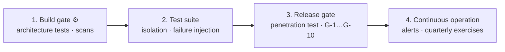

# Security Implementation Checklist

| Field | Value |
| --- | --- |
| Document | Security Implementation Checklist |
| Version | 1.0 |
| Status | Draft — pending security review |
| Owner | Engineering & Security |
| Last updated | 2026-07-30 |
| Audience | Engineering, Security, Operations, QA |
| Phase | 5 — Security Architecture |

---

## 1. Purpose

This is the verification checklist for everything specified in documents 01–14. It exists
so that security implementation is **auditable rather than assumed**.

**Marking convention:**

| Marker | Meaning |
| --- | --- |
| 🔴 | **Release blocker.** General availability does not proceed without it |
| 🟠 | **Required before general availability**, not necessarily before beta |
| 🟡 | Required by the stated release |
| ⚙️ | **Mechanically verified** — a build gate or test enforces it |

---

## 2. Scope

**In scope:** implementation and verification items across backend, frontend,
infrastructure, database, AI Gateway, VS Code Extension, CI/CD, deployment, and operations.

**Out of scope:** the reasoning behind each item — see documents 01–14.

---

## 3. Architecture — the verification model

Verification happens at four points, and an item is assigned to the earliest point that
can catch it. A control verified only at release is a control that has already been built
around.

| Point | Catches | Failure mode if relied on alone |
| --- | --- | --- |
| **Build gate** ⚙️ | Structural violations — layering, tenant discriminators, secrets, licences | Cannot verify runtime behaviour |
| **Test suite** | Behavioural properties — isolation, fail-open/closed, idempotency | Cannot verify production configuration |
| **Release gate** | Whole-system properties — penetration test, unresolved decisions | Too late to be cheap; blocks a date |
| **Continuous operation** | Drift — expired certificates, untested backups, stale vendored code | Depends on the schedule being honoured |

**The sections below are organized by component, not by verification point**, because that
is how implementation work is assigned. The ⚙️ marker identifies which items are
mechanically enforced regardless of section.

---

## 4. Backend

### 4.1 Authentication and session

| | Item | Ref |
| --- | --- | --- |
| 🔴 ⚙️ | Argon2id password hashing; parameters recorded | SD-010 |
| 🔴 | Breach-corpus checking on password set and change | FR-AUTH-002 |
| 🔴 | JWT access tokens, 15-minute lifetime, minimal claims | SD-013 |
| 🔴 | **Permissions are not embedded in tokens** | AD-a |
| 🔴 | **Token type validated as a claim** | AD-b |
| 🔴 | Refresh tokens hashed at rest; rotated on every use | SD-014 |
| 🔴 | **Refresh reuse revokes the family; security event raised** | SD-014 |
| 🟠 | Grace window on rotation, measured against real client behaviour | RT-5 |
| 🔴 | OAuth2 authorization code with PKCE (SHA-256); implicit flow absent | AD-c |
| 🔴 | Exact-match redirect URI allowlist | AD-d |
| 🔴 | OAuth2 state and nonce single-use and validated | §3.4 |
| 🔴 | TOTP MFA; recovery codes hashed, single-use | FR-AUTH-005 |
| 🟠 | Step-up authentication on high-consequence operations | AD-e |
| 🔴 | Three expiry timers: access, idle, absolute | SM-a |
| 🔴 | Idle timeout resets on interaction, **not background traffic** | SM-b |
| 🔴 | Password change revokes all sessions | NFR-SEC-017 |
| 🔴 ⚙️ | **Deprovisioning cascade — generic enumeration by credential type** | SD-008 |
| 🔴 | **Deprovisioning verification job** | SD-008 |
| 🟠 | New-device notification | SM-e |

### 4.2 Authorization

| | Item | Ref |
| --- | --- | --- |
| 🔴 ⚙️ | Deny by default | SD-001 |
| 🔴 | Enforcement in the pipeline **at execution**, not at transport | AZ-d |
| 🔴 ⚙️ | **No authorization code branches on a role name** | AZ-b |
| 🔴 | Effective permission is role **∩** key scope | AZ-c |
| 🔴 | Scope evaluated using only current-Company data | AZ-e |
| 🔴 | **No role reads another Employee's conversation content** | AZ-f |
| 🔴 ⚙️ | Every denial produces an audit event | AZ-g |
| 🔴 ⚙️ | **AT-10** — no repository invoked outside a dispatcher-mediated handler | AT-10 |
| 🔴 ⚙️ | **AT-11** — every SignalR hub method carries an authorization requirement | AT-11 |

### 4.3 Credentials and cryptography

| | Item | Ref |
| --- | --- | --- |
| 🔴 | **No plaintext retrieval path for Provider Credentials exists in code** | SD-003 |
| 🔴 | AES-256-GCM; **provably unique nonces per key** | SD-009 |
| 🔴 | Full authentication tag verification; failure raises a security event | PC-f |
| 🔴 | **Company identifier and DEK version bound into the AAD** | PC-a |
| 🔴 | Per-Company DEK, wrapped by the KEK | PC-b |
| 🔴 | Ciphertext records DEK version **and algorithm identifier** | SD-012, KM-c |
| 🔴 ⚙️ | **Credential material is never a plain string type** | PC-d |
| 🔴 | Rotation drains before destroying the previous credential | PC-e |
| 🔴 | SHA-256 for API key hashing; non-secret lookup prefix | SD-011 |
| 🔴 | Cryptographically secure RNG for every security value | EN-f |
| 🔴 ⚙️ | No forbidden algorithms — MD5, SHA-1, ECB, unauthenticated CBC | §3.1 |
| 🔴 | **Certificate validation never disabled, including in development** | EN-d |

### 4.4 API and application

| | Item | Ref |
| --- | --- | --- |
| 🔴 | Schema validation on all input crossing a trust boundary | NFR-SEC-009 |
| 🔴 ⚙️ | Parameterized queries **including in Analytics** | API-e |
| 🔴 | **Prompt content never interpolated into a query, command, or log** | API-f |
| 🔴 | Rate limiting per Company, Team, and Key; retry guidance included | API-c |
| 🔴 | Aggressive rate limiting on authentication endpoints | NFR-SEC-016 |
| 🟠 | Idempotency keys on mutating operations, Company-scoped | SD-015 |
| 🔴 | CORS allowlist; **no browser origins on the Gateway** | API-b |
| 🔴 | Anti-CSRF on cookie-carried credentials | §3.8 |
| 🔴 | Errors carry no credentials, content, or cross-tenant identifiers | §3.6 |
| 🟠 | Formula injection neutralized in tabular exports | API-g |
| 🔴 | Fail-open / fail-closed classification expressed in the type system | SD-004 |
| 🟠 | Hangfire dashboard authenticated, authorized, audited, not publicly routed | R-4 |

### 4.5 Audit

| | Item | Ref |
| --- | --- | --- |
| 🔴 | **No modification or deletion path for audit records exists in code** | AC-b |
| 🔴 ⚙️ | Audit never sampled under any load condition | SD-005 |
| 🔴 | Emission is a pipeline concern; hot path emits equivalently | AC-c |
| 🔴 ⚙️ | **Shared test suite asserts hot path and pipeline produce equivalent audit outcomes** | ADR-0010 R-3 |
| 🔴 | Audit references content, never contains it | AC-e |
| 🔴 | Audit write failure alerts as an incident | AC-d |
| 🔴 | Retention changes are themselves audited | AC-g |
| 🔴 | Export audited with actor, scope, destination | AC-i |
| 🟡 | Tamper-evidence — v1.1 | NFR-COMP-003 |

---

## 5. Frontend

| | Item | Ref |
| --- | --- | --- |
| 🔴 | **Strict CSP — no `unsafe-inline`, no `unsafe-eval`** | API-a |
| 🔴 | **Model completions sanitized before rendering** | T-15 |
| 🔴 | Access token in memory; **never `localStorage`** | AD-f |
| 🔴 | Refresh token in `HttpOnly`, `Secure`, `SameSite` cookie | AD-f |
| 🔴 | Query keys include the Company identifier | FD-005 |
| 🔴 | **Cache cleared on session change and logout** | SM-f |
| 🔴 | Logout clears Redux state, query cache, and token | SM-f |
| 🔴 | Logout is idempotent and always succeeds visibly | SM-g |
| 🔴 | Client-side validation never the enforcement point | API-j |
| 🔴 | **Server-rendered permission gating is defence in depth only** | AZ-i |
| 🔴 | Permission gating on **permissions**, not role names | T-11 |
| 🔴 | **No secret reachable from a server component into the client bundle** | R-9 |
| 🟠 | Retention disclosure persistent and non-dismissible | FR-CHAT-008 |
| 🟠 | Employee session list shows device metadata | FR-AUTH-008 |
| 🔴 ⚙️ | All security headers applied | NFR-SEC-018 |
| 🟠 ⚙️ | Accessibility audit passing — WCAG 2.1 AA | NFR-USE-001 |

---

## 6. Infrastructure

| | Item | Ref |
| --- | --- | --- |
| 🔴 | TLS current versions only; obsolete disabled; forward-secret suites | NFR-SEC-001 |
| 🔴 | HSTS enabled; **preload staged until the domain strategy is stable** | API-i |
| 🔴 | TLS between application and data tiers | §3.5 |
| 🔴 | **Nginx response buffering disabled on streaming paths** | §5.1 |
| 🔴 | **Nginx timeouts exceed application timeouts** | §5.1 |
| 🔴 | Certificates auto-renewed; **expiry alerting independent of renewal** | EN-e |
| 🔴 | Containers non-root; read-only root filesystem where practical | DP-012 |
| 🔴 | No public SSH; bastion or just-in-time, MFA, audited | NFR-SEC-013 |
| 🔴 | Application VMs not directly addressable | §3.4 |
| 🔴 | **KEK never delivered as an environment variable in production** | SM-c |
| 🔴 | Secrets injected at container start, never baked into images | §3.4 |
| 🔴 | **No secret crosses an environment boundary** | SM-d |
| 🔴 | **No real customer data in non-production environments** | SM-5 |
| 🔴 | **Streams Redis instance has no eviction policy** | §4.2 |
| 🔴 | Redis and PostgreSQL replication with automatic failover | ADR-0022 |
| 🔴 | Backups encrypted, stored separately, access audited | NFR-DR-005 |
| 🔴 | **Backup restoration tested quarterly with recorded results** | NFR-DR-006 |
| 🟠 | Infrastructure defined as code | DD-5 |

---

## 7. Database

| | Item | Ref |
| --- | --- | --- |
| 🔴 ⚙️ | **Row-level security policy on every tenant-scoped relation** | SD-002 |
| 🔴 ⚙️ | Policy created in the **same migration** as the table | S-5 |
| 🔴 ⚙️ | **AT-4** — every tenant-scoped entity carries the discriminator | AT-4 |
| 🔴 | Tenant session variable **set at checkout and cleared at return** | TC-4 |
| 🔴 | **Pooling mode verified compatible with session-scoped RLS** | **DD-2** |
| 🔴 ⚙️ | **Unset-context test: every tenant-scoped relation returns zero rows** | §3.6 |
| 🔴 ⚙️ | Cross-tenant isolation test per relation, every build | NFR-SEC-008 |
| 🔴 ⚙️ | **Elevated-role paths enumerated by architecture test** | AZ-h |
| 🔴 | Every elevated-role use audited | TC-6 |
| 🔴 | Hangfire jobs establish tenant context explicitly | TC-5 |
| 🔴 | Encryption at rest; TLS in transit | NFR-SEC-001/002 |
| 🔴 | Retention by partition drop, never mass deletion | DP-d |
| 🔴 | One schema per module; no cross-module foreign keys | S-4 |
| 🔴 | Migrations backward-compatible with the previous version | S-6 |

---

## 8. AI Gateway

| | Item | Ref |
| --- | --- | --- |
| 🔴 | **Tombstone checked on every cache hit** | SD-007 |
| 🔴 | Cache TTL ceiling ≤ 60 seconds for authorization-relevant state | SD-007 |
| 🔴 | **Tombstone lifetime is twice the TTL ceiling** | AU-004 |
| 🔴 | Cache keys Company-scoped | TS-d |
| 🔴 | **Budget, quota, governance, authorization fail closed** | SD-004 |
| 🔴 | Metering, audit, telemetry fail open — **with alerting** | SD-004 |
| 🔴 | All three record types emitted for **failed** requests | RF-009 |
| 🔴 | Governance evaluated before forwarding | FR-GW-014 |
| 🔴 | Decrypted credential transient; never persisted or cached in plaintext | CR-1, CR-2 |
| 🔴 | DEK cache lifetime bounded and recorded as a security decision | CR-6 |
| 🔴 | Provider TLS validation never disabled | EN-d |
| 🟠 | Idempotency on mutating Gateway operations | SD-015 |
| 🔴 | Correlation identifier propagated and returned | MO-f |
| 🔴 | Mid-stream disconnect still records usage | RF-002 |

---

## 9. VS Code Extension

| | Item | Ref |
| --- | --- | --- |
| 🔴 | OAuth2 with PKCE; **no pasted API key** | XD-001 |
| 🔴 | Refresh credential in `SecretStorage` — OS keychain | XD-002 |
| 🔴 | Access credential in process memory only | XD-002 |
| 🔴 | Credential derived from a **Session**, not a Platform API Key | XD-003 |
| 🔴 | **Webview holds no credentials and makes no network calls** | XD-004 |
| 🔴 | Webview content security policy enforced | R-7 |
| 🔴 | **One shared command pipeline enforcing CTX-1 … CTX-6** | XD-005 |
| 🔴 | **No opportunistic workspace traversal** | CTX-2 |
| 🔴 | Exclusion filters honour workspace ignore configuration | CTX-3 |
| 🟠 | Client-side secret detection — **presented as best-effort only** | CTX-4 |
| 🔴 | **Context disclosed before transmission** | CTX-5 |
| 🔴 | **Governance enforced server-side, not client-side** | XD-009 |
| 🟠 | Version compatibility checked on activation | XD-013 |
| 🔴 | Errors distinguish the developer's problem from the organization's | §7 |

---

## 10. CI/CD

| | Item | Ref |
| --- | --- | --- |
| 🔴 ⚙️ | **Secret scanning build-gating** | NFR-SEC-012 |
| 🔴 ⚙️ | Dependency vulnerability scan; **build fails on unresolved critical** | NFR-SEC-011 |
| 🔴 ⚙️ | **Tenant isolation tests run on every build** | NFR-SEC-008 |
| 🔴 ⚙️ | Architecture tests AT-1 … AT-12 build-gating | ADR-0019 |
| 🔴 ⚙️ | **AT-12** — no dependency violating NFR-PORT-002 | AT-12 |
| 🔴 | **Third-party actions pinned by commit SHA, never by tag** | PM-18 |
| 🔴 | Package source mapping configured | PM-17 |
| 🔴 | Lockfiles committed; CI restores locked | PM-10, PM-11 |
| 🔴 | Deployment credentials least-privilege and rotated | §8.3 |
| 🔴 | Images built once and promoted, never rebuilt per environment | PM-14 |
| 🟠 | **Portable custodian and portable object storage are the CI default** | SM-b, PC-h |
| 🟠 | Licence scan failing on a disallowed class | Gate 2 |
| 🟠 | Container image scanning | R-6 |

---

## 11. Deployment

| | Item | Ref |
| --- | --- | --- |
| 🔴 | Migrations run to completion **before** new containers start | V-18 |
| 🔴 | Failed migration aborts the rollout | V-19 |
| 🔴 | Health checks gate return to rotation | §3.7 |
| 🔴 | Rollback possible without data loss | NFR-PORT-006 |
| 🔴 | **Independent penetration test before general availability** | NFR-SEC-014 |
| 🔴 | **Vulnerability disclosure process published** | NFR-SEC-015 |
| 🔴 | Failure-injection testing of every fail-open and fail-closed classification | X-7 |
| 🟠 | Base images rebuilt on a schedule, independent of code changes | R-7 |
| 🔴 | Runtime **within its support window** | **TD-1** |
| 🟠 | Availability commitment matches the achievable topology | **DD-1** |

---

## 12. Operations

| | Item | Ref |
| --- | --- | --- |
| 🔴 | **Every alert has a runbook before it is enabled** | MO-b |
| 🔴 | P1 security alerts configured and tested | §3.3 |
| 🔴 | **KEK access pattern monitored** | MO-d |
| 🔴 | Cross-tenant access attempt alerts as P1 | §3.3 |
| 🔴 | Elevated-role use outside enumerated paths alerts as P1 | §3.3 |
| 🔴 | **Reconciliation job comparing stream offsets to persisted counts** | AU-8 |
| 🔴 | Incident response process documented | §3.7 |
| 🔴 | **KEK backup created, encrypted, separately stored** | KB-1, KB-2 |
| 🔴 | **KEK restore procedure documented AND TESTED** | **KB-3** |
| 🔴 | **Key escrow with split custody established** | **KB-5** |
| 🔴 | Recovery invocation alerts immediately and unconditionally | KM-g |
| 🟠 | Key rotation exercised quarterly, not only when needed | KM-h |
| 🟠 | Custodian succession plan documented and verified | §6 |
| 🟠 | Subprocessor list published | NFR-COMP-005 |
| 🟠 | Anomaly detection running in observe mode | MO-c |

---

## 13. Release gates

**General availability does not proceed with any of these unresolved.**

| # | Gate | Blocking decision |
| --- | --- | --- |
| **G-1** | Tenant isolation ratified; **pooling mode verified** | **D-1, DD-2** |
| **G-2** | **KEK backup and restore procedure tested; escrow established** | **D-6 / KB-3, KB-5** |
| **G-3** | Runtime within its support window | **TD-1** |
| **G-4** | Availability commitment matches the achievable topology | **DD-1** |
| **G-5** | Gateway behaviour during a Redis outage decided and documented | **D-3** |
| **G-6** | Ingestion durability position resolved and honestly stated | **D-2** |
| **G-7** | Independent penetration test completed; critical findings resolved | NFR-SEC-014 |
| **G-8** | Vulnerability disclosure process live | NFR-SEC-015 |
| **G-9** | Zero cross-tenant exposures in testing | S-11 |
| **G-10** | Zero usage or audit records lost in testing | S-9, S-10 |

**G-9 and G-10 are pass/fail, not targets.** Any non-zero value blocks release regardless
of every other result.

---

## 14. Design decisions

| # | Decision | Rationale |
| --- | --- | --- |
| CL-a | **Items marked ⚙️ wherever a mechanical check is possible** | A checklist item depending on memory is not a control |
| CL-b | **Release gates separated from ordinary items** | Some items block; most inform |
| CL-c | **Every item references its source** | A checklist without reasoning becomes cargo cult |
| CL-d | **G-9 and G-10 are pass/fail with no tolerance** | Cross-tenant exposure and ledger loss admit no partial credit |

---

## 15. Trade-offs

| # | Gained | Given up |
| --- | --- | --- |
| T-1 | Comprehensive coverage | Length; risk of checklist fatigue |
| T-2 | Mechanical verification where possible | CI time; more gates to maintain |
| T-3 | Explicit release gates | Some will be contested under schedule pressure |
| T-4 | Source references throughout | Requires the referenced documents to stay accurate |

---

## 16. Security considerations

**A checklist is a control with its own failure modes**, and they are worth stating.

| Concern | Handling |
| --- | --- |
| **Completion is asserted rather than evidenced** | Convert to a per-release verification record (§17). A SOC 2 examination asks for evidence, not assertion |
| **Items skipped silently under schedule pressure** | Exceptions require a recorded reason and a named owner; a silent skip is indistinguishable from an oversight |
| **Checklist fatigue** | The 🔴/🟠/🟡 marking exists so the blocking items stay findable in a long document |
| **Cargo-cult compliance** | Every item references its source, so the reasoning is one link away |
| **Drift between checklist and architecture** | This document derives from 01–14; a change there requires a change here |
| **False confidence from ⚙️ items** | A mechanical check verifies what it was written to verify, not the intent behind it. Architecture tests can pass while a boundary is meaningfully broken |
| **Release gates contested at the deadline** | G-1 … G-10 are recorded now, before schedule pressure exists, precisely so the argument happens early |

**The last row matters most.** Every release gate here will be questioned when a date is at
risk. Recording them in advance — with reasoning attached — makes that conversation about
accepting a stated risk rather than discovering one.

---

## 17. Future improvements

- **Automate more items.** Every ⚙️ added is a control that stops depending on attention.
  The highest-value candidates are permission-gating patterns, credential typing, and
  vendored-component drift.
- **Convert this into a per-release verification record**, so completion is evidenced rather
  than asserted — which is also what a SOC 2 examination will ask for.
- **Add per-feature security review checkpoints**, so verification is continuous rather than
  a pre-release event.
- **Track exceptions explicitly** — an item skipped with a recorded reason and an owner is
  manageable; an item silently skipped is not.
- **Prune annually.** An item that has never caught anything in a year is a candidate for
  removal; a checklist that only grows stops being read.

---

## 18. Cross references

| Document | Relationship |
| --- | --- |
| [01 — Security Overview](01-security-overview.md) | SD-001 … SD-018 |
| [02](02-authentication-architecture.md) – [14](14-security-monitoring.md) | Source of every item |
| [13 — Threat Model](13-threat-model.md) | Residual risks these verify |
| [`../04-technology/coding-standards.md`](../04-technology/coding-standards.md) | 🔒 rules overlapping ⚙️ items |
| [`../02-architecture/backend-architecture-overview.md`](../02-architecture/backend-architecture-overview.md) | §8 architecture tests |
| [`../03-adr/ADR-0019-github-actions.md`](../03-adr/ADR-0019-github-actions.md) | Build gates |
| [`../01-product/mvp-features.md`](../01-product/mvp-features.md) | §7 definition of done |
