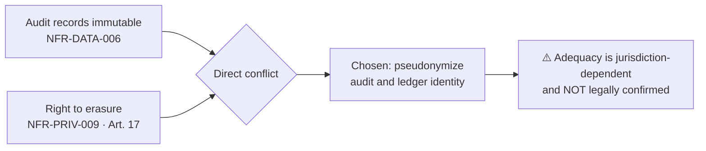

# Compliance

| Field | Value |
| --- | --- |
| Document | Compliance Readiness |
| Version | 1.0 |
| Status | Draft — **two known blockers; erasure position legally unconfirmed** |
| Owner | Security, Compliance & Legal |
| Last updated | 2026-07-30 |
| Audience | Security, Compliance, Legal, Engineering, Leadership |
| Phase | 5 — Security Architecture |

---

## 1. Purpose

This document states MaintOrbit AI's readiness against SOC 2, ISO 27001, GDPR, and the OWASP
standards, and specifies the underlying policies: data classification, PII handling,
retention, erasure, audit, logging, passwords, MFA, and vendor risk.

**Compliance is a sales gate for this product, not only an obligation.** Enterprise buyers
ask for an AI data-flow inventory and a subprocessor list before they buy. The security lead
who evaluates the platform (persona P-06) treats an unsupported runtime or a sampled audit
trail as disqualifying — so readiness gaps here have direct commercial consequences.

---

## 2. Scope

**In scope:** framework readiness, control mapping, and the data governance policies that
support them.

**Out of scope:** certification itself (an external process); customer obligations as data
controller; PCI DSS, which is **out of scope by design** because card data never transits or
is stored by the platform (NFR-COMP-007); the technical implementation of each control, which
is in [`security-architecture.md`](security-architecture.md).

---

## 3. Framework readiness

| Framework | Target | Release | Status |
| --- | --- | --- | --- |
| **SOC 2 Type II** | Control documentation sufficient for examination | v1.1 | ⚠️ **Two blockers** |
| **ISO 27001** | Certification requirements supported | v2.0 | Planned |
| **GDPR** | Readiness, not certification | Ongoing | ⚠️ **Erasure unconfirmed** |
| **OWASP ASVS** | Level 2 target, Level 3 for credential handling | GA | Partial |
| **OWASP Top 10** | All categories addressed | GA | Substantially addressed |
| PCI DSS | **Out of scope by design** | — | Card data never held |

---

## 4. SOC 2

### 4.1 Trust services criteria mapping

| Criterion | Evidence in the architecture | Status |
| --- | --- | --- |
| **CC6.1** Logical access | RBAC, deny by default, MFA, role ∩ key scope | ✅ |
| **CC6.2** Registration and authorization | Invitation flow, verified email, role assignment audited | ✅ |
| **CC6.3** Access removal | **Deprovisioning cascade with a verification job** | ✅ |
| **CC6.6** Boundary protection | Seven trust boundaries; TLS; private networking | ✅ |
| **CC6.7** Data transmission | TLS everywhere; validation never disabled | ✅ |
| **CC6.8** Malicious software | Dependency and image scanning build-gating | ✅ |
| **CC7.1** Vulnerability detection | Build-gating scans; penetration test before GA | ⚠️ Test not yet performed |
| **CC7.2** Monitoring | Security alerts with runbooks; anomaly detection | ✅ |
| **CC7.3** Incident evaluation | Incident response process; P1–P4 severity | ✅ |
| **CC7.4** Incident response | Containment mechanisms already in the architecture | ✅ |
| **CC8.1** Change management | ADRs; build gates; migration review; expand-and-contract | ✅ |
| **CC9.2** Vendor management | Subprocessor inventory; dependency policy | ⚠️ List not published |
| **A1.1 / A1.2** Availability | ⚠️ **Blocked** | ⚠️ |
| **C1.1 / C1.2** Confidentiality | Classification, encryption, retention, disposal | ✅ |
| **P-series** Privacy | Content off by default; erasure; access | ⚠️ Erasure unconfirmed |

### 4.2 The two blockers

**Both are already identified in earlier phases and both are cheap to fix now.**

| # | Blocker | Why it fails an examination |
| --- | --- | --- |
| **B-1** | **The specified runtime is outside its support window** | An unsupported runtime receives no security patches. This is a straightforward finding under CC7.1 and is the kind of issue an auditor identifies immediately |
| **B-2** | **A single-VM deployment cannot meet the stated availability target** | Committing to an availability figure the topology cannot deliver fails A1. The published figure must match the achievable figure |

**Neither is a security design flaw.** Both are decisions made in earlier phases that were not
checked against their consequences — which is precisely what a compliance review exists to
catch.

### 4.3 What is needed beyond the architecture

| Requirement | Status |
| --- | --- |
| Documented policies — access, change, incident, vendor, risk | Partially, in this document set |
| **Evidence of operation**, not only design | ⚠️ Requires a per-release verification record |
| Independent penetration test | ⚠️ Before GA (NFR-SEC-014) |
| Vulnerability disclosure process | ⚠️ Before GA (NFR-SEC-015) |
| Quarterly restoration testing with recorded results | ⚠️ Not yet performed |
| Security awareness training | ⚠️ Not established |
| Risk assessment process | Threat model; risk registers throughout |

**"Evidence of operation" is the distinction most often underestimated.** SOC 2 Type II asks
whether controls *operated effectively over a period*, not whether they were designed. A
checklist marked complete is an assertion; a dated verification record with an owner is
evidence.

---

## 5. ISO 27001

Targeted at v2.0. ISO 27001 differs from SOC 2 in kind: it requires an **information security
management system** — a governance commitment — not only a control set.

| Annex A domain | Position |
| --- | --- |
| A.5 Organizational controls | Policies exist in documentation; **formal ownership and review cadence not yet established** |
| A.6 People controls | ⚠️ Screening, training, and disciplinary process not established |
| A.7 Physical controls | Inherited from the hosting provider |
| A.8 Technological controls | Substantially covered by the security architecture |

**The gap is organizational, not technical.** The A.8 technological controls are largely
addressed. A.5 and A.6 — risk treatment, management review, competence, awareness — require
processes and named owners that do not yet exist. This should be understood before committing
to a v2.0 date: ISO 27001 is a management-system programme, not an engineering deliverable.

---

## 6. GDPR readiness

| Obligation | Position | Status |
| --- | --- | --- |
| Roles | Customer is controller; platform is **processor** | ✅ |
| Lawful basis | Customer's responsibility | ✅ |
| **Data minimization** | **Content off by default** — most value comes from metadata | ✅ **Strong** |
| Purpose limitation | Content **never used to train any model** (NFR-PRIV-003) | ✅ |
| Storage limitation | Configurable retention with automated deletion | ✅ |
| Integrity and confidentiality | Encryption, isolation, access control | ✅ |
| **Subprocessors** | Documented; advance notice of change (NFR-COMP-005) | ⚠️ **AI provider relationship needs legal characterization** |
| Access (Art. 15) | Export of all data about an identified Employee (NFR-PRIV-008) | ✅ |
| **Erasure (Art. 17)** | **Pseudonymization of audit records** | ⚠️ **Legally unconfirmed** |
| Portability (Art. 20) | Machine-readable export | ✅ |
| Records of processing (Art. 30) | Data-flow reporting (v1.1) | ⚠️ v1.1 |
| Breach notification (Art. 33/34) | Incident response; **customer contact model must exist before it is needed** | ⚠️ Partial |
| DPIA support | Threat model; data-flow documentation | ✅ |
| Transfers | Data residency at v2.1 | ⚠️ v2.1 |

### 6.1 Content off by default is the strongest position the platform has

It was an architectural choice rather than a compliance one, and it happens to be the single
most effective privacy control available: **the highest-sensitivity data is simply not held**
unless a customer explicitly opts in per Team. Conversation content may contain arbitrary
personal data about employees and third parties, and the platform cannot inspect it to find
out — so the response is not to retain it.

### 6.2 The erasure tension — stated, not resolved

Complete deletion destroys audit integrity — a core product promise and a compliance
obligation in its own right. Retaining identified records conflicts with an erasure right.

**Pseudonymization is defensible and is not confirmed.** It is recorded as an open decision
rather than presented as settled. **Backups compound it:** an erasure request cannot
practically rewrite historical backups, and the standard position — erasure applies to live
systems while backups age out under retention — needs the same legal confirmation.

### 6.3 The AI provider subprocessor question

The customer supplies their own provider credentials and holds the provider relationship, but
the platform transmits their data to that provider on their behalf. **Whether that makes us a
subprocessor, a conduit, or something else is a legal question with contractual
consequences** — and it will be asked in the first enterprise security review.

---

## 7. OWASP ASVS

Target: **Level 2** generally, **Level 3** for credential handling given the asset ranking.

| ASVS chapter | Position |
| --- | --- |
| V1 Architecture | Threat model; documented boundaries; security design decisions |
| V2 Authentication | Argon2id; breach-corpus checking; MFA; rate limiting; lockout |
| V3 Session management | Short access tokens; rotation with reuse detection; device sessions; revocation |
| V4 Access control | Deny by default; enforcement at execution; role ∩ key scope; denials audited |
| V5 Validation and encoding | Allowlist schema validation; parameterized queries; **model completions sanitized** |
| V6 Cryptography | AES-256-GCM; unique nonces; envelope encryption; versioned keys |
| V7 Error handling and logging | Structured logs; no credentials or content; correlation; unsampled audit |
| V8 Data protection | Four-level classification; content off by default; retention; erasure |
| V9 Communications | TLS everywhere; validation never disabled; HSTS |
| V10 Malicious code | Dependency and image scanning; SHA-pinned actions; source mapping |
| V11 Business logic | **Idempotency keys**; budget and quota enforcement fail closed |
| V12 Files and resources | Content-verified allowlist; object storage; signed URLs; scanning |
| V13 API | Rate limiting; CORS allowlist; specification security |
| V14 Configuration | Secrets never in source or images; environment separation; secret scanning |

**Level 3 for credential handling** is claimed on the basis of envelope encryption, per-tenant
key scoping, no retrieval path, and non-string credential typing. **It should be verified by
the independent penetration test rather than asserted here.**

---

## 8. OWASP Top 10

| # | Category | Primary mitigation |
| --- | --- | --- |
| **A01** Broken access control | Deny by default; enforcement at execution; **row-level security below every query**; denials audited |
| **A02** Cryptographic failures | AES-256-GCM; Argon2id; TLS everywhere; **application-layer encryption for credentials** |
| **A03** Injection | Parameterized queries including Analytics; **prompt content never interpolated**; completions sanitized |
| **A04** Insecure design | Threat model; seven boundaries; fail-open/closed classification; security as a design input |
| **A05** Security misconfiguration | Security headers; strict CSP; non-root containers; **no secret in source or images** |
| **A06** Vulnerable components | Build-gating scans; lockfiles; SHA-pinned actions; ⚠️ **vendored components are the weak point** |
| **A07** Identification and authentication | MFA; breach-corpus checking; rotation with reuse detection; triple-redundant revocation |
| **A08** Software and data integrity | Immutable image promotion; source mapping; ⚠️ **build provenance not yet implemented** |
| **A09** Logging and monitoring | Unsampled audit; security alerts with runbooks; correlation; anomaly detection |
| **A10** Server-side request forgery | Provider endpoints from a validated catalogue; ⚠️ **customer-hosted endpoints (v1.2) need explicit SSRF controls** |

**Two rows carry real gaps.** A06's weak point is vendored components, which appear in no
scan. A10 becomes materially harder at v1.2 when customers can configure their own
OpenAI-compatible endpoints — a customer-supplied URL that the platform then calls is an SSRF
vector by construction, and it needs allowlisting, network egress restriction, and metadata
endpoint blocking designed before that feature ships.

---

## 9. Data classification

| Level | Definition | Examples | Handling |
| --- | --- | --- | --- |
| **C4 Critical** | Compromise is existential | Provider Credentials, KEK, signing keys | Envelope encryption; no retrieval path; **never logged**; never leaves production |
| **C3 Confidential** | Reportable breach | Prompt and completion content, attachments | **Off by default**; opt-in per Team; **never logged**; retention-bounded |
| **C2 Internal** | Damaging but bounded | Usage, cost, audit, org structure, session and device metadata | Tenant-isolated; encrypted at rest; identifiers only in logs |
| **C1 Public** | No confidentiality requirement | Model catalogue, published pricing | Integrity only |

| Rule | C4 | C3 | C2 | C1 |
| --- | --- | --- | --- | --- |
| In logs or telemetry | **Never** | **Never** | Identifiers only | ✅ |
| In error messages | **Never** | **Never** | Own-tenant only | ✅ |
| Leaves production | **Never** | **Never** | Exports only | ✅ |
| Application-layer encryption | ✅ | Candidate | — | — |

**C3 and C4 are absent from logs by construction, not masked.** Masking is applied after the
fact and is inevitably incomplete — it depends on someone having anticipated every path.
Credential material is never a plain string type, so it cannot be interpolated into a log
message.

---

## 10. PII handling

| Category | Class | Notes |
| --- | --- | --- |
| Employee identity — name, email | C2 | Necessary for the service |
| Authentication credentials | C4 | Hashed; never recoverable |
| **Session and device metadata** — address, coarse location, client | C2 | **Personal data**; bounded retention; **visible to the Employee** |
| **Conversation content** | **C3** | May contain arbitrary personal data by nature |
| Usage attribution | C2 | Personal data in employment contexts |
| Billing contact details | C2 | |
| Audit actor records | C2 | **Pseudonymized on erasure, not deleted** |

**Session and device metadata is personal data about employees, retained for a security
purpose.** Consistent with the principle that the monitored are told what is monitored, it is
visible to the Employee in their own session list.

**Conversation content is the hardest category** and the reason content retention is off by
default: the platform cannot know what personal data an employee typed, so it does not keep it
unless asked to.

---

## 11. Retention policy

| Data | Default | Configurable | Mechanism |
| --- | --- | --- | --- |
| Prompt and completion content | **Not retained** | Per Team | Automated deletion |
| Conversation structure | Company-configured | ✅ | Automated |
| Usage and Cost Records | Company-configured, documented default | ✅ | **Partition drop** |
| **Audit Events** | **≥ 12 months** | ✅ | Partition drop |
| Decision Records | Shorter — high volume, low access | ✅ | Partition drop |
| Session and device metadata | Bounded | — | Automated |
| Deleted Company | Grace period, then destruction | — | — |

**Retention changes are themselves audited.** Shortening a retention period is a
compliance-relevant act — potentially an attempt to destroy evidence — and must be
attributable.

**Deletion is by partition drop, never mass deletion.** Deleting hundreds of millions of rows
produces bloat, sustained write load, and a vacuum burden.

**Tiered storage preserves completeness affordably.** Aged partitions move to compressed,
less-indexed storage and remain complete and queryable at higher latency. Sampling would
reduce cost too, and is excluded.

---

## 12. Right to erasure

| Record type | Treatment |
| --- | --- |
| Conversations and content | **Hard deleted** |
| Profile, session, device metadata | **Hard deleted** |
| Usage and Cost Records | **Identity pseudonymized**; ledger integrity preserved |
| Audit Events | **Identity pseudonymized**; record retained |

**Requirements:** export of all data about an identified Employee (NFR-PRIV-008); deletion of
all data relating to them, **excluding records required for audit integrity, which are
pseudonymized instead** (NFR-PRIV-009).

**Legal hold** (v1.1) suspends automated deletion within its scope. Access to retained content
requires a separately authorized, separately audited process; no role grants content access
through the standard interface, and designated parties are notified. **Who may authorize a
hold is an open legal and product decision.**

**⚠️ The pseudonymization position requires legal confirmation**, including its interaction
with backups. See §6.2.

---

## 13. Audit requirements and security logging

**Three record types, never conflated:**

| Type | Guarantees | Retention |
| --- | --- | --- |
| **Audit Event** | **Immutable · never sampled** | ≥ 12 months |
| **Usage Record** | **Immutable · never sampled** | Company-configured |
| **Decision Record** | Complete per request | Shorter |
| *Application log* | *Best-effort, may be sampled* | *Short* |

**Audit implemented as log entries inherits log sampling and retention**, silently failing the
completeness requirement. Separate store, separate guarantees, separate code path.

**Audited:** authentication; **every authorization denial**; sessions; provider credential
lifecycle; key access, backup access, and recovery invocation; configuration changes;
organizational changes; data access and exports; governance actions; billing; and security
events.

**Guarantees:** append-only with no modification or deletion path in code; never sampled;
actor, action, target, outcome, timestamp, context; **never contains content** — references it
only; searchable and exportable; retention changes audited; **a write failure is an incident**.

**Security logging constraints:** structured format; no credentials, tokens, or content;
correlation identifier propagated and returned to the caller; no cross-tenant identifiers;
vendor-neutral, self-hostable backend.

---

## 14. Password policy

| Control | Requirement |
| --- | --- |
| Hashing | **Argon2id**, parameters recorded and **reviewed annually** |
| Strength | Configurable policy per Company |
| **Breach checking** | **Checked against known-compromised credential lists** (FR-AUTH-002) |
| Rate limiting | Per account and per source (NFR-SEC-016) |
| Lockout | After configurable failures, **with holder notification** |
| Reset | Single-use, time-limited token via verified email |
| Change | **Revokes all sessions** (NFR-SEC-017) |
| Disablement | A Company may disable password authentication entirely (FR-AUTH-004) |
| Storage | Hash only; never recoverable, never logged |

**Breach-corpus checking is more valuable than complexity rules.** A password that is long,
unique, and not in a breach corpus is stronger than one that satisfies a character-class rule
and has appeared in a dump. Argon2id parameters are reviewed annually because hardware
improvement erodes them.

---

## 15. MFA readiness

**MFA is an MVP capability, not merely "MFA-ready."**

| Control | Status |
| --- | --- |
| TOTP | **MVP** (FR-AUTH-005) |
| Company-mandated for all Employees or specified roles | **MVP** (FR-AUTH-006) |
| Recovery codes — hashed, single-use | MVP |
| Replay prevention within the code window | MVP |
| Rate limiting on verification | MVP |
| **Step-up on high-consequence operations** | Recommended for MVP |
| Hardware security keys | v2.0 (FR-AUTH-020) |

**Step-up applies to:** creating or rotating a Provider Connection, changing Company
authentication policy, transferring ownership, enabling content retention, and terminating
another Employee's sessions.

**TOTP is phishable and hardware keys are the real answer.** This should be stated to
customers rather than implied otherwise — phishing remains a medium residual risk until v2.0.

---

## 16. Vendor risk

### 16.1 Subprocessors

| Service | Processes customer data? | Subprocessor? |
| --- | --- | --- |
| **AI providers** | **Yes — prompt content** | ⚠️ **Needs legal characterization** |
| Payment processor | Billing data | Yes |
| Email delivery | Addresses, notification content | Yes |
| Cloud hosting | All data at rest | Yes |
| OAuth2 providers | Identity assertions only | Likely yes |
| Source hosting and CI | No customer data | No |
| Telemetry backend | Metadata only; **never content or credentials** | Depends on backend |

**A published subprocessor list is required before enterprise sales** and should be prepared
before it is requested. NFR-COMP-005 requires advance notice of changes — a contractual
obligation, not an internal note.

### 16.2 Dependency risk

| Class | Verdict |
| --- | --- |
| Permissive — MIT, Apache 2.0, BSD, ISC | ✅ Accept |
| Weak copyleft — LGPL, MPL | ⚠️ Legal review before redistribution |
| Strong copyleft — GPL, AGPL | ❌ Reject for shipped code |
| Source-available — SSPL, BUSL, RSAL | ❌ Reject for shipped code |
| Unlicensed or unclear | ❌ Reject |

**Copyleft and source-available licences are rejected for shipped code because of self-hosted
deployment.** A purely hosted service would face a lighter analysis — which is exactly why the
gate must be applied now, before self-hosting is close enough to be inconvenient.

**Ongoing controls:** build-gating vulnerability scanning; **semi-annual licence
re-verification** (licences change — two dependencies already have); per-release necessity
review; quarterly maintenance-health review for critical small dependencies.

**⚠️ Vendored components appear in no dependency scan, no vulnerability report, and no
upgrade notification.** They are the weakest link in the supply chain and rely entirely on a
scheduled review being performed.

---

## 17. Design decisions

| # | Decision | Rationale |
| --- | --- | --- |
| CP-a | **Four-level data classification** | Without one, "sensitive data" is undefined and controls cannot be assigned |
| CP-b | **Content off by default** | The most effective privacy control available: the data is not held |
| CP-c | **C3 and C4 absent from logs by construction, not masked** | Masking after the fact is inevitably incomplete |
| CP-d | **Erasure pseudonymizes audit records** | Preserves integrity; ⚠️ legally unconfirmed |
| CP-e | **Retention changes are audited** | Shortening retention is compliance-relevant |
| CP-f | **Three record types never conflated** | Audit-as-logs inherits sampling and silently fails |
| CP-g | **PCI DSS out of scope by design** | Card data never transits or is stored |
| CP-h | **Breach-corpus checking over complexity rules** | More effective against real attacks |
| CP-i | **Copyleft and source-available rejected for shipped code** | Self-hosted redistribution |
| CP-j | **Known blockers stated rather than deferred** | An auditor finds them anyway; a customer finds them worse |

---

## 18. Risks

| # | Risk | Severity | Status |
| --- | --- | --- | --- |
| C-1 | **Unsupported runtime fails CC7.1** | High | ⚠️ **Blocker B-1** |
| C-2 | **Availability commitment exceeds the achievable topology** | High | ⚠️ **Blocker B-2** |
| C-3 | **Erasure position rejected by a supervisory authority** | High | ⚠️ Legally unconfirmed |
| C-4 | AI provider subprocessor status unresolved at the first enterprise review | Medium | ⚠️ Legal input needed |
| C-5 | Evidence of operation absent — design documented, operation not recorded | High | Requires a verification record |
| C-6 | Penetration test finds issues late | Medium | Schedule before GA, not at GA |
| C-7 | ISO 27001 treated as an engineering deliverable rather than a management system | Medium | §5 |
| C-8 | Vendored component vulnerability undetected | Medium | Scheduled review only |
| C-9 | **SSRF via customer-hosted endpoints at v1.2** | Medium | ⚠️ Controls not yet designed |
| C-10 | Legal hold left open indefinitely, defeating retention policy | Low | Bounded scope; explicit termination |

---

## 19. Trade-offs

| # | Gained | Given up |
| --- | --- | --- |
| T-1 | Content off by default | Weaker product analytics; quality features need opt-in |
| T-2 | Never sampling audit | Storage cost growing monotonically |
| T-3 | Pseudonymized erasure | Not deletion; jurisdiction-dependent |
| T-4 | No administrative access to conversations | Customers expecting administrative omniscience must be told no |
| T-5 | Strict licence policy | Some capable dependencies excluded |
| T-6 | Long default audit retention | Larger exposure if the audit store is compromised |
| T-7 | Stating blockers openly | Uncomfortable in a sales conversation; far better than being found |

---

## 20. Future improvements

- **Per-release verification record** — converts design evidence into operating evidence, which
  is what a Type II examination requires.
- **Published subprocessor list and security posture statement** — required before enterprise
  sales.
- **Data-flow reporting** (v1.1) — which Teams sent data to which providers, generated rather
  than hand-maintained. Directly answers the questionnaire that blocks enterprise deals.
- **Tamper-evident audit** (v1.1) — hash chaining. The claim is tamper-**evident**, not
  tamper-proof.
- **Continuous audit streaming into customer SIEM** (v1.1).
- **PII detection** (v1.1) — held until accuracy characteristics can be published; shipping
  weak detection under a governance label would be a liability.
- **Legal hold implementation** (v1.1).
- **Data residency** (v2.1).
- **SSRF controls for customer-hosted endpoints** — needed before v1.2.
- **Security awareness training and a formal risk treatment process** — ISO 27001 prerequisites.
- **Automated lifecycle checking** — would have caught blocker B-1 mechanically.

---

## 21. Cross references

| Document | Relationship |
| --- | --- |
| [`security-architecture.md`](security-architecture.md) | Controls implementing these obligations |
| [`threat-model.md`](threat-model.md) | Risk analysis underlying the controls |
| [`security-checklist.md`](security-checklist.md) | Verification items |
| [`../04-technology/dependency-policy.md`](../04-technology/dependency-policy.md) | Licence gates and review cadence |
| [`../04-technology/third-party-services.md`](../04-technology/third-party-services.md) | Subprocessor inventory |
| [`../04-technology/support-lifecycle.md`](../04-technology/support-lifecycle.md) | Blocker B-1 |
| [`../02-architecture/deployment-architecture.md`](../02-architecture/deployment-architecture.md) | Blocker B-2 |
| [`../01-product/non-functional-requirements.md`](../01-product/non-functional-requirements.md) | NFR-COMP-001 … 010, NFR-PRIV-001 … 014 |
| [`../01-product/mission.md`](../01-product/mission.md) | §6 honesty about limitations |
