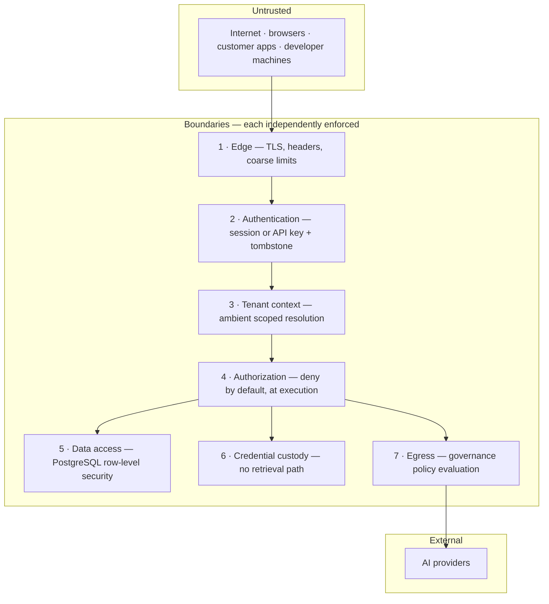
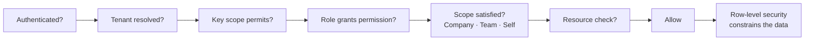
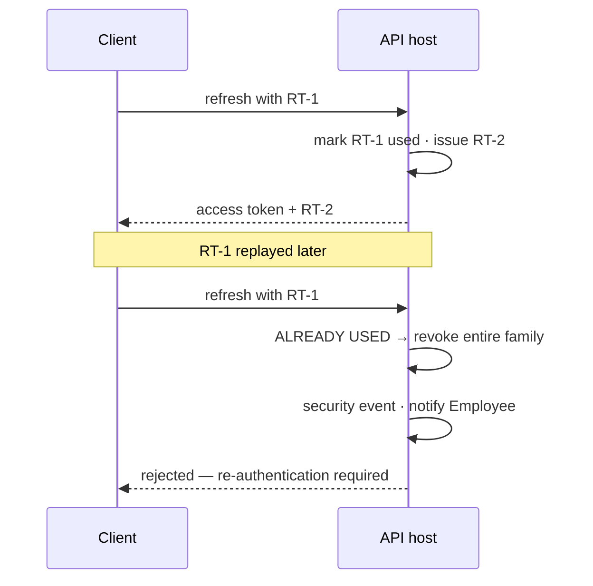
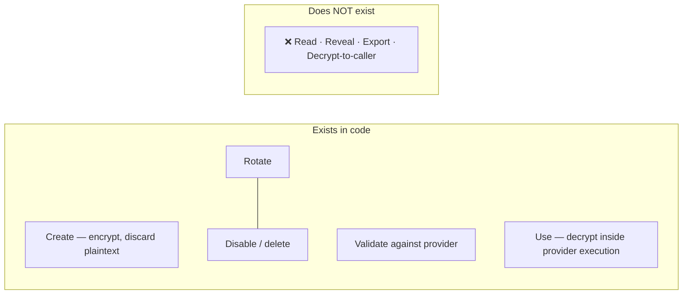
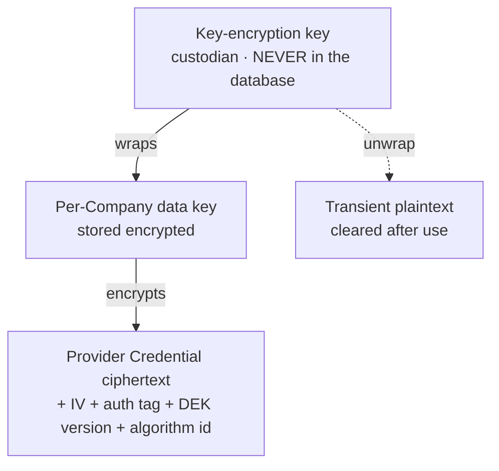
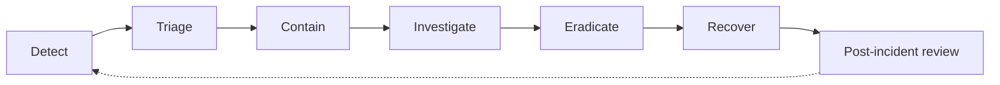

# Security Architecture

| Field | Value |
| --- | --- |
| Document | Security Architecture (master, consolidated) |
| Version | 1.0 |
| Status | Draft — four decisions unresolved; see §36 |
| Owner | Engineering & Security |
| Last updated | 2026-07-30 |
| Audience | Engineering, Security, Compliance, Architecture Review, Leadership |
| Phase | 5 — Security Architecture |

---

## Contents

| § | Section | § | Section |
| --- | --- | --- | --- |
| 1 | Purpose | 19 | Encryption in transit |
| 2 | Scope | 20 | Database security |
| 3 | Security principles | 21 | PostgreSQL security |
| 4 | Zero trust architecture | 22 | Redis security |
| 5 | Assets and trust boundaries | 23 | AI Gateway security |
| 6 | Authentication | 24 | REST API security |
| 7 | Authorization | 25 | SignalR security |
| 8 | RBAC | 26 | Hangfire security |
| 9 | Multi-tenant security | 27 | VS Code Extension security |
| 10 | JWT strategy | 28 | File upload security |
| 11 | OAuth2 | 29 | Logging |
| 12 | PKCE | 30 | Audit trail |
| 13 | Future SSO | 31 | Security monitoring |
| 14 | Session management | 32 | Incident response |
| 15 | Refresh token rotation | 33 | Backup security |
| 16 | Provider credential protection | 34 | Disaster recovery |
| 17 | Envelope encryption · Key Vault · secrets | 35 | Design decisions · risks · trade-offs |
| 18 | Encryption at rest | 36 | Open decisions · future · cross references |

---

## 1. Purpose

This is the single authoritative security document for MaintOrbit AI. It specifies every
security control across every component, the reasoning behind each, and — deliberately —
the gaps that are not yet closed.

**Why this platform's security posture is unusual.** MaintOrbit AI stores its customers'
AI provider credentials: secrets carrying direct spend authority and an unrestricted data
egress channel. It sits in the request path of customers' production systems. It holds a
record of what their employees asked AI models. A compromise is simultaneously a financial
incident, a data breach, and a breach of every customer at once.

The product exists to solve credential sprawl
([`../01-product/problem-statement.md`](../01-product/problem-statement.md) §3.1).
Reproducing that problem in our own system would be the defining failure.

---

## 2. Scope

**In scope:** security architecture for authentication, authorization, multi-tenant
isolation, provider credential custody, the AI Gateway, REST API, VS Code Extension, web
frontend, SignalR, Hangfire, PostgreSQL, Redis, object storage, Docker, and CI/CD.

**Out of scope**, and stated plainly because a security review will ask:

| Excluded | Reason |
| --- | --- |
| Traffic bypassing the platform | The platform governs what passes through it |
| Customer endpoint and network security | Not our boundary |
| AI provider internal security | Assessed as a subprocessor; not controlled |
| **Prompt injection** | Manipulates *model* behaviour, not platform behaviour. Our obligation is that injected content cannot reach our systems as executable input |
| Model output correctness | A product concern |
| Misuse by authorized employees | Detected and audited, not prevented |
| Physical infrastructure security | Inherited from the hosting provider |

**Requirements traced:** NFR-SEC-001…020, NFR-PRIV-001…014, NFR-COMP-001…010, plus
FR-AUTH, FR-PERM, FR-PROV-004/016, FR-GOV, FR-AUD.

---

## 3. Security principles

| # | Principle | Practical consequence |
| --- | --- | --- |
| **P-1** | **Assume any single control fails** | No high-rank asset is protected by one mechanism |
| **P-2** | **Fail safe, and make failure visible** | Missing tenant context returns nothing, loudly |
| **P-3** | **Structure over discipline** | Where a control can be enforced by types or tests, it is. A control requiring developers to remember is not a control |
| **P-4** | **Least privilege, including our own** | The elevated database role is restricted to named, audited paths |
| **P-5** | **Honest about limitations** | Stated tolerances and known gaps, not marketing claims |
| **P-6** | **Security is a design input, not a release gate** | Threat modelling during design |
| **P-7** | **The monitored are told what is monitored** | Employees see what their Company can observe |

**P-5 is not decoration.** The security lead who evaluates this platform (persona P-06)
detects overstatement reliably and treats it as disqualifying. Every stated gap in this
document — the untested key backup, the pooling question, the erasure tension, the
ingestion durability window — is recorded because concealing it would be both wrong and
commercially self-defeating.

---

## 4. Zero trust architecture

**No request is trusted because of where it came from.** Network position confers nothing:
an internal call from the Worker host receives the same verification as a request from the
public internet.

| Zero trust tenet | Implementation here |
| --- | --- |
| **Verify explicitly, every request** | Authentication and authorization evaluated per request, never cached as a trust decision. Permissions are **not** embedded in tokens — they are resolved server-side each time |
| **Least privilege** | Deny by default; role ∩ key scope; application database role cannot bypass row-level security |
| **Assume breach** | Seven independent boundaries; envelope encryption so a database compromise yields ciphertext; complete audit trail for reconstruction |
| **No implicit network trust** | TLS between every tier; application VMs not publicly addressable; no service trusted by origin |
| **Continuous verification** | 60-second cache TTL ceiling on authorization state; tombstones make revocation immediate |
| **Micro-segmentation** | Module boundaries enforced by architecture tests; tenant boundary enforced below the application |

**Where the model is genuinely tested:** the Gateway serves authentication from cache to
meet a 15 ms latency budget. That is a cached *fact*, not a cached trust decision — and the
tombstone mechanism (§15) exists precisely so the cached fact cannot outlive the truth.

---

## 5. Assets and trust boundaries

### 5.1 Assets ranked by consequence

Security investment follows this ranking. It is explicit because a programme that treats
all assets equally under-protects the ones that matter.

| Rank | Asset | Consequence of compromise |
| --- | --- | --- |
| **1** | **Provider Credentials** | **Existential** — spend authority plus data egress, every customer at once |
| **2** | **Key-encryption key (KEK)** | Unlocks rank 1 for all tenants |
| **3** | **Tenant isolation boundary** | Cross-customer exposure; contract and regulatory breach |
| **4** | Prompt and completion content | Customer confidential data, where retention is enabled |
| **5** | Audit trail integrity | Compliance failure; incident response becomes impossible |
| **6** | Platform API Keys | Impersonation within one Company |
| **7** | Session credentials | Account takeover |
| **8** | Usage and cost ledger | Financial misreporting |
| **9** | Organizational metadata | Reconnaissance value |

### 5.2 Trust boundaries

| Boundary | Failure behaviour |
| --- | --- |
| 1 — Edge | Reject |
| 2 — Authentication | Reject |
| 3 — Tenant context | **No tenant → no rows** |
| 4 — Authorization | Reject + audit |
| 5 — Data access | Zero rows |
| 6 — Credential custody | No plaintext exists to return |
| 7 — Egress | Reject in enforce mode |

**Boundary 3's failure direction is the design's most important property.** A missing tenant
context produces an *empty result*, never an unfiltered one — visible and safe rather than
silent and catastrophic.

---

## 6. Authentication

**A request carries a Session or a Platform API Key, never both.** Accepting either on one
path invites confused-deputy defects, where a request authorized under one identity
performs work attributed to another.

| Mechanism | Surfaces | Produces | Release |
| --- | --- | --- | --- |
| Password + Argon2id, breach-corpus checked | Console | Session | MVP |
| OAuth2 / OIDC with PKCE | Console, Extension | Session | MVP |
| TOTP multi-factor | Console | Session step-up | MVP |
| Platform API Key | Gateway, Developer API | Request-scoped context | MVP |
| SAML 2.0 | Console | Session | v1.2 |
| Service identity | Gateway | Request-scoped context | v1.1 |

**Multi-factor is an MVP capability, not merely "MFA-ready."** FR-AUTH-005 requires TOTP;
FR-AUTH-006 lets a Company Admin mandate it for all Employees or specified roles. Recovery
codes are hashed at rest and single-use. Used TOTP codes are rejected within their window.

**Step-up authentication** is required for high-consequence operations even within a valid
session: creating or rotating a Provider Connection, changing Company authentication policy,
transferring ownership, enabling content retention, and terminating another Employee's
sessions. This bounds the damage of a hijacked session.

**Account protection:** lockout after configurable failures with holder notification
(FR-AUTH-011); rate limiting per account and per source (NFR-SEC-016); email verification
before activation (FR-AUTH-013).

Every authentication event is audited (FR-AUTH-014).

---

## 7. Authorization

Every gate must pass; any failure denies **and audits**.

**Authorization and isolation are different controls.** Authorization decides whether an
operation is permitted; row-level security decides which rows exist for it. Conflating them
is a common and consequential mistake.

| Property | Decision |
| --- | --- |
| Default | **Deny** — no explicit grant means refusal (FR-PERM-002) |
| Enforcement point | **At execution, in the pipeline** — never only at transport (FR-PERM-001) |
| Multiple roles | Union of permissions (FR-PERM-003) |
| **Key scopes** | **Intersection** with role permissions, never union |
| Tenant coupling | Evaluable using only the current Company's data (FR-PERM-007) |
| Denial | Always produces an audit event (FR-PERM-004) |
| Effective within | 60 seconds, no re-authentication (FR-PERM-005) |

**Enforcement placement matters more than it appears.** Evaluating only in an endpoint
attribute means background jobs, SignalR hub methods, and internal invocations bypass
authorization entirely. Architecture test AT-10 asserts no repository is reached outside a
dispatcher-mediated handler; AT-11 asserts every hub method carries an authorization
requirement.

**Least privilege applied to ourselves:** the application database role **cannot** bypass
row-level security; an elevated role exists for platform administration and the outbox relay
but is restricted to named paths, enumerated by architecture test, with every use audited.
This is the largest residual authorization risk and is kept deliberately small and visible.

---

## 8. RBAC

Seven fixed roles, all Company-scoped.

| Role | Authority | Cardinality |
| --- | --- | --- |
| **Owner** | Subscription, ownership transfer, Company deletion | Exactly one |
| **Company Admin** | Full administration except the above | Unbounded |
| **Billing Admin** | Plans, payment, invoices, budgets. **No provider or policy access** | Unbounded |
| **Team Lead** | Administration scoped to assigned Teams | Unbounded |
| **Developer** | Own API keys; Gateway, Chat, Extension | Unbounded |
| **Member** | Chat; own usage | Unbounded |
| **Auditor** | **Read-only** audit, usage, analytics. No configuration, **no content** | Unbounded |

**There is no inheritance hierarchy, deliberately.** Roles are not linearly ordered —
Billing Admin and Developer are incomparable, each able to do things the other cannot. A
hierarchy would force a false ordering and, in practice, grant Billing Admin access to
provider configuration it has no business seeing. The cost is more verbose definitions; the
benefit is no accidental privilege through inheritance.

**Roles are named permission sets, never code branches.** Permissions are atomic
`<resource>.<action>` capabilities; a role is a set of them. Authorization code evaluates
whether the resolved permission set contains the required permission — it never tests a role
name. This is what makes custom roles (FR-PERM-006, v2.0) a data change rather than a
rewrite of every gated surface.

**Three scope dimensions evaluated together:** Company, Team, Self. A Team Lead may manage
Budgets, but only for their own Teams.

**One constraint is sharper than the rest: no role reads another Employee's conversation
content.** Not Owner, not Company Admin, not Auditor. Access requires a separately
authorized, separately audited legal-hold process (FR-GOV-011, v1.1). This is a deliberate
limit on administrative power arising from
[`../01-product/mission.md`](../01-product/mission.md) §5 — a governance platform that lets
any administrator read employees' conversations undermines the employee trust that makes
sanctioned AI adoption work.

---

## 9. Multi-tenant security

**Single database. One schema per module. Every tenant-scoped relation carries a
`company_id`. Isolation is enforced by PostgreSQL row-level security**, with the current
Company set as a session variable at connection checkout.

| Layer | Mechanism | Catches |
| --- | --- | --- |
| Application | Global query filter | Ordinary queries; clear intent and good errors |
| **Database** | **Row-level security** | **Everything the application misses** — raw SQL, forgotten filters, defects |

NFR-SEC-007 requires that an application-layer defect **cannot** cause cross-tenant
exposure. Only database enforcement satisfies that literally.

**Tenant context rules:**

| # | Rule |
| --- | --- |
| TC-1 | The Company is **derived server-side from the credential** — never from a request parameter, header, or body |
| TC-2 | Resolved once at ingress into an ambient scoped context |
| TC-3 | Resolution failure rejects; the request never proceeds untenanted |
| TC-4 | Session variable **set at connection checkout, cleared at connection return** |
| TC-5 | Background jobs establish context explicitly from the job payload |
| TC-6 | The elevated role is used only in named, enumerated, audited paths |

**TC-1 is the rule most likely to be violated by a well-meaning convenience feature.** A
"switch company" parameter, an admin impersonation header, or a tenant identifier in a
request body all reintroduce client-controlled tenancy.

### 9.1 Every path where the boundary could fail

| # | Path | Control |
| --- | --- | --- |
| **1** | **Connection pooling** | **TC-4 clear-on-return. Pooling mode is a security decision — unresolved, DD-2** |
| 2 | Hangfire jobs | Explicit establishment; missing context yields zero rows |
| 3 | Analytics direct SQL | Row-level security still applies — this is why it exists |
| 4 | Outbox relay | Runs elevated; each handler re-establishes its own context |
| 5 | Platform administration | Elevated role, enumerated paths, audited |
| 6 | SignalR groups | Names derived server-side only, never from client input |
| 7 | Redis keys | Every key Company-scoped by construction |
| 8 | Object storage keys | Company-scoped; **application authorizes before issuing a signed URL** |
| 9 | Frontend query cache | Keys include the Company; cache cleared on session change |
| 10 | Errors and telemetry | No cross-tenant identifiers; per-Company metrics scoped |
| 11 | Gateway hot-path cache | Keys include the Company; resolved from the credential |
| 12 | Data exports | Generated through the same tenant-scoped path |

**Path 1 is the most dangerous and least obvious.** It is not an application defect — it is
an interaction between a correct application and a correctly-configured pooler. A pooled
connection returned with a stale tenant variable, then handed to another Company's request,
is a cross-tenant exposure. **This must be prototyped and load-tested before schema design.**

**Verification:** AT-4 (discriminator present), policy-coverage test (every tenant-scoped
table has a policy), isolation test per relation every build (NFR-SEC-008), unset-context
test (zero rows per relation), pooling test under concurrent load, elevated-path enumeration.

**A cross-tenant access attempt is never routine.** Under correct operation it cannot happen,
so an occurrence is either an attack or a defect. Both alert as P1.

---

## 10. JWT strategy

| Property | Decision | Rationale |
| --- | --- | --- |
| Format | JWT, asymmetrically signed | Verifiable without a shared secret |
| **Lifetime** | **15 minutes** | Bounds the value of a stolen token |
| Claims | **Minimal** — Employee, Company, session, issued-at, expiry, token type | See below |
| Validation | Signature, expiry, issuer, audience, **token type** | Every field validated |
| Storage — console | **In memory; never `localStorage`** | Reduces XSS exfiltration surface |
| Storage — extension | Process memory only | |

**Roles and permissions are deliberately not embedded.** Two reasons: FR-PERM-005 requires
role changes effective within 60 seconds, which a self-contained 15-minute token cannot
honour; and a token carrying permissions is a stale authorization decision travelling around
the network. Permissions are resolved server-side per request from cache, with tombstones
making revocation immediate.

**Token type is a validated claim, not a convention.** A refresh token presented as an
access token must be rejected — a real and commonly-missed confusion attack.

**A compromised signing key is the sharpest risk here.** It allows minting valid tokens for
any Employee in any Company — and **a forged token was never issued, so it appears in no
session record and no tombstone**. The revocation architecture that handles every other
credential compromise does not apply. Mitigation is quarterly rotation with key identifiers,
custodian storage, and anomaly detection for activity without a corresponding session.

---

## 11. OAuth2

| Property | Decision |
| --- | --- |
| Flow | **Authorization code with PKCE, always** |
| Implicit flow | **Not supported** — deprecated; exposes tokens in URLs |
| State | Cryptographically random, single-use, bound to the session |
| Nonce | Present and validated for OIDC |
| Redirect URIs | **Exact-match allowlist** — prefix matching is an open-redirect vector |
| ID token validation | Signature, issuer, audience, nonce, expiry; keys discovered via provider metadata |

| Provider | Protocol | Release |
| --- | --- | --- |
| Google | OAuth2 / OIDC | MVP |
| Microsoft | OAuth2 / OIDC | MVP |
| **Azure AD / Entra ID** | OIDC via Microsoft, tenant-restricted sign-in supported | MVP |

**Federated identity is never trusted on presentation.** An assertion is validated against
the provider's published keys, and an email address in an assertion does not by itself grant
access to a Company — Employee provisioning is governed by FR-TEN-005/006.

---

## 12. PKCE

**PKCE is applied to every OAuth2 flow, not only the Extension's.**

| Property | Decision |
| --- | --- |
| Code challenge method | **SHA-256** — the plain method is not used |
| Verifier | Cryptographically random, sufficient entropy, per-flow |
| Extension rationale | **No client secret can be embedded in a distributed extension** |
| Console rationale | Protects against authorization code interception |

The Extension case is the one that makes PKCE mandatory rather than advisable: a VS Code
extension is a distributable artifact that anyone can unpack, so any embedded secret is
public.

---

## 13. Future SSO

| Capability | Release | Requirement |
| --- | --- | --- |
| SAML 2.0 | v1.2 | FR-AUTH-015 |
| SCIM 2.0 provisioning and deprovisioning | v1.2 | FR-AUTH-016 |
| Directory group → Team and role mapping | v1.2 | FR-AUTH-017 |
| Company-level method restriction | **MVP** | FR-AUTH-004 |

**The architectural preparation that matters now:** Employee lifecycle transitions must
exist as **first-class operations, not console-only flows**. If invitation, role assignment,
and deprovisioning are reachable only through the console, SCIM becomes a rewrite of the
identity module rather than an adapter. This is decided today, by how MVP is built.

**SAML introduces threats OIDC hardening does not cover** and must be addressed explicitly
at v1.2: XML signature wrapping, assertion replay, unsigned-assertion acceptance, and
metadata trust. SAML is not "OIDC with different formatting."

---

## 14. Session management

Sessions are **device-scoped**, not merely Employee-scoped.

**Three independent expiry timers — whichever fires first ends the session:**

| Timer | Configurable | Purpose |
| --- | --- | --- |
| Access token — 15 min | No | Bounds theft value |
| Idle timeout | ✅ per Company | Ends abandoned sessions |
| **Absolute lifetime** | ✅ per Company | **Cannot be defeated by activity** |

**Absolute lifetime is the one that matters against an active attacker.** A hijacked session
can be kept alive indefinitely by generating traffic; only an activity-independent ceiling
stops that. **Idle timeout must reset on genuine interaction, not on background polling** —
otherwise a console tab left open refreshing analytics keeps a session alive at an unattended
desk.

**Device management:** enumeration by the Employee (FR-AUTH-008), individual revocation,
terminate-all-others, administrative termination (FR-AUTH-009), and **new-device
notification** — one of the highest-value low-cost detection controls available, because it
puts detection with the person best placed to recognize an unauthorized sign-in.

**Revocation triggers:** logout, Employee or admin termination, **password change (all
sessions, NFR-SEC-017)**, role change, refresh reuse, deprovisioning, account lockout.

**Logout clears client state as well as server state** — Redux, query cache, and the
in-memory token. A logout that revokes the session but leaves cached analytics in the browser
leaves the previous user's data visible on a shared machine. Logout is idempotent and always
succeeds visibly; a visibly failed logout leaves the user unsure whether they are protected.

### 14.1 Revocation — three redundant mechanisms

The Gateway serves authentication from cache, so a cached credential remains usable until its
entry expires. FR-AUTH-010, FR-AUTH-018, and FR-PERM-005 require revocation within 60
seconds.

| Mechanism | Latency | Fails when | Consequence |
| --- | --- | --- | --- |
| **Tombstone in Redis**, checked on every cache hit | Immediate | Redis unavailable | Gateway already rejecting — safe |
| **Invalidation event** | Sub-second | Delivery delayed | Falls through to TTL |
| **Cache TTL ceiling — 60 s** | ≤ 60 s | **Never** | Hard bound |

**Tombstone lifetime is twice the TTL ceiling**, so a tombstone cannot expire while a stale
entry survives.

**Deprovisioning cascade:** tombstones for the Employee, every Session, and **every Platform
API Key they created** — with enumeration **generic by credential type**, not a hard-coded
list — followed by a **verification job** confirming nothing remains resolvable. The P-07
persona's stated abandonment trigger is discovering that a deprovisioned employee's key still
works.

---

## 15. Refresh token rotation

| Rule | Statement |
| --- | --- |
| Rotation | Every use issues a new refresh token |
| **Reuse detection** | Reuse revokes the **entire session family** |
| Notification | Family revocation raises a security event and notifies the Employee |
| Storage | Hashed at rest; never recoverable |
| Transport | `HttpOnly`, `Secure`, `SameSite` cookie (console); OS keychain (Extension) |
| **Grace window** | The immediately-previous token is accepted without penalty |

**Reuse detection is what makes rotation worth its complexity.** Without it, rotation only
shortens a stolen token's life. With it, theft becomes *detectable* — the legitimate client
and the attacker inevitably both present the same token.

**The grace window is not a convenience.** Two console tabs refreshing simultaneously, or a
retry after a dropped response, legitimately present the same token twice. Without a window,
ordinary use logs people out — and a security control that fires on normal behaviour gets
disabled. The window length is a security parameter requiring measurement against real client
behaviour, not a guessed default.

---

## 16. Provider credential protection

**Rank-1 asset. Never stored in plaintext.**

**A distinction that must never blur:** a **Platform API Key** authenticates *to* MaintOrbit
AI. A **Provider Credential** authenticates *from* MaintOrbit AI to a provider.

### 16.1 No retrieval path exists

No operation returns a Provider Credential in plaintext to a caller — for any Role including
Owner, and including platform operators. Decryption is reachable only from the provider
execution path and yields a handle used for a call, not a value returned outward.

**This is the difference between a permission that can be misconfigured and a capability that
does not exist.**

### 16.2 Lifecycle

| Stage | Security property |
| --- | --- |
| Submission | Encrypted **before** any persistence; plaintext never written to disk, log, or trace |
| Validation | Tested against the provider; clear, actionable failure (FR-PROV-005) |
| Active | Health-monitored; availability and error rate recorded |
| **Rotation** | **Both credentials briefly valid; the old destroyed only after in-flight requests drain** (FR-PROV-007) |
| Expiry | Optional, with advance notification |
| Disablement | **Immediate** — all traffic halts (FR-PROV-008) |
| Deletion | Ciphertext destroyed; audit record retained |

Every transition is audited (FR-PROV-016) recording actor, action, target — never the
credential.

**Rotation must be routine, not risky.** Destroying the old credential immediately would fail
in-flight requests, turning a routine security operation into a customer-visible incident —
which is exactly how rotation ends up avoided, and unrotated credentials are one of the
problems this product exists to solve.

### 16.3 In-memory handling

| Rule | Statement |
| --- | --- |
| Plaintext lifetime | **Only during a provider call** |
| Persistence | **Never** — not to disk, cache, or temp file |
| **Type** | **Never a plain `string`** — a purpose-built type cannot be interpolated into a log message |
| Clearing | Cleared after use where the runtime permits |
| DEK caching | Permitted briefly per Company; the cache **is a security boundary** with a bounded, recorded lifetime |

**The type rule is the control that actually prevents log leakage.** Scrubbing is a second
layer, applied after the fact and inevitably incomplete.

---

## 17. Envelope encryption, Key Vault, and secret management

### 17.1 Envelope encryption

| Property | Decision |
| --- | --- |
| Algorithm | **AES-256-GCM** — authenticated; tampering detected, not silently decrypted |
| **Nonce** | **Provably unique per key.** GCM nonce reuse leaks the authentication subkey — catastrophic |
| **AAD** | **Company identifier and DEK version bound in** — a ciphertext moved between tenants fails to authenticate |
| Auth tag | Full length, verified every decryption; **failure is a security event** |
| Envelope | IV, tag, DEK version, algorithm identifier stored alongside |

**Binding the Company into the AAD is a second tenant boundary.** Even an attacker with
database write access cannot move a ciphertext between Companies and have it decrypt.

**Recording the algorithm identifier**, not only the key version, makes future algorithm
migration possible without a flag day.

### 17.2 The key custodian — pluggable by requirement

NFR-PORT-002 forbids a runtime dependency that cannot run in a customer environment. **Azure
Key Vault cannot.** The resolution is a port with two implementations:

| Implementation | Used in | Posture |
| --- | --- | --- |
| **Azure Key Vault** | Hosted production | Strong — HSM-backed, independent access control and audit |
| **Portable custodian** | **Development, CI, self-hosted (v2.1)** | Weaker; **documented honestly, not claimed equivalent** |

**The portable implementation is the default in development and CI.** This is not a
preference — if only the Key Vault path is exercised, the portable path will be broken when
v2.1 self-hosted deployment needs it, discovered with a customer waiting.

### 17.3 Secret classes and delivery

| Class | Examples | Rotation |
| --- | --- | --- |
| **Critical — key material** | KEK | Annual or on suspicion |
| **Critical — signing** | JWT signing key | **Quarterly** |
| High — data tier | Database, Redis credentials | Semi-annual |
| High — integration | Payment, email, OAuth2 client secrets | Semi-annual |
| Moderate | Deployment, registry credentials | Quarterly |

| Secret | Delivery | Never |
| --- | --- | --- |
| **KEK** | **Custodian only** | **Never an environment variable in production** |
| JWT signing key | Custodian | In source or images |
| Database, Redis, integration | Environment, injected at container start | In source or images |
| TLS certificates | Mounted; automated renewal | In images |
| **Provider Credentials** | **Never platform configuration** | Anywhere in configuration |

**The KEK is excluded from environment-variable delivery deliberately.** Environment variables
appear in process listings, crash dumps, and observability agents. For the one secret that
unlocks every customer's credentials, that surface is unacceptable.

**Environment separation:** no secret crosses an environment boundary; development secrets are
generated locally; production secrets are unreachable from developer machines; **no real
customer data in non-production environments** — copying a production database into
development moves conversation content and encrypted credentials into a weaker context.

**Rotation is zero-interruption by design.** KEK rotation re-wraps DEKs and touches no
ciphertext. Signing key rotation uses overlapping validity via key identifiers, so it does not
log everyone out. A rotation procedure that risks an outage is a procedure that gets deferred.

---

## 18. Encryption at rest

Three layers, and the third is the one that matters most.

| Layer | Protects against | Applied to |
| --- | --- | --- |
| **1 — Storage** | Stolen media | All volumes: database, cache, object storage |
| **2 — Backup** | Backup exfiltration | All backup artifacts, keyed separately |
| **3 — Application** | **Database compromise; privileged access** | **C4 data, via envelope encryption** |

**Disk encryption barely applies in cloud infrastructure.** It does not protect against a
compromised application, a leaked database credential, or a privileged operator. Only
application-layer encryption does, because the ciphertext is meaningless without a key held
elsewhere.

**Column-level encryption is applied selectively, not universally.** Encrypting the usage and
cost ledger would defeat its purpose — those records exist to be filtered, grouped, and
aggregated across hundreds of millions of rows, and encrypted columns cannot be indexed,
filtered, or joined. The isolation control for ledger data is row-level security; encryption
is for C4.

**Hashing selections** — three different choices, deliberately:

| Secret | Entropy | Choice | Why |
| --- | --- | --- | --- |
| **Password** | Low, human-chosen | **Argon2id** | Memory-hard; makes each offline guess expensive |
| **Platform API Key** | High, generated | **SHA-256** + non-secret lookup prefix | Brute force already infeasible; a slow hash per Gateway request would breach the 10 ms authentication budget |
| Integrity | N/A | SHA-256 | Not secrecy |

Applying Argon2id to API keys would be a mistake, not extra caution. Argon2id parameters are
recorded and reviewed annually, since hardware improvement erodes them.

**Forbidden:** MD5, SHA-1 for security purposes; ECB; unauthenticated CBC; DES/3DES;
general-purpose RNG for security values.

---

## 19. Encryption in transit

| Path | Protection |
| --- | --- |
| Client → Nginx | TLS current versions; obsolete disabled; forward-secret suites (NFR-SEC-001) |
| Nginx → application | TLS |
| Application → PostgreSQL, Redis, object storage | TLS enforced |
| **Application → AI providers** | TLS; **certificate validation never disabled** |
| Application → custodian | TLS |
| Backup transfer | TLS |

**HSTS** with long max-age and `includeSubDomains`; preload staged until the domain strategy
is stable, because preload is difficult to reverse.

**Certificate validation must never be disabled, including in development.** Disabling it
"temporarily" is how it reaches production — and on the provider path it would expose every
customer's credentials and prompt content to a machine-in-the-middle.

---

## 20. Database security

| Control | Requirement |
| --- | --- |
| Tenant isolation | Row-level security on every tenant-scoped relation |
| Application role | **Cannot bypass row-level security** |
| Elevated role | Named, enumerated, audited paths only |
| Encryption | At rest via disk encryption; TLS in transit |
| Injection | **Parameterized queries only, including in Analytics** |
| Migrations | Backward-compatible with the previous version; policy created in the same migration as the table |
| Retention | **Partition drop, never mass deletion** |
| Schema | One per module; no cross-module foreign keys |

**Analytics is the one place injection is structurally possible**, because it uses direct SQL.
Parameterization there is a review gate, not a convention.

---

## 21. PostgreSQL security

| Aspect | Decision |
| --- | --- |
| Isolation mechanism | Row-level security with a session variable set at connection checkout |
| **Session variable** | **Cleared on connection return** |
| **Connection pooling** | **Pooling mode is a security decision — unresolved (DD-2)** |
| Failure direction | Unset variable → policies match nothing → **zero rows** |
| Replication | Primary with streaming standby; automatic failover |
| Backups | Continuous archiving; point-in-time recovery to within RPO ≤ 5 min |
| Access | Least privilege per role; no standing human access to production |

**The pooling interaction is the single most dangerous configuration question in the
platform.** Transaction-level pooling and session-level state are not compatible without care,
and the failure mode — a pooled connection carrying another Company's context — presents as an
ordinary successful query rather than an error.

---

## 22. Redis security

Redis serves four roles: hot-path cache, atomic quota and budget counters, durable ingestion
streams, and the SignalR backplane.

| Control | Requirement |
| --- | --- |
| Network | Never exposed outside the private network |
| Transport | TLS enforced; authentication required |
| **Key scoping** | **Every key Company-scoped by construction** |
| **Eviction — streams instance** | **NONE.** An evicted stream entry is a permanently lost Usage Record or Audit Event |
| Eviction — cache instance | Permitted; entries are reconstructible |
| Persistence | Append-only file, per-second sync |
| Replication | Primary with replica; automatic failover |
| Content | **Provider Credentials are never cached in plaintext** |

**The eviction distinction cannot be expressed within a single instance**, which is why the
streams instance must be separated **before production traffic** — a correctness requirement,
not a scaling one. Sharing one instance with one eviction policy makes ledger loss a function
of memory pressure, with no error and no alert.

---

## 23. AI Gateway security

The Gateway bypasses the standard dispatcher pipeline to meet a 15 ms overhead budget, so it
implements equivalent guarantees directly.

| Control | Decision |
| --- | --- |
| Authentication | Platform API Key, hashed lookup, **tombstone checked on every cache hit** |
| Cache TTL ceiling | ≤ 60 s for authorization-relevant state |
| **Fail closed** | Authentication, authorization, tenant context, quota, budget, governance |
| **Fail open (with alerting)** | Metering, audit emission, analytics, notification, telemetry |
| Governance | Evaluated **before** forwarding; monitor mode by default |
| Records | All three types emitted for **failed** requests too |
| Credential handling | Decrypted transiently; never persisted or cached in plaintext |
| Provider TLS | Validation never disabled |
| Correlation | Identifier propagated and returned to the caller |

**Fail-open does not mean unnoticed.** Audit emission is fail-open so a platform fault never
becomes a customer outage — but a failure to record is treated as an **incident**: recorded,
alerted, and reconciled against stream offsets.

**A shared test suite must assert that the hot path and the dispatcher pipeline produce
equivalent authorization and audit outcomes**, or the two paths will drift.

**Mid-stream client disconnect must still record usage** for tokens already consumed. The
provider bills for them; discarding silently under-reports cost in a way that is very hard to
diagnose.

---

## 24. REST API security

| Layer | Control |
| --- | --- |
| Transport | TLS, HSTS, security headers |
| **CSP** | **Strict — no `unsafe-inline`, no `unsafe-eval`** |
| Rate limiting | Per Company, Team, and Key; **rejections carry retry guidance** |
| Validation | Allowlist schema validation before the transaction opens |
| Injection | Parameterized queries; **prompt content never interpolated into a query, command, or log** |
| Output | Contextual escaping; **model completions sanitized**; formula injection neutralized in tabular exports |
| **Idempotency** | Company-scoped keys on mutating operations; replays return the original outcome |
| CORS | Explicit allowlist; **no browser origins on the Gateway** |
| CSRF | Anti-CSRF tokens on cookie-carried credentials; `SameSite` as defence in depth |
| Errors | No credentials, content, or cross-tenant identifiers |
| Specification | Kept in sync; no internal detail; production tooling authenticated or disabled |

**Idempotency matters more here than in a typical API.** A client retrying a Gateway request
after a timeout may have received the response — and every duplicate is real provider spend
charged to the customer. Without it, a retry storm during a network incident produces a bill
the customer did not authorize.

**No browser CORS on the Gateway, deliberately.** Permitting browser origins would invite
customers to embed a Platform API Key in client-side JavaScript, where anyone can read it.

**Formula injection in CSV exports** is worth explicit mention: usage exports contain
customer-supplied Team names and attribution tags, and a value beginning with an equals sign
becomes a live formula on the recipient's machine.

---

## 25. SignalR security

| Control | Requirement |
| --- | --- |
| Authentication | Session; same identity resolution as REST |
| Authorization | **Every hub method carries an authorization requirement (AT-11)** |
| **Group membership** | **Derived from server-side tenant context only — never from client input** |
| Connection limits | Per Company, per host |
| Business logic | None in hubs — they dispatch to the same handlers as any entry point |
| Reconnection | Automatic; the console degrades to polling and never breaks |

**Group naming is a security boundary.** A defect allowing a client to join another Company's
group is a cross-tenant exposure, and it is not obvious from the API surface.

---

## 26. Hangfire security

| Control | Requirement |
| --- | --- |
| **Dashboard** | **Authenticated, authorized, audited, and never publicly routed** |
| Tenant context | Established **explicitly from the job payload** before any data access |
| Idempotency | **Every job must be idempotent** — Hangfire retries, and a non-idempotent job corrupts the ledger |
| Isolation | Separate Worker host; ingestion has a dedicated queue |
| Storage | PostgreSQL, subject to the same access controls |
| Elevated operations | The outbox relay runs elevated; each handler re-establishes its own context |

**The dashboard is an administrative surface**, and it exposes job payloads that may be
sensitive in aggregate. It is a commonly-overlooked exposure in Hangfire deployments.

---

## 27. VS Code Extension security

The Extension has access to a developer's entire workspace: source code, configuration,
credentials in `.env` files, customer data in fixtures.

| Control | Decision |
| --- | --- |
| Authentication | **OAuth2 with PKCE — never a pasted API key** |
| Refresh credential | **OS keychain via `SecretStorage`** — never in settings, never synchronized |
| Access credential | Process memory only |
| Derivation | **From a Session**, so every existing revocation path applies unchanged |
| **Webview** | **Holds no credentials, makes no network calls**; CSP enforced |
| Governance | **Enforced server-side** — the Extension is modifiable, so client checks are advisory |
| File modification | **None at MVP** — output goes to the panel |
| History | Server-side, under the same retention policy |

### 27.1 Context boundary — the privacy control

| # | Rule |
| --- | --- |
| CTX-1 | Nothing transmitted that the developer has not selected, opened and acted on, attached, or covered by a configured workspace rule |
| CTX-2 | **The Extension never walks the workspace opportunistically** |
| CTX-3 | Exclusion filters honour the workspace ignore configuration |
| CTX-4 | Content matching common secret shapes is removed and the removal disclosed — **best-effort, never a guarantee** |
| CTX-5 | **What will be sent is visible before it is sent** |
| CTX-6 | Size limits client-side; truncation disclosed, never silent |

**All commands share one pipeline.** Per-command handling would mean the boundary is
implemented several times, and the weakest implementation would define actual behaviour.

**CTX-4 catches the most likely real leak** — a developer selecting a configuration block
containing a credential. The Extension is the last point at which that can be stopped before
it reaches a third-party provider. **CTX-5 is what makes the boundary trustworthy:** a
developer who can see what will be sent can correct a mistake.

**A pasted API key was rejected specifically because it reproduces credential sprawl** — a
durable secret in a file that may be committed, synchronized, or screenshotted.

---

## 28. File upload security

Applies to chat attachments (FR-CHAT-009, v1.1).

| Control | Decision |
| --- | --- |
| Type restriction | Allowlist by **verified content**, not extension or declared type |
| Size | Enforced at the edge and in the application |
| Storage | Object storage, **never the application filesystem** |
| Naming | Server-generated; client name is metadata only |
| Serving | Short-lived signed URLs; **application authorizes before issuing** |
| Disposition | Attachment, never inline, for untrusted types |
| Scanning | Malware scanning before availability |
| Tenant scoping | Company-scoped keys; **path is never the authorization** |

**Attachment retention and deletion semantics are not yet designed.** Attachments are customer
content subject to content retention policy, and that gap should be closed before v1.1 rather
than during it.

---

## 29. Logging

| Rule | Statement |
| --- | --- |
| Format | Structured and machine-parseable; never free-text only |
| **Prohibited content** | **Credentials, tokens, prompt or completion content — absent by construction, not masked** |
| Correlation | Identifier generated at ingress, propagated everywhere, returned to the caller |
| Cross-tenant | No cross-tenant identifiers; per-Company metrics scoped |
| Sampling | **Permitted for logs — never for audit or usage** |
| Injection | Structured logging; no string concatenation |
| Backend | Vendor-neutral (OpenTelemetry), self-hostable |

**"Absent by construction" is the operative phrase.** Credential material is never a plain
string type, so it cannot be interpolated into a log message. Scrubbing is a second layer.

---

## 30. Audit trail

**Three record types, never conflated:**

| Type | Guarantees | Retention |
| --- | --- | --- |
| **Audit Event** | **Immutable · never sampled** | ≥ 12 months default |
| **Usage Record** | **Immutable · never sampled** | Company-configured |
| **Decision Record** | Complete per request | Shorter — high volume |
| *Application log* | *Best-effort, may be sampled* | *Short* |

**Audit implemented as log entries inherits log sampling and retention**, silently failing
NFR-DATA-007. It is a separate store, separate guarantees, separate code path — a review gate,
not a convention.

| # | Guarantee |
| --- | --- |
| AU-1 | **Append-only. No modification or deletion path exists in code**, for any role |
| AU-2 | **Never sampled**, under any load condition |
| AU-3 | Actor, action, target, outcome, timestamp, originating context |
| AU-4 | **Never contains prompt or completion content** — references it only |
| AU-5 | Searchable by actor, action, target, outcome, time range |
| AU-6 | Exportable in a documented machine-readable format |
| AU-7 | Retention configurable; **retention changes are themselves audited** |
| AU-8 | **A write failure is an incident** — recorded, alerted, reconciled |

**Emission is a pipeline concern.** Handlers enrich; they do not decide whether an event is
emitted. If each handler were responsible, coverage would depend on developer discipline.

**Audited:** authentication, **every authorization denial**, sessions, provider credential
lifecycle, key access and recovery, configuration, organizational changes, data access and
exports, governance actions, billing, and security events.

**Authorization denials are a primary detection signal** — a burst from one identity is a
privilege-escalation attempt in progress.

---

## 31. Security monitoring

**Detection derives primarily from audit events, not logs.** Logs may be sampled and have
short retention; an attack detected only in a sampled log may not be detected at all.

### 31.1 Alerts — conditions that cannot occur under correct operation

| Alert | Priority |
| --- | --- |
| **Cross-tenant access attempt** | **P1** |
| **Elevated database role used outside an enumerated path** | **P1** |
| **Key recovery invoked** | **P1** |
| **GCM authentication tag failure** — indicates tampering | **P1** |
| **Deprovisioning verification failure** — a credential survived revocation | **P1** |
| **Audit write failure** | **P1** |
| Refresh token reuse | P2 |
| **Unusual KEK access pattern** | P2 |
| Authorization denial burst · authentication failure burst | P2 |
| Usage write failure | P2 |
| Governance block rate anomaly · export volume anomaly | P3 |
| New-device sign-in | Employee-facing |

**Every alert must have a runbook before it is enabled.** An alert with no documented response
is noise, and noise trains people to ignore alerts.

### 31.2 Anomaly detection

Baselines: KEK access frequency, per-Company request volume, per-Employee usage pattern,
**credential use pattern**, export volume, authentication geography and timing, denial rate,
governance block rate.

**Anomaly detection starts in observe mode.** A rule that fires unexpectedly and blocks
legitimate work destroys trust faster than a missed detection does.

**Credential-use anomaly detection is a genuine differentiator.** Because every provider
request passes through the platform, it sees patterns the customer's provider console cannot
correlate — a credential suddenly used at a different rate, from a different Team, or against
different models.

---

## 32. Incident response

| Severity | Definition | Response |
| --- | --- | --- |
| **P1** | Confirmed or suspected data exposure; KEK compromise; tenant boundary failure | Immediate; leadership engaged; customer notification assessed |
| **P2** | Credential compromise limited to one Company; audit gap | Same-day |
| **P3** | Anomaly requiring investigation | Next business day |
| P4 | Policy violation; hygiene finding | Backlog |

**Containment the architecture already provides:** immediate credential and session revocation
via tombstone; Provider Connection disablement halting all traffic; governance policies
switchable to enforce; per-Company rate limits reducible; Company suspension.

**Investigation** uses two axes: correlation identifier (reconstructs one request completely)
and audit search by actor, action, target, and time range (reconstructs a campaign). Both are
needed.

**A vulnerability disclosure process is required before general availability** (NFR-SEC-015).
Researchers will find issues; a platform holding this class of data with no way to receive a
report will have those findings disclosed publicly instead.

---

## 33. Backup security

| Control | Requirement |
| --- | --- |
| Encryption | Required, keyed separately from primary storage |
| Storage | **Separate from primary storage** |
| Access | Least privilege; **every access audited** |
| Retention | Bounded and documented |
| **Restoration testing** | **Quarterly, with recorded results** |
| Tenant scope | Backups span tenants — restoring one Company is materially harder than under database-per-tenant |

**Backups are a data protection concern, not only an availability one.** A backup contains
every classification level including credentials and content, and its access controls are
frequently weaker than the primary system's. It is a common and under-examined exfiltration
path.

**Erasure interacts awkwardly with backups.** An erasure request cannot practically rewrite
historical backups; the standard position — erasure applies to live systems while backups age
out under their retention schedule — must be documented and legally confirmed.

---

## 34. Disaster recovery

| Objective | Target |
| --- | --- |
| RPO — transactional data | ≤ 5 min |
| **RPO — usage and audit records** | **Zero loss** |
| RTO — Gateway | ≤ 1 hour |
| RTO — console and analytics | ≤ 4 hours |
| Restoration testing | Quarterly, recorded |

**The KEK is the only asset whose loss is unrecoverable**, and this is the most consequential
gap in the security architecture:

| # | Requirement | Status |
| --- | --- | --- |
| KB-1 | KEK backed up **independently of the custodian and the database** | ⚠️ Not implemented |
| KB-2 | Backup encrypted and separately access-controlled | ⚠️ Not implemented |
| **KB-3** | **Restore procedure documented AND TESTED** | ⚠️ **The critical gap** |
| KB-4 | Restoration testing in the quarterly exercise | ⚠️ Not implemented |
| **KB-5** | **Escrow — recovery must not depend on one individual** | ⚠️ **Leadership decision required** |
| KB-6 | Every backup access audited | ⚠️ Not implemented |

**What KEK loss means:** every stored Provider Credential becomes permanently undecryptable.
Every customer must obtain and re-enter new credentials from every provider. No recovery, no
partial restoration, no vendor who can help.

**Escrow requires an organizational decision, not only a technical one:** who may authorize
recovery, how many custodians must participate, how identity is verified, where shares are
held, and — most often overlooked — **what happens when a custodian leaves**. A custodian
departing without their share being reassigned silently degrades the recovery threshold, and
nobody discovers it until recovery is attempted.

**Self-hosted deployment (v2.1) moves this boundary to the customer.** Some proportion will not
implement backup properly, will lose the key, and will contact support expecting recovery. The
answer — no recovery is possible — must be documented and communicated before deployment.

---

## 35. Design decisions, risks, and trade-offs

### 35.1 Design decisions

| # | Decision | Source |
| --- | --- | --- |
| **SD-001** | Deny by default | FR-PERM-002 |
| **SD-002** | Tenant isolation enforced **below** the application layer | NFR-SEC-007 |
| **SD-003** | **No plaintext credential retrieval path exists in code** | FR-PROV-004 |
| **SD-004** | Security and financial controls fail closed; availability concerns fail open | ADR-0021 |
| **SD-005** | Audit and usage never sampled | NFR-DATA-007 |
| **SD-006** | Content retention opt-in per Team, off by default | NFR-PRIV-001/002 |
| **SD-007** | Triple-redundant revocation — tombstone, event, TTL ceiling | ADR-0007 |
| **SD-008** | Deprovisioning revokes everything, **verified by a job** | FR-AUTH-018 |
| **SD-009** | **AES-256-GCM** with unique nonces and full tag verification | New |
| **SD-010** | **Argon2id** for passwords, parameters reviewed annually | New |
| **SD-011** | **SHA-256** for API keys, with a non-secret lookup prefix | New |
| **SD-012** | Two-tier versioned key hierarchy; algorithm identifier recorded | New |
| **SD-013** | JWT access tokens, 15 min, **stateful refresh** | New |
| **SD-014** | **Refresh rotation with reuse detection**; reuse revokes the family | New |
| **SD-015** | **Idempotency keys** on mutating operations | New |
| **SD-016** | Device-scoped sessions | New |
| **SD-017** | Four-level data classification | New |
| **SD-018** | Erasure **pseudonymizes** audit records rather than deleting them | ⚠️ Legally unconfirmed |
| **SD-019** | **Company identifier bound into the encryption AAD** | New |
| **SD-020** | **Roles are permission presets, never code branches** | Enables FR-PERM-006 |

### 35.2 Risks

| # | Risk | Severity | Status |
| --- | --- | --- | --- |
| **R-1** | **KEK compromise exposes every customer's credentials** | **Critical** | Mitigated; **highest residual** |
| **R-2** | **KEK loss renders all credentials undecryptable** | **Critical** | ⚠️ **Unmitigated — KB-3 does not exist** |
| **R-3** | **Pooled connection carries stale tenant context** | **Critical** | ⚠️ **Unresolved — DD-2** |
| **R-4** | Stale cache leaves a revoked credential effective | Critical | Mitigated — three mechanisms |
| **R-5** | Elevated database role misuse | Critical | Mitigated — enumerated, audited |
| **R-6** | **JWT signing key compromise — forged tokens bypass revocation entirely** | Critical | Mitigated — quarterly rotation, anomaly detection |
| **R-7** | Shared Redis evicts stream entries, losing ledger data silently | Critical | Mitigated — separate instance, no eviction |
| **R-8** | XSS via unsanitized model completion | Critical | Mitigated — sanitization + strict CSP |
| **R-9** | Redis unavailability halts the Gateway | Critical | ⚠️ **Unresolved — D-3** |
| **R-10** | Audit tampering | High | Partial until tamper-evidence (v1.1) |
| **R-11** | Vendored components — invisible to every scanner | Medium | Scheduled review only |
| **R-12** | Ingestion durability window (~1 s) affects non-repudiation | Medium | ⚠️ **Unresolved — D-2** |

### 35.3 Trade-offs

| # | Gained | Given up |
| --- | --- | --- |
| T-1 | Row-level security survives application defects | Query-planning cost; pooling complexity; an elevated role that bypasses it |
| T-2 | No credential retrieval path | **No export.** A customer losing their own key must obtain a new one |
| T-3 | Triple-redundant revocation | A Redis round trip per request; three mechanisms to test |
| T-4 | Content off by default | Weaker product analytics; quality features need opt-in |
| T-5 | Never sampling audit | Storage cost growing monotonically |
| T-6 | Fail-closed security controls | Redis unavailability halts the Gateway (R-9) |
| T-7 | Refresh reuse detection | Legitimate races can revoke; needs a grace window |
| T-8 | Conservative Extension context gathering | Less capable than competitors that index the workspace |
| T-9 | Pseudonymized erasure | Not deletion; jurisdiction-dependent |
| T-10 | No administrative access to conversations | Customers expecting administrative omniscience must be told no |
| T-11 | KEK outside the database | **Loss is unrecoverable** without disciplined backup |

---

## 36. Open decisions, future improvements, and cross references

### 36.1 Open security decisions

| # | Decision | Blocks | Owner |
| --- | --- | --- | --- |
| **D-1** | Ratify row-level security tenancy after prototype | **All schema design** | Engineering |
| **DD-2** | **Connection pooling mode compatible with session-scoped RLS** | Phase 6 schema | Engineering & Security |
| **D-6** | Key custodian selection, **tested backup procedure, escrow custody model** | Release | Engineering, Security & Leadership |
| **D-3** | Gateway behaviour during a Redis outage — does budget enforcement fail open? | Availability target | Product & Engineering |
| **D-2** | Ingestion durability — amend the requirement or fund higher durability | Ledger design | Engineering & Product |
| **SD-018** | Legal confirmation that pseudonymized erasure satisfies applicable law | Erasure implementation | Legal |
| **FR-GOV-011** | Who may authorize a legal hold, and how | Content retention usability | Legal & Product |
| — | Custom-role escalation prevention (v2.0) — **undesigned** | v2.0 | Engineering |
| — | Service identity lifecycle (v1.1) — **no human owner means no deprovisioning trigger** | v1.1 | Engineering |

### 36.2 Future improvements

- **Hardware security keys** (v2.0) — the only credible answer to phishing; TOTP is phishable
- **Tamper-evident audit** (v1.1) — hash chaining; note the deliberate claim is tamper-**evident**, not tamper-proof
- **SAML and SCIM** (v1.2) — with SAML-specific threats addressed explicitly
- **Customer-managed encryption keys** (v2.0) — the pluggable custodian makes this an implementation, not a redesign
- **Continuous audit streaming** into customer SIEM (v1.1)
- **PII detection** (v1.1) — held until accuracy characteristics can be published
- **Legal hold implementation** (v1.1) — required before content retention is usable at scale
- **Data residency** (v2.1)
- **Response-side governance** — current evaluation covers egress only
- **Automated lifecycle checking** — a prior phase found an out-of-support runtime; a mechanical check would prevent a repeat
- **A published subprocessor list and security posture statement** — required before enterprise sales

### 36.3 Cross references

| Document | Relationship |
| --- | --- |
| [`threat-model.md`](threat-model.md) | STRIDE analysis of these controls |
| [`compliance.md`](compliance.md) | SOC 2, ISO 27001, GDPR, OWASP posture |
| [`security-checklist.md`](security-checklist.md) | Implementation verification |
| [`../02-architecture/authentication-architecture.md`](../02-architecture/authentication-architecture.md) | Architectural identity design |
| [`../03-adr/ADR-0005-multi-tenant-strategy.md`](../03-adr/ADR-0005-multi-tenant-strategy.md) | **Unratified — D-1** |
| [`../03-adr/ADR-0007-authentication-strategy.md`](../03-adr/ADR-0007-authentication-strategy.md) | Revocation architecture |
| [`../03-adr/ADR-0008-credential-encryption.md`](../03-adr/ADR-0008-credential-encryption.md) | **Unratified — D-6** |
| [`../03-adr/ADR-0021-fail-open-fail-closed.md`](../03-adr/ADR-0021-fail-open-fail-closed.md) | **D-3** |
| [`../01-product/non-functional-requirements.md`](../01-product/non-functional-requirements.md) | NFR-SEC, NFR-PRIV, NFR-COMP |
| [`../01-product/mission.md`](../01-product/mission.md) | §4.5, §4.7, §5, §6 |

> **Note.** This directory also contains a fifteen-document security set
> (`01-security-overview.md` … `15-security-checklist.md`) covering the same material in
> greater depth. This consolidated set and that expanded set overlap substantially; one
> should be retained as authoritative and the other archived. See the Phase 5 handover.
