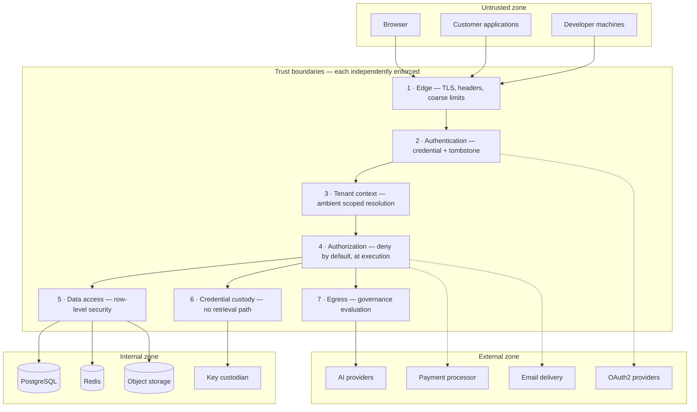
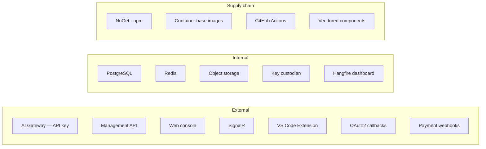

# Threat Model

| Field | Value |
| --- | --- |
| Document | Threat Model (STRIDE) |
| Version | 1.0 |
| Status | Draft — pending security review workshop |
| Owner | Security & Engineering |
| Last updated | 2026-07-30 |
| Audience | Security, Engineering, Architecture Review, Leadership |
| Phase | 5 — Security Architecture |
| Review cadence | **Per major release, and on any architectural change** |

---

## 1. Purpose

This document models threats against MaintOrbit AI using STRIDE, records mitigations, and
identifies which threats are **not** adequately mitigated today.

**A threat model whose every row says "mitigated" is a marketing document.** The value here
is in the rows that do not, and in stating residual risk plainly enough that leadership can
decide whether to accept it. Four threats in this model carry an unquantified residual and
are marked ⚠️ rather than assigned an optimistic rating.

---

## 2. Scope

**In scope:** threats against the platform's assets, trust boundaries, and data flows across
all components and all three client surfaces.

**Out of scope**, stated because a security review will ask:

| Excluded | Reason |
| --- | --- |
| **Prompt injection** | Manipulates *model* behaviour, not platform behaviour. Our obligations are that injected content cannot reach our systems as executable input, and that XSS via a manipulated completion is prevented |
| Model output correctness | A product concern |
| Customer environments | Not our boundary |
| AI provider internal security | Assessed as a subprocessor; not controlled |
| Physical infrastructure | Inherited from the hosting provider |
| Misuse by authorized employees | Detected and audited, not prevented |
| Local malware on a developer machine | Outside the boundary; short credential lifetimes limit the window |

**Being explicit about these is a commercial asset.** The security lead who evaluates this
platform distrusts a threat model with no gaps far more than one with stated ones.

---

## 3. System and trust boundaries

| Boundary | Enforcement | Failure behaviour |
| --- | --- | --- |
| 1 — Edge | TLS, security headers, connection limits | Reject |
| 2 — Authentication | Session or Platform API Key, tombstone checked | Reject |
| 3 — Tenant context | Server-side resolution from the credential | **No tenant → no rows** |
| 4 — Authorization | Deny-by-default at execution | Reject + audit |
| 5 — Data access | PostgreSQL row-level security | Zero rows |
| 6 — Credential custody | Decryption reachable only from provider execution | No plaintext exists to return |
| 7 — Egress | Governance policy evaluation | Reject in enforce mode |

**Boundary 3's failure direction is the design's most important property.** A missing tenant
context produces an empty result, never an unfiltered one.

---

## 4. Assets

| Rank | Asset | Consequence of compromise | Boundary protecting it |
| --- | --- | --- | --- |
| **1** | **Provider Credentials** | **Existential** — spend authority plus data egress, every customer at once | 6 |
| **2** | **Key-encryption key** | Unlocks rank 1 for all tenants | Custodian, outside all boundaries |
| **3** | **Tenant isolation boundary** | Cross-customer exposure; contract and regulatory breach | 3, 5 |
| **4** | Prompt and completion content | Customer confidential data, where retention enabled | 4, 5, 7 |
| **5** | Audit trail integrity | Compliance failure; incident response impossible | 4, 5 |
| **6** | Platform API Keys | Impersonation within one Company | 2 |
| **7** | Session credentials | Account takeover | 2 |
| **8** | Usage and cost ledger | Financial misreporting | 5 |
| **9** | Organizational metadata | Reconnaissance value | 5 |

---

## 5. Attack surfaces and threat actors

### 5.1 Attack surfaces

### 5.2 Threat actors

| Actor | Capability | Primary targets |
| --- | --- | --- |
| External unauthenticated | Network access; public surfaces | Authentication, API surface |
| **Legitimate customer probing** | Valid credentials in one Company | **Tenant boundary** |
| Compromised customer account | Full authority of the victim's role | Credentials, content, ledger |
| Malicious insider — customer side | Legitimate role | Content, exports |
| **Malicious insider — platform side** | Infrastructure or database access | **KEK, all tenants** |
| Supply-chain attacker | Compromised dependency or CI | Everything |
| Compromised AI provider | Sees prompt content routed to them | Content in transit |
| Automated / opportunistic | Scanning, credential stuffing | Authentication |

**Two actors shape the design most.** The *legitimate customer probing the tenant boundary* is
authenticated, patient, and hard to distinguish from normal use. The *platform-side insider* is
the only actor with plausible access to the rank-1 and rank-2 assets.

---

## 6. Threats and mitigations

Severity assumes the mitigation is **absent**. Residual assumes it is present.

### 6.1 Spoofing

| # | Threat | Severity | Mitigation | Residual |
| --- | --- | --- | --- | --- |
| S-1 | Credential stuffing | High | Breach-corpus checking; rate limiting; lockout with notification | Low |
| S-2 | Stolen Platform API Key | High | Hashed storage; tombstone revocation; scopes; last-used tracking | **Medium** — valid until noticed |
| S-3 | Session token theft via XSS | High | Token in memory; refresh `HttpOnly`; strict CSP; sanitized completions | Low |
| S-4 | Refresh token replay | High | Rotation with reuse detection; family revocation; Employee notified | **Low** — theft becomes detectable |
| **S-5** | **JWT forgery via compromised signing key** | **Critical** | Quarterly rotation; custodian storage; key identifiers | **Medium — forged tokens bypass tombstone revocation entirely** |
| S-6 | Authorization code interception | Medium | PKCE with SHA-256; exact-match redirect allowlist | Low |
| S-7 | Phishing employee credentials | High | TOTP MFA; new-device notification | **Medium — TOTP is phishable; hardware keys (v2.0) are the answer** |
| S-8 | Extension impersonation on a developer machine | Medium | OS keychain; short-lived access credentials | Medium — local malware is out of scope |
| S-9 | Forged payment webhook | High | Signature verification with timestamp tolerance | Low |
| S-10 | Provider endpoint spoofing | High | TLS with validation **never disabled** | Low |

**S-5 is the most under-appreciated threat here.** A forged token was never issued, so it
appears in no session record and no tombstone. The triple-redundant revocation architecture —
which handles every other credential compromise — does not apply. Detection is anomaly-based:
activity with no corresponding session record.

### 6.2 Tampering

| # | Threat | Severity | Mitigation | Residual |
| --- | --- | --- | --- | --- |
| T-1 | SQL injection | Critical | Parameterized queries; **Analytics direct SQL is a review gate** | Low |
| T-2 | Ciphertext tampering in the database | High | GCM authentication tag; failure raises a security event | Low |
| T-3 | Ciphertext moved between tenants | High | Company identifier bound into the AAD — decryption fails | Low |
| **T-4** | **Audit modification to hide activity** | **Critical** | No modification path in code; tamper-evidence at v1.1 | **Medium until v1.1** |
| T-5 | Usage or cost record manipulation | High | Immutable; compensating records only; reconciliation | Low |
| T-6 | Governance policy tampering to permit exfiltration | High | Change auditing; authorization; step-up recommended | Low |
| **T-7** | **Supply-chain compromise of a dependency** | **Critical** | Lockfiles; build-gating scan; SHA-pinned actions; source mapping | **Medium** |
| T-8 | Container image tampering | High | Immutable promotion; image scanning; registry access control | Low |
| **T-9** | **Vendored component compromise** | Medium | Quarterly review only | **Medium — invisible to every scanner** |
| T-10 | Replay causing duplicate spend | Medium | Idempotency keys | Low |
| T-11 | Prompt injection manipulating model behaviour | — | **Out of scope** — see §2 | **Accepted** |

**T-9 deserves emphasis.** Vendored components appear in no dependency scan, no vulnerability
report, and no upgrade notification. Every other supply-chain item prompts someone eventually;
this one relies entirely on a scheduled review being performed.

### 6.3 Repudiation

| # | Threat | Severity | Mitigation | Residual |
| --- | --- | --- | --- | --- |
| R-1 | Employee denies making an AI request | Medium | Complete, unsampled attribution chain | Low |
| R-2 | Admin denies a configuration change | Medium | Configuration auditing with actor | Low |
| R-3 | Denying provider credential access | High | Full lifecycle auditing | Low |
| **R-4** | **Audit gap creating deniability** | High | Never sampled; write failure is an incident; reconciliation | **Medium — the ~1 s ingestion window** |
| R-5 | Denying a data export | Medium | Export audited with actor, scope, destination | Low |
| R-6 | Shared credential defeating attribution | Medium | Per-Employee keys; last-used tracking; **sharing cannot be fully prevented** | Medium |

**R-4 traces to the unresolved ingestion durability gap.** A bounded loss window means a small
set of actions could be genuinely unrecorded — which affects non-repudiation, a compliance
property, not only data integrity.

### 6.4 Information disclosure — the highest-consequence category

| # | Threat | Severity | Mitigation | Residual |
| --- | --- | --- | --- | --- |
| **I-1** | **KEK compromise exposes every customer's credentials** | **Critical** | Custodian outside the database; independent access control and audit; rotation; access anomaly detection | **Medium — highest residual in this model** |
| **I-2** | **Cross-tenant data exposure** | **Critical** | Row-level security below every query; safe failure direction; tested every build | **Low, conditional on D-1** |
| **I-3** | **Pooled connection carrying stale tenant context** | **Critical** | Clear-on-return; pooling mode as a security decision | ⚠️ **Unresolved — DD-2** |
| I-4 | Database compromise reading credentials | High | Envelope encryption; KEK elsewhere | Low |
| I-5 | Backup exfiltration | High | Encrypted; separate storage; audited access | Medium |
| I-6 | Credential or content in logs | High | Never a plain string type; absent by construction; secret scanning | Low |
| I-7 | Content exposure through support access | High | **No role reads another Employee's content**; legal hold only | Low |
| **I-8** | **Elevated database role misuse** | **Critical** | Enumerated paths; architecture test; every use audited | **Medium — a documented bypass** |
| I-9 | Signed URL leaked or guessed | Medium | Unguessable keys; short lifetime; authorization before issuance | Low |
| I-10 | Browser cache serving another Company's data | Medium | Company-scoped query keys; cache cleared on session change | Low |
| I-11 | Errors leaking cross-tenant identifiers | Medium | No cross-tenant identifiers in errors | Low |
| **I-12** | **Prompt content disclosed to the AI provider** | Medium | **Inherent to the product**; governance limits egress; terms documented | **Accepted and disclosed** |
| I-13 | Timing side channel revealing tenant existence | Low | Uniform responses for not-found and not-authorized | Low |
| I-14 | Platform-side insider reading customer data | High | No credential retrieval path; content requires legal hold; audited | Medium |
| I-15 | Telemetry exposing cross-tenant data | Medium | Per-Company metrics scoped | Low |

**I-3 is the only ⚠️ in this category and it is not an application defect** — it is an
interaction between a correct application and a correctly-configured pooler. The failure
presents as an ordinary successful query rather than an error, which is why the build-time
isolation test matters more than runtime detection.

**I-12 is inherent and must be stated honestly.** Every AI request is a data egress event to a
third party. That is the product. The platform's value is *governing* that egress, not
eliminating it.

### 6.5 Denial of service

| # | Threat | Severity | Mitigation | Residual |
| --- | --- | --- | --- | --- |
| **D-1** | **Redis unavailability halts the Gateway** | **Critical** | Replication with automatic failover | ⚠️ **Unresolved — fail-closed budget checks make this a full outage** |
| D-2 | Volumetric attack on public endpoints | High | Edge connection limits; per-Company limits; explicit shedding | Medium |
| D-3 | Noisy neighbour consuming shared capacity | High | Per-Company rate, connection, and concurrency limits | Low |
| D-4 | Argon2id as a resource-exhaustion vector | Medium | Rate limiting on authentication endpoints | Low |
| D-5 | Account lockout weaponized against a known user | Medium | Notification; per-source as well as per-account limiting | **Medium — inherent to lockout** |
| D-6 | Ingestion backlog exhausting Redis memory | High | Stream depth alerting; **shed inference before dropping records** | Medium |
| D-7 | Expensive analytics query saturating a replica | Medium | Query limits; read replica isolation | Low |
| D-8 | Provider rate limit exhaustion | Medium | Per-Company limits; multiple connections; **the customer's limit, not ours** | Low |
| D-9 | Certificate expiry causing an outage | Medium | Automated renewal; **independent expiry alerting** | Low |
| **D-10** | **Single-VM deployment failing the availability target** | High | ⚠️ **Unresolved** | ⚠️ |

**D-1 and D-10 compound.** On a single VM, a routine Redis restart is a full Gateway outage.

### 6.6 Elevation of privilege

| # | Threat | Severity | Mitigation | Residual |
| --- | --- | --- | --- | --- |
| E-1 | Horizontal — another Employee's resources | High | Scope evaluation; resource checks; row-level security | Low |
| E-2 | Vertical — a higher role | High | **No inheritance hierarchy**; explicit grants; audited changes | Low |
| E-3 | Cross-tenant escalation | Critical | Scope uses only current-Company data; row-level security independently | Low |
| E-4 | Key scope escalation | Medium | Effective permission is role **∩** key scope, never union | Low |
| E-5 | Bypass via a background job | High | Explicit tenant context; AT-10 | Low |
| E-6 | Bypass via SignalR | High | AT-11; server-side group derivation | Low |
| E-7 | Bypass via Analytics direct SQL | High | Row-level security still applies; restricted and reviewed | Low |
| **E-8** | **Elevated database role abuse** | **Critical** | Enumerated paths; architecture test; audited | **Medium** |
| E-9 | Stale permissions after a role change | Medium | 60 s TTL ceiling plus invalidation | Low |
| **E-10** | **Custom roles composing an escalation** (v2.0) | Medium | **Not yet designed** | ⚠️ **Future** |
| E-11 | Hangfire dashboard exposure | High | Authenticated, authorized, audited, not publicly routed | Low |
| E-12 | Container escape | High | Non-root; read-only root filesystem where practical; image scanning | Medium |

---

## 7. Residual risks

| Threat | Residual | Status |
| --- | --- | --- |
| **I-1 — KEK compromise** | **Medium** | Accepted with mitigation. Highest residual in the model |
| **I-3 — Pooling tenant leak** | ⚠️ **Unquantified** | **Must be resolved before Phase 6** |
| **D-1 — Redis halts the Gateway** | ⚠️ **Unquantified** | Requires a product decision on fail-open budget checks |
| **D-10 — Single-VM availability** | ⚠️ **Unquantified** | Requires a topology decision |
| **S-5 — Signing key forgery** | Medium | Bypasses revocation entirely; detection is anomaly-based |
| **I-8 / E-8 — Elevated role** | Medium | Documented bypass; kept small and audited |
| **T-4 — Audit tampering** | Medium | Until tamper-evidence at v1.1 |
| **T-7 / T-9 — Supply chain** | Medium | Vendored components are the weakest link |
| **S-7 — Phishing** | Medium | Until hardware keys at v2.0 |
| **R-4 — Audit gap** | Medium | Tied to the ingestion durability gap |
| **I-12 — Content to providers** | **Accepted** | Inherent; disclosed |
| **E-10 — Custom role escalation** | ⚠️ **Future** | Must be designed before v2.0 |

**The pattern worth noticing:** the highest residual risks are not sophisticated attacks. They
are an unresolved configuration question (I-3), an undecided availability trade-off (D-1), a
key whose recovery procedure does not exist (I-1), and a class of dependency no tool watches
(T-9).

---

## 8. Security assumptions

Each is an assumption whose failure invalidates part of this model.

| # | Assumption | If wrong |
| --- | --- | --- |
| A-1 | PostgreSQL row-level security is correctly implemented and cannot be bypassed by an application-issued query | The entire tenant isolation model fails |
| A-2 | The key custodian's access controls hold | I-1 becomes certain rather than mitigated |
| A-3 | AES-256-GCM as implemented in framework primitives is sound, and nonces are provably unique | Credential confidentiality and integrity fail |
| A-4 | Argon2id parameters remain adequate against improving hardware | Offline cracking becomes viable — hence annual review |
| A-5 | TLS as configured protects transport | Machine-in-the-middle on the provider path |
| A-6 | Cloud infrastructure physical and hypervisor security holds | Outside our control |
| A-7 | AI providers do not exfiltrate customer content beyond stated terms | I-12 becomes worse than disclosed |
| A-8 | Dependencies are not compromised at the point of publication | T-7 |
| A-9 | Architecture tests actually enforce what they claim | Boundaries become advisory — **a mechanical check verifies what it was written to verify, not the intent** |
| A-10 | Operators follow documented procedures for elevated access and key handling | I-8, I-1 |
| A-11 | Customers protect their own Platform API Keys | S-2 |
| A-12 | The audit trail is not the only copy of security-relevant evidence | T-4 before v1.1 |

**A-9 deserves attention.** Architecture tests can pass while a boundary is meaningfully
broken — they check structure, not intent. This is a limit on how much assurance mechanical
enforcement provides, and it argues for periodic manual review of the boundaries that matter
most.

---

## 9. Design decisions

| # | Decision | Rationale |
| --- | --- | --- |
| TM-a | **Severity assumes the mitigation is absent; residual assumes it is present** | Makes the value of each control visible |
| TM-b | **Prompt injection is out of scope as a platform threat** | It manipulates model behaviour, not ours; claiming otherwise misleads customers |
| TM-c | **Content disclosure to providers is accepted and disclosed** | Inherent to the product |
| TM-d | **Unresolved threats are marked ⚠️, not assigned an optimistic residual** | An unquantified risk must not look mitigated |
| TM-e | **Reviewed per major release and on architectural change** | A stale threat model is believed and wrong |
| TM-f | **The KEK warrants a dedicated threat model** | The rank-1 dependency deserves more than one row here |
| TM-g | **Security assumptions are enumerated** | An unexamined assumption is an unmodelled threat |

---

## 10. Risks and trade-offs

### 10.1 Risks to the model itself

| # | Risk | Mitigation |
| --- | --- | --- |
| M-1 | The model becomes stale as the architecture evolves | Review per major release and on architectural change |
| M-2 | ⚠️ items are quietly downgraded to look better | They are tied to named open decisions with owners |
| M-3 | Out-of-scope items are read as "not a risk" | §2 states each with a reason |
| M-4 | Residual ratings are optimistic because they were self-assessed | Independent penetration test before general availability |
| M-5 | Agentic workloads change the abuse surface substantially | Not modelled; flagged in §11 |

### 10.2 Trade-offs

| # | Gained | Given up |
| --- | --- | --- |
| T-1 | Honest residual ratings | The document does not read as reassuring |
| T-2 | Prompt injection out of scope | Customers may expect it in scope; requires explanation |
| T-3 | Fail-closed security controls | Availability threats (D-1) become more severe |
| T-4 | Elevated role exists | A permanent documented bypass |
| T-5 | TOTP rather than hardware keys at MVP | Phishing residual remains until v2.0 |
| T-6 | Content off by default | Reduces I-7 and I-14 substantially; limits product analytics |

---

## 11. Future improvements

- **A dedicated KEK threat model** — the rank-1 dependency warrants analysis beyond one row.
- **Attack-tree analysis for the two critical paths** — cross-tenant access and credential
  extraction.
- **Red-team exercise focused on tenant isolation** — the highest-consequence boundary and the
  hardest to test synthetically.
- **Custom-role escalation analysis (E-10)** before v2.0.
- **Agentic workload threats** — autonomous multi-step operations change the abuse surface
  substantially and are not modelled here.
- **Self-hosted deployment threats (v2.1)** — a different trust model in which the customer
  holds the keys and controls the infrastructure.
- **Threat modelling per module** as the system grows, rather than one platform-wide model.
- **Independent penetration test** before general availability, to correct M-4.

---

## 12. Cross references

| Document | Relationship |
| --- | --- |
| [`security-architecture.md`](security-architecture.md) | Controls this model evaluates |
| [`compliance.md`](compliance.md) | Regulatory framing of the same risks |
| [`security-checklist.md`](security-checklist.md) | Verification of the mitigations |
| [`../02-architecture/component-diagram.md`](../02-architecture/component-diagram.md) | §3.6 failure impact analysis |
| [`../03-adr/ADR-0005-multi-tenant-strategy.md`](../03-adr/ADR-0005-multi-tenant-strategy.md) | I-2, I-3 |
| [`../03-adr/ADR-0008-credential-encryption.md`](../03-adr/ADR-0008-credential-encryption.md) | I-1 |
| [`../03-adr/ADR-0021-fail-open-fail-closed.md`](../03-adr/ADR-0021-fail-open-fail-closed.md) | D-1 |
| [`../01-product/non-functional-requirements.md`](../01-product/non-functional-requirements.md) | NFR-SEC, NFR-PRIV |
