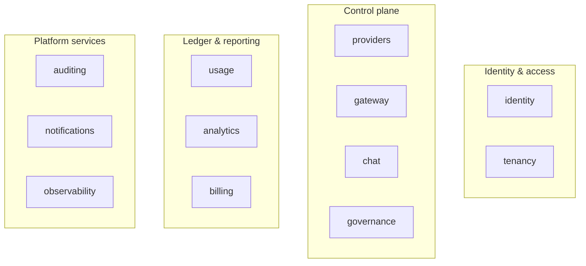
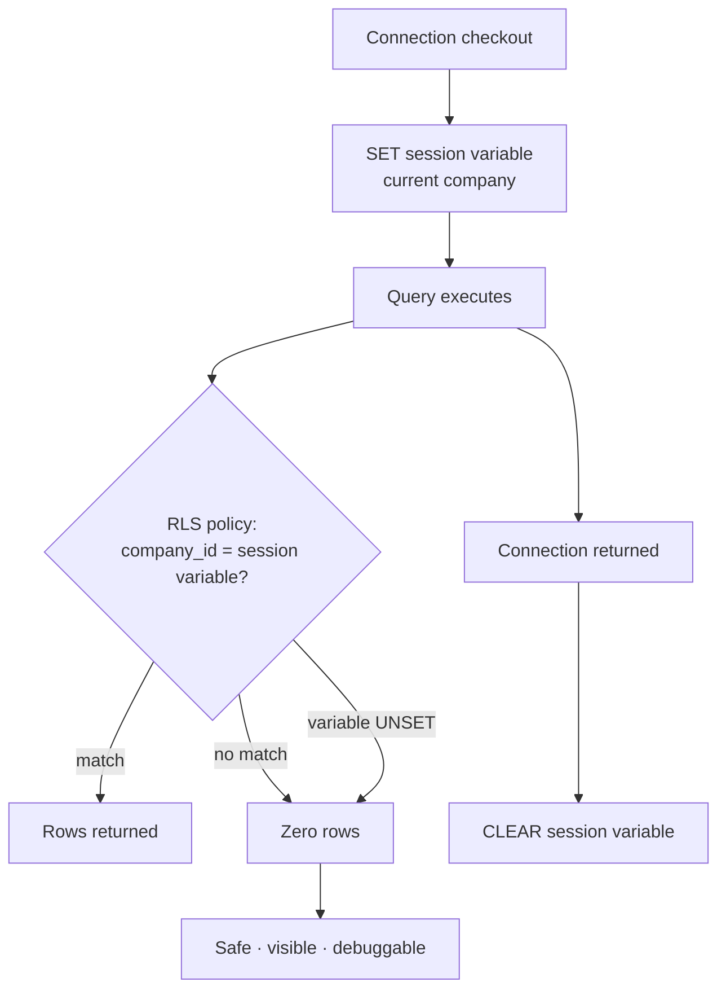
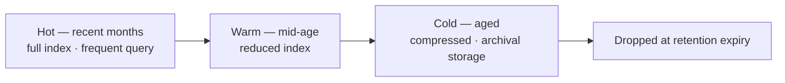
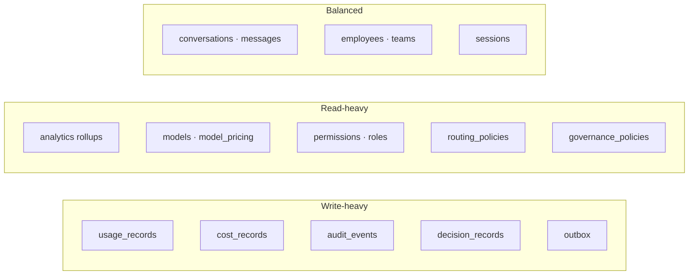

# Database Design

| Field | Value |
| --- | --- |
| Document | Logical Database Design |
| Version | 1.1 — reconciled against the built schema (Milestone 12.1) |
| Status | Draft — **blocked on four decisions; see §10.3** |
| Owner | Engineering |
| Last updated | 2026-08-08 |
| Audience | Engineering, Security, Architecture Review |
| Phase | 6 — Database Design |

---

> ## Terminology note
>
> The requested domain list included **"User"** and **"Organization"**. Both are prohibited
> by [`../01-product/glossary.md`](../01-product/glossary.md) §10, which is normative:
>
> | Requested | Used here | Reason |
> | --- | --- | --- |
> | User | **Employee** | "User" is ambiguous between a human, a Platform API Key, and a service identity |
> | Organization | **Company** | Reserved for the future parent-organization construct (FR-TEN-016) |
>
> This document uses the glossary terms throughout. The mapping is stated rather than
> applied silently.

---

## Contents

| § | Section |
| --- | --- |
| 1 | Database overview |
| 2 | Domain model |
| 3 | Entity relationship design |
| 4 | Table design |
| 5 | Multi-tenant design |
| 6 | Performance strategy |
| 7 | Data lifecycle |
| 8 | Audit and history |
| 9 | Scalability |
| 10 | Risks, trade-offs, and open questions |

---

# 1. Database Overview

## 1.1 Purpose

This document defines the **logical** database design for MaintOrbit AI: schemas, entities,
relationships, indexing strategy, partitioning, lifecycle, and the tenancy enforcement model.

It contains no SQL, no migrations, and no ORM mappings. It is the specification against which
those are written.

**It invents no architecture.** Every structural choice traces to a decision already made in
Phases 2–5. Where a decision is still open, that is stated rather than resolved unilaterally —
and four of them block implementation.

## 1.2 Design principles

| # | Principle | Source |
| --- | --- | --- |
| **DB-P1** | **Every tenant-scoped relation carries `company_id` and a row-level security policy** | SD-002, ADR-0005 |
| **DB-P2** | **One schema per module; no foreign key crosses a module schema** | ADR-0002 R-6 |
| **DB-P3** | **Shared reference data is duplicated by projection, never joined across modules** | ADR-0002 R-5 |
| **DB-P4** | **Ledger tables are immutable and append-only** — corrections are compensating rows | NFR-DATA-006, AU-1 |
| **DB-P5** | **Retention is enforced by partition drop, never mass deletion** | ADR-0004 |
| **DB-P6** | **Monetary values are `numeric`, never floating point** | BD-008, NFR-DATA-003 |
| **DB-P7** | **Analytics reads projections, not raw ledger rows** | ADR-0004, NFR-PERF-010 |
| **DB-P8** | **Every table is assigned a data classification (C1–C4)** which determines encryption and logging treatment | SD-017 |
| **DB-P9** | **The policy is created in the same migration as the table** | A table without a policy is a leak |
| **DB-P10** | **Migrations are backward-compatible with the previous application version** | Rolling deployment runs both concurrently |

## 1.3 PostgreSQL version

| Aspect | Position |
| --- | --- |
| Target | **PostgreSQL 17.x or 18.x** — decision **TD-5**, open |
| Support policy | Five years per major; one major per year |
| **Version-dependent design choice** | **UUIDv7 primary keys.** PostgreSQL 18 provides a native generator; on 17 the value must be generated in the application layer |
| Required capabilities | Row-level security, declarative partitioning, `timestamptz`, JSONB, generated columns, `pg_trgm` or full-text search |

**TD-5 is not cosmetic here.** It determines whether time-ordered identifiers are generated by
the database or the application, which affects the insert path for the highest-volume tables
in the system. It should be settled before implementation, not during.

## 1.4 Multi-tenant strategy

**Shared database. One schema per module. `company_id` on every tenant-scoped relation.
Isolation enforced by PostgreSQL row-level security.** Detailed in §5.

**This rests on ADR-0005, which is still *Proposed*** pending decision D-1. Ratification is a
prerequisite for implementation, not a parallel activity.

## 1.5 Naming conventions

Per [`../01-product/glossary.md`](../01-product/glossary.md) §11 and the Phase 0 conventions.

| Element | Form | Example |
| --- | --- | --- |
| Schema | `snake_case`, module name | `identity`, `usage`, `gateway` |
| Table | `snake_case`, **plural** | `provider_connections`, `usage_records` |
| Column | `snake_case` | `created_at_utc`, `company_id` |
| Primary key | `id` | |
| Foreign key | `<singular>_id` | `company_id`, `employee_id` |
| Index | `ix_<table>_<columns>` | `ix_usage_records_company_id_occurred_at` |
| Unique index | `ux_<table>_<columns>` | `ux_employees_company_id_email` |
| Partial index | `ix_<table>_<columns>_<predicate>` | `ix_sessions_employee_id_active` |
| Partition | `<table>_<period>` | `usage_records_2026_07` |
| Check constraint | `ck_<table>_<rule>` | |
| RLS policy | `rls_<table>` | |

**No abbreviations of platform terms.** `prov_conn`, `usg_rec`, and similar are prohibited —
the glossary spelling is used in full.

## 1.6 UUID strategy

| Decision | Rationale |
| --- | --- |
| **Primary keys are UUIDs, not sequential integers** | Prevents enumeration; avoids exposing row counts; required for a distributed insert path and eventual module extraction |
| **UUIDv7 (time-ordered), not UUIDv4** | **UUIDv4 is random, so index inserts scatter across the B-tree**, causing page splits, poor cache locality, and index bloat. At the ledger volumes in §9 this is a material write-throughput problem, not a micro-optimization |
| Generation | Native in PostgreSQL 18; application-layer on 17 — see §1.3 |
| **Identifiers are never sequential and never predictable** | Enumeration resistance (threat I-13) |
| External identifiers | The same UUID is used in the API surface; no separate public identifier |

**Two exceptions to UUID primary keys:**

| Table class | Key | Why |
| --- | --- | --- |
| Partitioned ledger tables | **Composite: `(id, occurred_at_utc)`** | PostgreSQL requires the partition key in the primary key |
| Reference data — permissions, plans | Stable `text` code | Human-readable, referenced in configuration, never enumerated by an attacker |

## 1.7 Timestamp standards

| Rule | Statement |
| --- | --- |
| Type | **`timestamptz`** — always, never `timestamp` |
| Storage | **UTC** (FR-X-003) |
| Display conversion | At the edge only, never in the database |
| Suffix | `_at_utc` on every timestamp column, making the convention visible at the point of use |
| Source | Obtained through the time abstraction, never `now()` scattered in application code (AT-9) |
| Precision | Microsecond, PostgreSQL default |

**Standard audit fields** on every mutable table:

| Column | Purpose |
| --- | --- |
| `created_at_utc` | Row creation |
| `created_by_employee_id` | Actor, nullable for system-created rows |
| `updated_at_utc` | Last modification |
| `updated_by_employee_id` | Actor |
| `row_version` | Optimistic concurrency |

**Immutable ledger tables carry `created_at_utc` only** — there is no update path, so update
columns would be misleading.

## 1.8 Soft delete policy

Not uniform, and deliberately so. Per [`../05-security/security-architecture.md`](../05-security/security-architecture.md):

| Entity | Model | Rationale |
| --- | --- | --- |
| **Company** | **Soft, with grace period**, then destruction | FR-TEN-013; accidental deletion recoverable |
| **Employee** | **Soft** — suspended, then removed with records retained | FR-TEN-008; ledger attribution must survive |
| **Team** | **Soft** — archived | Historical attribution must survive (FR-TEN-015) |
| **Provider Connection** | **Soft**, ciphertext destroyed | Audit trail retained; credential is not |
| **Conversation, Message content** | **Hard** | NFR-PRIV-007 — deletion must be real |
| **Governance Policy, Routing Policy, Budget** | Soft | Historical evaluation must remain interpretable |
| **Usage, Cost, Audit, Decision records** | **Never deleted individually** | Immutable; retention by partition drop only |

| Rule | Statement |
| --- | --- |
| Column | `deleted_at_utc` nullable; `deleted_by_employee_id` |
| Filtering | Applied by an **EF Core interceptor**, not per query (ADR-0023) |
| **Isolation** | **Row-level security applies regardless of deletion state** — a soft-deleted row is still tenant-scoped |
| Uniqueness | Unique indexes are **partial**, excluding soft-deleted rows, so a deleted Employee's email can be reused |

**Soft delete carries a real risk:** data marked deleted but present is data a forgotten filter
can expose. The interceptor and the row-level security policy together are what make it safe.

---

# 2. Domain Model

Twelve module schemas, matching the modular monolith decomposition in
[`../02-architecture/system-architecture.md`](../02-architecture/system-architecture.md) §3.4.

| Schema | Owns | Requested domain mapping |
| --- | --- | --- |
| **`tenancy`** | Companies, Teams, memberships, invitations, Company settings | **Company**, Team, Settings, *(Organization → Company)* |
| **`identity`** | Employees, credentials, sessions, roles, permissions, Platform API Keys | **Identity**, *(User → Employee)*, **API Keys** |
| **`providers`** | Provider Connections, encrypted credentials, data keys, model catalogue, pricing, health | **AI Providers** |
| **`gateway`** | Routing Policies and their ordered target chains | **AI Gateway** |
| **`chat`** | Conversations, Messages | **Chats**, **Conversations**, **Messages** |
| **`governance`** | Governance Policies, rules, content retention configuration | — |
| **`usage`** | Usage Records, Cost Records, Budgets, Quotas, idempotency keys | **Usage Tracking** |
| **`analytics`** | Pre-aggregated projections; **holds no authoritative state** | — |
| **`billing`** | Plans, Subscriptions, Invoices, payment method references | **Billing** |
| **`auditing`** | Audit Events, legal holds | **Audit** |
| **`notifications`** | Delivery preferences, notification records | **Notifications** |
| **`observability`** | Decision Records | — |

## 2.1 Module responsibilities

**`tenancy`** — the isolation root. Every other schema's tenant-scoped tables reference a
Company that lives here, but **by identifier only, never by foreign key across schemas**
(DB-P2). Company-level settings including default retention and default policies.

**`identity`** — authentication and authorization state. Holds the highest-sensitivity
identity material: password hashes (Argon2id), MFA secrets, Platform API Key hashes, refresh
token hashes. **Roles are permission presets** (SD-020), so the permission catalogue and role
composition are data here, not code.

**`providers`** — the rank-1 asset custody schema. Provider Credential ciphertext with its
encryption envelope metadata, per-Company wrapped data keys, and the model catalogue with
**effective-dated pricing** (FR-COST-002). **No column in this schema ever contains a
credential in plaintext** (SD-003).

**`gateway`** — routing configuration only. Circuit breaker state and rate-limit counters live
in Redis, not here (ADR-0006); they are ephemeral and must be shared across API host
instances at sub-millisecond latency.

**`chat`** — Conversations and Messages. **Message content is nullable by design**: content
retention is off by default (SD-006), so the structure persists while the content does not.

**`governance`** — policy definitions and content retention configuration. Policy *evaluations*
are recorded as Audit Events, not here.

**`usage`** — the ledger. The highest-volume schema by orders of magnitude, and the one whose
design is hardest to change later. Usage Records, Cost Records derived from them, Budgets and
Quotas, and idempotency keys.

**`analytics`** — **projections only, no authoritative state** (BD-007). This is what permits
substitution with a columnar store later as a projection rebuild rather than a data migration.

**`billing`** — the commercial relationship with MaintOrbit AI. **Distinct from `usage`**,
which records the Company's spend with its providers. **No card data is ever stored**
(NFR-COMP-007) — only an opaque processor reference.

**`auditing`** — append-only compliance record. **No update or delete path exists** (AU-1).

**`notifications`** — preferences and delivery records.

**`observability`** — Decision Records: the full routing reconstruction for a request. High
volume, write-once, read-rarely, and therefore **shorter retention than audit**.

**Every schema also owns an `outbox` table** for integration events (ADR-0013), written in the
same transaction as the state change that produced them.

---

# 3. Entity Relationship Design

## 3.1 Core entity relationships

```mermaid
erDiagram
    COMPANIES ||--o{ TEAMS : "contains"
    COMPANIES ||--o{ EMPLOYEES : "contains"
    COMPANIES ||--o{ COMPANY_SETTINGS : "configured by"
    COMPANIES ||--o{ INVITATIONS : "issues"
    TEAMS ||--o{ TEAM_MEMBERSHIPS : "has"
    EMPLOYEES ||--o{ TEAM_MEMBERSHIPS : "participates via"

    EMPLOYEES ||--o| EMPLOYEE_CREDENTIALS : "authenticates with"
    EMPLOYEES ||--o{ FEDERATED_IDENTITIES : "linked to"
    EMPLOYEES ||--o| MFA_ENROLLMENTS : "enrolled in"
    EMPLOYEES ||--o{ SESSIONS : "holds"
    SESSIONS ||--o{ REFRESH_TOKENS : "issues family"
    EMPLOYEES ||--o{ PLATFORM_API_KEYS : "creates"
    EMPLOYEES ||--o{ EMPLOYEE_ROLES : "assigned"
    ROLE_DEFINITIONS ||--o{ EMPLOYEE_ROLES : "grants"
    ROLE_DEFINITIONS ||--o{ ROLE_PERMISSIONS : "composed of"
    PERMISSIONS ||--o{ ROLE_PERMISSIONS : "included in"

    COMPANIES ||--o{ PROVIDER_CONNECTIONS : "configures"
    COMPANIES ||--o| COMPANY_DATA_KEYS : "protected by"
    PROVIDER_CONNECTIONS ||--o{ MODELS : "exposes"
    MODELS ||--o{ MODEL_PRICING : "priced by"
    PROVIDER_CONNECTIONS ||--o{ PROVIDER_HEALTH_OBSERVATIONS : "monitored by"

    COMPANIES ||--o{ ROUTING_POLICIES : "defines"
    ROUTING_POLICIES ||--o{ ROUTING_POLICY_TARGETS : "ordered chain"

    COMPANIES ||--o{ GOVERNANCE_POLICIES : "defines"
    GOVERNANCE_POLICIES ||--o{ GOVERNANCE_POLICY_RULES : "contains"

    EMPLOYEES ||--o{ CONVERSATIONS : "owns"
    CONVERSATIONS ||--o{ MESSAGES : "contains"

    COMPANIES ||--o{ USAGE_RECORDS : "accrues"
    USAGE_RECORDS ||--o| COST_RECORDS : "priced as"
    COMPANIES ||--o{ BUDGETS : "sets"
    BUDGETS ||--o{ BUDGET_THRESHOLDS : "alerts at"
    COMPANIES ||--o{ QUOTAS : "sets"

    COMPANIES ||--o| SUBSCRIPTIONS : "holds"
    PLANS ||--o{ SUBSCRIPTIONS : "instantiated as"
    SUBSCRIPTIONS ||--o{ INVOICES : "generates"

    COMPANIES ||--o{ AUDIT_EVENTS : "records"
    COMPANIES ||--o{ DECISION_RECORDS : "records"
    COMPANIES ||--o{ LEGAL_HOLDS : "subject to"
    COMPANIES ||--o{ NOTIFICATION_PREFERENCES : "configures"
```

**Note on the diagram.** Relationships shown crossing schema boundaries — for example
`COMPANIES` to `USAGE_RECORDS` — are **logical, not enforced by foreign key** (DB-P2). They are
maintained by application invariant and by the tenant discriminator. This is the single most
important thing to understand about the diagram, and §3.3 explains why.

## 3.2 Primary keys

| Table class | Key | Type |
| --- | --- | --- |
| Standard entities | `id` | UUIDv7 |
| **Partitioned ledger** | `(id, occurred_at_utc)` | UUIDv7 + `timestamptz` |
| Junction tables | `(left_id, right_id)` composite | UUID pair |
| Reference data | `code` | stable `text` |

**Partitioned tables require the partition key in the primary key.** This is a PostgreSQL
constraint, not a design preference, and it means `usage_records`, `cost_records`,
`audit_events`, and `decision_records` all carry composite keys.

## 3.3 Foreign keys — the module boundary rule

**A foreign key is permitted only within a single schema.** Cross-schema references carry the
identifier without a constraint.

| Reference | Enforced by FK? | Why |
| --- | --- | --- |
| `teams.company_id` → `companies.id` | ✅ Same schema (`tenancy`) | |
| `employees.company_id` | ❌ **Identifier only** | Crosses `identity` → `tenancy` |
| `sessions.employee_id` → `employees.id` | ✅ Same schema (`identity`) | |
| `messages.conversation_id` → `conversations.id` | ✅ Same schema (`chat`) | |
| `usage_records.company_id` | ❌ **Identifier only** | Crosses `usage` → `tenancy` |
| `usage_records.employee_id` | ❌ **Identifier only** | Crosses `usage` → `identity` |
| `conversations.employee_id` | ❌ **Identifier only** | Crosses `chat` → `identity` |
| `provider_connections.company_id` | ❌ **Identifier only** | Crosses `providers` → `tenancy` |

> **Corrected in Milestone 12.1.** `employees.company_id` was previously listed as "✅ Same
> schema". It is not: `employees` belongs to `identity` and `companies` to `tenancy`, so the
> reference crosses a module boundary and the rule at the top of this section forbids a constraint
> on it. The implementation has always been correct — no such foreign key exists in any migration —
> and the table is what was wrong. Every tenant-scoped `identity` table carries `company_id` as a
> bare column for exactly this reason, which is also what makes the row-level security policy a
> local comparison rather than a per-row join into another schema.

**Why this constraint exists.** ADR-0002 rule R-6 states that a module owns its schema and no
other module holds a foreign key into it. That rule is what makes module extraction a
transport change rather than a rewrite — a foreign key across a future service boundary is
not enforceable at all.

**What is given up:** referential integrity is enforced by application invariant rather than
by the database for cross-schema references. An orphaned `usage_records.employee_id` is
possible if the application misbehaves.

**What mitigates it:** Employees are soft-deleted, never hard-deleted (§1.8), so the
referenced row persists. A scheduled **referential reconciliation job** detects orphans and
alerts. This is a genuine trade-off, recorded in §10.2 rather than glossed over.

## 3.4 Cardinality and optionality

| Relationship | Cardinality | Required? | Note |
| --- | --- | --- | --- |
| Company → Employee | 1 : N | Employee **must** have a Company | Permanent; no cross-Company identity |
| Company → Team | 1 : N | Optional | A Company may have no Teams |
| Employee ↔ Team | M : N via `team_memberships` | Optional | Zero or more Teams |
| Employee → Primary Team | 1 : 0..1 | **Optional** | Default attribution when a request specifies none |
| Company → Owner | 1 : 1 | **Exactly one, always** | Enforced by partial unique index |
| Employee → Credentials | 1 : 0..1 | Optional | Absent for federated-only Employees |
| Employee → Federated identity | 1 : N | Optional | Multiple providers permitted |
| Employee → Session | 1 : N | Optional | Device-scoped, concurrent permitted |
| Session → Refresh token family | 1 : N | Required per session | Rotation creates successors |
| Company → Provider Connection | 1 : N | Optional | Multiple per provider permitted (FR-PROV-012) |
| Company → Data key | 1 : 1 | **Required once credentials exist** | Per-Company DEK |
| Provider Connection → Model | 1 : N | Populated by catalogue sync | |
| Model → Pricing | 1 : N | **Effective-dated** | Historical costs stay accurate |
| Employee → Conversation | 1 : N | Optional | |
| Conversation → Message | 1 : N | Required ≥ 1 in practice | |
| Usage Record → Cost Record | 1 : 0..1 | **Optional** | Cost is calculated asynchronously; a gap is expected briefly |
| Company → Subscription | 1 : 0..1 | Optional during trial | |

**Two optionality decisions worth explaining.**

`usage_records` → `cost_records` is **1:0..1**, not 1:1, because cost calculation is
asynchronous (ADR-0011). A Usage Record exists before its Cost Record does — within the
5-minute freshness target of NFR-PERF-014. Modelling it as required would misrepresent the
system.

`employees` → `employee_credentials` is **1:0..1** because an Employee provisioned through
OAuth2 or, later, SCIM may never have a password. Modelling credentials as required would
force a placeholder row, which is worse.

---

# 4. Table Design

Columns are listed only where they carry design significance. Standard audit fields (§1.7) are
present on all mutable tables and are not repeated.

**Every table below carries `company_id` and a row-level security policy unless marked
🌐 platform-scoped.**

## 4.1 `tenancy`

### `companies` — C2 🌐 *(the tenant root; `id` is the tenant discriminator)*

| Aspect | Detail |
| --- | --- |
| **Purpose** | The tenant. Unit of isolation, contracting, billing, and administration |
| **Key columns** | `id`, `display_name`, `status` (active, suspended, pending_deletion), `deletion_scheduled_at_utc` |
| **Relationships** | Parent of everything; referenced by identifier from every other schema |
| **Indexes** | PK; `ux_companies_slug` |
| **Tenant ownership** | **Is the tenant.** Row-level security compares `id` to the session variable, not `company_id` |
| **Soft delete** | Yes, with grace period before destruction (FR-TEN-013) |

### `company_settings` — C2

Default retention periods, default Governance Policies, permitted authentication methods
(FR-AUTH-004), content retention default. One row per Company; a settings row per scope where
Team-level override applies.

### `teams` — C2

| Aspect | Detail |
| --- | --- |
| **Key columns** | `company_id`, `name`, `parent_team_id` (nullable, self-referencing for nesting), `archived_at_utc` |
| **Indexes** | `ix_teams_company_id`; `ux_teams_company_id_name` **partial**, excluding archived |
| **Note** | Nesting is bounded in depth (FR-TEN-010, v1.1). A depth column or materialized path avoids recursive queries on the read path |

### `team_memberships` — C2

Junction. `(team_id, employee_id)` composite key plus `company_id` for the policy. **The
`company_id` is denormalized onto the junction deliberately** — the row-level security policy
must be evaluable without a join.

### `invitations` — C2

`email`, `role_code`, `team_id`, `token_hash`, `expires_at_utc`, `accepted_at_utc`. Token is
hashed, single-use, time-limited.

## 4.2 `identity`

### `employees` — C2

| Aspect | Detail |
| --- | --- |
| **Purpose** | A user account belonging to exactly one Company |
| **Key columns** | `company_id` (identifier only — see §3.3), `email`, `email_verified_at_utc`, `status` (`Invited`, `Active`, `Suspended`, `Removed`), `primary_team_id`, `deleted_at_utc`, `pseudonymized_at_utc` |
| **Constraints** | `ck_employees_status` restricts `status` to the four values above, spelled exactly as shown |
| **Indexes** | `ux_employees_company_id_email` **partial**, excluding deleted; `ix_employees_company_id_status` |
| **Soft delete** | Yes — records retained, attributed to the removed identity (FR-TEN-008) |
| **Erasure** | `pseudonymized_at_utc` supports SD-018 — identity is cleared, the row persists |

**The `pseudonymized_at_utc` column is a direct consequence of an unresolved decision.** SD-018
resolves the conflict between erasure (NFR-PRIV-009) and audit immutability (NFR-DATA-006) by
pseudonymizing rather than deleting — **and its legal adequacy is unconfirmed**. If that
position changes, this column and the erasure path change with it. See §10.3.

### `employee_credentials` — **C4**

| Aspect | Detail |
| --- | --- |
| **Key columns** | `company_id`, `employee_id`, `password_hash` (Argon2id), `algorithm`, `password_version`, `hash_parameters`, `password_changed_at_utc`, `require_password_change`, `failed_login_count`, `lockout_until_utc` |
| **Indexes** | `ux_employee_credentials_employee_id` — the 1:0..1 relationship is enforced by the index, not by convention |
| **Constraints** | `ck_employee_credentials_algorithm` restricts `algorithm` to `Argon2id`; `ck_employee_credentials_failed_login_count` keeps the counter non-negative; `ck_employee_credentials_password_version` keeps the version positive |
| **Classification** | **C4 — never logged, never in error messages, never leaves production** |
| **Note** | `hash_parameters` is stored per row so that a parameter change (annual review, SD-010) does not invalidate existing hashes. `algorithm` and `password_version` make an algorithm migration a data change: a row records what produced it, so old and new hashes coexist |

**`failed_login_count` and `lockout_until_utc` live here, not on `employees`.** They describe the
credential being attacked, not the person — an Employee who also authenticates federated should
not be locked out of that path because somebody guessed at their password.

### `mfa_enrollments` — **C4**

| Aspect | Detail |
| --- | --- |
| **Purpose** | One TOTP factor per Employee (FR-AUTH-005) |
| **Key columns** | `company_id`, `employee_id`, `method`, `secret_ciphertext`, `secret_iv`, `secret_auth_tag`, `dek_version`, `algorithm_id`, `status` (`Pending`, `Confirmed`, `Disabled`), `last_accepted_time_step`, `confirmed_at_utc`, `last_verified_at_utc`, `disabled_at_utc` |
| **Indexes** | `ux_mfa_enrollments_employee_id_active` **partial** where `disabled_at_utc IS NULL` — one live factor per Employee, enforced by the database |
| **Constraints** | `ck_mfa_enrollments_status`; `ck_mfa_enrollments_confirmation` ties `confirmed_at_utc` to the confirmed state |
| **Design significance** | **`last_accepted_time_step` is the replay gate.** A TOTP code is valid for its whole 30-second step, so without a record of the last step spent, a code observed in transit can be presented again inside its own window. It is committed even when the surrounding operation fails, so replay cannot be bought by failing the first attempt |

The secret is stored **encrypted under the Company DEK** using the same envelope scheme as
Provider Credentials (§4.3) — `secret_ciphertext` / `secret_iv` / `secret_auth_tag` / `dek_version`
are that envelope inline, and `algorithm_id` records which scheme produced it (SD-009, SD-012).

### `mfa_recovery_codes` — **C4**

| Aspect | Detail |
| --- | --- |
| **Key columns** | `company_id`, `employee_id`, `enrollment_id`, `code_hash` (SHA-256), `issued_at_utc`, `used_at_utc` |
| **Indexes** | `ux_mfa_recovery_codes_enrollment_id_code_hash` |
| **Design significance** | Codes are **scoped to the enrolment**, not the Employee, so a set issued for a factor that was later disabled and replaced cannot satisfy the new one. `used_at_utc` makes them single-use |

Hashed with SHA-256 rather than Argon2id: a recovery code is high-entropy platform-generated
material, which §9's decision tree (09-encryption-strategy §3) routes away from a memory-hard
function.

### `password_reset_tokens` — **C4**

| Aspect | Detail |
| --- | --- |
| **Purpose** | Single-use, time-limited proof of mailbox control for password reset (FR-AUTH-012) |
| **Key columns** | `company_id`, `employee_id`, `token_hash` (SHA-256), `requested_at_utc`, `requested_from_ip_address`, `expires_at_utc`, `consumed_at_utc`, `invalidated_at_utc` |
| **Indexes** | `ux_password_reset_tokens_token_hash` — the lookup path; `ix_password_reset_tokens_employee_id_outstanding` **partial** where neither consumed nor invalidated |
| **Constraints** | `ck_password_reset_tokens_expiry` — a token must expire after it is issued |
| **Design significance** | **`consumed_at_utc` and `invalidated_at_utc` are separate columns, and consumed rows are never deleted.** A deleted row makes a replayed link indistinguishable from a typo; keeping both timestamps distinguishes a link somebody *used* from one a newer request superseded |

The token itself is never stored — only its SHA-256. Issuing a new request invalidates the
outstanding ones, so an Employee cannot accumulate live reset links in a mailbox.

### `email_verification_tokens` — **C4**

| Aspect | Detail |
| --- | --- |
| **Purpose** | Single-use, time-limited proof of address control; verification gates activation (FR-AUTH-013) |
| **Key columns** | `company_id`, `employee_id`, **`email`**, `token_hash` (SHA-256), `issued_at_utc`, `expires_at_utc`, `consumed_at_utc`, `invalidated_at_utc` |
| **Indexes** | `ux_email_verification_tokens_token_hash`; `ix_email_verification_tokens_employee_id_outstanding` **partial** where neither consumed nor invalidated |
| **Constraints** | `ck_email_verification_tokens_expiry` |
| **Design significance** | **The `email` column is what makes this a verification rather than a formality.** The token records the address it was issued *for*, and redemption compares against the Employee's current address — so a link sent to an old address cannot verify whatever replaced it |

### `company_authentication_policies` — C2

| Aspect | Detail |
| --- | --- |
| **Purpose** | Per-Company authentication policy (FR-AUTH-007) |
| **Primary key** | **`company_id`** — the policy *is* the Company's, so there is no surrogate key and no way to hold two |
| **Key columns** | `minimum_password_length`, `require_breach_check`, `idle_timeout_minutes`, `absolute_lifetime_minutes`, `mfa_required`, `maximum_failed_attempts`, `lockout_minutes`, `updated_by_employee_id` |
| **Constraints** | Bounds on every numeric setting, plus **`ck_company_authentication_policies_lifetime_order`** — the idle timeout must be shorter than the absolute lifetime |
| **Design significance** | The lifetime-order constraint is the one worth naming. An idle window at or beyond the absolute lifetime can never fire, so the control would exist in configuration and do nothing — the kind of setting assumed to be working precisely because nobody sees it fail |

**This table lives in `identity`, not `tenancy`.** It is authentication policy, owned by the module
that enforces it; putting it in `tenancy.company_settings` would mean `identity` reading another
module's store on every session validation.

### `sessions` — C2

| Aspect | Detail |
| --- | --- |
| **Purpose** | A **device-scoped** authenticated session (SD-016) |
| **Key columns** | `employee_id`, `company_id`, `device_label`, `client_type`, `ip_address`, `coarse_location`, `created_at_utc`, `last_active_at_utc`, `absolute_expires_at_utc`, `revoked_at_utc`, `revocation_reason` |
| **Indexes** | `ix_sessions_employee_id_active` **partial** where `revoked_at_utc IS NULL`; `ix_sessions_company_id` |
| **Constraints** | `ck_sessions_client_type` (`Unknown`, `WebConsole`, `VsCodeExtension`, `ServerApplication`); `ck_sessions_absolute_expiry`; `ck_sessions_revocation` pairs `revoked_at_utc` with `revocation_reason` |
| **Classification** | **C2 — but `ip_address` and `coarse_location` are personal data** about employees, bounded retention, **visible to the Employee** (principle P-7) |

**Three expiry timers** (§14 of the security architecture) are represented as
`last_active_at_utc` + configured idle window, and `absolute_expires_at_utc` as a stored value.
Access token expiry is not stored — it is carried in the token.

### `refresh_tokens` — **C4**

| Aspect | Detail |
| --- | --- |
| **Key columns** | `company_id`, `session_id`, `family_id`, `token_hash`, `issued_at_utc`, `expires_at_utc`, `used_at_utc`, `superseded_by_id`, `revoked_at_utc` |
| **Indexes** | `ux_refresh_tokens_token_hash`; `ix_refresh_tokens_family_id`; `ix_refresh_tokens_session_id` |
| **Design significance** | **`family_id` and `used_at_utc` implement reuse detection (SD-014).** Presenting a token whose `used_at_utc` is already set revokes the entire family |

**Retention matters here.** Used tokens cannot be deleted immediately — reuse detection
depends on recognizing an already-consumed token. They are retained for the session's absolute
lifetime plus a margin, then purged.

### `platform_api_keys` — **C4** · *not yet built (see "Designed, not yet built" below)*

| Aspect | Detail |
| --- | --- |
| **Key columns** | `company_id`, `employee_id`, `team_id`, `key_prefix` (**non-secret**), `key_hash` (SHA-256), `scopes`, `expires_at_utc`, `last_used_at_utc`, `revoked_at_utc` |
| **Indexes** | **`ux_platform_api_keys_key_prefix`** — the lookup path; `ix_platform_api_keys_employee_id` |
| **Design significance** | **The non-secret prefix makes lookup constant-time** (SD-011). Without it, authenticating a key would require scanning — unacceptable within the 10 ms budget of NFR-PERF-007 |

**`last_used_at_utc` must not be written per request.** At target throughput that would add a
database write to the Gateway hot path, violating ADR-0010. It is derived from Usage Records
or updated at coarse granularity.

### `permissions` · `role_definitions` · `role_permissions` — C1 🌐 *(reference data)*

| Table | Columns | Primary key |
| --- | --- | --- |
| `permissions` | `code`, `description` | `code` |
| `role_definitions` | `code`, `name`, `is_built_in` | `code` |
| `role_permissions` | `role_code`, `permission_code` | `(role_code, permission_code)` |

**These three carry no `company_id` and no row-level security policy**, and that is deliberate
rather than an omission. They are the deployment-wide catalogue: the set of permissions the
software understands and the presets composed from them are properties of the *build*, not of a
tenant. A policy on them would have to admit every Company anyway, and §5.5 already carves out
shared reference data. `employee_roles` — the table that says who holds what — **is** tenant-scoped
and does carry a policy.

Text codes rather than UUIDs, per §1.6: these are referenced by name in configuration and read by
humans in an audit trail.

`role_permissions` → `permissions` is `ON DELETE RESTRICT`; `role_permissions` → `role_definitions`
is `ON DELETE CASCADE`. Retiring a permission that a role still grants must fail loudly, because
the silent alternative is a role that quietly stops granting something.

### `employee_roles` — C2

| Aspect | Detail |
| --- | --- |
| **Purpose** | Which roles an Employee holds, and over what (FR-PERM-003) |
| **Key columns** | `company_id`, `employee_id`, `role_code`, `scope_type` (`Company`, `Team`, `Self`), `scope_id`, `created_by_employee_id` |
| **Indexes** | `ux_employee_roles_employee_id_role_code_scope` on `(employee_id, role_code, scope_type, scope_id)` **`NULLS NOT DISTINCT`**; plus `ix_` on `company_id`, `employee_id`, `role_code` |
| **Constraints** | `ck_employee_roles_scope_type`; `ck_employee_roles_scope_target` ties `scope_id` to the scope types that require one |
| **Foreign keys** | `employee_id` → `employees.id` `ON DELETE CASCADE`; `role_code` → `role_definitions.code` `ON DELETE RESTRICT` |

**`NULLS NOT DISTINCT` is load-bearing and was a defect once.** A Company-scoped assignment has a
`NULL` `scope_id`, and PostgreSQL's default treats each `NULL` as distinct — so the uniqueness
index silently permitted unlimited duplicate Company-scoped grants while correctly preventing
Team-scoped ones. Requires PostgreSQL 15 or later (§1.3, TD-5).

**Roles are permission presets, not code branches** (SD-020). `permissions` is the atomic
catalogue (`provider-connection.create`, `budget.manage`, `audit.read`).
`role_definitions` holds the seven fixed roles now and customer-composed roles at v2.0
(FR-PERM-006).

**This structure is what makes custom roles a data change rather than a rewrite.**

### Designed, not yet built

These belong to `identity` and are specified above, but **no migration creates them** as of
Phase 11. They are listed here so the gap is explicit rather than inferred from their absence.

| Table | Blocked on | Register entry |
| --- | --- | --- |
| `federated_identities` | OAuth2 / SSO, not in Phase 11 scope | [I-6](../08-development/identity-foundation-deferred-work.md) |
| `platform_api_keys` | Platform API Keys, not in Phase 11 scope | [I-5](../08-development/identity-foundation-deferred-work.md) |

`federated_identities` as specified: `employee_id`, `provider` (google, microsoft, saml),
`subject_identifier`, `linked_at_utc`, unique on `(provider, subject_identifier)`.

## 4.3 `providers`

### `company_data_keys` — **C4**

| Aspect | Detail |
| --- | --- |
| **Purpose** | Per-Company data encryption key, wrapped by the key-encryption key |
| **Key columns** | `company_id`, `dek_version`, `wrapped_key`, `kek_version`, `algorithm_id`, `created_at_utc`, `retired_at_utc` |
| **Indexes** | `ux_company_data_keys_company_id_dek_version` |
| **Design significance** | **Multiple versions coexist.** Old versions are retained until no ciphertext references them (KM-d), enabling incremental rotation |

### `provider_connections` — **C4**

| Aspect | Detail |
| --- | --- |
| **Purpose** | A Company's credentialed connection to one AI Provider |
| **Key columns** | `company_id`, `provider_code`, `display_name`, `credential_ciphertext`, `credential_iv`, `credential_auth_tag`, `dek_version`, `algorithm_id`, `status`, `last_validated_at_utc`, `disabled_at_utc` |
| **Indexes** | `ix_provider_connections_company_id_status` |
| **Classification** | **C4 — the rank-1 asset** |

**The envelope metadata columns are not incidental.** They implement SD-009, SD-012, and
SD-019 together:

- `credential_iv` — **unique per encryption operation**; GCM nonce reuse is catastrophic
- `credential_auth_tag` — verified on every decryption; failure is a **security event**
- `dek_version` + `algorithm_id` — enable rotation and future algorithm migration without a flag day
- **The Company identifier and DEK version are bound into the AAD** (SD-019), so a ciphertext
  moved between Companies fails to authenticate — a cryptographic second tenant boundary

**No column in this table ever holds a credential in plaintext, and no read path returns
one** (SD-003).

### `models` — C1 🌐 *(catalogue is reference data)* · `model_pricing` — C1 🌐

| Aspect | Detail |
| --- | --- |
| **`models`** | `provider_code`, `model_code`, `display_name`, `context_limit`, `capabilities` (JSONB), `deprecated_at_utc` |
| **`model_pricing`** | `model_id`, `input_token_price`, `output_token_price`, **`effective_from_utc`**, `effective_to_utc`, `currency` |
| **Indexes** | `ix_model_pricing_model_id_effective_from_utc` |
| **Design significance** | **Effective-dated pricing satisfies FR-COST-002** — historical costs stay accurate after a price change |

**Prices are `numeric`, never floating point** (DB-P6). NFR-DATA-003's 2% tolerance cannot
survive representation error accumulated across hundreds of millions of rows.

**Provider-side prompt caching is a known gap.** Several providers price cached input
differently, which means a simple input/output token pair is insufficient. See §10.3.

### `provider_health_observations` — C2

Rolling availability, latency, and error rate per connection (FR-PROV-014). Short retention;
a candidate for a projection rather than raw storage if volume becomes material.

## 4.4 `gateway`

### `routing_policies` — C2 · `routing_policy_targets` — C2

`routing_policies`: `company_id`, `name`, `scope_type`, `scope_id`, `is_default`.
`routing_policy_targets`: `routing_policy_id`, `ordinal`, `provider_connection_id`, `model_id`,
`retry_attempts`, `timeout_ms`.

**`ordinal` is the fallback chain order** (FR-GW-008). Unique on
`(routing_policy_id, ordinal)`.

**Circuit breaker state is deliberately absent.** It lives in Redis (GD-004) because it must be
shared across API host instances at sub-millisecond latency — a database round trip would
breach the hot-path budget, and per-instance state would multiply customer-visible failures.

## 4.5 `chat`

### `conversations` — C2

`company_id`, `employee_id`, `title`, `model_id`, `archived_at_utc`. Indexed on
`(company_id, employee_id, updated_at_utc DESC)` for the conversation list.

### `messages` — **C3**

| Aspect | Detail |
| --- | --- |
| **Key columns** | `conversation_id`, `company_id`, `role` (employee, model), **`content` (nullable)**, `content_retained`, `token_count`, `usage_record_id`, `created_at_utc` |
| **Classification** | **C3 — Confidential.** Never logged, never in errors, never leaves production |
| **Design significance** | **`content` is nullable by design** |

**This is the most consequential design decision in the chat schema.** Content retention is off
by default (SD-006). With retention disabled, the Message row exists — carrying role, token
count, timestamp, and usage attribution — but `content` is null. The Conversation remains
listable, the usage remains attributable, and the content simply does not persist.

`content_retained` records whether retention was enabled **at the time of writing**, so a later
policy change does not make historical rows ambiguous.

**Full-text search over content is only possible where content is retained.** See §6.6.

## 4.6 `governance`

### `governance_policies` — C2 · `governance_policy_rules` — C2

`governance_policies`: `company_id`, `name`, `scope_type`, `scope_id`, **`mode`** (monitor,
enforce), `enabled`.
`governance_policy_rules`: `policy_id`, `rule_type` (model_restriction, pattern_block,
pii_detection), `configuration` (JSONB), `action` (allow, redact, block).

**`mode` defaults to monitor** (FR-GOV-002). Policy *evaluations* are recorded as Audit
Events, not stored here.

### `content_retention_settings` — C2

`company_id`, `team_id` (nullable = Company default), `enabled`, `retention_days`,
`enabled_by_employee_id`, `enabled_at_utc`. **Enabling is itself an audited event**
(FR-GOV-010).

## 4.7 `usage` — the ledger

### `usage_records` — C2 · **partitioned by month**

| Aspect | Detail |
| --- | --- |
| **Purpose** | One immutable record per processed request |
| **Primary key** | `(id, occurred_at_utc)` — partition key required in PK |
| **Attribution chain** | `company_id`, `team_id`, `employee_id`, `surface`, `provider_connection_id`, `model_id` |
| **Metering** | `input_tokens`, `output_tokens`, `tokens_estimated` (boolean), `latency_ms`, `outcome`, `failure_category` |
| **Correlation** | `correlation_id`, **`parent_trace_id` (nullable)** |
| **Deduplication** | `stream_entry_id` — **unique**, prevents duplicate insertion on consumer redelivery |
| **Optional attribution** | `attribution_tag` (FR-USG-011, v1.1) |
| **Indexes** | `ux_usage_records_stream_entry_id`; `ix_usage_records_company_id_occurred_at_utc`; `ix_usage_records_company_id_team_id_occurred_at_utc`; `ix_usage_records_company_id_employee_id_occurred_at_utc` |
| **Mutability** | **Immutable.** No update path. Corrections are compensating rows |

**Three columns deserve specific attention.**

**`stream_entry_id` uniqueness is mandatory, not optional.** The batch writer consumes from a
Redis consumer group that redelivers unacknowledged entries after a crash (ADR-0011). Without
this constraint, a consumer crash produces duplicate ledger rows — corrupting exactly the data
NFR-DATA-009 requires to be reproducible.

**`tokens_estimated` supports FR-USG-007.** Provider-reported counts are preferred; where
unavailable, an estimate is recorded and flagged, and the estimated proportion is exposed
(NFR-DATA-005 caps it at 5%).

**`parent_trace_id` is decision D-8 and is irreversible if omitted.** Agentic workloads produce
many requests under one logical operation, and metering must eventually group them. Adding the
column later means **every historical record lacks it** — the data cannot be reconstructed.
The column costs almost nothing now. **This is the single most important open decision in this
document.**

### `cost_records` — C2 · **partitioned by month**

`(id, occurred_at_utc)`, `usage_record_id`, `company_id`, `team_id`, `employee_id`,
`model_id`, `pricing_version_id`, `input_cost`, `output_cost`, `total_cost`, `currency`.

**All monetary columns are `numeric`** (DB-P6). `pricing_version_id` records **which pricing
row produced the figure**, making the calculation reproducible (NFR-DATA-009) and auditable.

### `budgets` — C2 · `budget_thresholds` — C2

`budgets`: `company_id`, `scope_type` (company, team, employee), `scope_id`, `period_type`,
`limit_amount`, **`enforcement_mode`** (alert_only, hard_limit).
`budget_thresholds`: `budget_id`, `threshold_percent`, `notify_role_codes`.

**`enforcement_mode` defaults to `alert_only`** (FR-COST-008). Current accumulated spend lives
in **Redis counters**, not here — the hot-path check must complete within 5 ms (NFR-PERF-008).
This table holds the *configuration*; Redis holds the *state*.

### `quotas` — C2

Rate limits at Company, Team, and Key scope. Same pattern: configuration here, counters in
Redis.

### `idempotency_keys` — C2

| Aspect | Detail |
| --- | --- |
| **Key columns** | `company_id`, `idempotency_key`, `request_fingerprint`, `response_status`, `response_body_reference`, `created_at_utc`, `expires_at_utc` |
| **Indexes** | `ux_idempotency_keys_company_id_idempotency_key` |
| **Design significance** | **Keys are Company-scoped, never global** (SD-015) |

**This table exists because duplicate Gateway requests are real customer money.** A client
retrying after a timeout may already have been charged; without idempotency, a retry storm
produces spend the customer did not authorize.

## 4.8 `analytics`

### `usage_daily_rollups` · `cost_daily_rollups` — C2

Pre-aggregated by `(company_id, team_id, employee_id, model_id, surface, day)`.

**These tables hold no authoritative state** (BD-007). They are rebuildable from `usage` and
`cost` records, which is what permits substitution with a columnar store later as a projection
rebuild rather than a data migration.

**Most analytics queries must be served from here, not from raw ledger rows.** Attempting
NFR-PERF-010's 3-second target against 500 million raw rows will not succeed.

## 4.9 `billing`

### `plans` — C1 🌐 · `subscriptions` — C2 · `invoices` — C2 · `payment_method_references` — C2

`payment_method_references` holds **an opaque processor token only** — no card number, no
expiry, no CVV. **Card data never transits or is stored by the platform** (NFR-COMP-007), which
is what keeps PCI DSS out of scope by design.

**`subscriptions` metering columns are blocked on decision D-4** — the billable unit. Until
that is settled, the columns recording metered consumption cannot be specified. See §10.3.

## 4.10 `auditing`

### `audit_events` — C2 · **partitioned by month** · **append-only**

| Aspect | Detail |
| --- | --- |
| **Primary key** | `(id, occurred_at_utc)` |
| **Key columns** | `company_id`, `actor_employee_id` (nullable — pseudonymizable), `actor_type`, `action`, `target_type`, `target_id`, `outcome`, `correlation_id`, `context` (JSONB), `stream_entry_id` |
| **Indexes** | `ux_audit_events_stream_entry_id`; `ix_audit_events_company_id_occurred_at_utc`; `ix_audit_events_company_id_actor_employee_id_occurred_at_utc`; `ix_audit_events_company_id_action_occurred_at_utc` |
| **Mutability** | **Append-only. No update or delete path exists in code** (AU-1) |
| **Content** | **Never contains prompt or completion content** — references it only (AU-4) |

**`actor_employee_id` is nullable specifically to support pseudonymized erasure** (SD-018). The
record persists; the identity is cleared.

**Retention is ≥ 12 months by default and retention changes are themselves audited** — reducing
a retention period is a compliance-relevant act, potentially an attempt to destroy evidence.

**Tamper-evidence (v1.1, NFR-COMP-003)** will add a hash-chain column. Designing the row layout
now with that addition in mind avoids a disruptive change later.

### `legal_holds` — C2

`company_id`, `scope_type`, `scope_id`, `authorized_by`, `reason`, `created_at_utc`,
`released_at_utc`. **A hold suspends automated deletion within its scope.** Every access under
a hold is itself audited (FR-GOV-011, v1.1).

## 4.11 `observability`

### `decision_records` — C2 · **partitioned by month** · shorter retention

`(id, occurred_at_utc)`, `company_id`, `correlation_id`, `usage_record_id`, `routing_decision`
(JSONB: target selected, alternatives considered, circuit states, retries with causes,
fallbacks with causes, per-stage latency).

**This serves NFR-OBS-006** — complete request reconstruction from one correlation identifier,
which the P-02 persona treats as a decisive evaluation criterion.

**Highest volume, lowest access, therefore shortest retention.** Conflating its retention with
audit retention would be an expensive default.

## 4.12 `notifications`

### `notification_preferences` — C2 · `notification_deliveries` — C2

Preferences per Employee per notification type and channel. Deliveries record attempt,
outcome, and **rate-limit state** to prevent alert flooding (FR-NOT-009).

## 4.13 Outbox — one per module schema

### `<schema>.outbox` — C2

`id`, `company_id` (nullable for platform events), `event_type`, `event_version`, `payload`
(JSONB), `occurred_at_utc`, `dispatched_at_utc`, `attempt_count`.

**Written in the same transaction as the state change that produced it** (ADR-0013). This is
what makes event publication atomic — a crash between commit and publish cannot lose the event.

**Events carry identifiers and primitives only, never domain object references** (AT-7), and
are **versioned** so a future extracted consumer can tolerate a publisher on a different
version.

**The outbox becomes a write hot spot at scale** and will need partitioning by time. Rows are
purged after successful dispatch plus a retention margin.

---

# 5. Multi-Tenant Design

## 5.1 Company isolation

**Frozen decision SD-002: isolation is enforced below the application layer.** NFR-SEC-007
requires that an application-layer defect **cannot** cause cross-tenant exposure — a
requirement only database enforcement satisfies literally.

| Layer | Mechanism | Catches |
| --- | --- | --- |
| Application | Global query filter via EF Core interceptor | Ordinary queries; clear intent, good errors |
| **Database** | **Row-level security policy on every tenant-scoped relation** | **Everything the application misses** — raw SQL, forgotten filters, defects |

## 5.2 Row-level security approach

| Rule | Statement |
| --- | --- |
| **Policy coverage** | Every tenant-scoped table has a policy, **created in the same migration as the table** (DB-P9) |
| **Application role** | **Cannot bypass row-level security** |
| **Elevated role** | Named, enumerated, audited paths only — platform administration and the outbox relay |
| **Failure direction** | **Unset variable → policies match nothing → zero rows** |
| Soft-deleted rows | Still subject to the policy |

**The failure direction is the property that makes this design defensible.** A missing tenant
context produces an empty result, never an unfiltered one — visible and safe rather than
silent and catastrophic.

## 5.3 Tenant context

| Rule | Statement |
| --- | --- |
| TC-1 | **Derived server-side from the credential** — never from a request parameter, header, or body |
| TC-2 | Resolved once at ingress into an ambient scoped context |
| TC-3 | Resolution failure rejects; the request never proceeds untenanted |
| TC-4 | **Set at connection checkout, cleared at connection return** |
| TC-5 | Background jobs establish context **explicitly from the job payload** |
| TC-6 | Elevated role used only in enumerated, audited paths |

**TC-1 is the rule most likely to be violated by a well-meaning convenience feature.** A
"switch company" parameter or an admin impersonation header reintroduces client-controlled
tenancy. If cross-Company access is needed, it must be a distinct, separately authorized,
audited operation.

## 5.4 Cross-tenant prevention

Every path where the boundary could fail, with its database-layer control:

| # | Path | Control |
| --- | --- | --- |
| **1** | **Connection pooling** | **TC-4 clear-on-return. Pooling mode is unresolved — DD-2, and it blocks implementation** |
| 2 | Hangfire jobs | Explicit establishment; missing context yields zero rows |
| 3 | Analytics direct SQL | Row-level security still applies — **this is precisely why it exists** |
| 4 | Outbox relay | Runs elevated; each handler re-establishes its own context |
| 5 | Platform administration | Elevated role, enumerated, audited |
| 6 | Denormalized `company_id` on junctions | Policy evaluable without a join |
| 7 | Cross-schema identifier references | Every referencing table carries its own `company_id` |
| 8 | Data exports | Generated through the same tenant-scoped path |
| 9 | Backups and restores | Span tenants; restoring one Company requires filtered extraction |

**Path 1 is the most dangerous and the least obvious.** It is not an application defect — it is
an interaction between a correct application and a correctly-configured pooler. The failure
presents as an ordinary successful query rather than an error, which is why it must be
prototyped and load-tested rather than assumed.

**Verification, on every build:**

| Test | Assertion |
| --- | --- |
| AT-4 | Every tenant-scoped entity carries the discriminator |
| Policy coverage | Every tenant-scoped table has a policy |
| Isolation, **per relation** | Cross-tenant access returns zero rows |
| **Unset context, per relation** | With no session variable, zero rows |
| Pooling, under concurrent load | No request observes another Company's context |
| Elevated-path enumeration | Only enumerated paths request elevation |

**The unset-context test must be written per relation, not sampled.** A single unprotected
table is a leak, and there is no partial credit.

## 5.5 Shared reference data

| Data | Scope | Approach |
| --- | --- | --- |
| `models`, `model_pricing` | 🌐 Platform | No `company_id`; readable by all; **no policy needed** |
| `plans` | 🌐 Platform | Same |
| `permissions` | 🌐 Platform | The atomic catalogue is platform-wide; **assignment is Company-scoped** |
| Company → other schemas | Cross-schema | **Identifier only, no foreign key** (DB-P2) |
| Employee display data in projections | Cross-schema | **Duplicated by projection** (DB-P3), maintained by integration event |

**DB-P3 is what makes analytics possible without violating module boundaries.** The `analytics`
schema cannot join to `identity` for an Employee's name, so the projection carries a
denormalized copy maintained by events. It is eventually consistent, and that is acceptable
because [`../02-architecture/`](../02-architecture/) already requires freshness disclosure
(FR-ANL-008).

---

# 6. Performance Strategy

## 6.1 Primary indexes

Every table has its primary key. Beyond that, the **leading column of almost every index is
`company_id`** — because row-level security adds it to every query predicate, an index not led
by it is frequently unusable.

**This is the single most important indexing consequence of the tenancy model**, and it is a
direct interaction between two decisions that were made separately.

## 6.2 Composite indexes

| Table | Index | Serves |
| --- | --- | --- |
| `usage_records` | `(company_id, occurred_at_utc)` | Company usage over a period |
| `usage_records` | `(company_id, team_id, occurred_at_utc)` | Team breakdown (FR-ANL-002) |
| `usage_records` | `(company_id, employee_id, occurred_at_utc)` | Per-Employee usage |
| `cost_records` | `(company_id, occurred_at_utc)` | Cost aggregation |
| `audit_events` | `(company_id, occurred_at_utc)` | Audit browse |
| `audit_events` | `(company_id, actor_employee_id, occurred_at_utc)` | Actor investigation |
| `audit_events` | `(company_id, action, occurred_at_utc)` | Action filtering (FR-AUD-005) |
| `conversations` | `(company_id, employee_id, updated_at_utc DESC)` | Conversation list |
| `sessions` | `(employee_id, revoked_at_utc)` | Active session enumeration |

**Column order follows selectivity then range.** `company_id` first (equality, always present),
then the discriminating column, then the time range last — so a range scan reads contiguously.

## 6.3 Partial indexes

Materially smaller and faster where most rows are irrelevant:

| Index | Predicate | Benefit |
| --- | --- | --- |
| `ix_sessions_employee_id_active` | `revoked_at_utc IS NULL` | Active sessions are a small fraction |
| `ux_employees_company_id_email` | `deleted_at_utc IS NULL` | **Allows email reuse after removal** |
| `ux_teams_company_id_name` | `archived_at_utc IS NULL` | Same for Team names |
| `ix_platform_api_keys_active` | `revoked_at_utc IS NULL AND (expires_at_utc IS NULL OR expires_at_utc > now())` | Authentication path |
| `ix_outbox_undispatched` | `dispatched_at_utc IS NULL` | **The relay scans only pending rows** |
| `ux_companies_owner` | `role_code = 'owner' AND deleted_at_utc IS NULL` | **Enforces exactly one Owner** |

**The partial unique indexes are doing real semantic work**, not just saving space. Making
uniqueness conditional on non-deletion is what allows a removed Employee's email to be reused —
a requirement that a full unique index would silently break.

## 6.4 Query optimization

| Technique | Application |
| --- | --- |
| **Projections over raw rows** | Analytics reads rollups; raw ledger serves investigation only |
| **Partition pruning** | Time-bounded queries touch only relevant partitions |
| **Covering indexes** | Include frequently-projected columns to avoid heap access on hot paths |
| **No lazy loading** | All loading explicit (ADR-0023) — prevents surprise N+1 queries |
| **No tracking on reads** | Management reads use no-tracking projections |
| **Direct SQL for aggregation only** | Permitted in `analytics` alone (BD-009), parameterized |
| Read replicas | Analytics load isolated from the write path |

**⚠️ The open question that could invalidate much of this:** whether row-level security
**prevents partition pruning**. If the planner cannot prune partitions with policies applied,
NFR-PERF-010's 3-second target becomes unreachable at NFR-SCAL-007 volume. This is ADR-0005
risk R-2, and it must be measured on representative data before schema work is committed —
see §10.3.

**If it does materialize, the answer is heavier pre-aggregation, not abandoning
database-enforced isolation.**

## 6.5 Pagination strategy

| Approach | Where | Why |
| --- | --- | --- |
| **Keyset (cursor) pagination** | **Ledger tables, audit log, conversation lists** | Constant cost regardless of depth |
| Offset pagination | Small bounded lists — Teams, Provider Connections | Simpler, and depth is inherently limited |

**Offset pagination degrades linearly with depth** — page 10,000 of an audit log requires the
database to count past every preceding row. On tables sized per §9 that is not viable.

Keyset pagination uses the composite `(occurred_at_utc, id)` as the cursor, which matches the
index order exactly and gives a stable ordering even when timestamps collide.

**Total counts are deliberately not provided on ledger queries.** Counting matched rows across
partitions costs as much as the query itself; the interface indicates whether more results
exist instead.

## 6.6 Full-text search

| Surface | Approach |
| --- | --- |
| **Conversation search** (FR-CHAT-004) | PostgreSQL full-text search over `messages.content`, **only where content is retained** |
| Audit search (FR-AUD-005) | **Structured filtering, not full-text** — actor, action, target, outcome, time range |
| Model catalogue | Trigram matching for fuzzy name search |

**Conversation search has an inherent limitation that must be surfaced in the product:** where
content retention is disabled, there is nothing to search. The interface must distinguish "no
results" from "content not retained" — presenting them identically would be a confusing and
avoidable failure.

Search indexes are maintained by generated columns rather than triggers, keeping the write path
predictable.

## 6.7 Connection pooling considerations

**⚠️ This is a security decision, not a performance one, and it is unresolved (DD-2).**

| Pooling mode | Compatible with session-scoped RLS? | Assessment |
| --- | --- | --- |
| Session-level | ✅ Yes — a connection is held for the session | Safe; poor connection reuse at high concurrency |
| **Transaction-level** | ⚠️ **Only with explicit set-and-clear per transaction** | Better reuse; **the dangerous option if mishandled** |
| Statement-level | ❌ No | Session state cannot be relied upon |

**The failure mode:** a pooled connection returned with the tenant session variable still set,
then handed to a request for a different Company, is a **cross-tenant data exposure**. It is
not an application defect — it is an interaction between a correct application and a
correctly-configured pooler, and it presents as an ordinary successful query.

**Requirements regardless of mode chosen:**

| # | Requirement |
| --- | --- |
| 1 | Set at checkout, **clear at return** — never rely on the next checkout to overwrite |
| 2 | Load-test under concurrent multi-tenant traffic before ratification |
| 3 | Assert per-request context correctness across a large number of pooled checkouts |
| 4 | Size the pool for API and Worker hosts separately — batch work must not exhaust the hot path's connections |

---

# 7. Data Lifecycle

## 7.1 Soft delete

Per §1.8. The key point restated: **soft-deleted rows remain subject to row-level security**,
and the filter is applied by interceptor rather than per query.

## 7.2 Retention

| Data | Default | Configurable | Mechanism |
| --- | --- | --- | --- |
| Message content | **Not retained** | Per Team | Automated deletion |
| Conversation structure | Company-configured | ✅ | Automated |
| Usage and Cost Records | Company-configured | ✅ FR-USG-009 | **Partition drop** |
| **Audit Events** | **≥ 12 months** | ✅ FR-AUD-007 | Partition drop |
| Decision Records | Shorter — high volume | ✅ | Partition drop |
| Session and device metadata | Bounded | — | Automated |
| Refresh tokens | Session absolute lifetime + margin | — | Automated |
| Idempotency keys | Bounded window | — | Automated |
| Outbox rows | After dispatch + margin | — | Automated |

**⚠️ Default retention periods are decision D-5 and are not yet fixed.** They determine
partition sizing, storage cost, and archival tiering — so they should be settled before
partitioning is implemented, not after.

**Retention changes are themselves audited.** Shortening a period is a compliance-relevant act.

## 7.3 Archiving

**Tiered storage preserves completeness affordably**, which is the architectural answer to the
conflict between storage cost and the no-sampling constraint (SD-005).

| Tier | Characteristics |
| --- | --- |
| **Hot** | Current partitions; full indexing; sub-second queries |
| **Warm** | Older partitions; reduced index set; slower but interactive |
| **Cold** | Compressed, possibly exported to object storage; **complete and queryable** at higher latency |

**Sampling would reduce cost too, and is excluded.** SD-005 is frozen: audit and usage records
are never sampled under any load condition.

## 7.4 Purging

| Rule | Statement |
| --- | --- |
| **Ledger tables** | **Partition drop only** — never row-level `DELETE` |
| Content | Hard deleted on retention expiry or Employee request |
| Company deletion | Grace period, then destruction across all schemas |
| **Legal hold** | **Suspends automated deletion within its scope** |
| Erasure | Pseudonymizes ledger and audit identity; hard-deletes content and profile |

**Mass deletion is prohibited on ledger tables** (DB-P5). Deleting hundreds of millions of rows
produces bloat, sustained write load, and a vacuum burden; dropping a partition is
near-instantaneous.

## 7.5 Backups

| Control | Requirement |
| --- | --- |
| Continuous archiving | Point-in-time recovery to within **RPO ≤ 5 minutes** |
| Base backups | Periodic, encrypted |
| **Storage** | **Separate from primary storage** (NFR-DR-005) |
| Access | Least privilege; **every access audited** |
| **Classification** | **Backups contain C3 and C4 data** — treated accordingly |

**Backups are a data protection concern, not only an availability one.** They contain every
classification level, and their access controls are frequently weaker than the primary
system's — a common and under-examined exfiltration path.

## 7.6 Restore strategy

| Scenario | Approach | Objective |
| --- | --- | --- |
| Full cluster loss | Restore from base backup + WAL replay | RTO ≤ 1 hour for the Gateway path |
| Point-in-time | WAL replay to a chosen timestamp | RPO ≤ 5 min |
| **Single Company restore** | **Filtered extraction into a staging instance, then selective reinsertion** | Hours — **materially harder than database-per-tenant** |
| Accidental Company deletion | Recover within the grace period before destruction | Immediate |

**Single-Company restore is a genuine weakness of the shared-database model** and was accepted
knowingly in ADR-0005. It should be documented in customer-facing material rather than
discovered during an incident.

**Restoration must be tested quarterly with recorded results** (NFR-DR-006). An untested backup
is an assumption, not a control.

---

# 8. Audit & History

## 8.1 Audit tables

`auditing.audit_events` is the compliance record. **Three record types are never conflated:**

| Type | Location | Guarantees | Retention |
| --- | --- | --- | --- |
| **Audit Event** | `auditing.audit_events` | **Immutable · never sampled** | ≥ 12 months |
| **Usage Record** | `usage.usage_records` | **Immutable · never sampled** | Company-configured |
| **Decision Record** | `observability.decision_records` | Complete per request | Shorter |
| *Application log* | *External* | *Best-effort, may be sampled* | *Short* |

**Audit implemented as log entries inherits log sampling and retention**, silently failing
NFR-DATA-007. Separate table, separate schema, separate guarantees.

## 8.2 Immutable records

| Enforcement | Mechanism |
| --- | --- |
| **No update or delete path exists in code** | AU-1 — structural, not permission-based |
| Database-level | `REVOKE UPDATE, DELETE` from the application role on ledger tables |
| Corrections | **Compensating rows**, never edits |
| Retention | Partition drop is the only removal mechanism |

**Revoking UPDATE and DELETE at the database level is the belt to the code path's braces.** A
permission can be misconfigured; a revoked grant is enforced by the same layer that enforces
tenancy.

**An audit record written in error stays.** The compensating-record model is the only option,
and it is what makes immutability real rather than nominal.

## 8.3 Usage history

Usage Records are the immutable history. **Corrections are compensating rows** carrying a
reference to the record being corrected, so the original and the correction are both visible
and the net is computable.

**Reproducibility** (NFR-DATA-009): the same query over the same period returns the same
result, because rows are never updated and `pricing_version_id` fixes which prices applied.

## 8.4 Billing history

`invoices` are immutable once issued. Adjustments are credit notes, not edits — the same
compensating pattern.

`subscriptions` carry effective-dated plan changes rather than in-place updates, so the plan in
force at any past moment is recoverable.

## 8.5 Change tracking

| Mechanism | Applied to |
| --- | --- |
| Standard audit fields | Every mutable table — who and when |
| `row_version` | Optimistic concurrency |
| **Audit Events** | **Every configuration change**, with before and after state in `context` |
| Effective-dated rows | Pricing, subscriptions — history preserved without a separate table |
| Soft delete | Deletion recorded rather than performed |

**No general-purpose history table is proposed.** Configuration change history is served by
Audit Events, which already carry actor, action, target, and outcome — a parallel history
mechanism would duplicate that at real cost and would inevitably diverge.

---

# 9. Scalability

## 9.1 Expected growth

| Dimension | Target | Source |
| --- | --- | --- |
| Companies per deployment | ≥ 500 | NFR-SCAL-001 |
| Employees per Company | ≥ 10,000 | NFR-SCAL-005 |
| Teams per Company | ≥ 1,000 | NFR-SCAL-006 |
| Sustained Gateway throughput | ≥ 500 req/s | NFR-SCAL-002 |
| Peak throughput | ≥ 2,000 req/s | NFR-SCAL-003 |
| **Usage Records per Company** | **≥ 500 million, queryable** | NFR-SCAL-007 |

**Data volume is the only dimension that grows monotonically.** Traffic fluctuates; records
accumulate. NFR-SCAL-007 arrives whether or not traffic grows, which makes it the target most
likely to be under-planned.

## 9.2 Large tables and partitioning candidates

| Table | Growth driver | Partition | Priority |
| --- | --- | --- | --- |
| **`usage.usage_records`** | Every request | **Monthly by `occurred_at_utc`** | **Required at launch** |
| **`usage.cost_records`** | Every usage record | **Monthly** | **Required at launch** |
| **`auditing.audit_events`** | Every auditable action | **Monthly** | **Required at launch** |
| **`observability.decision_records`** | Every request; **largest by bytes** | **Monthly** | **Required at launch** |
| `chat.messages` | Chat volume | Monthly, when volume justifies | Deferred |
| `<schema>.outbox` | Every state change | Time-based; purged after dispatch | Likely needed |
| `notifications.notification_deliveries` | Notification volume | Time-based | Deferred |

**Four tables must be partitioned from the first migration.** Retrofitting partitioning onto a
populated table is a major operation requiring a rewrite of the entire table; the cost of
partitioning from the start is close to zero.

**Monthly granularity is the proposed default** — a balance between partition count (12–60 live
partitions per table at realistic retention) and per-partition size. Weekly would multiply
partition count without proportionate benefit; yearly would make retention granularity too
coarse.

**Partitions are created ahead of need by a scheduled job.** A missing partition at month
boundary is an outage of the ingestion path.

## 9.3 Read-heavy versus write-heavy

| Class | Optimization |
| --- | --- |
| **Write-heavy ledger** | Batched inserts; minimal indexes; partitioned; **never read on the hot path** |
| **Read-heavy reference** | Aggressively cached in Redis; **not read from the database in the Gateway hot path at all** |
| **Read-heavy projections** | Read replicas; covering indexes |
| Balanced | Standard indexing |

**The Gateway hot path performs no synchronous relational access whatsoever** (ADR-0010,
frozen). Everything it needs — key hashes, tenant context, role grants, routing policies,
compiled governance policies, model catalogue, budget state — is served from Redis or
in-process cache. **This table's read-heavy column describes the *management* path, not the
Gateway.**

## 9.4 Anticipated bottleneck sequence

| # | Bottleneck | Appears at | Response |
| --- | --- | --- | --- |
| 1 | Write throughput on ledger tables | ~200–400 req/s sustained | Larger batches; write tuning; partition-aligned inserts |
| 2 | Analytics query cost | ~50–100 M records per Company | Pre-aggregation; partition pruning; read replica |
| 3 | Connection pool exhaustion | Many API hosts | Pooler tuning; separate pools per host type |
| 4 | Outbox contention | High write volume | Time partitioning; relay batching |
| 5 | Index maintenance on ledger inserts | High volume | Minimize ledger indexes; UUIDv7 reduces B-tree fragmentation |

**Bottleneck 1 appears before API host CPU saturation**, making PostgreSQL write throughput the
first true scaling constraint in the system.

## 9.5 Future sharding considerations

**Not proposed, and deliberately so.** Vertical scaling plus read replicas plus partitioning
should carry the platform well beyond the stated targets.

**If it ever becomes necessary**, the natural shard key is `company_id` — Companies are
independent by construction, and the schema already carries the discriminator everywhere.

**The likelier evolution is a separate analytical store** (ADR-0004 §9). Because
`analytics` holds no authoritative state, that is a **projection rebuild rather than a data
migration** — which is precisely why BD-007 exists.

**Any analytical store must provide equivalent tenant isolation.** This is a hard evaluation
criterion, not a preference: a store without enforceable isolation cannot hold tenant data
regardless of its other merits.

---

# 10. Risks & Trade-offs

## 10.1 Design decisions

| # | Decision | Rationale |
| --- | --- | --- |
| **DD-1** | **UUIDv7 primary keys, not UUIDv4** | Random UUIDs scatter B-tree inserts, causing page splits and index bloat at ledger volume |
| **DD-2** | **Composite `(id, occurred_at_utc)` PK on partitioned tables** | PostgreSQL requires the partition key in the primary key |
| **DD-3** | **No foreign keys across module schemas** | ADR-0002 R-6; a cross-service FK is unenforceable after extraction |
| **DD-4** | **`company_id` denormalized onto junction tables** | The RLS policy must be evaluable without a join |
| **DD-5** | **`messages.content` is nullable** | Content retention is off by default; structure persists without content |
| **DD-6** | **`stream_entry_id` unique on ledger tables** | Consumer redelivery would otherwise duplicate rows |
| **DD-7** | **Effective-dated pricing with `pricing_version_id` on cost records** | Historical accuracy and reproducibility |
| **DD-8** | **Partial unique indexes excluding soft-deleted rows** | Allows email and Team name reuse after removal |
| **DD-9** | **Budget and quota *configuration* in PostgreSQL; *state* in Redis** | The hot-path check must complete within 5 ms |
| **DD-10** | **Circuit breaker state absent from the database entirely** | Shared across instances at sub-millisecond latency |
| **DD-11** | **`REVOKE UPDATE, DELETE` on ledger tables at the database level** | Immutability enforced by the same layer that enforces tenancy |
| **DD-12** | **Four tables partitioned from the first migration** | Retrofitting partitioning requires a full table rewrite |
| **DD-13** | **Keyset pagination on ledger and audit** | Offset pagination degrades linearly with depth |
| **DD-14** | **No general-purpose change-history table** | Audit Events already carry it; a parallel mechanism would diverge |
| **DD-15** | **`pseudonymized_at_utc` and nullable actor columns** | Supports SD-018 erasure without breaking immutability |

## 10.2 Trade-offs

| # | Gained | Given up |
| --- | --- | --- |
| T-1 | Row-level security survives application defects | Query-planning cost; **possible partition-pruning interaction**; pooling complexity |
| T-2 | No cross-schema foreign keys — extraction stays possible | **Referential integrity by application invariant**; orphan detection needed |
| T-3 | Shared database — one instance to operate and self-host | **Single-Company restore is materially harder**; logical rather than physical isolation |
| T-4 | Immutable ledger | Errors cannot be corrected, only compensated; storage grows monotonically |
| T-5 | Partitioning | Query planning complexity; partition management overhead; **a missing partition is an outage** |
| T-6 | Projections for analytics | Must be maintained and rebuildable; aggregate shapes constrain query flexibility |
| T-7 | UUID keys | 16 bytes rather than 4 or 8; larger indexes than sequential integers |
| T-8 | Content nullable | Search and quality features unavailable where retention is off |
| T-9 | Soft delete on organizational entities | Data marked deleted is still present; a forgotten filter can expose it |
| T-10 | `numeric` for money | Slower arithmetic than floating point — an acceptable cost for a 2% accuracy requirement |

## 10.3 Open questions — **four block implementation**

| # | Question | Blocks | Owner |
| --- | --- | --- | --- |
| **🔴 D-1** | **Ratify ADR-0005 row-level security tenancy after prototyping** | **All schema work** | Engineering |
| **🔴 DD-2** | **Connection pooling mode compatible with session-scoped RLS** | Connection design, §6.7 | Engineering & Security |
| **🔴 D-8** | **Does `usage_records` carry `parent_trace_id` at v1.0?** | **Irreversible if omitted** — every historical record would lack it | Product & Engineering |
| **🔴 D-4** | **What is the billable unit?** | `billing.subscriptions` metering columns cannot be specified | Leadership |
| 🟠 D-5 | Default retention periods for usage, audit, decision records, conversations | Partition sizing, archival tiering | Product & Legal |
| 🟠 TD-5 | PostgreSQL 17 or 18 | UUIDv7 generation location | Engineering |
| 🟠 — | **Does RLS prevent partition pruning at target volume?** | NFR-PERF-010 achievability; may force heavier pre-aggregation | Engineering |
| 🟠 SD-018 | Legal confirmation that pseudonymized erasure satisfies applicable law | Erasure implementation; `pseudonymized_at_utc` semantics | Legal |
| 🟠 — | **Provider-side prompt caching token classes** | `usage_records` token columns — several providers price cached input differently, so an input/output pair is insufficient | Engineering & Product |
| 🟡 D-2 | Ingestion durability position | Reconciliation design | Engineering & Product |
| 🟡 — | Team nesting representation — depth column or materialized path | `teams` structure, v1.1 | Engineering |

**D-8 deserves emphasis.** It is the only question here whose wrong answer cannot be corrected
later. Adding `parent_trace_id` after records exist leaves every historical row without it, and
that data cannot be reconstructed. The column costs almost nothing to add now.

## 10.4 Future improvements

- **Separate analytical store** when analytics query p95 exceeds 2.2 s or any Company exceeds
  ~100 M records. A projection rebuild, not a migration — must remain self-hostable.
- **Tamper-evident audit** (v1.1) — a hash-chain column on `audit_events`. Designing the row
  layout with this in mind now avoids a disruptive change.
- **Per-Company encryption of C3 content** — currently protected by not being retained. If
  retention becomes common, application-layer encryption of content is the next control.
- **Materialized views for common analytics shapes**, refreshed on the projection cycle.
- **Automated partition management** — creation ahead of need, drop at retention expiry, with
  alerting on failure.
- **Referential reconciliation job** — detecting orphaned cross-schema identifiers, mitigating
  T-2.
- **Parent-organization construct** (FR-TEN-016) — would change what "the tenant" means and
  requires revisiting §5 rather than extending it.
- **Column-level encryption for selected C3 fields**, once the query-cost implications are
  measured rather than assumed.

## 10.5 Cross references

| Document | Relationship |
| --- | --- |
| [`../03-adr/ADR-0004-postgresql.md`](../03-adr/ADR-0004-postgresql.md) | Store selection; schema-per-module; partitioning |
| [`../03-adr/ADR-0005-multi-tenant-strategy.md`](../03-adr/ADR-0005-multi-tenant-strategy.md) | **Unratified — D-1 blocks this document** |
| [`../03-adr/ADR-0002-modular-monolith.md`](../03-adr/ADR-0002-modular-monolith.md) | R-5, R-6 — schema ownership and no cross-schema FKs |
| [`../03-adr/ADR-0011-usage-audit-ingestion.md`](../03-adr/ADR-0011-usage-audit-ingestion.md) | `stream_entry_id` deduplication |
| [`../03-adr/ADR-0013-outbox-eventing.md`](../03-adr/ADR-0013-outbox-eventing.md) | Outbox per schema |
| [`../03-adr/ADR-0023-persistence-ef-core.md`](../03-adr/ADR-0023-persistence-ef-core.md) | Interceptors; money as decimal; direct SQL scope |
| [`../03-adr/ADR-0010-gateway-hot-path.md`](../03-adr/ADR-0010-gateway-hot-path.md) | Why the Gateway reads nothing from this database |
| [`../04-technology/infrastructure-technologies.md`](../04-technology/infrastructure-technologies.md) | PostgreSQL version; pooling; replication |
| [`../04-technology/coding-standards.md`](../04-technology/coding-standards.md) | §6 SQL and data conventions |
| [`../05-security/security-architecture.md`](../05-security/security-architecture.md) | §9 multi-tenancy, §20–22 database and Redis security |
| [`../05-security/threat-model.md`](../05-security/threat-model.md) | I-2, I-3 — tenant boundary threats |
| [`../05-security/compliance.md`](../05-security/compliance.md) | §9 classification, §11 retention, §12 erasure |
| [`../01-product/glossary.md`](../01-product/glossary.md) | **Normative vocabulary and naming conventions** |
| [`../01-product/non-functional-requirements.md`](../01-product/non-functional-requirements.md) | NFR-SCAL, NFR-PERF, NFR-DATA, NFR-SEC-007/008 |
