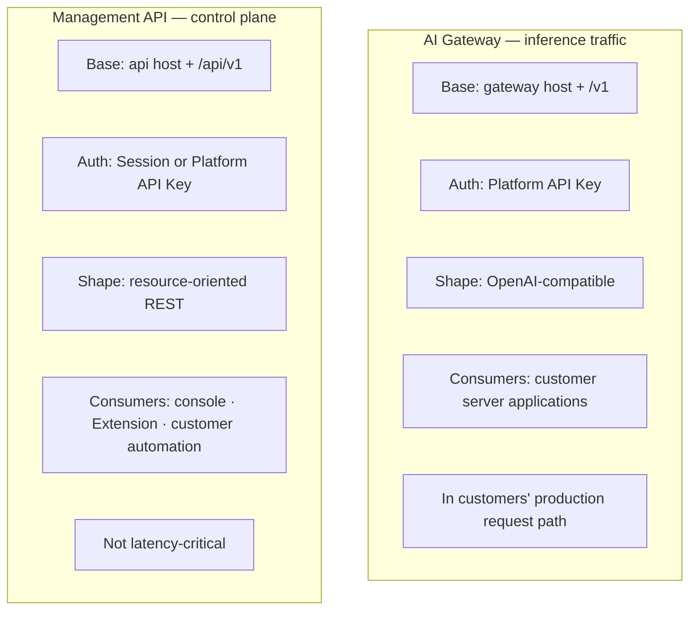
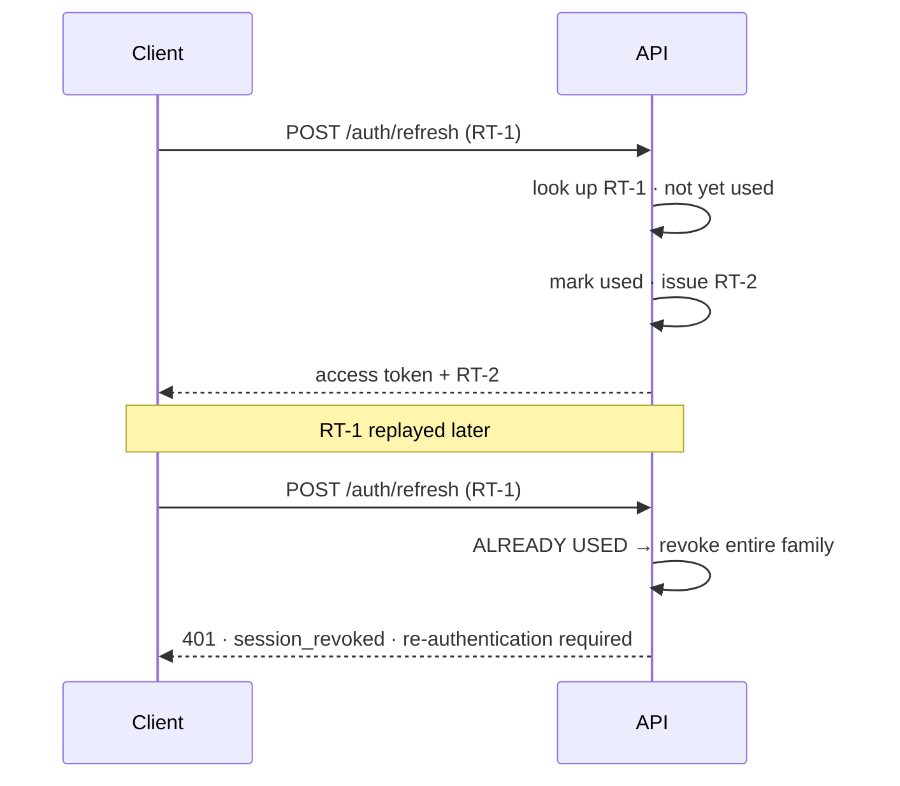
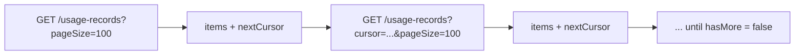
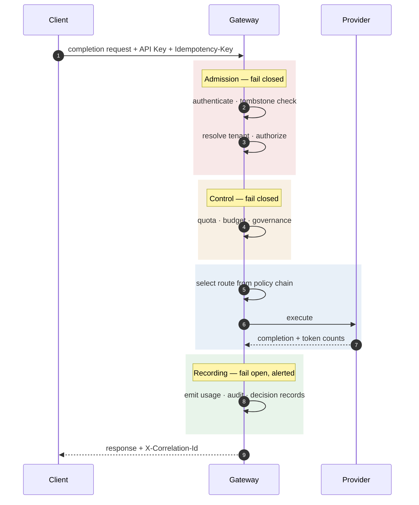
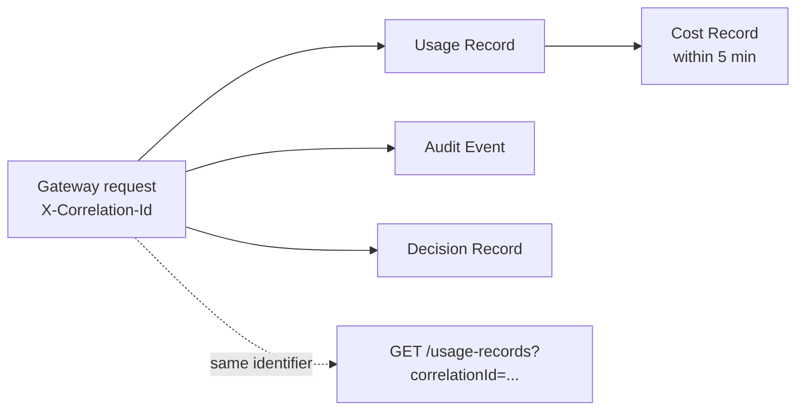
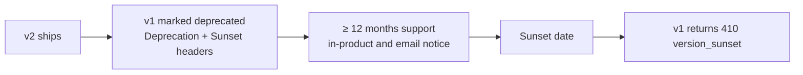

# API Specification

| Field | Value |
| --- | --- |
| Document | REST API Specification |
| Version | 1.0 |
| Status | Draft — **billing metering surface blocked on decision D-4** |
| Owner | Engineering |
| Last updated | 2026-07-30 |
| Audience | Engineering, Security, Product, Technical Writing |
| Phase | 7 — API Specification |

---

> ## Presentation note
>
> This phase excludes OpenAPI documents, so request and response structures are described
> as **field tables** rather than JSON or YAML blocks. The information is equivalent; the
> artifact is documentation rather than a machine-readable specification.
>
> The machine-readable specification is a Phase 8+ deliverable and must be **generated from
> or verified against the implementation** (FR-API-012). A hand-maintained specification
> drifts, and a drifted specification misleads integrators about security behaviour.

---

## Contents

| § | Section | § | Section |
| --- | --- | --- | --- |
| 1 | API overview | 8 | Rate limiting |
| 2 | Authentication and authorization | 9 | AI Gateway API design |
| 3 | Endpoint organization | 10 | Webhooks and events |
| 4 | Request and response standards | 11 | Versioning and deprecation |
| 5 | Query standards | 12 | Observability |
| 6 | Error handling | 13 | Risks and trade-offs |
| 7 | Idempotency and concurrency | | |

---

# 1. API Overview

## 1.1 Purpose

MaintOrbit AI exposes **two externally-consumed interfaces with genuinely different threat
profiles, authentication models, and evolution constraints**. Treating them as one API is the
most common way to get this wrong.

| | AI Gateway | Management API |
| --- | --- | --- |
| Purpose | Inference | Configuration, reporting, administration |
| Authentication | **Platform API Key only** | Session **or** Platform API Key |
| Interface shape | **OpenAI-compatible** (MVP); native (v1.1) | Resource-oriented REST |
| Latency budget | **15 ms platform overhead** | 300 ms p95 |
| Browser origins | **Not permitted** | Allowlisted |
| Evolution | Pinned to a stated provider API version | Semantic, within `/api/v1` |

**Why the Gateway is OpenAI-shaped.** Migration friction is the primary obstacle to coverage,
and coverage is what the product's value depends on. An existing integration migrates by
changing base URL and credential only (FR-GW-004, NFR-USE-005). This is a pragmatic choice with
a stated cost — see §9.2.

## 1.2 Design principles

| # | Principle | Source |
| --- | --- | --- |
| **AP-1** | **Resource-oriented, not action-oriented** — uniformity makes a large API learnable | ADR-0016 |
| **AP-2** | **Stateless** — no server-side request state between calls; every request carries its own authentication and context | ADR-0003 |
| **AP-3** | **Tenant is derived server-side from the credential, never from request input** | TC-1 |
| **AP-4** | **Permissions are resolved server-side per request, never carried in a token** | SD-013 |
| **AP-5** | **One error structure across every endpoint** | FR-API-011 |
| **AP-6** | **Errors state what happened, why, and what to do next** | FR-X-001 |
| **AP-7** | **Backward-compatible within a version; breaking changes require a new version** | NFR-MAINT-008 |
| **AP-8** | **Real-time is SignalR, never REST polling** | ADR-0015 |
| **AP-9** | **Freshness is stated on every projection-derived response** | FR-ANL-008 |
| **AP-10** | **The specification is generated from or verified against the implementation** | FR-API-012 |

## 1.3 REST conventions

| Aspect | Convention |
| --- | --- |
| Paths | **kebab-case, plural nouns** — `/provider-connections`, `/usage-records` |
| Collection | `GET /resources` |
| Item | `GET /resources/{id}` |
| Create | `POST /resources` → `201` with `Location` |
| Full replace | `PUT /resources/{id}` |
| Partial update | `PATCH /resources/{id}` |
| Delete | `DELETE /resources/{id}` → `204` |
| Sub-resource | `/conversations/{id}/messages` |
| **Non-CRUD transitions** | `POST /resources/{id}/{action}` — for example `/provider-connections/{id}/rotate` |
| Current actor | `/employees/me` |
| Current tenant | `/company` — **singular**, because a caller has exactly one |

**AP-1 has a deliberate exception.** Some operations are genuinely not CRUD: rotating a
credential, revoking a key, transferring ownership, releasing a legal hold. Forcing these into
resource semantics produces worse APIs than a named sub-resource action. The exception is
bounded to state transitions that have side effects beyond the resource itself.

## 1.4 Versioning strategy

**URL segment versioning: `/api/v1/`** (ADR-0016).

| Property | Decision |
| --- | --- |
| Location | **URL segment**, not a header |
| Why | Visible in every log line, support request, and reverse-proxy rule |
| Scope | The whole management API versions together |
| Concurrent versions | **At most two** |
| Deprecation notice | **Minimum 12 months** after a successor ships (FR-API-010) |

**The Gateway versions separately** because it tracks an external specification we do not
control. See §11.2.

## 1.5 Stateless design

| Rule | Statement |
| --- | --- |
| No server-side request state between calls | Any API host instance can serve any request |
| Every request carries its own credential | Session token or Platform API Key |
| **Sessions exist, but are not request state** | The session record is looked up per request; the request itself carries nothing beyond the token |
| Pagination state is in the cursor | Not held server-side (§5.4) |
| Idempotency records are durable, not session state | §7.1 |

**"Stateless" here means horizontally scalable, not literally without lookups.** Refresh is
deliberately **stateful** — it consults the session record — because a self-contained token
cannot be revoked within the 60-second requirement (SD-013).

## 1.6 JSON conventions

| Aspect | Convention |
| --- | --- |
| Field naming | **camelCase** — `providerConnectionId`, `createdAtUtc` |
| Query parameters | **camelCase** — `pageSize`, `sortBy` |
| Path segments | **kebab-case** |
| Booleans | Positive phrasing — `isEnabled`, never `isNotDisabled` |
| Enumerations | **String constants**, never ordinals — ordinals break silently on reorder |
| Nulls | **Omitted rather than sent as null**, except where null is semantically distinct |
| Empty collections | `[]`, never null |
| Monetary values | **String-encoded decimal**, never a JSON number |
| Unknown fields in requests | **Rejected** — an unknown field usually means a client bug or a version mismatch |
| Unknown fields in responses | **Clients must tolerate them** — documented from v1 |

**Two of these are load-bearing.**

**Monetary values are string-encoded decimals** because JSON numbers are IEEE-754 doubles in
most parsers, and NFR-DATA-003's 2% cost tolerance cannot survive representation error
accumulated across millions of records. This matches the `numeric` storage decision (DB-P6).

**Clients must tolerate unknown response fields, and this must be stated in the specification
from v1** — not added when the first new field is needed. Adding a field is only a
backward-compatible change if clients were told to expect it.

## 1.7 UTC date and time standard

| Rule | Statement |
| --- | --- |
| Format | ISO 8601 with explicit UTC offset |
| **Storage and transmission** | **UTC always** (FR-X-003) |
| Field suffix | `...AtUtc` — the convention is visible at the point of use |
| Display conversion | Client-side only |
| Precision | Microsecond, matching `timestamptz` |
| Duration | Integer milliseconds with a `Ms` suffix — `latencyMs` |

## 1.8 UUID handling

| Rule | Statement |
| --- | --- |
| Format | Canonical hyphenated lowercase |
| Version | **UUIDv7** (time-ordered) — DD-1 in the database design |
| **Public identifier** | **The same UUID used internally** — no separate public identifier |
| Enumeration | Non-sequential and unpredictable by construction |
| Client generation | Permitted **only** for idempotency keys and correlation identifiers |

**There is no separate public identifier** because UUIDv7 is already unguessable and
non-enumerable. Introducing a second identifier would add a lookup on every request for no
security benefit.

---

# 2. Authentication & Authorization

Grounded in [`../05-security/security-architecture.md`](../05-security/security-architecture.md)
§6–8. This section states the **API-surface consequences**, not the underlying design.

## 2.1 Credential types

**A request carries a Session or a Platform API Key, never both.** Presenting both is rejected
— accepting either on one path invites confused-deputy defects.

| Credential | Surfaces | Transport |
| --- | --- | --- |
| **Access token (JWT)** | Management API | `Authorization: Bearer` |
| **Refresh token** | `/auth/refresh` only | `HttpOnly`, `Secure`, `SameSite` cookie (console); OS keychain (Extension) |
| **Platform API Key** | **Gateway**, Developer API | `Authorization: Bearer` |

## 2.2 JWT Bearer authentication

| Property | Value |
| --- | --- |
| Lifetime | **15 minutes** |
| Signature | Asymmetric |
| **Claims** | Employee, Company, session, issued-at, expiry, **token type** |
| **Not in claims** | **Roles and permissions** |
| Validation | Signature, expiry, issuer, audience, **and token type** |

**Permissions are deliberately excluded from the token.** FR-PERM-005 requires role changes
effective within 60 seconds, which a self-contained 15-minute token cannot honour. Permissions
are resolved server-side per request from cache, with revocation tombstones making it immediate.

**Token type is a validated claim.** A refresh token presented on an access-token path is
rejected — a real and commonly-missed confusion attack.

## 2.3 Refresh token flow

| Rule | API consequence |
| --- | --- |
| Rotation on every use | The response always carries a new refresh token |
| **Reuse revokes the family** | Returns `401` with `session_revoked`; the Employee is notified |
| Grace window | The immediately-previous token is accepted without penalty, absorbing legitimate races between browser tabs |
| Stateful | Revocation takes effect at the next refresh at latest |

## 2.4 OAuth2 login

**Authorization code with PKCE (SHA-256), always. The implicit flow is not supported.**

| Step | Endpoint | Notes |
| --- | --- | --- |
| Initiate | `GET /auth/oauth/{provider}/authorize` | Returns the provider URL with `state` and PKCE challenge |
| Callback | `GET /auth/oauth/{provider}/callback` | **`state` is single-use and session-bound**; redirect URIs are exact-match allowlisted |
| Exchange | Server-side | Assertion validated against the provider's published keys |

**Providers at MVP:** Google, Microsoft (including Azure AD / Entra ID with tenant-restricted
sign-in).

**A federated assertion never by itself grants access to a Company.** Employee provisioning is
governed by invitation and domain policy (FR-TEN-005/006), not by proving control of an email
address.

## 2.5 Future SSO compatibility

| Capability | Release | API consequence |
| --- | --- | --- |
| SAML 2.0 | v1.2 | Additional initiate/callback endpoints under `/auth/saml`; **no change to the token model** |
| **SCIM 2.0** | v1.2 | **A separate SCIM-conformant surface**, not `/api/v1` |
| Group → Team/role mapping | v1.2 | Configuration under `/company/settings` |

**The preparation that matters now:** Employee lifecycle transitions — invite, assign role,
suspend, remove — must exist as **first-class API operations**, not console-only flows. If they
are reachable only through the console, SCIM becomes a rewrite of the identity module rather
than an adapter. This is decided by how MVP is built, not at v1.2.

**SCIM is deliberately not versioned under `/api/v1`.** It is a standards-conformant surface
with its own schema and its own evolution, and forcing it into our versioning scheme would
break conformance.

## 2.6 Permission-based authorization

**Deny by default.** Every operation declares the permission and scope it requires.

| Aspect | Value |
| --- | --- |
| Permission format | `<resource>.<action>` — `provider-connection.create`, `audit.read` |
| **Roles** | **Presets over permissions, never branched on by name** (SD-020) |
| Scope dimensions | **Company · Team · Self**, evaluated together |
| Multiple roles | Union of permissions |
| **Platform API Key scopes** | **Intersection** with role permissions, never union |
| Enforcement point | **At execution**, not at transport |
| Every denial | Produces an audit event (FR-PERM-004) |

**Effective permission is role ∩ key scope.** A key issued by an Owner with a narrow scope
remains narrow — which is what makes it safe to issue a key for one automation without
conferring full authority on whatever holds it.

## 2.7 Tenant context resolution

| Rule | Statement |
| --- | --- |
| **TC-1** | **The Company is derived server-side from the credential — never from a path parameter, header, query parameter, or body field** |
| No tenant in the URL | `/api/v1/teams` returns the caller's Company's Teams; there is no `/companies/{id}/teams` |
| Resolution failure | Rejects; the request never proceeds untenanted |
| Cross-Company access | **Does not exist in this API.** If ever needed it must be a distinct, separately authorized, audited surface |

**This is the rule most likely to be broken by a well-meaning convenience feature.** A "switch
company" parameter or an admin impersonation header reintroduces client-controlled tenancy —
the classic multi-tenant failure.

## 2.8 API key authentication

| Property | Value |
| --- | --- |
| Where | **Gateway** (only credential accepted) and Developer API |
| Format | Non-secret identifying prefix + secret |
| Lookup | **By prefix, constant-time** — SD-011 |
| Storage | SHA-256 hash; the secret is shown **once** at creation and never again |
| Scopes | Restrict capabilities independently of the creator's role |
| Revocation | Immediate, via tombstone |
| **Cascade** | **Automatically revoked when the creating Employee is deprovisioned** (FR-API-016) |

**A Platform API Key must never appear in client-side code.** The Gateway's CORS policy
declines browser origins specifically to discourage this, and the documentation must say so
plainly rather than leaving it implied.

---

# 3. Endpoint Organization

Fifteen groups. Endpoints are described by shape and permission, not enumerated individually.

**Permission notation:** `resource.action` with scope in brackets — `[C]` Company, `[T]` Team,
`[S]` Self.

## 3.1 Authentication — `/api/v1/auth`

| Aspect | Detail |
| --- | --- |
| **Purpose** | Establish, refresh, and terminate authenticated sessions |
| **Resources** | Session, refresh token, OAuth2 flow, MFA enrolment, password reset |
| **Operations** | Sign in · refresh · sign out · OAuth2 authorize and callback · MFA enrol, verify, disable · password reset request and confirm · email verification |
| **Permissions** | **Mostly unauthenticated**; MFA management requires an authenticated session |
| **Rate limiting** | **Most aggressive in the API** — per identity **and** per source (NFR-SEC-016) |
| **Notes** | Sign-out clears the refresh cookie and revokes the family. **Step-up** endpoints re-verify the second factor within a valid session |

## 3.2 Employees — `/api/v1/employees`

| Aspect | Detail |
| --- | --- |
| **Purpose** | Employee lifecycle and profile |
| **Resources** | Employee, invitation, role assignment, session list, preferences |
| **Operations** | List · get · invite · update · assign role · suspend · remove · list own sessions · revoke session |
| **Permissions** | `employee.read [C]` · `employee.invite [C]` · `employee.manage [C]` · `employee.manage [T]` for Team Leads · `employee.read [S]` for `/me` |
| **Notes** | **These are the operations SCIM will drive at v1.2** — building them as API operations now is what makes that an adapter. `DELETE` is a soft removal; ledger and audit records are retained and attributed to the removed identity |

## 3.3 Companies — `/api/v1/company`

| Aspect | Detail |
| --- | --- |
| **Purpose** | The caller's own Company and its settings |
| **Resources** | Company, settings, content retention configuration |
| **Operations** | Get · update · get and update settings · transfer ownership · schedule deletion |
| **Permissions** | `company.read [C]` · `company.manage [C]` · `company.transfer-ownership [C]` (Owner only) · `company.delete [C]` (Owner only) |
| **Notes** | **Singular path** — a caller has exactly one Company. Ownership transfer and deletion require **step-up authentication**. Enabling content retention is a separately audited action (FR-GOV-010) |

## 3.4 Teams — `/api/v1/teams`

| Aspect | Detail |
| --- | --- |
| **Purpose** | Team structure and membership |
| **Resources** | Team, membership |
| **Operations** | List · get · create · update · archive · add and remove members |
| **Permissions** | `team.read [C]` · `team.manage [C]` · `team.manage [T]` for own Teams |
| **Notes** | Archive rather than delete — historical attribution must survive (FR-TEN-015). Nesting arrives at v1.1 |

## 3.5 Provider Connections — `/api/v1/provider-connections`, `/api/v1/models`

| Aspect | Detail |
| --- | --- |
| **Purpose** | Provider credential lifecycle and the model catalogue |
| **Resources** | Provider Connection, Model, model pricing, health |
| **Operations** | List · get · create · **rotate** · disable · enable · delete · list models · refresh catalogue · get health |
| **Permissions** | `provider-connection.read [C]` · `provider-connection.manage [C]` — **Owner and Company Admin only** |
| **Notes** | **No read operation returns a credential.** The response carries the non-secret prefix, status, and health — never the secret, for any role including Owner (SD-003). Create and rotate require **step-up authentication**. Rotation is non-interrupting: both credentials are briefly valid while in-flight requests drain |

## 3.6 AI Gateway — separate base path

Full treatment in §9. Summary:

| Aspect | Detail |
| --- | --- |
| **Purpose** | Inference execution |
| **Base path** | **Distinct host + `/v1`**, so the OpenAI SDK's own path suffix produces a compatible URL |
| **Authentication** | Platform API Key **only** |
| **Operations** | Chat completion (streaming and non-streaming); embeddings and multimodal at v1.1 |
| **Permissions** | `gateway.invoke` plus the key's scopes |
| **Notes** | Routing configuration is managed through the management API at `/api/v1/routing-policies`; the Gateway itself exposes no configuration surface |

## 3.7 Conversations — `/api/v1/conversations`

| Aspect | Detail |
| --- | --- |
| **Purpose** | AI Chat conversation management |
| **Resources** | Conversation |
| **Operations** | List · get · create · rename · archive · delete · search |
| **Permissions** | `conversation.manage [S]` — **own conversations only** |
| **Notes** | **No role reads another Employee's conversations** — not Owner, not Company Admin, not Auditor. Access requires the separately authorized legal-hold process (v1.1). Delete is a **hard delete** (NFR-PRIV-007) |

## 3.8 Messages — `/api/v1/conversations/{id}/messages`

| Aspect | Detail |
| --- | --- |
| **Purpose** | Messages within a Conversation |
| **Resources** | Message |
| **Operations** | List · create (triggers inference, streams) · regenerate · edit-and-branch |
| **Permissions** | `conversation.manage [S]` |
| **Notes** | **`content` may be absent** where content retention is disabled — the message exists with role, token count, and usage attribution, but no content. **Responses must distinguish "not retained" from "empty"**, and clients must render the difference |

## 3.9 Usage — `/api/v1/usage-records`, `/api/v1/cost-records`

| Aspect | Detail |
| --- | --- |
| **Purpose** | The metering ledger |
| **Resources** | Usage Record, Cost Record, Budget, Quota |
| **Operations** | List (filtered) · get · export · manage budgets and quotas |
| **Permissions** | `usage.read [S]` own · `usage.read [T]` Team Lead · `usage.read [C]` Admin, Billing Admin, Auditor · `budget.manage [C]` / `[T]` |
| **Notes** | **Keyset pagination only** (§5.4). **No total counts** — counting across partitions costs as much as the query. Responses state token-estimation proportion (FR-USG-007). Exports are asynchronous and audited |

## 3.10 Analytics — `/api/v1/analytics`

| Aspect | Detail |
| --- | --- |
| **Purpose** | Aggregated reporting |
| **Resources** | Overview, breakdowns by Team/Employee/model/provider/surface, Gateway reliability, model adoption |
| **Operations** | Query with filters · export |
| **Permissions** | Same scoping as Usage |
| **Notes** | **Served from projections, not raw ledger rows.** **Every response carries a freshness indicator** (AP-9, FR-ANL-008) — the client cannot compute projection lag. Filters are constrained to pre-aggregated shapes; arbitrary dimension combinations are not supported |

## 3.11 Billing — `/api/v1/billing`

| Aspect | Detail |
| --- | --- |
| **Purpose** | The commercial relationship with MaintOrbit AI |
| **Resources** | Plan, subscription, invoice, payment method reference |
| **Operations** | Get current plan and consumption · upgrade · downgrade · cancel · list and retrieve invoices · manage payment method |
| **Permissions** | `billing.read [C]` · `billing.manage [C]` — **Owner and Billing Admin only** |
| **Notes** | **⚠️ The consumption surface is blocked on decision D-4** — the billable unit determines what is metered and therefore what this endpoint returns. **No card data crosses this API**; payment method operations exchange an opaque processor token only |

## 3.12 API Keys — `/api/v1/platform-api-keys`

| Aspect | Detail |
| --- | --- |
| **Purpose** | Platform API Key lifecycle |
| **Resources** | Platform API Key |
| **Operations** | List · get · create · revoke |
| **Permissions** | `api-key.manage [S]` own · `api-key.revoke [T]` Team Lead · `api-key.revoke [C]` Admin |
| **Notes** | **The secret is returned exactly once, in the create response, and is never retrievable again** (FR-API-002). List and get return the non-secret prefix, scopes, expiry, and last-used time only. **No update operation** — a key's scopes are fixed at creation; changing them means revoke and reissue |

**The absence of an update operation is deliberate.** A mutable key scope means a credential's
authority can change without the holder knowing, and it complicates the revocation reasoning.

## 3.13 Notifications — `/api/v1/notifications`, `/api/v1/notification-preferences`

| Aspect | Detail |
| --- | --- |
| **Purpose** | In-application notifications and delivery preferences |
| **Resources** | Notification, preference |
| **Operations** | List · mark read · get and update preferences |
| **Permissions** | `notification.read [S]` · `notification.manage [S]` |
| **Notes** | **Real-time delivery is SignalR, not polling** (AP-8). This surface serves history and preferences |

## 3.14 Settings — `/api/v1/company/settings`, `/api/v1/employees/me/preferences`

| Aspect | Detail |
| --- | --- |
| **Purpose** | Company-level configuration and Employee-level preferences |
| **Resources** | Company settings, governance policies, routing policies, content retention, Employee preferences |
| **Operations** | Get · update |
| **Permissions** | `company.manage [C]` for Company settings · `policy.manage [C]` for governance and routing · `preferences.manage [S]` |
| **Notes** | **Every governance policy defaults to monitor mode** on creation (FR-GOV-002). Changes to authentication policy require **step-up authentication** |

## 3.15 Audit — `/api/v1/audit-events`

| Aspect | Detail |
| --- | --- |
| **Purpose** | The immutable compliance record |
| **Resources** | Audit Event, legal hold |
| **Operations** | Search (filtered) · get · export |
| **Permissions** | `audit.read [C]` — **Owner, Company Admin, Auditor only** |
| **Notes** | **Read-only. No create, update, or delete operations exist** (AU-1) — not gated by permission, absent from the API. Search is **structured filtering**, not full-text. **Never contains prompt or completion content** — references it only. Export is audited with actor, scope, and destination |

---

# 4. Request & Response Standards

## 4.1 Success responses

| Operation | Status | Body |
| --- | --- | --- |
| Get item | `200` | The resource |
| List | `200` | Collection envelope (§4.4) |
| Create | `201` + `Location` | The created resource |
| Update | `200` | The updated resource |
| Delete | `204` | Empty |
| Accepted asynchronous | `202` | Operation reference for polling |
| Stream | `200` | Chunked; see §9.3 |

**Single resources are returned unwrapped.** Wrapping every response in a `data` envelope adds
a level of nesting for no benefit when the status code already conveys success.

**Collections are wrapped**, because pagination and freshness metadata need somewhere to live.

## 4.2 Response headers

| Header | Present on | Purpose |
| --- | --- | --- |
| **`X-Correlation-Id`** | **Every response** | Complete request reconstruction (§12.1) |
| `ETag` | Mutable resources | Optimistic concurrency (§7.3) |
| `Location` | `201` | Created resource |
| `Retry-After` | `429`, `503` | Retry guidance |
| `X-RateLimit-*` | Rate-limited endpoints | §8.4 |
| `Deprecation`, `Sunset`, `Link` | Deprecated endpoints | §11.3 |

## 4.3 Error responses

**One structure across every endpoint** (AP-5), including the Gateway.

| Field | Type | Description |
| --- | --- | --- |
| `type` | string | **Stable machine-readable category** — clients branch on this |
| `title` | string | Short human-readable summary |
| `status` | integer | HTTP status |
| `detail` | string | **What happened, why, and what to do next** (AP-6) |
| `correlationId` | string | Matches `X-Correlation-Id` |
| `errors` | array | Field-level details, validation only (§4.5) |
| `retryable` | boolean | Whether retrying could succeed |
| `retryAfterSeconds` | integer | Present when `retryable` is true |
| `providerError` | object | **Gateway only** — the original provider error, preserved |

**`type` is the contract; `detail` is for humans.** Clients must branch on `type`, never on
`detail` text, and this must be stated in the specification — otherwise a message improvement
becomes a breaking change.

**`providerError` exists because FR-GW-006 requires both forms to survive**: the normalized
category so client code branches reliably across providers, and the original so a developer can
diagnose what actually happened.

## 4.4 Collection envelope

| Field | Type | Description |
| --- | --- | --- |
| `items` | array | The page |
| `nextCursor` | string | Opaque; absent when no further pages |
| `hasMore` | boolean | Whether further pages exist |
| `freshnessAsOfUtc` | timestamp | **Projection-derived responses only** |
| `freshnessLagSeconds` | integer | Observed lag |

**There is no `totalCount` on ledger, audit, or analytics collections.** Counting matched rows
across partitions costs as much as the query itself. `hasMore` answers the question a client
actually needs.

**Small bounded collections — Teams, Provider Connections — do carry a total**, because
counting them is cheap and the UI benefits.

## 4.5 Validation errors

`400` with `type` = `validation_failed` and a populated `errors` array:

| Field | Type | Description |
| --- | --- | --- |
| `field` | string | **Dotted path** to the offending field — `messages[2].role` |
| `code` | string | Machine-readable rule — `required`, `max_length`, `not_in_allowed_set` |
| `message` | string | Human-readable explanation |

**Field paths must be precise enough to attach to the correct input.** An error attached to the
wrong field is worse than a generic message, and client and server validation **will** drift
(different languages, different schemas) — so the server is authoritative and its errors must
be mappable.

**All validation failures are returned together**, not one at a time. Returning the first
failure produces a frustrating correction loop.

## 4.6 Metadata, correlation, and trace identifiers

| Identifier | Scope | Origin | Returned? |
| --- | --- | --- | --- |
| **Correlation identifier** | One request | Generated at ingress; **client may supply** | **Always**, in header and error body |
| Trace identifier | Distributed trace | W3C trace context | Propagated, not surfaced in the body |
| **Parent trace identifier** | Logical operation spanning requests | Client-supplied | ⚠️ **Blocked on D-8** |

**A client-supplied correlation identifier is accepted and echoed**, letting customers correlate
their logs with ours. It is validated for format and length, and never trusted for anything
security-relevant.

**The parent trace identifier is decision D-8 and is irreversible.** Agentic workloads produce
many requests under one logical operation. If the field is not accepted at v1.0, every
historical Usage Record lacks it and the data cannot be reconstructed. **Adding an optional
request field later is backward-compatible; recovering the missing data is impossible.**

---

# 5. Query Standards

## 5.1 Filtering

| Convention | Form |
| --- | --- |
| Equality | `?status=active` |
| Multiple values | `?status=active&status=suspended` — repeated, treated as OR |
| Range | `?occurredAfterUtc=...&occurredBeforeUtc=...` |
| Nested | `?team.id=...` |
| **Tenant** | **Never a filter** — always derived from the credential (TC-1) |

**Filters are allowlisted per endpoint.** An arbitrary filter language would permit queries the
index strategy cannot serve, and at ledger volume a single unindexed filter is a table scan
across hundreds of millions of rows.

**Time-range filters are mandatory on ledger and audit collections**, with a maximum span. An
unbounded query over 500 million records is not a query anyone wants to have executed.

## 5.2 Sorting

`?sortBy=createdAtUtc&sortDirection=desc`

| Rule | Statement |
| --- | --- |
| Fields | **Allowlisted per endpoint** — only indexed columns |
| Default | Documented per endpoint; ledger defaults to `occurredAtUtc desc` |
| **Keyset compatibility** | **Sort must match the cursor's index order** — arbitrary sorting is incompatible with keyset pagination |
| Stability | Ties broken by `id`, so ordering is deterministic |

## 5.3 Searching

| Surface | Approach |
| --- | --- |
| **Conversations** | Full-text over content — **only where retention is enabled** |
| **Audit** | **Structured filtering, not full-text** |
| Model catalogue | Fuzzy name matching |
| Employees, Teams | Prefix matching on name and email |

**Conversation search has a limitation the API must surface explicitly.** Where content
retention is disabled there is nothing to search, and the response must distinguish that from
"no matches." Returning an empty result for both would be a confusing and entirely avoidable
failure.

## 5.4 Keyset pagination

**Keyset for ledger, audit, analytics, and conversations. Offset for small bounded lists.**

| Rule | Statement |
| --- | --- |
| Cursor | **Opaque to the client** — encoding is not a contract |
| Composition | `(occurredAtUtc, id)`, matching the index order exactly |
| Stability | Deterministic even when timestamps collide |
| Filter changes | Invalidate the cursor — an error, not silent misbehaviour |
| Expiry | Cursors expire after a bounded period |

**Offset pagination degrades linearly with depth.** Page 10,000 of an audit log requires the
database to count past every preceding row — not viable at the volumes in the database design.

**Offset is retained for small bounded collections** — Teams, Provider Connections, API keys —
where depth is inherently limited and a page number is more useful to a UI.

## 5.5 Limits

| Parameter | Default | Maximum |
| --- | --- | --- |
| `pageSize` | 50 | 200 |
| Time range on ledger queries | Required | 90 days per request |
| Filter values per parameter | — | 20 |
| Request body | — | Bounded per endpoint |
| Export row count | — | Asynchronous above a threshold |

## 5.6 Field selection

**Not supported at v1, deliberately.**

| Consideration | Assessment |
| --- | --- |
| Benefit | Smaller payloads for clients needing few fields |
| **Cost** | Every response shape becomes dynamic; caching fragments; the specification cannot describe a fixed shape; testing surface multiplies |
| Alternative chosen | **Purpose-built endpoints** where a genuinely different shape is needed |
| Reconsider if | Payload size is measured as a real constraint, rather than assumed |

**Purpose-built read endpoints are the answer to console over-fetching** (ADR-0016), not a
field-selection mechanism bolted onto every resource.

---

# 6. Error Handling

## 6.1 HTTP status codes

| Status | Meaning | Notes |
| --- | --- | --- |
| `200` | Success | |
| `201` | Created | With `Location` |
| `202` | Accepted | Asynchronous operation |
| `204` | No content | Delete |
| `400` | Invalid request | Validation, malformed body, unknown field |
| **`401`** | **Not authenticated** | Missing, invalid, expired, or revoked credential |
| **`403`** | **Authenticated but not permitted** | **Always audited** |
| `404` | Not found | **Also returned for cross-tenant references** — see below |
| `409` | Conflict | Concurrency, duplicate, invalid state transition |
| `410` | Gone | Sunset API version |
| `413` | Payload too large | |
| `422` | Semantically invalid | Well-formed but unprocessable |
| **`429`** | **Rate limit or quota exceeded** | **Always carries `Retry-After`** |
| `500` | Internal error | |
| `502` | Provider failure | Gateway only |
| `503` | Unavailable | With `Retry-After` |
| `504` | Timeout | Gateway only |

**Cross-tenant references return `404`, never `403`.** Returning "forbidden" for a resource in
another Company confirms it exists — an information disclosure that assists enumeration. From
the caller's perspective, resources outside their Company do not exist.

**Every `403` produces an audit event** (FR-PERM-004). A burst from one identity is a
privilege-escalation attempt in progress, and denials are the primary detection signal.

## 6.2 Error type taxonomy

Stable `type` values. **Clients branch on these; they are part of the contract.**

| `type` | Status | Retryable | Meaning |
| --- | --- | --- | --- |
| `authentication_failed` | 401 | No | Invalid or missing credential |
| `session_revoked` | 401 | No | Session or family revoked; re-authenticate |
| `mfa_required` | 401 | No | Second factor needed |
| `step_up_required` | 403 | No | Re-verify the second factor for this operation |
| `permission_denied` | 403 | No | Authenticated but not permitted |
| `not_found` | 404 | No | Absent, or outside the caller's Company |
| `validation_failed` | 400 | No | Field-level errors present |
| `unknown_field` | 400 | No | Request contained an unrecognized field |
| `conflict` | 409 | No | Concurrency or duplicate |
| `precondition_failed` | 409 | No | `If-Match` did not match |
| `idempotency_conflict` | 409 | **Yes, later** | Same key in flight |
| `quota_exceeded` | 429 | **Yes, after `Retry-After`** | Platform rate limit |
| `budget_exceeded` | 429 | **No** | **An organizational limit — not the caller's to fix** |
| `policy_blocked` | 403 | No | Governance enforcement |
| `payload_too_large` | 413 | No | |
| `version_sunset` | 410 | No | API version withdrawn |
| `internal_error` | 500 | Yes | Platform fault |
| `service_unavailable` | 503 | Yes | With `Retry-After` |

**Gateway-specific, additional to the above:**

| `type` | Status | Retryable | Fallback attempted? |
| --- | --- | --- | --- |
| `model_unavailable` | 400 | No | Yes |
| `context_length_exceeded` | 400 | No | Only to a larger-context target |
| `provider_throttled` | 502 | **Yes** | **Yes** |
| `provider_unavailable` | 502 | **Yes** | **Yes** |
| `provider_content_filtered` | 400 | No | No |
| `all_targets_exhausted` | 502 | Yes | Chain exhausted |
| `gateway_timeout` | 504 | **Yes** | **Yes** |

**`quota_exceeded` and `budget_exceeded` are both `429` but have opposite retry semantics**, and
conflating them wastes the caller's time. A quota resets — retry after the interval. A budget is
an organizational limit the caller cannot fix by waiting; the message must say who to contact.

**Retry and fallback eligibility is a property of the error category, not a per-call decision**
(GD-009). This keeps resilience deterministic and inspectable.

## 6.3 Retry guidance

| Condition | Guidance |
| --- | --- |
| `429 quota_exceeded` | `Retry-After` in seconds; back off |
| `429 budget_exceeded` | **Do not retry** — contact the Company administrator |
| `502 provider_*` | Retryable; **the platform has already attempted fallback** |
| `503` | `Retry-After` present |
| `500` | Retryable with backoff |
| `409 idempotency_conflict` | Retry after a short delay with the **same** key |
| `4xx` others | **Not retryable** — fix the request |

**Clients must not retry non-retryable errors**, and the `retryable` field exists so that
correct behaviour requires no status-code table on the client side.

**Provider failures reaching the caller mean the platform already exhausted its routing chain.**
An immediate client-side retry duplicates work the Gateway has already done — and, without an
idempotency key, duplicates spend.

---

# 7. Idempotency & Concurrency

## 7.1 Idempotency keys

**SD-015. Materially more important here than in a typical API, because duplicate Gateway
requests are real customer money.**

| Rule | Statement |
| --- | --- |
| Header | `Idempotency-Key`, client-generated UUID |
| **Scope** | **Company-scoped, never global** |
| Where accepted | All mutating operations |
| **Where required** | **Gateway inference** and any operation with financial consequence |
| Replay | Returns the **original recorded outcome** without re-executing |
| In-flight duplicate | `409 idempotency_conflict` — retry shortly |
| Same key, different body | `422` — the key is bound to the request fingerprint |
| Retention | Bounded window, then expiry |

**Without this, a client-side retry storm during a network incident produces a bill the
customer did not authorize** — directly undermining the cost control the platform exists to
provide.

## 7.2 Safe retries

| Method | Idempotent by definition? | Notes |
| --- | --- | --- |
| `GET`, `HEAD` | ✅ | Always safe |
| `PUT`, `DELETE` | ✅ | Safe by semantics |
| `PATCH` | ⚠️ Depends | Use `If-Match` |
| **`POST`** | ❌ | **Requires an idempotency key** |

## 7.3 Optimistic concurrency and ETags

| Rule | Statement |
| --- | --- |
| `ETag` | Returned on mutable single resources, derived from the `rowVersion` column |
| `If-Match` | **Required** on update and delete of concurrency-sensitive resources |
| Mismatch | `409 precondition_failed` |
| Missing `If-Match` | `428` where the resource requires it |
| Not applied to | Immutable resources — ledger, audit — which have no update path |

**Concurrency-sensitive resources** are those where a lost update has real consequence: Company
settings, governance policies, routing policies, budgets, role assignments. For low-contention
resources such as conversation titles, last-write-wins is acceptable and `If-Match` is optional.

**Requiring `If-Match` on everything would be friction without benefit**; requiring it on
nothing would permit silent lost updates to security-relevant configuration. The distinction is
documented per endpoint.

---

# 8. Rate Limiting

## 8.1 Scopes

Three independent scopes, evaluated together. **All are enforced by atomic counters in Redis and
fail closed.**

| Scope | Purpose | Requirement |
| --- | --- | --- |
| **Per Company** | Fairness; prevents one tenant consuming shared capacity | NFR-SCAL-010 |
| **Per Team** | Internal fairness | FR-GW-012 |
| **Per Platform API Key** | Bounds a single compromised key | FR-GW-012 |
| Per identity and source on authentication endpoints | Credential stuffing | NFR-SEC-016 |
| Coarse per connection at the edge | Volumetric protection | — |

**Limits are per plan and configurable per Company.** The response indicates **which scope was
exceeded**, because "you are rate limited" without saying which limit is unactionable.

## 8.2 Burst handling

Token-bucket semantics: a sustained rate with a burst allowance, so brief spikes succeed while
sustained excess is throttled. **The burst allowance is published** — an undocumented allowance
produces clients tuned to behaviour that may change.

## 8.3 Fail-closed behaviour

**Rate limiting, quota, and budget checks fail closed** (SD-004). If the counter store is
unavailable, requests are **rejected**, not permitted.

**This is a deliberate availability trade-off**: a limit that stops enforcing under
infrastructure degradation is not a limit. The consequence — a Redis outage rejecting traffic —
is a known open decision (D-3) recorded in the security architecture, and it is stated here so
integrators understand the failure mode rather than discovering it.

## 8.4 Response headers and `Retry-After`

| Header | Meaning |
| --- | --- |
| `X-RateLimit-Limit` | Ceiling for the applicable window |
| `X-RateLimit-Remaining` | Remaining in the window |
| `X-RateLimit-Reset` | When the window resets |
| `X-RateLimit-Scope` | **Which scope applied** — company, team, key |
| **`Retry-After`** | **Always present on `429`** |

**`Retry-After` on every `429` is not optional** (API-c). A rejection without retry guidance
produces tight retry loops that make the condition worse — the client cannot behave correctly
without it.

---

# 9. AI Gateway API Design

## 9.1 Base path and migration

**This is the mechanism by which existing traffic reaches the platform**, and it is worth being
precise about.

| Element | Value |
| --- | --- |
| Gateway base URL | A dedicated host plus `/v1` |
| Path | `/chat/completions` — **appended by the provider SDK itself** |
| Credential | Platform API Key in `Authorization: Bearer` |
| **Migration** | **Change base URL and credential. Nothing else** |

**Nothing else changes** — not the request shape, not the response shape, not the SDK. That is
the entire point (NFR-USE-005), and it is why the Gateway lives on its own base path rather
than under `/api/v1`.

## 9.2 The compatibility trade-off, stated

**Adopting one provider's shape as the external interface gives that provider's model of the
world a privileged position**, which sits uneasily with the neutrality pillar.

| Mitigation | Detail |
| --- | --- |
| **Internal port is provider-neutral** | No provider is privileged inside the system (ADR-0009) |
| **Native interface at v1.1** | Provider-neutral surface for new integrations (FR-GW-005) |
| **Compatibility is version-pinned** | To a stated provider API version, published in documentation |
| **Divergences documented** | See §9.7 |

**Compatibility mode remains permanently as the migration path.** It is not deprecated when the
native interface ships.

## 9.3 Chat completion flow

**Admission and control stages fail closed; recording fails open** (SD-004). A metering fault
never becomes a customer outage — but a failure to record is treated as an incident, alerted,
and reconciled.

## 9.4 Streaming responses

| Property | Value |
| --- | --- |
| Transport | Server-sent chunked response, matching the compatible provider's streaming format |
| First token | Within **50 ms** of the provider's first token (NFR-PERF-004) |
| Per-chunk overhead | **≤ 5 ms** (NFR-PERF-005) |
| Token counts | **Arrive at stream end** — usage cannot be emitted before completion |
| Cancellation | Client disconnect propagates to the provider where supported |

**Two behaviours the specification must state explicitly, because they surprise integrators:**

**Fallback is impossible after the first byte.** Once a chunk is sent, the response is committed
to that target. A provider failing mid-stream produces a **truncated response**, and the client
must handle it. Fallback protects against failure to *start*, not failure part-way through.

**Client disconnect still records usage** for tokens already consumed. The provider bills for
them; discarding the record would under-report cost silently and breach the 2% accuracy
tolerance in a way that is very hard to diagnose.

## 9.5 Provider abstraction

| Aspect | API consequence |
| --- | --- |
| Model selection | By model identifier; the Routing Policy resolves it to a Provider Connection |
| **Opaque pass-through** | **Provider-specific parameters the abstraction does not model are carried through** (AD-007) |
| Tool and function calling | Passed with **native fidelity** (FR-GW-021) |
| Error normalization | Normalized category **plus the original** (§4.3) |

**Requests using pass-through parameters are provider-specific and may not fall back
meaningfully** — a limitation documented rather than hidden. The decision record shows when
fallback was skipped and why.

## 9.6 Usage, cost, and correlation

| Aspect | Detail |
| --- | --- |
| **Correlation** | Returned on **every** Gateway response; queryable in the usage API |
| Usage freshness | ≤ 60 seconds (NFR-PERF-013) |
| Cost freshness | ≤ 5 minutes (NFR-PERF-014) |
| Token counts | Provider-reported where available; **estimation flagged** (FR-USG-007) |
| **Failed requests** | **Also produce all three records** — a ledger of successes only cannot support investigation |
| Decision record | Full routing reconstruction, retrievable by correlation identifier (NFR-OBS-006) |

**The correlation identifier is what makes a support conversation tractable.** A customer
supplies one identifier rather than a timestamp and a description, and the platform reconstructs
exactly what happened — which target was selected, which alternatives were considered, which
retries occurred and why.

## 9.7 Documented divergences from the compatible provider API

**These must be published, not discovered** (V-13).

| Divergence | Reason |
| --- | --- |
| `403 policy_blocked` | Governance enforcement — no provider equivalent |
| `429 budget_exceeded` | Organizational limit — no provider equivalent |
| `X-Correlation-Id` on every response | Platform capability |
| `Idempotency-Key` accepted | Platform capability |
| Rate limit headers reflect **platform** limits | Distinct from the provider's own |
| Errors carry the platform envelope with `providerError` nested | Both forms must survive |
| Some provider-specific parameters pass through opaquely | Abstraction boundary |

---

# 10. Webhooks & Events

**Webhooks arrive at v1.1** (FR-API-013). The design is specified now because event naming and
versioning are cheap to establish and expensive to retrofit.

## 10.1 Event naming

`<domain>.<entity>.<past-tense-verb>` — for example `usage.budget.threshold-crossed`,
`providers.connection.health-degraded`, `identity.employee.deprovisioned`.

| Rule | Statement |
| --- | --- |
| **Past tense** | An event is something that **happened**; present tense implies a command |
| Domain prefix | Matches the module schema |
| Stability | **An event name is a contract** — renaming requires a new name and a deprecation period |

## 10.2 Delivery guarantees

| Property | Value |
| --- | --- |
| Guarantee | **At-least-once** |
| **Consumer requirement** | **Must be idempotent** — every event carries a unique `eventId` |
| Ordering | **Not guaranteed** — events carry `occurredAtUtc` for consumer-side ordering |
| Latency | Best-effort, seconds |

**At-least-once with no ordering guarantee is stated plainly** because consumers who assume
exactly-once and ordered delivery build systems that break under redelivery — and redelivery is
normal, not exceptional.

## 10.3 Retry policy

| Aspect | Value |
| --- | --- |
| Success | `2xx` within a timeout |
| Retries | Exponential backoff over an extended window |
| **Endpoint disabling** | After sustained failure, with **administrator notification** |
| Replay | Failed deliveries retrievable and manually replayable |

## 10.4 Signature verification

| Element | Purpose |
| --- | --- |
| Signature header | HMAC over the raw body using a per-endpoint secret |
| **Timestamp header** | **Included in the signed payload** |
| Tolerance window | Deliveries outside it are rejected |
| Secret rotation | Overlapping validity — both accepted during transition |

**The timestamp must be signed, not merely sent.** Without it, a captured delivery can be
replayed indefinitely. Consumers must verify the signature **before parsing the body** —
otherwise parsing untrusted input precedes authentication.

## 10.5 Event versioning

| Rule | Statement |
| --- | --- |
| Every event carries `eventVersion` | |
| Additive changes | Do not increment; **consumers must tolerate unknown fields** |
| Breaking changes | New version; **both published during a transition** |
| Subscription | Consumers may subscribe to a specific version |

**Versioning events costs almost nothing now and cannot be retrofitted into a running stream.**
It matters most after module extraction, when publisher and consumer deploy independently.

---

# 11. API Versioning & Deprecation

## 11.1 URI versioning

`/api/v1/` — visible in every log line, support request, and proxy rule.

## 11.2 Two independent version streams

| Surface | Versioning | Driver |
| --- | --- | --- |
| **Management API** | `/api/v1` — **we control the cadence** | Our roadmap |
| **Gateway compatibility** | **Pinned to a stated provider API version** | An external specification |

**Provider API changes do not automatically propagate.** Adopting a newer shape is a deliberate,
versioned decision — because tracking upstream automatically would mean an external change could
break customer integrations we migrated onto the platform, which is the opposite of the
stability the migration promised.

## 11.3 Backward compatibility within a version

| Compatible | Breaking |
| --- | --- |
| Adding an **optional** request field | Adding a **required** request field |
| Adding a response field | Removing or renaming a response field |
| Adding an endpoint | Removing an endpoint |
| Adding an enum value **where clients were told to tolerate unknown values** | Adding one where they were not |
| Relaxing validation | Tightening validation |
| Adding an optional query parameter | Changing a default |
| Adding a new error `type` | **Changing an existing `type`'s meaning** |
| Improving `detail` text | Changing `type` values |

**The enum row is the subtle one.** Adding a value is only safe if clients were instructed to
tolerate unknown values — **and that instruction must be in the specification from v1**, not
added when the first new value is needed.

## 11.4 Deprecation and sunset

| Property | Value |
| --- | --- |
| Concurrent versions | **At most two** |
| Notice | **Minimum 12 months** (FR-API-010) |
| Headers | `Deprecation`, `Sunset`, `Link` to the migration guide |
| Notification | In-product, email to Owners and Company Admins, and in the specification |
| After sunset | `410 version_sunset` with a migration link — **never a silent failure** |
| Usage tracking | Per-version usage monitored so sunset is informed by evidence, not assumption |

---

# 12. Observability

## 12.1 Correlation identifiers

| Property | Value |
| --- | --- |
| Generation | At ingress; **a client-supplied identifier is accepted and echoed** |
| Propagation | Every component, every record type |
| **Return** | **In `X-Correlation-Id` on every response and in every error body** |
| Retrieval | Queryable in usage, audit, and decision records |

**Without returning it, NFR-OBS-006 is unusable in a support conversation** — the customer has
nothing to quote.

## 12.2 Trace propagation

W3C trace context headers accepted and propagated, covering the full request path **including
provider calls**. Hot-path sampling is configurable at runtime, because an investigation may
need complete capture for a specific tenant without a deployment.

## 12.3 Request logging

| Rule | Statement |
| --- | --- |
| Format | Structured, machine-parseable |
| **Never logged** | **Credentials, tokens, prompt or completion content** (NFR-OBS-009) |
| Mechanism | **Absent by construction**, not masked after the fact |
| Cross-tenant | No cross-tenant identifiers |
| Sampling | Permitted for logs; **never for audit or usage** |

## 12.4 Metrics

Per endpoint and per surface: request rate, error rate by `type`, latency distribution,
**Gateway overhead measured and published** (NFR-PERF-018), rate-limit rejections by scope,
authentication failures. Per-Company metrics are scoped so they cannot expose cross-tenant data.

## 12.5 Audit integration

| Operation class | Audited? |
| --- | --- |
| Authentication | ✅ Every attempt |
| **Authorization denial** | ✅ **Every `403`** |
| Configuration change | ✅ With before and after state |
| Credential lifecycle | ✅ Never the credential itself |
| Data export | ✅ Actor, scope, destination |
| Read operations | ❌ Except content access under legal hold |
| Gateway inference | ✅ Via usage and audit records |

**Audit is emitted by the pipeline, not by handlers.** If each handler decided, coverage would
be a function of developer discipline and FR-AUD-001 would not hold.

---

# 13. Risks & Trade-offs

## 13.1 Design decisions

| # | Decision | Rationale |
| --- | --- | --- |
| **API-D1** | **Two distinct interfaces with different base paths, auth, and versioning** | Different threat profiles and evolution constraints; conflating them is the common failure |
| **API-D2** | **Gateway is OpenAI-shaped for base-URL-only migration** | Migration friction is the primary obstacle to coverage |
| **API-D3** | **Tenant never appears in a path, parameter, or body** | TC-1 — client-controlled tenancy is the classic multi-tenant failure |
| **API-D4** | **Permissions resolved per request, never in the token** | FR-PERM-005's 60-second requirement |
| **API-D5** | **Cross-tenant references return `404`, not `403`** | `403` confirms existence — an enumeration aid |
| **API-D6** | **Monetary values are string-encoded decimals** | JSON numbers are doubles; 2% cost tolerance cannot survive it |
| **API-D7** | **No `totalCount` on ledger collections** | Counting across partitions costs as much as the query |
| **API-D8** | **Keyset pagination on high-volume; offset on small bounded lists** | Offset degrades linearly with depth |
| **API-D9** | **`quota_exceeded` and `budget_exceeded` are distinct** | Opposite retry semantics; conflating them wastes the caller's time |
| **API-D10** | **Idempotency required on Gateway inference** | Duplicate requests are unauthorized customer spend |
| **API-D11** | **`If-Match` required only on concurrency-sensitive resources** | Universal requirement is friction; none permits silent lost updates |
| **API-D12** | **No field selection at v1** | Dynamic shapes defeat specification, caching, and testing |
| **API-D13** | **Clients must tolerate unknown response fields, stated from v1** | Otherwise adding a field is breaking |
| **API-D14** | **Clients branch on `type`, never on `detail`** | Otherwise a message improvement becomes breaking |
| **API-D15** | **SCIM is a separate surface, not under `/api/v1`** | Standards conformance would break under our versioning |
| **API-D16** | **Events are versioned from the first event** | Cannot be retrofitted into a running stream |
| **API-D17** | **Gateway divergences from the compatible provider API are published** | Discovery is a worse way to learn them |
| **API-D18** | **No update operation on Platform API Keys** | Mutable scope changes a credential's authority invisibly |

## 13.2 Trade-offs

| # | Gained | Given up |
| --- | --- | --- |
| T-1 | OpenAI-compatible Gateway enables near-zero-cost migration | A provider's model of the world is privileged in our external interface |
| T-2 | Two interfaces, each fit for purpose | Two surfaces to document, test, and version |
| T-3 | No tenant in the URL | No cross-Company administrative view; would require a separate surface |
| T-4 | Per-request permission resolution | A cache read per request rather than a token claim |
| T-5 | Keyset pagination | No jump-to-page; sort must match cursor order |
| T-6 | No total counts | UIs cannot show "page 3 of 47" on ledger data |
| T-7 | No field selection | Some clients over-fetch |
| T-8 | Fail-closed rate and budget checks | A counter-store outage rejects traffic |
| T-9 | Strict unknown-field rejection on requests | A client sending an extra field fails rather than silently succeeding |
| T-10 | Idempotency on inference | Storage and lookup per request; a client contract to document |

## 13.3 Open questions

| # | Question | Blocks | Owner |
| --- | --- | --- | --- |
| **🔴 D-4** | **What is the billable unit?** | **`/billing` consumption surface cannot be specified** | Leadership |
| **🔴 D-8** | **Does the Gateway accept a parent trace identifier at v1.0?** | **Irreversible** — adding the field later is compatible, but the missing historical data cannot be recovered | Product & Engineering |
| 🟠 — | **Which provider API version does compatibility pin to?** | Published compatibility statement; divergence list | Engineering |
| 🟠 — | **Provider prompt-caching token classes** | Usage response shape — an input/output pair is insufficient when providers price cached input differently | Engineering & Product |
| 🟠 D-3 | Gateway behaviour during a counter-store outage | §8.3 documented failure mode | Product & Engineering |
| 🟠 — | **Does RLS prevent partition pruning?** | If it does, analytics filters must be constrained to pre-aggregated shapes — a **contract** constraint, not just a performance one | Engineering |
| 🟠 D-5 | Default retention periods | Values returned by settings endpoints | Product & Legal |
| 🟡 — | Native Gateway interface shape (v1.1) | FR-GW-005 | Product & Engineering |
| 🟡 — | Idempotency key retention window | Client guidance | Engineering |
| 🟡 — | Webhook event catalogue (v1.1) | Consumer contracts | Product |

## 13.4 Future improvements

- **Native Gateway interface** (v1.1) — provider-neutral surface; adoption should be tracked, because if it stays low the compatibility interface is the real product interface.
- **Client libraries** (FR-API-015, v1.1) — TypeScript and Python, generated from the specification.
- **Audit export API** (FR-API-009, v1.1) and **organizational management API** (FR-API-008, v1.1).
- **Webhooks** (v1.1) — designed here, implemented then.
- **Embeddings and multimodal** (v1.1) — neither fits the chat-completion shape cleanly; the port may need to become capability-specific.
- **Conditional requests on collections** — `If-None-Match` for polling clients, once caching behaviour is measured.
- **A published deprecation calendar** — makes the 12-month commitment visible rather than internal.
- **Response caching headers** on reference data — the model catalogue changes rarely and is fetched often.

## 13.5 Cross references

| Document | Relationship |
| --- | --- |
| [`../03-adr/ADR-0016-rest-api.md`](../03-adr/ADR-0016-rest-api.md) | **The governing decision** — versioning, compatibility interface, style |
| [`../03-adr/ADR-0009-ai-provider-abstraction.md`](../03-adr/ADR-0009-ai-provider-abstraction.md) | Error taxonomy; pass-through |
| [`../03-adr/ADR-0010-gateway-hot-path.md`](../03-adr/ADR-0010-gateway-hot-path.md) | Latency budget constraining §9 |
| [`../03-adr/ADR-0015-signalr.md`](../03-adr/ADR-0015-signalr.md) | Why real-time is not REST polling |
| [`../03-adr/ADR-0021-fail-open-fail-closed.md`](../03-adr/ADR-0021-fail-open-fail-closed.md) | §8.3 failure behaviour |
| [`../05-security/security-architecture.md`](../05-security/security-architecture.md) | §6–8 authentication and authorization; §24 API security |
| [`../05-security/threat-model.md`](../05-security/threat-model.md) | API-surface threats |
| [`../06-database/database-design.md`](../06-database/database-design.md) | Pagination, identifiers, retention behind these endpoints |
| [`../04-technology/coding-standards.md`](../04-technology/coding-standards.md) | Naming conventions |
| [`../02-architecture/request-flow.md`](../02-architecture/request-flow.md) | End-to-end flows behind §9 |
| [`../01-product/product-requirements.md`](../01-product/product-requirements.md) | FR-API, FR-GW, FR-PERM |
| [`../01-product/glossary.md`](../01-product/glossary.md) | **Normative vocabulary and path conventions** |

> **Note on location.** `docs/07-api/` sits alongside `docs/07-adr/` and the empty
> `docs/04-api/` from Phase 0 — the fourth and fifth numbering collisions in the documentation
> set. Worth reconciling before Phase 8.
