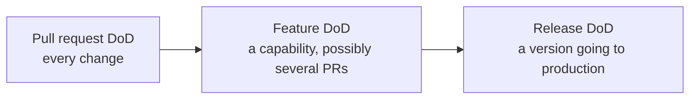

# Definition of Done

| Field | Value |
| --- | --- |
| Document | Definition of Done |
| Version | 1.0 |
| Status | Draft — pending engineering review |
| Owner | Engineering & Product |
| Last updated | 2026-07-30 |
| Audience | Engineering, Product, QA, Security |
| Phase | 8 — Development Standards |

---

## 1. Purpose

This document defines what "done" means, as **measurable criteria rather than judgement**.

Its existence traces to a product commitment:
[`../01-product/mission.md`](../01-product/mission.md) §4.9 — *"Ship the complete slice. A
feature is done when it exists end to end: API, permission model, audit events, usage metering,
UI, documentation, and tests. Half-delivered features accumulate into a product that appears
complete and behaves inconsistently."*

**The purpose is to make partial completion visible.** Without a stated definition, "done" means
"the happy path works on my machine," and the missing audit event or absent permission check is
discovered months later by a customer's security reviewer.

## 2. Scope

**In scope:** completion criteria at three levels — pull request, feature, and release — plus
the exception process and how the definition is verified.

**Out of scope:** how to write the code
([`coding-standards.md`](coding-standards.md)); how tests are structured
([`testing-strategy.md`](testing-strategy.md)); how changes merge
([`git-workflow.md`](git-workflow.md)).

---

## 3. Three levels

**Not everything applies to every change.** A documentation fix does not need a performance
review; a new Gateway capability does.

| Level | Applies to | Gate |
| --- | --- | --- |
| **Pull request** | Every change | Merge to `main` |
| **Feature** | A user-visible capability | Marking the ticket done |
| **Release** | A version | Tagging and deployment |

---

## 4. Pull request definition of done

**Every item is verifiable. ⚑ blocks merge. ⚙️ is checked mechanically.**

### 4.1 Functional completion

| | Criterion |
| --- | --- |
| ⚑ | The change does what its ticket describes — **and nothing beyond it** |
| ⚑ | Acceptance criteria on the ticket are met and demonstrable |
| ⚑ | Failure paths are handled, not only the success path |
| ⚑ | Error messages state **what happened, why, and what to do next** |
| | Edge cases identified in review are handled or explicitly deferred with a ticket |

### 4.2 Tests

| | Criterion |
| --- | --- |
| ⚑ ⚙️ | **All existing tests pass** |
| ⚑ | New behaviour has tests **at the lowest level that verifies it** |
| ⚑ | A defect fix ships with a test **observed to fail before the fix** |
| ⚑ ⚙️ | Domain and application coverage remains **≥ 80%** |
| ⚑ | **Every new background job has an idempotency test** |
| ⚑ | **Every new tenant-scoped table has a per-relation isolation test** |
| ⚑ | **Every new fail-open / fail-closed classification has an injection test** |
| ⚑ ⚙️ | **No flaky tests introduced** — a flaky test is a defect, not a nuisance |

### 4.3 Architecture

| | Criterion |
| --- | --- |
| ⚑ ⚙️ | **Architecture tests AT-1 … AT-12 pass** |
| ⚑ | Layer and module boundaries respected; cross-module references use published contracts only |
| ⚑ | No new Gateway hot-path exception without an ADR |
| ⚑ | An architecturally significant decision is recorded as an **ADR in the same pull request** |

### 4.4 Security

| | Criterion |
| --- | --- |
| ⚑ | **Authorization evaluated at execution**, with correct permission and scope |
| ⚑ ⚙️ | **Tenant isolation tests pass** |
| ⚑ | **A new tenant-scoped table has its row-level security policy in the same migration** |
| ⚑ | **No credential, token, or content can reach a log, trace, or error message** |
| ⚑ ⚙️ | **Secret scanning passes** |
| ⚑ ⚙️ | **Dependency vulnerability scan passes** — no unresolved critical findings |
| ⚑ | Queries parameterized, including in Analytics |
| ⚑ | **A change to what an actor can do has been checked against the permission matrix** |
| ⚑ | **Security-sensitive changes have a second approval** from a security-aware reviewer |

### 4.5 Data

| | Criterion |
| --- | --- |
| ⚑ | **Migrations are backward-compatible with the previous application version** |
| ⚑ | Removals and renames use **expand-and-contract**, not a single migration |
| ⚑ | Monetary values are `decimal`, never floating point |
| ⚑ | Ledger queries are time-bounded |
| | The database design document is updated where the schema changed |

### 4.6 Observability

| | Criterion |
| --- | --- |
| ⚑ | **Qualifying operations emit audit events** |
| ⚑ | Usage metering applied where the operation consumes provider capacity |
| ⚑ | The correlation identifier is propagated and returned |
| | Logs are structured, with no content or credentials |
| | Alertable conditions have a runbook **before the alert is enabled** |

### 4.7 Documentation

| | Criterion |
| --- | --- |
| ⚑ | **API specification updated in the same pull request** where the public surface changed |
| ⚑ | An ADR accompanies an architecturally significant decision |
| | User-facing documentation updated for user-visible behaviour |
| | `.env.example` structure updated for new configuration |
| | Non-obvious reasoning captured in a comment explaining **why** |

### 4.8 Review

| | Criterion |
| --- | --- |
| ⚑ | **Author has self-reviewed first** |
| ⚑ | Required approvals obtained — **1 standard, 2 for security, architecture, or migration** |
| ⚑ | **Every `blocking:` comment resolved** |
| ⚑ | Author never self-approves |
| | Pull request under 400 changed lines, or a stated reason given |

---

## 5. Feature definition of done

A feature may span several pull requests. **It is not done when the last one merges** — it is
done when the complete slice exists.

### 5.1 The complete slice

Per mission §4.9. **All of these, or it is not done:**

| | Layer |
| --- | --- |
| ⚑ | **Backend implementation with permission enforcement at execution** |
| ⚑ | **Tenant isolation verified by test** |
| ⚑ | **Audit events emitted for every relevant action** |
| ⚑ | **Usage metering where applicable** |
| ⚑ | **Frontend implementation meeting WCAG 2.1 Level AA** |
| ⚑ | **Error states implemented** — what happened, why, what next |
| ⚑ | **Unit, integration, and functional tests** |
| ⚑ | **Architecture tests passing** |
| ⚑ | **API specification updated** |
| ⚑ | **User-facing documentation** |
| ⚑ | **Relevant NFR targets verified under load** |

### 5.2 Additional feature-level criteria

| | Criterion |
| --- | --- |
| ⚑ | Every acceptance criterion demonstrable in a non-production environment |
| ⚑ | The feature works for **all applicable roles**, and is correctly denied to others |
| ⚑ | **Multi-tenant behaviour verified with at least two Companies** |
| ⚑ | **No critical or high-severity defects open** |
| | Medium and low defects triaged with a decision recorded |
| | Product owner has accepted against the acceptance criteria |
| | Feature flag removed, or its removal ticketed |
| | Telemetry exists to answer "is this being used, and does it work?" |

**The multi-tenant criterion is not ceremony.** A feature tested with one Company will pass
whether or not tenant scoping was implemented correctly — the defect only appears when a second
Company exists.

### 5.3 Performance review

Required where a feature touches the hot path, adds a query against a large table, or adds a
background job.

| | Criterion |
| --- | --- |
| ⚑ | **Hot-path changes measured against the stage budget** — exceeding an allocation is a defect, not a tuning opportunity |
| ⚑ | New queries reviewed for index usage and partition pruning |
| ⚑ | Background jobs bounded and idempotent |
| | Load test updated if the feature changes the traffic profile |

### 5.4 Security review

Required where a feature touches authentication, authorization, tenancy, credentials,
encryption, audit, or the API surface.

| | Criterion |
| --- | --- |
| ⚑ | Threat model reviewed for new attack surface |
| ⚑ | Security checklist items for the affected area verified |
| ⚑ | Data classification assigned to any new data |
| ⚑ | New external dependency passed the six admission gates |
| | Security-aware reviewer has signed off explicitly, not implicitly |

---

## 6. Release definition of done

### 6.1 Standard release

| | Criterion |
| --- | --- |
| ⚑ | **All features in scope meet the feature definition of done** |
| ⚑ | **`main` is green** — every required check passing |
| ⚑ | **No critical or high-severity defects open** |
| ⚑ | Migrations verified backward-compatible against the previous version |
| ⚑ | Rollback verified |
| ⚑ | Version determined from Conventional Commits; **annotated tag applied** |
| ⚑ | Release notes generated and reviewed |
| ⚑ | Runbooks exist for any new alerting condition |
| | Deployment rehearsed in staging |
| | Support and documentation informed of user-visible changes |

### 6.2 General availability — the release gates

**These are separate and stricter. GA does not proceed with any unresolved.**

| # | Gate |
| --- | --- |
| **G-1** | Tenant isolation strategy ratified; **connection pooling mode verified against session-scoped row-level security** |
| **G-2** | **Key-encryption key backup created, restore procedure tested, escrow with split custody established** |
| **G-3** | Runtime within its vendor support window |
| **G-4** | Published availability commitment matches the deployed topology |
| **G-5** | Gateway behaviour during a counter-store outage decided and documented |
| **G-6** | Ingestion durability position resolved and honestly stated in customer material |
| **G-7** | **Independent penetration test completed; critical findings resolved** |
| **G-8** | **Vulnerability disclosure process published and monitored** |
| **G-9** | **Zero cross-tenant exposures in testing** |
| **G-10** | **Zero usage or audit records lost in testing** |

**G-9 and G-10 admit no tolerance.** Any non-zero value blocks release regardless of every
other result — cross-tenant exposure and ledger loss have no partial credit.

### 6.3 Deployment readiness

| | Criterion |
| --- | --- |
| ⚑ | Images built once and promoted — **never rebuilt per environment** |
| ⚑ | Migration runs to completion **before** any new container starts |
| ⚑ | Health checks gate return to rotation |
| ⚑ | Rollback possible without data loss |
| ⚑ | Secrets injected at container start, none baked into images |
| | Monitoring and alerting confirmed active for the new version |

---

## 7. Exception process

**Some criteria will occasionally not be met. That must be a decision, not an omission.**

| Rule | Statement |
| --- | --- |
| **EX-1** | An exception requires a **recorded reason, a named owner, and a repayment trigger** |
| **EX-2** | Exceptions are recorded on the ticket and visible in the pull request |
| **EX-3** | **⚑ items require approval from an engineering lead** |
| **EX-4** | **Security, tenancy, and audit criteria are not exceptable** — a known cross-tenant risk or an unenforced audit path is a defect, not debt |
| **EX-5** | **Release gates G-1 … G-10 are not exceptable** |
| **EX-6** | Exceptions are reviewed at each release; an item unresolved for two cycles is escalated |

**EX-4 draws the line that matters.** Deferring a UI polish item is a trade-off. Deferring
tenant isolation verification is shipping a defect with a different name — and the whole point
of writing these down in advance is so that distinction is made calmly rather than at a
deadline.

---

## 8. Verification

**A checklist marked complete is an assertion. A dated record with an owner is evidence.**

| Level | Verification |
| --- | --- |
| Pull request | Mechanical checks in CI; ⚑ items confirmed in review |
| Feature | Product owner acceptance; security and performance sign-off where applicable |
| Release | **Dated verification record with a named owner** |

**The release record is what SOC 2 Type II asks for.** It examines whether controls *operated
effectively over a period*, not whether they were designed — so the artifact that matters is
evidence of operation, not a document describing intent.

---

## 9. Design decisions

| # | Decision | Rationale |
| --- | --- | --- |
| **DoD-1** | **Three levels rather than one** | A documentation fix and a Gateway capability need different bars |
| **DoD-2** | **Every criterion is verifiable** | "Code is clean" is not a criterion |
| **DoD-3** | **⚑ blocking items separated from advisory** | Otherwise everything is optional or everything blocks |
| **DoD-4** | **⚙️ marks mechanical checks** | A criterion depending on memory is not a control |
| **DoD-5** | **The complete slice is the feature bar** | Directly from mission §4.9 |
| **DoD-6** | **Multi-tenant verification with two Companies** | One Company cannot detect an isolation failure |
| **DoD-7** | **Security, tenancy, and audit criteria are not exceptable** | They are defects, not debt |
| **DoD-8** | **Release gates are separate and stricter** | Some things block a version, not a change |
| **DoD-9** | **G-9 and G-10 admit no tolerance** | No partial credit on cross-tenant exposure or ledger loss |
| **DoD-10** | **Exceptions require an owner and a trigger** | An undeclared exception is indistinguishable from an oversight |
| **DoD-11** | **Release verification is a dated record, not a checkbox** | Evidence of operation, not of intent |

## 10. Trade-offs

| # | Gained | Given up |
| --- | --- | --- |
| T-1 | Comprehensive criteria | Length; risk of mechanical box-ticking |
| T-2 | Three levels | Engineers must know which applies |
| T-3 | Complete-slice bar | Slower feature delivery; incomplete work cannot be claimed as progress |
| T-4 | Non-exceptable security criteria | No flexibility on exactly the items most pressured at a deadline |
| T-5 | Dated verification records | Administrative overhead |
| T-6 | Blocking review approvals on sensitive areas | Slower merge where changes are often urgent |

**T-3 is the trade-off that will be felt most.** The complete-slice bar means a feature that
works but lacks audit events is not done — which is slower, and is exactly the discipline that
prevents a product that appears complete and behaves inconsistently.

## 11. Future improvements

- **Automate more ⚑ items into ⚙️.** Highest-value candidates: audit-event emission on
  qualifying operations, permission-matrix consistency, and per-relation isolation test presence
  for new tables.
- **Generate the pull request checklist per change type**, so a documentation fix does not
  present twenty irrelevant items.
- **Machine-readable release verification records**, feeding compliance evidence directly.
- **Track exception frequency by criterion** — a criterion excepted repeatedly is either wrong
  or unachievable, and both deserve a decision.
- **Per-feature security review checkpoints** rather than a pre-release event.
- **Prune annually.** A criterion that has never caught anything in a year is a candidate for
  removal; a checklist that only grows stops being read.

## 12. Cross references

| Document | Relationship |
| --- | --- |
| [`coding-standards.md`](coding-standards.md) | §18 review checklist |
| [`git-workflow.md`](git-workflow.md) | §6 pull request requirements |
| [`testing-strategy.md`](testing-strategy.md) | Which tests gate which level |
| [`../05-security/security-checklist.md`](../05-security/security-checklist.md) | **Release gates G-1 … G-10** |
| [`../01-product/mission.md`](../01-product/mission.md) | **§4.9 — the origin of the complete-slice bar** |
| [`../01-product/mvp-features.md`](../01-product/mvp-features.md) | §7 the original definition of done |
| [`../01-product/non-functional-requirements.md`](../01-product/non-functional-requirements.md) | §15 verification methods |
| [`../03-adr/ADR-0019-github-actions.md`](../03-adr/ADR-0019-github-actions.md) | Mechanical gates |
| [`../04-technology/coding-standards.md`](../04-technology/coding-standards.md) | §9 definition of done |
