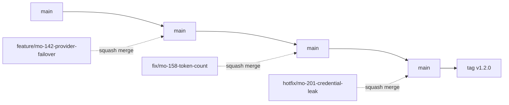
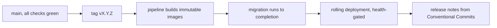
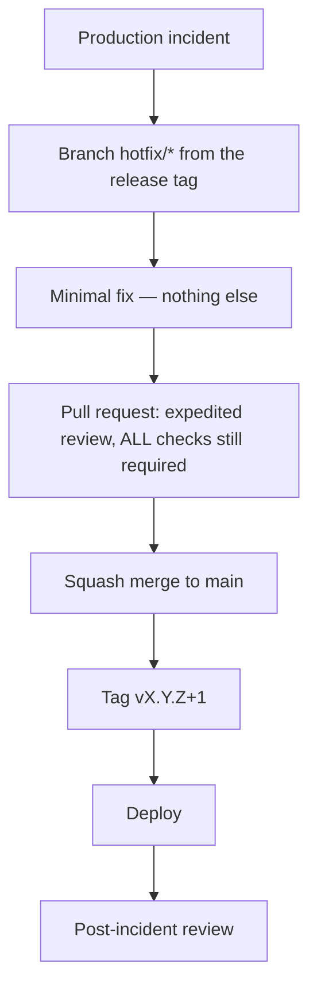

# Git Workflow

| Field | Value |
| --- | --- |
| Document | Git Workflow |
| Version | 1.0 |
| Status | Draft — pending engineering review |
| Owner | Engineering |
| Last updated | 2026-07-30 |
| Audience | All engineers |
| Phase | 8 — Development Standards |

---

## 1. Purpose

This document defines how code moves from a working branch to production: branching, commit
conventions, pull requests, review, merge, release, hotfix, and versioning.

Its aim is a workflow with **as few rules as possible and no ambiguity in the rules that
exist**. A process with many steps gets shortcut under pressure; a process with unclear steps
gets interpreted differently by each engineer.

## 2. Scope

**In scope:** branching model, branch and commit naming, pull request requirements, review
process, merge strategy, release and hotfix workflow, semantic versioning, tagging.

**Out of scope:** CI/CD pipeline definitions ([ADR-0019](../03-adr/ADR-0019-github-actions.md));
what makes a change complete ([`definition-of-done.md`](definition-of-done.md)); API and
schema versioning rules
([`../04-technology/versioning-policy.md`](../04-technology/versioning-policy.md)).

**This document must remain consistent with
[`../04-technology/versioning-policy.md`](../04-technology/versioning-policy.md)**, which is
authoritative on version numbers. Where this document describes tagging, it is describing the
Git mechanics of a decision made there.

---

## 3. Branching strategy

**Trunk-based development with short-lived branches.** Not GitFlow.



**Why not GitFlow.** Parallel `develop` and `release` branches buy very little when a SaaS
product deploys continuously, and they cost a constant merge tax plus the recurring question of
which branch a fix belongs on. Trunk-based keeps one answer: `main`.

| Branch | Purpose | Lifetime |
| --- | --- | --- |
| **`main`** | **Always deployable.** Protected | Permanent |
| `feature/*` | New capability | **< 3 days** |
| `fix/*` | Non-urgent defect | < 3 days |
| **`hotfix/*`** | **Production emergency** | Hours |
| `chore/*` | Tooling, dependencies, CI — no product behaviour change | < 3 days |
| `docs/*` | Documentation only | < 3 days |
| `release/*` | **Optional** — only when a stabilization window is genuinely needed | Days |

### 3.1 `main` protection

| Rule | Statement |
| --- | --- |
| **No direct pushes** | Every change arrives by pull request |
| **All required checks green** | See §6.2 |
| **At least one approval** | Two for security-sensitive areas (§6.3) |
| **Branch up to date** with `main` before merge | Prevents merging against a stale base |
| **Always deployable** | If `main` is broken, fixing it takes priority over all other work |
| Force push | **Prohibited** |

### 3.2 Branch lifetime

**Under three days is a target, not a suggestion.** A long-lived branch diverges from `main`,
accumulates merge conflicts, delays integration feedback, and hides work from the team. A change
that cannot be completed in three days should be decomposed — behind a feature flag if
necessary — not carried on a branch for two weeks.

**Branches are deleted on merge.** Automatically, by the platform.

---

## 4. Branch naming

`<type>/<ticket>-<short-slug>`

| Element | Rule |
| --- | --- |
| Type | One of the six in §3 |
| Ticket | The tracking identifier, lowercase — `mo-142` |
| Slug | kebab-case, ≤ 5 words, describing the change |

**Examples:**

```
feature/mo-142-provider-failover-chain
fix/mo-158-token-count-estimation-flag
hotfix/mo-201-session-revocation-cascade
chore/mo-163-upgrade-npgsql
docs/mo-170-adr-tenant-isolation
release/1.2.0
```

**Ticket references are required** on `feature`, `fix`, and `hotfix`. They are how a change is
traced back to its requirement — which matters for audit and for the release notes. `chore` and
`docs` may omit one where no ticket exists.

---

## 5. Commit message convention

**Conventional Commits.** This is not cosmetic: `type` determines the semantic version
increment (V-2), so an incorrect type produces an incorrect version.

```
<type>(<scope>): <subject>

[body]

[footer]
```

| Type | Meaning | Version impact |
| --- | --- | --- |
| `feat` | New capability | **MINOR** |
| `fix` | Defect fix | **PATCH** |
| `perf` | Performance improvement | PATCH |
| `refactor` | Neither fixes nor adds behaviour | PATCH |
| `docs` | Documentation only | None |
| `test` | Tests only | None |
| `build` | Build system or dependencies | None |
| `ci` | Pipeline configuration | None |
| `chore` | Anything else | None |
| **`feat!` / `BREAKING CHANGE:`** | **Breaking change** | **MAJOR** |

**Scope is the module** — one of the twelve, matching the schema and namespace names:

```
feat(gateway): add ordered fallback chain to routing policies
fix(usage): flag estimated token counts in the ledger
perf(analytics): serve rollups from projections rather than raw records
docs(adr): record tenant isolation decision as ADR-0005
feat(identity)!: require step-up authentication for credential rotation
```

### 5.1 Subject rules

| Rule | Example |
| --- | --- |
| Imperative mood | ✅ `add fallback chain` · ❌ `added fallback chain` |
| Lowercase after the colon | ✅ `add` · ❌ `Add` |
| No trailing period | |
| ≤ 72 characters | |
| **Describe the change, not the file** | ✅ `flag estimated token counts` · ❌ `update UsageRecord.cs` |

### 5.2 Body and footer

The body explains **why**, not what — the diff shows what. Required when the reason is not
obvious from the subject.

**Footer references:**

```
Refs: MO-142
Closes: MO-158
BREAKING CHANGE: routing policies now require an explicit fallback ordinal
```

**A `BREAKING CHANGE:` footer or a `!` marker is required for any change breaking an external
contract** — the API surface, an integration event schema, or a published client library. It
is not required for internal refactoring.

---

## 6. Pull request requirements

### 6.1 Content

| Requirement | Detail |
| --- | --- |
| **Title** | Conventional Commit format — it becomes the squash commit message |
| **Description** | What changed, why, and what a reviewer should look at first |
| **Ticket link** | Required for `feature`, `fix`, `hotfix` |
| **Definition of Done** | Completed checklist ([`definition-of-done.md`](definition-of-done.md)) |
| **Size** | **Target under 400 changed lines.** Larger requires a stated reason |
| **Screenshots** | For user-visible changes |
| **Migration note** | Whether a schema migration is included and whether it is backward-compatible |

**The 400-line target is about review quality, not tidiness.** Review effectiveness falls
sharply with size — beyond a few hundred lines, reviewers stop finding defects and start
approving. A large mechanical change (a rename, a formatting pass) is a legitimate exception
and should say so.

### 6.2 Required checks

All must pass. From [ADR-0019](../03-adr/ADR-0019-github-actions.md):

| Check | Enforces |
| --- | --- |
| Build with **warnings as errors** | Nullability and async correctness |
| Unit and integration tests | Correctness |
| **Architecture tests AT-1 … AT-12** | Layer and module boundaries |
| **Tenant isolation tests** | NFR-SEC-008 |
| **Secret scanning** | NFR-SEC-012 |
| **Dependency vulnerability scan** | Fails on unresolved critical |
| **Portable-implementation smoke test** | NFR-PORT-002 |
| Contract tests | NFR-MAINT-005 |
| Frontend bundle budget | NFR-PERF-009 |
| Accessibility audit | NFR-USE-001 |

**Disabling or bypassing a required check requires architecture review and a recorded reason**
(TD-5). This is the rule most likely to be pressured at a deadline, and it is why it is written
down before the deadline exists.

### 6.3 Approvals

| Area | Approvals |
| --- | --- |
| Standard change | **1** |
| **Security-sensitive** — authentication, authorization, tenancy, credentials, encryption, audit | **2, one from a security-aware reviewer** |
| **Architecture change** — layer or module boundaries, new ADR | **2, including an architecture reviewer** |
| **Database migration** | **2, one reviewing backward compatibility** |
| Documentation only | 1 |

**Authors do not approve their own changes**, including in an emergency. The hotfix path (§9)
reduces process, never review.

---

## 7. Code review process

### 7.1 Expectations

| Party | Expectation |
| --- | --- |
| **Author** | Self-review first. Explain non-obvious decisions in the description. Respond to every comment |
| **Reviewer** | First response within one working day. Work through the checklist. **Approve or request changes — not both** |
| **Both** | Discuss substance in the pull request so the reasoning is recorded |

**Approving with unaddressed concerns teaches authors that concerns are optional.** If something
needs to change, request changes; if it does not, approve and let it go.

### 7.2 Comment conventions

| Prefix | Meaning | Blocks merge? |
| --- | --- | --- |
| **`blocking:`** | Must be addressed | **Yes** |
| `question:` | Author should answer; may or may not lead to a change | Until answered |
| `suggestion:` | Author may take it or leave it | No |
| `nit:` | Trivial preference | No |
| `praise:` | Worth noting when something is done well | No |

**Prefixes exist because tone does not survive text.** Without them, a reviewer's idle thought
reads as an instruction and a genuine blocker reads as a preference.

### 7.3 Review focus

Reviewers use the checklist in
[`coding-standards.md`](coding-standards.md) §18. Priority order when time is limited:

1. **Security** — authorization, tenancy, credentials, injection
2. **Correctness** — including failure paths
3. **Architecture** — boundaries and layering
4. **Data** — migration compatibility, monetary types
5. **Tests** — behaviour rather than lines
6. **Craft** — readability, deletion opportunities

**Formatting is not reviewed.** It is enforced mechanically; a reviewer commenting on it is
spending attention that belongs on the first four categories.

---

## 8. Merge strategy

**Squash merge to `main`. Always.**

| Property | Consequence |
| --- | --- |
| One commit per pull request on `main` | History is a sequence of complete changes |
| The pull request title becomes the commit message | Hence the Conventional Commit format requirement |
| Branch history is discarded | Work-in-progress commits do not reach `main` |
| **`main` history is linear** | Every commit is independently revertible |
| Branch deleted on merge | |

**Why squash rather than merge commits.** A linear history of complete changes makes `git
bisect` meaningful, makes reverting a change a single operation, and produces release notes
directly from commit messages. The cost — losing intermediate commits — is a benefit in
practice: intermediate commits are rarely useful and frequently misleading.

**Rebase-and-merge is not used.** It preserves intermediate commits on `main`, which defeats
the purpose.

---

## 9. Release process

### 9.1 Normal releases — no release branch

**`main` is always deployable, so most releases are a tag on `main`.**



| Step | Detail |
| --- | --- |
| 1 | Confirm `main` is green and the intended commit is the head |
| 2 | Determine the version from Conventional Commits since the last tag (V-2) |
| 3 | **Tag `vX.Y.Z`** — annotated, never lightweight |
| 4 | The pipeline builds images **once** and promotes them |
| 5 | **Migration runs to completion before any new container starts** |
| 6 | Rolling deployment, gated on readiness health checks |
| 7 | Release notes generated from commit messages |

### 9.2 Release branches — the exception

**Created only when a stabilization window is genuinely needed** — for example, a v1.2 release
requiring several days of fixes while `main` continues toward v1.3.

| Rule | Statement |
| --- | --- |
| Named `release/X.Y.0` | |
| **Only fixes** are merged in — no new capability |
| **Every fix lands on `main` first**, then is cherry-picked to the release branch | |
| Tagged from the release branch | |
| Deleted after release | |

**Fixes go to `main` first, always.** The reverse order guarantees that some fix eventually
exists only on a release branch and is lost when the next release ships — a recurring and
entirely avoidable class of regression.

---

## 10. Hotfix workflow

**For production emergencies only:** a security vulnerability, data integrity risk, or
customer-visible outage.



| Rule | Statement |
| --- | --- |
| Branch from | **The deployed release tag**, not `main` — `main` may contain unreleased work |
| Scope | **The minimal fix. Nothing else** |
| **Checks** | **All required checks still run.** Review is expedited, not skipped |
| Approvals | Still required; **authors never self-approve** |
| Merge | Squash to `main`; cherry-pick to any active release branch |
| Version | **PATCH** increment |
| Follow-up | Post-incident review within one week |

**Bypassing checks during an incident is how a second incident is created.** The pressure to
skip them is highest exactly when the risk of doing so is highest — which is why the rule is
written down in advance rather than debated at 3am.

---

## 11. Semantic versioning

Authoritative rules are in
[`../04-technology/versioning-policy.md`](../04-technology/versioning-policy.md) §4. Summary:

`MAJOR.MINOR.PATCH`

| Component | Increment when |
| --- | --- |
| **MAJOR** | A breaking change to any external commitment — API version, event schema, client library |
| **MINOR** | Backward-compatible capability |
| **PATCH** | Backward-compatible fix |

| Rule | Statement |
| --- | --- |
| V-1 | **Every production deployment is tagged** |
| V-2 | **Conventional Commits determine the increment** |
| V-3 | Roadmap names (v1.0, v1.1, v2.0) map to `MAJOR.MINOR` |
| **V-4** | **A version is never reused or re-tagged** |
| V-5 | Pre-release builds use `-beta.N` / `-rc.N` |

**V-3 keeps one numbering scheme.** The roadmap's "v1.1" and the release tag `v1.1.0` are the
same thing — avoiding the common confusion of a "v1.2 release" shipping as `1.4.0`.

---

## 12. Tagging strategy

| Rule | Statement |
| --- | --- |
| Format | `vX.Y.Z` — lowercase `v` prefix |
| Type | **Annotated tags**, never lightweight — they carry author, date, and message |
| Placement | On `main`, or on a release branch where one exists |
| **Immutability** | **A tag is never moved or deleted.** A mistake is corrected by a new version |
| Pre-release | `v1.2.0-rc.1` |
| Signing | Recommended; **required once release provenance is a compliance requirement** |
| Message | Summary plus a link to the release notes |

**V-4's "never re-tag" is worth restating because the temptation is real.** Re-pointing a tag
after a bad build means an artifact someone has already pulled no longer matches the tag it
claims — which breaks the immutable-promotion property that
[ADR-0018](../03-adr/ADR-0018-docker.md) depends on.

---

## 13. Design decisions

| # | Decision | Rationale |
| --- | --- | --- |
| **GW-1** | **Trunk-based, not GitFlow** | Parallel long-lived branches cost a constant merge tax for little benefit in continuous deployment |
| **GW-2** | **Squash merge only** | Linear history; meaningful `bisect`; single-operation revert; release notes from commits |
| **GW-3** | **Branches under three days** | Long branches hide work and delay integration feedback |
| **GW-4** | **Conventional Commits are mandatory** | They determine the version increment — not a style preference |
| **GW-5** | **Two approvals on security, architecture, and migration changes** | The areas where a missed defect is most expensive |
| **GW-6** | **Comment prefixes** | Tone does not survive text; blockers and preferences must be distinguishable |
| **GW-7** | **Approve or request changes, never both** | Approving with concerns makes concerns optional |
| **GW-8** | **Hotfixes reduce process, never checks or review** | Bypassing checks under pressure creates the next incident |
| **GW-9** | **Release-branch fixes land on `main` first** | The reverse order loses fixes at the next release |
| **GW-10** | **Tags are immutable and annotated** | Re-tagging breaks immutable artifact promotion |
| **GW-11** | **Formatting is not reviewed** | It is enforced mechanically; reviewer attention belongs elsewhere |

## 14. Trade-offs

| # | Gained | Given up |
| --- | --- | --- |
| T-1 | Trunk-based simplicity | Less isolation for long-running work; requires feature flags |
| T-2 | Squash merge — clean linear history | Intermediate commits lost; large changes become one opaque commit |
| T-3 | Short branches | Work must be decomposed, which takes design effort |
| T-4 | Mandatory Conventional Commits | Friction on every commit; incorrect types produce incorrect versions |
| T-5 | Two approvals on sensitive areas | Slower merge on exactly the changes that are often urgent |
| T-6 | Small pull requests | More pull requests to manage; some changes are genuinely large |
| T-7 | All checks on hotfixes | Slower emergency response — accepted deliberately |

## 15. Future improvements

- **Automated version determination and tagging** from Conventional Commits, removing the
  manual step in §9.1.
- **Generated release notes** grouped by module scope.
- **Commit message linting** in a pre-commit hook, so malformed messages are caught before
  review rather than at merge.
- **Merge queue** once concurrent pull request volume makes "up to date with `main`" a
  bottleneck.
- **Signed tags and commits** — likely driven by a supply-chain provenance requirement for
  SOC 2 rather than by internal preference.
- **Automatic reviewer assignment** by `CODEOWNERS`, particularly for the security-sensitive
  paths requiring two approvals.
- **Stale branch alerting** at three days, making GW-3 visible rather than aspirational.

## 16. Cross references

| Document | Relationship |
| --- | --- |
| [`../04-technology/versioning-policy.md`](../04-technology/versioning-policy.md) | **Authoritative on version numbers** — V-1 … V-5 |
| [`definition-of-done.md`](definition-of-done.md) | The pull request checklist |
| [`coding-standards.md`](coding-standards.md) | §18 review checklist |
| [`testing-strategy.md`](testing-strategy.md) | What the required checks run |
| [`../03-adr/ADR-0019-github-actions.md`](../03-adr/ADR-0019-github-actions.md) | The gating checks |
| [`../03-adr/ADR-0018-docker.md`](../03-adr/ADR-0018-docker.md) | Immutable image promotion; migration ordering |
| [`../02-architecture/deployment-architecture.md`](../02-architecture/deployment-architecture.md) | §3.7 deployment process |
| `README.md` | Repository-level conventions |
