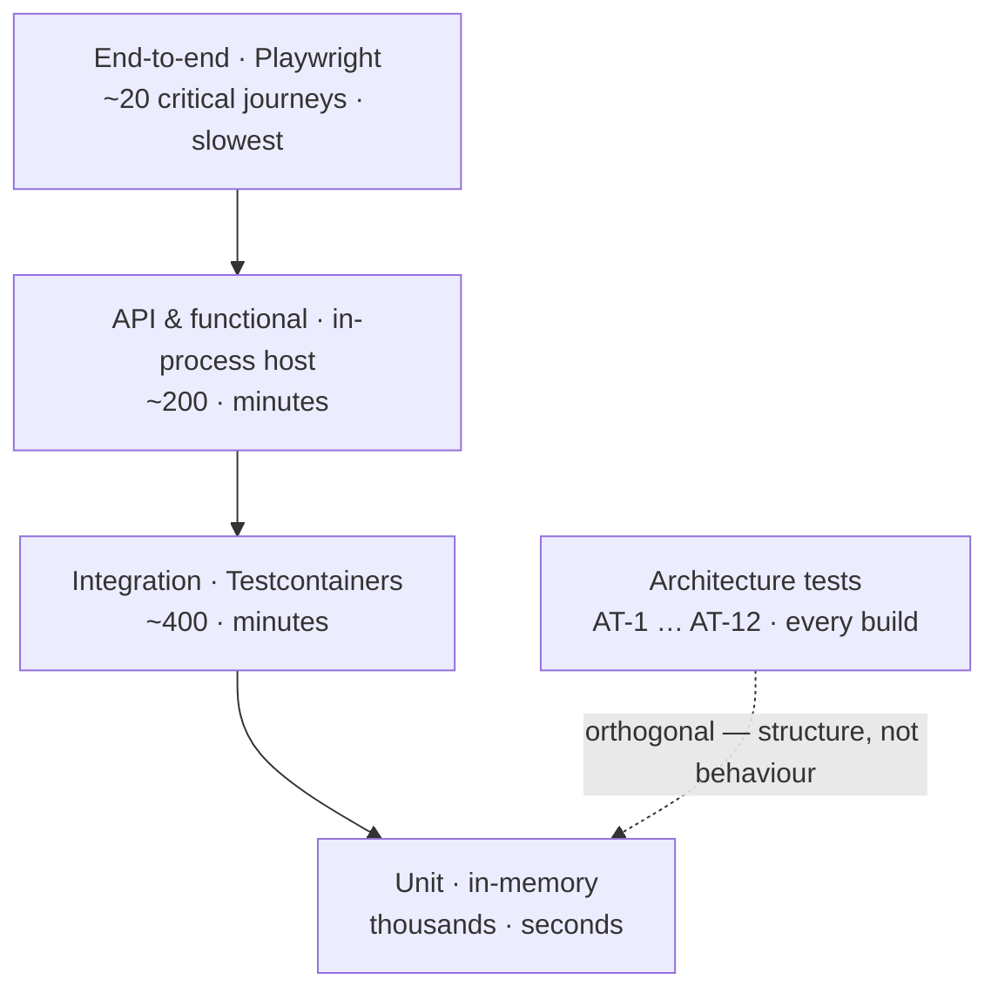

# Testing Strategy

| Field | Value |
| --- | --- |
| Document | Testing Strategy |
| Version | 1.0 |
| Status | Draft — pending engineering review |
| Owner | Engineering & QA |
| Last updated | 2026-07-30 |
| Audience | Engineering, QA, Security |
| Phase | 8 — Development Standards |

---

## 1. Purpose

This document defines what MaintOrbit AI tests, at which level, with what tooling, and to what
standard.

**Testing here carries an unusual weight.** Several of the platform's core claims are only
credible because they are verified continuously: tenant isolation, unsampled audit capture,
zero ledger loss, and the equivalence of the Gateway hot path with the standard pipeline. These
are not quality-assurance niceties — they are **the evidence behind commitments made to
customers**, and three of them are release gates with no tolerance.

## 2. Scope

**In scope:** the testing pyramid, unit, integration, API, end-to-end, performance, and security
testing, test data management, mocking, coverage, regression, contract testing, and test
environments.

**Out of scope:** CI pipeline definitions ([ADR-0019](../03-adr/ADR-0019-github-actions.md));
completion criteria ([`definition-of-done.md`](definition-of-done.md)); language-level test
conventions ([`../04-technology/coding-standards.md`](../04-technology/coding-standards.md) §8).

---

## 3. Testing pyramid

| Level | Count | Speed | Runs |
| --- | --- | --- | --- |
| **Unit** | Thousands | Seconds | Every build |
| **Integration** | ~400 | Minutes | Every build |
| **API / functional** | ~200 | Minutes | Every build |
| **End-to-end** | ~20 | Slow | Every build (critical path) |
| **Architecture** | ~12 rules | Seconds | Every build |
| Performance | Scenarios | Long | Per release |
| Security | Suites | Varies | Per build + annually |

**Architecture tests sit outside the pyramid** because they verify *structure*, not behaviour.
They are the cheapest and highest-leverage tests in the system: twelve rules that keep
[ADR-0001](../03-adr/ADR-0001-clean-architecture.md) and
[ADR-0002](../03-adr/ADR-0002-modular-monolith.md) real rather than advisory.

**The pyramid shape is a consequence, not a target.** Tests exist at the level where the
behaviour is genuinely determined. Counting tests per level to hit a ratio produces
low-value tests at the bottom and gaps at the top.

---

## 4. Unit testing

**Scope:** domain and application logic in isolation. No database, no network, no filesystem.

| Aspect | Decision |
| --- | --- |
| Framework | **xUnit** |
| Assertions | **Shouldly**, or FluentAssertions **v7** — v8+ requires a commercial licence |
| Substitutes | **NSubstitute** — chosen over Moq, which introduced a contentious telemetry dependency |
| Data generation | Bogus, via builders |
| Naming | `Method_Scenario_ExpectedResult` |
| Projects | `MaintOrbit.Domain.UnitTests`, `MaintOrbit.Application.UnitTests` |

**What unit tests are for here:**

| Target | Why it belongs at this level |
| --- | --- |
| **Domain invariants** | An entity must be unconstructible in an invalid state; a unit test is the cheapest place to prove it |
| **Value object behaviour** | Money arithmetic, token counting, identifier equality |
| **Cost calculation** | NFR-DATA-003's 2% tolerance — deterministic, arithmetic-heavy, ideal for unit testing |
| **Error classification** | Retry and fallback eligibility per provider error category |
| Command and query handlers | With ports substituted |
| Validators | Every command handler has one (AT-6) |
| Pipeline behaviours | Ordering is a correctness property and must be asserted |

**What unit tests must not do:**

| Anti-pattern | Why |
| --- | --- |
| Test the framework | EF Core and ASP.NET Core are already tested |
| Assert on implementation detail | A test that breaks on refactoring without behaviour change is a liability |
| Substitute the type under test | |
| **Test row-level security** | It cannot be tested without a real database — see §5 |

---

## 5. Integration testing

**Scope:** components against **real** infrastructure. This is where the platform's most
important guarantees are verified.

| Aspect | Decision |
| --- | --- |
| Database | **Real PostgreSQL via Testcontainers** |
| Cache | **Real Redis (or Valkey) via Testcontainers** |
| Object storage | **The portable S3-compatible implementation** — the CI default |
| Reset between tests | Respawn |
| Project | `MaintOrbit.Infrastructure.IntegrationTests` |

**Real infrastructure is not negotiable.** An in-memory database provider does not implement
row-level security, does not enforce partitioning, does not exhibit the connection-pooling
behaviour that DD-2 concerns, and does not reproduce the query plans that determine whether
NFR-PERF-010 is achievable. Testing against one would verify that the code compiles, not that
it works.

### 5.1 The tests that are release gates

| # | Test | Assertion | Gate |
| --- | --- | --- | --- |
| **IT-1** | **Tenant isolation, per relation** | A query under Company A's context returns **zero** rows belonging to Company B | 🔴 |
| **IT-2** | **Unset tenant context, per relation** | With no session variable set, **every** tenant-scoped relation returns zero rows | 🔴 |
| **IT-3** | **Connection pooling safety** | Under concurrent multi-tenant load across many pooled checkouts, **no request observes another Company's context** | 🔴 |
| **IT-4** | **Policy coverage** | Every tenant-scoped table has a row-level security policy | 🔴 |
| **IT-5** | **Elevated-role enumeration** | Only enumerated code paths request the elevated database role | 🔴 |
| **IT-6** | **Ledger immutability** | `UPDATE` and `DELETE` against ledger tables are rejected | 🔴 |
| **IT-7** | **Ingestion deduplication** | Redelivering a stream entry produces no duplicate ledger row | 🔴 |
| **IT-8** | **Job idempotency** | Every background job produces the same state when run twice | 🔴 |

**IT-2 must be written per relation, not sampled.** A single unprotected table is a leak, and
there is no partial credit. This is a case where an exhaustive, mechanically-generated test is
appropriate.

**IT-3 is currently the highest-value test that does not yet exist.** It verifies the
unresolved DD-2 pooling question, and the failure it guards against — a pooled connection
carrying a stale tenant context — presents as an ordinary successful query rather than an error.
It cannot be found by inspection.

### 5.2 Other integration coverage

Repository behaviour under real query planning; migration forward-compatibility; interceptor
behaviour (tenant, audit, outbox, soft delete); outbox atomicity under rollback; Redis
cache invalidation and tombstone semantics; partition creation and pruning.

---

## 6. API testing

**Scope:** the HTTP surface, in-process, with real infrastructure behind it.

| Aspect | Decision |
| --- | --- |
| Host | In-process test host |
| Project | `MaintOrbit.Api.FunctionalTests` |
| Authentication | Real tokens issued through the real authentication path |

| Focus | Assertion |
| --- | --- |
| **Authorization at execution** | Every endpoint rejects an unauthorized caller **with the correct permission and scope** |
| **Cross-tenant references** | Return `404`, never `403` |
| **Error envelope** | Consistent `type` values across every endpoint |
| **`X-Correlation-Id`** | Present on every response, including errors |
| **Idempotency** | A replayed key returns the original outcome without re-execution |
| **Optimistic concurrency** | `If-Match` mismatch returns `409` |
| Pagination | Keyset cursors are stable and complete |
| Rate limiting | `429` carries `Retry-After` and the scope that applied |
| Validation | All field errors returned together, with precise paths |

**Contract tests are a distinct concern** — see §11.

---

## 7. End-to-end testing

**Scope:** critical user journeys through the real browser against a deployed stack.

| Aspect | Decision |
| --- | --- |
| Tool | **Playwright** |
| Location | `tests/e2e/` |
| Accessibility | **axe-core, as a build gate** (NFR-USE-001) |
| Count | **~20 journeys.** Deliberately few |

**The journeys worth this cost:**

1. Sign up → create Company → connect a provider → **first governed request** *(the G1.3 onboarding metric)*
2. Sign in with password + MFA
3. Sign in with OAuth2
4. Developer creates a Platform API Key → calls the Gateway → sees the Usage Record
5. Employee holds a Chat conversation with streaming
6. Administrator sets a Budget → threshold alert fires
7. Administrator rotates a Provider Connection **with no request interruption**
8. Auditor searches and exports the audit log
9. **Deprovisioning revokes sessions and API keys** *(the P-07 persona's stated test)*
10. Analytics view renders with a freshness indicator

**End-to-end tests are expensive and brittle**, so they are kept few and reserved for journeys
where the integration of many components is the thing under test. Everything else belongs
lower in the pyramid.

---

## 8. Performance testing

| Aspect | Decision |
| --- | --- |
| Tool | **k6** |
| Location | `tests/load/` |
| Cadence | **Per release**, plus continuous production measurement |

| Scenario | Target |
| --- | --- |
| Gateway overhead — p50 / p95 / p99 | **15 / 50 / 100 ms** |
| First streamed token | ≤ 50 ms |
| Per-chunk overhead | ≤ 5 ms |
| Sustained throughput | ≥ 500 req/s |
| Peak throughput, 5 minutes | ≥ 2,000 req/s |
| Concurrent streaming connections | ≥ 10,000 |
| Analytics, 30-day range | ≤ 3 s p95 |
| **Analytics at NFR-SCAL-007 volume** | **The partition-pruning question** |

**Two performance questions are genuinely open and must be answered by measurement, not
assertion:**

**Is the 15 ms hot-path budget achievable with every stage enabled?** It has never been
measured end-to-end. If it is not, the response ladder is: profile allocations, co-locate
governance evaluation, extract the Gateway — and only then reconsider the budget, which is a
product decision.

**Does row-level security prevent partition pruning?** If the planner cannot prune with policies
applied, NFR-PERF-010 is unreachable at 500 million records and the analytics API surface must
be constrained to pre-aggregated shapes — a **contract** consequence, not just a performance one.

**The latency benchmark is currently reporting-only, not gating.** Benchmark noise on shared CI
runners makes it unreliable as a gate, but NFR-PERF-018 requires continuously measured,
published overhead — and a target nobody enforces regresses. Making it gating requires a stable
measurement environment and is an open engineering question (§15).

---

## 9. Security testing

| Layer | Approach | Cadence |
| --- | --- | --- |
| **Tenant isolation** | IT-1 … IT-5 | **Every build** |
| **Secret scanning** | Build gate | Every build |
| **Dependency vulnerability scan** | Build gate; fails on unresolved critical | Every build |
| **Architecture tests** | AT-1 … AT-12 | Every build |
| Static analysis | Analyzer rules as errors | Every build |
| **Authorization matrix** | Every endpoint × every role | Per release |
| **Failure injection** | Every fail-open and fail-closed classification | Per release |
| **Independent penetration test** | External | **Before GA, then annually** |

### 9.1 Failure-injection testing

**NFR-AVAIL-015 requires *observed* failure behaviour, not asserted.** Every classification in
[ADR-0021](../03-adr/ADR-0021-fail-open-fail-closed.md) is a hypothesis until injected.

| Injected failure | Expected |
| --- | --- |
| Redis cache unavailable | Gateway rejects — **fail closed** |
| Redis counters unavailable | Gateway rejects — fail closed |
| Redis streams unavailable | **Request succeeds; failure alerted** — fail open |
| PostgreSQL unavailable | **Gateway continues from cache**; management path fails |
| One provider unavailable | Fallback to the next target |
| All providers unavailable | Normalized exhaustion error |
| Worker host down | Requests succeed; ingestion buffers |
| Audit write failure | **Request succeeds; incident raised** |

**The PostgreSQL row is worth verifying deliberately.** That the Gateway survives database loss
is a genuine and somewhat surprising resilience property of the cache-only hot path, and it is
worth confirming it has not been lost to a well-meaning change.

### 9.2 Security test cases derived from the threat model

Each residual risk in [`../05-security/threat-model.md`](../05-security/threat-model.md) §7 has
a corresponding test where one is possible: refresh token reuse revokes the family;
deprovisioning cascade leaves nothing resolvable; a ciphertext moved between Companies fails to
authenticate; an unsanitized completion cannot execute; a client-supplied tenant identifier is
ignored.

---

## 10. Test data management

| Rule | Statement |
| --- | --- |
| **TD-1** | **No production data in any test environment** — ever |
| **TD-2** | Test data is **generated**, not copied |
| TD-3 | Builders with sensible defaults; tests override only what they assert on |
| TD-4 | Each test creates its own data; **no shared fixtures across tests** |
| TD-5 | Respawn resets between integration tests |
| **TD-6** | **Multi-tenant tests use at least two Companies** — a single-tenant test cannot detect an isolation failure |
| TD-7 | Realistic volumes for performance tests; synthetic generation at scale |
| TD-8 | No real credentials, real email addresses, or real personal data |

**TD-1 is a security control, not a testing convention.** Copying a production database into a
test environment moves conversation content, encrypted credentials, and audit history into a
weaker security context — the single most common way well-secured systems leak.

**TD-6 is the rule that makes isolation testing meaningful.** A test that creates one Company
and queries it will pass whether or not the policy exists.

---

## 11. Mocking strategy

**Substitute at architectural boundaries. Use the real thing everywhere else.**

| Dependency | Approach | Why |
| --- | --- | --- |
| **Database** | **Real, via Testcontainers** | Row-level security, partitioning, and query plans cannot be substituted |
| **Cache** | **Real, via Testcontainers** | Atomic counter and stream semantics matter |
| Object storage | **Real portable implementation** | Also keeps the portable path exercised |
| **AI providers** | **Substituted** | Cost, non-determinism, rate limits, and network dependency |
| Payment processor | Substituted, plus the provider's sandbox in a separate suite | |
| Email delivery | Substituted | |
| Time | **Always substituted** via the time abstraction (AT-9) | Deterministic tests |
| Ports declared in Application | Substituted in unit tests | The layer boundary |
| **Repositories** | **Not substituted in integration tests** | Substituting them tests nothing about persistence |

**Provider substitution requires recorded real responses**, not invented ones. Error
classification determines retry and fallback eligibility, and a hand-written error shape that
does not match reality produces resilience logic that is wrong in production and right in tests.

---

## 12. Coverage goals

| Target | Value | Enforcement |
| --- | --- | --- |
| **Domain and application logic** | **≥ 80%** | 🔒 Build gate (NFR-MAINT-004) |
| Infrastructure | Meaningful paths | Not gated |
| `Api` project | Covered by functional tests | Not gated |
| Frontend | Components and hooks | Reported |

**Coverage measures execution, not correctness.** It catches untested code; it says nothing
about whether tested code is right. A module at 95% coverage with assertions that never fail is
worse than one at 70% with tests that would catch a real defect — because the first creates
confidence and the second creates none.

**It is therefore a floor, not a target**, and no one should be optimizing it. The stronger
signals are: does every domain invariant have a test that fails when the invariant is removed;
does every background job have an idempotency test; does every fail-open/closed classification
have an injection test.

---

## 13. Regression testing

| Rule | Statement |
| --- | --- |
| **RG-1** | **Every defect fix ships with a test that fails without the fix** |
| RG-2 | The test is written **before** the fix, and observed to fail |
| RG-3 | It is placed at the lowest level that reproduces the defect |
| RG-4 | The full suite runs on every build; there is no separate regression suite |
| **RG-5** | **Flaky tests are defects** — quarantined immediately, fixed, and never retried into passing |

**RG-2 is the step most often skipped**, and skipping it means the test may pass for reasons
unrelated to the fix. A test never observed to fail is a test of unknown value.

**RG-5 matters more than it appears.** A flaky gate trains people to re-run rather than
investigate, and once that habit forms every gate loses credibility — including the ones
guarding tenant isolation.

---

## 14. Contract testing

**Two distinct contract surfaces**, both required by NFR-MAINT-005.

### 14.1 External API contracts

| Aspect | Decision |
| --- | --- |
| Location | `tests/contract/` |
| Gate | **Every build** |
| Asserts | Documented response shapes; **stable error `type` values**; backward-compatibility within `/api/v1`; specification matches implementation |

**The compatibility matrix from
[`../07-api/api-specification.md`](../07-api/api-specification.md) §11.3 is directly testable**
and should be: adding an optional field passes; removing a response field fails; changing an
existing error `type`'s meaning fails.

### 14.2 Integration event contracts

| Aspect | Decision |
| --- | --- |
| Asserts | Events are serializable; carry **no domain object references** (AT-7); are versioned; consumers tolerate unknown fields |
| **Why now** | Currently low cost — publisher and consumer deploy together. **After module extraction, version skew becomes normal** and these tests become the thing preventing an outage |

---

## 15. Test environments

| Environment | Purpose | Data | Lifetime |
| --- | --- | --- | --- |
| **Local** | Development | Generated | Developer machine |
| **CI** | Every build | **Ephemeral containers per run** | Minutes |
| **Staging** | Pre-release verification | Generated, production-like volume | Persistent |
| **Performance** | Load and latency measurement | Synthetic at scale | On demand |
| **Production** | — | Real | — |

| Rule | Statement |
| --- | --- |
| **EV-1** | **No production data in any non-production environment** |
| **EV-2** | **No secret crosses an environment boundary** |
| **EV-3** | The **portable** key custodian and object storage are the CI default — this is what keeps NFR-PORT-002 true |
| EV-4 | CI containers are ephemeral; no state carries between runs |
| EV-5 | Staging runs the same topology as production, at smaller scale |
| **EV-6** | **The single-host topology is exercised in CI** — it is the self-hosted evaluation product |

**EV-3 and EV-6 are doing more work than they appear to.** If only the cloud-backed custodian
and multi-host topology are ever exercised, both portable paths rot silently — and the failure
surfaces at v2.1 self-hosted deployment, with a customer waiting.

---

## 16. Design decisions

| # | Decision | Rationale |
| --- | --- | --- |
| **TS-1** | **Integration tests use real PostgreSQL and Redis** | Row-level security, partitioning, and pooling cannot be substituted |
| **TS-2** | **Tenant isolation is tested per relation, exhaustively** | One unprotected table is a leak; there is no partial credit |
| **TS-3** | **Multi-tenant tests use at least two Companies** | A single-tenant test cannot detect an isolation failure |
| **TS-4** | **Coverage is a floor, not a target** | It measures execution, not correctness |
| **TS-5** | **Flaky tests are defects, quarantined immediately** | A flaky gate destroys trust in all gates |
| **TS-6** | **Every defect fix ships with a test observed to fail first** | Otherwise the test may pass for unrelated reasons |
| **TS-7** | **Provider substitutes use recorded real responses** | Invented error shapes produce resilience logic that is wrong in production |
| **TS-8** | **Failure injection is required per release** | NFR-AVAIL-015 requires observed, not asserted, behaviour |
| **TS-9** | **~20 end-to-end journeys, deliberately few** | Expensive and brittle; reserved for genuine integration |
| **TS-10** | **The portable custodian and single-host topology run in CI** | The only reliable guard against portable paths rotting |
| **TS-11** | **Event contract tests exist before extraction makes them necessary** | Cannot be retrofitted into a running stream |
| **TS-12** | **No production data in any test environment** | A security control, not a convention |

## 17. Trade-offs

| # | Gained | Given up |
| --- | --- | --- |
| T-1 | Real infrastructure in integration tests | Slower builds; container overhead; against the 15-minute budget |
| T-2 | Exhaustive per-relation isolation tests | Test count grows with the schema |
| T-3 | Few end-to-end tests | Some integration defects reach staging |
| T-4 | Coverage gate at 80% | Risk of coverage-driven low-value tests |
| T-5 | Recorded provider responses | Must be refreshed when providers change |
| T-6 | Failure injection per release | Significant setup; a release-cycle cost |
| T-7 | Flaky tests quarantined immediately | Temporary loss of that test's coverage |

## 18. Future improvements

- **Make the latency benchmark gating**, once a stable measurement environment exists. This is
  the most valuable pending improvement — NFR-PERF-018 requires published measured overhead, and
  an unenforced target regresses.
- **Mutation testing in the domain layer** — a genuine correctness signal, particularly for
  invariants and cost calculation, where coverage says little.
- **Property-based testing** for cost calculation and token accounting.
- **Continuous failure injection** in staging rather than only per release.
- **Automated generation of the per-relation isolation tests** from the schema, so a new table
  cannot be added without one.
- **Contract tests generated from the API specification** once it is machine-readable.
- **Test selection by changed path**, to protect the build-time budget as the suite grows.

## 19. Cross references

| Document | Relationship |
| --- | --- |
| [`definition-of-done.md`](definition-of-done.md) | Which tests gate completion |
| [`coding-standards.md`](coding-standards.md) | The rules these verify |
| [`git-workflow.md`](git-workflow.md) | §6.2 required checks |
| [`../04-technology/coding-standards.md`](../04-technology/coding-standards.md) | §8 test conventions X-1 … X-8 |
| [`../04-technology/backend-technologies.md`](../04-technology/backend-technologies.md) | §11 test packages |
| [`../03-adr/ADR-0019-github-actions.md`](../03-adr/ADR-0019-github-actions.md) | Gating checks |
| [`../03-adr/ADR-0021-fail-open-fail-closed.md`](../03-adr/ADR-0021-fail-open-fail-closed.md) | §9.1 injection targets |
| [`../05-security/security-checklist.md`](../05-security/security-checklist.md) | Release gates G-1 … G-10 |
| [`../05-security/threat-model.md`](../05-security/threat-model.md) | §9.2 threat-derived cases |
| [`../06-database/database-design.md`](../06-database/database-design.md) | §5.4 isolation verification |
| [`../07-api/api-specification.md`](../07-api/api-specification.md) | §11.3 compatibility matrix |
| [`../01-product/non-functional-requirements.md`](../01-product/non-functional-requirements.md) | §15 verification methods |
